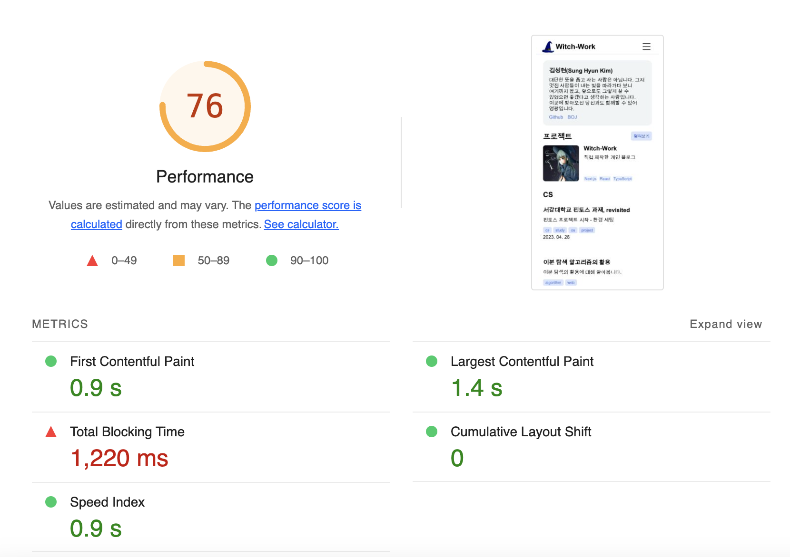

아직 정말..수많은 문제가 있다. 하지만 Vercel로 옮기면서 많은 문제를 해결할 수 있을 거라 믿는다. 하나씩 해결해보자.

# 1. Lighthouse 검사

웹 페이지의 품질을 검사하는 구글의 오픈소스 Lighthouse로 내 페이지를 진단해 보았다. [크롬 익스텐션](https://chrome.google.com/webstore/detail/lighthouse/blipmdconlkpinefehnmjammfjpmpbjk)으로 간단하게 진단 보고서를 얻을 수 있었다.



대충 접근성과 SEO는 괜찮고, 성능은 별로이며 Best Practice도 미흡하다. PWA도 아직 멀었다고 한다. 특히 성능과 같은 경우 나머지 요소는 다 괜찮은데 Total blocking time(사용자가 페이지와 상호작용할 수 있기까지 걸리는 시간)이 1220ms로 처참하다. [TBT가 300ms 아래로 내려와야 좋은 점수를 받을 수 있는데](https://web.dev/tbt/#%EC%A2%8B%EC%9D%80-tbt-%EC%A0%90%EC%88%98%EB%8A%94-%EB%AC%B4%EC%97%87%EC%9D%B8%EA%B0%80%EC%9A%94) 그 4배 이상 걸리는 것이다.

이를 하나하나 개선해서 좋은 점수를 받을 수 있도록 해보자. 특히 성능 최적화를 열심히 하자. 생각나는 대로 최적화한 기록을 순서대로 쓴다. 어떻게 최적화하는지 몰라서 하나하나 찾아가며 했기 때문에 순서는 좀 뒤죽박죽이다.

# 2. 이미지 최적화 첫번째

지금 내 블로그의 가장 큰 문제는 앞서 보았든 로딩이 너무 느리다는 것이다. NextJS에서는 여러 이미지 최적화를 지원하기에 이것부터 해보자.

일단 Nextjs의 이미지 최적화를 켠다. `next.config.js`에서 아까 Cloudflare 때문에 꺼놨던 image 최적화를 켜주자. 적어도 메인 페이지에서는 next/image의 `Image` 컴포넌트만 사용하고 있기 때문에 이게 모두 적용될 것이다.

```ts
const { withContentlayer } = require('next-contentlayer');

/** @type {import('next').NextConfig} */
const nextConfig = {
  images:{
    unoptimized:false,
  },
  reactStrictMode: false,
  swcMinify:false,
};

module.exports = (withContentlayer(nextConfig));
```

# 3. getStaticProps로 연산 이동

메인 페이지를 보면 지금 `Home` 컴포넌트 내에서 계속 `getSortedPosts`를 호출하고 있다. 이 부분은 빌드 이후에 특별히 바뀌는 부분이 아니므로 `getStaticProps`로 이동시키자. 이렇게 하면 빌드 시에만 호출되기 때문에 빌드 시간이 좀 늘어날 수도 있겠지만, 빌드된 페이지는 빠르게 로딩될 것이다.

일단 `src/pages/index.tsx`의 `Home`컴포넌트에서 `getSortedPosts`를 호출하는 부분을 지우고, `src/pages/index.tsx`의 `getStaticProps`를 다음과 같이 수정한다.

```tsx
/* getStaticProps에서 쓰이는 타입 */
interface CardProps{
  title: string;
  description: string;
  image?: string;
  date: string;
  tags: string[];
  url: string;
}
/* 필요한 요소들만 객체에서 뽑아내는 함수 */
function propsProperty(post: DocumentTypes) {
  const { title, description, date, tags, url } = post;
  return { title, description, date, tags, url };
}

export const getStaticProps: GetStaticProps = () => {
  const categoryPostMap: {[key: string]: CardProps[]}={};

  blogCategoryList.forEach((category)=>{
    categoryPostMap[category.url]=getSortedPosts()
      .filter((post: DocumentTypes)=>{
        return post._raw.flattenedPath.split('/')[0]===category.url.split('/').pop();
      })
      .slice(0, 3)
      .map((post: DocumentTypes)=>{
        return propsProperty(post);
      });
  });

  return { props: { categoryPostMap } };
};
```

이렇게 하면 `{"카테고리 URL":[카테고리에 속한 글 목록 상위 3개]}`가 담긴 객체가 페이지 컴포넌트의 props로 넘어간다. 이를 이용해서 아까와 똑같이 글 목록을 보여주자.

```tsx
export default function Home({
  categoryPostMap
}: InferGetStaticPropsType<typeof getStaticProps>) {
  return (
    <main className={styles.pagewrapper}>
      <div className={styles.container}>
        <Profile />
        {/* 프로젝트 목록을 만들기 */}
        <ProjectList />
        <article>
          {/* 카테고리별 글 목록을 만들기 */}
          {blogCategoryList.map((category) => {
            const categoryPostList=categoryPostMap[category.url];

            return categoryPostList.length?
              <Category 
                key={category.title} 
                title={category.title} 
                url={category.url} 
                items={categoryPostList}
              />:null;
          })}
        </article>
      </div>
    </main>
  );
}
```

# 참고

Lighthouse 사용 https://velog.io/@dell_mond/Lighthouse-%EC%82%AC%EC%9A%A9%EB%B2%95

Lighthouse의 결과 지표들 https://medium.com/jung-han/%EB%9D%BC%EC%9D%B4%ED%8A%B8%ED%95%98%EC%9A%B0%EC%8A%A4-%EC%84%B1%EB%8A%A5-%EC%A7%80%ED%91%9C-%EC%82%B4%ED%8E%B4%EB%B3%B4%EA%B8%B0-83df3dc96fb9

네이버의 SEO 문서 https://searchadvisor.naver.com/guide/seo-basic-intro

Next 이미지 최적화하기 https://fe-developers.kakaoent.com/2022/220714-next-image/