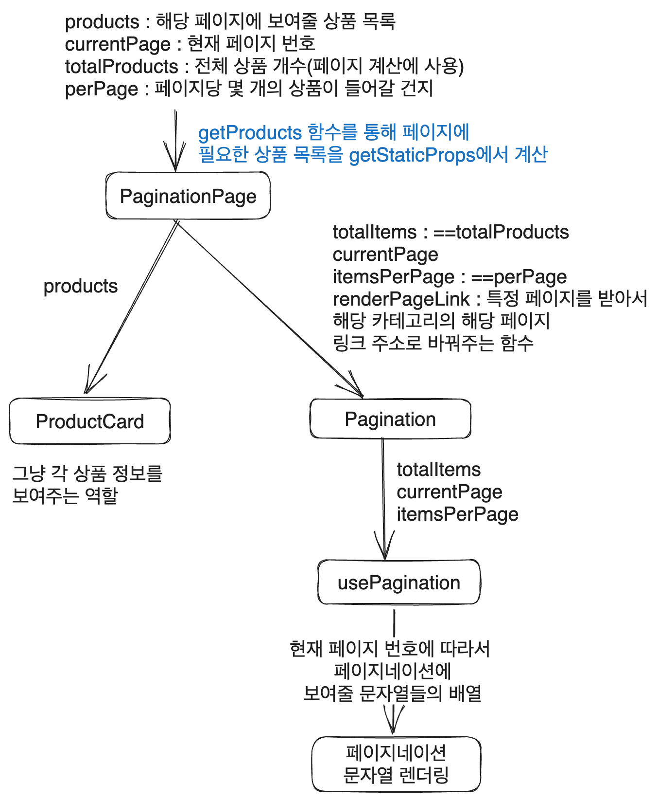

# 1. 글 목록 - 이미지 최적화

글 목록 페이지와 글 상세 페이지를 약간 최적화한다. 가장 글이 많은 개발 카테고리의 글 목록 페이지를 lighthouse로 조회해 보자.


처참하다. 그럼 lighthouse의 제안과 진단을 볼까?


아까처럼 이미지에 적당한 크기를 주라고 한다. Card 컴포넌트에서 Image 태그에 sizes를 지정하자.

```jsx
function Card(props: Props) {
/* 생략 */
  <Image 
    className={styles.image} 
    src={image} 
    alt={`${image} 사진`} 
    width={200} 
    height={200}
    sizes='200px'
  />
/* 생략 */
}
```

# 2. 글 목록 - 페이지네이션

그리고 DOM 사이즈를 줄이라는 조언이 있었다. DOM에 1620개나 되는 요소들이 있다고 한다. 자식이 110개나 있는 요소도 있고. 이런 식으로 DOM 크기가 너무 크고 child 노드도 많으면 메모리 사용량이 늘고 스타일 계신이 너무 길어지며 레이아웃 리플로우(문서 내 요소의 위치를 계산되는 프로세스)도 오래 걸리게 된다. 

안 그래도 글 목록 페이지의 길어진 스크롤이 불편하던 참이었다. Vercel 템플릿에서 [SSG 페이지네이션](https://vercel.com/templates/next.js/pagination-with-ssg)코드가 공개되어 있길래 이를 사용해 보았다.

먼저 동적 라우트를 사용해야 하기 때문에 동적 라우트 폴더를 새로 만들자. `pages/posts/[category]` 내에 동적 라우트가 있어야 하는데 여기에는 이미 `[category]/[slug]` 라는 동적 라우트가 있다. 따라서 `pages/posts/[category]/page/[page]/index.tsx`로 동적 라우트를 새로 만들었다. 

이렇게 하면 `/posts/category/page/2(페이지번호)` 이런 식으로 페이지네이션을 할 수 있다. [동적 라우트를 2개 쓰는 것도 가능은 하지만 좋은 패턴이 아니라고 한다.](https://stackoverflow.com/questions/59790906/nextjs-how-to-handle-multiple-dynamic-routes-at-the-root)


## 2.1. Vercel Template 분석

Vercel template에서 어떻게 페이지네이션을 구현했는지 분석하였다. 실제 템플릿은 [pagination-with-ssg template](https://vercel.com/templates/next.js/pagination-with-ssg)에서 확인할 수 있다.

이 템플릿은 페이지별로 상품의 목록을 보여주는 페이지네이션을 구현한 것이다. 이 템플릿의 핵심 로직을 나름대로 분석하면 다음과 같다.



이를 내 블로그의 현재 구조에 맞게 적절히 변경하여 구성해 보자.

`PaginationPage`컴포넌트

## 2.1. CategoryPagination 컴포넌트

기존에 쓰던 카테고리 페이지의 컨텐츠 부분을 따와서 `CategoryPagination` 컴포넌트를 만들었다. 템플릿의 PaginationPage 컴포넌트의 props에 현재 카테고리까지 props로 받아 오도록 했고 단순히 이를 보여주는 기능만 일단 구현했다.

```tsx
// src/components/categoryPagenation/index.tsx
import Card from '../card';

import styles from './styles.module.css';

export interface PostMetaData{
  title: string;
  description: string;
  image?: string;
  date: string;
  tags: string[];
  url: string;
}

interface Props{
  totalItemNumber: number;
  category: string;
  currentPage: number;
  postList: PostMetaData[];
  perPage: number;
}

function CategoryPagination(props: Props) {
  const {category, currentPage, postList}=props;
  return (
    <>
      <h1 className={styles.title}>
        {`${category} 주제 ${currentPage} 페이지`}
      </h1>
      <ul className={styles.list}>
        {postList.map((post: PostMetaData) =>{
          return (
            <li key={post.url}>
              <Card {...post} />
            </li>
          );
        })}
      </ul>
    </>
  );
}

export default CategoryPagenation;
```

그러면 `src/pages/posts/[category]/index.tsx` 페이지의 컴포넌트 구조는 `CategoryPagenation`를 사용하여 다음과 같이 바뀐다. 

```tsx
// src/pages/posts/[category]/index.tsx
/* 페이지당 몇 개의 글이 보이는가 */
export const ITEMS_PER_PAGE=10;

function PostListPage({
  category, categoryURL, postList,
}: InferGetStaticPropsType<typeof getStaticProps>) {
  /* SEOInfo 객체 정보 생략 */
  return (
    <>
      <NextSeo {...SEOInfo} />
      <PageContainer>
        <CategoryPagination 
          category={category}
          currentPage={1}
          postList={postList}
          totalItemNumber={postList.length}
          perPage={ITEMS_PER_PAGE}
        />
      </PageContainer>
    </>
  );
}
```

postList는 `getStaticProps`에서 잘 계산하여 props로 넘겨주어, 각 페이지별로 특정 개수의 글들만 목록에 보이도록 해야 한다.

다만 그전에 먼저 필요한 컴포넌트들을 모두 구현하자.

## 2.3. 페이지네이션 컴포넌트

페이지네이션 컴포넌트란 다음과 같이 현재 페이지 위치와 링크를 통한 페이지 이동을 하게 해주는 컴포넌트다.


이 컴포넌트를 만들기 위해 `src/components/categoryPagination/pagination/index.tsx`를 만들고 작성하자.


## 2.2. 페이지네이션 개별 페이지

`src/pages/posts/[category]/page/[page]/index.tsx`를 작성하여 개별 페이지의 내용을 구현하자.

개별 페이지를 구현하기 위해선 뭐가 필요할까? 일단 해당 페이지의 글을 가져와야 한다. 이는 이전에 글을 가져오는 데에 쓰던 `getSortedPosts`함수를 쓸 수도 있다. 

하지만 여기서는 우리가 지금 해야 하는 작업 즉 특정 카테고리의 특정 페이지의 글을 가져오는 로직을 새로운 함수로 만들자. `src/utils/post.ts`에 `getCategoryPosts` 함수를 만들었다.

category와 현재 페이지 그리고 페이지당 몇 개의 글이 들어가는지를 인수로 받는 함수이다. 그러면 함수 내에선 `getSortedPosts`의 결과에서 먼저 인수로 받은 category에 해당하는 글만 뽑아낸다. 그다음은 `currentPage`와 `postsPerPage`를 이용해서 현재 페이지에 해당하는 글 목록만 슬라이싱해서 배열로 가져온다.

이때 pagePosts뿐 아니라 totalPostNumber 즉 해당 카테고리에 속한 글의 개수도 리턴하는 것을 볼 수 있다. 이는 이후 페이지네이션 컴포넌트(페이지를 이동하는 데 쓰이는 컴포넌트)를 구현하는 데에 쓰일 것이다.

```ts
interface PageInfo{
  category: string;
  currentPage: number;
  postsPerPage: number;
}

export const getCategoryPosts = (info: PageInfo) => {
  const { category, currentPage, postsPerPage } = info;
  const allDocumentsInCategory = getSortedPosts().filter((post: DocumentTypes)=>
    post._raw.flattenedPath.startsWith(category));

  const pagenatedPosts= allDocumentsInCategory.slice(
    (currentPage-1)*postsPerPage, 
    currentPage*postsPerPage
  );

  return {pagePosts:pagenatedPosts, totalPostNumber: allDocumentsInCategory.length};
};
```

그럼 이제 개별 페이지에서는 이 함수를 사용해서 맞는 카테고리의 해당 페이지에 필요한 글을 가져온 후 보여주기만 하면 된다.

페이지당 몇 개의 글 Card를 보여줄지를 정하는 변수를 정의하자.

```tsx
// src/pages/posts/[category]/page/[page]/index.tsx
/* 페이지당 몇 개의 글이 보이는가 */
export const ITEMS_PER_PAGE=10;
```

`getStaticPaths`를 작성해보자. 여기서는 각 카테고리별로 필요한 페이지들의 경로를 생성해서 `paths`로 리턴해 주면 된다. 다음과 같이 작성한다.

```tsx
export const getStaticPaths: GetStaticPaths = async () => {
  const paths=[];
  for (const category of blogCategoryList) {
    const categoryURL=category.url.split('/').pop();
    for (let i=1;i<=5;i++) {
      paths.push(`/posts/${categoryURL}/page/${i}`);
    }
  }
  return {
    paths,
    // Block the request for non-generated pages and cache them in the background
    fallback: 'blocking',
  };
};
```

`blogCategoryList`에 있는 모든 카테고리들에 대해서 `/posts/[카테고리]/page/[페이지번호]`에 해당하는 URL 경로를 생성해주고 있다. 그런데 코드를 보면 페이지 번호를 1부터 5까지만 생성한다. 만약 글이 50개(정확히는 `5*ITEMS_PER_PAGE`개)를 넘어가면 다음 페이지는 어떻게 들어갈까?

이를 위해서 `getStaticPaths`리턴 객체의 fallback을 `blocking`으로 설정했다. 이렇게 하면 [Incremental Static Regeneration](
https://nextjs.org/docs/pages/building-your-application/data-fetching/incremental-static-regeneration)으로 페이지가 렌더링된다. 

이 ISR 로직은 다음과 같다. `getStaticPaths`에서 생성되지 않은 페이지가 처음으로 요청되면 일단 서버사이드 렌더링을 한 후 이를 캐싱하고 백그라운드에서 새로운 페이지를 생성한다. 그리고 해당 페이지에 대한 다음 요청부터는 정적 페이지로 제공한다. 따라서 사이트를 빌드한 후에도 정적 페이지가 새로 생성되도록 할 수 있게 된다. 

5페이지를 넘어가면 아무래도 사용자가 해당 페이지를 요청할 확률이 적어지므로 적절한 조치라고 할 수 있겠다.

`getStaticProps`를 작성해보자. params로 받을 수 있는 정보는 category와 page인데 각 페이지에 몇 개의 글이 들어가는지는 이미 상수로 정의해 놓았으므로 이를 이용하면 페이지를 위한 정보를 모두 받아올 수 있다.

`getCategoryPosts`를 이용해서 페이지의 글을 모두 받아오고, map을 이용해서 PostMetaData의 image에 `post._raw.thumbnail`을 대응시킨다. 이렇게 만든 객체 배열을 리턴값으로 넘긴다.

이때 만약 페이지 정보에 해당하는 글이 없으면 404 페이지를 띄워줘야 하고 1페이지에 대한 요청은 `/posts/[category]`로 리다이렉트 시켜줘야 한다. 같은 내용에 대한 2가지 라우트를 막기 위함이다.

```tsx
export const getStaticProps: GetStaticProps = async ({
  params,
}: GetStaticPropsContext) => {
  const page: number = Number(params?.page) || 1;
  const {pagePosts, totalPostNumber} = await getCategoryPosts({
    category:params?.category as string, 
    currentPage:page,
    postsPerPage:ITEMS_PER_PAGE
  });

  const pagePostsWithThumbnail=pagePosts.map((post: DocumentTypes) => {
    const { title, description, date, tags, url } = post;
    const metadata={title, description, date, tags, url};
    return 'thumbnail' in post._raw ? 
      ({...metadata, image: post._raw.thumbnail} as PostMetaData) :
      metadata;
  });

  const {title:category, url:categoryURL}=blogCategoryList.find((c: {title: string, url: string})=>
    c.url.split('/').pop()===params?.category) as {title: string, url: string};

  if (!pagePostsWithThumbnail.length) {
    return {
      notFound: true,
    };
  }
  
  if (page===1) {
    return {
      redirect: {
        destination: `/posts/${params?.category}`,
        permanent: false,
      },
    };
  }

  return {
    props: {
      category,
      categoryURL,
      pagePosts:pagePostsWithThumbnail,
      totalPostNumber,
      currentPage:page,
    },
    revalidate: 60 * 60 * 24, // <--- ISR cache: once a day
  };
};
```

이렇게 하니까 배포시 에러가 뜬다. 다 비슷한 에러인데 그중 하나를 가져오면 다음과 같다.

```
Error: `redirect` can not be returned from getStaticProps during prerendering (/posts/cs/page/1)
```

페이지가 프리렌더링될 때 redirect를 리턴할 수 없다는 에러다. 빌드 시에 페이지를 구성하면서 `getStaticProps`에서 리턴한 값이 페이지 컴포넌트의 props로 들어가는데 이때 redirect를 리턴하면 페이지 구성에 문제가 생기는 것 같다.

우리의 목적은 사실 1페이지에 대한 요청을 `/posts/[category]`로 리다이렉트 시키는 것이다. 이를 위해서는 그냥 `getStaticPaths`에서 1페이지에 대한 경로를 생성하지 않으면 된다.

`getStaticPaths`를 다음과 같이 수정하자.

```tsx
export const getStaticPaths: GetStaticPaths = async () => {
  const paths=[];
  for (const category of blogCategoryList) {
    const categoryURL=category.url.split('/').pop();
    /* 이렇게 수정해서 /page/1 경로가 생기지 않도록 했다 */
    for (let i=0;i<5;i++) {
      paths.push(`/posts/${categoryURL}/page/${i+2}`);
    }
  }
  return {
    paths,
    fallback: 'blocking',
  };
};
```

이제 빌드가 잘 되고 페이지 URL로 접근해 보면 페이지에도 잘 들어가진다.


# 참고

https://uxplanet.org/ux-infinite-scrolling-vs-pagination-1030d29376f1

브라우저 리플로우 최소화 https://developers.google.com/speed/docs/insights/browser-reflow?utm_source=lighthouse&utm_medium=lr&hl=ko

https://vercel.com/templates/next.js/pagination-with-ssg

https://nextjs.org/docs/pages/api-reference/functions/get-static-paths#fallback-blocking

Incremental Static Regeneration
https://nextjs.org/docs/pages/building-your-application/data-fetching/incremental-static-regeneration

tag manager 잘 쓰기 https://stackoverflow.com/questions/75521259/how-to-solve-reduce-the-impact-of-third-party-code-third-party-code-blocked-t

https://web.dev/tag-best-practices/

이미지 로딩이 느린 이슈 https://github.com/vercel/next.js/discussions/21294#discussioncomment-4479278

https://junheedot.tistory.com/entry/Next-Image-load-super-slow

https://nextjs.org/docs/messages/sharp-missing-in-production

vercel edge function https://vercel.com/docs/concepts/functions/edge-functions