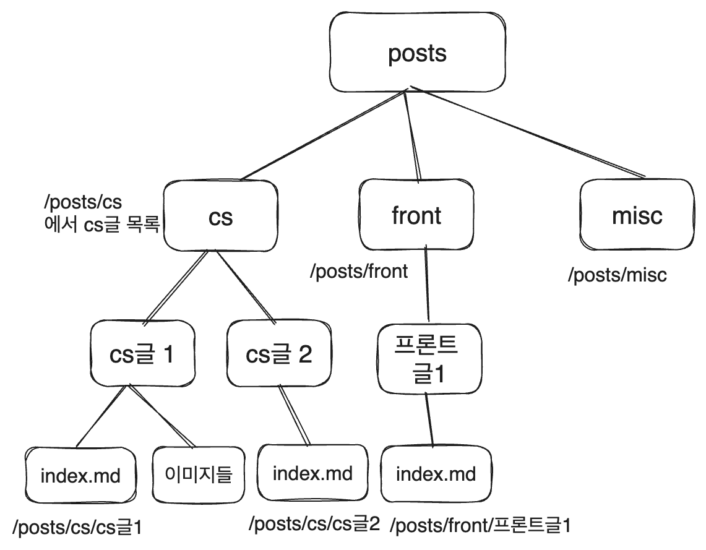
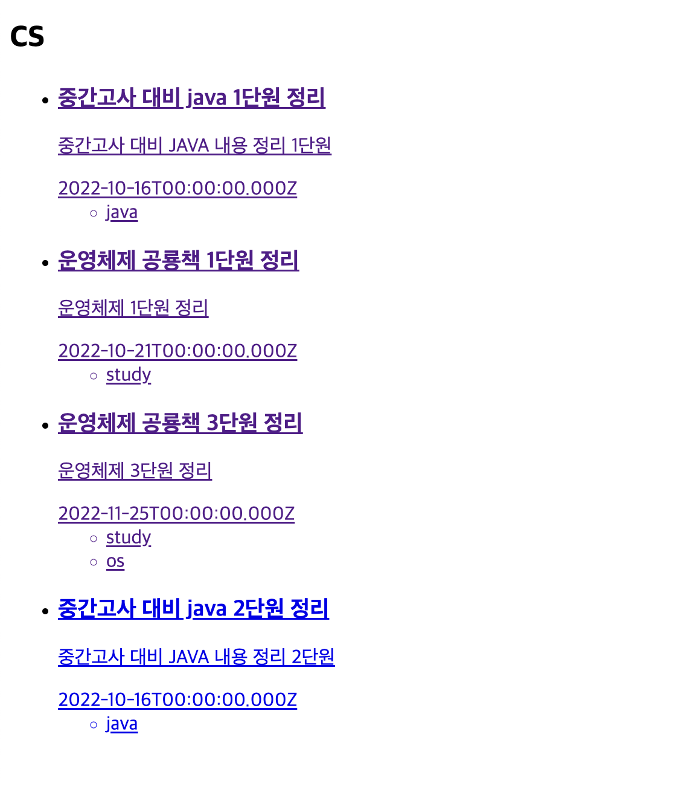

# 블로그 만들기 시리즈

- [1. 기본 세팅](https://witch.work/posts/dev/blog-remake-1)
- [2. 메인 페이지의 HTML 설계](https://witch.work/posts/dev/blog-remake-2)
- [3. 글 상세 페이지의 구조 설계](https://witch.work/posts/dev/blog-remake-3)
- [4. 이미지를 상대 경로로 쓸 수 있도록 하기](https://witch.work/posts/dev/blog-remake-1)
- [5. 자잘한 페이지 구성 개선과 배포](https://witch.work/posts/dev/blog-remake-5)
- [6. 페이지 요소의 배치 설계](https://witch.work/posts/dev/blog-remake-6)
- [7. 메인 페이지 컴포넌트 디자인](https://witch.work/posts/dev/blog-remake-7)
- [8. 글 목록/내용 페이지 컴포넌트 디자인](https://witch.work/posts/dev/blog-remake-8)
- [9. 글 썸네일 자동 생성하기](https://witch.work/posts/dev/blog-remake-9)
- [10. 폰트, 카드 디자인 등의 디자인 개선](https://witch.work/posts/dev/blog-remake-10)
- [11. 글에 조회수 달기](https://witch.work/posts/dev/blog-remake-11)
- [12. 페이지 테마와 글 검색 기능](https://witch.work/posts/dev/blog-remake-12)
- [13. 테마 아이콘과 썸네일 레이아웃 개선 등](https://witch.work/posts/dev/blog-remake-13)

- [메인 페이지의 연산 최적화](https://witch.work/posts/dev/blog-opt-1)
- [글 목록 페이지네이션 만들기](https://witch.work/posts/dev/blog-opt-2)
- [이미지를 CDN에 올리고 placeholder 만들기](https://witch.work/posts/dev/blog-opt-3)
- [검색 페이지에 무한 스크롤 구현하기](https://witch.work/posts/dev/blog-opt-4)

이번에는 블로그의 글 상세 페이지를 만들어 보자. 일단 마크다운을 따와 보자. 아래 참고에 적어 놓은 페이지들을 많이 참고하였다.

# 1. 마크다운 가져오기

## 1.1. contentlayer 설치+설정

contentlayer라는 라이브러리를 가져오면 쉽게 할 수 있다. 필요한 라이브러리를 설치해 주자.

```
npm install contentlayer next-contentlayer rehype-highlight rehype-pretty-code shiki
```

그리고 `next.config.js`에 다음과 같이 설정하여 contentlayer 플러그인 등록

```js
// next.config.js
const { withContentlayer } = require('next-contentlayer');

/** @type {import('next').NextConfig} */
const nextConfig = {
  reactStrictMode: true,
  swcMinify:false,
};

module.exports = withContentlayer(nextConfig);
```

`tsconfig.json`에서 import 경로 alias 설정

```json
//tsconfig.json
// 출처 https://yiyb-blog.vercel.app/posts/nextjs-contentlayer-blog
{
  // ...
  "compilerOptions": {
    // ...
    "paths": {
      "@/contentlayer/generated": ["./.contentlayer/generated"],

      "@/contentlayer/generated/*": ["./.contentlayer/generated/*"]
    }
    // ...
  },
  "include": [
    "next-env.d.ts",
    "**/*.ts",
    "**/*.tsx",
    "./.contentlayer/generated"
  ]
}
```

## 1.2. contentlayer.config.js 설정

이제 `contentlayer.config.js`을 만들고 정의해야 한다. 여기서는 markdown파일을 어떻게 변환할 것인지를 설정한다.

일단 우리가 글에 넣을 메타데이터는 제목, 설명, 작성일, 태그들 정도가 생각난다. 이를 정의해 주자. 나의 영원한 프론트 리드 [이창희](https://xo.dev/)의 [블로그 코드](https://github.com/blurfx/ambienxo)에서 슬쩍해 왔다.

```js
const postFields={
  fields:{
    title:{
      type:'string',
      description:'The title of the post',
      required:true,
    },
    description: {
      type: 'string',
      description: 'The description of the post for preview and SEO',
    },
    date: {
      type: 'date',
      description: 'The date of the post',
      required: true,
    },
    tags: {
      type: 'list',
      of: { type: 'string' },
      description: 'The tags of the post',
    },
  },
  computedFields: {
    url: { type: 'string', resolve: (post) => `/posts/${post._raw.flattenedPath}` },
  },
};
```

이렇게 객체로 만든 이유는, `.md`파일과 `.mdx`파일을 따로 취급해 줘야 하기 때문이다. 다음과 같이 documentType을 2개 만들어 주자. 이렇게 documentType을 만들어 주면 contentlayer에서는 `filePathPattern`에 쓰인 파일 형식의 파일들을 자동으로 가져와서 `.contentlayer/generated`내의 `name`으로 정의된 폴더에 넣어 준다.

예를 들어 다음과 같이 정의하면 `.md`파일은 `.contentlayer/generated/Post`폴더에, `.mdx`파일은 `.contentlayer/generated/MDXPost`폴더에 넣어 준다.

```js
export const Post = defineDocumentType(() => ({
  name: 'Post',
  filePathPattern: '**/*.md',
  contentType:'markdown',
  ...postFields,
}));

export const MDXPost = defineDocumentType(() => ({
  name: 'MDXPost',
  filePathPattern: '**/*.mdx',
  contentType: 'mdx',
  ...postFields,
}));
```

그리고 github에서 제공하는 마크다운 확장(자동 링크, 각주, 표 등등)을 사용하도록 해주는 remark-gfm 설치

```
npm install remark-gfm
```

그리고 내 어플리케이션의 구성을 makeSource를 통해서 contentlayer에게 전달한다. 이때 플러그인 `remarkGfm`과 `rehypePrettyCode`를 import하는 걸 잊지 말자.

```js
const rehypePrettyCodeOptions = {
  theme: {
    light: 'github-light',
    dark: 'github-dark',
  },
};

export default makeSource({
  // 마크다운 파일이 저장되어 있는 루트 폴더 내 경로
  contentDirPath: 'posts',
  // 사용할 document type
  documentTypes: [MDXPost, Post],
  // 각 contentType별로 사용할 플러그인 정의
  markdown: {
    remarkPlugins: [remarkGfm],
    rehypePlugins: [[rehypePrettyCode, rehypePrettyCodeOptions]],
  },
  mdx: {
    remarkPlugins: [remarkGfm],
    rehypePlugins: [[rehypePrettyCode, rehypePrettyCodeOptions]],
  },
});
```

# 2. 글 상세 페이지

## 2.1. posts 페이지 내의 md, mdx 파일 동적 라우트

이제 글들을 이용해서 동적 라우터를 만들어야 한다. 이를 위해서는 getStaticPaths로 필요한 페이지 라우트를 생성하고, getStaticProps로 params를 이용해서 페이지별로 필요한 작업을 해야 한다. 

일단 루트의 `posts`폴더에 md파일이 바로 들어 있는 상황에서 동적 라우트를 생성해 보자. `pages/posts/[slug].tsx` 생성.

이때 contentlayer가 변환해 준 모든 파일은 `.contentlayer/generated`의 `allDocument`에 저장되어 있다. `allPosts`를 통해서 변환된 md파일을, `allMDXPosts`를 통해서 변환된 mdx파일을 가져올 수도 있지만 그냥 한번에 다 가져오자.

그리고 `.contentlayer/generated`에서 변환된 데이터가 어떻게 저장되는지 보면서 getStaticPaths를 작성하자. posts 뒤에 올 동적 경로는 `_raw.flattenedPath`에 저장되어 있다. 따라서 다음과 같이 작성하면 된다.

```tsx
export const getStaticPaths: GetStaticPaths = () => {
  const paths = allDocuments.map(({_raw})=>{
    return {
      params: {
        slug: _raw.flattenedPath,
      },
    };
  });
  return {
    paths,
    fallback: false,
  };
};
```

getStaticProps에서는 `params.slug`와 같은 `_raw.flattenedPath`를 가진 문서를 찾아서 page에 Props로 넘겨주면 된다.

```tsx
export const getStaticProps: GetStaticProps= ({params})=>{
  const post = allDocuments.find(
    (p) => p._raw.flattenedPath === params?.slug
  )!;
  return {
    props: {
      post,
    },
  };
};
```

이제 마크다운의 몇 가지 정보들을 가져와서 동적 라우트가 잘 만들어졌는지 보자. 다음 페이지에서 간단하게 글 상세 페이지를 설계할 것이다.

## 2.2. 글 상세 페이지 설계

md, mdx를 구분해서 넣어 줘야 한다. 이를 무엇으로 구분할 수 있을까? `.contentlayer/generated`의 변환 파일을 보면, `post.body` 객체에 `code` 속성이 있는지로 구분할 수 있다. mdx 파일 변환 결과에는 `post.body.code`속성이 있다.

md 파일의 경우 dangerouslySetInnerHTML을 이용하여 내용을 넣어주고, mdx 파일의 경우 contentlayer에서 제공하는 useMDXComponent를 사용하자.

dangerouslySetInnerHTML은 XSS 공격을 당할 가능성이 있어서 보안 위험이 있지만 여기서 출처가 될 문자열은 내가 올린 마크다운 파일뿐이므로 큰 문제는 없을 것이다.

일단 mdx 파일의 경우 `post.body.code`를 사용해야 하는데 md 파일의 경우 이게 없다. 따라서 이를 그냥 `PostPage` 내에서 사용할 시 undefined의 속성을 읽는다는 에러가 발생한다. 이게 있을 경우만 사용하는 MDXComponent 컴포넌트를 만들어 주자.

```tsx
import { useMDXComponent } from 'next-contentlayer/hooks';

interface MDXProps{
  code: string;
}

function MDXComponent(props: MDXProps) {
  const MDX = useMDXComponent(props.code);
  return <MDX />;
}
```

그 다음 이를 사용하는 PostPage 컴포넌트를 간단한 HTML 구조만 써서 만들어 주자. 스타일링은 일단 생각하지 말고.

```tsx
function PostPage({
  post
}: InferGetStaticPropsType<typeof getStaticProps>) {

  return (
    <article>
      <h1>{post.title}</h1>
      <time>{post.date}</time>
      <ul>
        {post.tags.map((tag: string)=><li key={tag}>{tag}</li>)}
      </ul>
      {'code' in post.body?
        <MDXComponent code={post.body.code}/>:
        <div dangerouslySetInnerHTML={{ __html: post.body.html }} />
      }
    </article>
  );
}
```

이렇게 하면 현재 post에 있는 모든 속성을 표시하는 글 상세 페이지가 만들어진다.

# 3. 동적 라우트의 개선

## 3.1. 동적 라우트 개선 - 글 상세 페이지

사실 현재 생각하기로는 `/posts`폴더의 하위 폴더를 통해서 글들을 분류하고 싶다. 예를 들어서 `/posts` 내에 A,B,C,D..폴더가 있고 각각의 내부에 글들이 있다면 `/posts/A`, `/posts/B`... 이런 동적 라우트가 자동으로 생기고 각 하위 폴더 내부의 글들에 대해서도 `posts/A/Apost1`, `posts/A/Apost2`... 이런 식으로 동적 라우트가 자동으로 생기도록 하고자 한다.

현재 만들고 싶은 글 분류는 cs, 프론트, 그 외 잡스러운 것들이 생각나는데, 그러니까 이런 식으로 분류하고 싶은 것이다.



먼저 프로젝트 루트 디렉토리에 `/posts/cs`, `/posts/front`, `/posts/misc` 폴더를 만들었다.

그리고 `posts/[category]`폴더를 생성. 그리고 위 그림과 같은 라우트를 어떻게 구현할지 한번 생각해 보자.

우리가 생각하는 동적 라우트 구조에서 동적인 요소를 `[]`로 감싸서 나타내 본다면, 글 상세 페이지는 `/posts/[category]/[slug]`가 되겠다. 글 목록 페이지는 `/posts/[category]` 가 될 것이고.

이때 `category`는 `cs`, `front`, `misc` 중 하나가 되고, `slug`는 각 폴더 내의 파일 이름이 된다. 이들을 어떻게 동적으로 가져올까? 글 상세 페이지에선 간단하다. 

먼저 `pages/posts/[slug].tsx`에 있던 내용을 `pages/posts/[category]/[slug].tsx`로 옮기고 기존 `[slug].tsx]`는 삭제한다. 놔두면 `[category]`폴더와 역할이 겹치게 되기 때문이다.

위에서 썼던 `allDocument`를 이용하여 각 문서의 변환 데이터에 접근하고, `_raw.flattenedPath`를 split해서 각 요소를 가져오는 등의 방법으로 동적으로 가져올 수 있을 것이다. 뭐 이런 것이다.

```tsx
export const getStaticPaths: GetStaticPaths = () => {
  const paths = allDocuments.map(({_raw})=>{
    const pathList=_raw.flattenedPath.split('/');
    return {
      params: {
        category: pathList[0],
        slug: pathList[1],
      },
    };
  });
  return {
    paths,
    fallback: false,
  };
};
```

그리고 `getStaticProps`의 경우에도 해당 페이지에 맞는 문서를 가져오기 위해 slug뿐 아니라 상위 경로인 category도 사용하도록 변경한다. 글을 렌더링하는 컴포넌트는 그대로 두면 된다.

```tsx
export const getStaticProps: GetStaticProps= ({params})=>{
  const post = allDocuments.find(
    (p) => {
      const temp=p._raw.flattenedPath.split('/');
      return temp[0] === params?.category && temp[1] === params?.slug;
    }
  )!;
  return {
    props: {
      post,
    },
  };
};
```

이때 만약 `[category]/index.tsx`가 아직 없으며 `posts` 폴더에 md가 폴더에 들어가 있는 게 아니라 직접 들어가 있다면 `_raw.flattenedPath`를 split한 결과가 하나밖에 없는 글 변환 데이터가 생기게 되므로 위의 `getStaticProps`에서 `temp[1]`이 없어서 에러가 뜬다. 따라서 완전해지기 위해선 다음 섹션의 글 목록 페이지를 만들어야 한다.

하지만 위의 조건을 피해서 `posts`태그 안에 글(index.md)을 담은 하위 폴더들만 둔다면 동적 라우트가 잘 만들어질 것이다.

## 3.2. 동적 라우트 개선 - 글 목록 페이지

이제 글 목록 페이지다. `posts/[category]`에서는 `category`만 동적으로 가져와야 한다. 

위에서 썼던 예의 `flattenedPath`를 split한 후 적절한 인덱스를 가져올 수도 있다. 아마 `post._raw.flattenedPath.split('/')[0]`을 하면 맞을 것이다.

하지만 그렇게 하면 같은 category를 가진 글이 여러 개씩 있을 것이므로 같은 라우트에 대한 작업을 여러 번 하게 된다. 내부적으로 최적화를 하는 것 같아서 같은 페이지에 대한 생성을 여러 번 하는 것 같지는 않다. 하지만 중복 작업이 좋은 건 아니다. 따라서 각 category를 유일하게 만들고자 했다.

(실험을 통해 추측컨대 아마 해당 라우트에 해당하는 뭔가가 여러 개 있으면 가장 최근의 것만 정적 페이지로 만들고 이후의 요청은 만들어진 페이지를 리턴해 주는 듯 하다)

그 자체가 어렵진 않다. `post._raw.flattenedPath.split('/')[0]`들을 가져와서 `Map`따위를 이용해서 중복을 없애는 방식도 가능할 테고, fs 모듈을 사용해서 폴더명을 가져올 수도 있다. 지금 당장 내게 생각나지 않는 더 좋은 방법도 있을 것이다. 하지만 앞서 말한 방식들이 뭔가 깔끔해 보이진 않는다.

그런데 지금 카테고리가 그렇게 많이 필요할까? 지금 생각한 카테고리는 3개 정도고, 이 카테고리들이 블로그 헤더에 들어갈 것을 고려할 때 현재 블로그 레이아웃에서 카테고리가 5개 이상으로 늘어날 것 같지는 않다. 따라서 그냥 `blog-category.ts`를 만들어서 여기에 내가 필요한 카테고리를 담아 놓자.

다음과 같은 파일을 작성하였다. 타입에 들어갈 정보는 추후 늘어날 수도 있겠지만 일단 카테고리 제목과 링크 URL 정도로 했다.

```ts
// blog-category.ts
interface Category{
  title: string;
  url: string;
}

const categoryList: Category[] = [
  {title:'CS', url:'/posts/cs'},
  {title:'Front', url:'/posts/front'},
  {title:'Misc', url:'/posts/misc'},
];

export default categoryList;
```

자. 이제 `pages/posts/[category]/index.tsx`를 만들어 보자. 일단 `getStaticPaths`는 `blog-category.ts`를 import하고 다음과 같이 작성하면 된다.

```tsx
import categoryList from 'blog-category';

/* 중간 내용들 */

export const getStaticPaths: GetStaticPaths=()=>{
  const paths=categoryList.map((category)=>{
    return {
      params: {
        // blog-category에는 대소문자가 섞여서 써있으므로 소문자 변환
        category:category.title.toLowerCase(),
      },
    };
  });
  return {
    paths,
    fallback: false,
  };
};
```

`getStaticProps`에서는 뭘 하면 될까? params를 통해서 category를 받으므로, 이 카테고리에 해당하는 글들을 모조리 가져온 다음 글 목록에 보여줘야 하는 정보만 골라서 페이지 컴포넌트에 props로 넘겨주면 된다. 또한 카테고리 제목도 페이지 props로 넘겨주자. 주제별 글 목록에선 당연히 보여줘야 할 테니까.

```tsx
export const getStaticProps: GetStaticProps = ({params}) => {
  const allDocumentsInCategory = allDocuments.filter((post)=>
  // 여기서 category 타입은 string | string[] | undefined 이므로 string으로 강제해 줘야 함
    post._raw.flattenedPath.startsWith(params?.category as string
    ));

  const postList = allDocumentsInCategory.map((post) => ({
    title: post.title,
    description: post.description,
    date: post.date,
    tags: post.tags,
    url: post.url,
  }));
  // params.category는 카테고리 제목이므로 페이지에서 표시하도록 넘겨주자
  return { props: { category:params?.category, postList } };
};
```

이제 `blog-category.ts`에서 가져온 카테고리들에 대해서 각각의 페이지가 만들어지고, 페이지 컴포넌트에는 해당 카테고리에 속한 글들의 정보 중 일부(제목, 설명, 생성일 etc.)가 props로 넘어가게 된다. 이제 이 정보를 이용해서 글 목록 페이지를 만들어 보자.

# 4. 글 목록 페이지 설계

이제 각 카테고리별로 이 글들을 보여줄 목록 페이지를 간단히 구조만 잡아 보고 다음 글로 넘어가서 슬슬 색 같은 걸 좀 넣고 자잘한 개선들을(혹은 버그 수정) 해보자. 지금은 HTML뿐이기 때문에 블로그 페이지를 보면 눈이 썩을 것 같다. 물론 [motherfucking website](https://motherfuckingwebsite.com/)같은 디자인을 목표로 할 수도 있겠지만, 내 블로그인데 그렇게 하고 싶지는 않다.

## 4.1. Card 컴포넌트 재사용

생각해 보면 글 미리보기도 그냥 Card 컴포넌트를 쓸 수 있다. 제목, 설명, 이미지, 생성일, URL을 이미 Card에서 props로 받고 있으니까. 스타일링의 편의성을 생각하면 다른 컴포넌트를 쓰는 게 나을 수도 있겠지만 나는 의미상 비슷한 컴포넌트를 굳이 분리하고 싶지는 않다. 나중에 스타일링하다가 정 미칠 것 같으면 분리하겠지만 여기서는 재사용을 해보자.

Card 컴포넌트가 태그를 받을 수 있도록 조금만 수정하자.

```tsx
// src/components/card/index.tsx
interface Props{
  title: string;
  description: string;
  image?: string;
  date: string;
  // 타입에 태그 추가. 일단 선택으로 남겨두었다.
  tags?: string[];
  url: string;
}

function Card(props: Props) {
  // 여기서 tags도 구조 분해 할당해주는 것을 잊지 말자
  const { title, description, image, date, tags, url } = props;
  return (
    <article>
      <Link href={url}>
        {
          image ? <Image src={image} alt={`${title} 사진`} width={50} height={50} /> : null
        }
        <h3>{title}</h3>
        <p>{description}</p>
        <time>{date}</time>
        {
          // 태그 렌더링 부분이 추가됨
          tags?<ul>{tags.map((tag: string)=><li key={tag}>{tag}</li>)}</ul>:null
        }
      </Link>
    </article>
  );
}
```

## 4.2. 글 목록 페이지 구조

글 목록 페이지에서는 category, postList를 props로 받는다. category는 h1태그를 통해 제목으로, postList는 ul 컴포넌트 내부에 Card 컴포넌트를 통해 보여주면 된다.

```tsx
// pages/posts/[category]/index.tsx
interface PostMetaData{
  title: string;
  description: string;
  date: string;
  tags: string[];
  url: string;
}

function PostListPage({
  category, postList,
}: InferGetStaticPropsType<typeof getStaticProps>) {
  return (
    <main>
      <h1>{category}</h1>
      <ul>
        {postList.map((post: PostMetaData) => 
          <li key={post.url}>
            <Card {...post} />
          </li>
        )}
      </ul>
    </main>
  );
}

export default PostListPage;
```

이렇게 하고 나면 각 카테고리 페이지에서 글 목록을 보여줄 수 있다. 예를 들어 나는 cs라는 카테고리를 만들었으니 `/posts/cs`로 접속하면 글 목록이 보인다. 몇 개의 예시 글을 넣어 놓은 `/posts/cs` 화면은 다음과 같다.



디자인은 끔찍하지만 글 목록 페이지에 그럭저럭 있을 건 있다. 카드 컴포넌트 덕분에 링크까지 걸려 있다. 이제 다음 글에서는 색도 입히고 몇몇 버그들도 해결하여 이걸 좀 더 사람이 사는 것 같은 블로그처럼 만들어보도록 하자.


# 참고

https://github.com/MiryangJung/Build-Own-blog-With-Next.js

https://yiyb-blog.vercel.app/posts/nextjs-contentlayer-blog

https://github.com/blurfx/ambienxo

https://www.contentlayer.dev/docs/getting-started

https://github.com/kagrin97/NextJS-myblog