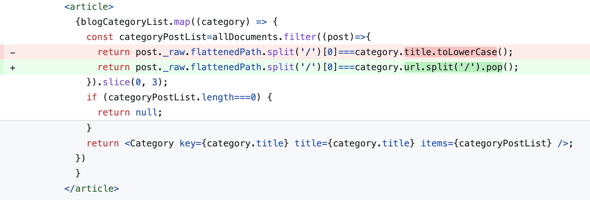

내가 디자이너는 아니지만, 최선을 다해서 메인 페이지를 만들어 보는 과정을 담았다. 내게는 화려한 디자인을 제어할 역량이 없으므로 너무 화려하게 꾸미지 않도록 노력했다.

# 0. 색 정의

그전에 `styles/globals.css`에 색 변수를 지정해 두자. [open color](https://yeun.github.io/open-color/)의 gray, indigo 색을 사용하였다.

그리고 body의 기본 margin 8px를 없애 주는 css도 추가했다.

```css
// styles/globals.css
:root{
  --white:#fff;

  --gray0:#f8f9fa;
  --gray1:#f1f3f5;
  --gray2:#e9ecef;
  --gray3:#dee2e6;
  --gray4:#ced4da;
  --gray5:#adb5bd;
  --gray6:#868e96;
  --gray7:#495057;
  --gray8:#343a40;
  --gray9:#212529;


  --indigo0:#edf2ff;
  --indigo1:#dbe4ff;
  --indigo2:#bac8ff;
  --indigo3:#91a7ff;
  --indigo4:#748ffc;
  --indigo5:#5c7cfa;
  --indigo6:#4c6ef5;
  --indigo7:#4263eb;
  --indigo8:#3b5bdb;
  --indigo9:#364fc7;
}

body{
  margin:0;
}
```

# 1. 헤더 컴포넌트

모든 페이지에 공통으로 들어가 있는 헤더와 푸터로 시작하겠다.

부대찌개를 먹으며 고민한 결과 다음과 같은 배치를 생각했다. 그리고 About의 경우에는 다른 게시판 분류와 다른 느낌이기 때문에 살짝 다른 색으로 구분해 줄까 하고 있다. 나는 디자이너가 아니지만 최선을 다해보았다.


## 1.1. 컨테이너

헤더 높이는 다른 컨텐츠와의 조화를 생각할 때 50px가 가장 적절해 보였다. 그리고 늘 상단에 고정시켜야 하므로 `position:sticky;`와 `top:0`. 다른 페이지 요소들과 같이 `width:100%; max-width: 60rem;`로 너비 제한. `margin:0 auto`로 가운데 정렬.

배경색은 흰색 설정 후 다른 컨텐츠와의 구분을 위해 연한 회색의 하단 테두리 지정.

```css
.header{
  height:50px;
  position:sticky;
  top:0;
  width:100%;
  max-width:60rem;
  margin:0 auto;
  background-color:#FFFFFF;
  border-bottom:1px solid var(--gray3);
}
```

그다음은 header 컴포넌트 내의 nav 컴포넌트. 여기에 메뉴들이 본격적으로 들어갈 텐데, 여기서도 width를 100%로 설정하면 내비게이션이 너무 양쪽에 딱 붙어 보일 것이다. 따라서 `width:92%`로 설정한다.

또한 모바일 환경이든 PC환경이든 내부 요소가 양쪽에 몰려 있어야 하기에(게시판 메뉴들은 후에 div 박스로 묶을 것이다) flex를 space-between으로 설정. height는 당연히 100%, margin 0 auto.

```css
.header__nav{
  width:92%;
  display:flex;
  flex-direction:row;
  justify-content:space-between;
  height:100%;
  margin:0 auto;
}
```

## 1.1. 홈 버튼

이제 홈 버튼을 만들어 주자. `src/components/header/homeButton`에 index.tsx와 styles.module.css 생성

index.tsx의 HomeButton 컴포넌트 구조는 다음과 같이 한다. 링크 내부에 div를 넣고 거기에 사진과 텍스트를 넣은 간단한 구조다.

```tsx
import Image from 'next/image';
import Link from 'next/link';

import blogConfig from 'blog-config';

import styles from './styles.module.css';

function HomeButton() {
  return (
    <Link href='/' aria-label='Home' className={styles.link}>
      <div className={styles.container}>
        <Image src='/witch-hat.svg' alt='logo' width={40} height={40} />
        {blogConfig.title}
      </div>
    </Link>
  );
}

export default HomeButton;
```

그리고 링크에는 너비와 높이를 주기 위해서 block으로 설정하고 내용에 딱 맞게 너비를 설정. 링크에 기본적으로 들어가는 스타일도 없애준다. 또한 약간의 패딩을 추가하고 마우스 호버시 연한 회색의 배경색을 준다.

```css
.link{
  text-decoration:none;
  color:#000;
  display:block;
  width:fit-content;
  padding:5px;
}

.link:hover{
  background:var(--gray2)
}
```

그리고 홈 버튼의 내부 요소 배치를 위해 flex 설정을 해준 후 너비와 높이를 100%로 설정한다. 그리고 내부 요소들을 세로축에서 가운데 정렬하고 사이에 5px의 간격을 준다.

```css
.container{
  display:flex;
  flex-direction:row;
  align-items:center;
  gap:5px;
  width:100%;
  height:100%;
  font-size:24px;
}
``` 

헤더에 들어갈 이미지는 적당히 [픽사베이에서 마녀 모자를 찾아서](https://pixabay.com/vectors/magician-wizard-hat-magic-mystery-41104/)넣었다.

## 1.2. 내비게이션 메뉴

헤더 컴포넌트의 가장 큰 벽이다. 화면 너비가 작을 경우 드롭다운 메뉴를 보여줘야 하고 너비가 넓을 땐 그냥 일반적인 메뉴를 보여줘야 한다.

일단 `src/components/header/menu`에 index.tsx와 styles.module.css 생성.

이 내비게이션에서 레이아웃을 신경써야 할 부분은 다음과 같다.

1. 컨테이너
2. 드롭다운 메뉴의 토글 버튼
3. 드롭다운 메뉴 본체

그럼 컨테이너에는 별거 필요 없다. 그냥 크기만 컨텐츠에 맞게 설정해 주자.

```css
.container{
  display:flex;
  flex-direction:column;
  width:fit-content;
  height:100%;
  font-size:20px;
}
```

이제 버튼을 만들어 보자. `menu/toggler`에 index.tsx와 styles.module.css를 생성.

사실 버튼에 주어질 스타일은 별거 없다. 그냥 테두리와 배경을 없애주고 적절한 너비, 높이를 주는 것. 그리고 호버 시 배경색을 연한 회색으로 주는 것 정도.

```css
// src/components/header/menu/toggler/styles.module.css
.button{
  border:none;
  background:transparent;
  width:50px;
  height:100%;
}

.button:hover{
  cursor:pointer;
  background:var(--gray2);
}
```

그리고 버튼 내부에 들어갈 아이콘을 포함해서 컴포넌트를 작성하자. 이때 원래는 `react-icons`를 쓰려 했으나 많이 쓰지도 않을 아이콘을 위해 패키지 크기가 55MB나 하는 패키지를 깔고 싶지 않아서 그냥 적당한 svg사진을 찾아와서 썼다.

또한 메뉴의 열림 여부에 따라서 표시하는 아이콘이 달라져야 하므로 메뉴가 열려 있는지 여부와 토글 함수를 props로 받도록 했다.

```tsx
import Image from 'next/image';

import styles from './styles.module.css';

function Toggler({isMenuOpen, toggle}: {isMenuOpen: boolean, toggle: () => void}) {
  return (
    <button className={styles.button} onClick={toggle}>
      <Image
        src={isMenuOpen?'/cancel-32x32.svg':'/hamburger-32x32.svg'} 
        alt='Menu' 
        width={32} 
        height={32} 
      />
    </button>
  );
}

export default Toggler;
```

이제 메뉴 본체를 만들어 보자. `menu/dropdown`에 index.tsx와 styles.module.css를 생성.

여기서 해야 할 건 뭘까? 가장 먼저 메뉴를 보여줘야 한다. 또한 모바일 환경에서는 메뉴가 드롭다운으로 보여야 하고 PC 환경에서는 그냥 보여야 한다. 그리고 메뉴 열림 여부에 따라 보이고 말고를 결정할 수 있어야 한다.

따라서 navList와 isMenuOpen을 Dropdown 컴포넌트의 props로 받아야 한다는 것을 생각할 수 있다. 우선 다음과 같이 구조를 잡는다.

```tsx
// src/components/header/menu/dropdown/index.tsx
import Link from 'next/link';

import styles from './styles.module.css';

interface PropsItem{
  title: string;
  url: string;
}

function Dropdown({navList, isMenuOpen}: {navList: PropsItem[], isMenuOpen: boolean}) {
  return (
    <ul>
      {navList.map((item) => {
        return (
          <li key={item.title}>
            <Link
              href={item.url} 
              aria-label={item.title} 
            >
              {item.title}
            </Link>
          </li>
        );
      })}
    </ul>
  );
}

export default Dropdown;
```

어차피 CSS 모듈을 쓰므로 여기서만 쓰일 list, link, item 같은 간단한 클래스명을 주자. 또한 메뉴가 열려 있는 경우와 닫혀 있는 경우에 대해 isMenuOpen을 이용해 다른 클래스명을 적용하도록 한다.

```tsx
function Dropdown({navList, isMenuOpen}: {navList: PropsItem[], isMenuOpen: boolean}) {
  return (
    <ul className={`${styles.list} ${isMenuOpen?styles['list--active']:styles['list--inactive']}`}>
      {navList.map((item) => {
        return (
          <li key={item.title} className={styles.item}>
            <Link
              href={item.url} 
              aria-label={item.title} 
              className={styles.link}
            >
              {item.title}
            </Link>
          </li>
        );
      })}
    </ul>
  );
}
```

CSS는 다음과 같이 설정했다. 주석으로 각각에 대한 간단한 설명들을 적었다.

```css
// src/components/header/menu/dropdown/styles.module.css
/*
모바일 환경에선 세로 배열. bullet point와 패딩, 마진은 없앤다. 흰색 배경과 회색 테두리를 주고, 테두리를 크기에 포함시키기 위한 box-sizing 설정.
헤더 높이는 50px 고정이며 메뉴는 그 아래에 위치하므로 position:absolute로 설정하고 top, left 속성을 줘서 루트 태그 기준으로 배치되도록 한다(현재 조상 태그 중 relative position이 없으므로 가능)
*/
.list{
  width:100%;
  flex-direction:column;
  list-style:none;
  padding:0;
  margin:0;
  background-color:white;
  border:1px solid var(--gray2);
  box-sizing:border-box;
  position:absolute;
  top:50px;
  left:0;
}

/* 메뉴 열려 있을 땐 flex 배치, 아닐 땐 메뉴 보여주지 않기 */
.list--active{
  display:flex;
}

.list--inactive{
  display:none;
}

/* 링크의 기본 스타일링을 없애고 크기 설정이 가능하도록 블록 태그로 설정.
그리고 모바일 환경에서 약간의 들여쓰기와 가운데 위치 정렬을 한다. */
.link{
  text-decoration:none;
  color:#000;
  display:block;
  width:100%;
  height:40px;
  text-indent:30px;
  line-height:35px;
}
// 그냥 호버시 회색으로 만드는 것
.link:hover{
  background:var(--gray2)
}

// 640px이상의 넓은 화면
@media (min-width:640px){
  /*
  넓은 화면에선 드롭다운 메뉴로 보일 필요 없으므로 가로배열.
  또한 이제 드롭다운 형식이 아니므로 기본 position인 static으로 설정하고 테두리 없애기
  */
  .list{
    flex-direction:row;
    height:100%;
    position:static;
    border:none;
  }
  /* 드롭다운 메뉴가 아닐 때는 고정 너비 */
  .item{
    width:60px;
  }
  /* 넓은 너비 화면에서 메뉴는 언제나 보여야 한다. */
  .list--active{
    display:flex;
  }

  .list--inactive{
    display:flex;
  }
  /* 메뉴의 가로 배열에 적당한 크기와 텍스트 정렬 */
  .link{
    width:60px;
    height:100%;
    text-indent:0;
    line-height:50px;
    text-align:center;
  }
}
```

## 1.3. 페이지 이동시 드롭다운 닫기

그런데 문제가 있다. nextJS는 클라이언트 사이드 내비게이션을 지원하기 때문에 페이지가 이동한다고 해서 다시 렌더링되지 않는 컴포넌트들이 있다. 우리가 만든 헤더는 모든 페이지 공통으로 사용되기 때문에 `_app.js`에 넣었고 따라서 페이지가 이동한다고 해서 헤더의 `isMenuOpen` state가 바뀌지 않는다!

즉 모바일 환경에서 메뉴를 열고 다른 페이지로 이동하더라도 메뉴가 계속 열려 있는 것이다. 

이를 해결하기 위해 [nextJS 문서의 라우터 이벤트 부분](https://nextjs.org/docs/pages/api-reference/functions/use-router#routerevents)을 참고했다.

`useEffect`와 nextJS에서 제공하는 `useRouter`를 사용하자. router가 변하고 컴포넌트가 unmount될 때 `isMenuOpen`을 false로 만들어준다.

```tsx
/* src/components/header/menu/index.tsx */

function Menu({navList}: {navList: PropsItem[]}) {
  const [isMenuOpen, setIsMenuOpen] = useState<boolean>(false);

  const router=useRouter();

  useEffect(()=>{
    return router.events.on('routeChangeStart', ()=>setIsMenuOpen(false));
  }, [router]);

  return (
    <div className={styles.container}>
      <Toggler isMenuOpen={isMenuOpen} toggle={() => setIsMenuOpen(!isMenuOpen)} />
      <Dropdown navList={navList} isMenuOpen={isMenuOpen} />
    </div>
  );
}
```

## 1.4. 내비게이션 메뉴 로직 수정

이렇게 해놓고 헤더를 보니, 헤더에 있는 메뉴가 Home, CS, Front, Misc, About이 있었다. 그리고 이 이름들을 기반으로 각 카테고리별 페이지가 만들어지며 이 이름들은 `blog-category.ts`에서 관리한다.

하지만 이 이름들이 별로 마음에 들지 않았다. 일단 Home을 빼고 싶었는데 지금의 페이지 생성 방식 상 이건 문제가 없다. 그냥 `blog-category.ts`만 조금 편집하면 된다.

또 하고 싶은 건 헤더의 메뉴가 `개발`처럼 한글로 되어 있도록 하고 싶다. 따라서 먼저 `blog-category.ts`를 수정하였다. 그다음 posts의 폴더 이름 중 front도 dev로 바꿨다.

```ts
// blog-category.ts
interface Category{
  title: string;
  url: string;
}

const blogCategoryList: Category[] = [
  {title:'CS', url:'/posts/cs'},
  {title:'개발', url:'/posts/dev'},
  {title:'기타', url:'/posts/misc'},
  {title:'소개', url:'/about'},
];

export default blogCategoryList;
```

이러면 일단 `/pages/posts/[category]/index.tsx`에서 동적 라우트 생성시 문제가 생긴다. `category.title`이 바뀌기 때문이다. 따라서 이를 title 기반이 아닌 url 기반으로 동적 라우트가 생성되도록 바꾸자.

url을 `/`로 split 해준 후 마지막 요소만 취해주면 된다.

```tsx
// pages/posts/[category]/index.tsx 의 getStaticPaths
export const getStaticPaths: GetStaticPaths=()=>{
  const paths=blogCategoryList.map((category)=>{
    return {
      params: {
        category:category.url.split('/').pop(),
      },
    };
  });
  return {
    paths,
    fallback: false,
  };
};
```

메인 페이지에서 각 카테고리별 글을 보여주는 필터링을 할 때도 `category.title`을 사용했는데 이것도 `category.url`로 바꿔주자.



# 2. 푸터 컴포넌트

푸터에는 이전에 넣었던 내 이름과 github 링크 정도를 넣어 주자. 이를 위해서 [github 로고 페이지](https://github.com/logos)에서 로고를 다운받아서 사용했다.

```tsx
import Image from 'next/image';
import Link from 'next/link';

import blogConfig from 'blog-config';

import styles from './styles.module.css';

function Footer() {
  return (
    <footer className={styles.footer}>
      <p className={styles.copyright}>
      © {blogConfig.name}, Built with NextJS, 2023
      </p>
      <Link href='https://github.com/witch-factory' className={styles.github}>
        <Image src='/github-mark.png' alt='Github' width={32} height={32} />
      </Link>
    </footer>
  );
}

export default Footer;
```

스타일은 약간의 간격과 배경 정도만 조절해 주었다.

```css
.footer{
  height:100px;
  color:var(--gray6);
  background-color:var(--gray2);
  margin-top:50px;
  padding:20px;
}

.copyright{
  margin:10px 0;
}

.github{
  display:block;
  width:32px;
  height:32px;
}
```

# 3. 자기소개 컴포넌트

## 3.1. 페이지 너비조정

아까 우리는 블로그 컨텐츠가 들어갈 컨테이너 너비를 `max-width`로 제한했었다. 그런데 이렇게 하면 내부 컨텐츠들은 해당 컨테이너를 꽉 채우게 된다. 그럼 만약 창 너비가 `max-width`보다 작으면? 컨텐츠가 페이지 너비를 여백없이 꽉 채울 것이다. 이는 좋지 않다.

따라서 컨테이너를 하나 더 만들어서 `width:92%`와 `margin:0 auto;`를 주자.

```css
// pages/styles.module.css
.container{
  width:92%;
  margin:0 auto;
}
```

그리고 메인 페이지에 컨테이너 추가.

```tsx
// pages/index.tsx
<main className={styles.pagewrapper}>
  // 여기 div 컨테이너를 추가하였다.
  <div className={styles.container}>
    <Profile />
    {/* 프로젝트 목록을 만들기 */}
    {/* 글 목록은 독립적인 영역으로 존재 */}
    <article>
      {blogCategoryList.map((category) => {
        const categoryPostList=allDocuments.filter((post)=>{
          return post._raw.flattenedPath.split('/')[0]===category.url.split('/').pop();
        }).slice(0, 3);
        if (categoryPostList.length===0) {
          return null;
        }
        return <Category key={category.title} title={category.title} items={categoryPostList} />;
      })
      }
    </article>
  </div>
</main>
```

이제 이 페이지의 맨 위(헤더 제외)에 보일 자기소개 컴포넌트를 한번 만들어 보자. 구조는 이전에 다 만들어 놓았으므로 간단히 CSS만 작성하자.

일단 화면 너비가 작을 경우에든 클 경우에도 보이는 자기소개 부분을 Intro 컴포넌트로 분리한다. `src/components/profile/intro`에 index.tsx와 styles.module.css를 생성.

그리고 다음과 같이 index.tsx를 작성한다. 기존에는 링크를 하나하나 생성해 주었는데 이를 수정하여 `Object.entries`를 이용해 자동으로 생성하도록 하였다. 이제 blog-config.ts만 편집하면 프로필에 새로운 링크를 표시할 수 있다.

```tsx
// src/components/profile/intro/index.tsx
import Link from 'next/link';

import blogConfig from 'blog-config';

import styles from './styles.module.css';


function Intro() {
  return (
    <div>
      <h2 className={styles.name}>{blogConfig.name}</h2>
      <p className={styles.description}>{blogConfig.description}</p>
      <ul className={styles.linklist}>
        {Object.entries(blogConfig.social).map(([key, value]) => (
          <li key={key}>
            <Link href={value} target='_blank' className={styles.link}>
              {key}
            </Link>
          </li>
        ))}
      </ul>
    </div>
  );
}

export default Intro;
```

그리고 다음과 같이 클래스들을 스타일링해준다. 이름은 화면 너비가 작아지면 크기와 간격을 조금 줄이도록 했다. 설명도 마찬가지로 화면 너비가 작아질 시 행간을 좁혔다.

그리고 링크들은 가로로 배열되도록 했고 간격 조정을 적당히 해준 후 남색 계열의 적당한 색상을 부여하였다.

```css
.name{
  margin:10px 0;
  font-size:1.2rem;
}

.description{
  margin:10px 0;
  word-break:keep-all;
}

.linklist{
  display:flex;
  flex-direction:row;
  list-style:none;
  padding-left:0;
  margin-bottom:0.5rem;
  gap:0 15px;
}

.link{
  text-decoration:none;
  color:var(--indigo6);
}

@media (min-width:768px){
  .name{
    font-size:1.5rem;
  }

  .description{
    line-height:1.5;
  }
}
```

이렇게 한 뒤 `Intro`컴포넌트를 `Profile`컴포넌트에 추가한다.

```tsx
// src/components/profile/index.tsx
function Profile() {
  return (
    <article className={styles.profile}>
      <Image 
        className={styles.image} 
        src={blogConfig.picture} 
        alt={`${blogConfig.name}의 프로필 사진`} 
        width={100} 
        height={100} 
      />
      // 간략해진 Intro 컴포넌트
      <Intro />
    </article>
  );
}
```

profile의 styles.module.css에서는 사진이 동그랗게 보이도록 하고 적절한 간격을 준다. 그리고 자기소개 컴포넌트 전체에 아주 연한 회색의 배경을 주고 여백을 좀 주었다. 또한 모서리도 둥글게 만들었다.

```css
.image{
  display:none;
  border-radius:50%;
  margin-top:20px;
  margin-right:20px;
}

.profile{
  background:var(--gray1);
  margin:20px 0;
  padding:10px 20px;
  border-radius:1rem;
}

@media (min-width:768px){
  .image{
    display:block;
  }

  /* 화면 너비가 클 시 사진과 소개를 가로 배열 */
  .profile{
    display:flex;
    flex-direction:row;
  }
}
```

# 4. 프로젝트 컴포넌트

이전에는 프로젝트 소개에 `Card` 컴포넌트를 재사용할 수 있을 거라 생각했지만 생각하던 레이아웃이 달라졌다. 따라서 프로젝트를 보여주는 컴포넌트들은 아예 새로 만드는 게 좋겠다. 들어가야 할 정보를 생각해 보자.

# 4.1. 레이아웃 설계

지금 생각하기에 들어가야 할 정보는 일단 프로젝트 이름, 프로젝트 설명, 프로젝트 링크(github등), 프로젝트에 관한 이미지 정도가 있겠다.

이전에 만들었다가 버려 놓았던 `src/components/projects`를 `projectList`로 이름을 바꾸고 작업해 보자. 생각해본 레이아웃은 다음과 같다.


일단 `components/projectList/project` 폴더도 만들고 index.tsx와 styles.module.css를 생성한다. article로 이루어진 적당한 `Project` 컴포넌트를 만들어 놓는다. 이제 프로젝트들을 담아 놓을 컨테이너를 만들어보자.

아, 그전에 프로젝트를 담아 놓을 projectList를 만들어야 한다. 루트 경로에 `blog-project.ts`를 만들고 다음과 같이 작성한다. 타입은 다른 데서도 쓸 것이므로 export 해주자.

```ts
// /blog-project.ts
export interface projectType {
  title: string;
  description: string;
  image: string;
  url: {
    title: string;
    link: string;
  }[];
  techStack: string[];
}

const projectList: projectType[] = [
  {
    title: 'Witch-Work',
    description: '직접 제작하고 Cloudflare로 배포해 운영중인 개인 블로그',
    image: '/witch.jpeg',
    url: [
      {
        title: 'Github',
        link:'https://github.com/witch-factory/witch-next-blog'
      },
      {
        title: 'URL',
        link:'https://witch.work/'
      }
    ],
    techStack: ['Next.js', 'React', 'TypeScript']
  },
];

export default projectList;
```

## 4.2. 컨테이너 컴포넌트

프로젝트 부분은 독립적으로 존재할 수 있으므로 article 태그를 쓴다. 그리고 제목과 리스트를 만든다. 그뿐이다.

```tsx
// src/components/projectList/index.tsx
import { projectType } from 'blog-project';
import projectList from 'blog-project';

import Project from './project';
import styles from './styles.module.css';

function ProjectList() {
  return (
    <article>
      <h2 className={styles.title}>프로젝트</h2>
      <ul className={styles.list}>
        {projectList.map((project: projectType) => {
          return (
            <li key={project.title}>
              <Project project={project} />
            </li>
          );
        })}
      </ul>
    </article>
  );
}

export default ProjectList;
```

title은 하단 마진을 없애고, 리스트는 좌우 여백을 없애고 bullet point도 없앤다. 또한 화면이 커질 경우 2열로 배치하도록 하기 위해 grid display를 사용한다. 2열 사이에는 약간의 간격을 둔다.

```css
.title{
  margin-bottom:0;
}

.list{
  list-style:none;
  padding:0;
}

@media (min-width: 768px) {
  .list{
    display:grid;
    grid-template-columns:repeat(2,1fr);
    column-gap: 1rem;
  }
}
```

## 4.3. 프로젝트 소개 컴포넌트

일단 프로젝트 소개와 프로젝트 이미지를 분리하기 위해서, 프로젝트 소개(제목, 설명, 링크 등이 들어갈 곳)를 위한 컴포넌트를 만들자. `projectList/project/intro` 폴더를 만들고 내부에 index.tsx와 styles.module.css를 생성한다.

그리고 다음과 같은 구조를 잡자. div를 많이 쓰고 싶지 않았는데..결국 CSS를 하다 보면 어쩔 수 없다.

길어 보이지만 스타일링을 위해 요소를 묶은 div를 제외하고 의미적인 부분만 보면 제목, 설명, 링크, 기술 스택(링크와 기술 스택은 ul로 묶음)을 순서대로 나열한 것일 뿐이다.

```tsx
import Link from 'next/link';

import { projectType } from 'blog-project';

import styles from './styles.module.css';

function ProjectIntro({project}: {project: projectType}) {
  return (
    <div className={styles.intro}>
      <div>
        <h3 className={styles.title}>{project.title}</h3>
        <p className={styles.description}>{project.description}</p>
      </div>
      <div>
        <ul className={styles.list}>
          {project.url.map((url,) =>
            <li key={url.link}>
              <Link 
                className={styles.link} 
                href={url.link} 
                target='_blank'
              >
                {`${url.title} Link`}
              </Link>
            </li>
          )}
        </ul>
        <ul className={styles.list}>
          {project.techStack.map((tech) =>
            <li key={tech} className={styles.tech}>{tech}</li>
          )}
        </ul>
      </div>
    </div>
  );
}

export default ProjectIntro;
```

그리고 CSS는 다음과 같이 작성한다. 디자인 감각이 딸리지만 최선을 다해 컬러와 간격을 지정했다.

```css
/* 콘테이너 높이가 요소들 높이보다 클 경우, 
제목/설명은 위쪽에, 링크/기술스택은 아래쪽에 배치하도록 한다. */
.intro{
  display:flex;
  flex-direction: column;
  justify-content: space-between;
}

/* 그냥 h3과 p 태그의 기본 간격 없애주고
제목과 설명 간에는 약간의 간격 */
.title{
  margin: 0;
}

.description{
  margin: 0;
  margin-top:5px;
}

/* 가로 배치 후 간격 주기 */
.list{
  display: flex;
  flex-direction: row;
  gap: 6px;
  list-style: none;
  padding: 0;
  margin-top:5px;
}

/* block으로 설정한 후 적당히 디자인, 간격주기 */
.link{
  display:block;
  padding: 3px;
  border-radius: 5px;
  text-decoration: none;
  background-color: var(--indigo1);
  color: var(--indigo8);
}

.link:hover{
  background-color: var(--indigo2);
}

.tech{
  padding: 1.5px 3px;
  border-radius: 5px;
  background-color: var(--indigo9);
  color:var(--white);
  font-size: 0.8rem;
}
```

## 4.4. 프로젝트 접기 기능

현재 PC에서는 그럭저럭 괜찮지만 모바일에서는 프로젝트 소개가 너무 길어서 너무 내려야 포스트가 보이는 문제가 있다. 따라서 모바일에서는 프로젝트 소개 카드들이 접혀 있는 상태로 있다가 펼쳐보기 버튼을 누르면 펼쳐볼 수 있도록 하자.


프로젝트 컴포넌트에서 제목과 펼쳐보기 버튼이 들어갈 컨테이너로 div를 만들고, 버튼을 넣어준다. 그리고 `open` 상태를 만들어서 버튼을 누를 때마다 상태가 반전되도록 한다.

```tsx
function ProjectList() {
  const [open, setOpen] = useState(false);

  const toggle = ()=>{
    setOpen(prev=>!prev);
  };

  return (
    <article>
    // 이 부분이 달라졌다
      <div className={styles.header}>
        <h2 className={styles.title}>프로젝트</h2>
        <button className={styles.toggle} onClick={toggle}>{open?'접기':'펼쳐보기'}</button>
      </div>
      <ul className={`${styles.list} ${open?styles['list--open']:styles['list--close']}`}>
        {projectList.map((project: projectType) => {
          return (
            <li key={project.title}>
              <Project project={project} />
            </li>
          );
        })}
      </ul>
    </article>
  );
}
```

그리고 header 클래스의 내부 요소 배열을 가로로 하도록 하고 내부 요소가 양쪽 끝에 배치되도록 하자. 버튼은 프로젝트 소개의 URL 링크들과 같은 스타일링을 해주고 적절한 크기를 부여한다. 또한 만약 사이트 너비가 커지면 toggle 버튼은 안 보여야 하므로 이것도 미디어 쿼리에 추가한다.

```css
// src/components/projectList/styles.module.css
.header{
  display:flex;
  flex-direction:row;
  justify-content:space-between;
}

.title{
  margin:0;
}

.toggle{
  width:70px;
  height:30px;
  border:none;
  border-radius:5px;
  background:var(--indigo1);
  color:var(--indigo8);
}

.toggle:hover{
  background:var(--indigo2);
}

@media (min-width: 768px) {
  .toggle{
    display:none;
  }
}
```

그리고 만약 open state가 false인 경우 프로젝트를 한 개만 보여주도록 하자. 이는 CSS grid를 이용해서 구현할 수 있다.

먼저 `list` 클래스를 grid layout으로 지정한 후 한 행, 한 열만 존재하도록 한다. 그리고 `list--closed` 클래스에선 자동으로 생성된 행들의 너비를 관리하는 `grid-auto-rows` 속성을 0으로 준 후 overflow를 hidden으로 설정한다. 그러면 1행을 넘는 요소들은 모두 overflow로 취급되는데 이를 숨기도록 설정한 것이므로 숨겨진다. 당연히 1개의 프로젝트 소개만 표시된다.

그리고 `list--open`에서는 `grid-auto-rows`를 다시 1fr로 설정해주면 된다. 이렇게 하면 다른 요소들도 적절한 너비를 받아서 모두 보이게 된다. 화면 너비가 커지면 작동하는 미디어 쿼리에서는 아까와 똑같이, 768px 이상의 너비에서는 open에 상관없이 2열로 보이도록 하자.

```css
// src/components/projectList/styles.module.css
.list{
  list-style:none;
  padding:0;
  display:grid;
  grid-template-columns:1fr;
  grid-template-rows:1fr;
}

.list--open{
  grid-auto-rows:1fr;
}

.list--close{
  grid-auto-rows:0;
  overflow:hidden;
}

@media (min-width: 768px) {
  .list{
    display:grid;
    grid-template-columns:repeat(2,1fr);
    grid-auto-rows:1fr;
    column-gap: 1rem;
  }

  .toggle{
    display:none;
  }
}
```

# 5. 글 소개 컴포넌트

## 5.1. Category 컴포넌트

이 컴포넌트에서는 별로 할 게 없다. 카드들을 정렬해 줄 뿐인 역할이므로 반응형 레이아웃으로만 만들어 주자. 너비가 커질 시에는 가로로 배열하는 방식으로. 여기에는 grid를 사용하였다. flex를 사용할 경우 `Card`를 감싼 `li`태그에도 클래스를 부여하여 `width:100%`를 줘야 하는데 굳이 그럴 필요성을 못 느낀다.

```tsx
// src/components/category/index.tsx
import Card from 'src/components/card';

import styles from './styles.module.css';

interface CardProps{
  title: string;
  description: string;
  image?: string;
  date: string;
  tags?: string[];
  url: string;
}

interface Props{
  title: string;
  url: string;
  items: CardProps[];
}

function propsProperty(item: CardProps) {
  const { title, description, image, date, tags, url } = item;
  return { title, description, image, date, tags, url };
}

function Category(props: Props) {
  return (
    <section className={styles.container}>
      <h2>{props.title}</h2>
      
      <ul className={styles.list}>
        {props.items.map((item) => {
          return (
            <li key={item.url}>
              <Card
                {...propsProperty(item)}
              />
            </li>
          );
        })}
      </ul>
    </section>
  );
}

export default Category;
```

따라서 list 클래스에만 적절한 반응형 레이아웃과 간격 부여.

```css
// src/components/category/styles.module.css
.list{
  list-style:none;
  padding:0;
  display: grid;
  gap:1rem;
}

@media (min-width:768px){
  .list{
    grid-template-columns:repeat(3,1fr);
  }
}
```

## 5.2. Card 컴포넌트

이 `Card`컴포넌트는 각 카테고리별 페이지에서도 사용되므로 레이아웃을 좀 생각해 보자.

그전에 먼저 높이를 좀 수정하자. 지금은 높이가 고정 너비 150px로 되어 있는데 이럴 경우 글 제목 혹은 설명이 길어지면 글이 약간 컴포넌트를 넘어가는 문제가 생겼다.


따라서 이 너비가 유동적으로 조절되도록 바꿔주자. 먼저 `components/card/styles.module.css`에서 container 클래스의 height를 그냥 100%로 바꿔주자.

```css
// src/components/card/styles.module.css
.container{
  border: 1px solid var(--gray5);
  border-radius: 1rem;
  box-sizing: border-box;
  height:100%;
  display:flex;
  flex-direction:column;
}
```

설계의 편의를 위해서 컨테이너와 이미지를 제외한, 글의 진짜 내용이 텍스트로 들어가는 부분을 Intro 컴포넌트로 분리해 준다. `src/components/card/intro` 폴더를 만들고 index.tsx와 styles.module.css를 생성한다.

그리고 `card/intro/index.tsx`를 다음과 같이 기존의 글 개요의 역할을 그대로 하도록 만든다. 클래스명도 적당히 붙여주었다. 그렇게 한 후 `Card`컴포넌트에 붙여준다.

```tsx
// src/components/card/intro/index.tsx
import { toISODate, formatDate } from '@/utils/date';

import styles from './styles.module.css';

interface Props{
  title: string;
  description: string;
  date: string;
  tags: string[];
}

function Intro(props: Props) {
  const { title, description, date, tags } = props;
  const dateObj = new Date(date);
  return (
    <>
      <h3 className={styles.title}>{title}</h3>
      <p className={styles.description}>{description}</p>
      {tags.length ?
        <ul className={styles.tagList}>
          {tags.map((tag: string)=>
            <li key={tag} className={styles.tag}>{tag}</li>
          )}
        </ul> :
        null}
      <time dateTime={toISODate(dateObj)}>{formatDate(dateObj)}</time>
    </>
  );
}

export default Intro;
```

위에서 `toISODate`와 `formatDate`함수를 사용하였는데, 이는 `src/utils/date.ts`를 만들고 거기에 정의해 사용하였다. 해당 함수들의 내용은 다음과 같다.

```ts
// src/utils/date.ts
export const toISODate = (date: Date) => {
  return date.toISOString().split('T')[0];
};

export const formatDate = (date: Date) => {
  const year = date.getFullYear();
  const month = String(date.getMonth() + 1).padStart(2, '0');
  const day = String(date.getDate()).padStart(2, '0');
  return `${year}. ${month}. ${day}`;
};
```

그리고 Card 컴포넌트에 Intro를 붙이면 다음과 같아진다.

```tsx
// src/components/card/index.tsx
import Image from 'next/image';
import Link from 'next/link';

import Intro from './intro';
import styles from './styles.module.css';

interface Props{
  title: string;
  description: string;
  image?: string;
  date: string;
  tags: string[];
  url: string;
}

function Card(props: Props) {
  const { title, description, image, date, tags, url } = props;
  return (
    <article className={styles.container}>
      <Link className={styles.link} href={url}>
        {image ?
          <Image src={image} alt={`${title} 사진`} width={50} height={50} /> : 
          null
        }
        {/* 이 부분이 Intro 컴포넌트로 처리되었다. */}
        <Intro title={title} description={description} date={date} tags={tags} />
      </Link>
    </article>
  );
}

export default Card;
```

카드 컴포넌트의 스타일링은 다음과 같다. 간단한 테두리와 약간의 여백, 색깔 정도만 주었다. 링크 컴포넌트에 크기를 부여하기 위해 `display:block`도 주었다.

```css
// src/components/card/styles.module.css
.container{
  border: 1px solid var(--gray5);
  border-radius: 1rem;
  box-sizing: border-box;
  height:100%;
  display:flex;
  flex-direction:column;
}

.link{
  display:block;
  height:100%;
  padding:1rem;
  text-decoration:none;
  color:var(--black);
}

.link:hover{
  color:var(--indigo6);
}
```

그리고 Intro 컴포넌트의 스타일링도 해준다. 제목과 설명의 기본 간격을 없애고 새로 주었다. 글씨 크기도 조정했다. 태그들은 가로로 배열되도록 하고, 아까 프로젝트 설명 란의 기술 스택 블럭과 비슷하게 디자인해 주었다. 단 여백을 좀더 주었다.

```css
// src/components/card/intro/styles.module.css
.title{
  font-size:1.2rem;
  margin:0;
  margin-bottom:10px;
}

.description{
  font-size:1rem;
  margin:0;
  margin-bottom:10px;
}

.tagList{
  display:flex;
  flex-wrap:wrap;
  margin:0;
  padding:0;
  list-style:none;
  gap:5px;
}

.tag{
  background-color:var(--indigo6);
  color:var(--white);
  border-radius:5px;
  font-size:0.8rem;
  margin:0;
  margin-bottom:5px;
  padding:3px 8px;
}
```

## 5.3. 글 날짜순 정렬

지금 메인 페이지에 보이는 글들은 날짜순으로 정렬이 안 되어 있다. 각 카테고리별 페이지에서도 마찬가지다. 이를 날짜 순으로 정렬해서 가져오도록 하자. 

우리는 지금까지 글들을 가져올 때 `allDocuments`를 사용했는데, 먼저 `allDocuments`를 날짜순으로 정렬해서 리턴하는 함수를 만든 후 이를 `allDocuments`의 위치에 대신 넣어 주면 된다.

`src/utils/post.ts`를 생성한다. 그리고 `getSortedPosts`함수를 작성하자.

```ts
// src/utils/post.ts
import { allDocuments } from 'contentlayer/generated';

export const getSortedPosts = () => {
  return allDocuments.sort((a, b) => {
    return new Date(b.date).getTime() - new Date(a.date).getTime();
  });
};
```

그리고 `allDocuments`를 사용하는 부분을 모두 `getSortedPosts()`로 바꿔주면 된다.

## 5.4. Intro에 간격 넣기

그런데 화면 너비를 조절하며 `Card` 컴포넌트를 보면 문제가 있다. 제목과 설명의 길이에 따라서 줄 수가 달라지므로 각각의 높이가 달라지는데, 이 때문에 밑의 태그와 날짜 컴포넌트의 위치가 정렬되지 않는 것이다.


이를 해결하기 위해서는 `Card` 컴포넌트의 `Intro` 컴포넌트에 간격을 주어야 한다. 이를 위해 `Card` 컴포넌트의 `Intro` 컴포넌트의 `styles.module.css`를 만들고 다음과 같은 container 클래스를 작성한다.

```css
// src/components/card/intro/styles.module.css
.container{
  display:flex;
  flex-direction:column;
  justify-content:space-between;
  height:100%;
}
```

Intro 컴포넌트는 다음과 같이 변경. 전체를 container 클래스의 div로 감싸고, tags와 time이 뭉쳐 있도록 div로 감쌌다.

```tsx
function Intro(props: Props) {
  const { title, description, date, tags } = props;
  const dateObj = new Date(date);
  return (
    <div className={styles.container}>
      <h3 className={styles.title}>{title}</h3>
      <p className={styles.description}>{description}</p>
      <div>
        {tags.length ?
          <ul className={styles.tagList}>
            {tags.map((tag: string)=>
              <li key={tag} className={styles.tag}>{tag}</li>
            )}
          </ul> :
          null}
        <time dateTime={toISODate(dateObj)}>{formatDate(dateObj)}</time>
      </div>
    </div>
  );
}
```

# 6. 약간의 개선

그런데 꼭 프로젝트 소개와 글 프리뷰(`Card`)컴포넌트에 굳이 테두리가 있어야 할까? 없앨 수 있는 건 없애 버리자.

`src/components/projectList/project/styles.module.css`의 container를 편집하여 다음과 같이 테두리를 없애고 간격을 약간 넓혀준다.

이미지도 원래 `border-radius:50%`로 동그랗게 보이도록 했는데 그냥 약간의 모깎기만 하자.

```css
// src/components/projectList/project/styles.module.css
.container{
  display: flex;
  flex-direction: row;
  gap:1rem;
  /*border: 1px solid var(--gray5);
  border-radius: 1rem;*/
  box-sizing: border-box;
  padding:15px;
  margin-bottom: 1rem;
  min-height:150px;
}

.image{
  border-radius:1rem;
}

@media (min-width: 768px) {
  .container{
    padding: 10px;
  }

  .image{
    display: block;
  }
}
```

그리고 `src/components/card/styles.module.css`의 container도 다음과 같이 테두리를 없애고 hover 시에 background-color를 추가해준다.

```css
.container{
  /*border: 1px solid var(--gray5);*/
  border-radius: 1rem;
  box-sizing: border-box;
  height:100%;
  display:flex;
  flex-direction:column;
}

.link{
  display:block;
  height:100%;
  padding:1rem;
  text-decoration:none;
  color:var(--black);
}

.link:hover{
  border-radius: 1rem;
  color:var(--indigo6);
  background-color:var(--gray1);
}
```

내 착각일 수도 있지만 테두리를 이루는 선들이 없어지니 화면이 좀더 깔끔해진 것 같다.

# 7. 다음 이야기

`Card` 컴포넌트는 메인 페이지 뿐 아니라 각 카테고리별로 글 목록을 보여주는 페이지에서도 사용된다. 그리고 이때의 카드는 한 줄에 하나씩만 보여지므로, 상당히 넓은 너비를 차지한다. 

따라서 썸네일을 넣음으로써 글의 이해에도 도움을 주고 글 한 줄의 너비도 줄여서 사용자의 집중도를 높이려고 한다.

그런데 그걸 하기 위해선 꽤나 여러가지 작업이 필요할 것 같아서 먼저 다른 페이지들을 좀 손보고 나서 그 작업을 하도록 하겠다. 글 목록 페이지와 글 상세보기 페이지뿐이지만.

# 참고

토스 기술블로그의 디자인을 많이 참고하였다. 토스만큼 UI에 신경쓰는 기업이 많지 않다고 생각한다. https://toss.tech/tech

마녀 모자 이미지 출처 https://pixabay.com/vectors/magician-wizard-hat-magic-mystery-41104/

nextJS 페이지 이동 감지를 위한 useRouter https://nextjs.org/docs/pages/api-reference/functions/use-router#routerevents

프로젝트를 보여주는 컴포넌트를 만들기 위해 참고하였다.
https://portfolio-kagrin97.vercel.app/portfolio

프로젝트를 하다가 vscode 폴더의 구조에 따른 들여쓰기 간격을 넓히기 위해 사용했다. https://thenicesj.tistory.com/35

grid css를 이용한 접힘 구현에 참고 https://stackoverflow.com/questions/63184642/display-only-one-row-and-hide-others-in-css-grid