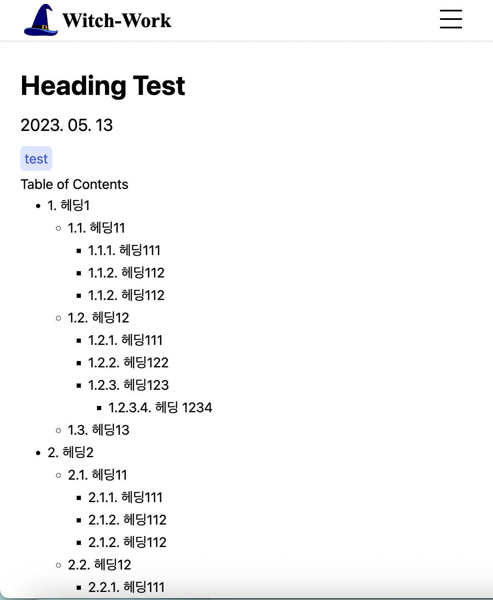
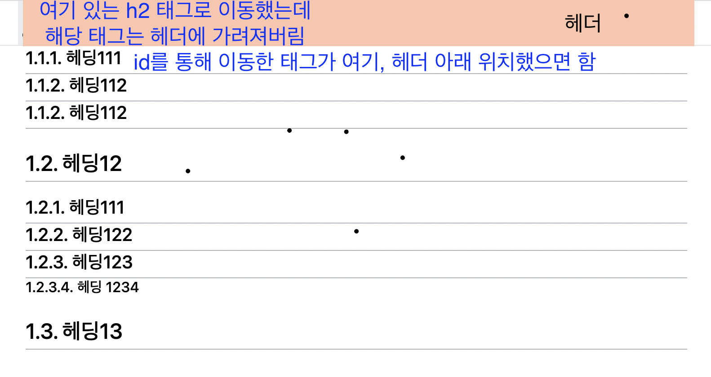
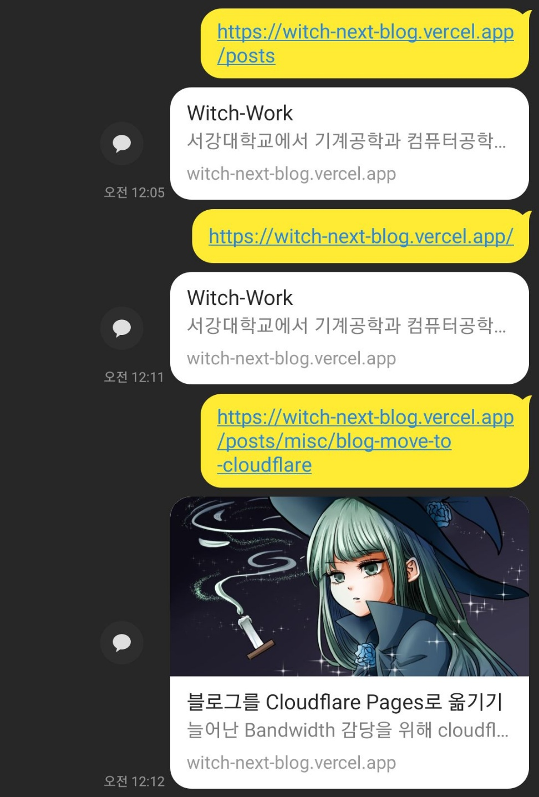
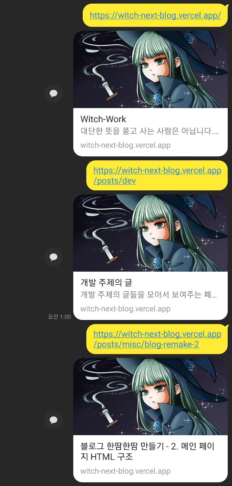

메인 페이지의 `Card` 컴포넌트를 만들고 있었는데 `Card`가 글 카테고리 페이지에서도 쓰이기 때문에 이를 위해서 썸네일을 만들어 주는 작업을 하려고 했다.

그러나 이를 설계하다 보니 사전에 해야 할 일이 점점 많아져서 먼저 다른 페이지들을 간단히나마 손보고 나서 할 예정이다. 이 글은 그렇게 다른 페이지를 약간 손보는 내용이다. 썸네일을 만드는 공사는 다음 글에 할 예정이다.

# 1. 글 목록 페이지 바꾸기

사실 메인 페이지에서 보이는 `Card` 컴포넌트의 용도 같은 경우 이미 이전 글에서 다 만들었다. 디자인에 아직 개선할 부분이 있지만 들어갈 내용은 다 들어가 있으니. 그런데 `Card`는 글 카테고리별로 글 목록을 보여주는 페이지에서도 쓰인다. 따라서 여기에 맞는 디자인도 해주자.

그런데 지금 글 목록 페이지에서 Card 컴포넌트가 어떻게 쓰이는지를 보면서 해야 하는데 글 목록 페이지가 아직 디자인되지 않았다. 따라서 글 목록 페이지에서 Card 컴포넌트를 잘 볼 수 있게 하기 위해서만 조금 바꿔주자. 

본격적으로는 좀 이후에 다시 다룰 것이다.(사실 글 목록 페이지는 별거 없어서 카드를 잘 디자인한다면 그 이후에 크게 엄청난 디자인이 있지 않을 거라 생각하지만)

먼저 전체 글 목록을 메인 페이지에서 했듯이 width 92%를 갖는 컨테이너로 한번 감싸고, 글 목록 태그(ul)의 기본 스타일을 없앤다. 또한 글 블럭 간의 약간의 간격 주기. 이 정도만 해도 썸네일을 넣고 괜찮은지 볼 정도의 레이아웃은 될 것 같다.

글 목록 페이지를 담당하는 `pages/posts/[category]/index.tsx` 파일을 열고 `PostListPage` 컴포넌트를 다음과 같이 수정한다.

```tsx
function PostListPage({
  category, postList,
}: InferGetStaticPropsType<typeof getStaticProps>) {
  return (
    <main className={styles.pagewrapper}>
    {/* container, list 클래스가 추가되었다 */}
      <div className={styles.container}>
        <h1>{category}</h1>
        <ul className={styles.list}>
          {postList.map((post: PostMetaData) => 
            <li key={post.url}>
              <Card {...post} />
            </li>
          )}
        </ul>
      </div>
    </main>
  );
}
```

그리고 위에서 추가된 클래스의 CSS는 다음과 같이 작성한다. 어차피 너비에 상관없이 같은 레이아웃이 될 부분이므로 미디어 쿼리는 없어도 된다.

```css
// pages/posts/[category]/style.module.css 에 해당 부분 추가
.container{
  width:92%;
  margin:0 auto;
}

.list{
  list-style:none;
  padding:0;
  margin:0;
  display:flex;
  flex-direction:column;
  gap:1rem;
}
```

# 2. 글로벌 CSS 적용

## 2.1. 글로벌 스타일

글 상세보기 페이지를 만들기 전에, 문제가 발생했다. 현재 배포된 블로그를 모바일에서 들어가 보았는데 글씨체도 다르고 간격도 약간씩 달라 보였다. 따라서 글로벌 reset CSS를 적용해 주자.

`src/styles/globals.css`를 편집해 주자.

[gatsby-starter-lavender](https://github.com/blurfx/gatsby-starter-lavender)의 글로벌 CSS를 거의 똑같이 따왔다.

```css
// src/styles/globals.css
:root {
  --white:#fff;
  --black:#000;

  --gray0:#f8f9fa;
  --gray1:#f1f3f5;
  --gray2:#e9ecef;
  --gray3:#dee2e6;
  --gray4:#ced4da;
  --gray5:#adb5bd;
  --gray6:#868e96;
  --gray7:#495057;
  --gray8:#343a40;
  --gray9:#212529;

  --indigo0:#edf2ff;
  --indigo1:#dbe4ff;
  --indigo2:#bac8ff;
  --indigo3:#91a7ff;
  --indigo4:#748ffc;
  --indigo5:#5c7cfa;
  --indigo6:#4c6ef5;
  --indigo7:#4263eb;
  --indigo8:#3b5bdb;
  --indigo9:#364fc7;

  font-family:"Pretendard", apple-system, system-ui, BlinkMacSystemFont, "Segoe UI", Roboto, "Helvetica Neue", Arial, sans-serif;
  text-rendering: optimizeLegibility;
}

* {
  box-sizing:border-box;
  margin:0;
  padding:0;
}

html, body {
  min-height:100vh;
}

a {
  color: inherit;
  text-decoration: none;
}

h1 {
  font-size:1.75rem;
}

h2 {
  font-size:1.5rem;
}

h3 {
  font-size:1.25rem;
}

h4 {
  font-size:1rem;
}

h5 {
  font-size:0.875rem;
}

h6 {
  font-size:0.75rem;
}

hr{
  margin:0.25rem 0;
  border:0;
  border-top:0.125rem solid var(--gray5);
}

img{
  display:block;
  margin:0 auto;
}

p{
  margin:0.75rem 0;
  line-height:1.625rem;
}

table{
  width:100%;
  margin:0.75rem 0;
  border-collapse:collapse;
  line-height:1.75rem;
}

tr{
  border-bottom:1px solid var(--gray5);
}

th, td{
  padding:0.75rem 0;
}

blockquote{
  padding-left:1rem;
  border-left:0.25rem solid var(--indigo7);
}

article{
  overflow-wrap:break-word;
}

article :is(ul, ol){
  margin-left:2rem;
}

article :is(ul, ol) :is(ul, ol){
  margin-left:1.5rem;
}

article :is(ul, ol) li{
  margin:0.375rem 0;
}

article :is(ul, ol) li p{
  margin:0;
}

article pre[class^="language-"]{
  border-radius:0.25rem;
}

pre[class*="language-"], code[class*="language-"]: {
  white-space: 'pre-wrap',
}
```

이렇게 하고 나면 메인 페이지의 레이아웃이 약간 변형된다. 원래대로 돌려 주는 작업을 좀 해주자.

## 2.2. 헤더, 푸터

내부에 레이아웃 생각할 요소도 많지 않거니와 가능한 거의 모든 것에 클래스를 박아 놓았기 때문에 고칠 게 없다.

## 2.3. 자기소개 컴포넌트

내 소개의 링크들이 article 태그의 후손인 ul 태그에 들어 있기에 글로벌 CSS의 영향을 받는다. 따라서 margin을 기본적으로 없애주고, p 태그의 line-height를 줄여준다. 그리고 linkbox 클래스를 만들어서 링크를 감싸는 li 태그의 margin을 없앤다.

```css
// src/components/profile/intro/styles.module.css
.description{
  margin:10px 0;
  word-break:keep-all;
  line-height:1.2;
}

.linklist{
  display:flex;
  flex-direction:row;
  list-style:none;
  padding-left:0;
  margin:0;
  margin-bottom:0.5rem;
  gap:0 15px;
}

.link{
  text-decoration:none;
  color:var(--indigo6);
}

.linkbox{
  margin:0;
}
```

Intro 컴포넌트 내부의 링크를 감싸는 부분에 `linkbox` 클래스 추가

```tsx
// src/components/profile/intro/index.tsx 일부
<ul className={styles.linklist}>
  {Object.entries(blogConfig.social).map(([key, value]) => (
    {/* 여기에 linkbox 클래스 추가 */}
    <li key={key} className={styles.linkbox}>
      <Link href={value} target='_blank' className={styles.link}>
        {key}
      </Link>
    </li>
  ))}
</ul>
```

## 2.4. 프로젝트 소개 컴포넌트

가장 먼저 보이는 건 ul 태그의 왼쪽 margin과 li의 상하 마진이다. 이를 없애주자. 일단 `projectList`전체를 감싸고 있는 article태그에 `styles.container` 클래스를 적용한 후 이 내부에 있는 ul, li에 대해서 모두 처리해 주면 된다.

```css
// src/components/projectList/styles.module.css에 추가
.container ul{
  margin-left:0;
}

.container li{
  margin:0;
}
```

그리고 현재는 개별 프로젝트 컴포넌트 간의 간격이 margin과 grid display의 gap이 섞여서 쓰이고 있는데 이를 gap으로 통일해주자.

projectList의 list 클래스의 gap을 1rem으로 설정.

```css
// src/components/projectList/styles.module.css에 추가
.list{
  list-style:none;
  padding:0;
  display:grid;
  grid-template-columns:1fr;
  grid-template-rows:1fr;
  gap:1rem;
}
```

project 컴포넌트의 container margin은 삭제. `projectList`의 제목과 프로젝트 사진을 같은 줄로 정렬하기 위해 container의 padding-left도 0으로. 또 프로젝트 이미지는 현재 `margin:0 auto;`로 설정되어서 이상하게 정렬되므로 이를 없애주자.

```css
// src/components/projectList/project/styles.module.css
.container{
  display: flex;
  flex-direction: row;
  gap:1rem;
  box-sizing: border-box;
  /* padding 수정됨 */
  padding:15px 15px 15px 0;
  min-height:150px;
}

.image{
  border-radius:1rem;
  /* margin 0으로 */
  margin:0;
}

@media (min-width: 768px) {
  .container{
    /* padding 수정됨 */
    padding:10px 10px 10px 0;
  }

  .image{
    display: block;
  }
}
```

projectList가 접힌 상태일 때도 row-gap이 적용되어 아래쪽에 여백이 생기는 문제가 있었다. 따라서 접힌 상태일 때는 row-gap을 없애주자.

그런데 이렇게만 하면 `list--close` 클래스는 화면 너비가 넓을 때도 적용되므로 화면 너비가 넓은 상태에서도 row-gap이 없어지는 문제가 있다. 따라서 화면 너비가 넓을 땐 적당한 gap을 또 적용해 주자.

```css
.list--close{
  grid-auto-rows:0;
  overflow:hidden;
  // 닫혀있을땐 row-gap 없게
  row-gap:0;
}

@media (min-width: 768px) {
  .list{
    display:grid;
    grid-template-columns:repeat(2,1fr);
    grid-auto-rows:1fr;
    // 화면 너비 넓을 땐 gap이 늘 있다
    row-gap:1rem;
    column-gap:2rem;
  }
}
```

그리고 아래 컴포넌트와의 간격이 없어진 projectList 컨테이너에 약간의 하단 여백을 주자.

```css
// src/components/projectList/styles.module.css
.container{
  margin-bottom:2rem;
}
```

## 2.5. 글 카테고리 컴포넌트

`Category`와 `Card`컴포넌트를 손보자.

Category는 그냥 ul의 margin을 없애주고 container에 구분을 위한 약간의 하단 간격을 준다.

```tsx
// src/components/category/index.tsx
function Category(props: Props) {
  return (
    <section className={styles.container}>
      <h2 className={styles.title}>{props.title}</h2>
      
      <ul className={styles.list}>
        {props.items.map((item) => {
          return (
            <li key={item.url}>
              <Card
                {...propsProperty(item)}
              />
            </li>
          );
        })}
      </ul>
    </section>
  );
}
```

즉 CSS를 다음과 같이.

```css
// src/components/category/styles.module.css
.container{
  margin-bottom:2rem;
}

.list{
  list-style:none;
  padding:0;
  display: grid;
  gap:1rem;
  margin:0;
}

@media (min-width:768px){
  .list{
    grid-template-columns:repeat(3,1fr);
  }
}
```

그리고 `Card`의 경우에는 카테고리 제목과 정렬하기 위해 `padding-left`를 없애주고 hover 시에만 약간의 이펙트를 위해서 `padding-left`가 생기도록 했다. link 클래스만 편집해주면 된다.

```css
// src/components/card/styles.module.css
.link{
  display:block;
  height:100%;
  padding:1rem;
  padding-left:0;
  text-decoration:none;
  color:var(--black);
}

.link:hover{
  padding-left:1rem;
  border-radius: 1rem;
  color:var(--indigo6);
  background-color:var(--gray1);
}
```

# 3. 글 상세보기 페이지

## 3.1. 컨테이너 레이아웃

`/pages/posts/[category]/[slug].tsx`와 같은 디렉토리의 `styles.module.css`를 편집하자.

이는 글의 컨텐츠가 들어가는 위치에 wrapper class를 준 후 스타일링을 하면 된다. 클래스 이름은 간단하게 content로 지었다.

```tsx
// src/pages/posts/[category]/[slug].tsx
function PostPage({
  post
}: InferGetStaticPropsType<typeof getStaticProps>) {
  return (
    <main className={styles.pagewrapper}>
      <article className={styles.container}>
        <h1>{post.title}</h1>
        <time>{post.date}</time>
        <ul>
          {post.tags.map((tag: string)=><li key={tag}>{tag}</li>)}
        </ul>
        {'code' in post.body?
        {/* 래퍼 클래스 post */}
          <div className={styles.content}>
            <MDXComponent code={post.body.code}/>
          </div>
          :
          <div 
            className={styles.content} 
            dangerouslySetInnerHTML={{ __html: post.body.html }} 
          />
        }
      </article>
    </main>
  );
}
```

예를 들어서 포스트 내의 h1 태그를 스타일링하고 싶다고 하면 `.content h1` 선택자에 스타일을 주면 된다. styled-component 같은 걸 쓸 때는 이렇게 불편하지 않았는데, 왜 CSS in JS가 유행했는지 좀 알 것 같다..

좀 폴더 구조 정리를 하자. 일단 `[slug].tsx`를 폴더로 분리하자. `pages/posts/[category]/[slug]` 폴더를 만들고 해당 폴더에 `index.tsx`와 `styles.module.css`를 생성한 후 원래 `[slug].tsx`에 있던 내용을 방금 만든 `index.tsx`에 옮기자.

그리고 포스트 내용 관련된 css는 다른 CSS 모듈 파일로 분리하자. `pages/posts/[category]/[slug]`에 `content.module.css`를 생성하고 .content 클래스를 만들어준다. 현재 `[slug]`폴더 내엔 index.tsx, styles.module.css, content.module.css가 있고 그 각각의 내용은 다음과 같다. `getStaticPaths, getStaticProps`는 이전 글에서 설명했으므로 생략하였다.

```tsx
import {
  GetStaticPaths,
  GetStaticProps,
  InferGetStaticPropsType,
} from 'next';
import { useMDXComponent } from 'next-contentlayer/hooks';

import { getSortedPosts } from '@/utils/post';

import contentStyles from './content.module.css';
import styles from './styles.module.css';


interface MDXProps{
  code: string;
}

function MDXComponent(props: MDXProps) {
  const MDX = useMDXComponent(props.code);
  return <MDX />;
}

function PostPage({
  post
}: InferGetStaticPropsType<typeof getStaticProps>) {
  return (
    <main className={styles.page}>
      <article className={styles.container}>
        <h1>{post.title}</h1>
        <time>{post.date}</time>
        <ul>
          {post.tags.map((tag: string)=><li key={tag}>{tag}</li>)}
        </ul>
        {'code' in post.body?
          <div className={contentStyles.content}>
            <MDXComponent code={post.body.code}/>
          </div>
          :
          <div
            className={contentStyles.content} 
            dangerouslySetInnerHTML={{ __html: post.body.html }} 
          />
        }
      </article>
    </main>
  );
}

export default PostPage;
```

`content.module.css`

```css
// src/pages/posts/[category]/[slug]/content.module.css
.content{
  margin:0 auto;
  width:100%;
  min-height:100vh;
}
```

`styles.module.css`

```css
// src/pages/posts/[category]/[slug]/styles.module.css
.page{
  margin:0 auto;
  width:100%;
  min-height:100vh;
}

.container{
  width:92%;
  /*max-width:calc(100% - 48px);*/
  margin:0 auto;
}

@media (min-width: 768px) {
  .page{
    max-width:50rem;
  }
}
```

## 3.2. 글 컨텐츠 레이아웃

이제 `content`클래스의 자식 셀렉터를 한번 만들어보자. `src/pages/posts/[category]/[slug]/content.module.css`를 편집하면 된다.

그리고 아주 좋은 레퍼런스가 있다. 그게 무엇인가? 원래 쓰던 [gatsby-starter-lavender](https://gatsby-starter-lavender.vercel.app/). 일단 여기 있는 걸 다 따오자.

```css
// src/pages/posts/[category]/[slug]/content.module.css
.content{
  margin:0 auto;
  width:100%;
  min-height:100vh;
  word-break:keep-all;
}

.content h1{
  margin: 2rem 0 1.25rem 0;
  padding-bottom:0.25rem;
  border-bottom:1px solid var(--gray5);
  font-weight:600;
}

.content h1 a{
  border-bottom:none;
}

.content h2{
  margin: 1.5rem 0 1rem 0;
  padding-bottom:0.25rem;
  border-bottom:1px solid var(--gray5);
}

.content h2 a{
  border-bottom:none;
}

.content a{
  border-bottom:1px solid var(--indigo7);
  color:var(--indigo7);
}

.content pre code{
  white-space:pre-wrap;
  word-break:break-all;
  overflow-wrap:break-word;
}

/* 점 병합에 관한 옵션 */
.content :is(pre,code){
  font-variant-ligatures: none;
}
```

그리고 코드를 예쁘게 만들기 위해 `contentlayer.config.js`에서 다음과 같이 rehype plugin 적용.

```js
// contentlayer.config.js
const rehypePrettyCodeOptions = {
  theme: 'github-light',
};

export default makeSource({
  contentDirPath: 'posts',
  documentTypes: [MDXPost, Post],
  markdown: {
    remarkPlugins: [remarkGfm, changeImageSrc],
    rehypePlugins: [[rehypePrettyCode, rehypePrettyCodeOptions]],
  },
  mdx: {
    remarkPlugins: [remarkGfm, changeImageSrc],
    rehypePlugins: [[rehypePrettyCode, rehypePrettyCodeOptions], highlight],
  },
});
```

그런데 이렇게 해도 어쩐지 코드의 글씨체가 자꾸 monospace로 나왔다. 따라서 `content.styles.css`에 가서 `.content :is(pre,code)`에 `font-family`를 새로 주었다.

그리고 코드 블럭의 배경 등을 주기 위해서 다음과 같이 예의 `content.module.css` 내용을 추가했다.

```css
// src/pages/posts/[category]/[slug]/content.module.css

```css
.content pre code{
  white-space:pre-wrap;
  word-break:break-all;
  overflow-wrap:break-word;
}

/* 점 병합에 관한 옵션 */
.content :is(pre,code){
  font-family:monospace, Pretendard, apple-system, system-ui, BlinkMacSystemFont, "Segoe UI", Roboto, "Helvetica Neue", Arial, sans-serif;
  font-variant-ligatures: none;
  font-size:1rem;
  overflow:auto;
}

.content pre{
  margin:1rem 0;
  padding:1rem;
  border-radius:0.5rem;
  background-color:var(--gray1);
  line-height:1.5;
}

.content :not(pre) > code{
  padding:0.25rem;
  border-radius:0.25rem;
  background-color:var(--indigo0);
  color:var(--indigo9);
}

.content img{
  display:block;
  margin:0 auto;
  max-width:92%;
}

.content blockquote{
  border-left:2px solid var(--gray5);
  padding-left:1rem;
  color:var(--gray7);
}

.content p{
  line-height:1.625;
  margin-bottom:1.25rem;
}

.content p code{
  white-space:pre-wrap;
}

.content hr{
  border:0;
  border-top:1px solid var(--gray5);
  margin:0.5rem 0;
}
```

또 너무 화면 너비가 작아지면 글 양쪽의 여백이 너무 좁아지는 것 같아서 max-width를 전체 너비에서 48px는 작게 되도록 설정했다. ([토스 기술블로그](https://toss.tech/tech)의 레이아웃을 참고했다)

```css
// src/pages/posts/[category]/[slug]/styles.module.css
.container{
  width:92%;
  // 이걸 추가했다.
  max-width:calc(100% - 48px);
  margin:0 auto;
}
```

## 3.3. 글의 제목, 태그

이제 글은 잘 보인다 치자. 그런데 아직 제목과 작성시간, 태그는 기본 스타일로 보이고 있다. 여기에 적절한 스타일을 주자.

`src/pages/posts/[category]/[slug]/index.tsx`의 `PostPage`에 클래스들을 먼저 추가하자. 날짜 포매팅은 덤으로 해준다.

```tsx
function PostPage({
  post
}: InferGetStaticPropsType<typeof getStaticProps>) {
  const dateObj=new Date(post.date);
  return (
    <main className={styles.page}>
      <article className={styles.container}>
        <h1 className={styles.title}>{post.title}</h1>
        <time className={styles.time} dateTime={toISODate(dateObj)}>
          {formatDate(dateObj)}
        </time>
        <ul className={styles.tagList}>
          {post.tags.map((tag: string)=>
            <li key={tag} className={styles.tag}>{tag}</li>
          )}
        </ul>
        {'code' in post.body?
          <div className={contentStyles.content}>
            <MDXComponent code={post.body.code}/>
          </div>
          :
          <div
            className={contentStyles.content} 
            dangerouslySetInnerHTML={{ __html: post.body.html }} 
          />
        }
      </article>
    </main>
  );
}
```

그리고 각 요소 스타일링은 다음과 같다. `container`클래스에 margin을 줘서 헤더와 글 부분 간의 간격을 좀 두었다. `page` 클래스는 이전과 같다.

```css
// src/pages/posts/[category]/[slug]/styles.module.css
.container{
  width:92%;
  max-width:calc(100% - 48px);
  margin:0 auto;
  margin-top:2rem;
}

.title{
  font-size:2rem;
  font-weight:700;
  margin-bottom:1rem;
}

.time{
  display:block;
  font-size:1.25rem;
  font-weight:400;
  margin-bottom:0.5rem;
}

.tagList{
  list-style:none;
  margin:0;
  display:flex;
  flex-wrap:wrap;
  flex-direction:row;
  gap:10px;
}

.tag{
  background-color:var(--indigo1);
  color:var(--indigo8);
  padding:5px;
  border-radius:5px;
}
```

# 4. 다시, 글 목록 페이지

global CSS를 만들어 주고 나서 글 목록 페이지는 거들떠보지도 않았었는데 여기에서도 약간 이상해진 간격들이 있으니 간단히 고치고 넘어가자.

## 4.1. 주제 따오는 방식 바꾸기

그런데 현재 글 목록 페이지에 들어가 보면 글 주제의 표기가 `dev`, `misc` 따위가 아니라 `개발`, `기타`로 바뀐지가 언젠데 아직 적용이 안되어 있다.

이는 `src/pages/posts/[category]/index.tsx`에서 `getStaticProps`를 수정하면 된다. 다음과 같이 넘겨주는 `category`가 진짜 게시판의 제목이 되도록 바꿔준다.

```tsx
/*
src/pages/posts/[category]/index.tsx
의 getStaticProps를 이렇게 수정한다.
*/
export const getStaticProps: GetStaticProps = ({params}) => {
  const allDocumentsInCategory = getSortedPosts().filter((post)=>
    post._raw.flattenedPath.startsWith(params?.category as string
    ));
  // category를 얻어오는 방식을 바꿨다.
  const category=blogCategoryList.find((c)=>
    c.url.split('/').pop()===params?.category)?.title;

  const postList = allDocumentsInCategory.map((post) => ({
    title: post.title,
    description: post.description,
    date: post.date,
    tags: post.tags,
    url: post.url,
  }));
  return { props: { category, postList } };
};
```

## 4.2. 스타일 조정

그리고 `src/pages/posts/[category]/styles.module.css`를 다음과 같이 수정한다. title 클래스를 새로 만들고, container에 간격을 준 게 전부다. 

```css
.page{
  margin:0 auto;
  width:100%;
  min-height:100vh;
}

.container{
  width:92%;
  max-width:calc(100% - 48px);
  margin:0 auto;
  margin-top:2rem;
}

.title{
  font-size:1.5rem;
  margin-bottom:0.5rem;
}

.list{
  list-style:none;
  padding:0;
  margin:0;
  display:flex;
  flex-direction:column;
  gap:1rem;
}

@media (min-width: 768px) {
  .page{
    max-width:60rem;
  }

  .title{
    font-size:1.75rem;
    margin-bottom:1rem;
  }
}
```

하려면 더 할 게 수도 없겠지만 다른 할 게 많으니 글 목록 페이지 수정은 이쯤 마치자.

# 5. TOC 만들어주기

TOC는 Table of Contents의 약자로, 글의 목차를 의미한다. 이를 직접 만들어보자. 마크다운 파일에서 h1~h6 태그를 쓰면 이를 직접 파싱해서 TOC를 만들어주는 방식으로 말이다.

## 5.1. 헤딩에 ID 부여하기

일단 마크다운 파일에서 모든 heading을 추출해서 ID를 부여해 줘야 한다. 이는 예전에 깔아 놓았던 `unist-util-visit`을 이용해서 가능하다. 이번에도 커스텀 remark plugin을 만들어서 사용하자. [여기](https://claritydev.net/blog/nextjs-blog-remark-interactive-table-of-contents)를 많이 참고했다.

`src/plugins/heading-tree.mjs`생성하고 내용 작성

일단 기본적으로 AST에서 h1~h6을 방문하는 코드는 다음과 같다. 단순히 헤딩 노드를 출력하도록 했다.

```js
// src/plugins/heading-tree.mjs
import {visit} from 'unist-util-visit';

function getHeadings(tree) {
  visit(tree, 'heading', (node) => {
    console.log(node);
  });
}

export default function headingTree() {
  return (tree, file)=>{
    getHeadings(tree);
  };
}
```

heading 노드들을 잘 출력하는 걸 볼 수 있다. 그럼 이제 각각에 id를 부여해보자. 먼저 mdast를 순회하며 헤딩 요소마다 ID를 추가해 주는 `addID` 함수를 만들자.

```js
// src/plugins/heading-tree.mjs
function addID(node, headings) {
  const id=node.children.map(c=>c.value).join('');
  headings[id]=(headings[id]||0)+1;
  node.data=node.data||{
    hProperties:{
      title:id,
      // id를 넣는 이유는 같은 제목의 heading이 여러 개 있을 수 있기 때문
      id:`${id}${(headings[id]>1?`-${headings[id]}`:'')}`
        .split(' ')
        .join('-')
    }
  };
}
```

headings 객체를 사용해서 중복을 확인해 주는 이유가 있는데 이는 같은 제목의 heading이 여러 개 있을 수 있는 상황을 막기 위해서이다. 헤딩의 특성을 생각해 볼 때 그럴 일이 많지는 않을 거라 생각하지만 만약을 대비하여 그냥 넣어주었다. 

id를 만들 땐 공백을 없애주는 것도 잊지 말자. 공백 대신 `-`을 넣어주었다.

그리고 위의 `node.data`의 `hProperties`에 title, id를 넣어 줬는데 이렇게 하면 해당 특성들이 헤딩 요소의 프로퍼티로 들어간다. 이는 반드시 `hProperties`라는 이름이어야 하고 다른 건 안된다.

HTML AST(hast)에서 요소의 프로퍼티를 정해 줄 때 쓰는 프로퍼티명이 `hProperties`로 정해져 있기 때문이다. [hast 관련 github](https://github.com/syntax-tree/mdast-util-to-hast#hproperties)참고.

## 5.2. 헤딩 계층 구조 만들기

이제 헤딩들에 계층 구조를 만들어 줘야 한다. h1 헤딩부터 h6 헤딩까지가 있는데 일반적으로 TOC를 사용하는 용법을 생각할 때 이들 간에는 계층 구조가 있기 때문이다.

예를 들어서 다음과 같이 헤딩들이 쓰여 있다면 캡슐화, 상속, 다형성 헤딩은 `객체 지향의 특성` 헤딩에 속해 있다고 보는 것이 자연스럽다.

```
# 1. 객체 지향의 특성
## 1.1. 캡슐화
## 1.2. 상속
## 1.3. 다형성
```

따라서 이를 구현해 주는 `makeHeadingTree`함수를 이렇게 만든다.

```js
// src/plugins/heading-tree.mjs
function makeHeadingTree(node, output, depthMap) {
  const newNode={
    data:node.data,
    depth:node.depth,
    children:[],
  };
  /* h1은 부모가 없으므로 바로 headingTree output에 push */
  if (node.depth===1) {
    output.push(newNode);
    depthMap[node.depth]=newNode;
  }
  else {
    /* DFS와 헤딩의 특성상 depth가 현재 방문하고 있는 노드보다 depth가 1작은
    노드 중 가장 최근에 방문한 노드가 부모가 된다 */
    const parent=depthMap[node.depth-1];
    if (parent) {
      parent.children.push(newNode);
      /* 특정 depth에서 가장 최근에 방문한 노드 업데이트 */
      depthMap[node.depth]=newNode;
    }
  }
}
```

## 5.3. 데이터 넘겨주기

그럼 아까의 `getHeading` 함수를 `handleHeading`으로 이름을 바꾸고, heading 요소들을 순회하며 ID 부여와 헤딩 계층 트리 제작을 해주는 기능을 넣자.

```js
// src/plugins/heading-tree.mjs
function handleHeading(tree) {
  const headings={};
  const output=[];
  const depthMap={};
  visit(tree, 'heading', (node) => {
    addID(node, headings);
    makeHeadingTree(node, output, depthMap);
    //console.log(node);
  });
  return output;
}
```

`handleHeading` 함수는 계층적으로 만들어진 헤딩들을 반환한다. 그럼 이를 어떻게 contentlayer가 변환한 파일로 넘겨줄 것인가?

수많은 console.log를 찍어보며 검토한 결과, remark 플러그인에서 반환하는 함수가 받는 인수 `tree, file`의 `file`에 들어 있는 `file.data.rawDocumentData`가 `contentlayer/generated`의 변환 파일들에 있는 객체의 `_raw` 프로퍼티로 넘어간다는 추측을 할 수 있었다.

따라서 최종적인 플러그인 함수인 `headingTree`함수에서는 `file.data.rawDocumentData`에 우리가 만든 헤딩 계층 트리를 추가해 주었다.

```js
// src/plugins/heading-tree.mjs
export default function headingTree() {
  return (tree, file)=>{
    file.data.rawDocumentData.headingTree=handleHeading(tree);
  };
}
```

그리고 이를 `contentlayer.config.ts`에서 remark 플러그인으로 추가해 주었다.

```ts
export default makeSource({
  contentDirPath: 'posts',
  documentTypes: [MDXPost, Post],
  markdown: {
    /* headingTree 플러그인 추가! */
    remarkPlugins: [remarkGfm, changeImageSrc, headingTree],
    rehypePlugins: [[rehypePrettyCode, rehypePrettyCodeOptions]],
  },
  mdx: {
    remarkPlugins: [remarkGfm, changeImageSrc, headingTree],
    rehypePlugins: [[rehypePrettyCode, rehypePrettyCodeOptions], highlight],
  },
});
```

이렇게 한 상태에서 `npm run dev` 실행후 `contentlayer/generated`에 들어가서 md 파일의 변환 결과를 보면 `_raw`에 `headingTree` 프로퍼티가 아주 잘 들어가 있으며 계층 구조도 잘 생겨 있는 걸 볼 수 있다.

## 5.4. TOC 제작

TOC를 위한 헤딩 트리(?)의 구조는 다 잡혔다. 각 글에 대한 마크다운 파일의 변환 데이터는 `src/pages/[category]/[slug]/index.tsx`의 `getStaticProps`에서 받아진다. 이는 `contentlayer/generated`에 있는 JSON 파일을 가져오는 것이다.

따라서 우리는 해당 tsx 파일의 `PostPage` 컴포넌트에서 post props의 `post._raw.headingTree`를 통해 아까 만든 헤딩 트리를 얻을 수 있다.

그럼 이를 렌더링할 컴포넌트를 만들자. `src/components/toc`폴더와 그 내부의 index.tsx와 styles.module.css를 생성한다.

먼저 헤딩 트리의 각 노드를 위한 타입을 생성해준다. 재귀적 구조에 유의.

```tsx
interface ContentType{
  data: {
    hProperties: {
      id: string;
      title: string;
    }
  };
  depth: number;
  children: ContentType[];
}
```

그리고 헤딩 트리를 재귀적으로 렌더링해 주는 `renderContent`함수가 있다고 가정하고 먼저 다음과 같은 TOC 컴포넌트 구조 작성.

```tsx
function TableOfContents({nodes}: {nodes: ContentType[]}) {
  if (!nodes.length) return null;
  return (
    <section>
      <span>Table of Contents</span>
      {renderContent(nodes)}
    </section>
  );
}

export default TableOfContents;
```

`renderContent` 함수는 다음과 같이 ul 태그 내에 재귀적으로 헤딩 트리를 렌더링해주도록 작성한다.

```tsx
function renderContent(nodes: ContentType[]) {
  return (
    <ul>
      {nodes.map((node: ContentType) => (
        <li key={node.data.hProperties.id}>
          <a href={`#${node.data.hProperties.id}`}>{node.data.hProperties.title}</a>
          {node.children.length>0 && renderContent(node.children)}
        </li>
      ))}
    </ul>
  );
}
```

`src/pages/[category]/[slug]/index.tsx`의 `PostPage`의 적절한 위치에 다음과 같이 TOC 컴포넌트를 넣어 주면 글의 목차가 자동으로 생성되어 나오는 것을 볼 수 있다. 링크도 잘 작동한다.

```tsx
<TableOfContents nodes={post._raw.headingTree} />
```



## 5.5. 부드러운 스크롤과 스타일링

지금 상태에서는 TOC에서 특정 목차를 누르면 해당 목차로 스크롤이 이동하지만, 한번에 이동해 버린다. 이 스크롤 이동을 좀 더 부드럽게 이동하도록 만들어 보자. 또한 간단한 스타일링도 해보자.

부드러운 스크롤은 간단하다. 그냥 global CSS의 `scroll-behavior`를 수정하면 된다.

```css
// src/styles/globals.css
html, body {
  min-height:100vh;
  scroll-behavior: smooth;
}
```

그다음 TOC 컴포넌트에 다음과 같이 클래스들을 부여.

```tsx
function renderContent(nodes: ContentType[]) {
  return (
    <ul className={`${styles.list} ${nodes[0].depth-1?'':styles.list__h1}`}>
      {nodes.map((node: ContentType) => (
        <li key={node.data.hProperties.id} className={styles.item}>
          <a
            className={styles.link}
            href={`#${node.data.hProperties.id}`}
          >
            {node.data.hProperties.title}
          </a>
          {node.children.length>0 && renderContent(node.children)}
        </li>
      ))}
    </ul>
  );
}

function TableOfContents({nodes}: {nodes: ContentType[]}) {
  if (!nodes.length) return null;
  return (
    <section>
      <span className={styles.title}>Table of Contents</span>
      {renderContent(nodes)}
    </section>
  );
}
```

각 클래스의 스타일링은 다음과 같이 해준다.

```css
.title{
  display:block;
  font-size:1.25rem;
  font-weight:700;
  margin:0.5rem 0;
}

.list{
  list-style: none;
  margin-left:1.5rem;
  font-size:0.875rem;
}

.list__h1{
  margin-left:0;
}

.item{
  margin:0;
}

.link{
  color:var(--gray7);
  line-height:1.75;
  text-decoration:underline;
}

.link:hover{
  color:var(--indigo6);
}
```

## 5.6. 스크롤 이동 위치 문제

현재 만들어진 목차를 통해서 각 목차의 헤딩 요소로 이동할 수 있다. 그런데 문제는 그 헤딩으로 이동할 시 해당 요소가 페이지 최상단에 위치하도록 스크롤이 이동한다는 것이다. 이렇게 되면 늘 페이지 최상단에 위치하도록 되어 있는 페이지 헤더에 그 요소가 가려져 버린다.

이를 해결해 보자.



매우 간단하다. [scroll-margin](https://developer.mozilla.org/en-US/docs/Web/CSS/scroll-margin) CSS를 쓰면 된다.

`src/pages/posts/[category]/[slug]/content.module.css`에 다음과 같이 헤딩 요소들에 대한 `scroll-margin-top`을 추가해 주자. 헤더 높이는 늘 50px로 고정되어 있으므로 수치를 정하는 건 쉽다.

```css
/* src/pages/posts/[category]/[slug]/content.module.css 에 추가 */
.content :is(h1, h2, h3, h4, h5, h6){
  scroll-margin-top:50px;
}
```

## 5.7. 글 진도 표기

지금은 글 내용 전부의 위에 TOC가 위치하고 있지만 만약 화면 너비가 넓어질 시, TOC가 글 내용의 오른쪽에 언제나 표시되어서 글의 진도를 표시해 준다면 좋을 것이다. 이를 구현해보자.

이는 `Intersection Observer API`를 이용하여 구현될 것이다. 비동기적으로 처리되므로 스크롤 이벤트와 달리 부하가 적다.

당연히 `src/components/toc/index.tsx`를 편집해야 한다. 먼저 TOC에 쓰이는 링크 컴포넌트를 분리하여 TOCLink 컴포넌트를 만들자.

`src/components/toc/tocLink` 폴더 생성후 내부에 index.tsx와 styles.module.css 생성.

index.tsx는 그냥 TOC 내에서 쓰이는 링크 컴포넌트를 따와서 기본 구조를 잡는다.

```tsx
// src/components/toc/tocLink/index.tsx
function TOCLink({node}: {node: ContentType}) {
  return (
    <a
      className={styles.link}
      href={`#${node.data.hProperties.id}`}
    >
      {node.data.hProperties.title}
    </a>
  );
}
```

그리고 다음과 같이 스크롤에 따라서 어떤 ID의 헤딩이 활성화 상태인지를 리턴하는 `useHighlight` 훅을 만든다. useEffect를 이용해 해당 훅이 렌더링될 때 `IntersectionObserver`를 만들고, 이를 통해 헤딩 요소들의 변화를 감지한다. 그리고 훅에서는 활성화된 헤딩 요소의 ID와 활성화 요소ID를 변경하는 함수를 반환한다.

```tsx
// src/components/toc/tocLink/index.tsx
function useHighLight(): [string, Dispatch<SetStateAction<string>>] {
  const observer=useRef<IntersectionObserver>();
  const [activeID, setActiveID]=useState<string>('');

  useEffect(()=>{
    // 변화가 나타나면 실행되는 콜백 함수
    const handleObserver=(entries: IntersectionObserverEntry[])=>{
      entries.forEach((entry)=>{
        if (entry.isIntersecting) {
          setActiveID(entry.target.id);
        }
      });
    };

    observer.current=new IntersectionObserver(handleObserver, {
      rootMargin: '0px 0px -40% 0px',
    });

    const elements=document.querySelectorAll('h1[id], h2[id], h3[id], h4[id], h5[id], h6[id]');
    elements.forEach((element)=>observer.current?.observe(element));
    return ()=>observer.current?.disconnect();
  }, []);

  return [activeID, setActiveID];
}
```

또한 TOCLink 컴포넌트에서는 이 훅을 이용해서 활성화된 헤딩 요소의 ID를 받아와서 현재 링크의 ID와 같은지 검사하여 활성화 상태인지를 판단하고, 이에 따라서 스타일을 적용해 준다.

```tsx
// src/components/toc/tocLink/index.tsx
function TOCLink({node}: {node: ContentType}) {
  const id=node.data.hProperties.id;
  const [activeID, setActiveID]=useHighLight();
  return (
    <a
      className={`${styles.link} ${activeID===id?styles.link__active:''}`}
      href={`#${node.data.hProperties.id}`}
      onClick={()=>setActiveID(id)}
    >
      {node.data.hProperties.title}
    </a>
  );
}
```

TOCLink 스타일시트는 다음과 같다.

```css
// src/components/toc/tocLink/styles.module.css
.link{
  color:var(--gray7);
  line-height:1.75;
  text-decoration:underline;
}

.link:hover{
  color:var(--indigo6);
}

.link__active{
  background-color:var(--indigo1);
  color:var(--indigo8);
  padding:3px;
  border-radius:5px;
}

.link__active:hover{
  background-color:var(--indigo2);
}
```

이렇게 하고 나면 TOC가 스크롤에 따라서 이동한다. 하지만 문제는...TOC는 현재 글 최상단에 있기 때문에 스크롤이 이동하면 사라져 버리기 때문에, 스크롤에 따라 TOC가 이동하는 것을 볼 수 없다. 이러면 사실 TOC가 스크롤에 따라 변하는 것을 구현한 이유가 없다. 따라서 화면 너비가 충분히 넓을 경우, 글의 오른쪽에 TOC가 고정되어 있도록 해보자.

이는 TOC를 담은 컨테이너 클래스에 fixed position과 적당한 간격을 주는 것으로 구현 가능하다.

```css
// src/components/toc/styles.module.css
@media(min-width: 1280px){
  .container{
    position:fixed;
    top:50px;
    left:calc(50% + 25rem);
    margin-top:2rem;
  }
}
```

left 간격은 `calc`함수를 사용하였는데, 화면 너비가 1280px 이상이 되면 컨텐츠 영역은 max-width인 50rem에 도달하므로 이를 기준으로 TOC가 고정되도록 하였다.

# 6. favicon 바꾸기(+SEO)

오래전, 메인 페이지의 `Head`태그에 각종 메타데이터를 채워넣은 것을 기억하는가? 대강 제목과 여러 가지를 채웠었다. 다음과 같이.

```tsx
// src/pages/index.tsx
<Head>
  <title>{blogConfig.title}</title>
  <meta name='description' content={blogConfig.description} />
  <meta name='viewport' content='width=device-width, initial-scale=1' />
  <meta name='og:image' content={blogConfig.thumbnail} />
  <meta name='twitter:image' content={blogConfig.thumbnail} />
  <link rel='apple-touch-icon' sizes='180x180' href='/apple-touch-icon.png' />
  <link rel='icon' href='/witch-hat.svg' />
  <link rel='manifest' href='/site.webmanifest' />
  <link rel='canonical' href='https://witch.work/' />
</Head>
```

이제 SEO도 해보고 favicon도 이전에 찾은 svg 마녀 모자로 바꿔주자.

## 6.1. next-seo

앞서서는 next의 Head 요소를 이용해서 메타데이터를 넣어 주었다. 하지만 next-seo를 사용하면 더 쉽게 할 수 있다. 바로 설치한다.

```bash
npm install next-seo
```

그리고 `blog-config.ts`에 SEO를 위한 Config 객체도 만들어준다.

```ts
// /blog-config.ts
export const SEOConfig: NextSeoProps = {
  title: blogConfig.title,
  description: blogConfig.description,
  canonical: blogConfig.url,
  openGraph: {
    type: 'website',
    locale: 'ko_KR',
    title: blogConfig.title,
    description: blogConfig.description,
    url: blogConfig.url,
    siteName: blogConfig.title,
    images: [
      {
        url:'/witch.jpeg',
        alt: `${blogConfig.name} 프로필 사진`,
      },
    ],
  },
};
```

이는 `src/pages/_app.tsx`에 `DefaultSeo` 컴포넌트를 이용해서 적용한다.

```tsx
// src/pages/_app.tsx
export default function App({ Component, pageProps }: AppProps) {
  return (
    <>
      <DefaultSeo {...SEOConfig} />
      <Header navList={blogCategoryList} />
      <Component {...pageProps} />
      <Footer />
    </>
  );
}
```

이제 각 글을 위한 SEO를 해주자. `NextSeo` 컴포넌트를 쓰면 된다. 개별 글 페이지를 먼저 처리.

```tsx
// src/pages/posts/[category]/[slug]/index.tsx
function PostPage({
  post
}: InferGetStaticPropsType<typeof getStaticProps>) {
  const dateObj=new Date(post.date);
  // seo 정보를 추가
  const SEOInfo: NextSeoProps={
    title: post.title,
    description: post.description,
    canonical:`${SEOConfig.canonical}${post.url}`,
    openGraph:{
      title: post.title,
      description: post.description,
      images: [
        {
          url:'/witch.jpeg',
          alt: `${blogConfig.name} 프로필 사진`,
        },
      ],
      url:`${SEOConfig.canonical}${post.url}`,
    }
  };

  return (
    <main className={styles.page}>
      <NextSeo {...SEOInfo} />
      <article className={styles.container}>
        <h1 className={styles.title}>{post.title}</h1>
        <time className={styles.time} dateTime={toISODate(dateObj)}>
          {formatDate(dateObj)}
        </time>
        <ul className={styles.tagList}>
          {post.tags.map((tag: string)=>
            <li key={tag} className={styles.tag}>{tag}</li>
          )}
        </ul>
        <TableOfContents nodes={post._raw.headingTree} />
        {'code' in post.body?
          <div className={contentStyles.content}>
            <MDXComponent code={post.body.code}/>
          </div>
          :
          <div
            className={contentStyles.content} 
            dangerouslySetInnerHTML={{ __html: post.body.html }} 
          />
        }
      </article>
    </main>
  );
}
```

그리고 PostListPage에도 비슷하게 해주자. `pages/posts/[category]/index.tsx`를 편집한다. 각 주제별 글 목록의 SEO가 그렇게 중요하지는 않을 듯 해서 몇 가지만 넣었다.

```tsx
// src/pages/posts/[category]/index.tsx
const SEOInfo: NextSeoProps={
  title: `${category} 주제의 글`,
  description: `${category} 주제의 글들을 모아서 보여주는 페이지`,
  openGraph:{
    title: `${category} 주제의 글`,
    description: `${category} 주제의 글들을 모아서 보여주는 페이지`,
    images: [
      {
        url:'/witch.jpeg',
        alt: `${blogConfig.name} 프로필 사진`,
      },
    ],
  }
};
// 이 정도만 하고 PostListPage 컴포넌트 내에 다음 컴포넌트 삽입
<NextSeo {...SEOInfo} />
```

## 6.2. next-sitemap

`next-sitemap`을 사용해서 사이트맵도 자동으로 생성되게 해주자. 먼저 패키지 설치.

```bash
npm i next-sitemap
```

그리고 config 파일 생성. 루트에 `next-sitemap.config.js`를 생성하고 다음과 같이 작성한다.

```js
/** @type {import('next-sitemap').IConfig} */

module.exports = {
  // 내 블로그 apex URL
  siteUrl: process.env.SITE_URL || 'https://witch.work',
  generateRobotsTxt: true, // (optional)
  // ...other options
};
```

그리고 postbuild 명령으로 빌드 완료 이후 사이트맵을 생성하게 한다.

```json
// package.json
"scripts": {
  "copyimages": "node ./src/bin/pre-build.mjs",
  "prebuild": "npm run copyimages",
  // 이거 추가
  "postbuild": "next-sitemap",
  "predev": "npm run copyimages",
  "dev": "next dev",
  "build": "contentlayer build && next build",
  "start": "next start",
  "lint": "next lint"
},
```

이제 `npm run build`로 빌드하고 나면 `public`폴더에 `sitemap.xml`이 생성된 것을 볼 수 있다. robots.txt도 자동으로 만들어준다.

## 6.3. favicon 바꾸기

이는 default SEO config를 바꾸면 된다. `src/blog-config.ts`의 `SEOconfig`에 `additionalLinkTags`를 추가해주자.

```ts
// blog-config.ts
export const SEOConfig: NextSeoProps = {
  title: blogConfig.title,
  description: blogConfig.description,
  canonical: blogConfig.url,
  openGraph: {
    type: 'website',
    locale: 'ko_KR',
    title: blogConfig.title,
    description: blogConfig.description,
    url: blogConfig.url,
    siteName: blogConfig.title,
    images: [
      {
        url :blogConfig.picture,
        alt: `${blogConfig.name} 프로필 사진`,
      },
    ],
  },
  additionalLinkTags: [
    {
      rel: 'icon',
      href: '/witch-hat.svg',
    },
    {
      rel: 'mask-icon',
      href: '/witch-hat.svg',
      color: '#000000'
    },
    {
      rel: 'apple-touch-icon',
      href: '/witch-hat.png',
    }
  ]
};
```

그리고 이참에 메인 페이지에 있던 Head 태그도 없애자. 그런데 남겨 놔야 할 건 없을까? next-seo에서 처리해 준 것과 하나하나 대조해 가며 지워보니 다음과 같은 내용이 남았다.

```tsx
// src/pages/index.tsx의 남은 Head 태그
<Head>
  <meta name='viewport' content='width=device-width, initial-scale=1' />
  <link rel='manifest' href='/site.webmanifest' />
</Head>
```

그런데 viewport 설정과 manifest는 모든 페이지에 적용되어야 한다. 따라서 `pages/index.tsx`에서 이를 옮겨서 모든 페이지에 적용되는 `_app.tsx`에 넣어주자. 다음과 같이 `Head`를 넣어주는 것이다.

```tsx
// src/pages/_app.tsx
export default function App({ Component, pageProps }: AppProps) {
  return (
    <>
      <Head>
        <meta name='viewport' content='width=device-width, initial-scale=1' />
        <link rel='manifest' href='/site.webmanifest' />
      </Head>
      <DefaultSeo {...SEOConfig} />
      <Header navList={blogCategoryList} />
      <Component {...pageProps} />
      <Footer />
    </>
  );
}
```

## 6.4. 카톡 미리보기가 안 뜨는 문제

그런데 문제가 생겼다. 특정 글 링크를 카톡으로 보낼 땐 미리보기가 잘만 뜨더니 메인 페이지나 글 목록 페이지를 보내면 미리보기가 안 뜬다.



카카오톡은 페이지 미리보기 이미지 파싱에 `og:image`를 쓰는 걸로 알고 있는데 개발자 도구에서 head 요소 내부를 까보면 이 요소가 잘 들어가 있다. 그러면 해당 이미지를 불러오지 못하고 있다는 뜻인 것 같다.

그러면 이미지는 잘 들어가 있는 걸까? 현재 내가 모든 페이지의 미리보기로 사용하고 있는 이미지는 `/witch.jpeg`다. 이건 잘 들어가 있을까? [해당 링크](https://witch-next-blog.vercel.app/witch.jpeg)에 들어가 보니 이미지는 배포와 함께 잘 들어가 있는 걸 볼 수 있었다.

따라서 `NextSeo`와 `DefaultSeo`컴포넌트에서 불러오는 이미지 URL을 수정해주자. 일단 `blog-config.ts`의 SEOconfig를 수정.

```ts
// blog-config.ts
export const SEOConfig: NextSeoProps = {
  /* 생략 */
  openGraph: {
    type: 'website',
    locale: 'ko_KR',
    title: blogConfig.title,
    description: blogConfig.description,
    url: blogConfig.url,
    siteName: blogConfig.title,
    images: [
      {
        // 이미지 URL을 블로그 URL + 이미지경로 로 수정
        url :`${blogConfig.url}${blogConfig.thumbnail}`,
        alt: `${blogConfig.name} 프로필 사진`,
      },
    ],
  },
  /* 생략 */
}
```

이제 글 목록 페이지와 글 상세 페이지에서도 `og:image` URL을 수정해주자. 글 목록 페이지의 경우 `og:url`도 새로 넣어준다. `getStaticProps`에서 게시글 URL도 받아오게 수정하면 된다.

```tsx
export const getStaticProps: GetStaticProps = ({params}) => {
  const allDocumentsInCategory = getSortedPosts().filter((post)=>
    post._raw.flattenedPath.startsWith(params?.category as string
    ));
  
  const {title:category, url:categoryURL}=blogCategoryList.find((c)=>
    c.url.split('/').pop()===params?.category) as {title: string, url: string};

  const postList = allDocumentsInCategory.map((post) => ({
    title: post.title,
    description: post.description,
    date: post.date,
    tags: post.tags,
    url: post.url,
  }));
  return { props: { category, categoryURL,postList } };
};
```

또한 여기서 canonical도 새로 넣어줄 수 있다. 만약 canonical이 없거나 메인페이지가 같으면 미리보기가 안 뜨는 것 같다.

```tsx
/* src/pages/posts/[category]/index.tsx 등
에서 NextSeo 컴포넌트 Props로 들어가는 객체 */
  const SEOInfo: NextSeoProps={
    title: `${category} 주제의 글`,
    description: `${category} 주제의 글들을 모아서 보여주는 페이지`,
    canonical:`${blogConfig.url}${categoryURL}`,
    openGraph:{
      title: `${category} 주제의 글`,
      description: `${category} 주제의 글들을 모아서 보여주는 페이지`,
      images: [
        {
          url:`${blogConfig.url}${blogConfig.thumbnail}`,
          alt: `${blogConfig.name} 프로필 사진`,
        },
      ],
      url:`${blogConfig.url}${categoryURL}`,
    },
  };
```

이제 카카오톡에서도 미리보기가 잘 뜨는 것을 확인할 수 있었다.



# 참고

https://gamguma.dev/post/2022/01/nextjs-blog-development-review

TOC를 만들어보자 https://claritydev.net/blog/nextjs-blog-remark-interactive-table-of-contents

https://thisyujeong.dev/blog/toc-generator

mdast에서 heading의 구조 참고 https://github.com/syntax-tree/mdast-util-to-hast#hproperties

is 유사 클래스 셀렉터로 여러 태그의 자식 선택 https://stackoverflow.com/questions/11054305/css-select-multiple-descendants-of-another-element

코드 포매팅 https://yiyb-blog.vercel.app/posts/nextjs-contentlayer-blog

https://maintainhoon.vercel.app/blog/post/blog_development_period

id를 주자 https://github.com/syntax-tree/mdast-util-to-hast

만약 플러그인을 TS로 짜고 싶다면...
https://rokt33r.github.io/posts/contribute-definitely-typed

scroll-margin https://developer.mozilla.org/en-US/docs/Web/CSS/scroll-margin

SEO 등 메타데이터에 참고한 사이트들
- favicon을 바꾸기 위해 참고하였다. https://brunch.co.kr/@ultra0034/129
- next-seo 적용 https://kyounghwan01.github.io/blog/React/next/next-seo/
- next sitemap https://vroomfan.tistory.com/51, https://bepyan.github.io/blog/nextjs-blog/5-create-sitemap
- next-seo 공식문서 https://www.npmjs.com/package/next-seo

next-sitemap npm 페이지 https://www.npmjs.com/package/next-sitemap

intersection observer 
https://developer.mozilla.org/ko/docs/Web/API/Intersection_Observer_API