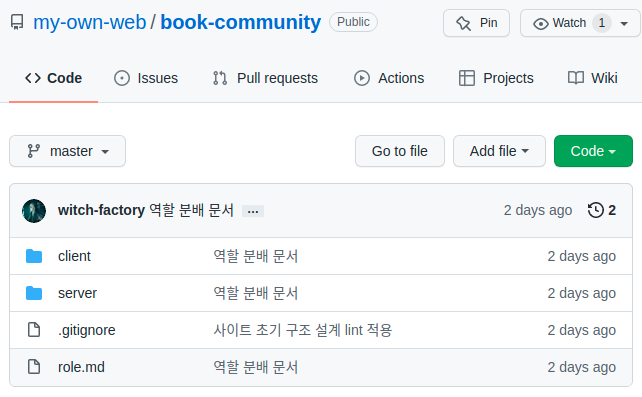
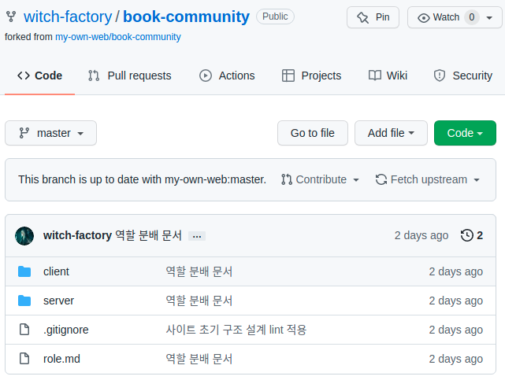
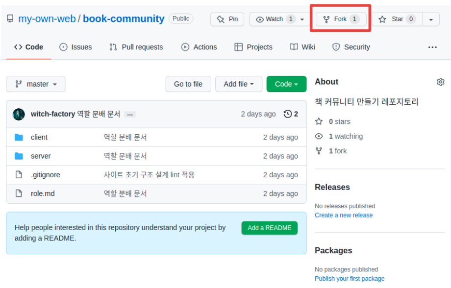
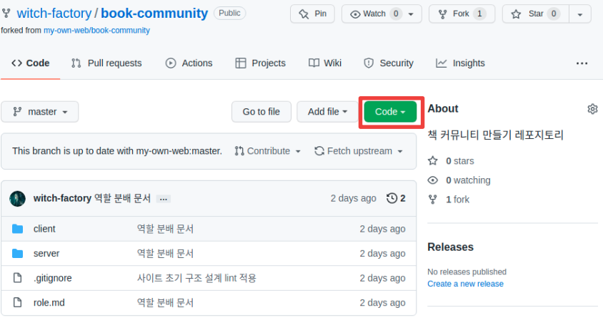
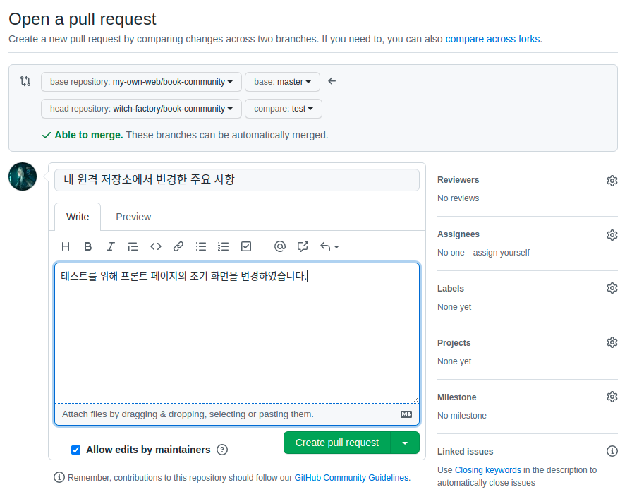
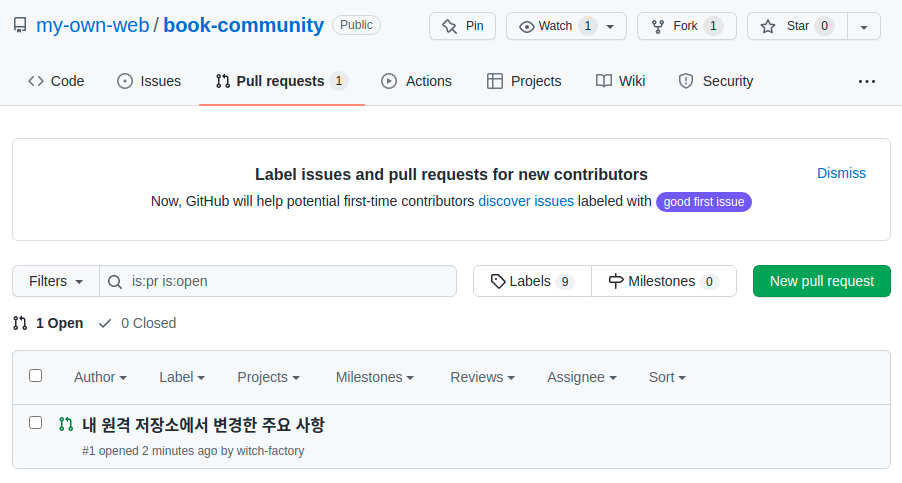
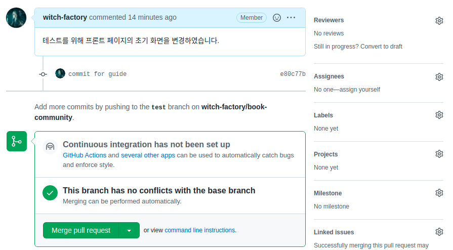

# 1. 협업 가이드라인의 필요성

내가 처음 다른 사람들과 코드를 같이 짜본 건 1년 전 어느 스터디에서였다. 많은 스터디가 그렇듯 그 스터디도 곧 흐지부지되었지만 거기서 굉장히 기억에 남는 경험을 하나 했다. 그때는 다같이 하나의 레포지토리를 사용하고, 브랜치로 각자의 작업을 분리해서 각자가 알아서 작업한 후 마스터 브랜치에 머지하는 주먹구구식 방식을 사용했었다. PR같은건 사용하지 않았다. 

그러던 어느 날 내가 실수로 마스터 브랜치에 내 작업을 커밋-푸시해서 남의 작업들을 통째로 날려버렸다. 다행히 이전 커밋 기록까지 밀어버리거나 한 건 아니라서 어떻게든 복구가 되었다. 하지만 다른 사람들의 모든 작업까지 한번에 다 날려버릴 뻔했다는 경험은 내 기억에 생생하게 남았다.

내가 실수한 것은 맞지만 내가 아니더라도 누구나 저지를 수 있는 실수였다고 감히 생각한다. 나를 제외한 다른 스터디원들도 프로그래밍이나 협업에 익숙한 사람들은 아니었으니까. 따라서 이번 프로젝트에서는 그런 실수를 좀 줄일 수 있는 가이드라인을 미리 만든다. 여전히 실수가 나올 수 있을 것이고, 어쩌면 내가 전혀 생각지도 못한 어떤 실수가 또 나올지도 모른다. 하지만 적어도 한번 했던 실수는 방지하는 게 좋지 않겠는가?

# 2. 사전 지식

## 1. 작업할 공용 공간 만들기

우리는 스터디를 할 때 쓰던 organization이 이미 있기 때문에 거기서 공용 저장소를 만들기로 했다. 따라서 organization에 레포지토리를 하나 새로 만들어서 그곳에서 작업을 하기로 했다.



이전 글에서 설명했던 것처럼 클라이언트와 서버 폴더를 만들고 역할 분배 문서도 적어서 넣어 놓았다.

## 2. 용어

**중앙 원격 저장소** : organization에 있는 원격 저장소. 여기서는 우리가 만든 book-community 공용 레포지토리를 가리킨다. 

**내 원격 저장소** : 내가 중앙 원격 저장소를 포크해 와서 내 계정에 만든 원격 저장소. git fork를 이용한다. 그리고 github 홈페이지에서는 `내 계정명/book-community` 와 같이 표시되며 중앙 원격 저장소가 어디인지도 표시해 준다.



내 계정에 fork해 와서 만든 원격 저장소 모습

**로컬 저장소** : 원격이 아니라 내 pc에 저장해 놓은 저장소. 실제 코드를 짜는 작업은 이곳에서 진행한다.

# 3. 협업 시스템 구성

## 1. 내 원격 저장소 만들기

github 홈페이지의 중앙 원격 저장소에서 fork를 이용하여, 중앙 원격 저장소를 내 계정으로 복사한다.



그러면 내 계정에 원격 저장소가 만들어진다.

## 2. 내 로컬로 원격 저장소 가져오기

이제 실제 작업을 위해서는 저장소의 내용을 내 로컬로 가져와서 작업해야 한다. 이를 위해서 `git clone` 을 이용해 내 로컬 저장소로 가져오자. 원격 저장소의 내용을 가져와서 작업하고 싶은 폴더를 만들고 그 폴더 내부에서 `git init`을 한 후 `git clone` 을 하자

```
git clone [원격 저장소 URL]
```

혹은

```
git remote add origin [원격 저장소 URL]
git pull origin [가져오고 싶은 브랜치 이름]
```

단 이 둘은 결과는 똑같더라도 차이가 있다. git clone은 로컬 저장소의 내용을 원격 저장소와 일치시켜 준다. 반면 git pull은 원격 저장소의 내용을 가져와서 로컬 저장소의 기존 내용과 병합해 주는 것이다.

지금 우리가 하는 것이 빈 폴더에 원격 저장소의 내용을 가져와 주는 것이기 때문에 둘의 결과는 같다. 하지만 만약 기존 작업 내용이 있는데 `git clone`을 실행한다면 로컬 저장소의 내용이 원격 저장소 내용으로 덮어씌워질 것이다. 반면 `git pull`은 충돌이 나지 않는 선에서 원격 저장소의 내용을 로컬 저장소와 병합한다.

따라서 처음에 원격 저장소를 로컬 저장소로 옮길 때는 git clone을 추천한다.

그런데 원격 저장소 URL은 어디 있는가? 중앙 원격 저장소를 내 게정으로 fork해 왔다면 그것에 해당하는 레포지토리가 내 계정에 존재한다. 그 레포지토리에 가서 `Code` 라 쓰인 버튼을 누르면 HTTP 혹은 SSH URL을 찾을 수 있다.



사진에서 빨간 표시가 된 버튼을 누르면 원격 저장소 URL을 찾을 수 있다. 위의 사진에서 중앙 원격 저장소가 아니라 내 원격 저장소(중앙 저장소에서 fork한 것)에 들어와 있는 것에 주의한다.

git clone을 통해 로컬 저장소에 내 원격 저장소가 잘 연결되었는지를 보려면 다음 명령어를 사용하면 된다.

```
git remote -v
```

로컬 저장소의 터미널에서 이 명령을 사용하면 현재 이 로컬 저장소에 연결된 원격 저장소에 지정된 이름과 URL을 볼 수 있다. 그러면 내가 아까 연결한 원격 저장소의 이름이 origin으로 설정되어 있는 것을 볼 수 있는데, 그것은 `git clone` 을 할 때 clone한 원격 저장소에 자동으로 지정되는 이름이 origin이기 때문이다.

만약 로컬 저장소에 기존에 연결되어 있는 어떤 원격 저장소가 있어서 그 원격 저장소와의 연결을 삭제하고 싶다면 다음과 같이 하면 된다.

```
git remote remove [삭제할 원격 저장소에 지정된 이름]
```

예를 들어 origin이라는 이름을 붙인 원격 저장소 연결을 삭제하고 싶으면 `git remote remove origin` 을 터미널에 타이핑하면 되는 것이다.

## 3. 로컬에 중앙 원격 저장소 연결

현재 우리의 로컬 저장소에는 중앙 원격 저장소를 내 계정에 fork한 저장소가 연결되어 있다. 하지만 중앙 원격 저장소 또한 연결해 놓는 것이 좋다. 왜냐 하면 내가 한 작업만 있는 게 아니기 때문이다.

다른 사람들이 작업한 결과물 A가 중앙 원격 저장소에 추가되었다고 하자. 그래도 내 원격 저장소는 중앙 원격 저장소와는 다른 저장소이기 때문에 A가 없다. 따라서 내가 A를 기반으로 어떤 추가적인 작업을 하기 위해서는 중앙 원격 저장소에서 A를 가져올 수 있어야 한다. 이런 작업을 위해 로컬 저장소에도 중앙 원격 저장소를 연결해 두고 중앙 원격 저장소의 내용(보통 남들이 작업한 결과물)을 가져올 수 있게 하는 것이다.

터미널에서 다음과 같은 스크립트를 입력해서 중앙 원격 저장소를 로컬 저장소와 연결한다.

```
git remote add upstream [중앙 원격 저장소 URL]
```

중앙 원격 저장소 URL 또한 위와 같이 github 홈페이지의 중앙 원격 저장소 레포지토리에서 `Code` 버튼을 누른다.

이제 중앙 원격 저장소를 내 계정으로 fork해서 내 원격 저장소를 만들었고 둘 다 내 로컬 저장소에 연결하였다. 내 원격 저장소는 origin으로, 중앙 원격 저장소는 upstream으로 연결되어 있다.

# 4. 새로운 작업을 하기

내가 맡은 새로운 작업은 로컬 저장소에서 새로운 브랜치를 따서 진행할 것이다. 그리고 작업이 완료되면 내 원격 저장소에 푸시한다. 그 다음 그 브랜치를 합병해 달라는 요청(Pull Request)을 중앙 원격 저장소에 보낸다. 이 과정을 하나하나 설명할 것이다.

## 1. 새로운 작업을 위한 브랜치 만들기

`git branch` 명령으로 현재 저장소가 위치하고 있는 브랜치를 확인할 수 있다. 아마 현재는 `master` 브랜치에 있을 것이다. 여기서 이제 새로운 작업을 위한 브랜치를 만들어서 거기서 작업을 진행하도록 하자. 다음 명령어로 새로운 이름의 브랜치를 만든다.

```
git branch [새로 만들 브랜치 이름]
```

그리고 다음 명령어로 새로 만든 브랜치로 이동한다.

```
git checkout [이동할 브랜치 이름]
```

위의 두 명령은

```
git checkout -b [새로 만든 다음 이동할 브랜치 이름]
```

예를 들어서 나는 

```
git branch test
git checkout test
```

라는 명령어로 `test` 라는 브랜치를 만들고 거기로 이동했다.

이제 내가 하려고 하는 작업을 로컬 저장소에서 진행한다.

## 2. 작업을 원격 저장소에 푸시하기

로컬 저장소에서 작업을 완료하고 나면 그것을 내 원격 저장소에 올려야 한다. 이때 중앙 원격 저장소에 올리는 것이 아니라 내 원격 저장소(중앙 원격 저장소를 fork한 것)에 올리는 것이라는 것에 크게 주의해야 한다. 먼저 다음 명령어로 내가 작업한 파일 내역을 확인할 수 있다.

```
git status
```

그러면 로컬에서 진행되었지만 아직 커밋되지 않은 작업 내역이 표시된다. 이 작업 내역을 스테이징 영역에 추가하자. 커밋할 수 있는 상태로 만들어 주는 작업이라고 생각하면 된다.

```
git add .
```

만약 특정 파일만 스테이징 영역에 추가하고 싶다면 git add 뒤에 `.` 대신 스테이징 영역에 추가하고자 하는 파일 이름을 쓰면 된다. 그렇게 스테이징 영역에 작업 내역을 추가하고 나면 커밋을 진행하자.

```
git commit -m "commit message"
```

이제 커밋을 통해 로컬 저장소에 있는 작업 내역들을 원격 저장소에 올릴 준비가 다 되었다. 우리가 작업을 진행하기로 한 브랜치에 푸시하자.

```
git push origin [작업중인 브랜치 이름]
```

이때 push하는 저장소가 origin임에 주의하자. origin은 중앙 원격 저장소가 아니다. 내가 중앙 원격 저장소를 내 계정으로 fork해온 내 원격 저장소이다. 그리고 브랜치명도, master가 아니라 내가 진행중인 작업을 위해 만든 브랜치에 푸시해야 한다. 내가 작업을 위해 만든 브랜치 이름이 `test` 라면 다음과 같이 진행한다.

```
git commit -a -m "commit message" #이 커맨드는 커밋과 함께  git add 도 같이 진행해 준다
git push origin test
```

## 3. 중앙 원격 저장소에 반영 요청하기

프로젝트에서 내가 맡은 부분의 작업을 내 원격 저장소에서 진행했다면 그것을 중앙 원격 저장소에도 올려서 모두가 볼 수 있게 해줘야 한다. 그래야 내 작업을 기반으로 다른 사람들이 다른 작업을 더 진행할 수도 있고, 또 중복된 일을 하는 것을 막을 수 있기 때문이다. 그러기 위해서는 중앙 원격 저장소에 내 작업의 반영을 요청해야 한다. 이를 Pull Request라 한다.

이 요청을 하면 내 원격 저장소에서 브랜치 하나를 택해서 중앙 원격 저장소에 반영하기를 요청할 수 있다. 나는 이 글에서  지금까지 `test` 라는 이름의 브랜치를 써 왔으므로 그 브랜치를 중앙 원격 저장소에 반영을 요청해 보겠다.

내가 test 브랜치에서 작업을 진행하면, git에서는 내 원격 저장소에서 중앙 원격 저장소의 내용을 fork해온 후 어떤 브랜치에서 추가적인 작업을 진행했는지를 추적해 준다. 그리고 중앙 원격 저장소에 비해 내 원격 저장소에서 진행한 내용이 있다면 그걸 반영할 수 있도록 해준다.


사진을 보면 `compare & pull request` 라 쓰인 버튼이 있는 것을 볼 수 있다. 이를 누르면 페이지가 이동되고 pull request의 이름과 설명을 적을 수 있다. 아래에서는 본인이 변경한 사항을 검토할 수도 있다. 이제 제목에 주요 변경사항을 적고, 내용에는 세부 설명을 적절히 써서 Create pull request를 하면 된다.



## 4. 중앙 원격 저장소에 반영하기

이제 중앙 원격 저장소의 pull request 메뉴에 가면 내가 요청한 pull request가 떠 있는 것을 볼 수 있다. 



pull request를 누르면 이 pull request에서 중앙 원격 저장소에 반영 요청한 커밋은 무엇이며 요청한 사람이 어떤 설명을 썼는지도 볼 수 있다. 커밋 내역을 누르면 그 커밋에서 변경한 사항을 볼 수도 있다. 커밋의 변경사항이 여러 개라면 이렇게 각 커밋마다 어떤 것을 변경했는지 볼 수 있는 기능이 유용하다. 내가 한 작업이라면 내가 웬만큼 알고 있겠지만 남의 작업을 볼 때 유용하다. 결과물 코드만 보고 남이 무슨 작업을 했는지 한눈에 아는 것은 쉽지 않기 때문이다. 



그리고 만약 특별한 문제가 없다면 Merge pull request 버튼을 통해서 pull request의 작업 내용을 중앙 원격 저장소에 반영할 수 있다.

그런데 무작정 merge를 하면 안 된다. 다른 작업 내용과 충돌할 수도 있고 팀의 다른 사람이 그 내용에 어떤 문제가 있다고 판단할 수도 있기 때문이다. 따라서 다른 사람의 확인과 충분한 이해를 받은 후에 merge 해야 한다.

그렇게 확인받은 후 merge하는 과정까지 거치면 내가 한 작업이 중앙 원격 저장소에 반영되는 것이다!

# 5. 다른 작업과 동기화하기

그런데 이 중앙 원격 저장소에서는 나만 작업을 하는 것이 아니다. 다른 팀원들도 작업을 하고 있다. 따라서 중앙 원격 저장소의 코드는 다른 사람들의 작업 내용이 반영되면서 내 작업과는 상관없이 변경될 것이다. 이런 변경 사항들을 내 로컬 저장소와 동기화해가며 작업해야 한다.

내가 작업한 내용이 다른 사람들의 작업 내용과 충돌하고 있을 수도 있고, 나도 다른 사람의 결과물을 기반으로 작업할 때가 있을 것이기 때문이다. 이러한 동기화는 다음과 같이 진행한다. 아까 로컬에 중앙 원격 저장소를 upstream이라는 이름으로 연결한 이유가 이제야 드러난다.

```
git pull upstream master
```

이러면 upstream이라는 이름으로 로컬 저장소에 연결된 중앙 원격 저장소의 master브랜치 내용을 로컬 저장소에 추가한다. 만약 오류가 발생하면 무언가 다른 사람의 작업 내용과 내 작업 내용이 충돌을 일으키는 등 어떤 문제가 생겼다는 것이므로, 오류 메시지를 잘 읽어보고 대처하자.

만약 저 커맨드가 특별한 오류 없이 완료된다면 로컬 저장소가 중앙 원격 저장소와 잘 동기화되었다는 것이다. 이를 내 원격 저장소에도 반영하고 싶다면 `git push origin master`를 쓰자.

## 1. 새로운 작업의 시작

내가 진행한 작업 하나가 끝나고, 그 사이에 진행된 다른 사람들의 작업물도 로컬 저장소와 동기화했다면 새로운 작업을 시작할 수 있는 상태로 다시 돌아왔다. 이제 다시 4. 번에서 새로운 작업을 시작하면서 했던 일로 돌아가자. 새로운 작업을 위한 브랜치를 만들어서 작업을 시작하면 된다.

# 6. 참고

매우 자세하게 쓰인 github 협업 가이드. 내가 쓴 글도 이걸 내가 이해한 대로 쓴 것에 불과하다. https://gmlwjd9405.github.io/2017/10/28/how-to-collaborate-on-GitHub-2.html 

git pull 과 git clone의 차이 https://kimcoder.tistory.com/288