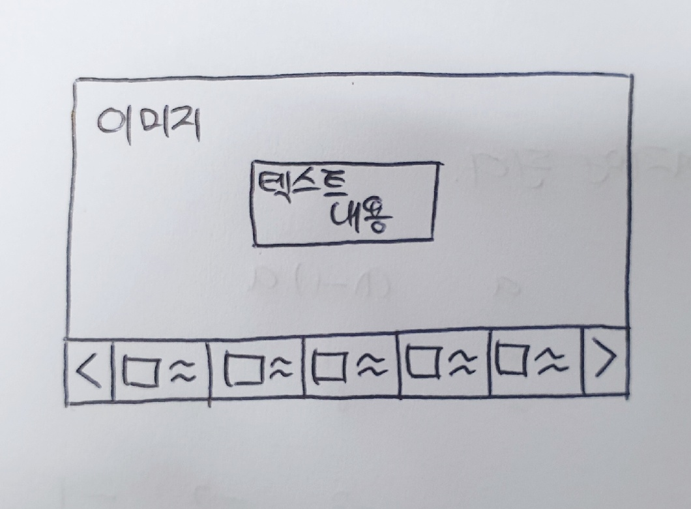
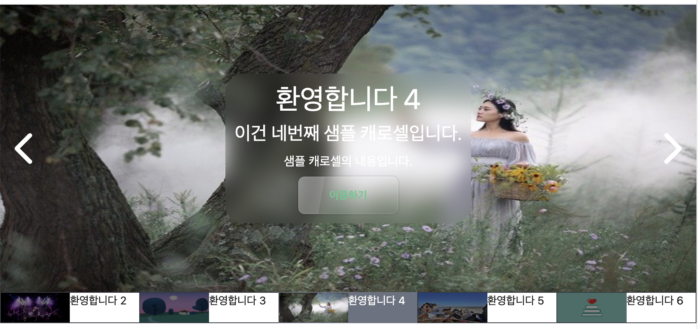

# 1. 캐로셀 네비게이션 구현 시작

지난 글들에서는 캐로셀에서 각 이미지들이 넘어가는 동작을 구현해 보고 버튼 등의 UI를 구현해 보았다. 우리의 캐로셀은 점점 발전하고 있다. 이제 웬만큼 캐로셀처럼 보이기는 한다. 하지만 아직 우리는 할 게 많다. 네비게이션도 구현해야 하고 모바일 환경을 고려해서 터치 이벤트에도 반응하도록 해야 한다. 접근성도 고민해야 한다. 캐로셀이 괜히 난이도가 높은 게 아니다. 그중에 이번 글에서는 캐로셀의 네비게이션을 구현해 본다. 단순히 버튼만 나열하는 것이 아니라 나름대로 깔끔하게, 또 사용하기 편하게 구현해 보고자 한다.

네비게이션을 만드는 이유는 이 캐로셀이 현재 보여주는 이미지 외에는 아무 정보도 제공하지 않기 때문이다. 사용자는 캐로셀에 얼마나 많은 이미지가 있는지, 각 캐로셀에 들어 있는 이미지는 무슨 의미인지 알 수가 없다. 설명이 있기는 하지만 그것도 결국 그 이미지까지 캐로셀을 넘겨 봐야 알 수 있다.

또한 내가 보고 싶은 게 어디 있는지 알아서 캐로셀의 그 이미지로 이동하려고 하더라도 캐로셀에 있는 특정 차례로 바로 이동할 수도 없다. 따라서 캐로셀의 각 페이지로 이동할 수 있으며 간단한 설명이 있는 네비게이션 버튼들을 캐로셀 하단에 만들어 보자.

이 캐로셀을 디자인할 때는 메이플스토리 메인 홈페이지(https://maplestory.nexon.com/Home/Main)에 있는 캐로셀 구성을 참고하였다. 물론 많이 조악해진 형태로 구현되었다..

# 2. 네비게이션 버튼 만들기

먼저 네비게이션이 어떤 방식으로 구현될지 한번 고민해 보자. 캐로셀의 아래에 있는 게 일반적이다. 그리고 각 캐로셀 요소의 이미지와 내용을 담은 요소들이 네비게이션에 위치할 것이다. 또한 현재 보고 있는 캐로셀 요소가 몇 번째 요소인지 보여주는 부분도 있어야 한다.

간략히 다음과 같은 설계를 해보았다. 캐로셀 이동을 위한 화살표도 아래로 내렸다.



우리는 이미 각 캐로셀 요소의 이미지와 거기에 대한 간략한 정보를 제공하는 속성을 가지고 있다. `CarouselItemType`타입의 `image`와 `title`이 그것이다. 이 속성을 이용해서 각 이미지와 설명이 표시된 네비게이션 요소를 만들어 보자. 먼저 한 줄에 버튼이 모두 들어가게 만들어 보자.

이를 위해 `CarouselNavigation`, `CarouselNavigationItem`컴포넌트를 만들자.

우리가 설계한 `CarouselNavigationItem`은 각각 이미지 하나와 짧은 텍스트 하나로 이루어질 것이다. 이를 div들의 집합으로 표현하거나 ul, li를 이용해서 표현할 수도 있을 것이다. 그러나 최근에 Data들의 집합을 표현하는 dl, dt, dd 태그에 대해 알게 되었고, 이를 이용해서 표현해 보았다. 먼저 `CarouselNavigationItem`은 이미지를 포함하는 dt, 짧은 텍스트를 포함하는 dd로 구성한다. 그리고 이 둘을 div로 감싸준다.

그리고 각 네비게이션 요소에는 flex-1 클래스(`flex:1 1 0;`)을 부여해서 버튼들이 부모 컨테이너를 같은 크기로 분할하도록 한다. 네비게이션 요소는 이미지, 텍스트가 똑같이 분할하게 할 것이므로 dt, dd 태그에도 `flex-1`클래스를 부여한다.

```tsx
function CarouselNavigationItem({ item }: { item: CarouselItemType }) {
  return (
    <div className="flex-1 flex flex-row border border-gray-500">
      <dt className="flex-1">
        
      </dt>
      <dd className="flex-1 text-sm">{item.title}</dd>
    </div>
  );
}
```

이제 `CarouselNavigation`은 `CarouselNavigationItem`을 여러 개 포함하는 dl로 구성한다. 단순히 가로로 배열해 주면 된다.

```tsx
function CarouselNavigation({ items }: { items: CarouselItemType[] }) {
  return (
    <dl className="flex flex-row w-full h-10">
      {items.map((item, index) => (
        <CarouselNavigationItem key={index} item={item} />
      ))}
    </dl>
  );
}
```

이를 Carousel 컴포넌트의 하단에 추가하면 다음과 같은 모습으로 렌더링되게 된다.


## 2.1 겹치는 테두리 제거

그런데 렌더링된 걸 잘 보면 네비게이션 요소끼리 만나는 곳의 테두리가 겹치는 것을 볼 수 있다. 이를 해결하는 건 간단하다. 요소가 겹치는 곳에는 테두리를 안 만들면 된다. 먼저 버튼의 오른쪽 테두리를 제거한다. 단순한 `border` 클래스 대신 `border-y border-l` 클래스를 주면 된다. 이렇게 하면 오른쪽 테두리는 제거되고 위쪽과 왼쪽 테두리는 그대로 남게 된다.

아직 하나의 문제가 있다. 우리가 오른쪽 테두리를 제거해 준 것은 다음에 오는 버튼의 왼쪽 테두리가 있어서 이 버튼의 오른쪽 테두리 역할도 겸해 줄 거라고 생각했기 때문이다. 하지만 맨 오른쪽 버튼의 경우 다음에 오는 버튼이 없다. 즉 맨 오른쪽 버튼의 경우 오른쪽 테두리가 아예 없게 된다.

이는 현재 버튼이 한 줄에 다 들어가 있으므로 last-child 선택자를 이용해서 맨 오른쪽 버튼의 오른쪽 테두리를 다시 만들어 주는 걸로 해결해 줄 수 있다. 나중에 버튼이 2줄 이상이게 되면 또 문제가 발생할 수도 있고 버튼의 테두리가 사라지게 되면 쓸모없는 방법일 수도 있지만 일단은 이렇게 해결해 주었다.

```tsx
function CarouselNavigationItem({ item }: { item: CarouselItemType }) {
  return (
    <div className="flex-1 flex flex-row border-y borderl-l last:border-r border-gray-500">
      <dt className="flex-1">
        
      </dt>
      <dd className="flex-1 text-sm">{item.title}</dd>
    </div>
  );
}
```

이렇게 하면 현재 코드에서는 버튼의 테두리 겹침이 일어나지 않는다.

# 3. 네비게이션 버튼의 현재 위치 표시

사용자가 지금 보고 있는 페이지가 어디인지 알 수 있게 해주는 정보도 제공해 보자. 간단하게, 캐로셀이 현재 위치한 페이지의 경우 해당 네비게이션 요소가 활성화되었다는 표시로 색을 입혀 주는 정도면 될 것이다. 그리고 이왕이면 활성화된 요소가 네비게이션의 가운데 위치하면 좋을 것이다.

## 3.1. 활성화된 버튼의 색상 변경

먼저 캐로셀이 현재 위치하고 있는 페이지에 해당하는 네비게이션 요소의 색상부터 변경해 주자. 이를 위해서 네비게이션 요소 컴포넌트를 변경시키자. 가져야 할 상태를 props로 받고(active, pending, inactive 정도의 상태가 있을 것)거기에 따라 적절한 방식으로 렌더링해주는 컴포넌트로 만들 것이다.

그러기 위해 먼저 네비게이션 요소의 상태를 결정하는 함수를 만들자. 아직은 매우 간단하게 활성화되어 있으면 `active` 비활성화되어 있으면 `inactive`를 반환하도록 할 것이다.

```tsx
const determineCarouselItemState = (itemIndex: number) => {
  if (itemIndex === carouselIndex.currentIndex) {
    return "active";
  } else {
    return "inactive";
  }
};
```

캐로셀 네비게이션 아이템 컴포넌트를 다음과 같이 변경해 보자. 아이템이 활성화되어 있는지를 의미하는 `itemState`를 props로 받도록 하고 이에 따라 `carouselItemConfig`를 통해 밝기, 배경색 등을 결정해 주었다. 또한 활성화된 아이템이 변경되는 동작을 transition을 이용해 부드럽게 나타나도록 처리했다.

```tsx
function CarouselNavigationItem({
  item,
  itemState,
}: {
  item: CarouselItemType;
  itemState: string;
}) {
  // active는 현재 캐로셀에서 보이고 있는 아이템에 해당하는 버튼의 상태
  // inactive는 화면에는 보이지만 활성화되어 있지 않은 버튼의 상태
  const carouselItemConfig: { [key: string]: string } = {
    active: "border-none bg-gray-500 text-base-100 hover:bg-gray-600",
    inactive: "border-y border-l last:border-r border-gray-500 brightness-50",
  };

  return (
    <div
      className={`flex-1 flex flex-row transition-all duration-700 ${carouselItemConfig[itemState]}`}
    >
      <dt className="flex-1">
        
      </dt>
      <dd className="flex-1 text-sm">{item.title}</dd>
    </div>
  );
}
```

또한 캐로셀 네비게이션 컴포넌트는 다음과 같이, `determineCarouselItemState`함수를 이용하여 각 아이템에 itemState를 넘겨주도록 했다.

```tsx
function CarouselNavigation({
  items,
  carouselIndex,
}: {
  items: CarouselItemType[];
  // 현재 캐로셀이 보여주고 있는 인덱스
  carouselIndex: CarouselIndexType;
}) {
  //아이템의 상태를 결정하는 함수
  const determineCarouselItemState = (itemIndex: number) => {
    if (itemIndex === carouselIndex.currentIndex) {
      return "active";
    } else {
      return "inactive";
    }
  };

  return (
    <dl className="flex flex-row w-full h-10">
      {items.map((item, index) => (
        <CarouselNavigationItem
          key={index}
          item={item}
          itemState={determineCarouselItemState(index)}
        />
      ))}
    </dl>
  );
}
```

이제 캐로셀 네비게이션에서 활성화된 페이지에 해당하는 요소가 특별하게 표시되는 것을 볼 수 있다.


## 3.2 특정 개수의 아이템만 네비게이션에 표시하기

하지만 만약 캐로셀의 페이지 개수가 많아진다면? 캐로셀의 페이지 수는 적으면 좋겠지만 그렇지 않은 경우도 있을 수 있다. 예를 들어 디자인에 큰 참고가 된 메이플스토리 메인 페이지의 경우 현재 기준으로 캐로셀에 25개의 페이지가 있다. 이 절반 정도 되는 11개의 페이지 정도만 넣어도 이렇게 보기 싫은 빽빽한 네비게이션 배치가 나온다.


따라서 캐로셀 네비게이션엔 기본적으로 현재 활성화되어 있는 페이지의 버튼, 그리고 그 앞뒤 2개씩의 인덱스에 해당하는 버튼까지 5개의 버튼이 들어가도록 할 것이다. 나머지 버튼은 일단은 화면에 보이지 않도록 한다. 이를 위해 앞서 작성한 `determineCarouselItemState`함수를 다음과 같이 수정한다.

활성화된 요소는 active, 화면에는 보이지만 비활성화된 요소는 pending, 아예 화면에 표시되지 않는 요소는 inactive로 구분하도록 한다.

```tsx
const determineCarouselItemState = (itemIndex: number) => {
  if (itemIndex === carouselIndex.currentIndex) {
    return "active";
  } else if (
    /* 
    캐로셀의 초반부나 후반부 페이지가 활성화되어있을 경우 
    활성화 요소를 가운데에 배치하지 못하더라도 5개를 일단 채운다 
    */
    carouselIndex.currentIndex === 0 ||
    carouselIndex.currentIndex === 1
  ) {
    return itemIndex < 5 ? "pending" : "inactive";
  } else if (
    carouselIndex.currentIndex === items.length - 1 ||
    carouselIndex.currentIndex === items.length - 2
  ) {
    return itemIndex >= items.length - 5 ? "pending" : "inactive";
  } else {
    return carouselIndex.currentIndex - 2 <= itemIndex &&
      itemIndex <= carouselIndex.currentIndex + 2
      ? "pending"
      : "inactive";
  }
};
```

그리고 inactive 상태인 요소는 화면에 표시되지 않도록 `display:none`에 해당하는 `hidden`클래스를 부여한다. 또한 `pending` 상태에도 적절한 스타일링을 한다. `CarouselNavigationItem` 컴포넌트를 다음과 같이 수정했다.

```tsx
function CarouselNavigationItem({
  item,
  itemState,
}: {
  item: CarouselItemType;
  itemState: string;
}) {
  // active는 현재 캐로셀에서 보이고 있는 아이템에 해당하는 버튼의 상태
  // pending은 화면에는 보이지만 활성화되어 있지 않은 버튼의 상태
  const carouselItemConfig: { [key: string]: string } = {
    active:
      "border-y border-l last:border-r border-gray-500 bg-gray-500 text-base-100 hover:bg-gray-600",
    pending: "border-y border-l last:border-r border-gray-500 brightness-50",
    inactive: "hidden",
  };

  return (
    <div
      className={`flex-1 flex flex-row transition-all duration-700 ${carouselItemConfig[itemState]}`}
    >
      <dt className="flex-1">
        
      </dt>
      <dd className="flex-1 text-sm">{item.title}</dd>
    </div>
  );
}
```

여기까지 완료하고 캐로셀을 렌더링해보면 아래와 같이 보인다. 디자인이 그렇게 훌륭하지는 않지만 어쨌든 각 페이지에 해당하는 버튼이 표시되고, 주변 페이지의 버튼도 네비게이션에 잘 표시된다. 캐로셀이 초반 페이지나 후반 페이지에 있을 때에도 꽤 일반적으로 잘 작동한다. 네비게이션은 언제나 5개(물론 캐로셀에 5개 미만의 요소가 있을 때는 제외)의 버튼을 가지고 활성화된 페이지의 버튼을 잘 감지한다.



# 4. 네비게이션 버튼 동작 구현

지금은 캐로셀의 네비게이션 아이템을 눌렀을 때 그 페이지로 이동하는 기능이 없다. 기존에 있는 화살표를 통해 캐로셀을 이동하면 활성화된 요소의 색이 바뀔 뿐이다. 이제 네비게이션 아이템을 통해 특정 페이지로 이동하는 기능을 구현해보자.

그런데 지금 캐로셀에서 활성화된 페이지 인덱스를 관리하는 기능은 `CarouselNavigation`의 상위 컴포넌트인 `Carousel`에서 `carouselIndex` state를 통해 가지고 있다. 따라서 네비게이션에 페이지 이동 기능을 추가해 주기 위해서는 `CarouselNavigation`컴포넌트에 props로 `setCarouselIndex`를 넘겨줘야 한다.

그렇게 작성한 `CarouselNavigation`컴포넌트는 다음과 같아진다.

```tsx
function CarouselNavigation({
  items,
  carouselIndex,
  setCarouselIndex,
}: {
  items: CarouselItemType[];
  // 현재 캐로셀이 보여주고 있는 인덱스
  carouselIndex: CarouselIndexType;
  setCarouselIndex: (newCarouselIndex: CarouselIndexType) => void;
}) {
  //버튼의 상태를 결정하는 함수
  const determineCarouselItemState = (itemIndex: number) => {
    if (itemIndex === carouselIndex.currentIndex) {
      return "active";
    } else if (
      /* 
    캐로셀의 초반부나 후반부 페이지가 활성화되어있을 경우 
    활성화 요소를 가운데에 배치하지 못하더라도 5개를 일단 채운다 
    */
      carouselIndex.currentIndex === 0 ||
      carouselIndex.currentIndex === 1
    ) {
      return itemIndex < 5 ? "pending" : "inactive";
    } else if (
      carouselIndex.currentIndex === items.length - 1 ||
      carouselIndex.currentIndex === items.length - 2
    ) {
      return itemIndex >= items.length - 5 ? "pending" : "inactive";
    } else {
      return carouselIndex.currentIndex - 2 <= itemIndex &&
        itemIndex <= carouselIndex.currentIndex + 2
        ? "pending"
        : "inactive";
    }
  };

  // 특정 인덱스의 페이지로 이동하는 함수
  const onCarouselNavigationItemClick = (itemIndex: number) => {
    setCarouselIndex({
      prevIndex: itemIndex === 0 ? items.length - 1 : itemIndex - 1,
      currentIndex: itemIndex,
      nextIndex: itemIndex === items.length - 1 ? 0 : itemIndex + 1,
    });
  };

  return (
    <dl className="flex flex-row w-full h-10">
      {items.map((item, index) => (
        <CarouselNavigationItem
          key={index}
          item={item}
          itemState={determineCarouselItemState(index)}
          onItemClick={() => {
            onCarouselNavigationItemClick(index);
          }}
        />
      ))}
    </dl>
  );
}
```

그리고 `onCarouselNavigationItemClick` 함수를 받은 `CarouselNavigationItem` 컴포넌트는 다음과 같이 버튼으로 만든 후 onClick 이벤트 핸들러를 부여한다.

```tsx
function CarouselNavigationItem({
  item,
  itemState,
  onItemClick,
}: {
  item: CarouselItemType;
  itemState: string;
  onItemClick: () => void;
}) {
  // active는 현재 캐로셀에서 보이고 있는 아이템에 해당하는 버튼의 상태
  // pending은 화면에는 보이지만 활성화되어 있지 않은 버튼의 상태
  const carouselItemConfig: { [key: string]: string } = {
    active:
      "border-y border-l last:border-r border-gray-500 bg-gray-500 text-base-100 hover:bg-gray-600",
    pending: "border-y border-l last:border-r border-gray-500 brightness-50",
    inactive: "hidden",
  };

  return (
    <button
      onClick={onItemClick}
      className={`flex-1 flex flex-row transition-all duration-700 ${carouselItemConfig[itemState]}`}
    >
      <dt className="flex-1">
        
      </dt>
      <dd className="flex-1 text-sm">{item.title}</dd>
    </button>
  );
}
```

그러나 여전히 거슬리는 부분이 있다. 아까는 캐로셀 아이템이 이동하는 듯한 효과를 위해 transform 애니메이션을 넣었다. 하지만 네비게이션 바의 버튼을 이용해서 페이지를 이동하면 그 효과가 제대로 발생하지 않는다. 이는 캐로셀에서 이전 인덱스와 다음 인덱스의 정보만 저장하고 있기 때문이다.

이를 어떻게든 처리해서 기존 페이지에서 이동할 페이지로 페이지가 쭉 넘어가는 효과를 줄 수도 있을 것이다. 하지만 그렇게 하면 넘길 페이지가 많을 때 10개가 넘는 페이지가 사용자의 시선을 빠른 속도로 지나가게 된다. 이는 매우 어지러울 것이다. 따라서 전환 효과를 리뉴얼하자.

캐로셀의 동작 로직을 좀 많이 바꿀 예정이라 이는 다음 글에서 다룬다.

# 참고

디자인 참고 https://maplestory.nexon.com/Home/Main

dl, dt, dd 태그의 사용 https://xo.dev/why-html-is-important-than-you-think/

자식 요소들의 너비를 균등하게 분배하기 https://stackoverflow.com/questions/23930684/allocate-equal-width-to-child-elements-with-css

`flex:1 1 0;`의 의미 https://heewon26.tistory.com/275

버튼 테두리가 겹치는 현상 막기 https://stackoverflow.com/questions/12692089/preventing-double-borders-in-css
