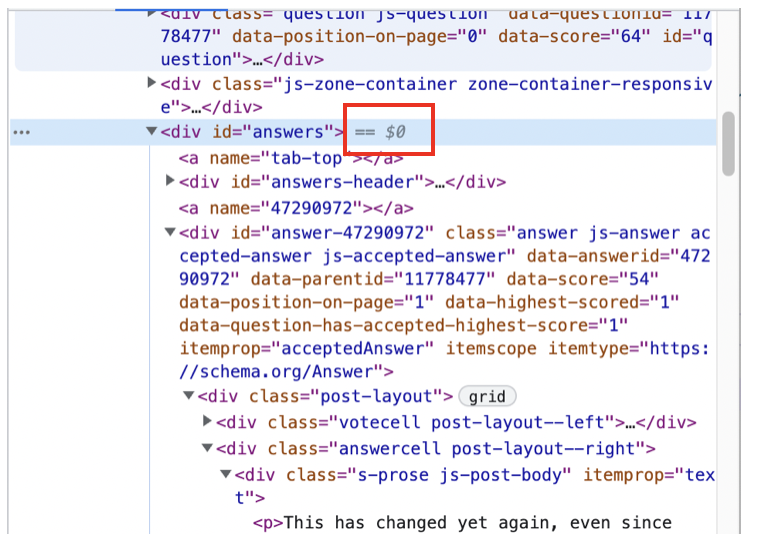
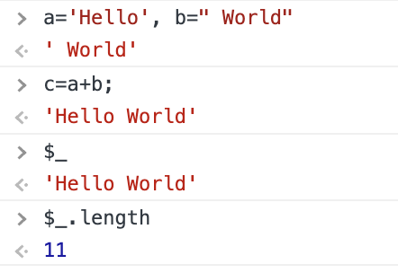
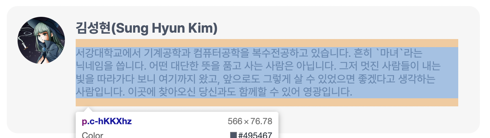
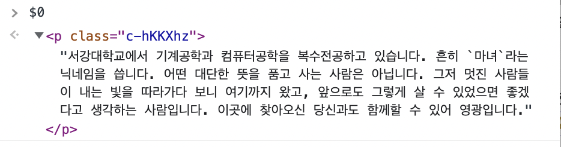
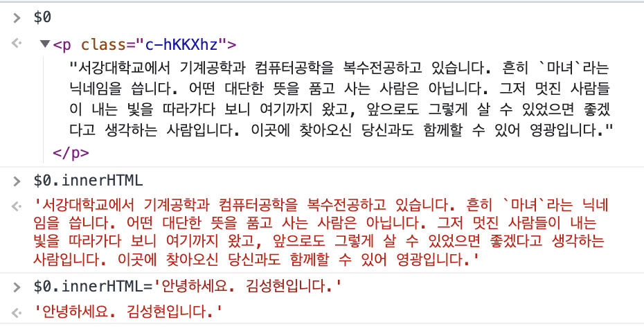
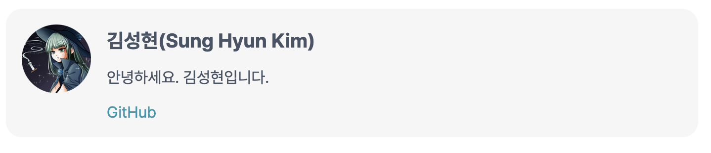
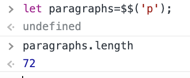
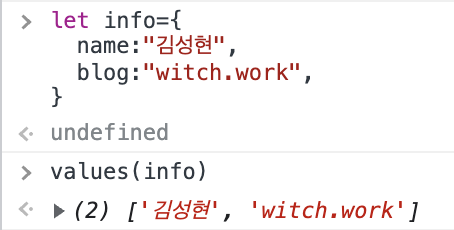
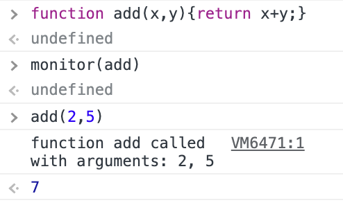
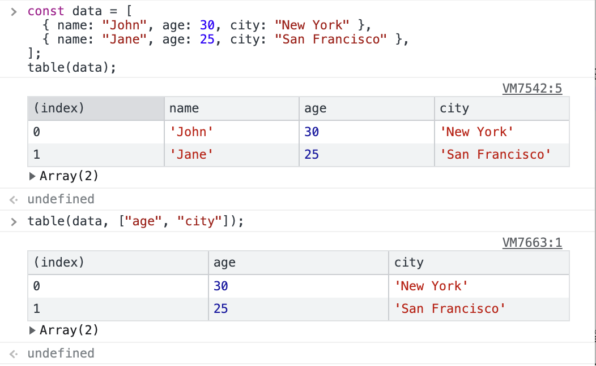

# 1. 시작

개발하다 보면 개발자 도구에서 `$` 표시를 볼 수 있다. Element 탭에서 내가 어떤 요소를 선택할 때마다 그 뒤에 `==$0`이 뜨는 등의 경우이다.



그리고 element 탭에서 특정 요소를 선택한 후 개발자 도구의 콘솔 창으로 이동해서 `$0`을 입력하면 선택한 요소가 출력되는 것도 볼 수 있다. 개발자 도구에서 `$`를 사용하는 것은 대체 무엇을 의미하는 것일까?

개발자 도구에서 `$`가 들어가는 편리한 표현들 그리고 다른 몇 가지 편의기능을 알아보자.

# 2. 기본

## 2.1. `$_`

`$_`는 바로 직전에 실행한 명령의 결과값을 나타낸다. 예를 들어 `1 + 2`를 입력하고 `Enter`를 누르면 `3`이 출력된다. 이 때 `$_`를 입력하면 `3`이 출력된다.

또한 그 결과값에 적용되는 프로퍼티나 메서드도 똑같이 적용할 수 있다. 아래 예시를 보면 `$_`에 `length`를 적용한 결과값이 출력된다. `toUpperCase()`와 같이 문자열에 적용할 수 있는 메소드라면 다른 것도 가능하다.



## 2.2. `$0`, `$1`, `$2`, ...

`$0`, `$1`, `$2`, `$3`, `$4`는 각각 Element 탭에서 선택한 DOM 요소의 historical reference를 나타낸다. 커서를 통해 선택된 요소도 여기에 포함된다.

`$0`은 가장 최근에 선택한 요소를 나타내고, `$1`은 그 전에 선택한 요소를 나타낸다. `$2`는 그 전에 선택한 요소를 나타낸다. 이런 식으로 `$0`부터 `$4`까지 총 5개까지 선택한 요소의 역사를 나타낼 수 있다.

이렇게 참조된 DOM 요소를 편집하는 것도 가능하다. 예를 들어서 내 블로그에서 프로필 사진을 선택해 본다.

개발자 도구의 Select 커서를 이용하면 다음과 같이 내 프로필의 자기소개를 선택할 수 있다. p태그로 이루어져 있다.



이제 `$0`을 입력하면 선택한 태그를 확인할 수 있다. 만약 이 다음에 Element 패널에서 다른 요소를 선택한다면 기존의 `$0`은 `$1`이 되고 새로 선택한 요소는 `$0`이 된다.



이제 `$0`에 `innerHTML`를 적용하면 내부에 써있는 메시지도 확인할 수 있다. 그리고 `$0`은 DOM 요소에 대한 참조 자체를 담고 있으므로 이를 통해서 편집도 가능하다. 



이렇게 편집 후 페이지를 보면 내 블로그의 자기소개 칸이 바뀐 것을 확인할 수 있다.



# 3. 다른 함수의 단축 표현

## 3.1. document.querySelector

`$(selector)`는 `document.querySelector(selector)`의 단축 표현이다. `document.querySelector`는 CSS 선택자를 통해 DOM 요소를 선택할 수 있다.

따라서 개발자 도구에서 `$(선택자)`를 입력하면 document에서 해당 선택자에 해당하는 첫 DOM 요소를 선택할 수 있다. `$('p').innerHTML`과 같이 선택한 태그의 어트리뷰트를 확인할 수도 있다.

또한 그렇게 출력된 DOM 요소를 우클릭하고 Reveal in Elements Panel를 선택하면 해당 요소가 선택된 상태로 Elements 패널이 열린다.

그리고 이 함수는 2번째 인자를 받을 수도 있다. 이 2번째 인자는 `$`함수가 해당하는 선택자를 갖는 요소를 탐색할 때 어떤 노드에서부터 시작할지를 결정한다. 기본값은 `document`이다.

주의할 점은 jQuery의 경우 `$`가 이미 있는 함수라는 것이다. 제이쿼리를 사용하는 경우 그 라이브러리의 `$`함수가 사용된다.

## 3.2. document.querySelectorAll

`$$(selector)`는 `Array.from(document.querySelectorAll())`의 단축 표현이다. 주어진 CSS 선택자에 해당하는 모든 요소들을 담은 배열을 리턴해 주는 것이다.

다음과 같이 페이지에서 `p`태그 요소들을 모두 담은 배열을 만들고 그 길이를 구하는 연산을 간단히 해볼 수 있다.



이 함수 역시 2번째 인자를 받을 수 있다. 이 2번째 인자는 `$$`함수가 인자로 받은 CSS 선택자를 갖는 요소를 탐색할 때 어떤 노드에서부터 시작할지를 결정한다. 기본값은 `document`이다.

## 3.3. XPath expression

`$x(path)`는 XPath expression을 통해 DOM 요소를 선택할 수 있다. XPath는 XML 문서를 탐색하기 위한 언어이다. HTML 문서도 XML 문서이기 때문에 XPath를 사용하여 HTML 문서를 탐색할 수 있다.

예를 들어서 `$x('//p')`는 페이지에서 모든 `p`태그 요소를 선택한다고 한다. 또한 `$x('//p[a]')`는 페이지에서 `p`태그 요소 중에서 `a`태그를 포함하는 요소를 모두 선택한다. XML에서의 일종의 정규식과 같은 역할을 하는 것 같은데 후에 공부가 필요할 것 같다.

이 함수 역시 2번째 인자를 받을 수 있다. 이 2번째 인자는 `$x`함수가 인자로 받은 XPath expression을 갖는 요소를 탐색할 때 어떤 노드에서부터 시작할지를 결정한다. 기본값은 `document`이다.

# 4. 그 외 기능들

개발자 도구 콘솔창에서 쓸 수 있는 그 외 기능들이다.

## 4.1. copy()

`copy(object)`는 인자로 받은 요소의 string representation을 클립보드에 복사해 준다. `copy($0)`과 같이 사용할 수 있다.

## 4.2. debug(function)

위 기능을 사용하면 디버거가 실행되고 인자로 받은 함수 내에서 중단점을 잡아준다. 그리고 Sources 패널에서 디버거 기능을 활용해서 디버깅하도록 돕는다.

이렇게 중단점을 잡는 기능은 Sources 패널에서 쓰면서 디버깅하는 게 더 나을 것 같긴 하다.

undebug(function)을 통해 debug(function)으로 설정한 중단점을 제거한다.

## 4.3. dir(object)

`dir(object)`는 인자로 받은 객체의 속성들을 출력해 준다. `dir($0)`과 같이 사용할 수 있다. console.dir과 같은 기능을 한다. 비슷하게 `dirxml(object)`도 있다.

## 4.4. inspect(object/function)

주어진 요소나 객체를 적절한 패널에서 보여준다. 예를 들어 `inspect($0)`, `inspect(document.body)`과 같이 주어진 인자가 DOM 요소라면 해당 요소가 선택된 상태로  Element 패널이 열릴 것이다.

주어진 인자가 함수라면 Sources 패널에서 해당 함수가 정의된 곳으로 이동할 것이다.

## 4.5. getEventListeners(object)

해당 객체에 등록되어 있는 이벤트 리스너들의 객체를 출력해 준다. click, keydown 이벤트 등 각 이벤트마다 해당하는 리스너들의 배열이 객체에 매핑되어 있다.

## 4.6. keys(object)

`keys(object)`는 인자로 받은 객체의 속성들을 리턴해 준다. 

```js
let info={
  name:"김성현", 
  blog:"witch.work",
}

console.log(keys(info)) // ["name", "blog"]
```

객체의 속성 대신 속성에 매핑된 값들을 배열 형태로 리턴하는 함수로 `values(object)`도 있다.



## 4.7. monitorEvents(object[, events])

`monitorEvents(object[, events])`는 인자로 받은 객체에 등록되어 있는 이벤트 리스너들을 모니터링한다. 이벤트 리스너가 호출되면 콘솔에 출력해 준다.

```js
moniterEvents(document.body, ["click", "keydown"])
```

위와 같이 쓴다면 document.body에 등록되어 있는 click, keydown 이벤트 리스너들이 호출될 때마다 콘솔에 출력해 줄 것이다.

또는 이벤트 타입을 통해서 이벤트를 모니터링할 수도 있다. 예를 들어서 document.body에 키 관련 이벤트들을 모두 모니터링하고 싶다면 `monitorEvents(document.body, "key")`처럼 쓰면 된다.

이외에도 mouse, touch, control 이벤트 타입이 있다.

unmonitorEvents(object[, events])를 쓰면 해당 객체에 대한 이벤트 리스너 모니터링을 해제할 수 있다. unmonitorEvents(object)와 같이 쓰면 해당 객체에 대한 모든 이벤트 모니터링을 해제할 수 있다.

## 4.8. monitor(function)

`monitor(function)`는 인자로 받은 함수를 모니터링한다. 함수가 호출될 때마다 콘솔에 출력해 준다. 다음과 같이 monitor 설정한 함수가 출력될 때마다 그 함수가 출력되었다는 메시지와 인자를 출력해 준다.



unmonitor(function)을 쓰면 해당 함수에 대한 모니터링을 해제할 수 있다.

## 4.9. queryObjects(constructor)

`queryObjects(constructor)`는 인자로 받은 생성자 함수를 통해 생성된 객체들을 배열 형태로 리턴해 준다. 예를 들어서 `queryObjects(HTMLDivElement)`를 쓰면 HTMLDivElement 생성자 함수를 통해 생성된 객체들을 리턴해 줄 것이다.

만약 `a`가 클래스명이라면 `queryObjects(a)`를 쓰면 `new a()`를 통해 생성된 모든 객체들을 리턴해 줄 것이다. Promise와 같은 내장 생성자 함수에도 사용할 수 있다. 

`queryObjects(Promise)`를 쓰면 Promise 생성자 함수(`new Promise()`)를 통해 생성된 모든 객체들을 리턴해 줄 것이다.

## 4.10. table(data)

console.table()의 단축 표현이다. 주어진 객체를 테이블 형태로 출력해 준다. 다음과 같이 데이터 객체에 쓸 수 있다.

```js
const data = [
  { name: "John", age: 30, city: "New York" },
  { name: "Jane", age: 25, city: "San Francisco" },
];
table(data);
```

2번째 인자로는 columns 배열을 선택적으로 넣을 수 있다. 이 배열을 넣을 시에 주어진 객체의 키 중에서 columns 배열에 포함된 키만 출력해 준다.



# 참고

`$`에 관련된 스택오버플로우의 질문 https://stackoverflow.com/questions/11778477/variable-dollar-sign-in-chrome

구글 콘솔 유틸리티에 관한 문서 https://developer.chrome.com/docs/devtools/console/utilities/