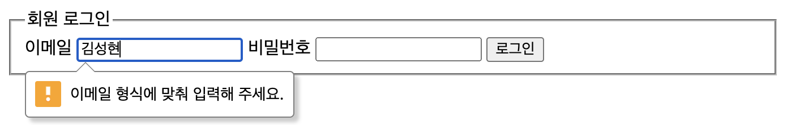

앞서 HTML로 폼 요소를 만들 때 쓰일 수 있는 요소들을 알아보았다. 그런데 폼의 기본적인 목적은 데이터를 제대로 제출하는 것이다. 따라서 폼의 데이터를 어떻게 다룰지에 대한 방법도 여러가지 나와 있다. 이를 알아보자.

# 1. 폼 유효성 검사

앞에서 본 `<input type="email">`과 같이 HTML5에서 도입된 새로운 input type들은 브라우저에서 자체적으로 유효성 검사를 해준다. 이런 것을 클라이언트 유효성 검사라 한다.

물론 이는 postman 등을 통해서 서버에 직접 요청을 보낼 수 있는 방법이 있기 때문에 얼마든지 회피할 수 있다. 따라서 이런 클라이언트 사이드의 유효성 검사를 보안 목적으로 사용할 수는 없다. 서버에서도 따로 제출된 폼의 유효성 검사를 해줘야 한다.

하지만 클라이언트 유효성 검사는 사용자 경험을 향상시키는 데에는 좋은 방법이다. 사용자가 잘못된 데이터를 입력하면 바로 알려줄 수 있고 속도도 빠르기 때문이다.

이런 클라이언트 유효성 검사에는 input의 속성 등을 이용하는 빌트인 방식과 JS를 이용해서 커스터마이징한 유효성 검사가 있다. `pattern`을 이용해서 정규식을 통해 유효성을 검사하는 것도 빌트인 방식으로 친다.

## 1.1. JS로 유효성 검사 개요

빌트인 속성을 이용한 유효성 검사를 할 때 쓰는 속성은 [input 태그에 대한 글](https://witch.work/posts/dev/html-input-tag)에 거의 다 나와 있다. 따라서 JS로 만드는 유효성 검사를 알아보자.

이를 `Constraint Validation API`라 하는데 이는 form 요소들에서 사용가능한 메서드와 속성들로 구성된다. 참고로 이들을 지원하는 DOM 요소는 다음과 같다.

- `<input>`(HTMLInputElement)
- `<select>`(HTMLSelectElement)
- `<button>`(HTMLButtonElement)
- `<textarea>`(HTMLTextAreaElement)
- `<fieldset>`(HTMLFieldSetElement)
- `<output>`(HTMLOutputElement)

`willValidate`는 해당 요소가 폼 제출 시 유효성 검사가 진행되는 요소일 경우 true, 아니면 false를 반환한다. 

`validity`는 요소의 유효성 검사 결과를 담은 `ValidityState` 객체이다. `validationMessage`는 요소가 유효하지 않을 경우 그 상태를 설명하는 메시지를 반환한다. 만약 유효하거나 요소의 `willValidate`가 false라면 빈 문자열을 반환한다.

이 객체의 키들은 각각의 유효성 검사 결과에 따라서 불린값을 가진다. 가령 `pattern`유효성 검사에서 실패하면 `patternMismatch`가 true가 된다. `tooLong`, `tooShort`, `typeMismatch`, `valueMissing` 등의 객체 프로퍼티들이 더 있다.

요소의 값의 전체 유효성 검사 결과를 반환하는 `checkValidity()` 메서드와 유효성 검사 결과를 조사하기만 하는 `reportValidity`메서드가 간간이 쓰인다. 커스텀 에러 메시지를 설정하는 `setCustomValidity(message)`메서드도 존재한다.

## 1.2. 유효성 검사 메시지 내용 커스텀

위 API를 이용하면 폼의 유효성 검사에 따라서 커스텀 메시지를 보여줄 수 있다. 이는 몇 가지 장점이 있는데 첫째는 폼의 메시지를 CSS로 스타일링할 수 있다는 것이고, 둘째는 폼의 메시지를 다국어로 제공할 수 있다는 것이다. 

기본 유효성 검사 메시지는 브라우저마다, 국가마다 내용도 디자인도 다른데 JS로 이런 유효성 검사 메시지를 커스텀하면 이를 통일시킬 수 있는 방법이 되는 것이다.

이제 JS를 이용해서 커스텀 에러 메시지를 만들어 보자. 먼저 간단한 로그인 폼을 만든다.

```html
<form>
  <fieldset>
    <legend>회원 로그인</legend>
      <label for="email">이메일</label>
      <input type="email" id="email" name="email" required />
      <label for="password">비밀번호</label>
      <input type="password" id="password" name="password" required />
      <button type="submit">로그인</button>
  </fieldset>
</form>
```

그리고 `<script>` 태그를 통해서 JS파일을 불러온다.

이 JS파일은 다음과 같이 작성한다. emailInput의 `typeMismatch`검증 결과가 false이면 `setCustomValidity`를 통해서 에러 메시지를 빈 문자열로 설정한다. 이는 유효성 검사가 통과했음을 의미한다. 반면 `setCustomValidity`를 통해서 에러 메시지를 설정하면 유효성 검사가 실패했음을 의미한다. 그리고 설정된 에러 메시지는 형태는 브라우저마다 다르지만 input의 아래에 출력되게 된다.

```js
// main.js
const emailInput= document.getElementById('email');

emailInput.addEventListener('input', function(event) {
  if(emailInput.validity.typeMismatch) {
    emailInput.setCustomValidity('이메일 형식에 맞춰 입력해 주세요.');
  }
  else{
    emailInput.setCustomValidity('');
  }
});
```



## 1.3. 유효성 검사 메시지 커스텀

form 요소에 `novalidate` 어트리뷰트를 주면 브라우저의 자동 유효성 검사가 꺼진다. 하지만 이것이 constraint validation API나 `:valid`같은 CSS 의사 클래스 기능을 못 쓰게 된다는 건 아니다. 우린 이걸 이용해서 우리의 커스텀 유효성 검사와 커스텀 유효성 메시지 표시 방식을 적용한 form을 만들 수 있다.

먼저 이메일 입력창에 유효성 검사를 위한 어트리뷰트를 지정한다. `type="email"`에서 이메일 형식에 대한 검증은 진행하므로 최소 길이 8 제한만 걸었다.

에러 메시지는 이메일 input 아래에 span 태그를 만들고 valid 상태에 따라서 에러 메시지를 출력하도록 한다. 이때 `aria-live="polite"`를 주면 스크린 리더가 에러 메시지를 읽어준다. 단 스크린 리더 우선순위가 그렇게 높지는 않다.

```html
<!-- 폼의 기본 유효성 검사 끄기 -->
<form novalidate>
  <fieldset>
    <legend>회원 로그인</legend>
      <label for="email">이메일</label>
      <input type="email" id="email" name="email" required minlength="8" />
      <span id="email-error-message" class="error" aria-live="polite"></span>
      <label for="password">비밀번호</label>
      <input type="password" id="password" name="password" required />
      <button type="submit">로그인</button>
  </fieldset>
</form>
```

CSS는 상황에 따라서 에러 메시지를 보여주는 것에 대한 것이므로 `error`클래스가 기본적으로 보이지 않는 상태로 설정해야 한다는 것 외에는 적당히 만들면 된다.

중요한 건 다음과 같이 validity 체크에 따라서 에러 메시지를 보여주는 JS를 작성하는 것이다. 이메일 입력창 값이 바뀌는 이벤트가 발생할 때마다 유효성 검사를 진행하고, 유효하지 않으면 에러 메시지를 출력하고, 유효하면 에러 메시지를 지운다.

```js
const form = document.querySelector('form');
const emailInput= document.getElementById('email');
const emailError = document.getElementById('email-error-message');

function showError() {
  if(emailInput.validity.valueMissing) {
    emailError.textContent = '이메일 주소를 입력해 주세요.';  
  }
  else if(emailInput.validity.typeMismatch) {
    emailError.textContent = '이메일 형식에 맞게 입력해 주세요.';
  }
  else if(emailInput.validity.tooShort) {
    emailError.textContent = `이메일은 ${ emailInput.minLength }자 이상 입력해 주세요.`;
  }

  emailError.className = 'error active';
}

emailInput.addEventListener('input', function(event) {
  if(emailInput.validity.valid) {
    emailError.textContent = '';
    emailError.className = 'error';
  }
  else{
    showError();
  }
});

form.addEventListener('submit', function(event) {
  if(!emailInput.validity.valid) {
    showError();
    event.preventDefault();
  }
});
```

form에 관련된 컴포넌트를 커스텀하는 경우 이런 constraint validation API를 사용하지 못할 수 있다. 그럴 때는 JS를 이용해서 직접 검증 로직을 짜야 한다.

어떤 유효성을 검증할 건지, 그리고 유효성 검사를 통과하지 못할 때 어떤 동작을 할 건지 그리고 사용자가 이를 정정하도록 어떻게 도울 것인지를 고민해야 한다. 이는 UI 분야의 일이다. [도움이 될 만한 링크를 MDN에서도 제공한다.](https://www.nngroup.com/articles/errors-forms-design-guidelines/)

# 2. 폼 데이터 보내기

데이터를 잘 검증했다면(물론 서버에서 한 번 더 검증해야 하지만)이제 폼을 제출하면 된다. `<form>`요소에서는 사용자가 제출 버튼을 눌렀을 때 어떻게 데이터 전송이 동작할지를 `action`과 `method` 속성으로 지정할 수 있다.

간단히 얘기하면 파일이 아닌 폼 제어 요소의 값들은 `name=요소 value`형태로 인코딩되어 `action`에 지정된 URL로 전송된다. 이때 `method`에 지정된 HTTP 메서드로 전송된다. 만약 `method`가 지정되지 않으면 기본값인 GET으로 전송된다.

## 2.1. action과 method

`action`은 폼 데이터를 전송할 URL을 지정한다. 절대 URL, 상대 URL을 모두 쓸 수 있으며 생략하면 현재 폼이 속한 페이지로 전송한다. 만약 폼이 HTTPS 페이지에 있고 `action`에 HTTP URL을 지정하면 브라우저는 경고를 띄운다.

`method`는 폼 데이터를 전송할 HTTP 메서드를 지정한다. "GET"이나 "POST"가 많이 쓰인다. 해당 메서드가 궁금하다면 [MDN HTTP 원리](https://developer.mozilla.org/en-US/docs/Web/HTTP/Overview) 참고.

GET으로 데이터 전송시 request body가 비어 있으므로 서버에 보내는 데이터는 URL에 쿼리스트링으로 저장된다. GET이 기본 `method` 값이다.

반면 POST로 전송시 request body에 데이터가 담겨서 전송된다. 개발자 도구 네트워크 탭에서 request body에 든 form 데이터를 확인할 수도 있다.

## 2.2. 파일 보내기

HTML 폼으로 파일을 보내는 건 일반적인 텍스트를 보내는 것과는 다르게 이루어져야 한다. 파일은 이진 데이터인데 HTTP 프로토콜은 텍스트 기반 프로토콜이므로 파일을 전송할 때는 좀 다른 처리가 필요하다.

이는 `enctype`어트리뷰트로 해결할 수 있다. 이 어트리뷰트는 request header의 `Content-Type`을 지정한다. 이 타입은 서버에 어떤 종류의 데이터가 전송되는지를 알려준다. 기본값은 `application/x-www-form-urlencoded`이다. 이는 폼 데이터를 URL 파라미터에 인코딩한 것이다.

파일을 지정할 때는 일단 파일 컨텐츠가 URL 파라미터에 들어가지 않게 `method`를 POST로 지정하고 `enctype`을 `multipart/form-data`로 지정한다. 데이터가 여러 부분으로 나누어져 전송될 것이기 때문이다.

## 2.3. 보안

https://developer.mozilla.org/en-US/docs/Learn/Forms/Sending_and_retrieving_form_data#be_paranoid_never_trust_your_users

HTML 폼은 서버 공격이 가장 흔하게 일어나는 지점이다. 보안 문제는 흔히 서버에서 데이터를 어떻게 다루는지에서 일어나기 때문이다. 가령 SQL 인젝션이라든지.

이후에 보안 부분을 또 공부하겠지만 가장 중요한 건 사용자 입력을 믿지 않는 것이다. 신뢰할 수 있는 사용자이더라도 컴퓨터를 하이재킹당했을 수 있다. 따라서 무조건 잠재적인 위협이 있는 문자들을 거르고 또한 들어오는 데이터의 양과 종류를 제한하는 게 좋다. 업로드된 파일은 다른 곳에 저장하는 게 좋다.


# 참고

https://developer.mozilla.org/en-US/docs/Learn/Forms/Form_validation

https://developer.mozilla.org/en-US/docs/Learn/Forms/Sending_and_retrieving_form_data