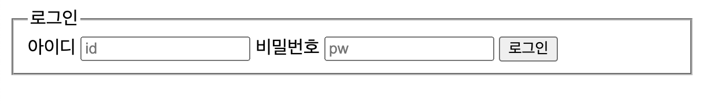
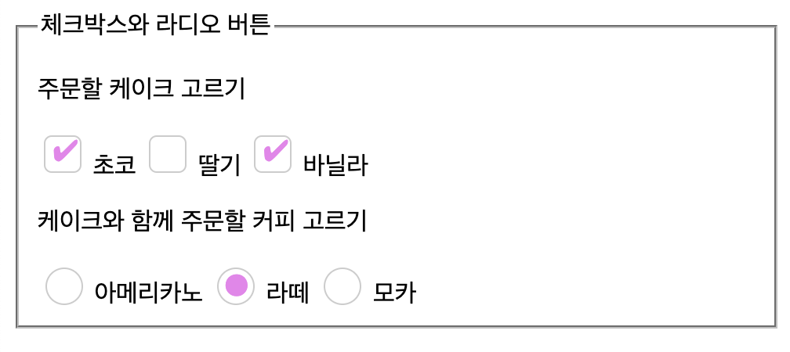

# 1. 시작

HTML 폼은 사용자가 웹사이트와 상호작용할 수 있는 많은 기능을 제공한다. 회원가입이나 로그인 등에 필요한 get, post 요청도 날릴 수 있다. 하지만 그렇게 주목받지 못하고 있다. 솔직히 나도 몇 번 써본 적이 없다.


따라서 [MDN의 HTML 폼 가이드](https://developer.mozilla.org/ko/docs/Learn/Forms)와 그간 주워들은 몇 가지를 정리하는 시간을 가지고자 한다. 만약 이 글을 읽게 되는 사람이 있다면 기본적인 HTML 지식과 약간의 개발 경험이 있다고 간주한다.

# 2. 간단한 서버 열기

`express-server`라는 폴더를 만들고 내부에서 `npm init`

그리고 express와 body-parser를 설치한다.

```bash
npm install express --save
npm install body-parser
```

폴더 내부의 `index.js` 파일을 다음과 같이 작성한다.

```js
const express = require('express');
const bodyParser = require('body-parser')
const app = express();
const port = 8080;

app.use(bodyParser.urlencoded({ extended: false }))

// parse application/json
app.use(bodyParser.json())

app.get('/', (req, res) => res.send('Hello World!'));

app.post('/', (req, res) => {
  console.log(req.body);
  res.send('Got a POST request');
});

app.listen(port, () => console.log(`Example app listening on port ${port}!`));
```

이제 `node index.js`를 실행하면 `localhost:8080`으로 서버에 접속할 수 있다. 그리고 `localhost:8080`에서는 get, post 요청을 처리할 수 있게 될 것이다.

# 3. HTML 폼 기본

다음과 같이 `localhost:8080`으로 post 요청을 보내는 폼을 만들어보자. 간단한 로그인 폼이다.

```html
<form action="http://localhost:8080/" method="post">
  <label for="userid">아이디</label>
  <input type="text" id="userid" name="userid" placeholder="id" />
  <label for="userpw">비밀번호</label>
  <input type="password" id="userpw" name="userpw" placeholder="pw" />
  <button type="submit">로그인</button>
</form>
```

form의 action 속성은 데이터를 보낼 URL을, method 속성은 어떤 HTTP 메서드를 사용할지를 지정하는 데 쓰인다.

이 폼을 만들고 제출하게 되면 `localhost:8080`에서는 다음과 같은 로그가 출력될 것이다.

```bash
{ userid: '입력한 id', userpw: '입력한 비밀번호' }
```

input에 지정한 name은 서버에서 받을 때 사용할 key가 된 것을 알 수 있다.

# 4. 폼 구조화 태그

사용자 폼을 만들기 위한 태그들은 꽤 많고, form 태그를 써본 적 없는 사람이라도 한번쯤은 써봤을 많은 유명한 태그들이 있다. 

예를 들어서 `<input>`이나 `<button>`과 같은 태그들은 [사실 폼 관련 태그로 분류된다.](https://developer.mozilla.org/ko/docs/Web/HTML/Element#%EC%96%91%EC%8B%9D) 이들은 모두 form 태그 바깥에서도 사용할 수 있기 때문에 다른 곳에서도 쓰이는 경우가 많다. 그 경우 해당 요소들은 폼과 관련이 없으며 JS로 관련 동작을 정의해 주게 된다.

하지만 우린 지금 폼에 대해서 알아보고 있으므로, 이 요소들을 폼과 관련해서 간략히 알아보도록 하자.

## 4.1. form

form 태그는 폼을 정의하는 태그이다. HTML로 폼을 정의할 때는 언제나 이 요소로 시작해야 한다. 단 form을 다른 form 태그로 둘러싸는 것은 제한되어 있으며 그렇게 할 경우 예측할 수 없는 방식으로 작동할 수 있다.

[가질 수 있는 속성](https://developer.mozilla.org/ko/docs/Web/HTML/Element/form#%ED%8A%B9%EC%84%B1)들은 다음과 같다.

- `accept-charset`: 폼을 서버로 제출할 때 사용할 문자 인코딩을 지정한다. 기본값은 `unknown`이다.
- `action`: 폼을 통해서 서버로 정보를 전송할 때 사용할 URL을 지정한다.
- `autocomplete(기본값은 on)`: 브라우저가 form 항목을 사용자의 과거 입력값에 기반하여 채워넣을 수 있는지. 기본값은 on
- `enctype`: 폼을 전송할 때 사용할 콘텐츠 MIME 타입을 지정한다. 기본값은 `application/x-www-form-urlencoded`
- `method`: 폼을 전송할 때 사용할 HTTP 메서드를 지정한다. 기본값은 get
- `name`: 폼의 이름을 지정한다. 반드시 문서 폼 가운데 고유해야 한다.
- `novalidate`: 폼을 서버로 제출할 때 유효성 검사를 하지 않도록 지정한다. 기본값은 false
- `target`: 폼 요청 전송 후 응답을 어떻게 받을지를 지정한다. 기본값은 `_self`

### 4.1.1. enctype

이 속성 중 `enctype`은 폼 데이터를 어떻게 인코딩해서 폼을 제출할지를 결정한다.

[UTF-8 유니코드로 문자를 인코딩하는 encodeURI](https://developer.mozilla.org/en-US/docs/Web/JavaScript/Reference/Global_Objects/encodeURI)를 사용하는 `application/x-www-form-urlencoded`가 기본값이다.

`multipart/form-data`는 FormData API를 사용해서 폼을 제출하며 Ajax로 전송된다. 폼을 이용할 때는 반드시 이 enctype을 사용해야 한다.

`text/plain`은 폼을 제출할 때 폼 데이터를 인코딩하지 않고 일반 텍스트로 전송한다. HTML5에서 디버깅 용도로 추가되었으며 실제로 디버깅 용도로 대부분 사용된다.

## 4.2. fieldset, legend

`<fieldset>`은 같은 목적을 가진 폼 요소들을 묶을 때 사용된다. `<legend>`는 부모 `<fieldset>`의 요소를 설명하는 데에 쓰인다.

대부분의 스크린 리더들 또한 이를 인식하여 fieldset 내용을 읽기 전 legend를 읽어준다.

위의 로그인 폼을 이 요소들을 사용해서 보강해 보자.

```html
<form action="http://localhost:8080/" method="post">
  <fieldset>
    <legend>로그인</legend>
    <label for="userid">아이디</label>
    <input type="text" id="userid" name="userid" placeholder="id" />
    <label for="userpw">비밀번호</label>
    <input type="password" id="userpw" name="userpw" placeholder="pw" />
    <button type="submit">로그인</button>
  </fieldset>
</form>
```

이렇게 하면 fieldset과 legend가 묶인 폼이 만들어진다. 아무 CSS를 넣지 않았지만 누가 보아도 묶인 form이라는 것을 알 수 있다.



이런 분류를 이용해서 `<fieldset>`으로 폼의 섹션을 나누고 `<legend>`로 섹션의 제목을 붙이는 것도 가능하다. 이는 MDN에서도 중요한 예제로 취급하는 유스케이스이다. 물론 남용하면 안 되겠지만.

fieldset 요소에 disabled 속성을 지정할 경우 일반적으로 회색으로 표시되며, 자손 컨트롤을 비활성화한다. 또한 모든 브라우저 이벤트를 받지 않게 된다. 예외적으로 `<legend>`안의 폼은 비활성화되지 않는다.

그리고 fieldset은 블록 레벨 요소이고, legend도 블록 레벨 요소이다.

이때 [엣지, 크롬 브라우저에선 현재 fieldset 내부에서 flex, grid 디스플레이를 사용할 수 없는 버그가 존재한다.](https://github.com/w3c/csswg-drafts/issues/321)

## 4.3. label

label로 폼 내 UI의 설명을 나타낼 수 있다. `for`속성으로 지정한 id의 UI와 묶여진다. 

이렇게 UI를 연관시키면 사용자가 label을 누를 시 해당하는 UI가 활성화되고 click 이벤트도 동작한다. 체크박스나 라디오버튼을 쓸 때 버튼의 영역보다 넓은 영역을 '버튼 선택을 위해 눌러야 하는 영역'으로 사용할 수 있어 특히 유용하다.

물론 label로 해당 UI를 둘러싸는 방식으로 둘을 연관시킬 수도 있다. 다음과 같이 말이다.

```html
<label>
  <input type="checkbox" name="agree" />
  동의합니다.
</label>
```

하지만 이런 방식으로 label과 UI를 연관시킬 경우 몇 가지 종류의 보조 기술이 `label`과 해당 UI의 관계를 이해하지 못할 수 있어 `for` 속성으로 id를 지정하는 게 좋다. 위의 로그인 폼에서도 `for`속성을 사용하였다.

접근성을 고려할 때 label 내부에 button 같은 인터랙티브 요소를 배치하지 않는 게 좋다.

label은 인라인 요소이다.

여러 개의 라벨을 하나의 요소에 연결하는 건 좋지 않으며 그럴 경우 label 내부에 `span` 태그를 넣어서 해결하자. 

또한 특별히 읽어져야 하는 요소가 있다면 `aria-label` 속성을 사용한다. 아래 같은 경우 필수 요소라는 의미를 갖는 `*`에 `aria-label`을 설정하였다.

```html
<label for="username">Name: <span aria-label="required">*</span></label>
<input id="username" type="text" name="username" required />
```

## 4.4. output

사용자의 입력을 받아서 계산 출력을 보여주는 데 사용된다. `for` 속성으로 다른 요소의 id를 지정하여 어떤 요소의 출력인지를 지정할 수 있다.

예를 들어서 사용자가 입력한 ID를 위의 로그인 폼에서 실시간으로 보여주고 싶다면 다음과 같이 한다.

```html
<form 
  action="http://localhost:8080/" 
  method="post" 
  id="loginForm"
  oninput="result.value='사용자가 입력한 ID '+userid.value"
>
  <fieldset form="loginForm">
    <legend>로그인</legend>
    <label for="userid">아이디</label>
    <input type="text" id="userid" name="userid" placeholder="id" />
    <label for="userpw">비밀번호</label>
    <input type="password" id="userpw" name="userpw" placeholder="pw" />
    <output name="result" for="loginForm">사용자가 입력한 ID </output>
  </fieldset>
  <button type="submit" form="loginForm">로그인</button>
</form>
```

사용자의 ID 인풋 값만 보여주면 되니까 input에 for를 지정해도 된다.

```html
<form 
  action="http://localhost:8080/" 
  method="post" 
  id="loginForm"
  oninput="result.value=userid.value"
>
  <fieldset form="loginForm">
    <legend>로그인</legend>
    <label for="userid">아이디</label>
    <input type="text" id="userid" name="userid" placeholder="id" />
    <label for="userpw">비밀번호</label>
    <input type="password" id="userpw" name="userpw" placeholder="pw" />
    <output name="result" for="userid"></output>
  </fieldset>
  <button type="submit" form="loginForm">로그인</button>
</form>
```

https://css-tricks.com/the-output-element/

## 4.5. 폼 구조

앞서 말했듯이 폼 구조는 HTML만으로도 만들 수 있다.

몇 가지 사용례가 있다. `ul`이나 `ol` 태그 내부의 `li` 요소들을 통해서 폼 요소들을 감싸거나, `p`, `div`요소들도 흔한 래퍼로 쓰인다. 리스트는 체크박스나 라디오버튼을 묶을 때 흔히 쓰인다.

그리고 fieldset 내부에 복잡한 양식이 있을 때는 section 요소로 요소들을 분류하고 제목 태그를 다는 것도 흔하다. 폼 안에 여러 기능을 하는 섹션이 있다면 section으로 분류해주자.

# 5. input

사용자의 데이터를 받을 수 있는 요소를 생성한다. `type` 속성으로 어떤 종류의 데이터를 받을지를 지정할 수 있고 이외에도 다양한 특성을 가지고 있다.

[너무 길어져서 글을 분리하였다. HTML input tag](https://witch.work/posts/dev/html-input-tag)

# 6. 기타 폼 요소

[기타 폼 요소 MDN 글](https://developer.mozilla.org/en-US/docs/Learn/Forms/Other_form_controls)

## 6.1. textarea

줄바꿈을 포함하는 여러 줄의 일반 텍스트를 입력할 수 있는 컨트롤을 생성한다. `<input>`태그는 한 줄의 텍스트만 입력 가능했다. 오직 텍스트 콘텐츠만 받기 때문에 어떤 콘텐츠를 넣어도 텍스트로 렌더링된다.

`cols`와 `rows` 속성으로 컨트롤의 크기를 지정할 수 있고 `wrap` 속성으로 줄바꿈 방식을 지정할 수 있다. 

`<textarea>`태그 사이에 텍스트를 넣으면 콘텐츠의 기본값이 된다. `value`요소를 사용하는 `input`보다 기본값 지정이 간단하다.

`minlength`와 `maxlength` 속성으로 입력할 수 있는 문자의 최소, 최대 길이를 지정할 수 있다.

```html
<textarea
  rows="5"
  cols="10"
  minlength="10"
  maxlength="100"
  name="message"
>
  메시지를 입력하세요
</textarea>
```

`resize` CSS로 textarea의 크기 조절 방식을 지정할 수 있다. 기본값은 가로, 세로 모두 크기가 조절되는 `both`이다.

## 6.2. 선택 상자

`<select>`와 `<option>`요소로 선택지들 중 하나를 고르는 상자를 만들 수 있다. 폼 제출시 `<select>`요소의 value는 선택된 `<option>`의 value 값이 된다.

그리고 `<optgroup>`요소로 option들을 그룹화할 수 있다. `<optgroup>`태그가 갖는 label 속성의 값은 해당 태그에 싸인 선택지들의 위에 표기된다.

`<optgroup>`가 disabled 속성을 통해 비활성화되면 거기 속한 옵션들도 모두 비활성화된다.

```html
<form>
  <p>
    <label for="coffeeMenu">주문할 커피를 고르세요</label>
    <select id="coffeeMenu" name="coffee">
      <!-- There is a trick here you think you'll pick
          a banana but you'll eat an orange >:-) -->
      <option value="카라멜마끼아또">카라멜마끼아또</option>
      <option value="카페라떼">카페라떼</option>
      <optgroup label="아메리카노">
        <option>아메리카노</option>
        <option>꿀아메리카노</option>
        <option>헤이즐넛아메리카노</option>
      </optgroup>
    </select>
  </p>
</form>
```

이렇게 선택된 선택지는 `select`에 지정된 name 속성을 키로 하고 선택된 `option`의 value 속성을 값으로 하는 객체로 전송된다. 위의 경우 카페라떼가 선택되었다면, `{ coffee: '카페라떼' }`가 전송된다.

따라서 모든 option은 `value` 속성을 가져야 하는데 이를 생략시 option 태그 내부의 텍스트 콘텐츠를 `value`로 사용한다. option에 `selected` 속성 지정시 해당 option이 선택된 상태로 페이지가 렌더링된다. 

select에 multiple 속성 지정시 다수 항목이 선택 가능하며(이 경우 더이상 선택 상자가 드롭다운으로 나오지 않는다) size 속성을 통해 select 요소가 focus상태가 아닐 경우 한 번에 노출되는 항목 수도 지정 가능하다.

`form` 속성을 통해 select와 연결할 form 요소도 지정 가능하다. form 바깥에 있어도 해당 폼과 연결이 가능해지는 것이다.

### 6.2.1. CSS 스타일링

[select 속성은 CSS 스타일링이 어렵기로 유명하다.](https://developer.mozilla.org/ko/docs/Web/HTML/Element/select#css_%EC%8A%A4%ED%83%80%EC%9D%BC%EB%A7%81)`appearance` 등으로 기본 외형을 제거할 수도 있고 몇몇 속성은 잘 적용되지만 내부 구조도 복잡하고 일관적이지 않은 결과가 나올 수 있다.

따라서 일관된 스타일링이 중요하다면 JS와 WAI-ARIA 등을 이용해 별도의 드롭다운 메뉴를 만드는 것도 고려 가능한 옵션이다.

## 6.3. datalist

이 요소를 이용해서 폼 요소 입력 시 자동완성에 대한 선택지를 제공할 수 있다. 사용자가 직접 값을 입력할 시 이는 무시된다.

`<datalist>`는 다른 제어 요소에서 고를 수 있는 선택지를 나타내는 `<option>` 요소 여러 개를 담고, `<input>` 요소 등의 `list` 속성에 연결하고자 하는 `<datalist>` 태그의 id를 지정하면 연결된다.

`list` 속성으로 이게 연결되면 `input`요소 등에서 입력시 datalist의 option들이 자동 완성으로 나타난다. 보통은 드롭다운 박스로 나타난다.

[MDN에서 제공하는 예제](https://developer.mozilla.org/ko/docs/Web/HTML/Element/datalist#%EC%98%88%EC%A0%9C)

이외에도 `<input type="color">`에 연결할 경우 색상을 선택 가능한 팔레트가 나타나게 하는 등의 동작을 할 수 있다.

### 6.3.1. fallback

대부분의 브라우저에서 `<datalist>`를 지원하지만 IE의 낮은 버전이나, 안드로이드 파이어폭스의 2020년 이전 버전과 같은 낡은 브라우저에서는 지원하지 않는 경우도 있다.

이럴 땐 `<datalist>`가 제대로 작동할 시 내부 요소 중 `<option>`이 아닌 요소들은 모두 무시한다는 점을 이용해서 `<select>` 요소를 이용한 fallback을 만들 수 있다.

```html
<datalist id="coffeeList">
  <label for="suggestion">Pick Menu</label>
  <select id="suggestion" name="altCoffee">
    <option>아메리카노</option>
    <option>카페라떼</option>
    <option>카페모카</option>
  </select>
</datalist>
```

`<datalist>`가 작동할 시 label, select는 무시되고 option들만 표시될 것이고 작동하지 않을 시 선택 상자가 나올 것이다.

## 6.4. meter, progress

`<meter>` 요소는 하나의 값이 최소와 최댓값 사이에서 상대적으로 어느 정도 위치를 점하는지를 나타낸다.

```html
<form>
  <label for="percent">비율</label>
  <meter
  id="percent"
  value="60"
  min="0"
  max="100"
  >
  60%
  </meter>
</form>
```

`<progress>` 요소는 0부터 `max`까지 중 어느 작업의 완료 정도를 나타낸다. 따라서 최솟값은 항상 0이며 `max` 미만의 `value` 속성 값에 따라서 프로그레스 바가 채워진다.

## 6.5. button

`<button>` 요소는 클릭 가능한 버튼을 나타낸다. form 외부에도 얼마든지 배치할 수 있다. 

type은 `submit`, `reset`, `button`이 있다. 지정하지 않은 경우 `submit`이 기본값이며 제출 동작을 안 하게 하고 싶다면 `type="button"`을 지정하자.

또한 submit 속성을 지정한 `input`요소에서 그랬던 것과 같이 formaction, formenctype, formmethod, formnovalidate, formtarget 속성을 사용하여 form의 속성을 오버라이딩할 수 있다.

### 6.5.1. button과 input

한때 `<button>` 태그는 `<input type="button">` 태그에 비해 덜 쓰였다. 이는 IE6, IE7에서의 버그 때문이었다. 

이 버그는 `<button>` 태그의 `name`과 `value`를 지정하고 폼을 제출하면 `value`가 전송되는 대신 버튼의 raw content를 전송하는 버그였다. 따라서 사람들은 이 버그를 방지하기 위해 `<input>`을 사용하였다.

그러나 IE8부터는 이 버그가 고쳐졌기 때문에 `<button>`을 마음놓고 사용하면 된다. `<button>`은 `<input>`에 비해 내부에 HTML 컨텐츠도 넣을 수 있으므로 스타일링도 편하다.

# 7. 폼 밖에서 폼 연관시키기

HTML을 하다 보면 `<button>`과 같은 요소들을 폼과 관련 없는 부분에서도 사용할 때가 많다. 그러면 이들을 폼과 연관시키기 위해서는 어떤 방법이 필요할까?

폼 내부에 버튼을 포함시키면 된다. 하지만 그럴 수 없다면? 그럴 때 `form` 속성이 등장한다.

`form` 속성은 폼과 연관시킬 수 있는 요소들에 사용할 수 있다. 이 속성은 폼의 id를 가리키는데, 이를 통해서 폼과 연관시킬 수 있다. 가령 button 요소를 form 안에 넣지 않고 폼과 연관시켜 보겠다.

```html
<form action="http://localhost:8080/" method="post" id="loginForm">
  <fieldset>
    <legend>로그인</legend>
    <label for="userid">아이디</label>
    <input type="text" id="userid" name="userid" placeholder="id" />
    <label for="userpw">비밀번호</label>
    <input type="password" id="userpw" name="userpw" placeholder="pw" />
  </fieldset>
</form>
<button type="submit" form="loginForm">로그인</button>
```

이는 form 바깥에 있는 fieldset 요소를 폼에 포함해야 할 때도 사용할 수 있다. fieldset 요소에 연결할 form 요소 id를 `form` 속성에 지정하면 된다.

`<label>` 요소도 form 속성을 통해서 외부에 있는 폼과 연관시킬 수 있다. 이렇게 하면 `label`이 폼 요소 내부에 있지 않아도 어디에서나 폼과 연관시킬 수 있다.

# 8. 스타일링 - 체크박스, 라디오버튼

## 8.1. 역사

1995년 HTML2 표준이 form 요소를 도입하였다. 하지만 CSS는 1996년에 나왔고, 나온 이후에도 대부분의 브라우저가 이를 당장 지원하지는 않았다.

그리고 이미 브라우저들에서는 form 요소를 자체적으로 렌더링하고 있었기 때문에 초기에는 form 요소에 CSS를 적용 가능하게 하는 것에 의욕적이지 않았다. 

하지만 시간이 지나면서 form 요소들도 몇몇을 제외하고는 대부분 스타일링 가능하게 되었다.

물론 color picker와 같이 CSS만으로는 스타일링하기 힘든 것들도 아직 있다. CSS로 쉽게 스타일링할 수 있는 것부터 시작해서, form 요소들의 스타일링을 정복해보자.

## 8.2. 사전 작업

CSS 폰트 관련 CSS는 어떤 요소에서든 쉽게 사용할 수 있다. 하지만 몇몇 폼 요소에서 `font-family`와 `font-size`를 부모로부터 상속하지 않는 브라우저들이 있다. 많은 브라우저가 이 요소들에서 시스템의 기본 폰트를 사용하도록 한다.

따라서 다음처럼 폼 요소들의 스타일을 지정해 준다.

```css
button,
input,
select,
textarea {
  font-family: inherit;
  font-size: 100%;
}
```

`<input type="submit">`이 예외적으로 `font-family`를 상속하지 않는 브라우저가 있다. 이런 부분을 대비하기 위해서는 `<button>` 태그를 사용하자.

그리고 각 폼 요소들은 각자의 기본적인 테두리, 패딩, 마진 규칙이 있기 때문에 이를 초기화해주는 것도 좋다. 물론 시스템의 기본 스타일을 사용하는 게 좋은지 아니면 커스텀하는 게 좋은지는 많은 토의가 있기 때문에 어느 정도는 개발자의 결정이다.

```css
input,
textarea,
select,
button {
  padding: 0;
  margin: 0;
  box-sizing: border-box;
}
```

### 8.2.1. appearance

이 CSS는 운영체제에 기반한 UI의 기본 스타일을 적용할지를 결정한다.

```css
appearance: none;
appearance: auto;
```

보통은 `none` 값으로만 지정할 것이다. 이렇게 지정하면 시스템의 스타일링을 무력화하고 내가 원하는 스타일링을 적용할 수 있다. 아예 디자인을 백지로 만드는 거라고 생각하면 된다.

## 8.3. 스타일링 - 분류

다음과 같은 요소들은 쉽게 스타일링할 수 있다.

`<form>`, `<fieldset>`, `<legend>`, `<input>(type="search" 제외)`, `<textarea>`, `<button>`, `<label>`, `<output>`

체크박스와 라디오버튼, `<input type="search">`는 스타일링이 쉽지 않다. 더 많은 복잡한 CSS와 트릭을 써야 한다. 

이외의 요소들, 예를 들어 `<select>`와 같은 요소들은 CSS만으로 스타일링하기 쉽지 않다.

쉽게 할 수 있는 요소들을 제외하고, 어려운 것들만 알아보자.

## 8.4. search box 스타일링

검색 박스를 보자.

```html
<input type="search" />
```

사파리에서는 이러한 검색 박스에 대해 몇 가지 스타일링 제한이 있다. 가령 높이나 글씨 크기를 마음대로 바꿀 수 없다.

이를 해결하기 위해서는 `appearance` 속성을 `none`으로 지정해야 한다.

```css
input[type="search"] {
  appearance: none;
}
```

혹은 border나 background CSS를 지정해주는 것도 이런 스타일링 제한 문제를 해결하는 방법이다.

## 8.5. 체크박스, 라디오버튼 스타일링

체크박스, 라디오버튼의 사이즈는 기본적으로 조절이 안 되도록 되어 있다. 이를 조절하려고 할 시 브라우저에서 해당 요소를 어떻게 렌더링하는지는 브라우저마다 매우 다르다.

조절할 수 있는 건 활성화되었을 때의 색 정도인데, 이는 `accent-color` CSS 속성을 통해서 조절할 수 있다. 하지만 본격적으로 스타일을 바꾸려고 하면 `appearance` 속성을 `none`으로 지정하고 처음부터 스타일링을 해야 한다.

먼저 예시 HTML을 다음과 같이 작성하였다.

```html
<form>
  <fieldset>
    <legend>체크박스와 라디오 버튼</legend>
    <p>
      주문할 케이크 고르기
    </p>
    <input type="checkbox" name="cake" value="choco" id="choco" />
    <label for="choco">초코</label>
    <input type="checkbox" name="cake" value="strawberry" id="strawberry" />
    <label for="strawberry">딸기</label>
    <input type="checkbox" name="cake" value="vanilla" id="vanilla" />
    <label for="vanilla">바닐라</label>

    <p>
      케이크와 함께 주문할 커피 고르기
    </p>

    <input type="radio" name="coffee" value="americano" id="americano" />
    <label for="americano">아메리카노</label>
    <input type="radio" name="coffee" value="latte" id="latte" />
    <label for="latte">라떼</label>
    <input type="radio" name="coffee" value="mocha" id="mocha" />
    <label for="mocha">모카</label>
  </fieldset>
</form>
```

기본적으로 appearance 속성을 none으로 지정.

```css
input[type="checkbox"],
input[type="radio"] {
  appearance: none;
}
```

이러면 체크박스 혹은 라디오버튼이 있어야 할 자리에 아무것도 뜨지 않는다. 이제 한번 스타일링을 해보자.

체크박스의 경우 체크가 된 박스에 체크 표시를, 라디오버튼의 경우 선택된 항목에 원을 그린다. 이를 구현하면 된다.

여러가지 방법이 있겠지만, `::before`를 사용하여 요소를 하나 만들고, 여기의 content에 유니코드를 넣어서 체크 여부에 따라 표시되고 아니고를 결정하도록 하였다.

레이아웃이 다시 계산되는 것을 막기 위해서 `display:none` 대신 `visibility: hidden`을 사용하였다. 다음과 같이 CSS를 작성한다. CSS를 깔끔하게 작성한다는 면에서도, 디자인 면에서도 그렇게 잘 짜인 코드는 아니다. 하지만 요점은 이런 식으로 체크박스와 라디오버튼을 기초부터 스타일링이 가능하다는 것이다.

```css
input[type="checkbox"],
input[type="radio"] {
  appearance: none;
  position: relative;
  width: 1.5rem;
  height: 1.5rem;
  border: 1px solid #ccc;
  cursor: pointer;
  vertical-align: -2px;
  color:violet;
}

input[type="checkbox"]::before,
input[type="radio"]::before {
  position: absolute;
  font-size: 1.2rem;
  right: 1px;
  top: -10px;
  visibility: hidden;
}

input[type="checkbox"]:checked::before,
input[type="radio"]:checked::before {
  visibility: visible;
}

input[type="checkbox"]{
  border-radius: 5px;
}

input[type="radio"]{
  border-radius: 50%;
}

input[type="checkbox"]::before {
  content: "✔";
  top: -2px;
}

input[type="radio"]::before {
  content: "●";
  font-size: 2rem;
}
```

이렇게 스타일링한 결과는 다음과 같다.



# 9. 스타일링 - 선택

이외의 요소들도 있다. 드롭다운을 만드는 `<select>`나 `<input type="color">` 등이 있다. 이들은 스타일링이 쉽지 않다. 브라우저마다 매우 다른 기본 스타일을 가지고 있고 그중 몇몇은 아예 스타일링이 불가능하기 때문이다.

상황에 따라서는 스타일링이 상대적으로 쉬운 다른 컴포넌트들을 이용해서 같은 기능을 구현하는 게 더 나은 선택일 수 있다. 하지만 브라우저별로 생길 약간의 차이를 감수할 수 있다면 크기, 배경 등의 몇 가지 스타일링을 할 수 있다.

## 9.1. select

select의 스타일링에 문제되는 부분은 2가지가 있다. 이를 알아보기 위해서 먼저 커피를 고르는 select 요소를 한번 만들어 보자.

```html
<form>
  <fieldset>
    <legend>Select</legend>
    <label for="coffeeSelection">커피 고르기</label>
    <select id="coffeeSelection">
      <option value="americano">아메리카노</option>
      <option value="latte">라떼</option>
      <option value="mocha">모카</option>
    </select>
</form>
```

### 9.1.1. 화살표 스타일링

첫째는 select가 드롭다운으로 작동함을 나타내는 화살표를 스타일링하는 부분이다. 이 화살표는 브라우저마다 다르며 select 박스의 크기가 변할 때마다 바뀌거나 이상하게 리사이징될 수 있다.

이를 해결하기 위해서는 일단 아이콘을 없애기 위해 `appearance: none`을 지정한다. 그러면 화살표 아이콘과 마진 등이 사라진다.

그다음 직접 아이콘을 만들자. 이를 위해서 `::before`과 `::after`를 사용할 것인데 그러려면 div 등의 태그로 select의 래퍼를 만들어 주어야 한다. 

이는 `::after`와 같은 요소들은 요소의 포매팅 박스에 상대적으로 배치되는데 select는 [replaced element](https://developer.mozilla.org/en-US/docs/Web/CSS/Replaced_element)처럼 작동하여 document style이 아니라 브라우저에 의해서 배치되고 따라서 이러한 포매팅 박스를 가지고 있지 않기 때문이다.

래퍼를 만들어 주고 여기에 `::after`를 적용해서 스타일링하자.

```html
<form>
  <fieldset>
    <legend>Select</legend>
    <label for="coffeeSelection">커피 고르기</label>
    <div class="select-wrapper">
      <select class="select" id="coffeeSelection">
        <option value="americano">아메리카노</option>
        <option value="latte">라떼</option>
        <option value="mocha">모카</option>
      </select>
    </div>
</form>
```

```css
select{
  appearance:none;
  width:100%;
  height:100%;
}

.select-wrapper{
  position:relative;
  width:100px;
  height:30px;
}

.select-wrapper::after{
  content: "▼";
  font-size: 1rem;
  top: 6px;
  right: 10px;
  position: absolute;
}
```

이러면 아래 방향의 삼각형 화살표가 새로 생긴다.


# 참고

HTML 참고서, 양식 부분 https://developer.mozilla.org/ko/docs/Web/HTML/Element#%EC%96%91%EC%8B%9D

HTML 폼 가이드 https://developer.mozilla.org/ko/docs/Learn/Forms

express 공식 문서 https://expressjs.com/ko/starter/hello-world.html

express와 body-parser https://expressjs.com/en/resources/middleware/body-parser.html

https://tech.devsisters.com/posts/functional-react-state-management/

https://dev.to/dailydevtips1/submit-button-outside-the-form-2m6f

output element https://css-tricks.com/the-output-element/