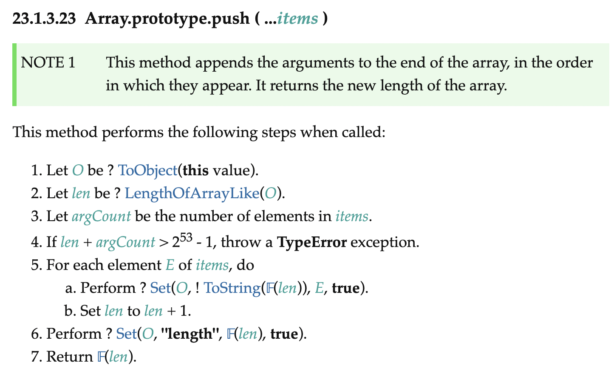
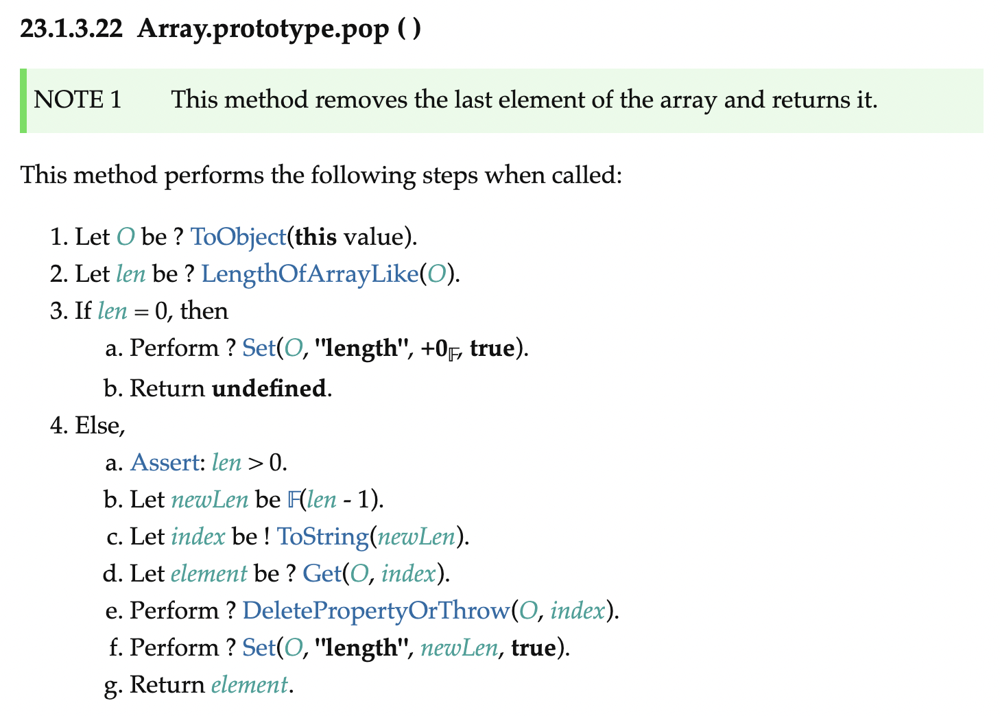
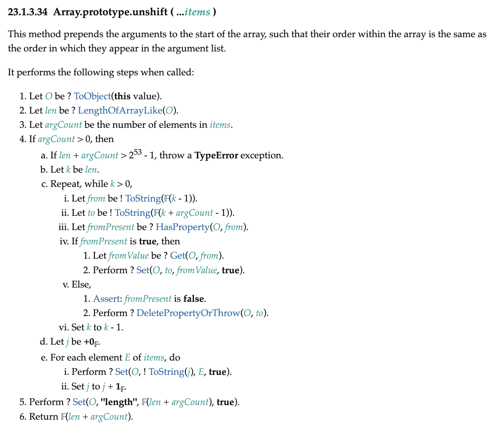
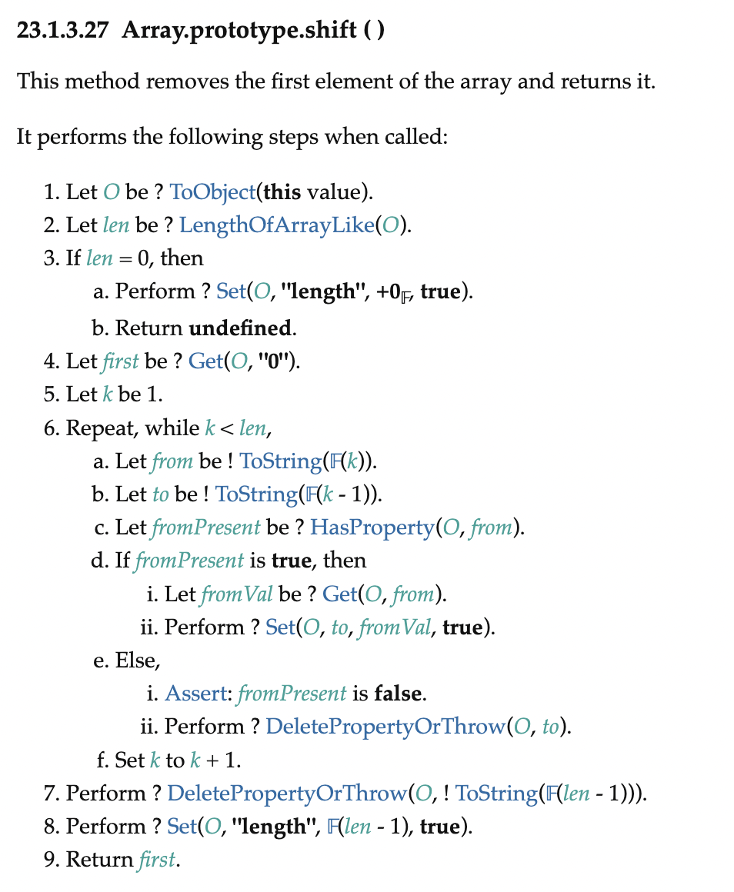
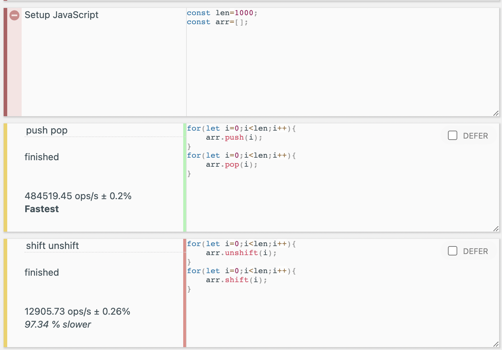
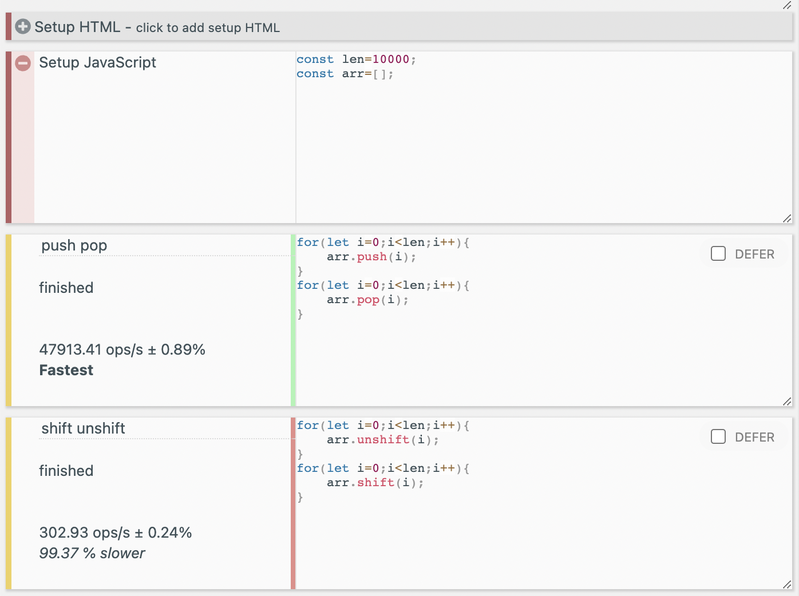
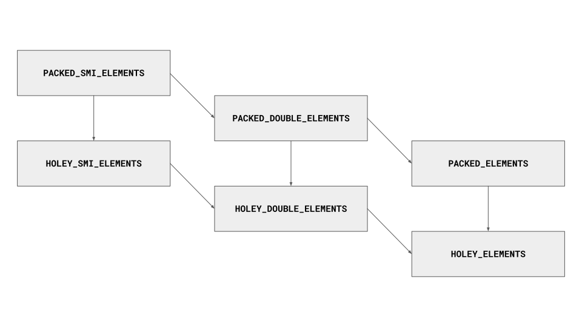
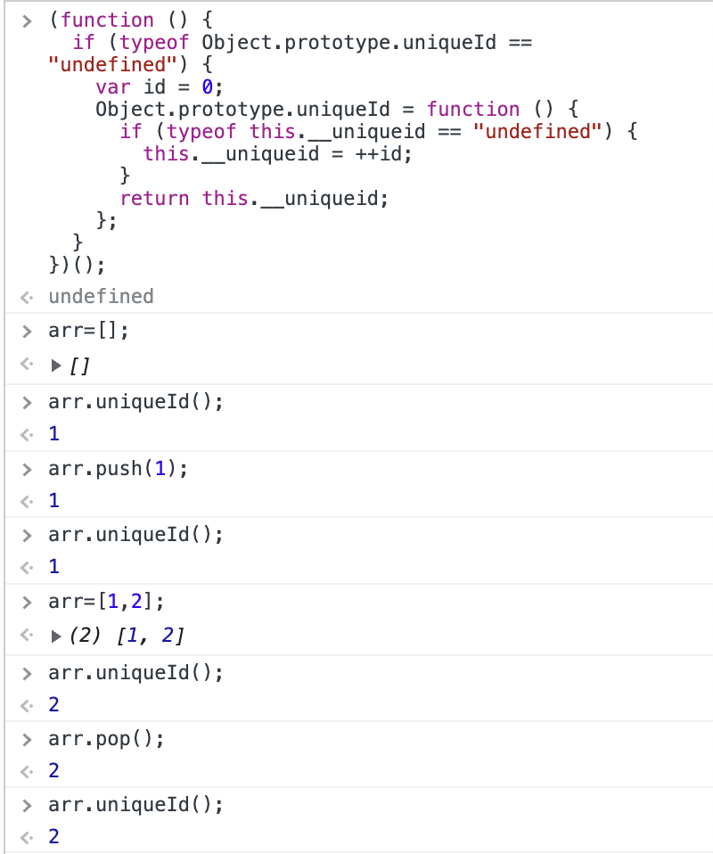
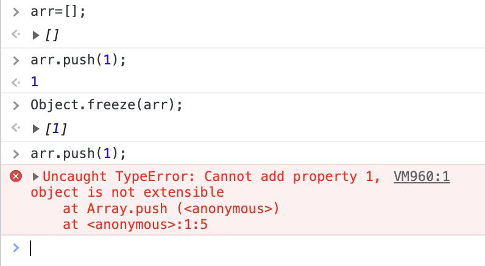

# 1. 시작

JS 배열을 자세히 탐구해 본 글이다. 계기는 다음과 같다.

three.js를 한번 훑어보려고 공식 문서를 보고 있었다. 그런데 다음과 같은 코드를 발견하였다.

```js
const points = [];
points.push(new THREE.Vector3(-10, 0, 0));
points.push(new THREE.Vector3(0, 10, 0));
points.push(new THREE.Vector3(10, 0, 0));
```

뭔가 이상하다. const로 선언된 배열에 push를 하고 있다. C++같으면 당연히 에러가 나야 하는 일이다.

```cpp
#include <iostream>

int main(){
	const int arr[3]={1,2,3};
  // const 배열을 변경하려 하면 에러가 발생한다
	arr[1]=10;
	return 0;
}
```

하지만 생각해 보니 애초에 배열에 push 메서드 같은 게 있는 것도 말이 안된다. 자료구조에서 배운 배열은 이런 게 아니었다. 배열은 고정된 메모리 크기를 갖고 있는 자료구조라고 배웠다는 말이다!

그러고 보니 어디선가 JS 배열은 실제 배열이 아니라는 말을 들은 것 같다. 따라서 배열에 대한 다양한 것을 탐구해 보았다.

# 2. JS 배열의 구조

[Poiemaweb](https://poiemaweb.com/js-array-is-not-arrray)에서는 JS배열의 구조를 탐사하기 위해 다음과 같은 코드를 사용하였다.

```js
console.log(Object.getOwnPropertyDescriptors([1, 2, 3]));
```

크롬 개발자 도구에서 위 코드를 실행시켜 보면 배열이 인덱스를 key로 가지고 length 프로퍼티를 가지고 있다는 것을 알 수 있다.

```js
{
  0: {value: 1, writable: true, enumerable: true, configurable: true},
  1: {value: 2, writable: true, enumerable: true, configurable: true},
  2: {value: 3, writable: true, enumerable: true, configurable: true},
  length: {value: 3, writable: true, enumerable: false, configurable: false}
}
```

그 외에도 잡다한 속성들이 붙어 있는 것도 볼 수 있다. 하지만 기본적으로 JS배열은 인덱스 프로퍼티에 대하여 프로퍼티 값 객체 중 value를 대응시켜 주는 식으로 동작한다고 추측할 수 있다. 사실 유사 배열 객체라는 것도 있고...적어도 JS의 배열이 우리가 배웠던 자료구조상의 배열이 아니라 객체를 이용해서 내부적인 구현이 되어 있지 않을까 하는 생각은 위 출력 결과를 보고 충분히 할 수 있다.

아무튼 이런 식으로 정의되기 때문에 JS배열은 C같은 언어에선 상상도 할 수 없는, 서로 다른 타입으로 구성된 배열도 만들 수 있는 것이다. 그냥 value에 다른 값을 대응시켜 주면 되기 때문이다.

```js
b = [1, "me", 3, null];
```

그러나 만약 JS의 배열이 해시 테이블로 관리되는 객체와 같다면 C 등에서 사용하는 배열보다 느릴 수밖에 없다. [따라서 현대적인 자바스크립트 엔진들은 배열을 일반 객체와 구별하여 보다 배열처럼 동작하도록 최적화하여 구현한다고 한다.](https://poiemaweb.com/js-array-is-not-arrray) 실제 테스트를 해보면 배열이 일반 객체보다 약 2배 정도 빠르다고 한다.

# 3. 배열 편집 메서드 탐구

JS의 배열에는 배열답지 않은 push, pop, shift, unshift와 같은 메서드들이 있다. 이 메서드들은 어떻게 동작할까? 앞서 보았던 배열의 구조를 볼 때 push, pop은 아마 `array[length-1]`에 대한 편집을 하지 않을까 싶다. O(1)에 가능할 것이다.

그러면 shift, unshift는? 맨 앞의 원소(JS배열이 객체라는 걸 생각해 볼 때 이 단어가 적절한지는 모르겠지만 아무튼 맨 첫 인덱스의 원소)를 삽입하거나 삭제하므로 기존 원소들의 인덱스를 모두 바꿔 줘야 할 것으로 보인다. O(n)이 될 것이다.

하지만 아직 내가 모르는 무언가가 숨어 있을지도 모른다. 배열에 어떤 엄청나게 신통한 구현이 되어 있어서 맨 앞에 원소를 삽입하면서도 나머지 인덱스를 바꾸지 않는 방법이 있어서 O(1)에 삽입 가능하다던가.

그래서 [이 글](https://medium.com/@brayce1996/time-complexity-analysis-of-javascript-array-unshift-74930aaa2f6)과 JS의 ECMA-262 명세를 참고해서 push, pop, shift, unshift의 시간복잡도를 분석해 보았다.

## 3.1. push

push는 배열의 맨 뒤에 원소를 추가한다. Array.prototype.push(...items)와 같은 형태로 나타나서 인수로 받은 것들을 모두 배열 끝에 추가한다. 그리고 배열의 새 길이를 반환한다.

이 함수의 명세는 다음과 같이 나타난다.



복잡하게 에러 체킹이나 정의 같은 게 되어 있다. 하지만 결국 배열의 끝에 원소를 추가하고 길이를 1 늘리는 것을 인수로 받은 모든 원소에 대해 반복하는 것이다. 시간복잡도는 잘 구현하면 O(인자 개수)이 될 것이다. 인자가 상수 개수라면 O(1)이다.

## 3.2. pop

pop은 배열의 맨 뒤에 원소를 제거한다. 그리고 제거한 그 원소를 반환한다. 명세는 다음과 같다.



배열이 비어 있을 때 undefined를 반환하는 처리가 있긴 하다. 그래도 기본적으로는 끝 원소만 쏙 빼는 것이다. 배열의 다른 원소들에 대해 어떤 동작을 반복한다든가 하는 건 없다. 따라서 시간복잡도는 O(1)이다.

## 3.3. unshift

unshift는 인자로 받은 원소들을 배열의 맨 앞에 추가한다. 그리고 배열의 새 길이를 반환한다. 명세는 다음과 같다.



여기서 4.c를 보면 배열에 있던 기존 원소들을 argCount만큼 뒤로 이동시킨다. argCount는 unshift가 받은 인자 개수이다. 그리고 인자로 받은 원소들을 배열의 앞(기존 원소들이 이동했으니 이제 비어 있다)에 추가한다.

이 함수의 시간복잡도는 O(기존의 배열 길이 + unshift 인자 개수)이므로 O(n)이라고 할 수 있을 것이다.

## 3.4. shift

shift는 배열의 맨 앞에 있는 원소를 제거한다. 그리고 제거한 그 원소를 반환한다. 명세는 다음과 같다. 복잡하지만 시간복잡도를 따지는 건 어떤 반복적인 부분이 있는지만 보면 된다.



여기서는 6.을 보면 기존 원소들을 한 칸씩 앞으로 당겨주고 있다. 1~len-1 인덱스의 원소들을 0~len-2 인덱스로 한 칸씩 옮겨주는 것이다. 이외에 반복이 적용되는 부분은 없다.

이를 보면 이 함수의 시간복잡도는 O(기존의 배열 길이)이므로 O(n)이라고 할 수 있을 것이다. 반환해야 할 배열 첫 원소는 배열 원소들을 당겨주기 전에 4. 에서 보관해 놓고 9. 에서 리턴한다.

## 3.5. 벤치마크

[JS 벤치마크 사이트](https://jsbench.me/)에서 간단히 벤치마크해 보았다. 일단 가볍게 1000번 정도씩 돌려 보았다. push/pop이 훨씬 빠르다는 것을 알 수 있었다.



그리고 1만번, 10만번의 벤치마크도 돌려 보았는데 push/pop은 반복 횟수에 따라 걸리는 시간이 선형적으로 증가하는 반면 shift/unshift는 반복 횟수 증가에 따른 경과 시간이 훨씬 더 크게 증가하는 것을 볼 수 있었다. shift/unshift는 역시 O(n)이다.

1만번 벤치마크


10만번 벤치마크


# 4. JS 배열, 더 깊이

그런데 배열 메서드의 시간복잡도에 대한 검색을 하다가 [스택오버플로우의 한 질문글](https://stackoverflow.com/questions/11514308/big-o-of-javascript-arrays)에서, 현대 JS엔진들은 배열이 sparse하지 않은 한 배열을 해시테이블(즉 객체)로 관리하지 않는다는 말을 보았다. 우리가 위에서 `getOwnPropertyDescriptors`을 사용해서 본 것과는 좀 다른 이야기다. 배열을 객체로 관리하지 않는다고?

물론 [객체 말고 Map을 사용하라는 말](https://shanepark.tistory.com/220)도 있지만 이는 다른 이야기고..

```
내가 본 댓글 전문
Worth mentioning this answer is no longer correct. Modern engines do not store Arrays (or objects with indexed integer keys) as hashtables (but like well... arrays like in C) unless they're sparse. To get you started here is a 'classical' benchmark illustrating this –
Benjamin Gruenbaum
```

그럼 대체 어떻게 배열을 관리한다는 것인가! 열심히 검색해 보니 [Understanding Array Internals](https://itnext.io/v8-deep-dives-understanding-array-internals-5b17d7a28ecc)라는 보석같은 글이 있었다. V8에서 배열을 어떻게 구현한지를 다룬 글이었다. 이 글을 간단히 이해한 대로 정리해 본다.

## 4.1. 시작

JS 배열 말고, 학교 수업 시간에 배울 법한 배열 자료구조는 연속된 메모리 덩어리와 같다. 배열의 시작 주소부터 배열의 크기만큼의 메모리를 가지는 자료구조이다. 그러나 JS배열은 위에서 대강 살펴보았다시피 그것과는 조금 다르다. push, pop과 같은 메서드부터 이상하다.

물론 C++이나 JAVA의 Vector처럼 원소의 삽입/삭제가 가능한 동적 배열도 있다. 그러나 그것들은 내부적으로 보면 결국 배열의 크기를 정해 놓고 크기 상한에 도달하면 새로운 배열을 동적 할당하는 방식이다. 하지만 JS 배열은 그런 식으로 동작하지 않는다.

따라서 V8에서 제공하는 `%DebugPrint` 함수를 이용하여 내부를 들여다보자. 먼저 node REPL을 켠다. 엔진의 고유 함수를 실행 가능하도록 하기 위해 `--allow-natives-syntax` 옵션을 사용하자.


## 4.2. 빈 배열

`%DebugPrint` 함수를 이용하여 빈 배열의 정보를 출력해 보자.

```bash
const arr=[];
undefined
> %DebugPrint(arr);
DebugPrint: 0x1458667c9379: [JSArray]
 - map: 0x2699696c3c39 <Map(PACKED_SMI_ELEMENTS)> [FastProperties]
 - prototype: 0x266f4d105d79 <JSArray[0]>
 - elements: 0x3f94f0541329 <FixedArray[0]> [PACKED_SMI_ELEMENTS]
 - length: 0
 - properties: 0x3f94f0541329 <FixedArray[0]>
 - All own properties (excluding elements): {
    0x3f94f05455f1: [String] in ReadOnlySpace: #length: 0x2d848adb4c29 <AccessorInfo> (const accessor descriptor), location: descriptor
 }
0x2699696c3c39: [Map]
 - type: JS_ARRAY_TYPE
 - instance size: 32
 - inobject properties: 0
 - elements kind: PACKED_SMI_ELEMENTS
 - unused property fields: 0
 - enum length: invalid
 - back pointer: 0x3f94f05415b9 <undefined>
 - prototype_validity cell: 0x2d848adb5169 <Cell value= 1>
 - instance descriptors #1: 0x266f4d105d49 <DescriptorArray[1]>
 - transitions #2: 0x31d900141ad1 <TransitionArray[8]>Transition array #2:
     0x3f94f0546609 <Symbol: (elements_transition_symbol)>: (transition to HOLEY_SMI_ELEMENTS) -> 0x2699696c3fe1 <Map(HOLEY_SMI_ELEMENTS)>
     0x36411fa7daf1: [String] in OldSpace: #level: (transition to (const data field, attrs: [WEC]) @ Any) -> 0x309ae03d40f1 <Map(PACKED_SMI_ELEMENTS)>

 - prototype: 0x266f4d105d79 <JSArray[0]>
 - constructor: 0x266f4d13eb09 <JSFunction Array (sfi = 0x199b37c84611)>
 - dependent code: 0x3f94f0541251 <Other heap object (WEAK_ARRAY_LIST_TYPE)>
 - construction counter: 0
[]
```

여기서 element 부분을 보자. `elements: 0x3f94f0541329 <FixedArray[0]> [PACKED_SMI_ELEMENTS]` 라고 되어 있다.

이는 우리가 선언한 빈 배열이 데이터를 저장하기 위해서 우리가 아는 것과 같은 고정된 크기의 배열을 사용하고 있다는 것을 의미한다. `FixedArray[0]`이므로 현재 고정 크기 배열의 크기는 0이다.

## 4.3. 배열의 원소 타입 추적

위에서 elements kind로 표시되는 `PACKED_SMI_ELEMENTS`는 배열의 원소가 모두 정수형이라는 것을 의미한다. `PACKED_SMI_ELEMENTS`의 SMI는 small int를 뜻하는데(그렇게 작지는 않지만 어쨌든) -2^31에서 2^31-1 사이의 범위를 갖는 정수형을 의미한다.

V8은 배열 연산의 최적화를 위해서 배열의 원소들의 타입을 추적하고 있는데 이것이 elements kind에 표시되고 있는 것이다. 이런 추적을 통해서 V8은 배열의 원소들을 다룰 때 불필요한 타입 변환이나 체크를 하지 않고 최적화된 코드를 실행할 수 있다.

그리고 배열이 수정될 때 이 elements kind는 그에 따라 변경된다. 이 변경은 더 일반적인 타입으로 변경되는 것이다. 예를 들어, 배열의 원소가 처음에 정수형이었다가 문자열이 되면 elements kind는 `PACKED_SMI_ELEMENTS`에서 `PACKED_ELEMENTS`로 변경된다. 이렇게 한번 배열의 elements kind가 변경되면 다시 원래의 타입으로 변경되지 않는다.



그리고 이 elements kind는 배열의 원소들이 변경될 때마다 변경된다. 예를 들어, 배열의 원소가 처음에 정수형이었다가 문자열이 되면 elements kind는 `PACKED_SMI_ELEMENTS`에서 `PACKED_ELEMENTS`로 변경된다.

이를 실험하기 위해 아까 비어 있던 배열에 `witch`라는 문자열을 삽입한 후 다시 `%DebugPrint()`를 실행해보자.

```bash
> arr.push("witch")
1
> arr
[ 'witch' ]
> %DebugPrint(arr);
...
elements: 0x0ebe131cc2a1 <FixedArray[17]> [PACKED_ELEMENTS]
...
```

elements kind가 `PACKED_ELEMENTS`로 변경되었다.

이때 `arr.pop()`으로 배열의 원소를 제거하여 다시 빈 배열로 바꾼 후 다시 `%DebugPrint()`를 실행해도 elements kind는 `PACKED_ELEMENTS`로 남아있다.

## 4.4. 배열의 공간 할당

앞에서 문자열을 추가한 배열에 `%DebugPrint`함수를 사용한 결과를 다시 보자. elements kind가 `PACKED_ELEMENTS`로 변경되었고, elements는 `0x0ebe131cc2a1 <FixedArray[17]>`로 표시되었다.

여기서 볼 것은 FixedArray size가 17로 바뀌었다는 것이다. 그런데 우리는 원소를 하나밖에 추가하지 않았다.. 그럼 왜 size가 17이 되었을까? 이는 JS배열이 동적으로 동작하므로, 배열의 저장 공간이 부족해졌을 때 얼만큼의 메모리를 추가 할당하는지에 관련되어 있다.

새로운 메모리 capacity 할당은 다음과 같은 식을 따른다.

$new\_capacity = (old\_capacity + old\_capacity / 2) + 16$

old_capacity는 `(기존 배열의 capacity + 삽입된 원소 수)`` 이므로 여기서는 1이다(빈 배열에 원소 1개 삽입). 따라서 new_capacity는 `1 + 1/2 \* 1 + 16 = 17`이 된다. 위에서 나온 FixedArray size와 같다.

그럼 배열에 할당된 메모리가 줄기도 할까? 만약 배열에 pop연산 등이 많이 가해져서 배열에 할당된 메모리의 50% 이상이 사용되지 않게 되면 배열의 메모리를 줄이는 작업이 일어난다.

방금만 해도 원소가 하나뿐인 배열에 pop을 가하니까 `FixedArray[17]`이 `FixedArray[0]`로 줄어들었다.

## 4.5. hole

위에서 `witch`라는 문자열을 배열에 삽입한 후 `%DebugPrint()`를 실행한 결과를 다시 보자.

```bash
> arr
[ 'witch' ]
> %DebugPrint(arr);
DebugPrint: 0x2a0ee8b8711: [JSArray] in OldSpace
 - map: 0x2699696c4d19 <Map(PACKED_ELEMENTS)> [FastProperties]
 - prototype: 0x266f4d105d79 <JSArray[0]>
 - elements: 0x0ebe131cc2a1 <FixedArray[17]> [PACKED_ELEMENTS]
 - length: 1
 - properties: 0x3f94f0541329 <FixedArray[0]>
 - All own properties (excluding elements): {
    0x3f94f05455f1: [String] in ReadOnlySpace: #length: 0x2d848adb4c29 <AccessorInfo> (const accessor descriptor), location: descriptor
 }
 - elements: 0x0ebe131cc2a1 <FixedArray[17]> {
           0: 0x0f0d12e0eea9 <String[5]: #witch>
        1-16: 0x3f94f0541689 <the_hole>
 }
0x2699696c4d19: [Map]
 - type: JS_ARRAY_TYPE
 - instance size: 32
 - inobject properties: 0
 - elements kind: PACKED_ELEMENTS
 - unused property fields: 0
 - enum length: invalid
 - back pointer: 0x2699696c4d61 <Map(HOLEY_DOUBLE_ELEMENTS)>
 - prototype_validity cell: 0x2d848adb5169 <Cell value= 1>
 - instance descriptors #1: 0x02a0ee8b9789 <DescriptorArray[2]>
 - transitions #4: 0x0b116d9199c1 <TransitionArray[12]>Transition array #4:
     0x3f94f0546609 <Symbol: (elements_transition_symbol)>: (transition to HOLEY_ELEMENTS) -> 0x2699696c4df1 <Map(HOLEY_ELEMENTS)>
     0x36411fa7daf1: [String] in OldSpace: #level: (transition to (const data field, attrs: [WEC]) @ Any) -> 0x09ad648c34a1 <Map(PACKED_ELEMENTS)>
     0x3f94f0545d31: [String] in ReadOnlySpace: #raw: (transition to (const data field, attrs: [___]) @ Any) -> 0x309ae03c6e01 <Map(PACKED_ELEMENTS)>
     0x3f94f0546681 <Symbol: (frozen_symbol)>: (transition to frozen) -> 0x2699696c4e39 <Map(PACKED_FROZEN_ELEMENTS)>

 - prototype: 0x266f4d105d79 <JSArray[0]>
 - constructor: 0x266f4d13eb09 <JSFunction Array (sfi = 0x199b37c84611)>
 - dependent code: 0x3f94f0541251 <Other heap object (WEAK_ARRAY_LIST_TYPE)>
 - construction counter: 0

[ 'witch' ]
```

빈 배열일 때와 달리 `elements`항목이 새로 생겼다. 0인덱스에는 당연히 우리가 삽입한 문자열이 들어 있다. 하지만 1-16 인덱스에는 the_hole이 들어 있다고 한다.

이 the_hole은 V8에서 아직 원소가 할당되지 않았거나 삭제된 배열의 원소를 표현하기 위해 사용하는 특수한 값이다. 즉, 배열의 원소가 할당되지 않은 상태를 hole이라고 한다. 우리의 예시에선 배열에 할당은 되었지만 아직 사용되지 않은 인덱스들에 the_hole이 들어가 있다.

## 4.6. packed, holey

위에 보면 `elements kind`가 `PACKED_ELEMENTS`라고 되어 있다. 이 PACKED는 뭘까? 이건 배열에 hole이 있는지 여부를 나타낸다. elements kind에 packed가 붙어 있으면 배열이 hole이 없는 상태라는 것이다.

elements kind에 holey가 붙어 있으면 배열이 hole이 있는 상태라고 할 수 있다.

예를 들어서 [1] 이 있는 배열 `arr`에 `arr[2]=3;`을 실행하면 인덱스 1에는 hole이 들어가 있게 된다. 아직 아무것도 할당되지 않았기 때문이다. 그 상태에서 `arr`에 `%DebugPrint`를 실행하면 elements가 다음과 같이 나온다.

```bash
- elements: 0x3ef33f55da39 <FixedArray[20]> [HOLEY_SMI_ELEMENTS]
```

elements 정보는 이렇다. 중간에 the_hole이 있는 걸 볼 수 있다.

```bash
- elements: 0x3ef33f55da39 <FixedArray[20]> {
          0: 1
          1: 0x3c7a9bac1689 <the_hole>
          2: 3
      3-19: 0x3c7a9bac1689 <the_hole>
}
```

`HOLEY_SMI_ELEMENTS`는 배열에 hole 혹은 smi_element만 있다는 것을 뜻한다. 이 element kind를 가지는 배열은 packed element를 가진 배열보다 좀 느리다. holey 배열을 사용하면 V8에서 배열을 순회하거나 수정할 때 value check을 해야 하기 때문이다.(hole skip을 위해서)

이외에도 `PACKED_ELEMENT`, `PACKED_DOUBLE_ELEMENTS`, `HOLEY_ELEMENTS`, `HOLEY_DOUBLE_ELEMENTS` 등의 element kind가 있다. DOUBLE이 붙은 건 말 그대로 실수 element를 뜻하고 그냥 `PACKED_ELEMENT`는 문자열이나 일반 객체를 뜻한다.

## 4.7. 배열의 다른 구현

그런데 배열은 위에서 잠시 살펴본 것과 같이 해시테이블로 구현될 수도 있다. V8에서도 그렇게 하는 경우가 있다. 예를 들어서 아까의 `arr` 배열에 다음과 같은 연산을 하자.

```js
arr[32 << 20] = 0;
```

그리고 `%DebugPrint`를 실행하면 다음과 같이 나온다.

```bash
%DebugPrint(arr);
DebugPrint: 0x2adbcfd64299: [JSArray]
 - map: 0x08023b1c23c1 <Map(DICTIONARY_ELEMENTS)> [FastProperties]
 - prototype: 0x13b862905d79 <JSArray[0]>
 - elements: 0x2fd0ff649a89 <NumberDictionary[16]> [DICTIONARY_ELEMENTS]
 - length: 33554433
 - properties: 0x3c7a9bac1329 <FixedArray[0]>
 - All own properties (excluding elements): {
    0x3c7a9bac55f1: [String] in ReadOnlySpace: #length: 0x0fa1689b4c29 <AccessorInfo> (const accessor descriptor), location: descriptor
 }
 - elements: 0x2fd0ff649a89 <NumberDictionary[16]> {
   - max_number_key: 33554432
   33554432: 0 (data, dict_index: 0, attrs: [WEC])
   0: 1 (data, dict_index: 0, attrs: [WEC])
   2: 3 (data, dict_index: 0, attrs: [WEC])
 }
0x8023b1c23c1: [Map]
 - type: JS_ARRAY_TYPE
 - instance size: 32
 - inobject properties: 0
 - elements kind: DICTIONARY_ELEMENTS
 - unused property fields: 0
 - enum length: invalid
 - stable_map
 - back pointer: 0x2a4729384df1 <Map(HOLEY_ELEMENTS)>
 - prototype_validity cell: 0x0fa1689b5169 <Cell value= 1>
 - instance descriptors (own) #1: 0x13b862905d49 <DescriptorArray[1]>
 - prototype: 0x13b862905d79 <JSArray[0]>
 - constructor: 0x13b86293eb09 <JSFunction Array (sfi = 0x117f70bc4611)>
 - dependent code: 0x3c7a9bac1251 <Other heap object (WEAK_ARRAY_LIST_TYPE)>
 - construction counter: 0

[ 1, <1 empty item>, 3, <33554429 empty items>, 0 ]
```

우리의 배열은 이제 `NumberDictionary`로 구현되어 있다! 이 `NumberDictionary`가 바로 해시테이블로 구현되어 있다.

또한 element kind도 `DICTIONARY_ELEMENTS`로 바뀌었다. V8은 많은 hole을 갖는 sparse array를 다룰 때 메모리를 줄이기 위해 이 element kind를 사용한다. 해시테이블을 이용해서 hole이 아닌 원소들만을 저장하는 것이다.

이 `DICTIONARY_ELEMENTS`의 구조는 위 배열의 elements들을 보면 대강 알 수 있다.

```bash
elements: 0x2fd0ff649a89 <NumberDictionary[16]> {
  - max_number_key: 33554432
  33554432: 0 (data, dict_index: 0, attrs: [WEC])
  0: 1 (data, dict_index: 0, attrs: [WEC])
  2: 3 (data, dict_index: 0, attrs: [WEC])
}
```

이 구조, 어쩐지 낯이 익다..앞에서 `getOwnPropertyDescriptors`함수를 이용해 배열의 프로퍼티들을 출력해보았을 때 나왔던 구조와 비슷하지 않은가?

`data`가 `value`이고 `dict_index`가 `key` 즉 index이고 `attrs:[WEC]`의 WEC가 각각 writable, enumerable, configurable이라고 추론할 수 있다.

```js
{
  0: {value: 1, writable: true, enumerable: true, configurable: true},
  1: {value: 2, writable: true, enumerable: true, configurable: true},
  2: {value: 3, writable: true, enumerable: true, configurable: true},
  length: {value: 3, writable: true, enumerable: false, configurable: false}
}
```

하지만 이렇게 딕셔너리를 사용해 배열을 저장하면 메모리를 절약하는 대신 해시테이블을 사용하기 때문에 배열의 원소에 접근하는 속도가 느려진다. 시간복잡도로 따지면 똑같이 O(1)이지만 해시 함수도 계산해야 하고, entry lookup도 해야 하고 중간중간 rehashing도 수행해 줘야 하기 때문이다. 이런 용어들은 자료구조 내용을 참고하자.

이렇게 딕셔너리를 사용하는 건 배열이 특정 threshold 길이를 넘어갔을 때이고 그 threadhold는 약 32MB이다. 이 threshold를 넘어가면 배열의 element kind가 `DICTIONARY_ELEMENTS`로 바뀌고, 그 이후로는 배열의 원소를 추가하거나 삭제할 때마다 딕셔너리를 사용하게 된다. [V8에서 threshold를 설정하는 코드는 다음과 같다.](https://github.com/nodejs/node/blob/49342fe6f2ca6cedd5219d835a0a810e6f03cdd7/deps/v8/src/objects/js-array.h#L120)

```cpp
// This constant is somewhat arbitrary. Any large enough value would work.
static const uint32_t kMaxFastArrayLength = 32 * 1024 * 1024;
```

# 5. JS 상수 배열

앞서 배열이 어떻게 구현되는지를 알아보았다. 그런데 우리가 앞서 무엇을 보았는가? const로 선언된 배열에 push하는 것을 보았다. 어떻게 이런 것이 가능할까? 그것은 JS에서 배열에 const 선언을 하는 것은 배열 변수가 다른 객체를 참조하지 못하도록 하는 것이기 때문이다. 하지만 push는 참조를 바꾸지 않는다.

## 5.1. 참조 확인

js에는 파이썬의 `id()`처럼 객체의 고유 id를 확인할 수 있는 함수가 없다. 따라서 [다음 스택오버플로우 글](https://stackoverflow.com/questions/1997661/unique-object-identifier-in-javascript)에 있는 함수를 써서 객체 각각에 고유 아이디를 부여했다. Object 프로토타입에 uniqueId 메서드를 부여하여 새로운 객체가 생길 때마다 고유 아이디를 부여하는 것이다.

```js
(function () {
  if (typeof Object.prototype.uniqueId == "undefined") {
    var id = 0;
    Object.prototype.uniqueId = function () {
      if (typeof this.__uniqueid == "undefined") {
        this.__uniqueid = ++id;
      }
      return this.__uniqueid;
    };
  }
})();
```

다음과 같이 간단하게 개발자 도구에서 실험했다. push/pop은 참조를 바꾸지 않는다는 것을 확인할 수 있다. uniqueId가 바뀌지 않았기 때문이다. 하지만 아예 새로운 배열을 할당하면 uniqueId가 바뀜을 통해 새로운 객체가 생성되는 것을 확인할 수 있다.



const는 즉 배열 변수가 다른 객체를 참조하지 못하도록 하는 것이다. 배열 변수가 같은 객체를 가리키고 있다면 push나 pop등을 통해 그 객체가 바뀌는 것은 상관없다.

## 5.2. 내용도 안 바뀌는 객체 만들기

그러면 어떻게 객체의 내용까지 변경 불가능하게 만들까? 그냥 `Object.freeze()`라는 함수를 사용하면 된다. 이 함수는 객체를 동결해서 더 이상 변경될 수 없게 한다. 새로운 속성 추가, 속성 제거, 속성 값 변경 등을 불가능하게 하는 것이다. 또한 프로토타입 변경도 방지한다.

```js
Object.freeze(arr);
```

이 함수를 쓰고 나서 배열의 내용을 바꾸려고 하면 에러가 발생한다.



# 참고

[JS배열은 배열이 아니다](https://poiemaweb.com/js-array-is-not-arrray)

[상수 배열 선언 실패](https://morohaji.tistory.com/55)

[상수 배열 선언하기](https://stackoverflow.com/questions/62771790/how-to-create-a-constant-array-that-is-not-modified-by-its-reference-in-javascri)

[V8의 배열 내부 구현](https://itnext.io/v8-deep-dives-understanding-array-internals-5b17d7a28ecc)

[DebugPrint 해석에 참고](https://saki-chan.dev/Elements_Kinds/)

[shift, unshift의 복잡도 분석](https://medium.com/@brayce1996/time-complexity-analysis-of-javascript-array-unshift-74930aaa2f6)

[ECMA-262 push](https://tc39.es/ecma262/#sec-array.prototype.push)

[ECMA-262 pop](https://tc39.es/ecma262/#sec-array.prototype.pop)

[ECMA-262 unshift](https://tc39.es/ecma262/#sec-array.prototype.unshift)

[ECMA-262 shift](https://tc39.es/ecma262/#sec-array.prototype.shift)

[v8의 unshift](https://github.com/v8/v8/blob/5d67f90e0f9b76f4e98488126d7658e9228c332f/src/builtins/builtins-array.cc#L603)

[js 객체에 유일한 id 부여하기](https://stackoverflow.com/questions/1997661/unique-object-identifier-in-javascript)

[MDN freeze](https://developer.mozilla.org/ko/docs/Web/JavaScript/Reference/Global_Objects/Object/freeze)
