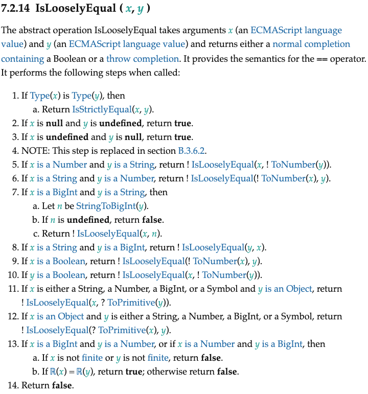

JS의 비교 연산자에 관해 알아보고 있었다. `==`는 비교하려는 값의 자료형이 다르면 이 값들을 숫자형으로 바꾼다는 건 잘 알려진 사실이다. 따라서 `'2'==2`의 결과는 true 가 된다. 뭐 `===`에 비해 잘 쓰이는 연산자도 아니고, 어쨌건 `2`나 `"2"`나 형태는 비슷해 보이니까 크게 납득이 가지 않는 동작도 아니기 때문에 그냥 넘어갈 수 있다.

하지만 이뿐만이 아니다. `null==undefined`의 결과는 true이다. 이건 뭔가 이상하다. 또한 `document.all==undefined`도 true이다. 왜지? 한번에 이해가 가지 않는다. 따라서 명세를 보며 대체 이 동등 비교라는 게 어떻게 일어나는 것인지 알아보기로 했다.

일단 비교 연산자 `==`는 일부 경우에는 `===`과 동등하게 작동하기도 한다. 따라서 `===`의 경우를 먼저 살펴보자.

# 1. `===`의 경우

`===`의 경우는 두 값의 타입과 값이 모두 같아야 true를 반환한다고 알려져 있다. 예를 들어 `1===1`은 true이고 `1==='1'`은 false이다. 그럼 더 자세한 동작은?

`===`의 동작은 명세서에 IsStrictlyEqual(x,y)라는 이름으로 정의되어 있다. 두 피연산자가 엄격히 같은지를 판단하는 이항 연산인 것이다. 그 동작은 다음과 같다.

1. 두 값의 타입이 다르면 false를 반환한다.
2. x가 숫자이면 Number::equals(x,y)를 호출하여 그 결과를 리턴한다.
3. x가 숫자가 아니면 SameValueNonNumber(x,y)를 호출하여 그 결과를 리턴한다.

그럼 여기 나오는 Number::equals와 SameValueNonNumber는 무엇일까?

## 1.1. Number::equals

Number::equals(x,y)는 명세서에 다음과 같이 정의되어 있다.

1. 만약 x나 y가 NaN이면 false를 반환한다.
2. x와 y가 같은 숫자이면 true를 반환한다.
3. x가 -0이고 y가 +0이면 true를 반환한다.
4. x가 +0이고 y가 -0이면 true를 반환한다.
5. 그 외의 경우 false를 반환한다. 

## 1.2. SameValueNonNumber

SameValueNonNumber(x,y)는 숫자값이 아닌 값 x,y를 받아서 불린값을 반환한다. 명세서에 구체적인 동작은 다음과 같이 정의되어 있다.

이때 x의 타입이 y의 타입과 같아야 제대로 동작이 시작된다. 따라서 x가 null이면 y도 null, x가 undefined이면 y도 undefined이게 된다. 즉 3번은 `null===null`, `undefined===undefined`인 경우를 담당한다.

1. x,y의 타입이 같은지 assert로 검사. `===`를 통해서 왔을 경우 타입이 같으므로 상관없다.
2. x가 BigInt이면 BigInt::equal(x,y)를 호출하여 그 결과를 리턴한다. BigInt::equal은 단순히 BigInt값을 비교하는 역할이다.
3. x가 undefined이거나 null이면 true를 반환한다.  
4. x가 문자열이라면 문자열 비교를 해서 같으면 true, 다르면 false를 반환한다. 여기서 문자열이 같다는 건 길이가 같고 같은 문자들과 순서로 구성되어 있다는 뜻이다.
5. x가 불린값이라면 불린값 비교를 해서 같으면 true, 다르면 false를 반환한다.
6. x가 심볼이라면 심볼 비교를 해서 같으면 true, 다르면 false를 반환한다.
7. x,y가 같은 객체에 대한 참조를 가진다면 true, 아니면 false를 반환한다.

즉 정리하면 x,y가 같은 타입이어야 진행되는 연산이며 x가 BigInt이면 BigInt::equal을 호출하고, 객체를 제외한 원시형이면 값을 비교한다. 그리고 객체라면 참조를 비교한다.

## 1.3. 정리

즉 지금까지 살펴본 `===`의 작동을 정리하면 다음과 같다.


# 2. `==`의 경우

처음 이걸 시작한 건 `null==undefined`는 왜 true냐는 질문이었다. 하지만 찾아보아도 명세서에 그렇게 정의되어 있다는 것 이상 더 설명이 없었다. 따라서 명세를 찾아보았다.

이는 명세서에 `IsLooselyEqual(x,y)`로 정의되어 있었다. x,y를 받아서 불린값이나 throw completion을 반환한다. 이런 걸 normal completion이라 하는데 추후 다룰 일이 있을지도..[궁금한 사람은 미디엄 등에 몇몇 글이 있다.](https://medium.com/geekculture/understanding-javascript-what-is-the-completion-record-2334a58c35c)

명세는 다음과 같이 나와있다.



## 2.1. 타입이 같을 경우

이 경우에는 위에서 알아본 `===`의 경우와 같다. x,y의 타입이 같을 경우 `IsLooselyEqual(x,y)`는 `IsStrictlyEqual(x,y)`를 호출한다.

## 2.2. null, undefined

x가 null, y가 undefined라면 true를 반환한다. 반대의 경우도 마찬가지이다. 아무 이유도 안 달려 있고 그냥 그렇다.

## 2.3. isHTMLDDA

만약 x가 객체이고 x가 `[[isHTMLDDA]]` 내부 슬롯을 가지고 있고 y가 null혹은 undefined라면 true를 반환한다. 반대의 경우도 마찬가지이다.

참고로 이 `[[isHTMLDDA]]` 내부 슬롯은 host-defined 즉 non-native 객체에만 존재한다. 이걸 가진 객체는 ToBoolean, IsLooselyEqual 등에서 undefined와 같이 취급된다고 한다. document.all이 이에 해당한다.

그래서 실제로 `document.all == undefined`는 true를 반환한다.

## 2.4. 문자열과 숫자

x가 문자열이고 y가 숫자, 혹은 x가 숫자이고 y가 문자열인 경우이다. 이럴 경우 잘 알려져 있다시피 문자열을 숫자로 변환한 후 비교한다.

더 구체적으로는 예를 들어 x가 숫자이고 y가 문자열인 경우 `IsLooselyEqual(x,ToNumber(y))`를 호출한다. 반대의 경우도 마찬가지이다.

## 2.5. BigInt와 문자열

x가 문자열이고 y가 BigInt인 경우 x에 `StringToBigInt(x)`를 씌운 후 y와 비교한다. 이때 `StringToBigInt(x)`가 undefined일 경우 false를 반환한다. 그 외의 경우 `IsLooselyEqual(StringToBigInt(x),y)`를 호출한다.

x가 BigInt이고 y가 문자열인 반대의 경우도 마찬가지이다.

## 2.6. 둘 중 하나가 Boolean

둘 중 하나가 불린 값이면 해당 값에 `ToNumber()`를 취한 후 나머지 하나와 비교한다. 예를 들어 x가 불린값이면 `IsLooselyEqual(ToNumber(x),y)`를 호출한다.

이것이 `1==true`가 true인 이유이다.

## 2.7. 둘 중 하나가 객체

비교하는 대상 중 하나가 객체이고 나머지 하나가 문자열, 숫자, BigInt, 심볼 중 하나라고 하자. 그러면 객체를 `ToPrimitive`를 통해 원시값으로 변환한 후 비교한다. 이때 `ToPrimitive`의 hint는 `default`이다. 즉 `ToPrimitive`의 결과는 문자열, 숫자, 심볼 중 하나이다.

이 `ToPrimitive`의 동작에 대해서는 [MDN의 잘 알려진 심볼 Symbol.toPrimitive에 대한 문서](https://developer.mozilla.org/ko/docs/Web/JavaScript/Reference/Global_Objects/Symbol/toPrimitive)를 보자.

이를 이용하면, 무언가 실용적인 도움은 크게 되지 않지만 다음과 같은 이상한 결과를 만들어낼 수도 있다.

```js
const temp={
  [Symbol.toPrimitive](hint){
    return "witch"
  }
}

console.log(temp=="witch"); // true
```

## 2.8. BigInt와 숫자

비교하는 대상 중 하나가 숫자이고 하나가 BigInt인 경우이다. 만약 둘 중 하나가 무한(Infinity)값이라면 false를 반환한다. 무한이란 정의상 그 어떤 수를 가져와도 그보다 커야 하므로 당연하다.

그 외의 경우 수학적인 값 비교를 통해서 비교한다.

**위의 경우를 제외하면 `isLooselyEqual`은 false를 반환한다**

# 참고

[ECMA262의 비교 연산자 스펙](https://262.ecma-international.org/5.1/#sec-11.8.5)

https://tc39.es/ecma262/#sec-abstract-operations

https://tc39.es/ecma262/#sec-samevaluenonnumber

https://developer.mozilla.org/ko/docs/Glossary/Falsy

https://tc39.es/ecma262/#sec-IsHTMLDDA-internal-slot