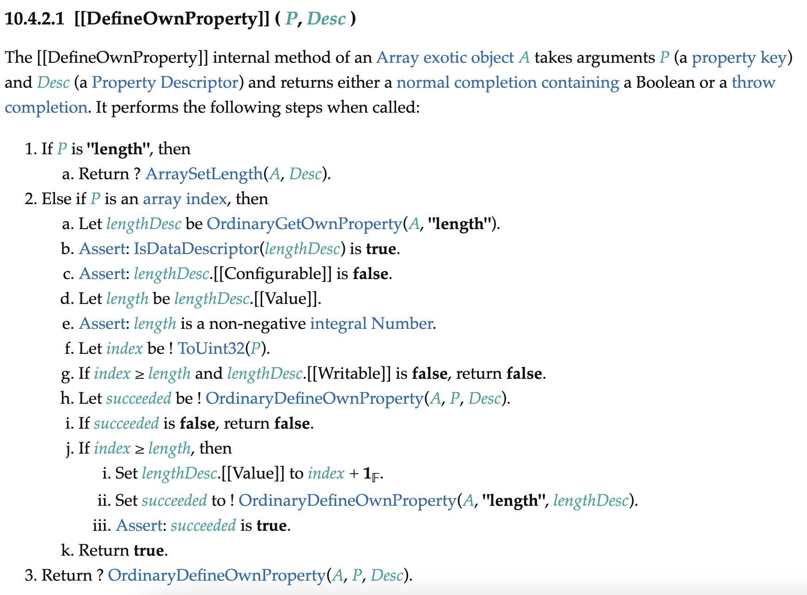
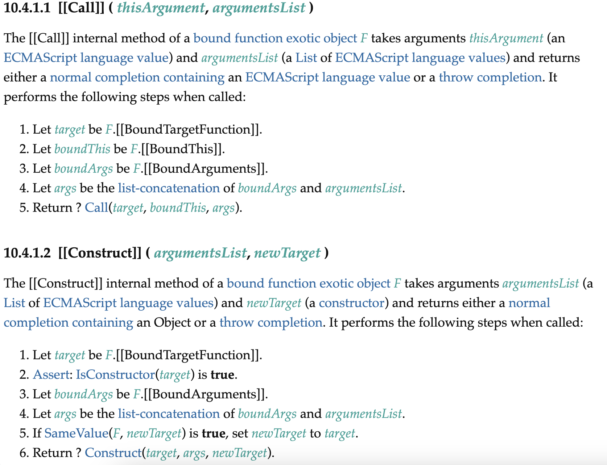

# 1. 시작

`Object.create`는 인수로 받은 객체를 프로토타입으로 하는 객체를 생성하여 리턴한다.

그리고 Array 객체는 `Array.prototype`이 프로토타입인 객체이다. 그러면 다음 출력 결과는 어떻게 될까?

```js
console.log(Array.isArray(Object.create(Array.prototype)));
```

`Array.prototype`을 상속한 객체가 Array인지 판별하는 것이므로 true가 아닐까? 하지만 답은 false이다. [생성자 함수를 이용해서 제대로 상속을 해도 마찬가지다.](https://forum.kirupa.com/t/js-tip-of-the-day-exotic-objects/643152)

이유는 exotic object 때문이다. 뭔가 객체의 고유한 내부 동작이 있어서 프로토타입을 이용해서 쉽게 상속할 수 없는 것이다. 바로 위의 `Array`가 대표적인 exotic object이다.

# 2. JS 객체의 분류

JS에서 객체는 ordinary object와 exotic object로 나뉜다. ordinary object 즉 일반 객체란 우리가 보는 흔한 객체, 그러니까 다음과 같은 것들이다.

```js
{
  a: 1,
  b: 2,
  c: 3
}
```

exotic object, 특수 객체는 이런 일반 객체의 동작과는 다른 동작을 가지고 있는 객체이다. `Array`도 `length`속성이 일반 객체와 다르게 동작하기 때문에 특수 객체이다.

위의 `Array`도 exotic object이고 `Proxy`, `String`, `Arguments` 객체 등이 exotic object이다.

그래서 대체 앞서 말했던 exotic object가 무엇인가? 명세에 의하면 이는 ordinary object가 아닌 객체이므로 ordinary object부터 알아야 한다.

# 3. ordinary object

[명세의 ordinary object에 대한 정의를 정리하면 다음과 같다.](https://tc39.es/ecma262/#ordinary-object)

모든 객체에는 필수적으로 구현되어야 하는 essential internal method가 있다. 그리고 어떤 객체든지 이 essential internal method들에 대해서는 구현하고 있어야 한다. 이때 모든 객체가 이런 essential internal method들을 같은 알고리즘으로 구현하고 있을 필요는 없다.

- `[[GetPrototypeOf]]`
- `[[SetPrototypeOf]]`
- `[[IsExtensible]]`
- `[[PreventExtensions]]`
- `[[GetOwnProperty]]`
- `[[DefineOwnProperty]]`
- `[[HasProperty]]`
- `[[Get]]`
- `[[Set]]`
- `[[Delete]]`
- `[[OwnPropertyKeys]]`

그리고 함수 객체들은 다음과 같은 essential internal method들을 구현해야 한다.

- `[[Call]]`
- `[[Construct]]`

ordinary object란 이런 essential internal method들을 특정 기준에 따라 구현한 객체를 말한다. [이 기준들은 모두 명세에 나와 있다.](https://tc39.es/ecma262/#sec-ordinary-object-internal-methods-and-internal-slots) 우리가 일반적으로 생각하는 `{apple:"사과", banana:"바나나"}`와 같은 객체가 바로 이 기준을 만족하는 ordinary object이다(이것뿐인 건 물론 아니지만).

그리고 이런 기준을 만족하는 객체의 essential internal method는 보통 해당 메서드 이름 앞에 `Ordinary`를 붙인 식으로 정의된다. 예를 들어 [ordinary object의 `[[GetPrototypeOf]]`는 `OrdinaryGetPrototypeOf`로 정의된다.](https://tc39.es/ecma262/#sec-ordinarygetprototypeof)

# 4. exotic object

exotic object란 바로 위에서 설명한 ordinary object가 아닌 객체이다. 그런데 위에서 말하기를 essential internal method들은 모든 객체에서 구현되어 있어야 한다고 했다. 

그 말인즉, exotic object에도 해당 메서드들은 구현되어 있지만 ordinary object에서 쓰이는 것과 다른 방식으로 구현되어 있다는 뜻이다. 전체 exotic object 중 간단한 것 몇 가지를 예시로 살펴보자.

참고로 명세에서 정의하는 exotic object 전체는 다음과 같다.

- Bound Function Exotic Objects
- Array Exotic Objects
- String Exotic Objects
- Arguments Exotic Objects
- Integer-Indexed Exotic Objects
- Module Namespace Exotic Objects
- Immutable Prototype Exotic Objects
- Proxy Exotic Objects

## 4.1. Array exotic object

[Array Exotic Object](https://tc39.es/ecma262/#array-exotic-object)의 경우 array index를 프로퍼티 키로 가지는 프로퍼티들을 특별하게 취급하며 `length`라는 특별한 속성을 갖는 특수 객체이다. 

이 말은 array exotic object의 다른 essential internal method는 모두 ordinary object과 같고 `[[DefineOwnProperty]]`내부 메서드의 구현이 다르다는 뜻이다.

다음은 array exotic object의 `[[DefineOwnProperty]]` 내부 메서드의 명세인데 이를 보면 ordinary object의 해당 메서드와는 다른 동작을 한다는 것을 알 수 있다.



만약 `length`프로퍼티를 설정하면 `ArraySetLength`라는 메서드를 호출하여 `length`프로퍼티를 설정한다.

간단히 설명하면 만약 설정한 length값이 현재의 length보다 크면 설정한 length까지 배열을 늘리고 남는 칸들은 빈칸으로 채운다. 만약 설정한 length값이 현재의 length보다 작으면 설정한 length까지 배열을 줄이고 남는 칸들은 삭제한다. 

단 이때 삭제할 값들은 configurable이 true인 프로퍼티들만 삭제한다. 이 메서드의 구체적인 동작이 이 글에서 중요한 건 아니므로 자세한 사항은 [명세를 참고하자.](https://tc39.es/ecma262/#sec-arraysetlength)

그리고 유효한 배열 인덱스(int 범위의 양의 정수)를 프로퍼티 키로 가지는 프로퍼티들도 특별하게 취급한다. 이 프로퍼티들은 `length`프로퍼티와 연결되어 있다. 만약 설정하는 배열 인덱스가 `length` 프로퍼티보다 크면 `length`를 해당 인덱스보다 1 큰 값으로 설정하는 식이다.

명세에 대해서 위에 설명한 부분을 제외하면 모두 ordinary object와 동일하다. 

이렇게 `[[DefineOwnProperty]]` 메서드에서 Array exotic object는 ordinary object와 다른 동작을 한다.

## 4.2. Bound function exotic object

[간단한 설명이므로 아주 자세한 동작은 명세를 참고하자.](https://tc39.es/ecma262/#sec-bound-function-exotic-objects)

처음에 Bound function이라는 용어를 보고 유계(bounded function)의 의미인 줄 알았는데 bind의 과거형으로 쓰인 bound의 의미였다. 아무튼 이 객체는 `Function.prototype.bind`에서 리턴된 객체이다.

`Function.prototype.bind`의 용도를 생각해 볼 때 이 객체는 당연히 함수의 조건인 `[[Call]]`과 `[[Construct]]` 메서드를 구현해야 한다.

이때 이 bound function exotic object가 ordinary object와 다른 점은 함수를 호출할 때 bind에서 주어진 함수, 그리고 this와 인수들을 미리 설정해놓고 호출한다는 것이다.

생성자 함수의 경우 new와 함께 생성자로써 호출한 함수를 저장하는 `new.target`을 조작하는 부분도 있다.



참고로 해당 값들은 `Function.prototype.bind`호출 시 bound function exotic object의 내부 슬롯인 `[[BoundTargetFunction]]`, `[[BoundThis]]`, `[[BoundArguments]]`에 저장된다. 함수를 호출하기 전에 먼저 해당 내부 슬롯들을 이용하여 어떤 함수를 호출할지, this는 무엇인지, 인수는 무엇인지를 결정한다.

## 4.3. Immutable prototype exotic object

이 exotic object는 내부 슬롯인 `[[Prototype]]`이 한번 초기화되면 해당 슬롯을 변경할 수 없는 객체이다. 

이 말은 `[[SetPrototypeOf]]` 메서드를 호출해도 `[[Prototype]]`이 변경되지 않는다는 뜻이다. 만약 해당 메서드가 받은 인수가 현재 프로토타입과 같으면 첫번째 인수 객체를 반환하고 그렇지 않으면 에러를 발생시킨다. 절대 프로토타입은 변하지 않는다.

단 이 객체를 직접 만들 수는 없다. 이는 `Object.prototype` 그리고 호스트 환경 내부에서만 쓰이는 객체이기 때문이다. 당연히 만약 `Object.prototype`의 프로토타입을 변경하려고 하면 에러가 발생한다. 해당 객체는 Immutable prototype exotic object니까.

# 5. 동작 예시

위에서 보았듯이 Immutable prototype exotic object는 프로토타입을 변경할 수 없다. 단 `Object.setPrototypeOf`에 현재 프로토타입과 같은 값을 넣으면 에러가 발생하지 않고 프로토타입을 바꾸려고 한 객체가 반환된다.

```js
// Object.prototype 출력됨
Object.setPrototypeOf(Object.prototype, null);
// Object prototype may only be an Object or null 에러
Object.setPrototypeOf(Object.prototype, {x:1});
```

프로토타입으로는 Array exotic object를 제대로 상속할 수 없다. exotic object의 내부 메서드 구현이 상속되지 못하기 때문이다. 다음 코드를 보면 프로토타입 상속시 Array exotic object 특유의 length 동작방식도 상속되지 않으며 `Array.isArray`도 통과하지 못하는 걸 볼 수 있다.

```js
function ProtoArray(){
  // super()의 동작에 가깝게 흉내내기
  Array.prototype.push.apply(this, arguments);
}

ProtoArray.prototype = Object.create(Array.prototype);
ProtoArray.prototype.constructor = ProtoArray;

const arr = new ProtoArray(1,2,3);
console.log(arr.length); // 3
arr.push(4);
console.log(arr.length); // 4
arr[10]=5;
console.log(arr.length); // 4
console.log(Array.isArray(arr)); // false
```

반면 클래스의 `extends`를 이용하면 이런 exotic object 동작까지 제대로 상속 가능하다. 다음과 같이 하면 length도 제대로 배열처럼 동작하고 `Array.isArray`도 통과한다.

```js
class ClassArray extends Array{}

const arr = new ClassArray(1,2,3);
console.log(arr.length); // 3
arr.push(4);
console.log(arr.length); // 4
arr[10]=5;
console.log(arr.length); // 11
console.log(Array.isArray(arr)); // true
```

이때 `Array`의 exotic object의 내부 구현 즉 length의 동작과 같은 것을 제대로 상속하기 위해서는 서브클래스의 constructor에서 `super()`를 반드시 호출해야 한다. 

이는 `Array`의 exotic object의 내부 구현을 서브클래스의 인스턴스에 연결하기 위함이다. 다만 대부분의 `Array.prototype` 메서드들은 제네릭하게 구현되어 있어서 `this`값이 Array exotic object인지는 관련 없이 동작한다.

> Subclass constructors that intend to inherit the exotic Array behaviour must include a super call to the Array constructor to initialize subclass instances that are Array exotic objects. However, most of the Array.prototype methods are generic methods that are not dependent upon their this value being an Array exotic object.
>
> ECMA 262 명세, https://tc39.es/ecma262/2021/#sec-array-constructor

그리고 이런 특별한 내부 구현은 사용자가 쉽게 조작할 수 없다. Array와 같은 몇몇 클래스에 대해서만 `extends`를 이용한 상속이 허용되어 있을 뿐이다.

# 참고

https://blog.bitsrc.io/exotic-objects-understanding-why-javascript-behaves-so-moody-5f55e867354f

https://ui.toast.com/posts/ko_20221116_1

https://forum.kirupa.com/t/js-tip-of-the-day-exotic-objects/643152

ECMA262 명세 https://tc39.es/ecma262/