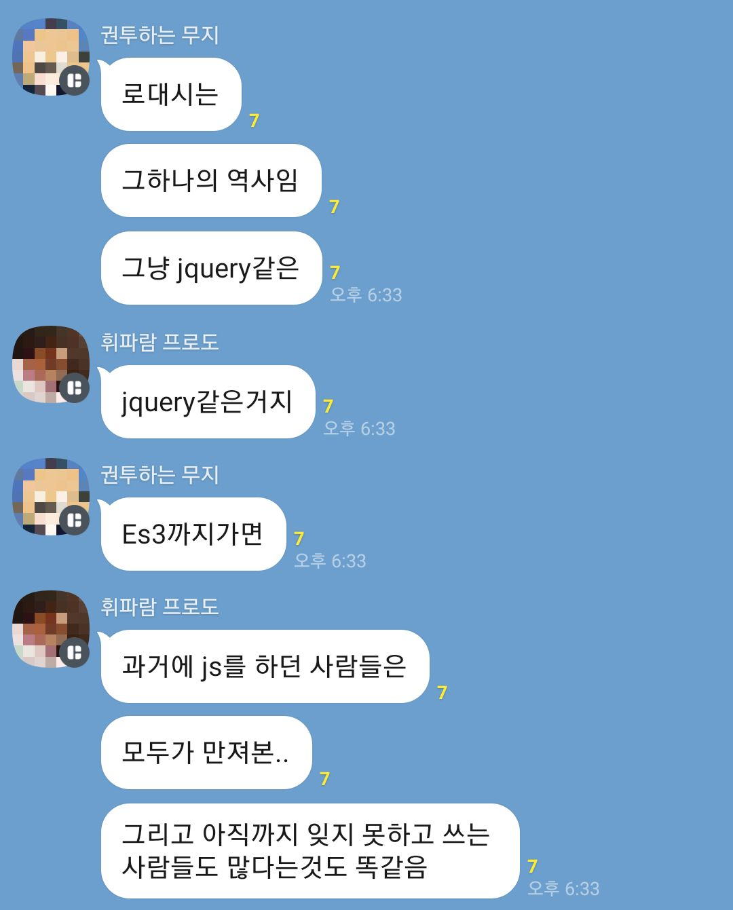
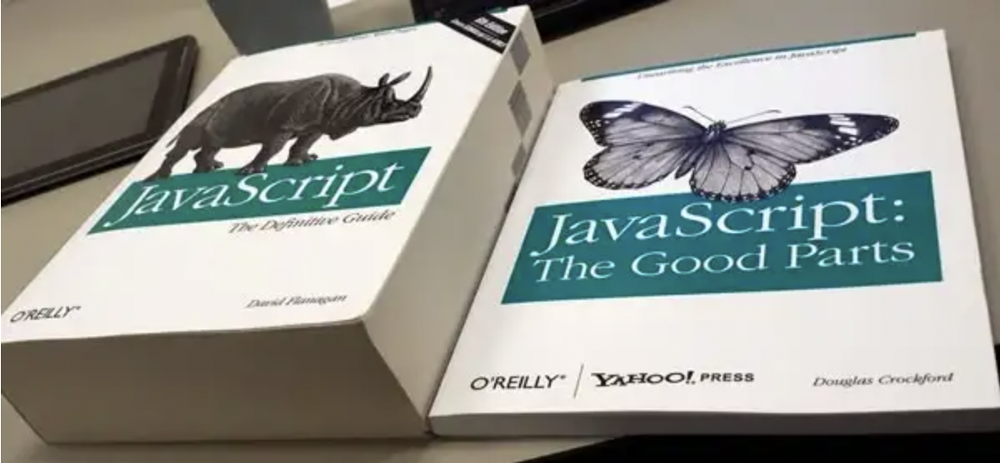

# 1. lodash

lodash는 2023년 1월 첫째 주, 현재 약 [2천만개](https://github.com/lodash/lodash/network/dependents)정도의 github레포지토리에서 쓰이고 있고 주당 [2500만회](https://www.npmjs.com/package/lodash) 정도의 다운로드가 일어나고 있는 굉장히 유명한 라이브러리이다.

그래서 lodash의 튜토리얼을 살펴보았다. map, filter, flatten, remove, every, find, findIndex, forEach 등등 편리한 함수들이 많았다.

하지만 JS를 시작한 지 얼마 되지 않은 나로서는 의문이 들었다. 이 함수들은 JS에서 이미 제공하는 함수들이 아닌가? 그렇다면 lodash는 왜 필요한가? 

물론 lodash에서 지원하는 함수들은 JS에서 지원하는 그것보다 더 나은 퍼포먼스를 보인다. 또 좀더 안전하고 광범위한 사용을 보장한다. 하지만 그것이 lodash가 이 정도로 유명해지게 된 이유는 아닌 것 같았다.

# 2. lodash의 역사



lodash는 underscore.js로부터 시작된다. underscore.js는 2009년 JS에 함수형 프로그래밍 유틸리티를 제공하기 위해 만들어졌다. 

그리고 2012년 John-David Dalton이라는 사람이 underscore.js를 포크하여 lodash를 만들었다. 더 많은 함수들을 제공했으며 더 빠르고 안전했다. 그리고 v3.0.0부터는 underscore.js와 근본적인 차이들이 생겼다. 물론 둘의 합병 시도가 없었던 건 아니나 메인테이너들의 반대로 실패했다고 한다.

## 2.1 당시 상황



[이미지 출처](https://pitzcarraldo.medium.com/javascript%EB%8A%94-%EC%9E%98%EB%AA%BB%EC%9D%B4-%EC%97%86%EB%8B%A4-%EC%A0%95%EB%A7%90%EB%A1%9C-fb9b8e033b10)

지금에 비하면 JS는 암흑이나 다름없었다. 이땐 JS 클래스 문법도 없었고, fetch도 없었다. ES6의 수많은 편의기능도 없었고 브라우저들은 각자의 표준으로 경쟁했기에(특히 IE) 브라우저들의 호환성도 좋지 않았다. 이렇게 부실했던 JS를 그나마 낫게 만들어준 라이브러리들이 있었다. 부트스트랩과 제이쿼리, underscorejs, prototypejs와 같은 것들이다.

ES6같은 건 그저 프론트 개발자들-이때는 프론트 개발자라는 말이 잘 쓰이지도 않았지만-의 바람 중 하나였고 ES5는 널리 쓰이지도 않았다. ES3이 대세이던 시절이다. 참고로 map, filter, forEach와 같은 함수들은 ES5에 도입되었다. findIndex, fill과 같은 함수들은 ES6에 도입되었다.

클래스 문법, 불변성을 지키게 해주는 함수들과 같이 지금은 당연한 JS기능들은 아직 나오기 몇 년 전이거나 나왔다 해도 아직 널리 쓰이지 않고 있었다. 그런 상황에서 lodash는 일관적이고 깔끔한 인터페이스를 제공하며 등장했다. underscore와 같이 `_`를 이용해 쓰일 수 있었으므로 편리하기도 했다. lodash는 이렇게 유명세를 탄 것이다.

# 3. 현재

## 3.1. lodash의 장점

lodash는 지금도 여러 장점들이 있다. 함수에 따라 다르지만 JS의 네이티브 메서드에 비해 더 나은 성능을 가지며 지금도 JS에 없어서 직접 구현해야 하는 여러 함수들을 제공한다. 예를 들어 배열을 특정 사이즈들로 쪼개 주는 chunk 함수가 있다.

```js
_.chunk(['a', 'b', 'c', 'd'], 2);
// => [['a', 'b'], ['c', 'd']]
```

이를 네이티브 코드로 작성하면 다음과 같이 짜야 한다. 이 코드의 출처는 [여기](https://github.com/you-dont-need/You-Dont-Need-Lodash-Underscore#_chunk)

```js
const chunk = (input, size) => {
  return input.reduce((arr, item, idx) => {
    return idx % size === 0
      ? [...arr, [item]]
      : [...arr.slice(0, -1), [...arr.slice(-1)[0], item]];
  }, []);
};

chunk(['a', 'b', 'c', 'd'], 2);
// => [['a', 'b'], ['c', 'd']]
```

또는 깊은 복사를 해주는 `_.cloneDeep` 함수도 있다. spread 연산이나 Object.assign 혹은 JSON.parse(JSON.stringify())(객체 내부에 함수가 있으면 작동 안 함)를 이용해 대체할 수 있긴 하지만 그 대체법들이 다 나사 하나씩 빠져 있다.

좀더 광범위한 함수들을 제공해 준다는 것도 그렇다. JS의 forEach가 주어진 함수를 배열 요소 각각에 대해 실행한 후 리턴값 없이(undefined 반환) 그냥 끝나 버리는 것과 반대로 lodash의 forEach는 객체도 인수로 받을 수 있으며 인수로 받은 객체 혹은 배열에 특정 함수를 모두 적용한 후 그 결과 배열을 리턴한다.

함수형 프로그래밍을 지원하는 lodash-fp나 es6로 작성되어 트리쉐이킹을 잘 해주는 lodash-es등 최근에도 여러 변형 버전들이 나오는 등 지원도 잘 되는 편이다. 2천만개나 되는 곳에서 쓰고 있으니 당연할지도 모르지만.

## 3.2. lodash, 써야 할까?

lodash는 여전히 편리한 기능을 많이 제공한다. 그러나 그 중 또 많은 기능은 이제 JS에서 직접적으로 지원하거나, 없다면 짧게 구현될 수도 있다. 그렇게 lodash 함수들을 대체하는 코드를 모아 놓은 [레포지토리](https://github.com/you-dont-need/You-Dont-Need-Lodash-Underscore)도 있다.

따라서 여러 글들을 찾아본 결과 이제는 선택의 영역으로 넘어왔다는 게 주류 의견으로 보인다. 곧 lodash도 역사의 뒤안길로 사라질지도 모른다는 말도 많다. 제이쿼리나 프로토타입js를 이제 신규 프로젝트에서 쓰지 않듯이.

하지만 분명 JS의 한 시대를 풍미했던 라이브러리이고 그 당시의 가치는 분명히 있었다. 지금 이 순간도 2천만개의 레포지토리에서 쓰인다는 게 그것을 증명해 준다. 그중엔 신규 프로젝트도 많다. 하지만 지금에 와서는 lodash를 쓰는 것이 더 나은지, lodash를 쓰지 않는 것이 더 나은지는 상황에 따라 다른 선택의 문제가 된 듯 하다.

아무튼 프론트를 배우다 보면 가끔 눈에 밟혔던 lodash라는 이름은 JS의 어두운 시대를 밝혀주었던 등불 중 하나였다.

# 참고

lodash map이 Array.prototype.map이 널리 쓰이기 전부터 있었다는 댓글 https://stackoverflow.com/questions/42861080/what-is-the-reason-to-use-lodash-underscore-map-function

[map](https://www.w3schools.com/jsref/jsref_map.asp), [filter](https://www.w3schools.com/jsref/jsref_filter.asp), [forEach](https://www.w3schools.com/jsref/jsref_foreach.asp)

underscore.js 위키백과 문서 https://en.wikipedia.org/wiki/Underscore.js#History

이제 lodash를 보내주자는 글 https://thejs.dev/jmitchell/its-time-to-let-go-of-lodash-nqc

프로토타입js 소개 http://runean.com/introduce-prototype-js/

You Don't Need Lodash Underscore https://github.com/you-dont-need/You-Dont-Need-Lodash-Underscore

JS와 lodash 함수들의 성능 비교 https://ui.toast.com/weekly-pick/ko_20190515

lodash-es https://yrnana.dev/post/2021-11-28-lodash-lodash-es