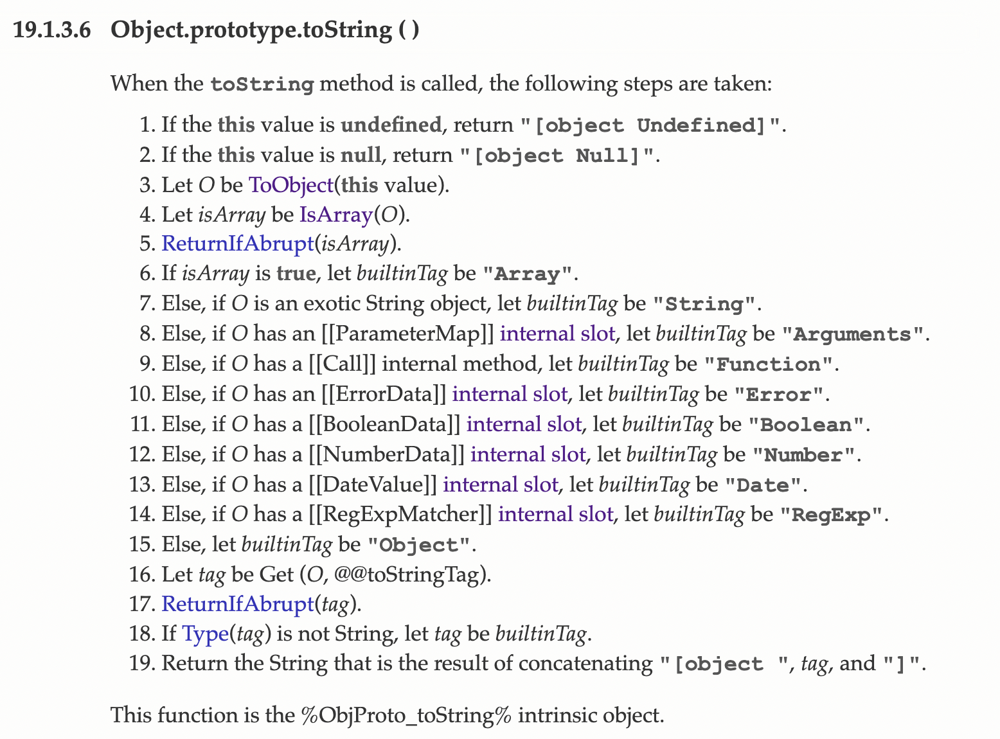
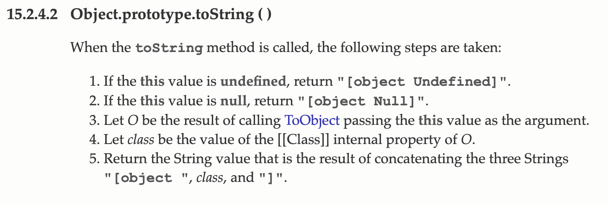

# 1. 시작

JS를 하다 보면 `[object Object]`라는 결과물을 종종 보게 된다. 가령 다음과 같이 객체가 문자열로 변환되는 경우에 보인다.

```js
let obj = { a: 1, b: 2 };
alert(obj);
```

그런데 이렇게 toString을 사용했을 때 나오는 `[object Object]`는 그렇게 좋아 보이지 않는다. 객체가 왜 저런 문자열이 되어야 하는가? 오히려 `JSON.stringify`의 결과물이 훨씬 더 그럴듯하다.

```js
let obj = {
  a: 1,
  b: 2,
};
console.log(JSON.stringify(obj));
// {"a":1,"b":2}
```

그럼 왜 객체의 문자열 변환 결과물은 `[object Object]`가 나오는 걸까? 이는 `Object.prototype.toString`의 작동 방식 때문이다.

# 2. Object.prototype.toString 호출 이유

프로토타입을 따로 지정하지 않은 모든 객체는 Object.prototype을 프로토타입으로 가진다. 즉 위의 obj 객체의 `[[Prototype]]`은 Object.prototype이다. 이때 Object.prototype의 프로토타입은 없다.

이 Object.prototype에는 toString과 같은 다양한 메소드가 구현되어 있다. 그래서 기본적으로 모든 객체는 문자열 변환 시 toString을 사용하게 되고 위의 obj도 마찬가지다. 그리고 그 메서드의 결과물은 `[object Object]`이다.

## 2.1. Object.prototype.toString은?

이 메서드는 인자로 넘겨준 객체의 클래스 이름을 반환하는 메서드이며 `alert`의 인자로 쓰이는 등 문자열 값이 기대되는 곳에 쓰일 때 호출된다.

그리고 JS가 가진 불린, null, undefined, 숫자, 문자열, 심볼, BigInt, 객체의 모든 타입 중 null, undefined를 빼면 모두 Object의 인스턴스이다. 따라서 프로토타입 체이닝을 통해 Object.prototype의 메서드를 쓸 수 있다.

# 3. Object.prototype.toString의 작동방식

이 메서드는 인자로 들어온 값의 클래스 타입을 검사해서 알려준다. 그리고 [ECMAscript 명세서](https://262.ecma-international.org/6.0/#sec-object.prototype.tostring)에서는 toString 동작 방식을 다음과 같이 서술한다.



조금 부족한 부분이 있을 수 있지만 해석해 보면 다음과 같다. 

1. this에 해당하는 값이 undefined이면 "[object Undefined]"을 반환한다.
2. this에 해당하는 값이 null이면 "[object Null]"을 반환한다.
3. this를 ToObject(this)로 변환한다. 이 함수의 동작은 [여기](https://witch.work/posts/dev/javascript-spread-object#4.2.1.-CopyDataProperties)에 정리해 놓았다.
4. Toobject(this)가 배열인지 검사하고 배열이라면 builtinTag를 "Array"로 설정한다. 이때 ReturnIfAbrupt(isArray)를 호출하여 에러 검사를 한다. ReturnIfAbrupt에 대한 자세한 내용은 [여기](https://ui.toast.com/posts/ko_20221116_1)를 참고.
5. 그 외 타입들에 대해서도 타입에 맞게 builtinTag를 설정한다. 예를 들어, 문자열이라면 "String", 함수라면 "Function" 등이다.
6. 만약 객체에 well-known symbol인 Symbol.toStringTag라는 키가 있다면 이 키의 값을 tag로, 없다면 builtinTag를 tag로 설정한다.
7. "[object " + tag + "]"을 반환한다.

또한 내부 슬롯에 따른 객체의 다양한 구분을 볼 수 있는데, 위의 toString 4번 동작에서 생략된 부분을 보면 다음과 같다. 이런 복잡한 방식은 기존의 `[[Class]]` 내부 슬롯을 쓰던 방식과의 하위 호환성을 위한 것이다. 아래 별첨에서 더 자세히 설명한다.

- exotic String 객체면 String
- `[[ParameterMap]]`내부 슬롯이 있으면 함수 인수를 담는 유사 배열 객체 Arguments
- `[[Call]]` 내부 슬롯이 있으면 함수
- `[[ErrorData]]` 내부 슬롯이 있으면 에러
- `[[BooleanData]]` 내부 슬롯이 있으면 불린
- `[[NumberData]]` 내부 슬롯이 있으면 숫자
- `[[DateValue]]` 내부 슬롯이 있으면 Date 객체
- `[[RegExpMatcher]]` 내부 슬롯이 있으면 정규식
- 그게 아니라면 그냥 객체

명세에 보면 이는 this를 조작하고 있으므로 call을 사용해서 위의 명세를 시험해 볼 수 있다.

```js
function test(obj) {
  console.log(Object.prototype.toString.call(obj));
}

test(undefined); // [object Undefined]
test(null); // [object Null]
test([1, 2]); // [object Array]
test("test"); // [object String]
(function () {
  // [object Arguments]
  test(arguments);
})();
test(function () {}); // [object Function]
test(new RangeError()); // [object Error]
test(true); // [object Boolean]
test(1); // [object Number]
test(new Date()); // [object Date]
test(/a-z/); // [object RegExp]
test({}); // [object Object]
```

# 4. Object.prototype.toString 별첨 해석

그리고 위 명세에는 별첨도 붙어 있다. 이를 해석해 보자.

```
Historically, this function was occasionally used to access the String value of the [[Class]] internal slot that was used in previous editions of this specification as a nominal type tag for various built-in objects. The above definition of toString preserves compatibility for legacy code that uses toString as a test for those specific kinds of built-in objects. It does not provide a reliable type testing mechanism for other kinds of built-in or program defined objects. In addition, programs can use @@toStringTag in ways that will invalidate the reliability of such legacy type tests.
```

[ECMA5](https://262.ecma-international.org/5.1/#sec-8.6.2)에는 모든 객체에 `[[Class]]` 내부 프로퍼티가 존재했었다. 그리고 이는 객체의 분류를 나타내는 문자열이었다. 객체가 문자열일 경우 `String`을 저장하는 식이었다. 

이런 문자열이 객체마다 내부적으로 있었기에 [ECMA5의 toString](https://262.ecma-international.org/5.1/#sec-15.2.4.2) 메서드는 이 문자열을 tag로 해서 "[object " + tag + "]"를 반환하는 단순한 방식이었다. 길이부터가 차이난다.



하지만 ECMA6부터는 `[[Class]]` 객체 내부 프로퍼티가 사라졌다. 그런데 특정 빌트인 객체들의 종류를 구분하는 데에 toString을 쓰는 레거시 코드들의 하위 호환성을 보장해 줘야 했으므로 위와 같은 복잡한 builtinTag 결정 방식이 생긴 것이다.

하지만 이 방식은 레거시 코드를 위한 것이므로 다른 빌트인 객체나 사용자 정의 객체에 대한 신뢰성 있는 타입 검사를 제공해 주지 않는다. 또한, `@@toStringTag`를 사용하는 프로그램들은 이러한 레거시 타입 테스트의 신뢰성을 무효화할 수 있다.

# 5. toString 커스터마이징

위의 별첨에서 추측할 수 있다시피 `@@toStringTag`를 사용하면 toString을 커스터마이징할 수 있다.

물론 이런 걸 쓰지 않고 그냥 `toString`을 오버라이딩할 수도 있다.

```js
function Person(name) {
  this.name = name;

  this.toString = function () {
    return this.name;
  };
}

let me = new Person("김성현");
console.log(me.toString());
// 김성현
```

하지만 좀더 잘 해볼 수 없을까? 바로 위에 나와 있는 `@@toStringTag`를 사용하는 것이다. 이는 위의 명세에서 보면 toString이 "[object " + tag + "]"를 반환할 때 tag에 가장 기본적으로 지정하는 값이다. 객체의 가장 기본적인 설명 문자열이라는 것이다.

```js
function Person(name) {
  this.name = name;

  this[Symbol.toStringTag] = name;
}

let me = new Person("김성현");
console.log(me.toString());
// [object 김성현]
```

대괄호와 object 문자열이 붙어서 좀 못생기긴 했지만 오버라이드에 성공했다! 다만 이를 타입 체크에 사용하기 위해서는 `[object tag]`형태에서 tag만 깔끔하게 파싱해야 하므로 추가적인 작업이 필요할 것 같다. 

이는 실용적으로 쓸 수 있을지는 아직 의문이지만, JS의 빌트인 객체들이 이를 사용한다. 

```js
function test(obj) {
  console.log(Object.prototype.toString.call(obj));
}

test(new Map()); // [object Map]
test(function* (a) {
  // [object GeneratorFunction]
  yield a;
});
test(new Set()); // [object Set]
test(new WeakMap()); // [object WeakMap]
test(Promise.resolve()); // [object Promise]
```

또한 이제 브라우저들에서 DOM 프로토타입 객체들에 대해서도 `@@toStringTag`를 지원한다고 한다.

```js
const button = document.createElement("div");
console.log(button.toString()); // [object HTMLDivElement]
console.log(button[Symbol.toStringTag]); // HTMLDivElement
```

typeof 연산자는 [명세](https://262.ecma-international.org/6.0/#sec-typeof-operator)에 따르면 기본적으로 `undefined`, `boolean`, `string`, `number`, `symbol`, `bigint`, `function`, `object`를 반환한다. 하지만 toString은 기본적으로 훨씬 더 많은 종류의 객체를 감지하고, 커스터마이징도 가능하다. 따라서 많은 타입 체크가 필요하다면 toString을 사용하는 것도 생각해 볼 수 있을 것 같다.

# 6. 결론

결국 원래대로 돌아간다면, 일반적인 객체를 문자열로 변환할 때 `[object Object]`같은 못생긴 문자열이 반환되는 이유는 그것이 Object.prototype.toString의 동작이기 때문이다.

# 참고

https://medium.com/%EC%98%A4%EB%8A%98%EC%9D%98-%ED%94%84%EB%A1%9C%EA%B7%B8%EB%9E%98%EB%B0%8D/%EC%9E%90%EB%B0%94%EC%8A%A4%ED%81%AC%EB%A6%BD%ED%8A%B8%EC%97%90%EC%84%9C-object-object-%EA%B0%80-%EB%8C%80%EC%B2%B4-%EB%AD%98%EA%B9%8C-fe55b754e709

http://xahlee.info/js/js_Object.prototype.toString.html

https://stackoverflow.com/questions/35900557/is-there-away-to-change-the-internal-class-property-of-a-javascript-object

https://developer.mozilla.org/en-US/docs/Web/JavaScript/Reference/Global_Objects/Symbol/toStringTag

`Object.create` https://developer.mozilla.org/ko/docs/Web/JavaScript/Reference/Global_Objects/Object/create