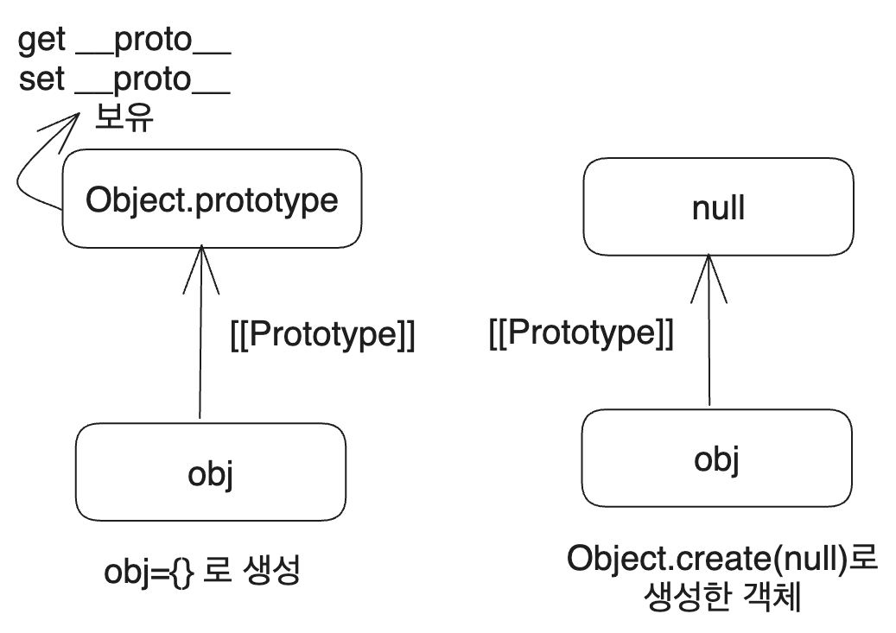
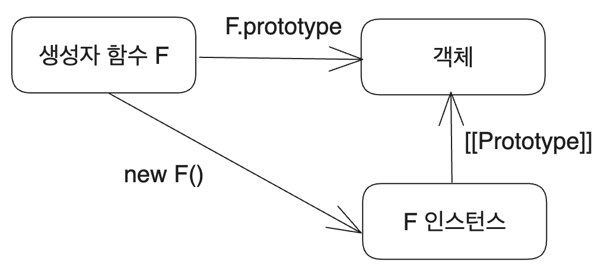
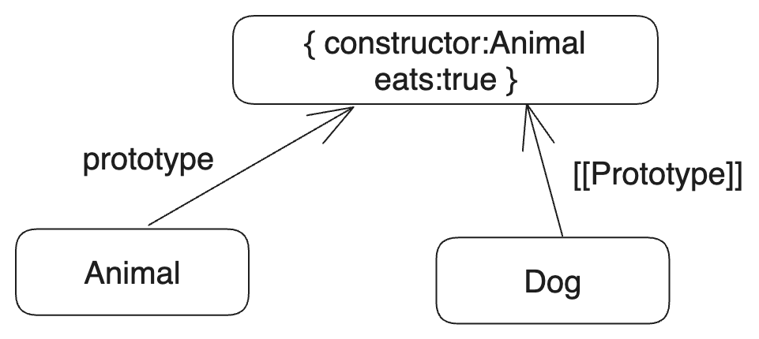

# 1. 시작

JS의 프로토타입은 면접에서도 자주 나오고, JS의 매운맛을 담당하는 존재 중 하나다. 문법부터, 그 철학적인 탐구까지 나름대로 정리해 보았다. 일단 이 글에서는 문법에 관해 정리하였다.

이전에 썼던 프로토타입 관련 글 2개를 합치고 조금 더 자료를 보강한 결과이다.

# 2. JS의 프로토타입은?

JS의 모든 객체는 숨김 프로퍼티 `[[Prototype]]`을 가진다. 이 숨김 프로퍼티는 **유일하며** `null` 혹은 객체 참조를 값으로 가질 수 있는데 이게 다른 객체에 대한 참조일 경우 이를 프로토타입이라 한다.

프로토타입은 JS에서 상속을 구현하는 방식이며 프로토타입 체인이라는 것을 통해 상속을 구현한다. child 객체가 parent 객체를 상속한다면, 프로토타입 체인에 의해서 child 객체도 parent 객체의 프로퍼티나 메서드를 사용할 수 있는 것이다.

예를 들어서 모든 객체(배열, 함수 등의 특수한 객체 제외)는 `Object.prototype`을 프로토타입으로 가진다. 따라서 우리는 모든 객체에서 `Object.prototype`의 메소드를 사용할 수 있다. `toString`과 같은 것들 말이다.

```js
const obj={
  nickname: 'witch',
};

console.log(obj.toString());
```

물론 결과는 `[object Object]`라는 이상한 게 나온다. 이게 왜 나오는지는 예전에 쓴 글인 [[object Object]가 나오는 이유](https://witch-next-blog.vercel.app/posts/dev/javascript-object-object)를 참고하면 된다.

다만 여기서 중요한 건 그 결과가 아니라 `obj` 객체가 `toString`메서드를 직접 갖고 있는 게 아닌데도 사용할 수 있었다는 점이다. 이것이 바로 프로토타입 체인의 힘이다.

`obj`에서 `toString`을 호출하면, `obj`에 해당 메서드가 없으므로 프로토타입 체인을 타고 `Object.prototype`에서 해당 메서드를 찾아서 `obj`에 대해 실행하는 것이다.

다음과 같은 코드를 통해서 obj의 프로토타입이 `Object.prototype`이라는 사실을 확인할 수 있다.

```js
const obj={
  nickname: 'witch',
};

console.log(Object.getPrototypeOf(obj) === Object.prototype); // true
```

# 3. 프로토타입 조작

JS에서 프로토타입을 조작하는 방법은 크게 2가지가 있다. `__proto__`와 `Object.xxxPrototypeOf` 메서드를 통한 방법이다. `__proto__`는 요즘은 권장되지 않기는 하지만 나름 사실상의 표준이니(명세서의 부록에까지 명시되어 있다)천천히 알아보자.

## 3.1. `__proto__`

`__proto__`를 통해서 프로토타입의 값을 설정할 수 있다.

```js
const person={
  eat:function(){
    console.log('person eats');
  }
}

const student={
  study:function(){
    console.log('student studies');
  }
}

student.__proto__=person;
student.study();
// 프로토타입 체인에 의해 eat() 메소드를 호출할 수 있다
student.eat();
```

그리고 `__proto__`는 실제로 존재하는 프로퍼티의 이름이 아니라 `[[Prototype]]`에 접근하기 위한 getter/setter이다. `console.dir(Object.prototype)`으로 확인해보면 `__proto__`의 `get`과 `set`이 정의되어 있는 것을 확인할 수 있다.

## 3.2. `Object` 메서드

`Object.create(proto, [descriptors])`는 proto를 프로토타입으로 하는 객체를 만든다. 두 번째 인수로 프로퍼티 설명자를 선택적으로 전달할 수 있다. 사용 방법은 [모던 자바스크립트 튜토리얼의 해당 문서](https://ko.javascript.info/property-descriptors)참고.

```js
// student는 person을 프로토타입으로 가진다
const student=Object.create(person, {
  name: {
    value: '철수',
    enumerable: true,
    writable: true,
    configurable: true
  },
});
```

이를 이용해서 `for..in`보다 효과적으로 프로퍼티를 복사 가능하다. 이렇게 하면 obj의 모든 프로퍼티, getter, setter 등 모든 프로퍼티, 프로토타입까지 복제된다. 단 얕은 복사임에 주의한다.

```js
let clone = Object.create(
  Object.getPrototypeOf(obj), 
  Object.getOwnPropertyDescriptors(obj)
);
```

`Object.getPropertyOf(obj)`는 `obj`의 프로토타입을 반환한다. `Object.setPropertyOf(obj, proto)`는 `obj`의 프로토타입을 `proto`로 설정한다. 이 두 메서드는 `__proto__`와 같은 역할을 한다.

이렇게 방법이 2가지가 있는 이유는 [역사적인 이유(더 자세한 설명)](https://ko.javascript.info/prototype-methods#ref-795)가 있다. `__proto__`는 프로토타입 조작을 위한 비표준 접근자로 사용되었는데 이후 `Object` 메서드가 등장했지만 이미 너무 많이 사용되고 있어서 사실상의 표준이 된 것이다.

## 3.3. 프로토타입 설정 제약

이렇게 프로토타입을 설정하여 프로토타입 체인을 만드는 데엔 제약이 있다. 먼저 당연히 유일해야 한다는 것이고(다중 상속 불가) 순환 참조를 하면 안된다는 것이다.

그리고 객체나 null 이외의 다른 값을 설정할 수 없다. 그렇게 하려고 하면 무시된다. 예를 들어 다음과 같이 `student`의 프로토타입을 `1`로 설정하려는 시도는 무시된다.

```js
const person={
  eat:function(){
    console.log('person eats');
  }
}

const student={
  study:function(){
    console.log('student studies');
  }
}

student.__proto__=person;
console.log(student.__proto__===person); // true
student.__proto__=1;
console.log(student.__proto__===person); // true
```

## 3.4. 아주 단순한 객체

일반적으로 객체를 만드는 방법을 사용하면(객체 리터럴이나 `new Object()`) `__proto__`라는 문자열은 제대로 키로 사용할 수 없다. 특별한 프로퍼티니까 당연하다.

이 문제는 `Map`을 써서 해결할 수도 있다. 하지만 `__proto__`가 객체 프로퍼티가 아니라 `Object.prototype`의 getter, setter라는 걸 이용해서 해결할 수도 있다. `__proto__`가 없는 객체를 만드는 것이다.

```js
const obj = Object.create(null);
```

이렇게 만든 `obj`는 일반 객체와는 다르다.



즉 위처럼 객체를 만들면 `__proto__`를 키로 사용할 수 있다. 이렇게 프로토타입이 없는 객체를 아주 단순한 객체라고 하며 이런 객체에선 내장 메서드를 사용할 수 없다. 하지만 단순히 key-value 쌍의 연관 배열로 사용할 때는 이런 문제가 상관없다.

## 3.5. Object.create로 상속하기

단일 상속을 다음과 같이 구현할 수 있다.

```js
function Shape() {
  this.x = 0;
  this.y = 0;
}

Shape.prototype.move = function (x, y) {
  this.x += x;
  this.y += y;
  console.log(`Shape moved to (${this.x}, ${this.y}).`);
};

function Rectangle() {
  Shape.call(this);
}

/* Shape.prototype을 프로토타입으로 하는 Rectangle.prototype을 생성
그럼 Rectangle 인스턴스의 프로토타입은 Shape.prototype을 프로토타입으로갖는 어떤 객체이고
Shape.prototype은 constructor로 Shape 자신을 갖는 객체가 된다.
*/
Rectangle.prototype = Object.create(Shape.prototype);
Rectangle.prototype.constructor = Rectangle;

let rect = new Rectangle();
rect.move(1, 1); // Shape moved to (1, 1).

console.log(rect.__proto__.__proto__ === Shape.prototype); // true
```

Shape 생성자 함수의 인스턴스는 `Shape.prototype`을 `[[Prototype]]`으로 갖는다. 그리고 `Rectangle.protype`은 `Shape.prototype`을 프로토타입으로 갖는 어떤 객체이다.

즉 `Rectangle` 생성자 함수로 인스턴스를 만들면 해당 인스턴스는 `Rectangle.prototype`을 `[[Prototype]]`으로 갖는다. 따라서 프로토타입 체인을 통해 `Shape.prototype`의 `move` 메서드를 사용할 수 있다.

구조를 그림으로 그려보면 다음과 같다.


# 4. 프로토타입과 this

this는 해당 메서드가 어디에서 호출되었는지에 상관없이 언제나 `.` 앞에 있는 객체다. 프로토타입 체인의 메서드를 사용하더라도 그 메서드가 조작하는 this는 객체 자신이다.

다음 코드를 보면 `student`에서 호출하는 walk 메서드는 `person`의 메서드지만, this는 `student`를 가리킨다는 것을 알 수 있다.

```js
const person={
  role:"사람",
  walk:function(){
    console.log(`${this.role}이 걸어갑니다.`);
  }
}

const student={
  role:"학생",
}

student.__proto__=person;
student.walk(); // 학생이 걸어갑니다. -> this는 student
person.walk(); // 사람이 걸어갑니다.
```

# 5. 프로토타입과 반복문

`for..in` 반복문은 상속받은 프로퍼티도 순회한다. 단 `obj.hasOwnProperty(key)`를 통해 상속받은 프로퍼티인지 확인할 수 있고 이걸 이용하면 상속 프로퍼티를 순회에서 제외할 수 있다.

`obj.hasOwnProperty(key)`는 key가 obj가 상속받은 게 아니라 obj에 직접 구현된 프로퍼티일 때 true를 반환한다. 그리고 `Object.keys`나 `Object.values`같은 대부분의 유명한 객체 메서드들도 상속 프로퍼티를 제외하고 동작한다.

그런데 for..in으로 객체를 순회하면 Object.prototype의 프로퍼티는 나오지 않는다. JS의 객체는 모두 Object.prototype을 상속받는데 어떻게 된 일일까? 이는 객체의 기본 메서드들의 enumerable설명자가 false이고 `for..in`은 열거 가능한 프로퍼티(enumerable이 true)만 순회하기 때문이다.

# 6. 생성자 함수와 프로토타입

생성자 함수를 통해 `new F()`로 객체를 만들 수 있는데, 그 객체의 `[[Prototype]]`은 생성자 함수의 `prototype` 프로퍼티가 된다. 예전에는 프로토타입에 접근할 수 있는 방법이 없었기 때문에 프로토타입을 사용하기 위해 이 방법을 많이 사용했다. 

당연하지만 함수의 `prototype`프로퍼티는 `[[Prototype]]`과 다르다. 함수 객체의 `[[Prototype]]`은 `Function.prototype`이며 함수의 `prototype`은 생성자 함수로 만들어진 객체의 `[[Prototype]]`이다. 



이런 `prototype` 프로퍼티는 생성자 함수가 new로 호출될 때만 사용된다. 그리고 `F.prototype`이 바뀐 경우에는 그 이후에 생성된 객체에만 적용되고 이미 만들어진 객체에는 적용되지 않는다. 

```js
const person={
  walk: function(){
    console.log(`${this.name}이 걸어갑니다.`);
  }
}

const runPerson = {
  run: function(){
    console.log(`${this.name}이 달립니다.`);
  }
}

function Person(name){
  this.name = name;
}

Person.prototype = person;

const person1 = new Person('사람1');
person1.walk();

Person.prototype = runPerson;
const person2 = new Person('사람2');
person2.run();
// person1의 [[prototype]]은 여전히 person이라서 에러 발생
person1.run();
```

생성자 함수가 호출될 때마다 `prototype`프로퍼티의 객체 참조를 생성된 인스턴스 객체의 `[[Prototype]]`에 넣어주기 때문이다. 따라서 이후 person 객체가 바뀐다면 그것은 `person`을 프로토타입으로 갖는 모든 객체에 즉시 적용된다. 단 `Person.prototype`이 변경된 뒤 생성된 객체는 상관없다.

## 6.1. 디폴트 프로토타입

모든 함수는 디폴트 프로토타입을 가진다. 이 디폴트 프로토타입은 `contructor` 프로퍼티 하나만 가진 객체이며 `constructor`는 함수 자신을 가리킨다.

```js
function Person(name){
  this.name = name;
}
// true
console.log(Person.prototype.constructor === Person);
```

이렇게 `prototype.constructor`를 이용해서 생성자 함수를 얻을 수도 있다. 서드파티 라이브러리의 객체를 사용하는 등 객체가 어떤 생성자로 생성되었는지 모를 때 유용하다.

단 이런 생성자 함수의 기본 프로토타입은 JS에서 보장하고 있는 방식이 아니다. `prototype`을 덮어쓰면 사라지게 된다.

```js
function Person(name){
  this.name = name;
}

console.log(Person.prototype.constructor === Person); // true
/* Person.prototype을 덮어쓰므로 Person.prototype.constructor는 사라진다.
이를 호출하게 되면 Person.prototype인 person에 먼저 접근한 후 person에는 
constructor 프로퍼티가 없으므로 이의 프로토타입인 Object.prototype의
constructor에 접근하게 된다. */
Person.prototype = person;
console.log(Person.prototype.constructor === Person); // false
```

즉 다음 코드의 실행 결과는 `true`가 된다.

```js
console.log(Person.prototype.constructor === Object.prototype.constructor); // true
```

# 7. 내장 객체 프로토타입

내장 생성자 함수에도 프로토타입이 있다. 예를 들어서 `let obj={}`와 같이 객체 리터럴로 객체를 생성하면 `new Object()`와 같이 생성자 함수를 호출하는 것과 같다. 그러면 당연히 `Object.prototype`이 obj의 프로토타입이 된다.

참고로 `Object.prototype`은 프로토타입이 없다. `Object.prototype`의 프로토타입 즉 `Object.prototype.__proto__`은 `null`이다.

또한 배열의 `Array.prototype`이나 함수의 `Function.prototype`과 같이 다른 내장 객체들의 프로토타입도 있는데 이들 모두 `Object.prototype`을 최상위 프로토타입으로 가진다. 이들은 중복 메서드를 가질 수도 있는데 해당 메서드를 호출하는 객체의 프로토타입 체인에서 더 가까운 것이 호출된다.

```js
let a = [1, 2, 3];
// [object Array]
console.log(Object.prototype.toString.call(a));
// 1,2,3
console.log(Array.prototype.toString.call(a));
```

console.dir을 이용해 객체 상속 관계도 확인 가능하다.

다른 내장 객체들도 비슷한데 함수는 내장 객체 `Function`의 생성자를 통해 만들어진다. 따라서 함수들은 따로 프로토타입을 정의해주지 않으면 `Function.prototype`을 프로토타입으로 가진다. 

함수 생성자 `new Function()`로 만들지 않고 함수 선언 등을 사용한 함수들도 내부적으로는 `Function` 생성자를 사용하므로 프로토타입을 따로 선언해 주지 않은 모든 함수의 프로토타입은 같다.

## 7.1. 래퍼 객체 

문자열이나 숫자와 같은 원시값들은 객체가 아니다. 하지만 알다시피 문자열의 `length` 프로퍼티, `indexOf` 메서드와 같이 쓸 수 있는 프로퍼티, 메서드들이 있다. 이는 원시값에 대해 프로퍼티나 함수 접근 감지시마다 래퍼 객체가 생성되기 때문이다.

이 래퍼 객체 메서드들은 `String.prototype`이나 `Number.prototype`에 정의되어 있다. 이 래퍼 객체의 프로토타입들은 `Object.prototype`을 상속받기 때문에 결국 JS의 모든 건 객체나 다름없다.

단 null, undefined는 래퍼 객체가 없다.

권장되는 방식은 아니지만 원시값의 프로토타입도 조작하여 메서드를 추가할 수 있다. 

```js
String.prototype.show = function () {
  alert(this);
};

let myName = "김성현";
myName.show();
```

폴리필을 만들 때 정도에 사용된다. 예를 들어서 배열의 at 메서드 폴리필을 만들고 싶다면 다음과 같이 하면 된다.

```js
function atPolyfill(arr, index) {
  /* at의 에러 처리 생략 */
  return arr[index];
}

Array.prototype.at = Array.prototype.at ?? atPolyfill;
```

반대로, 객체를 만들 때 내장 프로토타입 메서드를 빌려올 수도 있다. 내장 메서드 `join`의 내부 알고리즘은 제대로 된 인덱스가 있는지와 length 프로퍼티가 있는지만 확인하기 때문에 다음 코드는 잘 동작한다.

```js
obj.join=Array.prototype.join;
```

혹은 `obj.__proto__`를 이용해서 `Array.prototype`을 직접 상속받을 수도 있다. 이렇게 하면 `obj`는 배열이 아니지만 배열 메서드를 모두 사용할 수 있다. 하지만 이미 obj가 다른 객체를 상속받고 있을 경우 쓸 수 없다.


# 6. 프로토타입 퀴즈

## 6.1. 2개의 객체 동시 변경

다음과 같은 코드를 짜면 둘 모두 `['Ferrari']`가 출력된다.

```js
const person={
  own:[],

  buyCar:function(car){
    this.own.push(car);
  }
}

let John={
  name:'John',
  __proto__:person
}

let Jill={
  name:'Jill',
  __proto__:person
}

John.buyCar('Ferrari');
console.log(John.own);
console.log(Jill.own);`
```

이는 `John`과 `Jill` 객체가 접근할 수 있는 `own` 배열이 똑같기 때문이다. `John.buycar`를 호출하면 `this`는 `John`이 되고, `this.own`은 `John.own`이 된다. 따라서 `John.own`에 접근해서 페라리를 넣으려고 하는데 그런 프로퍼티가 없으므로 프로토타입 체인을 타고 `person.own`접근해서 페라리를 넣는다.

그런데 `Jill`도 `person.own`에 접근할 수 있으므로 `Jill.own`을 통해 접근한 `own`배열에도 페라리가 들어 있는 것이다.

이를 해결하기 위해서는 각 객체의 `own` 배열을 따로 만들어 주면 된다.

```js
const person={
  own:[],

  buyCar:function(car){
    this.own.push(car);
  }
}

let John={
  name:'John',
  own:[],
  __proto__:person
}

let Jill={
  name:'Jill',
  own:[],
  __proto__:person
}
```

또한 객체의 상태를 설명하는 프로퍼티는 조상 객체가 아니라 객체 자신에 정의되어 있는 것이 자연스럽기도 하다.

## 6.2. 프로토타입과 delete

다음 코드는 true를 출력한다.

```js
function Animal(name) {
  this.name = name;
}
Animal.prototype.eats = true;

let dog = new Animal("Dog");
delete dog.eats;
console.log(dog.eats);
```

`let dog = new Animal("Dog");`까지 실행한 상태의 구조는 다음과 같다.



여기서 delete는 `dog.eat`를 삭제한다. 그러나 프로토타입 체인을 따라가면서 해당 프로퍼티를 찾는 것이 아니라 오로지 자기 자신의 것만 삭제한다. `dog`에는 eats 프로퍼티가 없으므로 아무 일도 일어나지 않는다.

이후 `dog.eats`에 접근하면 프로토타입 체인을 따라가서 delete에 전혀 영향을 받지 않은 `Animal.prototype.eats`를 찾게 되고 이는 true이므로 true가 출력된다.


# 참고

https://ko.javascript.info/prototype-inheritance

https://coding-groot.tistory.com/191

https://iamsjy17.github.io/javascript/2019/06/10/js33_17_prototype.html

https://poiemaweb.com/js-prototype

https://toss.tech/article/smart-polyfills

https://yceffort.kr/2021/02/self-made-javascript-polyfill

https://blog.coderifleman.com/2019/07/19/prototype-pollution-attacks-in-nodejs/

래퍼객체에 관하여 https://developer-talk.tistory.com/69