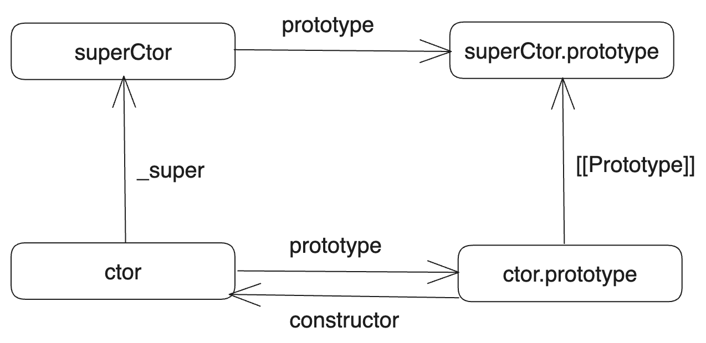
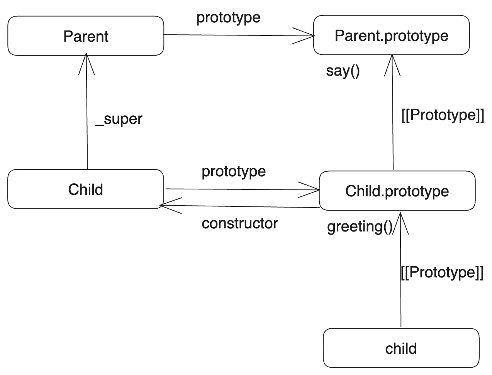
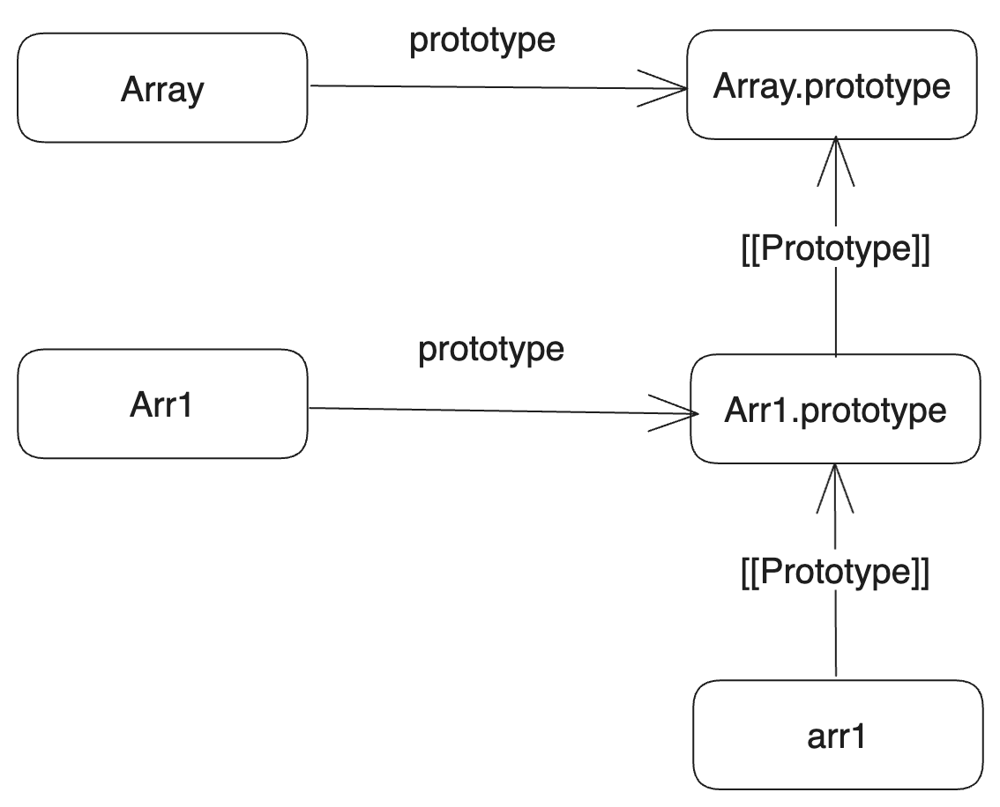
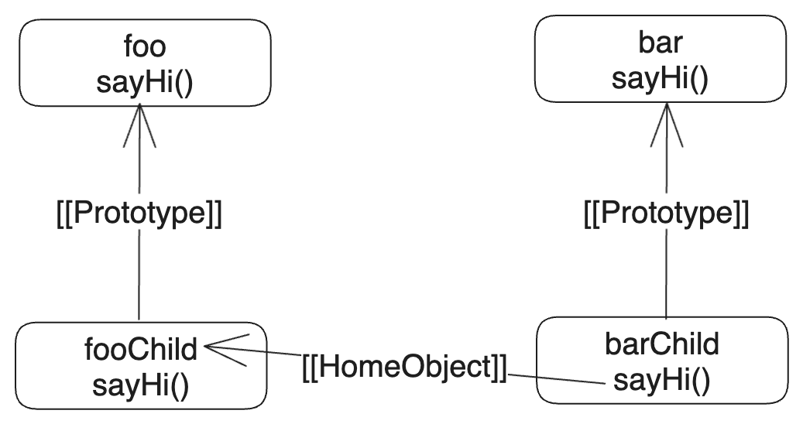
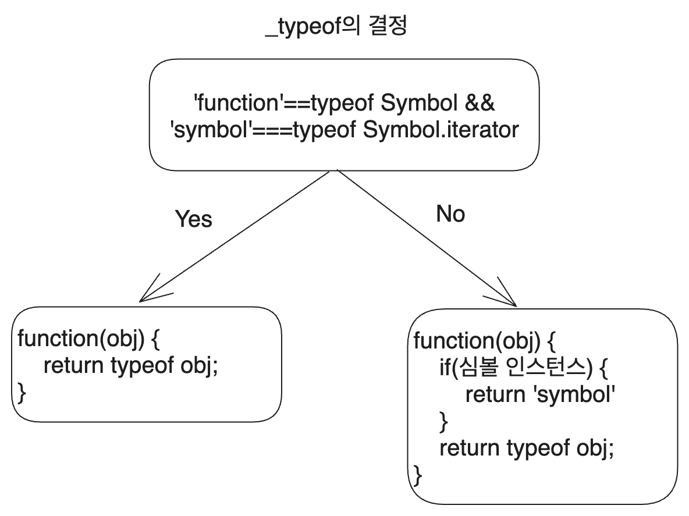
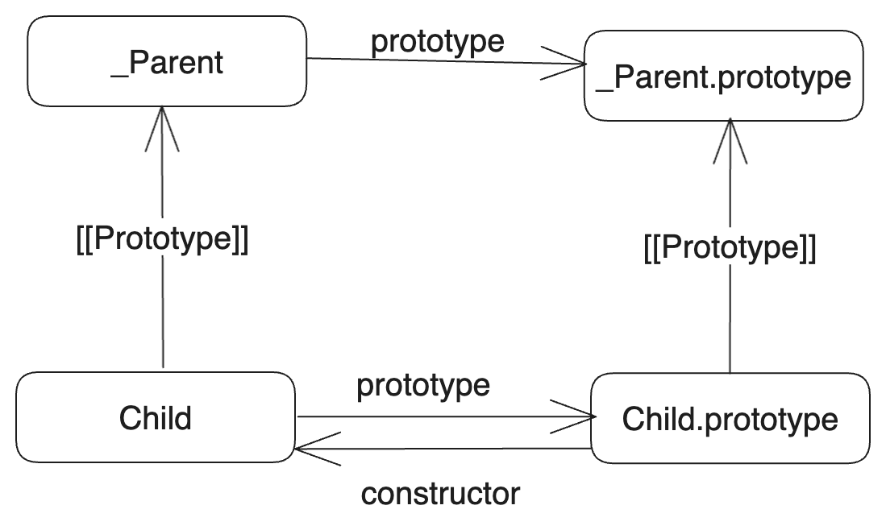
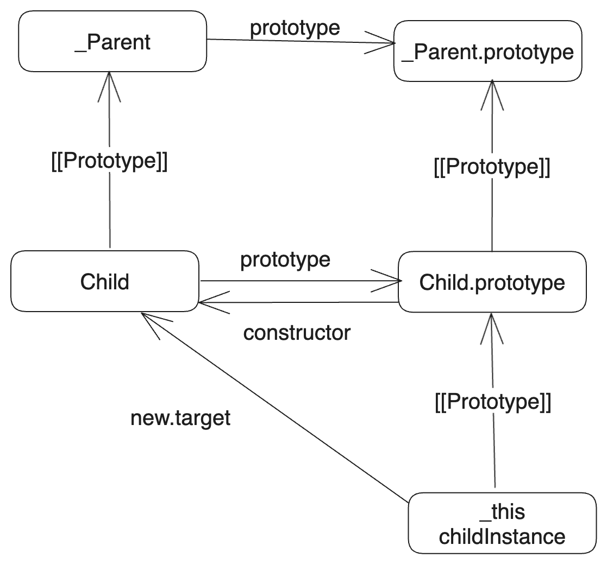

프로토타입에 관해 조사하고 정리하며 따라 나온 여러 이야기들을 모아 보았다. [CreeJee](https://github.com/CreeJee)님이 많은 키워드를 제공해 주셨다.

# 1. 프로토타입 오염 공격

기본 원리는 모든 객체 리터럴의 프로토타입은 `Object.prototype`이며 이를 `객체.__proto__`를 통해서 접근할 수 있다는 사실이다. 다음과 같이 하면 `obj`와는 아무 관계도 없는 `temp` 객체(사실은 모든 객체)에서도 프로토타입 체인을 통해 `witch` 프로퍼티에 접근할 수 있다!

```js
const obj={};
obj.__proto__.witch=1;
const temp={};
console.log(temp.witch); // 1
```

프로토타입 오염이란 결국 어떻게든 공격을 위한 데이터를 `Object.prototype`에 등록시키려는 것이다.

## 1.1. 예시

예를 들어서 두 객체를 병합하는 다음과 같은 함수 코드가 있다고 하자.

```js
function isObject(obj){
  return obj!==null && typeof obj === 'object';
}

function merge(objA, objB){
  for(let key in objB){
    if(isObject(objA[key]) && isObject(objB[key])){
      merge(objA[key], objB[key]);
    }
    else{
      objA[key]=objB[key];
    }
  }
  return objA;
}
```

그러면 다음과 같은 코드로 두 객체를 병합하는 과정에서 `Object.prototype`에 프로퍼티를 등록시킬 수 있다.

```js
const objA = {a:1, b:2};
const objB = JSON.parse('{"__proto__":{"attack":"attack_code"}}');

merge(objA, objB);
const objC = {};
console.log(objC.attack);
```

위처럼 하면 objB를 objA에 병합하는 과정에서 `__proto__`에 접근하여 `Object.prototype`에 `attack` 프로퍼티를 등록시키고, 이는 프로토타입 체인을 통해서 `Object` 생성자로 생성된 객체 `objC`에서도 접근할 수 있게 된다.

다른 예시는 [원본 글](https://blog.coderifleman.com/2019/07/19/prototype-pollution-attacks-in-nodejs/)에서 찾아볼 수 있다. 이를 해결하기 위해서는 Map을 쓰거나 [프로토타입 문법 정리 글](https://witch.work/posts/dev/javascript-prototype-grammar#3.4.-%EC%95%84%EC%A3%BC-%EB%8B%A8%EC%88%9C%ED%95%9C-%EA%B0%9D%EC%B2%B4)에서 다룬 아주 단순한 객체를 만들자.

# 2. util.inherits

## 2.1. 개요

오래전 `class`와 `extends`키워드가 없던 시절에도 객체 지향 프로그래밍의 핵심인 상속은 구현해야 했다. 물론 이전의 문법 글에서 본 것처럼 프로토타입 상속이 가능하다. 하지만 이를 계속 하기에는 불편했다. 그래서 nodeJS에서는 편의 함수로 `util.inherits`를 제공했다. 생성자 함수 간의 상속 관계를 만들어 주는 것이다.

```js
function Parent(){}

Parent.prototype.say=function(){
  console.log("부모 생성자 함수입니다.");
}

function Child(){}

utils.inherits(Child, Parent);

Child.prototype.greeting = function(){
  this.say();
  console.log("자식 생성자 함수입니다.");
}

const child=new Child();
child.greeting();
/* 부모 생성자 함수입니다.
자식 생성자 함수입니다. */

console.log(child instanceof Parent); // true
console.log(Child.super_===Parent); // true
```

위와 같이 쓰면, `child`에서 `greeting`을 호출할 시 해당 함수 내부의 `this`는 `child`가 되고 따라서 `child.say()`가 호출된다. 이때 `utils.inherit`에 의해 `Child` 생성자 함수가 `Parent` 생성자 함수를 상속하게 되었으므로 child는 프로토타입 체인을 따라 `Parent.prototype`의 `say` 함수를 사용할 수 있다. 그래서 위와 같은 결과가 나왔다.

그럼 어떻게 프로토타입 체인을 만들었길래 이렇게 생성자 함수 간의 상속 관계도 만들고 `super_`도 쓸 수 있게 해준 걸까?

## 2.2. 원리

[nodeJS 아카이브](https://github.com/nodejs/node-v0.x-archive/blob/master/lib/util.js#L572-L582)를 찾아보면 `utils.inherits`의 초기 버전을 찾을 수 있다.

```js
/**
 * Inherit the prototype methods from one constructor into another.
 *
 * The Function.prototype.inherits from lang.js rewritten as a standalone
 * function (not on Function.prototype). NOTE: If this file is to be loaded
 * during bootstrapping this function needs to be rewritten using some native
 * functions as prototype setup using normal JavaScript does not work as
 * expected during bootstrapping (see mirror.js in r114903).
 *
 * @param {function} ctor Constructor function which needs to inherit the
 *     prototype.
 * @param {function} superCtor Constructor function to inherit prototype from.
 */
exports.inherits = function(ctor, superCtor) {
  ctor.super_ = superCtor;
  ctor.prototype = Object.create(superCtor.prototype, {
    constructor: {
      value: ctor,
      enumerable: false,
      writable: true,
      configurable: true
    }
  });
};
```

이 코드를 보면 다음과 같은 관계를 만든다는 것을 알 수 있다. 프로퍼티 설명자는 그냥 `constructor`속성을 `for..in` 반복문에서 제외시키고 편집은 가능하도록 하기 위한 것뿐이다.



즉 `#2.1.`의 코드에서 관찰할 수 있는 관계를 나타내면 다음과 같다. `child`에서 `say`를 사용하는 과정이 프로토타입 체인을 보면 와닿는다.



## 2.3. 현재

[node의 현재 버전에서도 이 함수는 찾아볼 수 있다.](https://github.com/nodejs/node/blob/main/lib/util.js#L229) 물론 사용이 권장되지는 않는다. 

`ObjectDefineProperty`와 `ObjectSetPrototypeOf`는 적당히 중간에 `.`을 붙여서 생각하자. 그렇게 해석하면 약간의 검증 코드가 추가되기는 했지만 기본적인 원리는 위의 것과 같다는 것을 알 수 있다.

이 함수의 실행 결과 만들어지는 `ctor`, `superCtor` 사이의 구조도 위에서 본 것과 똑같다. 다만 이제는 `ctor.super_`의 `[[Prototype]]`이 null로 설정된다는 것 정도. 아마 생성자 함수의 `super`에 접근하는 것이 `super_` 속성을 통해서만 가능하도록 하기 위한 조치가 아닐까 한다.

```js
/* jsdoc은 생략 */
function inherits(ctor, superCtor) {

  if (ctor === undefined || ctor === null)
    throw new ERR_INVALID_ARG_TYPE('ctor', 'Function', ctor);

  if (superCtor === undefined || superCtor === null)
    throw new ERR_INVALID_ARG_TYPE('superCtor', 'Function', superCtor);

  if (superCtor.prototype === undefined) {
    throw new ERR_INVALID_ARG_TYPE('superCtor.prototype',
                                   'Object', superCtor.prototype);
  }
  ObjectDefineProperty(ctor, 'super_', {
    __proto__: null,
    value: superCtor,
    writable: true,
    configurable: true,
  });
  ObjectSetPrototypeOf(ctor.prototype, superCtor.prototype);
}
```

## 2.4. 문제

`utils.inherits`는 ES6에서 클래스가 나오고 상속을 정식으로 지원하게 된 지금, 역사 속으로 사라지려 하는 nodeJS 유틸리티 함수다. 

하지만 JS는 여전히 프로토타입을 버리지 않았고 여전히 잘 작동하는데 굳이 이 함수를 쓰지 말아야 할 이유가 있을까? JS가 프로토타입 기반 언어라는 건 다 아는 사실인데 class가 나왔다고 `Usage of util.inherits() is discouraged.(nodeJS 공식 문서 중)`라고 명시할 필요까지 있었을까?

이유는 이 함수 내부에서 `Object.setPrototypeOf()`를 사용하기 때문이다. 위의 `utils.inherit`구현을 보면 다음 구문을 찾아볼 수 있다.

```js
ObjectSetPrototypeOf(ctor.prototype, superCtor.prototype);
```

[해당 MDN 문서](https://developer.mozilla.org/en-US/docs/Web/JavaScript/Reference/Global_Objects/Object/setPrototypeOf)를 보면, JS 엔진들이 작동하는 방식 때문에 객체의 `[[Prototype]]`속성을 변경하는 건 매우 느리다.

이 원리는 [Mathias의 글](https://mathiasbynens.be/notes/prototypes)에서 찾아볼 수 있는데 해당 글에 관해서는 추후 자세히 분석하도록 한다.

아무튼 엔진 개발자들이 노력하고 있지만 현재로서는 객체의 프로토타입 변경은 매우 느린 연산이다. 때문에 상속을 구현하면서 성능을 고려한다면 객체에 `Object.setPrototypeOf`를 사용하는 대신 `Object.create`로 새로운 객체를 만들어서 상속을 구현하는 게 더 좋다.

### 2.4.1. 왜 개선 불가능한가?

그러면 `utils.inherits`를 `Object.create`를 사용하도록 바꾸면 되지 않는가? 가령 다음과 같이 말이다.

```js
function inherits(ctor, superCtor) {

  if (ctor === undefined || ctor === null)
    throw new ERR_INVALID_ARG_TYPE('ctor', 'Function', ctor);

  if (superCtor === undefined || superCtor === null)
    throw new ERR_INVALID_ARG_TYPE('superCtor', 'Function', superCtor);

  if (superCtor.prototype === undefined) {
    throw new ERR_INVALID_ARG_TYPE('superCtor.prototype',
                                   'Object', superCtor.prototype);
  }
  ObjectDefineProperty(ctor, 'super_', {
    __proto__: null,
    value: superCtor,
    writable: true,
    configurable: true,
  });
  ctor.prototype=ObjectCreate(superCtor.prototype);
}
```

하지만 내가 생각하는 걸 똑똑한 Nodejs 개발자들이 생각 못 했을 리는 없다. 위의 코드는 역시 느리다. 왜냐 하면 결국 `[[Prototype]]`을 변경하는 건 마찬가지이기 때문이다.

생성자 함수는 생성될 때 이미 `prototype` 속성으로 `{constructor:생성자 함수 자신}`을 가지고 있다. 따라서 위 코드에서 `ctor` 생성자 함수를 인자로 받아서 `ctor.prototype=ObjectCreate(~~);`를 실행하는 시점에 이미 `ctor.prototype`의 `[[Prototype]]`이 존재하고 따라서 해당 문장 또한 결국 `[[Prototype]]`을 변경하는 것이다.

`Object.create`를 객체 생성 시점에 사용하지 않으면 프로토타입 변경으로 인한 성능저하를 피할 수 없고, 따라서 그냥 `Object.setPtototypeOf`를 사용하는 것이다.

## 2.5. 클래스 상속과의 차이

프로토타입 기반 시절이었던 JS의 상속과 클래스 상속과의 차이는 너무 많고, 또한 프로토타입 기반의 상속을 어떻게 하느냐에 따라 다르겠지만 `utils.inherits`에서의 가장 큰 차이는 생성자 함수 자체가 아니라 prototype이 상속된다는 점이다.

클래스 기반의 상속에서는 다음과 같이 클래스 그 자체가 상속되는 게 당연하다.

```js
class Parent{
  name="Lee";
  say(){
    console.log(`이름은 ${this.name}입니다.`);
  }
}

class Child extends Parent{
  greeting(){
    this.say();
  }
}

let parent=new Parent();
// 이름은 Lee입니다.
parent.say();
let child=new Child();
// 이름은 Lee입니다.
child.greeting();
```

하지만 `utils.inherits`는 원리를 보면 알겠지만 프로토타입만 상속한다. node 공식 문서에서도 이를 언급하고 있다.

```
Inherit the prototype methods from one constructor into another.
- utils.inherits 공식 문서 중
```

물론 위의 `utils.inherits`구조에서도 이를 알 수 있다. 아무튼 만약 생성자 함수의 내용들도 상속된다고 생각하고 사용하면 문제가 생긴다. 

애초에 이 상속 패턴 자체가 생성자 함수의 `prototype`은 해당 생성자 함수가 생성한 객체의 `[[Prototype]]`이 된다는 원리를 이용한 것이기 때문에, 생성자 함수의 `prototype`을 상속하는 것이지 생성자 함수 그 자체를 상속하는 게 아니다.

# 3. class와 prototype

클래스는 prototype의 문법적 설탕일 뿐이라는 말이 있다. 실제로 지금까지 본 것처럼 프로토타입으로도 꽤 단단한 상속 구조를 만들 수 있다. 생성자 함수를 통해 인스턴스 생성도 얼마든지 가능하다.

하지만 차이점들이 분명 있다. 그것을 알아보자.

## 3.1. 클래스 검증

class로 만든 함수엔 특수 내부 프로퍼티인 `[[IsClassConstructor]]: true`가 이름표처럼 붙는다. 

이 `[[IsClassConstructor]]`는 클래스 생성자를 `new`와 함께 호출하지 않으면 에러를 발생시키는 검증 로직에 쓰인다. 생성자 함수를 쓰던 시절에는 `function`이 일반적인 함수와 형태가 똑같고 `new`를 붙여서 호출하면 생성자 함수로 동작하는 식이었다.

여담이지만, `new`와 함께 호출되었는지 확인하는 검증 로직이 생성자 함수 시절에는 불가능했냐고 하면 그렇지는 않았다. 가령 다음과 같은 `_classCallCheck` 함수를 만들 수 있다.

```js
function _classCallCheck(instance, Constructor) {
  if (!(instance instanceof Constructor)) {
    throw new TypeError("Cannot call a class as a function");
  }
}

function Person(name,age){
  _classCallCheck(this,Person);
  this.name=name; 
  this.age=age;
}
```

그러나 이 또한 해당 클래스의 인스턴스를 `this`로 삼아 생성자 함수를 호출할 시 무력화된다.

```js
const me=new Person('witch',200);
Person.call(me);
```

이 문제는 ES6에서 `new.target` 속성이 나오면서 해결할 수 있게 되었다. ES6에서는 함수가 호출될 시 내부에 `new.target` 속성이 자동으로 생겨나는데(화살표 함수는 제외) 이는 `new`를 통해 호출되었을 때는 생성자(함수 또는 클래스)자신을, 일반 함수로 호출되었을 때는 `undefined`를 가리킨다.

new 연산자를 이용해서 호출되었는지는 이제 다음과 같이 확인할 수 있다. 이런 건 실제로 class 생성자가 new와 함께 호출되었는지 확인하는 로직에도 쓰인다.

```js
function Person(name,age){
  if(new.target!==Person){
    throw new Error('new 연산자를 사용하세요.');
  }
  this.name=name;
  this.age=age;
}
```

## 3.2. 빌트인 객체 상속

```js
const Arr1=function(){};
Arr1.prototype=Object.create(Array.prototype);
const arr1=new Arr1();
arr1[0] = 'test';
console.log(arr1.length); // 0

class Arr2 extends Array{}
const arr2=new Arr2();
arr2[0] = 'test';
console.log(arr2.length); // 1
```

위의 코드에서도 물론 `arr1.push("test")`와 같이 하면 `arr1.length`가 1이 된다. 하지만 `arr1[0]`에 값을 할당하는 것은 `length`를 증가시키지 않는다. 실제로 `arr1`의 생성 이후 배열 메서드를 쓰지 않은 상태에서 해당 객체를 출력해 보면 인덱스만 가진 객체임을 알 수 있다.

다음과 같은 프로토타입 체인 구조가 만들어지는 걸 생각해 보면 사실 `arr1`은 배열이 아니라 그냥 `Array.prototype`의 하위 프로토타입 체인에 들어가 있는 객체일 뿐이므로 당연한 일이다.



하지만 `Array`를 상속한 클래스의 인스턴스는 처음부터 객체처럼 동작한다. 이는 클래스 생성자의 작동 방식 때문이다. 상속을 받은 클래스의 생성자는 먼저 부모 클래스 생성자에게 생성을 위임하고(클래스 생성자에서 super를 무조건 호출해야 하는 것도 이것 때문) new.target은 자식 클래스로 지정하는 방식이다.

의사 코드로 나타내면 다음과 같다.

```js
class Child extends Parent{
  constructor(){
    if(classKind==='base'){
      // 상속받은 클래스가 없다면 base 클래스임
      this=Object.create(new.target.prototype);
    }
    else{
      // 부모 클래스에 생성을 위임한 후 new.target은 자신으로 생성
      this=Reflect.construct(Parent, arguments, new.target);
    }
  }
}
```

이런 원리로 인해서 Array를 상속받은 클래스 `Arr2`의 인스턴스는 생성될 때 `super`즉 `Array` 생성자의 결과물인 배열로 시작하는 것이다. 따라서 `arr2[0]`에 값을 할당하면 `length`가 1이 된다.

그리고 위의 의사 코드에서는 `classKind`라고 대충 이름붙였지만 실제로는 상속 클래스의 생성자 함수에 특수 내부 프로퍼티 `[[ConstructorKind]]:"derived"`가 붙어 이를 통해 상속된 클래스인지를 확인한다.

## 3.3. `[[HomeObject]]`의 사용

ES6에서 `super`는 어떻게 동작할까? 우리가 지금까지 배운 상속 구조를 통해서 생각해 보면, `super.method()`를 호출하면 현재 객체의 프로토타입에서 `method`를 찾아서 호출할 거라고 생각할 수 있다.

예를 들어서 이런 것이다.

```js
let parent={
  role:"parent",
  run(){
    console.log(`${this.role} is running`)
  }
}

let child={
  __proto__:parent,
  role:"child",
  run(){
    // super.run()이 이렇게 동작할 거라고 생각해 볼 수 있다.
    this.__proto__.run.call(this)
  }
}
/* child.__proto__는 parent니까 parent.run.call(child)
가 될 테고 잘 작동한다.*/
child.run() // child is running
```

하지만 체인에 객체를 하나만 더 추가해 보면 문제가 생긴다.

```js
let parent={
  role:"parent",
  run(){
    console.log(`${this.role} is running`)
  }
}

let child={
  __proto__:parent,
  role:"child",
  run(){
    this.__proto__.run.call(this)
  }
}

let grandChild={
  __proto__:child,
  role:"grandChild",
  run(){
    this.__proto__.run.call(this)
  }
}

child.run() // child is running
/* grandChild is running 이 와야 할 것 같지만..
Uncaught RangeError: Maximum call stack size exceeded */
grandChild.run()
```

왜 이렇게 될까? `grandChild.run()`이 호출되면 어떤 일이 벌어지는지 생각해 보자.

`grandChild.run()` 호출

그러면 `grandChild` 객체 내부에서 run이 호출되면서 `child.run.call(grandChild)` 가 호출

`grandChild`를 this로 하여 `child.run()`이 실행되는데 그 내부에서도 `this.__proto__.run.call(this)`가 호출된다. 이는 또 `child.run.call(grandChild)`가 됨.

즉 `child.run.call(grandChild)`가 계속 재귀 호출을 하게 되어서 문제가 생기는 것이다.

JS에서는 이런 문제를 `[[HomeObject]]`라는 함수 전용 특수 내부 프로퍼티를 이용해 해결한다. 클래스 혹은 객체 메서드인 함수에서는 `[[HomeObject]]`에 해당 객체가 저장된다.

```js
let person={
  name:"마녀",
  eat(){ // person.eat의 [[HomeObject]]에는 person이 저장된다
    console.log(`${this.name}이 밥을 먹습니다.`);
  }
}
```

그리고 `super`를 사용하면 `[[HomeObject]]`를 이용해서 부모 프로토타입과 메서드를 찾을 수 있다. 따라서 위 코드는 다음과 같이 고치면 잘 작동한다.

```js
let parent={
  role:"parent",
  run(){
    console.log(`${this.role} is running`)
  }
}

let child={
  __proto__:parent,
  role:"child",
  run(){
    super.run()
  }
}

let grandChild={
  __proto__:child,
  role:"grandChild",
  run(){
    super.run()
  }
}

child.run() // child is running
/* grandChild is running */
grandChild.run()
```

어? 그런데 우리는 지금까지 이 섹션에서 클래스를 단 한번도 사용하지 않고 `super`를 잘 사용하지 않았던가? 대체 왜 이것이 클래스가 프로토타입의 문법적 설탕이 아니라는 것을 보여주는가?

이 `[[HomeObject]]`가 제대로 동작하기 위해서는 메서드를 반드시 `method(){}`와 같이 리터럴 형태로 정의해야 하기 때문이다. 클래스 메서드든 일반 객체 메서드든 말이다. 따라서 생성자 함수로 객체를 생성할 때는 `super`를 사용할 수 없다. 생성자 함수의 경우 생성자를 반드시 `function(){}`형태로 작성해야 하기 때문이다.

반면 클래스에선 `constructor()`를 이용해 생성자를 작성하므로 생성자 내에서 `[[HomeObject]]`를 제대로 사용할 수 있다.

### 3.3.1. `[[HomeObject]]`와 메서드의 자유도

JS에서 메서드는 보통 객체에 묶이지 않고 자유롭다. this를 기반으로 작동하는 게 많기 때문이다. 예를 들어 다음과 같이 객체 메서드를 다른 곳으로 복사해도 똑같이 잘 작동한다.

```js
let witch={
  name:"witch",
  sayHi(){
    console.log(`I am ${this.name}`);
  }
}

let yun={
  name:"yun",
}

yun.greet=witch.sayHi;
yun.greet(); // I am yun
```

하지만 `[[HomeObject]]`를 이용해서 메서드를 찾는다면 해당 메서드는 객체를 기억한다. 또한 `[[HomeObject]]`를 개발자가 변경할 수 있는 방법도 없기 때문에 이 기억된 객체를 변경할 수도 없다.

이런 기억된 `[[HomeObject]]`는 `super` 내부에서만 유효하므로 `super`를 사용하지 않으면 똑같이 자유로운 메서드를 사용할 수 있다. 하지만 `super`를 사용한다면 메서드가 해당 객체에 묶여 있음을 기억하자.

다음과 같은 코드를 보자.

```js
let foo={
  name:"foo",
  sayHi(){
    console.log(`I am foo`);
  }
}

let fooChild={
  __proto__:foo,
  sayHi(){
    super.sayHi();
  }
}

let bar={
  sayHi(){
    console.log(`I am bar`);
  }
}

let barChild={
  __proto__:bar,
}

barChild.sayHi=fooChild.sayHi;
barChild.sayHi(); // I am foo
```

왜 `I am foo` 가 출력되는 것일까? `barChild.sayHi`는 `super`에 접근해서 `super.sayHi`를 호출하는데 그러면 `barChild`의 프로토타입인 `bar`의 `sayHi`를 호출해야 하는 거 아닐까?

이는 `super`가 `[[HomeObject]]`를 이용해서 메서드를 찾기 때문이다.

`barChild.sayHi`는 `fooChild.sayHi`와 같고, `fooChild.sayHi`는 `super.sayHi`를 호출한다. 이때 `super`는 `fooChild`를 `[[HomeObject]]`로 기억하고 있으므로 `foo.sayHi`가 호출되는 것이다.



# 4. babel의 class transform

자, 그래서 class는 기존의 JS 프로토타입의 단순한 문법적 설탕이 아니다. (나는 프로그래밍을 막 처음 시작할 때 PL에 매우 관심이 많은 사람의 글을 보고 배웠기 때문에 문법적 설탕이라는 용어가 익숙하지만 `편의 문법`이라는 말을 더 좋아하는 사람도 많은 듯 하다. 하지만 여기서는 문법적 설탕이라고 쓰겠다)

그럼 ES5에서는 클래스와 같은 일을 할 수 없는 것일까? 내가 이런 걸 실험해 볼 수 있을까? 당연하지만 이런 걸 고민했던 사람들이 있었고, 그 결과물이 바로 babel이다.

babel에서는 클래스를 어떻게 ES5 문법으로 변환할까? 지금까지 봤던 것들, 클래스에서만 가능하다고 했던 것들은 JS 외의 다른 언어에서도 많이 쓰였던 기능이고 따라서 babel에서는 어떻게든 이것들을 구현해내왔을 것이다. 그걸 좀 파헤쳐보자.

JS는 시간을 거슬러 올라갈수록 복잡하고 현대의 일반적인 언어들과는 다른 부분이 많아서 트리키한 코드도 많은 편이다. 심지어 JS가 아예 잘못 짜였으며 더러운 언어라고 말하는 사람들도 있다. 하지만 정말로 JS가 더러운 언어라고 하더라도 그걸 이용해서 어떻게든 해온 사람들이 생각해낸 나름의 체계가 있고 방법들이 있을 것이다. 그것들이 JS를 깊이 배울 가치를 만든다고 나는 믿는다.

## 4.1. 기초

babel은 많은 헬퍼 함수들을 사용하지만, 그런 걸 좀 제거하고 클래스 -> 프로토타입의 기본 원리를 설명하는 [한 스택오버플로우 답변](https://stackoverflow.com/questions/35774928/how-does-babel-js-create-compile-a-class-declaration-into-es2015)이 있었다. 다음 클래스 코드를 보자.

```js
class Base{
  constructor(){
    this.baseProp=42;
  }

  baseMethod(){
    console.log(this.baseProp);
  }

  static foo(){
    console.log('foo');
  }
}

class Derived extends Base{
  constructor(){
    super();
    this.derivedProp="derived"
  }

  baseMethod(){
    super.baseMethod();
    console.log("derived method");
  }

  // Another instance method:
  derivedMethod() {
    this.baseMethod();
    console.log(this.derivedProp);
  }
}
```

이는 이렇게 변환된다. class의 생성자는 생성자 함수가 되고, constructor가 아니고 static이 아닌 메서드들은 `prototype`에 등록된다. 그리고 `super`는 `Base.prototype`의 해당 메서드를 직접 호출하는 걸로 변한다. 

또한 `Derived.prototype`이 `Base.prototype`이 아니라 `Object.create(Base.prototype)`로 생성된다. `Derived.prototype`을 덮어썼으니 다시 `prototype.constructor`를 생성자 함수 자신으로 돌려놓는 것도 수행한다.

```js
var Base=function(){
  this.baseProp=42;
}

Base.prototype.baseMethod=function(){
  console.log(this.baseProp);
}

Base.foo=function(){
  console.log('foo');
}

Derived.prototype=Object.create(Base.prototype);
Derived.prototype.constructor=Derived;

Derived.prototype.baseMethod=function(){
  Base.prototype.baseMethod.call(this);
  console.log("derived method");
}

Derived.prototype.derivedMethod=function(){
  this.baseMethod();
  console.log(this.derivedProp);
}
```

결국 우리가 지금까지 생각했던 프로토타입 상속으로 변환된 것이다. 이제 실제 Babel이 어떻게 클래스를 변환하는지 더 깊이 알아보자.

## 4.2. Babel class transform - 상속 없이

[How to Convert ES6 into ES5 using Babel](https://medium.com/@SunnyB/how-to-convert-es6-into-es5-using-babel-1b533d31a169)을 참고해서 실제로 class 문법을 ES5로 바꿔보았다. 상속도 없는 아주 간단한 클래스를 만들어 본 것이다.

```js
class Parent{
  constructor(name){
    this._name = name;
  }
  getName(){
    return this._name;
  }
}

const parent=new Parent('parent');
console.log(parent.getName());
```

개행과 들여쓰기 포매팅은 했지만 내용은 그대로다. 그랬더니 70줄 정도 된다. 또한 헬퍼 함수들이 많다. 왜 위의 스택오버플로우 질문답변에서 babel이 헬퍼 함수가 많다고 했는지 알겠다.

```js
"use strict";

function _typeof(obj) {
  "@babel/helpers - typeof";
  return _typeof = "function" == typeof Symbol && "symbol" == typeof Symbol.iterator ? function(obj) {
    return typeof obj;
  } : function(obj) {
    return obj && "function" == typeof Symbol && obj.constructor === Symbol && obj !== Symbol.prototype ? "symbol" : typeof obj;
  }, _typeof(obj);
}

function _classCallCheck(instance, Constructor) {
  if (!(instance instanceof Constructor)) {
    throw new TypeError("Cannot call a class as a function");
  }
}

function _defineProperties(target, props) {
  for (var i = 0; i < props.length; i++) {
    var descriptor = props[i];
    descriptor.enumerable = descriptor.enumerable || false;
    descriptor.configurable = true;
    if ("value" in descriptor) descriptor.writable = true;
    Object.defineProperty(target, _toPropertyKey(descriptor.key), descriptor);
  }
}

function _createClass(Constructor, protoProps, staticProps) {
  if (protoProps) _defineProperties(Constructor.prototype, protoProps);
  if (staticProps) _defineProperties(Constructor, staticProps);
  Object.defineProperty(Constructor, "prototype", {
    writable: false
  });
  return Constructor;
}

function _toPropertyKey(arg) {
  var key = _toPrimitive(arg, "string");
  return _typeof(key) === "symbol" ? key : String(key);
}

function _toPrimitive(input, hint) {
  if (_typeof(input) !== "object" || input === null) return input;
  var prim = input[Symbol.toPrimitive];
  if (prim !== undefined) {
    var res = prim.call(input, hint || "default");
    if (_typeof(res) !== "object") return res;
    throw new TypeError("@@toPrimitive must return a primitive value.");
  }
  return (hint === "string" ? String : Number)(input);
}
var Parent = /*#__PURE__*/ function() {
  function Parent(name) {
    _classCallCheck(this, Parent);
    this._name = name;
  }
  _createClass(Parent, [{
    key: "getName",
    value: function getName() {
      return this._name;
    }
  }]);
  return Parent;
}();

var parent = new Parent('parent');
console.log(parent.getName());
```

상속조차 없는데도 이렇게 길다. 하나씩 해석해 보자.

### 4.2.1. _typeof

`_typeof`부터 해보자.

```js
function _typeof(obj) {
  "@babel/helpers - typeof";
  return _typeof = "function" == typeof Symbol && "symbol" == typeof Symbol.iterator ? function(obj) {
    return typeof obj;
  } : function(obj) {
    return obj && "function" == typeof Symbol && obj.constructor === Symbol && obj !== Symbol.prototype ? "symbol" : typeof obj;
  }, _typeof(obj);
}
```

쉼표 연산자가 쓰였다. 쉼표 연산자는 각각의 피연산자를 왼쪽에서 오른쪽 순서로 평가하고, 마지막 연산자의 값을 반환한다. 따라서 먼저 다음 코드를 실행한 다음 `_typeof(obj)`를 평가해서 반환하는 것이다.

```js
_typeof = "function" == typeof Symbol && "symbol" == typeof Symbol.iterator ? function(obj) {
  return typeof obj;
} : function(obj) {
  return obj && "function" == typeof Symbol && obj.constructor === Symbol && obj !== Symbol.prototype ? "symbol" : typeof obj;
},
```

이 결정을 간단히 그림으로 나타내 보면 이렇다.



정리하자면, `_typeof(obj)`는 기본적으로는 `typeof obj`를 반환하지만 만약 심볼이 정의되어 있다면(`"function" == typeof Symbol && "symbol" == typeof Symbol.iterator`로 확인)`obj`가 심볼일 때 `"symbol"`을 반환하고, 그렇지 않으면 `typeof obj`를 반환한다.

`obj !== Symbol.prototype`를 체크한 이유는 `Symbol.prototype`의 타입은 `object`이기 때문에 그 경우 `'symbol'`타입을 반환하면 안 되기 때문이다.

## 4.2.2 _toPrimitive

이 함수는 이름답게 들어온 입력을 원시값으로 변환해 주는 함수이다. 객체가 아니면서 메서드도 가지지 않는 숫자, 문자열, 불린, null, undefined, 심볼, BigInt이다.

```js
function _toPrimitive(input, hint) {
  if (_typeof(input) !== "object" || input === null) return input;
  var prim = input[Symbol.toPrimitive];
  if (prim !== undefined) {
    var res = prim.call(input, hint || "default");
    if (_typeof(res) !== "object") return res;
    throw new TypeError("@@toPrimitive must return a primitive value.");
  }
  return (hint === "string" ? String : Number)(input);
}
```

만약 입력이 객체가 아니거나 `null`이면 그대로 반환한다. `typeof null`은 `'object'`이기 때문에 해당 처리를 해준 것이다.

그리고 객체를 원시값으로 변환 시에는 `Symbol.toPrimitive`라는 잘 알려진 심볼을 먼저 호출해야 하는데 이를 구현해 준 헬퍼 함수이다. `prim`은 아무래도 `primitive`의 약자인 것 같다. 또한 해당 함수가 없다면 힌트에 따라 `String` 또는 `Number`생성자를 호출해 input을 변환한다.

JS의 원칙에 따라 input을 hint에 따라 원시값으로 변환해 주는 함수라고 생각하면 되겠다.

### 4.2.3. _toPropertyKey

```js
function _toPropertyKey(arg) {
  var key = _toPrimitive(arg, "string");
  return _typeof(key) === "symbol" ? key : String(key);
}
```

그냥 클래스의 프로퍼티 키를 생성해 주는 함수이다. 프로퍼티는 문자열 형태여야 하니 `String`으로 변환해 주는 것이다. 만약 심볼이라면 그대로 반환한다.

### 4.2.4. _classCallCheck

`_classCallCheck`함수는 `instanceof`를 사용하여 인스턴스가 `Constructor`의 프로토타입 체인에 있는지를 확인하고 없으면 에러를 throw한다.

```js
function _classCallCheck(instance, Constructor) {
  if (!(instance instanceof Constructor)) {
    throw new TypeError("Cannot call a class as a function");
  }
}
```

### 4.2.5. _defineProperties

```js
function _defineProperties(target, props) {
  for (var i = 0; i < props.length; i++) {
    var descriptor = props[i];
    descriptor.enumerable = descriptor.enumerable || false;
    descriptor.configurable = true;
    if ("value" in descriptor) descriptor.writable = true;
    Object.defineProperty(target, _toPropertyKey(descriptor.key), descriptor);
  }
}
```

이 함수는 `target`의 속성으로 `props`의 원소들을 하나하나 넣어준다. 이때 설명자도 같이 만들어서 `Object.defineProperty`로 넣어준다. 그리고 `target`에 넣을 때 속성명은 `_toPropertyKey`로 만들어준다.

### 4.2.6. _createClass

```js
function _createClass(Constructor, protoProps, staticProps) {
  if (protoProps) _defineProperties(Constructor.prototype, protoProps);
  if (staticProps) _defineProperties(Constructor, staticProps);
  Object.defineProperty(Constructor, "prototype", {
    writable: false
  });
  return Constructor;
}
```

이 함수는 클래스를 만들어주는 함수이다. `Constructor`는 클래스 역할을 할 생성자 함수이고, `protoProps`는 클래스의 프로퍼티와 메서드, `staticProps`는 클래스의 정적 프로퍼티와 메서드들이다.

`_defineProperties`를 이용해서 클래스 속성들은 `Constructor.prototype`에 넣어주고 정적 속성들은 `Constructor`에 넣어준다. 그리고 `Constructor.prototype`의 `writable`속성을 `false`로 만들어서 클래스의 프로퍼티들은 수정할 수 없도록 한다.

### 4.2.7. 클래스 생성

```js
var Parent = /*#__PURE__*/ function() {
  function Parent(name) {
    _classCallCheck(this, Parent);
    this._name = name;
  }
  _createClass(Parent, [{
    key: "getName",
    value: function getName() {
      return this._name;
    }
  }]);
  return Parent;
}();
```

Parent는 즉시 실행 함수(IIFE)로 만들어진다. 이 즉시 실행 함수는 `Parent` 생성자 함수를 내부적으로 만들어서 반환하는 익명 함수다. 익명 함수 내에서 만들어져서 반환되는 `Parent` 함수 내용이 `Parent` 생성자 함수가 되는 것이다.

또한 `_createClass` 함수를 이용해서 `Parent.prototype`에 `getName` 함수를 추가한다. 이렇게 하면 `getName`함수가 `"getName"`을 키로 해서 `Parent.prototype`에 등록되고, `Parent`의 편집 가능 여부(`writable`)는 false가 된다.

### 4.2.8. 정리

헬퍼 함수들이 많아서 많이 돌아왔는데 결국 원리는 똑같다. 클래스의 속성들은 생성자함수.prototype에 넣고 정적 속성들은 생성자 함수에 직접 넣는다. 그리고 생성자 함수의 `prototype`의 `writable`속성을 `false`로 만들어서 클래스의 프로퍼티들은 수정할 수 없도록 한다.

## 4.3. Babel class transform - 상속

상속을 하는 클래스 코드를 만들어보자.

```js
class Parent{
  constructor(name){
    this._name = name;
  }
  getName(){
    return this._name;
  }
}

class Child extends Parent{
  constructor(name, age){
    super(name);
    this._age = age;
  }
  getAge(){
    return this._age;
  }
}

let child = new Child('child', 10);
console.log(child.getName());
```

이건 beautify시 160줄이나 된다...

```js
"use strict";

function _inherits(subClass, superClass) {
  if (typeof superClass !== "function" && superClass !== null) {
    throw new TypeError("Super expression must either be null or a function");
  }
  subClass.prototype = Object.create(superClass && superClass.prototype, {
    constructor: {
      value: subClass,
      writable: true,
      configurable: true
    }
  });
  Object.defineProperty(subClass, "prototype", {
    writable: false
  });
  if (superClass) _setPrototypeOf(subClass, superClass);
}

function _setPrototypeOf(o, p) {
  _setPrototypeOf = Object.setPrototypeOf ? Object.setPrototypeOf.bind() : function _setPrototypeOf(o, p) {
    o.__proto__ = p;
    return o;
  };
  return _setPrototypeOf(o, p);
}

function _createSuper(Derived) {
  var hasNativeReflectConstruct = _isNativeReflectConstruct();
  return function _createSuperInternal() {
    var Super = _getPrototypeOf(Derived),
      result;
    if (hasNativeReflectConstruct) {
      var NewTarget = _getPrototypeOf(this).constructor;
      result = Reflect.construct(Super, arguments, NewTarget);
    } else {
      result = Super.apply(this, arguments);
    }
    return _possibleConstructorReturn(this, result);
  };
}

function _possibleConstructorReturn(self, call) {
  if (call && (_typeof(call) === "object" || typeof call === "function")) {
    return call;
  } else if (call !== void 0) {
    throw new TypeError("Derived constructors may only return object or undefined");
  }
  return _assertThisInitialized(self);
}

function _assertThisInitialized(self) {
  if (self === void 0) {
    throw new ReferenceError("this hasn't been initialised - super() hasn't been called");
  }
  return self;
}

function _isNativeReflectConstruct() {
  if (typeof Reflect === "undefined" || !Reflect.construct) return false;
  if (Reflect.construct.sham) return false;
  if (typeof Proxy === "function") return true;
  try {
    Boolean.prototype.valueOf.call(Reflect.construct(Boolean, [], function() {}));
    return true;
  } catch (e) {
    return false;
  }
}

function _getPrototypeOf(o) {
  _getPrototypeOf = Object.setPrototypeOf ? Object.getPrototypeOf.bind() : function _getPrototypeOf(o) {
    return o.__proto__ || Object.getPrototypeOf(o);
  };
  return _getPrototypeOf(o);
}

function _typeof(obj) {
  "@babel/helpers - typeof";
  return _typeof = "function" == typeof Symbol && "symbol" == typeof Symbol.iterator ? function(obj) {
    return typeof obj;
  } : function(obj) {
    return obj && "function" == typeof Symbol && obj.constructor === Symbol && obj !== Symbol.prototype ? "symbol" : typeof obj;
  }, _typeof(obj);
}

function _classCallCheck(instance, Constructor) {
  if (!(instance instanceof Constructor)) {
    throw new TypeError("Cannot call a class as a function");
  }
}

function _defineProperties(target, props) {
  for (var i = 0; i < props.length; i++) {
    var descriptor = props[i];
    descriptor.enumerable = descriptor.enumerable || false;
    descriptor.configurable = true;
    if ("value" in descriptor) descriptor.writable = true;
    Object.defineProperty(target, _toPropertyKey(descriptor.key), descriptor);
  }
}

function _createClass(Constructor, protoProps, staticProps) {
  if (protoProps) _defineProperties(Constructor.prototype, protoProps);
  if (staticProps) _defineProperties(Constructor, staticProps);
  Object.defineProperty(Constructor, "prototype", {
    writable: false
  });
  return Constructor;
}

function _toPropertyKey(arg) {
  var key = _toPrimitive(arg, "string");
  return _typeof(key) === "symbol" ? key : String(key);
}

function _toPrimitive(input, hint) {
  if (_typeof(input) !== "object" || input === null) return input;
  var prim = input[Symbol.toPrimitive];
  if (prim !== undefined) {
    var res = prim.call(input, hint || "default");
    if (_typeof(res) !== "object") return res;
    throw new TypeError("@@toPrimitive must return a primitive value.");
  }
  return (hint === "string" ? String : Number)(input);
}
var Parent = /*#__PURE__*/ function() {
  function Parent(name) {
    _classCallCheck(this, Parent);
    this._name = name;
  }
  _createClass(Parent, [{
    key: "getName",
    value: function getName() {
      return this._name;
    }
  }]);
  return Parent;
}();
var Child = /*#__PURE__*/ function(_Parent) {
  _inherits(Child, _Parent);
  var _super = _createSuper(Child);

  function Child(name, age) {
    var _this;
    _classCallCheck(this, Child);
    _this = _super.call(this, name);
    _this._age = age;
    return _this;
  }
  _createClass(Child, [{
    key: "getAge",
    value: function getAge() {
      return this._age;
    }
  }]);
  return Child;
}(Parent);
var child = new Child('child', 10);
console.log(child.getName());
```

익숙한 함수들도 있고, 상속에 관련된 함수들은 낯설다. 이제 익숙한 함수들은 제쳐두고 새로 보이는 것들을 해석해보자.

### 4.3.1. prototypeOf

```js
function _getPrototypeOf(o) {
  _getPrototypeOf = Object.setPrototypeOf ? Object.getPrototypeOf.bind() : function _getPrototypeOf(o) {
    return o.__proto__ || Object.getPrototypeOf(o);
  };
  return _getPrototypeOf(o);
}

function _setPrototypeOf(o, p) {
  _setPrototypeOf = Object.setPrototypeOf ? Object.setPrototypeOf.bind() : function _setPrototypeOf(o, p) {
    o.__proto__ = p;
    return o;
  };
  return _setPrototypeOf(o, p);
}
```

`_getPrototypeOf`는 `__proto__`를 사용해서 객체의 프로토타입을 가져오는 함수이다. `__proto__`가 없다면 `Object.getPrototypeOf`를 사용해서 프로토타입을 가져온다.

`_setPrototypeOf`는 `__proto__`를 사용해서 객체의 프로토타입을 설정하는 함수이다. 그냥 프로토타입을 설정하는 데 쓰는 헬퍼 함수다.

### 4.3.2. _isNativeReflectConstruct

`Reflect`는 ES6에서 처음 나온 기능이다. 따라서 이것과 관련된 기능이 지원되는지를 확인하는 헬퍼이다. `Reflect.construct`가 지원되는지를 확인하는데 사용되며 클래스의 동작과 직접적인 연관은 별로 없는 것으로 보인다.

```js
function _isNativeReflectConstruct() {
  if (typeof Reflect === "undefined" || !Reflect.construct) return false;
  if (Reflect.construct.sham) return false;
  if (typeof Proxy === "function") return true;
  try {
    Boolean.prototype.valueOf.call(Reflect.construct(Boolean, [], function() {}));
    return true;
  } catch (e) {
    return false;
  }
}
```

`Reflect` 객체가 정의되어 있지 않거나 `Reflect.construct` 메서드가 없으면 false를 반환한다. 사양에 따라 구현되어 있지 않아도 false. 반면 `Proxy`가 네이티브로 지원되면 true.

그리고 `Boolean.prototype.valueOf` 메서드를 사용하여 `Reflect.construct`를 호출할 수 있는지 확인한다. 이게 기능하면 true이고 아니면 false.

### 4.3.3. _assertThisInitialized

그냥 self가 undefined인지 확인하고 undefined이면 에러를 발생시키는 함수다. [`void 0`은 `undefined`를 반환하기 때문이다.](https://stackoverflow.com/questions/4806286/difference-between-void-0-and-undefined)

```js
function _assertThisInitialized(self) {
  if (self === void 0) {
    throw new ReferenceError("this hasn't been initialised - super() hasn't been called");
  }
  return self;
}
```

### 4.3.4. _possibleConstructorReturn

call이 객체이거나 함수면 그냥 call을 반환한다. 그렇지 않으면 call이 undefined가 아니면 에러를 발생시킨다. 그렇지 않으면 `_assertThisInitialized`를 통해 self가 undefined인지 확인하고 self를 반환한다.

함수 이름과 구조로 추측해볼 때 self, call중 가능한 `constructor`형태를 검사하고 반환하고 같다. 상속된 constructor는 객체나 함수여야 하기 때문이다.

```js
function _possibleConstructorReturn(self, call) {
  if (call && (_typeof(call) === "object" || typeof call === "function")) {
    return call;
  } else if (call !== void 0) {
    throw new TypeError("Derived constructors may only return object or undefined");
  }
  return _assertThisInitialized(self);
}
```

### 4.3.5. _createSuper

이 함수는 부모의 생성자 함수에 해당하는 `_createSuperInternal`함수를 반환한다. 함수 이름과, 추후 사용되는 코드 등을 볼 때 `var _super=_createSuper(Child)`와 같이 생성자 함수 내에서 `_super`를 만들기 위해서 사용되는 함수임을 알 수 있다. 즉 슈퍼클래스 생성자에 접근하는 방법을 마련하는 것이다.

```js
function _createSuper(Derived) {
  var hasNativeReflectConstruct = _isNativeReflectConstruct();
  return function _createSuperInternal() {
    var Super = _getPrototypeOf(Derived),
      result;
    if (hasNativeReflectConstruct) {
      var NewTarget = _getPrototypeOf(this).constructor;
      result = Reflect.construct(Super, arguments, NewTarget);
    } else {
      result = Super.apply(this, arguments);
    }
    return _possibleConstructorReturn(this, result);
  };
}
```

`Reflect`가 있는지에 따라 구현은 조금 다르지만 결국 `_createSuper` 함수가 리턴하는 부모 함수의 생성자인 `_createSuperInternal`는 현재 함수의 프로토타입(`[[Prototype]]` 숨김 속성)인 생성자 함수를 현재 생성자 함수가 만드는 객체를 `this`로 삼아 호출한다.

이것이 만드는 구조는 `###4.3.7`의 실제 코드에서 더 살펴보기로 하자.

### 4.3.6. _inherits

이건 위에서 본 `utils.inherit`과 별다를 바 없다. 이 또한 결국 `subClass.prototype`를 변경하므로 프로토타입을 변경하는 거나 마찬가지라 퍼포먼스에 손해를 본다.

```js
function _inherits(subClass, superClass) {
  if (typeof superClass !== "function" && superClass !== null) {
    throw new TypeError("Super expression must either be null or a function");
  }
  subClass.prototype = Object.create(superClass && superClass.prototype, {
    constructor: {
      value: subClass,
      writable: true,
      configurable: true
    }
  });
  Object.defineProperty(subClass, "prototype", {
    writable: false
  });
  if (superClass) _setPrototypeOf(subClass, superClass);
}
```

아무튼 `superClass`가 함수 혹은 null(null도 프로토타입일 수 있으므로)이 아니면 에러를 던지고, 그렇지 않으면 `Object.create`를 이용해서 상속 구조를 만든다. 또한 프로토타입의 편집을 막기 위해 `subClass.prototype`의 `writable`속성을 `false`로 만든다.

그리고 정적 속성도 상속하기 위해서 `_setPrototypeOf(subClass, superClass);`을 실행한다. [utils.inherit에 관련된 nodeJS 이슈](https://github.com/nodejs/node/issues/4179)를 보면 해당 문장을 추가해 주면 정적 속성도 상속하게 하여 `extends`와 똑같아질 수 있다는 제안이 있었는데, 바로 그게 여기서 실현되었다!

### 4.3.7. 실제 동작

이 헬퍼 함수들을 실제로 이용해서 `child` 인스턴스를 만드는 코드를 보자.

먼저 즉시 실행 함수를 이용하여 `Parent`생성자 함수를 만드는 부분은 똑같다. `Child` 생성자 함수를 만드는 것도 비슷한데 `_Parent`를 인수로 받는 함수를 만들고 이를 `Parent` 생성자 함수를 인수로 하여 즉시 실행한 후 그 반환값을 `Child` 생성자 함수로 하는 것이다.

```js
var Parent = /*#__PURE__*/ function() {
  function Parent(name) {
    _classCallCheck(this, Parent);
    this._name = name;
  }
  _createClass(Parent, [{
    key: "getName",
    value: function getName() {
      return this._name;
    }
  }]);
  return Parent;
}();
```

그럼 Child 생성자 함수는? 

```js
var Child = /*#__PURE__*/ function(_Parent) {
  _inherits(Child, _Parent);
  var _super = _createSuper(Child);

  function Child(name, age) {
    var _this;
    _classCallCheck(this, Child);
    _this = _super.call(this, name);
    _this._age = age;
    return _this;
  }
  _createClass(Child, [{
    key: "getAge",
    value: function getAge() {
      return this._age;
    }
  }]);
  return Child;
}(Parent);

var child = new Child('child', 10);
console.log(child.getName());
```

`_inherit` 함수는 다음과 같은 관계를 만든다. `utils.inherits` 탐구에서 비슷한 걸 봤기 때문에 쉽다.



그다음 `_createSuper`는 `Child` 생성자 함수의 동작과 함께 설명한다.

해당 `Child` 함수가 `new`와 함께 호출되었다고 하자. 그러면 일반 함수로 호출된 게 아니므로 `_classCallCheck`은 통과. 그다음 부모 생성자인 `_super` 함수를 `call`을 통해 호출한다. 그럼 `call`에 넣어주는 `this`는? `Child` 생성자 함수가 만들고 있는 객체다.

이 `_super`는 뭐지? `_super`는 위에서 살펴본 `_createSuper`가 반환하는 함수 `_createSuperInternal`와 같다. 즉 부모 생성자 함수를 호출하는 함수이다. 부모 클래스 생성자를 호출한다는 점에서 실제 클래스의 `super`와 비슷하다.

이를 좀더 설명하기 위해 다시 `_createSuper`로 돌아가자.

```js
function _createSuper(Derived) {
  var hasNativeReflectConstruct = _isNativeReflectConstruct();
  return function _createSuperInternal() {
    var Super = _getPrototypeOf(Derived),
      result;
    if (hasNativeReflectConstruct) {
      /* 생성자 함수 내부에서 호출됨을 감안할 때 이 this는 
      생성자에서 만들고 있는 객체다 */
      var NewTarget = _getPrototypeOf(this).constructor;
      result = Reflect.construct(Super, arguments, NewTarget);
    } else {
      result = Super.apply(this, arguments);
    }
    return _possibleConstructorReturn(this, result);
  };
}
```

만들어지는 중인 `Child` 인스턴스를 `this`로 해서 위의 `_createSuperInternal`이 실행된다. 그리고 `_createSuper`의 `Derived`는 `Child`로 바꿔 생각하자. 그러면 `Child`의 프로토타입인 `Parent`가 `Super`가 된다. 이 `Parent` 생성자 함수를 호출한다. 어떻게? `apply`를 통해 `childInstance(가칭)`을 `this`로 해서.

즉 자식 생성자 함수가 만들고 있는 객체를 `this`로 하여 부모 생성자 함수에서 동작하는 코드들을 실행하고 해당 객체를 리턴하는 것이 `_createSuperInternal`의 역할이다.

그 다음 `_this._age`를 설정해 주고 `_createClass`를 이용해서 `getAge`를 `prototype`에 넣어 주는 부분은 위에서 상속 없는 클래스 생성에서 설명한 것과 같다.

그래서 결국 다음과 같은 구조가 만들어진다.



## 4.4. 빌트인 객체 상속

## 4.5. super 사용?

## 4.4. 정리

클래스는 프로토타입으로도 비슷한 구조를 만들 수 있다. 생성자 함수가 있기 때문이다. 수많은 헬퍼 함수들이 있었고 몇백 줄을 차지해 버렸지만 결국 방식은 간단히 정리하면 다음과 같다.

1. 클래스의 정적 속성들은 생성자 함수의 속성으로 직접 넣는다.
2. 클래스의 프로퍼티와 메서드들은 생성자 함수의 prototype 속성에 넣는다.
3. 상속을 위해서는 생성자 함수 그 자체, 그리고 생성자 함수들 각각의 prototype 간에 프로토타입 체인을 만들어 준다.
4. 생성자 실행 시 해당 생성자가 만드는 객체를 `this`로 하여 부모 생성자를 호출한다. 이때 super는 프로토타입 체인을 통해서 접근한다.
5. 부모 클래스 메서드 접근 또한 `_createSuperInternal`이 반환하는 객체를 통해 프로토타입 체인을 통해서 하도록 한다. 

이전에 `utils.inherit` 이슈에서도 비슷한 결론을 내렸었는데 Babel에서도 비슷한 방법을 사용한다는 걸 알 수 있었다.

# 참고

프로토타입 오염 공격 https://blog.coderifleman.com/2019/07/19/prototype-pollution-attacks-in-nodejs/

nodejs util.inherits https://nodejs.org/api/util.html#utilinheritsconstructor-superconstructor

utils.inherit에 관한 튜토리얼 하나 https://www.tutorialspoint.com/node-js-util-inherits-method

utils.inherits는 클래스 기반 상속과 다르다 https://github.com/nodejs/node/issues/4179

utils.inherit이 뭘 하는 건지 쉽게 설명 https://stackoverflow.com/questions/21358843/can-someone-explain-what-util-inherits-does-in-more-laymans-terms

`Object.setPrototypeOf()`의 MDN 문서 https://developer.mozilla.org/en-US/docs/Web/JavaScript/Reference/Global_Objects/Object/setPrototypeOf

왜 `utils.inherits`는 `Object.setprototypeof`를 사용하는가?
https://stackoverflow.com/questions/68731237/why-does-the-util-inherits-method-in-node-js-uses-object-setprototypeof


생성자 함수는 프로토타입의 편의 문법이 아니라는 것에 대한 참고 링크들 https://www.bsidesoft.com/5370

https://ko.javascript.info/class

https://stackoverflow.com/questions/36419713/are-es6-classes-just-syntactic-sugar-for-the-prototypal-pattern-in-javascript/47671709#47671709

http://www.objectplayground.com/

https://ko.javascript.info/class-inheritance

babel은 어떻게 class를 ES5문법으로 변환할까? https://stackoverflow.com/questions/35774928/how-does-babel-js-create-compile-a-class-declaration-into-es2015

How to Convert ES6 into ES5 using Babel https://medium.com/@SunnyB/how-to-convert-es6-into-es5-using-babel-1b533d31a169

JS 쉼표 연산자 https://developer.mozilla.org/ko/docs/Web/JavaScript/Reference/Operators/Comma_operator

Proxy와 Reflect https://ui.toast.com/posts/ko_20210413

void 0 https://stackoverflow.com/questions/4806286/difference-between-void-0-and-undefined

Reflect.construct https://developer.mozilla.org/en-US/docs/Web/JavaScript/Reference/Global_Objects/Reflect/construct

new.target https://stackoverflow.com/questions/32450516/what-is-new-target
