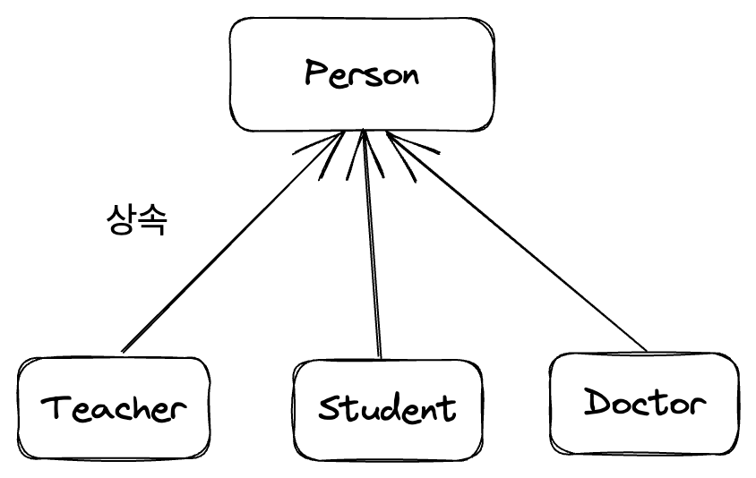

JS의 프로토타입은 면접에서도 자주 나오고, JS의 매운맛을 담당하는 존재 중 하나다. 철학적인 이야기부터, 프로토타입 체이닝과 같은 이야기까지 한번 쭉 정리해 본다.

# 1. 프로토타입의 철학

여기서는 [자바스크립트는 왜 프로토타입을 선택했을까](https://medium.com/@limsungmook/%EC%9E%90%EB%B0%94%EC%8A%A4%ED%81%AC%EB%A6%BD%ED%8A%B8%EB%8A%94-%EC%99%9C-%ED%94%84%EB%A1%9C%ED%86%A0%ED%83%80%EC%9E%85%EC%9D%84-%EC%84%A0%ED%83%9D%ED%96%88%EC%9D%84%EA%B9%8C-997f985adb42)라는 유명한 글을 참고하였다. 철학 부분은 예전에 철학 교양을 들은 것을 떠올려 어떻게든 이해한 대로 쓴다.

## 1.1. 개요

[객체는 연관된 데이터(프로퍼티)와 함수들의 집합](https://developer.mozilla.org/ko/docs/Learn/JavaScript/Objects/Basics#%EA%B0%9D%EC%B2%B4_%EA%B8%B0%EB%B3%B8)이다.

완전히 같지는 않지만 이런 비슷한 특성을 갖는 구조들이 다른 언어에도 꽤 있다. 내부적으로 해시 테이블로 구현되어 있는 건 아니지만 연관 데이터는 Python의 딕셔너리나 C++의 map을 떠올리게 하고 내부 속성이나 함수를 갖는 것은 C의 구조체, 혹은 상속까지 따진다면 여러 다른 언어에 있는 class 문법을 떠올리게 한다.

하지만 JS 객체는 이중 어떤 것과도 다르다. 어떤 속성이 들어갈지만 정할 수 있는 클래스나 구조체와 달리 JS 객체는 모든 내부 속성이 구체적으로 정의되어 있다. 또한 단순히 연관 데이터를 저장하는 자료구조들과 달리 메서드를 가지며 상속도 할 수 있다.

```js
// JS 객체의 예시
let obj={
  // 구체적인 연관 데이터를 가진다.
  name:"witch",
  age:25,
  // 그리고 메서드도 가진다!
  sayHi:function(){
    console.log("안녕하세요. 마녀입니다.");
  }
}
```

JS가 더러운 언어라고 불리는 이유는 너무나도 많겠지만 이러한 프로토타입 시스템도 한몫을 할 것이다. 왜 이런 짓을 했을까?

## 1.2. 클래스의 철학

사람들에게 사과를 그려 보라고 하면 많은 사람들이 빨갛고 둥근 모양에 윗부분이 움푹 들어가 꼭지가 달린 형태의 사과를 그릴 것이다. 사람들이 생각하는 사과는 대부분 이런 모양이다.


하지만 실제 사과는 다양하다. 빨갛지 않고 초록색인 사과도 있고, 둥글지 않은 사과도 있고, 꼭지가 없는 사과도 있다. 하지만 우리는 그런 사과들을 보고 모두 사과라고 분류한다. 우리가 생각하는 어떤 이상적인 사과를 생각하며 그것과의 적당한 비교로 사과인지 판단하는 것이다.

서양철학의 근본이라고 여겨지는 플라톤의 이데아론은 이런 생각에서 기인한다. 현실의 모든 것은 그것들이 갖는 이상적 형태인 이데아의 복제본이라는 것이다.

사람들이 생각하는 이상적인 사과와 같은 모양을 갖는 사과가 어디에도 없듯이 이데아는 현실에는 존재하지 않으며 물질적인 세계보다 더 높은 차원의 세계에 속한다고 한다.

이런 것을 구현한 것이 바로 클래스다. 클래스는 실제 메모리 상에 존재하지 않는다(전반적인 언어의 철학에 대해 얘기하고 있으므로 정적 변수에 대해서는 넘어가자). `new` 키워드나 생성자 호출을 통해 인스턴스를 만들어야만 클래스의 복제본이 메모리를 차지하게 된다.

다음 예시는 C++로 작성된 코드 예시다.

```cpp
// 이 Apple 클래스는 실제 메모리 할당을 받지 않는다. 이데아로 존재할 뿐..
class Apple{
  public:
    string name;
    Person(string name){
      this->name=name;
    }
};

int main(){
  // 클래스(이데아)의 복제본인 인스턴스가 메모리를 할당받는다(이데아의 복제본만이 실제 세계에 존재한다).
  Apple a=Apple("홍옥");
  Apple *a1=new Apple("아오리");
  return 0;
}
```

클래스를 기반으로 하는 객체 지향 언어들의 설계 방식도 이에 기초한다. 필요한 어떤 대상들이 있으면 그것들에 공통된 속성을 뽑아내서 일반화된 대상인 클래스를 만든다. 그리고 좀더 특수한 대상이 필요하면 상속을 통해 더 구체적인 추상적 대상(클래스)을 만든다.

만약 사람들의 정보를 저장하는 프로그램을 만든다면 다루는 대상 중엔 철수도 있고 영희도 있겠지만 이들은 모두 사람이다. 따라서 그들을 모두 일반화한 사람이라는 클래스를 만들고 이 인스턴스로 철수와 영희를 만드는 것이다. 유사한 객체들의 일반화를 통해 어떤 이상적인 대상을 만드는 거라고 할 수 있다.



## 1.3. 프로토타입의 철학

하지만 모든 대상에 대해서 일반화한 어떤 이데아가 있으며 각각의 개념과 대상들이 그 이데아의 복사본으로 분류될 수 있다는 주장에는 문제가 있다. 그런 관점으로 정의하기 어려운 개념이 있다는 반박을 비트겐슈타인이 해낸다. 비트겐슈타인은 게임을 예시로 들었다고 한다.

이렇게 세상에 미리 내재되어 있어서 대상을 완전히 규정할 수 있는 무언가는 존재하지 않으며 모든 의미는 맥락 속에서 의미를 갖는다는 것이 비트겐슈타인의 주장이다.

그럼 우리는 어떻게 사물에 대한 판단을 내리고 분류할 수 있을까? 비트겐슈타인은 이를 가족 유사성이라는 것을 통해 분류한다고 주장했고, Rosch라는 철학자가 이를 확장하여 prototype theory를 만들었다. 

어떤 개념에 해당하는 여러 가지 대상들이 있을 때 이들을 가장 전형적으로 나타내는 대상이 프로토타입이며 이로부터 개념이 범주화된다는 것이다. 앞선 사과의 예시를 든다면, 빨갛고 둥글고 꼭지가 달린 것이 가장 전형적인 사과라고 한다면 이것과의 비교로 사과를 판단할 수 있다.

단 이 또한 맥락에 따라 달라지는데, 만약 초록 사과 농장에서 자란 사람이 있다면 그 사람은 사과의 전형에 대해서 초록색 사과를 떠올릴 수도 있는 것이다.

언뜻 보면 비슷해 보이지만 이데아론은 현실 세계에는 없는 어떤 이상적인 이데아를 생각하고 모든 대상이 그것의 복제본이라고 생각하는 반면, 프로토타입 이론은 현실에 존재하는 대상들 중 특정 개념에 대해 가장 전형적인 어떤 대상을 중심으로 삼아서 대상에 대해 판단한다.

이를 언어로 가져온 것이 바로 프로토타입 기반의 OOP 언어들이다. JS의 모태인 Self나 Kevo등 JS 외에도 이런 언어들이 있었다.

이런 언어들은 개별 객체에 메소드와 변수를 가지고 있었으며 확장은 클래스 상속이 아니라 위임의 느낌이 강했다. 또한 개별 객체 수준에서 객체를 수정하고 확장시킬 수 있었다. 

JS의 상속 방식과 프로토타입 체이닝을 생각나게 한다. 부모 객체의 메서드를 가져오는 것이 아니라, 특정 메서드의 실행을 체인을 통해 부모 객체에게 위임하는 것이기 때문이다.

분류보다는 생성된 객체들과의 유사성을 더 중요시했고 객체의 쓰임새는 맥락에 의해 평가되었다. this나 실행 컨텍스트를 생각나게 한다.

..작성 중...


# 참고

JS가 프로토타입을 선택한 이유 https://medium.com/@limsungmook/%EC%9E%90%EB%B0%94%EC%8A%A4%ED%81%AC%EB%A6%BD%ED%8A%B8%EB%8A%94-%EC%99%9C-%ED%94%84%EB%A1%9C%ED%86%A0%ED%83%80%EC%9E%85%EC%9D%84-%EC%84%A0%ED%83%9D%ED%96%88%EC%9D%84%EA%B9%8C-997f985adb42

객체지향과 JS OOP https://developer.mozilla.org/en-US/docs/Learn/JavaScript/Objects/Object-oriented_programming

트위터의 관련 스레드
https://twitter.com/senokay/status/1667745011365220352?t=8L-wpwEII35dn6KJzE6DlA&s=19

호이스팅의 의도에 대한 JS 창시자 브랜든 아이크의 트윗 https://twitter.com/BrendanEich/status/522394590301933568

객체 지향 시스템과 철학 https://black7375.tistory.com/86

소프트웨어 기술을 바이블화하면 안된다
https://subokim.wordpress.com/2023/06/11/software-is-not-bible/

객체지향과 패러다임 그리고 철학 https://black7375.tistory.com/86

https://black7375.tistory.com/6