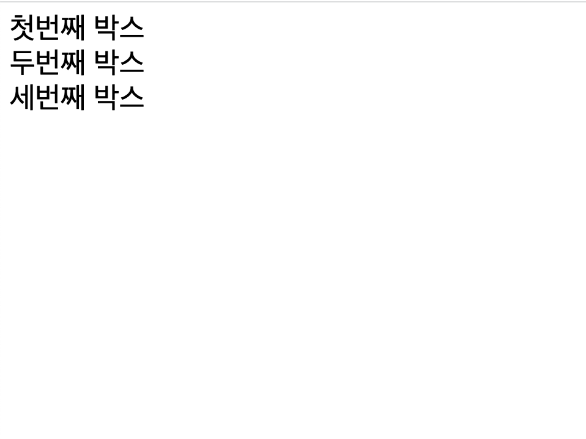
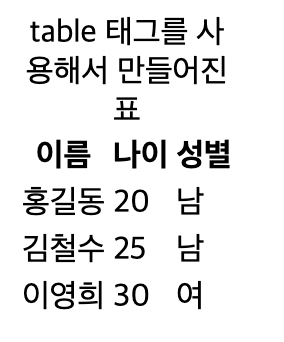
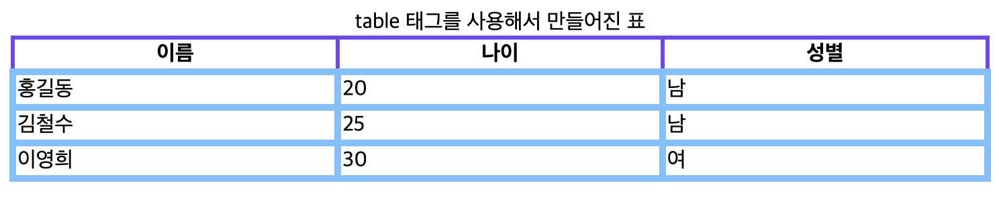
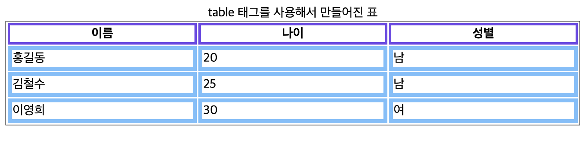
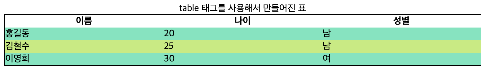

# 1. CSS 값과 단위

[참고글 링크](https://developer.mozilla.org/ko/docs/Learn/CSS/Building_blocks/Values_and_units)

CSS의 모든 속성에는 허용되는 값이 있다. 이런 값은 색, 크기 등이 있는데 이런 값의 이름은 흔히 `<color>`와 같이 꺽쇠로 묶여서 표현된다. CSS 속성과 구별하기 위해서이다.

자주 접할 수 있는 몇 가지 유형의 값을 알아보자.

숫자, 길이, 백분율 값들이 CSS에서 가장 골치를 썩인다.

`<integer>`는 정수를 나타내고, `<number>`는 이를 확장하여 10진수 실수까지 포괄한다. `<dimension>`은 number에 단위가 붙어 있는, `10px`와 같은 것이다. 그리고 `<percentage>`는 부모 요소의 길이 등 어떤 다른 값을 기준으로 하는 백분율을 나타낸다.

길이는 절대 단위와 상대 단위로 나뉘는데, 절대 단위는 cm, mm, in 등 항상 동일한 크기로 간주된다. 이런 값들은 인쇄에 사용될 때 유용하며 보통은 px만 사용한다.

상대 길이 단위는 상위 요소의 글꼴 크기 등 페이지의 다른 요소와 관련이 있다. em, rem, vw, vh 등이 있다.

## 1.1. em, rem

em과 rem은 가장 많이 쓰이는 2개의 상대 길이이다. 두 개의 차이는 어떤 요소의 글꼴 크기를 기준으로 하느냐이다.

em 단위는 부모 요소의 글꼴 크기를 가져온다. 그리고 rem 단위는 루트 요소의 글꼴 크기를 가져온다. 루트 요소는 보통 html 요소이다.

따라서 다음과 같은 html을 작성하고 rem과 em을 사용해보자.

```html
<div class="box">
  첫번째 박스
  <div class="box">
    두번째 박스
    <div class="box">세번째 박스</div>
  </div>
</div>
```

```css
.box {
  font-size: 1.5em;
}
```

그러면 각각의 중첩된 박스에서 부모의 글꼴 크기를 가져와서 그 1.5배로 글꼴 크기를 설정하므로 박스가 중첩되므로 글꼴이 점점 커진다.


rem은 루트 요소의 글꼴 크기를 가져오므로 다음과 같이 설정하면 모든 박스의 글꼴 크기가 html 요소의 글꼴 크기의 1.5배가 된다.

```css
.box {
  font-size: 1.5rem;
}
```



따라서 html 요소의 글꼴 크기를 변경할 시 모든 rem의 기준이 변한다.

## 1.2. 백분율

백분율은 당연히 그 의미상 다른 값에 상대적으로 설정된다. 이는 부모 요소의 같은 값에 대응한다. 예를 들어, 부모 요소의 너비가 100px이고 자식 요소의 너비가 50%라면 자식 요소의 너비는 50px이 된다.

width 등의 여러 값에서 길이, 백분율 둘 다 쓸 수 있다. 그런데 길이만 허용하는 때도 있는데 이럴 경우 속성이 허용하는 값에 `<length>`만 적혀 있다.

## 1.3. 숫자

opacity 등의 속성의 경우 단위 없이 숫자만 허용한다.

# 2. 항목 크기 조정

[CSS에서 항목 크기 조정](https://developer.mozilla.org/ko/docs/Learn/CSS/Building_blocks/Sizing_items_in_CSS)

CSS에서의 사물의 여러 크기에 대해 알아보자. 먼저 HTML 요소는 CSS로 크기를 설정하기 이전에도 고유한 크기를 가진다. 예를 들어서 img 태그에 이미지를 삽입 시 이미지의 원래 크기만큼의 크기를 가질 것이다.

그러나 우리는 width, height로 요소의 크기를 따로 설정해 줄 수도 있다.

마진과 패딩을 백분율로 설정할 수 있다. 예를 들어서 `margin: 10%`라고 설정하면 부모 요소의 너비의 10%만큼의 마진이 설정된다. 그런데 이때 백분율은 인라인 크기를 기준으로 계산된다. 따라서 `margin-top:10%`가 부모 요소의 높이를 기준으로 계산되지 않는 것이다. 늘 부모 요소의 너비를 기준으로 계산된다.

min-height, max-height, max-width, max-height 등의 속성으로 요소의 최소, 최대 크기를 설정할 수 있다.

각각 뷰포트 너비의 1%, 높이의 1%를 나타내는 vw, vh도 사용할 수 있다.

# 3. 이미지, 미디어, 양식 요소

이미지 등의 미디어 요소들은 CSS를 사용해서 스타일을 지정할 수 있다.

이미지나 비디오는 iframe과 같이 대체 요소로서, CSS는 이미지 요소의 내부 레이아웃에 영향을 주지 않으며 특수한 CSS 속성으로 제어해야 한다.

## 3.1. object-fit

대체 요소의 콘텐츠 크기를 요소에 맞추는 방식을 지정한다. 다음과 같은 종류들이 있다.

```css
object-fit: contain;
```

콘텐츠의 가로세로비를 유지하면서 부모 요소의 크기에 맞춘다. 요소와 가로세로비가 다르면 빈 공간이 생기게 된다. 즉 요소의 크기에 맞추는 것이 아니라 콘텐츠의 크기에 맞추는 것이다.

```css
object-fit: cover;
```

콘텐츠의 가로세로비를 유지하면서 부모 요소의 크기에 맞춘다. cover같은 경우에는 요소의 크기만큼 콘텐츠를 늘려서 맞추는 것이다.

```css
object-fit: fill;
```

요소 박스 크기에 맞게 콘텐츠를 조절한다. 가로세로비를 맞추지 않으면 콘텐츠가 늘어난다.

```css
object-fit: none;
```

대체 콘텐츠 크기를 조절하지 않는다.

```css
object-fit: scale-down;
```

none, contain 중 컨텐츠 크기가 더 작아지는 값을 택한다.

## 3.2. form

form에는 여러 가지 요소가 쓰이는데 일단 입력 요소들이 있다. input과 textarea와 같은 요소는 다른 박스처럼 동작하고 스타일링하기 쉽다. 이때 속성 선택자를 이용해서 input의 type별로 다른 스타일을 적용할 수 있다.

```css
input[type="text"] {
  background-color: #f0f0f0;
}

input[type="submit"]{
  background-color: #333;
}
```

그리고 몇몇 브라우저에선 양식 요소가 기본적으로 글꼴을 상속하지 않는다. 따라서 양식 요소에 글꼴을 상속하도록 CSS에 추가해 줘야 할 때가 있다.

```css
button,
input,
select,
textarea {
  font-family : inherit;
  font-size : 100%;
}
```

# 4. 표 스타일링 CSS 정보

앞에서 HTML로 표를 만드는 방법에 대해서 배웠었다. table, caption, tr, th, td, thead, tbody 등의 태그를 사용한다.

```html
<table>
  <caption>
    table 태그를 사용해서 만들어진 표
  </caption>
  <thead>
    <tr>
      <th scope="col">이름</th>
      <th scope="col">나이</th>
      <th scope="col">성별</th>
    </tr>
  </thead>
  <tbody>
    <tr>
      <td>홍길동</td>
      <td>20</td>
      <td>남</td>
    </tr>
    <tr>
      <td>김철수</td>
      <td>25</td>
      <td>남</td>
    </tr>
    <tr>
      <td>이영희</td>
      <td>30</td>
      <td>여</td>
    </tr>
  </tbody>
</table>
```

이를 브라우저에 렌더링하면 다음과 같이 표시된다.



표를 위한 표준 태그들을 사용했기 때문에 시맨틱하게 짜여졌고 접근성도 좋다. 하지만 실제로 렌더링된 표는 읽기 힘들고 볼품없다. 이를 CSS를 써서 꾸밀 수 있다.

CSS 파일을 만들고 link 태그를 이용해서 HTML 파일과 연결하자.

```html
<link href="index.css" rel="stylesheet" type="text/css" />
```

그리고 우리가 바꿀 몇 가지 CSS 속성들을 알아보자.

## 4.1. table-layout

테이블 각 셀의 너비를 어떻게 결정할지를 지정한다. auto와 fixed로 지정할 수 있다.

auto로 지정할 시 브라우저에 테이블 레이아웃 지정을 맡긴다. 이 경우 테이블과 각 셀의 너비는 셀에 담겨 있는 내용들에 fit하게 결정된다.

fixed로 지정할 시 table, col 요소의 width 속성을 통해 표와 각 열의 너비를 지정한다. 이렇게 fixed 레이아웃 하에서 셀 너비를 지정할 시 그대로 지정된다. 그런 너비가 없다면 첫 행에 있는 셀들의 너비로 표와 각 열의 너비를 결정한다.

fixed를 사용할 경우 auto보다 렌더링을 더 빠르게 할 수 있다. 표의 첫 행만 브라우저가 인식하고 나면 전체 표를 바로 렌더링할 수 있기 때문이다. 이렇 첫 행의 셀들의 너비로 열의 너비를 결정하면 아래 행에 있는 셀들에서는 내용이 넘칠 수 있다. 이는 이전에 배운 overflow로 제어한다.

## 4.2. border-collapse

표 테두리가 겹칠 때 어떻게 처리할지에 관한 속성이다.

collapse로 지정할 시 테두리가 겹치는 부분을 하나로 합쳐서 처리한다. 이 경우 테두리의 두께는 가장 두꺼운 테두리의 두께로 결정된다.

다음과 같이 CSS를 지정해 보자.

```css
table{
  table-layout: fixed;
  width:100%;
  border-collapse: collapse;
  border: 1px solid #000;
}


th{
  border: 3px solid #7048e8;
}

td{
  border: 5px solid #74c0fc;
}
```

그러면 다음과 같이 겹치는 테두리 두께는 가장 두꺼운 두께로 결정되는 것을 볼 수 있다. 또한 더 두꺼운 두께의 테두리가 더 우선적으로 표시되는 걸 볼 수 있다.



separate로 지정할 시 테두리가 겹치는 부분을 각각 처리한다. 이 경우 모든 테두리는 분리되어 표시되며 테두리간 간격은 `border-spacing`에 지정된 값으로 처리된다. 내 브라우저에서 기본값은 2px로 설정되어 있었다.

위의 CSS에서 border-collapse만 separate로 설정해서 표를 렌더링하면 다음과 같아진다.



## 4.3. font-family

글꼴을 지정한다. 값은 `,`로 구분되어 대체될 수 있음을 나타낸다. 브라우저는 이렇게 구분된 글꼴들을 앞에서부터 보면서 컴퓨터에 설치되어 있거나 `@font-face`로 다운받을 수 있는 폰트 중 가장 첫번째 폰트를 선택해서 사용한다.

이때 지정한 폰트가 모두 있다는 것을 보장할 수 없기 때문에 마지막에는 반드시 `sans-serif`나 `serif`와 같은 generic family를 지정해야 한다.

이런 generic family는 serif, sans-serif, cursive, monospace, fantasy, system-ui가 있다.

## 4.4. nth-child를 이용한 스타일링

nth-child를 이용하면 특정 행이나 열에 스타일을 적용할 수 있다. 각 행에서 두 가지 색깔이 번갈아가며 나타나게 해보자.

```css
tbody tr:nth-child(odd) {
  background-color: #63e6be;
}

tbody tr:nth-child(even) {
  background-color: #c0eb75;
}
```

odd, even 키워드를 선택하여 홀수번째, 짝수번째 자식을 선택할 수 있다.



## 4.5. caption-side

caption 요소의 위치를 지정한다. top과 bottom이 있다. 만약 bottom으로 지정하면 캡션이 표의 아래에 표시된다.

```css
caption{
  caption-side:bottom;
}
```


그리고 이 속성은 표의 writing-mode 즉 논리적인 위치를 기준으로 한다. 따라서 논리적인 위/아래 값도 사용할 수 있다.

```css
caption-side: block-start;
caption-side: block-end;
caption-side: inline-start;
caption-side: inline-end;
```

## 4.6. 표 스타일링할 때 요점

- table-layout:fixed를 써서 레이아웃을 예측 가능하게 한다.
- border-collapse를 써서 테두리가 겹치는 부분을 처리한다.
- text-align으로 텍스트를 적절한 방향으로 정렬.