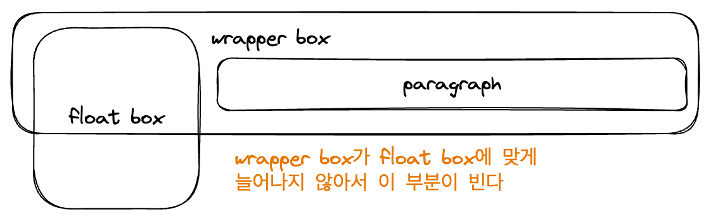

# 1. floats

floats는 원래 페이지의 레이아웃을 잡는 데에 가장 널리 사용되는 도구 중 하나였다. 하지만 flex, grid가 나오면서 원래 floats의 목적인 텍스트 블록 내의 부유하는 이미지를 위해 쓰이게 되었다.

float는 원래 신문 기사에 삽입된 사진처럼, 텍스트 문단 내부에 부유하는 이미지를 포함하고 텍스트가 그 이미지를 둘러싸게 하는 레이아웃을 구현하기 위해 도입되었다. 이러한 float의 원래 용도에 대해 알아보자.

```css
float:left;
```

위와 같이 요소를 설정하면 해당 요소는 기존의 컴포넌트 배치 흐름에서 벗어나서 부모 컨테이너의 왼쪽에 고정되게 된다. 그리고 부모 컨테이너 내의 HTML 상에서 그 아래에 오는 모든 내용은 float한 요소 주변을 감싸게 된다.

그런데 float된 요소 주변에 특정 요소까지만 감싸게 하고 싶다면 어떻게 해야 할까? 그럴 때는 clear를 사용하면 된다.

```css
clear: left;
```

위와 같은 CSS 속성을 설정하면 왼쪽에 float된 요소들을 더 이상 감싸지 않고 새 줄에서 시작하게 된다. 비슷한 원리로 right, both를 사용하면 각각 오른쪽, 양쪽에 float된 요소들을 더 이상 감싸지 않게 된다.

## 1.1. float의 문제 해결

다음과 같은 상황을 생각해 보자. 하나의 wrapper 박스 안에 커다란 박스가 있고 이것이 float처리되어 일반 대열에서 벗어나 있다. 그리고 wrapper 박스 안에는 작은 문단이 들어가 있다. 그리고 wrapper 박스에 배경색을 넣는다고 생각해 보자.

이때 wrapper 박스는 내부에 있는 컨텐츠 크기만큼 늘어나게 되는데 문제는 float 처리된 박스가 일반 흐름에서 벗어나기 때문에 wrapper 박스가 float 처리된 박스를 감싸지 않는다는 것이다. 그래서 wrapper 박스의 배경색이 float 처리된 박스 아래로 내려가지 않는다.



wrapper 박스가 float 박스의 크기를 고려하지 않는 이런 문제를 어떻게 해결할 수 있을까?

이를 해결하는 방법 하나는 wrapper 박스 이후에 div 클래스를 하나 추가하고 clear: both; 속성을 추가해 주는 것이다. `::after` 선택자를 사용해서 이를 구현할 수 있다.

```css
.wrapper::after {
  content: "";
  display: block;
  clear: both;
}
```

이 방식을 clearfix hack이라고 한다. 항목 아래에 빈 블록 요소를 추가한 후 해당 요소 이후로 float가 적용되지 않도록 하는 것이다. 이렇게 하면 wrapper 박스가 float 요소까지 고려해서 늘어나게 된다.

wrapper 클래스에 `overflow:auto`를 설정하는 것도 방법이다. 이러면 wrapper 박스 내부에 작은 레이아웃이 생기고 여기에는 float 요소까지 포함되어 있게 된다. 따라서 wrapper 박스가 float 요소까지 고려해서 늘어나게 된다.

현대적인 방식도 있는데 이는 `display:flow-root`를 wrapper 박스에 설정하는 것이다. 이러면 wrapper 박스를 요소 흐름의 루트로 만들어서, wrapper 내부에 작은 레이아웃(블록 서식)을 생성하게 된다. 

`overflow:auto`를 한 것과 같은 효과로 인해 wrapper 박스가 float요소까지 고려해서 늘어나게 된다.

# 2. position 속성

갖가지 땔감 코딩들을 하면서 너무 많이 맞닥뜨려서 [이전 글](https://witch.work/mdn-css-8/#14-position-%EC%86%8D%EC%84%B1-%EA%B0%9C%EC%9A%94)의 내용으로 충분하다.~~그것이 나유타 분의 1이라 할지라도, 내게는 넘치도록 충분하다!~~

# 3. 다단 레이아웃

다단 레이아웃은 흔히 신문기사와 같은 여러 단 배치를 하는 기술이다. 사실 처음 다뤄본다. 하지만 그렇게 복잡한 건 없었다.

`column-count`는 숫자로 설정하는데 여기 설정한 숫자만큼 해당 요소를 단으로 나눈다.

```css
.container{
  column-count: 3;
}
```

`column-width`는 길이로 지정하며 해당 크기의 단을 최대한 많이 만든다. 만약 나머지 공간이 남으면 지금 있는 단들에게 공평하게 분배된다. 또한 지정한 단 너비가 실제 컨테이너 너비보다 작다면 컨테이너는 부족한 너비로 1단을 이룬다.

예를 들어서 `column-width`가 200px인데 컨테이너가 150px라면 150px짜리 한 단으로 컨테이너가 이뤄진다.

`column-gap`은 단 사이 간격을 지정한다. `column-rule`은 단을 구분하는 선의 스타일을 지정한다. 선의 색, 선 스타일, 선 너비의 단축 속성이라 다음과 같이 지정한다.

```css
.container{
  column-count:5;
  column-rule: 1px solid black;
}
```

## 3.1. CSS fragmentation

만약 컨텐츠가 여러 페이지나 단으로 나뉘어져 있을 경우 어떻게 표시될 것인가를 정하는 속성들이다. 필요하면 [MDN 페이지](https://developer.mozilla.org/en-US/docs/Web/CSS/CSS_Fragmentation)를 참고하자.

예를 들어서 `break-inside`는 프린트 등의 환경에서 요소가 여러 페이지에 걸쳐 있을 때 박스를 페이지에 맞게 나눌지, 아니면 요소를 나누지 않고 한 페이지에 다 표시하기 위해 새 페이지를 시작할지를 결정한다. `break-inside:avoid`를 지정할 시 요소가 여러 페이지에 걸쳐 나타나지 않게 된다.

# 4. 반응형 디자인

다양한 화면 너비, 해상도 등에 맞게 레이아웃 등이 변하는 웹페이지를 말한다. 예전에 모바일 웹이 처음 나왔을 때는 `m.naver.com`과 같이 모바일 전용 웹페이지를 만들었다. 하지만 이는 유지보수가 어렵고, 사용자 경험도 좋지 않았다. 

그래서 반응형 디자인이 등장했다. 반응형 디자인은 별도의 기술이 아니라 웹을 어떻게 접근했는지나 화면의 크기 등에 따라 반응할 수 있는 레이아웃 사례 전반을 말한다.

예를 들어서 반응형 이미지는 `<picture>`태그의 srcset, sizes 속성을 사용하여 브라우저가 화면 크기와 해상도에 따라 다운로드할 이미지를 선택하게 하는 것을 말한다.

글자 크기도 `vw`등의 단위로 설정할 수 있다. 그러나 vw단위만 사용하면 사용자가 텍스트 집합을 확대/축소하지 못하게 된다. 따라서 대안으로 `calc()`를 사용하여 고정 크기와 `vw`단위를 함께 사용할 수 있다.

```css
p{
  font-size: calc(16px + 0.5vw);
}
```

## 4.1. 뷰포트 메타태그

모바일 브라우저는 뷰포트 너비를 제대로 알리지 않는 경우가 있다. 따라서 다음과 같은 메타태그를 사용하여 뷰포트 너비를 장치 너비로 설정하여 문서를 100%크기로 확장해야 한다.

```html
<meta name="viewport" content="width=device-width, initial-scale=1.0">
```

이런 걸 쓰게 되는 이유는, 처음 스마트폰이 출시되었을 때 대부분 사이트가 모바일 최적화가 되지 않았기 때문이다. 따라서 모바일 브라우저는 뷰포트 너비를 일부러 960px로 지정하곤 했다. 하지만 요즘은 대부분의 사이트가 모바일 최적화가 되어있기 때문에 이런 설정을 항상 해야 한다.

## 4.2. 미디어 쿼리

미디어 쿼리는 브라우저나 장치 환경에 따라 다른 CSS를 제공할 수 있도록 해준다. 기본형은 다음과 같다.

```css
@media 미디어타입 and (미디어 피쳐){
  /* 조건이 만족되었을 때 적용할 CSS */
}
```

미디어 유형은 all, print, screen이 있다. 

### 4.2.1. 높이와 너비

널리 쓰이는 미디어 피쳐는 높이와 너비에 관한 것이다. 예를 들어 `min-width`는 최소 너비를 지정하는데, 이는 뷰포트 너비가 지정한 너비보다 크거나 같을 때 적용된다.

```css
@media screen and (min-width:768px){
  /* 화면으로 보고 있으며 뷰포트 너비가 768px 이상일 때 적용할 CSS */
}
```

`max-width`등도 적용 가능하다. 또한 `width`만 사용하면 브라우저가 특정 너비일 때만 적용되는 CSS를 만들 수 있는데 자주 쓰이지는 않는다.

### 4.2.2. 장치 방향

장치가 세로 방향인지 가로 방향인지 판단하는 orientation이라는 미디어 피쳐도 있다. 이는 `portrait`와 `landscape`로 나뉜다. portrait는 세로 방향, landscape는 가로 방향을 의미한다.

```css
@media screen and (orientation:portrait){
  /* 장치가 세로 방향일 때 적용할 CSS */
}
```

흔히 데스크톱은 가로 방향이고 휴대폰이 세로 방향의 장치이다.

### 4.2.3. 포인팅 장치

포인팅 장치는 마우스, 터치 등을 의미한다. 이는 `pointer`와 `hover`로 나뉜다. pointer는 마우스를 의미하고 hover는 마우스를 올렸을 때를 의미한다.

터치스크린과 같은 장치에서는 요소에 포인터를 올릴 수 없다. 따라서 요소에 hover가 가능한 경우에만 적용되는 CSS를 만들고 싶다면 다음과 같이 한다.

```css
@media (hover:hover){
  /* 요소에 마우스를 올릴 수 있을 때 적용할 CSS */
}
```

pointer는 사용자의 포인팅 장치를 의미한다. none, fine, coarse 3가지 값을 취할 수 있다. fine은 사용자가 마우스 혹은 트랙패드를 사용할 경우이다. 그리고 coarse는 터치스크린 상의 손가락을 의미하고 none은 키보드 등으로 조작하는 사용자라 포인팅 장치가 없다는 것을 의미한다.

사용자가 터치스크린을 사용할 경우 버튼을 더 크게 만드는 등에 사용 가능하다.

### 4.2.4. 미디어 쿼리의 논리

and를 통해 쿼리를 논리곱으로 적용할 수 있다. 또한 not을 통해 쿼리를 부정할 수 있다. not을 쓸 경우 전체 미디어 쿼리가 부정된다. 다음과 같이 쓰면 보기 방향이 가로일 경우에만 css가 적용된다.

```css
@media not all and (orientation:portrait){
  /* 장치가 세로 방향일 때 적용할 CSS */
}
```

논리합의 경우 `or`같은 게 아니라 쉼표를 써서 적용한다.

## 4.3. 반응형 디자인 접근방식

반응형 디자인을 할 때는 가장 넓은 뷰에서 시작해서 작아지는 뷰포트에 맞게 디자인할 수도 있고 반대로 가장 작은 뷰로 시작해서 뷰포트가 커짐에 따라 레이아웃을 추가할 수도 있다. 후자는 mobile-first로 불리며 더 많이 쓰인다. tailwind등의 많은 라이브러리에서도 후자를 권장한다.

물론 미디어 쿼리를 쓰지 않는 방식도 가능하다. 예를 들어서 다음과 같이 쓸 수 있다.

```css
grid-template-columns: repeat(auto-fill, minmax(200px, 1fr));
```

이렇게 설정할 시 미디어 쿼리를 사용하지 않았지만 뷰포트 크기에 따라 열의 설정이 변한다. 또한 최소 너비도 보장된다. 이런 방식은 미디어 쿼리를 쓰지 않고도 반응형 디자인을 할 수 있게 해준다.

또한 다단 레이아웃의 `column-width`등도 뷰포트 너비에 맞게 단을 생성하도록 하여 반응형 디자인에 쓸 수 있다.

# 5. 브라우저 지원

흔히 레이아웃을 위해 flex나 grid를 사용한다. 그러나 예전 브라우저의 경우 이러한 현대적인 레이아웃 메서드를 지원하지 않을 수 있다. [caniuse](https://caniuse.com/)에서 각 기능의 브라우저 지원을 확인할 수 있다.

또한 [대체 메서드](https://developer.mozilla.org/ko/docs/Learn/CSS/CSS_layout/Supporting_Older_Browsers#%EB%8C%80%EC%B2%B4_%EB%A9%94%EC%84%9C%EB%93%9C)를 사용하여 지원되지 않는 레이아웃 메서드를 대체할 수 있다. 예를 들어 grid 레이아웃 대신 float나 `display:table`, 혹은 다단 레이아웃을 사용할 수 있다.

또한 `@supports`로 사용하는 피쳐 쿼리를 사용해서 특정 기능을 지원하는 브라우저에 대해 다른 CSS를 적용하도록 할 수도 있다. 그러나 이 피쳐 쿼리도 꽤 최신 기능이기 때문에 grid를 적용할 수 없는 브라우저에서는 피쳐 쿼리도 사용할 수 없는 문제가 있다.
