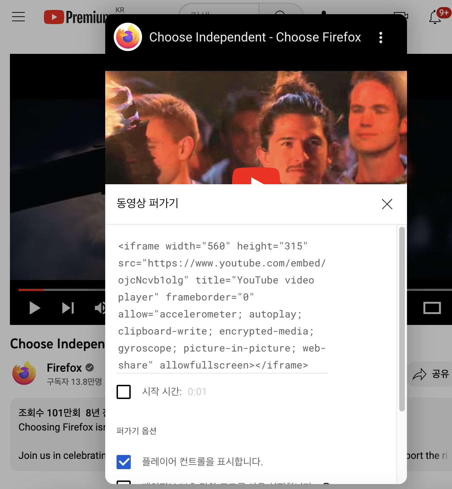

텍스트만 있는 웹사이트는 단조롭다. 물론 그것조차도 제대로 만들기 어렵기에 [motherfucking website](https://motherfuckingwebsite.com/)와 같은 곳도 생기지만, 이미지와 비디오 등이 포함된 사이트가 더 멋있어 보인다는 건 부인할 수 없다. 

이번에는 HTML에서 멀티미디어와 임베딩을 다루는 방법에 대해 알아보자.

# 1. 이미지

HTML에서 이미지를 넣기 위해서는 `img`태그를 사용한다. 이는 내부 내용이나 닫는 태그가 없지만 src 속성 하나는 사용되어야 한다. 

src 속성은 삽입할 이미지의 경로를 나타내는데, 이는 절대경로, 상대경로, 또는 URL로 표현할 수 있다. 검색 엔진은 이미지 파일 이름도 읽고 SEO에 포함시키므로 파일 이름에도 주의하자.

```html

```

## 1.1. alt 속성

img 태그의 alt 속성에 문자열을 할당해서 이미지가 로드되지 않았을 때 대체 텍스트를 넣을 수 있다. 이는 path나 파일명을 잘못 적거나 로드가 실패했을 때 표시된다.

또한 스크린 리더는 alt 속성을 읽어주므로, 이미지가 아닌 텍스트로 표현할 수 있는 경우 alt 속성을 사용하는 도움이 된다. 그리고 검색 엔진은 alt 속성을 읽어서 SEO에 포함시키므로 검색 최적화에도 도움이 된다.

Lynx와 같은 브라우저는 텍스트만 지원하므로 이런 브라우저의 사용자에게도 alt 속성이 필요하다.

따라서 alt 속성에는 이미지가 나타나지 않을 때 사용자에게 대신 제공할 수 있는 설명을 넣어주자.

## 1.2. 기타 속성

width, height 속성으로 이미지의 크기를 지정할 수 있다. 하지만 HTML 속성을 통해 이미지 크기를 지정하는 것보다는 CSS를 통해 지정하는 것이 좋다. 혹은 이미지 편집기를 쓰거나.

title 속성으로 이미지 제목을 설정할 수 있다. 그러면 이미지에 마우스 호버 시 이미지 제목이 나타난다.

## 1.3. 캡션 달기

이미지에 캡션을 달 때, div 태그로 감싼 후 div태그 내부에 img 태그와 p 태그를 넣어줄 수도 있다.

하지만 이렇게 하면 특정 이미지에 캡션을 연결해 주는 의미가 전달되지 않는다. 따라서 HTML5의 figure와 figcaption 태그를 사용할 수 있다.

이 태그는 이미지에 캡션을 다는 역할을 수행한다.

```html
<figure>
  
  <figcaption>내 프로필 사진</figcaption>
</figure>
```

이때 figure 태그내의 요소가 꼭 이미지일 필요는 없다. 동영상이나 표, 코드 등이 올 수 있다.

물론 이미지를 넣을 때 CSS의 background-image 속성 등을 사용할 수도 있다. 하지만 그렇게 하면 이미지를 사용할 수는 있어도 이미지에 어떤 의미를 페이지 자체에서 부여할 수는 없다. 이런 시맨틱을 위해서 img 태그로 이미지를 넣는 것이다.

# 2. 비디오와 오디오

비디오와 오디오도 HTML 태그를 통해서 넣을 수 있다.

## 2.1. 비디오 태그

`<video>`태그를 쓰면 동영상을 페이지에 삽입할 수 있다. 이 태그는 src 속성을 가지는데 이는 img 태그에서와 같이 넣을 동영상의 경로를 지정한다.

controls 속성을 지정하여 사용자에게 비디오 되감기, 볼륨 조절, 탐색 등의 인터페이스를 제공할 수 있다. 이를 사용하면 비디오 플레이어의 모든 컨트롤 요소가 표시된다.

```html
<video src="assets/video.mp4" controls></video>
```

controls 속성을 사용하지 않고 JS의 HTMLMediaElement API를 사용하여 컨트롤 요소를 직접 만들 수도 있다.

video 태그 안에 p 태그 등을 넣어서 비디오가 지원되지 않는 브라우저에 대비할 수도 있다. 비디오가 표시되지 않을 때 사용자에게 보여줄 일종의 fallback content를 만드는 것이다. 비디오로 가는 링크를 넣는다거나 하는 것이다.

## 2.2. 여러 소스 제공하기

브라우저에 따라서 지원하는 비디오 포맷이 다르기 때문에 우리가 제공한 source의 비디오가 재생되지 않을 수 있다. 우리는 이런 문제를 보완하기 위해 여러 소스를 제공하여 브라우저가 지원하는 포맷을 찾아 재생할 수 있도록 할 수 있다. source 태그를 쓸 수 있다.

```html
<video controls>
  <source src="assets/video.mp4" type="video/mp4">
  <source src="assets/video.webm" type="video/webm">
  <source src="assets/video.ogv" type="video/ogg">
</video>
```

지금까지는 video 태그의 src 속성에 비디오 파일의 경로를 넣었는데, 이제는 source 태그를 사용하여 여러 소스를 제공한다. 이렇게 하면 브라우저는 source 태그를 훑으면서 브라우저가 지원하는 코덱을 가진 첫 비디오를 찾아 재생한다.

이렇게 여러 소스를 제공하는 데에 쓸 수 있는 source 태그는 picture, audio, video 태그에 모두 쓸 수 있다.

그리고 source 태그에는 type 속성을 이용해서 파일의 미디어 타입(MIME 타입)을 명시할 수 있다. 이렇게 하면 브라우저가 지원하지 않는 비디오 코덱 타입을 바로 넘어가도록 할 수 있다. 

만약 type 속성을 지정하지 않으면 브라우저는 파일을 로드하고 코덱을 확인한 후 재생할 수 있는지를 판단한다. 이는 시간이 걸리기 때문에 type 속성을 명시하는 게 좋다.

## 2.3. video 기타 속성

그 외에도 width, height 태그도 있다. 이 속성을 사용하면 비디오의 크기를 지정할 수 있지만 aspect ratio는 유지된다. 만약 ratio가 다른 높이/너비를 지정한다면 비디오는 가로로 늘어나서 화면을 채울 것이고 안 채워진 부분은 기본 배경색으로 채워진다.

autoplay, loop, muted 속성도 있다. autoplay는 비디오를 자동으로 재생하고, loop는 비디오를 반복 재생하고, muted는 음소거한다.

poster 속성은 비디오가 로드되기 전에 보여줄 이미지를 지정한다. preload는 버퍼링 관련 속성이다.

## 2.4. 오디오 태그

오디오 태도 역시 비디오 태그와 비슷하다. `<audio>` 태그를 사용하면 오디오 파일을 페이지에 삽입할 수 있다.

```html
<audio controls>
  <source src="assets/audio.mp3" type="audio/mpeg">
  <source src="assets/audio.ogg" type="audio/ogg">
  <!-- 여기에 fallback content가 들어갈 수도 있다. -->
</audio>
```

오디오 태그는 보여줄 시각 컨텐츠가 없으므로 width, height 속성을 사용할 수 없다. 같은 이유로 poster 속성도 지원하지 않는다.

## 2.5. 비디오에 자막 넣기

귀가 잘 들리지 않는 사람이나 시끄러운 환경에 있는 사람, 영상의 언어를 모르는 사람 같은 경우 자막이 필요할 수 있다.

이런 사람에게 자막을 제공할 수 있다. webVTT파일과  track 태그를 사용하면 된다.

webVTT 파일은 간단히 말해서 자막 파일이다. 여러 줄의 자막 문자열과 해당 자막마다 자막을 표시할 시작 시간과 끝 시간을 지정할 수 있다. 자막 위치 등을 지정할 수도 있다.

```html
<video controls>
  <source src="assets/video.mp4" type="video/mp4">
  <source src="assets/video.webm" type="video/webm">
  <source src="assets/video.ogv" type="video/ogg">
  <track src="assets/subtitles.vtt" kind="subtitles" srclang="en" label="English">
</video>
```

track 태그의 kind 속성을 이용하여 자막의 종류를 지정할 수 있다. subtitles, captions, descriptions, chapters, metadata 등이 있다. 

자막은 subtitles, 자막은 captions, 설명은 descriptions, 단원 구분은 chapters, 메타데이터는 metadata 등이다.

이때 .vtt 파일은 track 태그를 통해 지정하는데 모든 source 태그보다 뒤에 와야 한다. 그리고 track 태그에 srclang 속성을 이용하여 자막의 언어를 지정할 수 있고 label 속성을 이용하여 사람들이 자막의 언어가 어떤 것일지 알 수 있도록 할 수 있다.

# 3. 기타 임베딩 기술

audio, video 태그 외에도 iframe, embed, object 태그를 이용해서도 페이지에 다른 콘텐츠를 넣을 수 있다.

## 3.1. 간략한 역사

예전에는 웹사이트의 작은 부분을 frame이라 하고, 메인이 되는 문서인 frameset이라는 문서에 frame을 넣어서 만들었다. 즉 페이지를 frame들의 집합으로 보았던 것이다.

그리고 90년대 후반 Flash의 등장으로 영상, 애니메이션 같은 여러 콘텐츠를 웹에 삽입할 수 있게 되었다. 액션스크립트를 통해서 동영상을 제어할 수 있고, 애니메이션을 훨씬 더 적은 용량으로 만들 수 있게 한 플래시는 2000년대를 풍미했다. object, embed 요소 등을 이용해서 같은 작업을 할 수 있었지만 별로 쓰이지 않았다.

그러다 플래시가 여러 문제들로 인해 인기가 사그라들고 HTML5가 등장하면서 iframe, embed, object 태그를 이용해서 웹 페이지에 다른 콘텐츠를 넣을 수 있게 되었다.

## 3.2. iframe

iframe 태그는 다른 HTML 페이지를 현재 페이지 안에 삽입할 수 있게 해준다. iframe 태그의 src 속성을 이용해서 다른 웹 페이지를 지정할 수 있다.

유튜브에서 공유-퍼가기를 선택하면 그 동영상에 해당하는 iframe 태그를 복사할 수 있다.

```html
<iframe width="560" height="315" src="https://www.youtube.com/embed/b7Pt4hHGi2I" title="YouTube video player" frameborder="0" allow="accelerometer; autoplay; clipboard-write; encrypted-media; gyroscope; picture-in-picture; web-share" allowfullscreen></iframe>
```

이렇게 삽입된 다른 페이지는 각자 자신의 History를 가지고 있다. 뒤로가기 버튼을 눌렀을 때 현재 페이지가 아니라 삽입된 페이지의 이전 페이지로 이동한다. 그리고 아예 다른 문서로 관리되므로 페이지에 iframe을 추가할 때마다 자원을 더 사용하게 된다.

iframe에는 width, height, src, allowfullscreen속성이 주로 쓰인다. width, height, src속성은 당연히 각각 크기와 삽입할 페이지를 지정한다. 

이때 src 속성의 경우, 속도 향상을 위해서는 메인 페이지 로딩 이후 JS를 통해 지정하는 것이 좋다. 페이지 로딩 시간을 더 줄여 준다.

allowfullscreen속성은 Fullscreen API를 사용하여 iframe에 삽입된 페이지가 전체화면으로 보이게 할 수 있는지를 지정한다.

또한 iframe 태그 사이에 삽입된 내용은 iframe 태그가 지원하지 않는 브라우저에서 fallback으로 보여진다.

## 3.3. iframe 보안 문제

다음과 같이 iframe 태그로 내 페이지에 네이버 페이지를 삽입하려고 했다.

```html
<iframe
  src="https://www.naver.com/"
  width="100%"
  height="500"
  allowfullscreen
>
</iframe>
```

그런데 이렇게 하면 네이버 페이지가 제대로 로딩되지 않는다.


이는 iframe이 해커들의 공격 벡터가 될 수 있기 때문이다. 해커들은 iframe을 이용하여 특정 페이지를 악의적으로 수정하거나 민감한 정보를 유출하기를 시도할 수 있다.

HTML 인젝션 중에서도 iframe 인젝션이라고 하는 공격이 있다. 페이지 내에 iframe 태그를 삽입하고 사이즈를 0으로 설정하여 숨기는 것이다. 따라서 사용자는 iframe이 삽입되었다는 것을 시각적으로 알 수 없고 의도치 않게 악성 페이지를 로드하게 된다. 

그리고 유명한 페이지의 경우 많은 사람들이 임베드하고 싶어할 것이므로 이를 모두 허용하면 서버비가 더 많이 들 것이다.

따라서 필요한 경우에만 삽입하고, 저작권에 주의하자.

그 외에 해야 할 것들은 HTTPS 사용하기가 있고 좀더 자세히 살펴볼 만한 것은 다음과 같다.

### 3.3.1. sandbox 특성 사용하기

iframe에는 sandbox 특성이 있다. 이는 삽입된 콘텐츠에 대해 필요한 작업만 허용하도록 할 수 있다.

sandbox 특성이 없는 콘텐츠는 JS를 실행하거나 새 창을 띄우는 등의 작업을 할 수 있기 때문에 악의적 공격 가능성이 늘어난다.

sandbox 특성은 문자열인데 이는 콘텐츠가 허용하는 작업을 지정한다. 만약 `sandbox=""`로 지정되어 있다면 모든 작업이 허용되지 않는다. 

예를 들어서 allow-modals를 sandbox 문자열에 추가한다면 iframe으로 삽입한 페이지에서 모달 창을 띄울 수 있게 된다. 이외에도 띄어쓰기를 통해서 여러 작업을 iframe sandbox 속성을 통해 허용할 수 있다.

단 주의할 점은 allow-scripts와 allow-same-origin 옵션을 sandbox에 동시에 적용할 시 iframe 콘텐츠는 same origin policy를 우회하여 sandbox 특성을 해제하는 JS를 실행할 수 있게 된다. 따라서 이 두 옵션은 동시에 적용하지 않는 것이 좋다.

### 3.3.2. CSP 지시어 설정

CSP는 XSS 공격과 같은 보안 위협으로부터 페이지를 보호하기 위한 추가적인 보안 계층이다. 이는 HTML 문서 보안을 개선하기 위해 고안된 HTTP 헤더를 제공한다.

iframe의 보안 문제 해결을 위해서는 CSP 설정을 통해 X-Frame-Options 헤더를 전송하도록 설정 가능하다. 이 헤더는 해당 페이지를 iframe으로 삽입할 수 있는지를 지정한다. 

만약 deny로 설정할 시 같은 사이트 내에서의 frame 접근도 막는다. sameorigin으로 설정할 시 같은 사이트 내에서만 frame 접근이 가능하다. 이런 식으로 적절한 X-Frame-Options 헤더를 설정하면 iframe 보안 문제를 어느 정도 해결 가능하다.

```
X-Frame-Options: deny
X-Frame-Options: sameorigin
X-Frame-Options: allow-from https://example.com/
```

이러한 CSP 설정은 meta 요소를 통해서도 할 수 있지만 웹서버를 구성할 때 하는 것이 좋다. 특히 위에서 다룬 X-Frame-Options 헤더의 경우 meta 태그를 통해서 CSP 정책을 구성할 수 없다.

만약 nginx라면 http, server, location 설정에 아래 설정을 추가하는 식이다.

```
add_header X-Frame-Options sameorigin;
```

## 3.4. embed, object

iframe은 다른 HTML페이지를 페이지 내에 삽입하는 기능을 했다. embed, object는 PDF와 같은 외부 콘텐츠를 페이지에 포함하기 위한 기능을 한다. 단 이 요소들을 사용하는 경우가 많지는 않다. 플러그인 콘텐츠를 삽입하기 위해 사용되는 경우가 있다.

```html
<embed src="./dummy.pdf" type="application/pdf" width="100" height="200" />
<object data="./dummy.pdf" type="application/pdf" width="100" height="200">
  <p>대체 텍스트</p>
</object>
```

object 태그가 일반적으로 페이지에 무언가를 삽입할 때 더 많이 쓰인다. 또한 embed는 대체 콘텐츠를 넣을 방법이 없지만 object는 태그 사이에 대체 콘텐츠를 넣는 방식으로 대체 콘텐츠도 지원한다.

단 embed 태그만 지원되는 낡은 브라우저도 있으므로 만약 정말 모든 브라우저에 대응해야 한다면 두 태그를 모두 사용해야 한다.

```html
<object type="application/pdf"
    data="/media/examples/In-CC0.pdf"
    >
    <embed type="application/pdf"
    src="/media/examples/In-CC0.pdf">
</object>
```

# 4. 벡터 그래픽

웹에서 쓰이는 2가지 이미지는 픽셀들의 격자 구조로 정의되는 래스터 이미지와, 이미지가 어떻게 보이고 렌더링될지가 정의된 모양과 경로 정의가 들어 있는 벡터 이미지가 있다. 

벡터 이미지는 알고리즘을 통해 렌더링되기 때문에 크기가 커져도 똑같이 보인다. 그리고 픽셀들을 하나하나 저장하는 대신 알고리즘들만 저장하면 되기 때문에 더 용량이 작다.

## 4.1. SVG

[SVG](https://developer.mozilla.org/ko/docs/Web/SVG)는 Scalable Vector Graphics의 약자로 2차원 벡터 그래픽을 XML로 서술하는 언어이다.

텍스트를 HTML로 기술하듯이 그래픽을 SVG로 기술하는 것이다. `<circle>` 태그를 통해 원을 그리고 `<rect>` 태그를 통해 사각형을 그리는 등이다. 여기에도 여러 태그들이 있는데 이를 이용하면 다양한 그래픽을 그릴 수 있다. [SVG에 관한 더 많은 정보](https://developer.mozilla.org/en-US/docs/Web/SVG)는 여기서 얻자.

```html
<svg width="100%" height="100%">
  <rect width="100%" height="100%" fill="black" />
  <circle cx="150" cy="100" r="90" fill="red" />
</svg>
```

간단한 SVG는 위와 같이 직접 만들 수 있지만 복잡한 그래픽을 그리려면 SVG를 직접 구성하는 건 매우 어렵다. 그럴 땐 [Inkscape](https://inkscape.org/ko/)와 같은 프로그램을 이용해야 한다.

그러나 SVG는 쉽게 복잡해지기 때문에 파일 크기가 커질 수 있고 만들기 어렵다는 단점도 있다. 사진과 같은 복잡한 이미지의 경우 래스터 이미지를 쓰는 게 낫다.

## 4.2. SVG를 페이지에 넣기

SVG를 페이지에 넣는 방법은 여러 가지가 있다.

### 4.2.1. img 태그 이용

img 태그의 src 속성에 svg파일을 넣음으로써 페이지에 SVG를 넣을 수 있다.

이 방법은 익숙한 문법이라 쉽고 alt text 등의 기능을 사용할 수 있다. 이미지를 하이퍼링크로 만들 수도 있고 브라우저에서 이미지를 캐싱하여 빠르게 로딩할 수 있다.

그러나 이미지를 JS로 제어할 수 없고 CSS를 넣으려고 하면 SVG 코드에 인라인 CSS를 포함시켜야 한다. SVG 파일에 외부 CSS 스타일시트를 넣으면 무시된다. 같은 이유로 SVG에 의사 클래스 CSS(:hover 등)를 적용할 수 없다.

몇몇 브라우저의 경우 SVG를 지원하지 않는데 이 경우 srcset 속성을 사용할 수 있다. 최신 브라우저만 지원하는 기능이다. 따라서 SVG를 지원하는 브라우저는 srcset 속성의 SVG 파일을 사용하고, 지원하지 않는 브라우저는 src 속성의 PNG 파일을 사용한다.

```html

```

css의 배경 이미지를 사용하여서도 svg를 삽입할 수 있는데, img 태그를 사용할 때와 같이 JS로 svg를 제어할 수 없다는 같은 단점이 있다.

### 4.2.2. inline SVG

SVG를 페이지에 직접 넣는 방법이다. svg 파일을 텍스트 에디터로 열어서 코드를 복사한 다음 HTML 파일에 붙여넣으면 된다.

이렇게 하면 HTTP 요청을 줄일 수 있어서 로딩 시간을 줄일 수 있고 svg 요소에 class, id등을 통해 스타일을 적용할 수 있다. inline SVG는 CSS 상호작용과 CSS 애니메이션을 svg에 적용할 수 있게 하는 유일한 방법이다.

그러나 HTML 파일 내에 SVG 코드를 직접 삽입하기 때문에 코드가 길어지고, 재사용이 불가능하다. 또한 브라우저가 svg 파일 캐싱을 할 수 없다.

### 4.2.3. iframe 태그 이용

iframe 태그의 src 속성에 svg 파일을 넣음으로써 페이지에 SVG를 넣을 수 있다.

그러나 SVG와 웹페이지가 같은 origin을 가지고 있으므로 SVG에 JS를 적용할 수 없고 iframe을 사용할 수 없는 브라우저에서는 SVG 지원이 있어도 동작하지 않는다는 단점이 있다. 일반적으로 iframe 태그를 써서 svg를 렌더링하는 건 좋은 선택이 아니다.

# 5. 반응형 이미지

다양한 크기의 스크린이 등장함에 따라서, 화면 크기에 따라 다른 이미지를 적용해야 하는 경우가 생겼다. 따라서 브라우저에 여러 이미지를 제공하고, 브라우저가 화면 크기에 따라 픽셀 수를 조절하는 등의 기능이 필요해졌다.

srcset, sizes, picture태그 등을 다룰 텐데, 이는 모두 최신 데스크톱/모바일 브라우저에서 지원된다.(IE제외)

물론 CSS를 이용해서도 반응형 디자인을 할 수 있지만 여기서는 HTML로 할 수 있는 걸 보자.

## 5.1. 해상도 전환

화면에 따라 다른 이미지를 제공하는 가장 간단한 방법은 해상도를 기준으로 하는 것이다. 브라우저는 화면의 픽셀 수를 알 수 있고, 이를 기준으로 이미지를 선택한다.

```html

```

srcset, sizes 속성은 쉼표로 각 값을 구분해 적는다. 그리고 그 값들은 다음과 같이 설명될 수 있다.

srcset의 값들, `image-320w.jpg 320w`와 같은 값은 이미지 파일명과 이미지의 고유 픽셀 너비로 이루어진다. 이미지의 실제 사이즈인 w단위를 사용한다. 이는 브라우저에게 이미지의 너비가 어느 정도라고 알려주는 용도이다.

sizes의 값들, `(max-width:480px) 440px`은 미디어 조건문과, 이 조건문이 참인 경우 이미지가 채울 최적의 너비로 이루어진다. 앞의 값은 최대 480px의 화면일 때 이미지가 440px를 채우도록 한다는 것이다.

이때 sizes에 넣을 이미지 너비는 px, em으로 된 절댓값이나 뷰포트 상댓값 vw를 사용해야 한다. `%`는 사용할 수 없다.

이 속성들이 있을 때 브라우저는, 이미지를 로드할 때 기기 너비를 확인한 후 참이 되는 미디어 조건문을 확인하고, 그 조건문에 해당하는 이미지의 너비(size에 있는 것)를 확인한다. 그리고 그 너비에 가장 가까운 이미지를 srcset에서 찾아서 로드한다.

이러한 기능은 최신 브라우저에서만 지원된다. 낡은 브라우저는 src에 있는 이미지를 불러올 것이다.

## 5.2. 아트 디렉션 문제

아트 디렉션 문제는 화면 크기에 따라 이미지의 핵심을 보여주기 위해서 사진을 다른 형태로 보여줘야 하는 것이다. 이를 위해 picture 태그를 사용할 수 있다. picture요소가 여러 source를 감싸도록 하여 브라우저가 고를 수 있는 소스들을 제공하는 것이다.

```html
<picture>
  <source media="(max-width:768px)" srcset="img-480w.jpg">
  <source media="(max-width:1080px)" srcset="img-720w.jpg">
  
</picture>
```

source 태그에는 미디어 조건문이 있어서 특정 조건에 따라 다른 이미지를 보여줄 수 있도록 설정 가능하다. source 태그의 media 조건문을 만족할 시 해당 source의 srcset 경로의 이미지를 보여주는 것이다.

그리고 마지막에 img 태그가 있는데, 이는 브라우저가 picture 태그를 지원하지 않을 때 혹은 참을 리턴하는 미디어 조건문이 없을 때 보여줄 이미지를 설정하는 것이다.

또한 source는 type속성 내에 MIME 타입을 명시하여 브라우저가 이미지를 로드하기 전에, 브라우저가 지원하지 않는 이미지 유형의 경우 거부할 수 있도록 한다.

### 5.2.1. 장점

물론 CSS나 JS를 이용해서 이렇게 할 수도 있다. 하지만 브라우저가 페이지를 불러오기 시작할 때 파서는 CSS, JS를 해석하기 전에 미리 HTML의 이미지를 로드한다. 이는 페이지 로딩 시간을 단축시켜주는 기법이다.

그런데 만약 CSS나 JS로 반응형 이미지를 구현했다면, 화면 크기에 따라 처음부터 다른 이미지를 로드할 수 없다. 이미지를 로드하는 시점에 CSS, JS가 없기 때문이다. 

따라서 브라우저는 미리 로드한 이미지를 보여주고, CSS, JS가 로드되면 이미지를 교체하게 된다. 이는 이미지를 로드하는 시간을 늘리게 된다. 즉 HTML을 이용해야 화면 크기에 따라 다른 이미지를 로드하도록 할 수 있다.

## 5.3. 정리

다양한 화면 크기에 따라 다른 이미지를 제공하려면 picture 태그를 쓰자.

화면 크기가 작을 때 더 작은 이미지를 제공함으로써 용량을 절약하고 싶다면 svg 이미지를 쓰거나 img 태그의 srcset+sizes 속성을 사용해 화면 크기에 따라 브라우저가 이미지를 선택할 수 있도록 하자.

# 6. 간단한 페이지 만들기 테스트

MDN에서는 간단한 페이지에 미디어를 삽입하는 예제를 제공한다. 한번 해보자.

먼저 [github](https://github.com/mdn/learning-area/tree/main/html/multimedia-and-embedding/mdn-splash-page-start)에서 평가를 위한 파일을 받는다. index.html을 다운받은 후 pattern.png를 같은 폴더에 넣는다. originals 폴더의 이미지도 다운받는다.

index.html에 있는 CSS는 일단 신경쓰지 말자. 기본으로 제공되는 index.html의 body 태그 구조는 다음과 같다.

```html
<body>
  <header>
    <h1>Mozilla</h1>
    <!-- insert  element, link to the small
        version of the Firefox logo -->
  </header>

  <main>
    <article>
      <!-- insert iframe from youtube -->

      <h2>Rocking the free web</h2>

      <p>
        Mozilla are a global community of technologists, thinkers, and
        builders, working together to keep the Internet alive and accessible,
        so people worldwide can be informed contributors and creators of the
        Web. We believe this act of human collaboration across an open
        platform is essential to individual growth and our collective future.
      </p>

      <p>
        Click on the images below to find more information about the cool
        stuff Mozilla does.
        <a href="https://www.flickr.com/photos/mathiasappel/21675551065/"
          >Red panda picture</a
        >
        by Mathias Appel.
      </p>
    </article>

    <div class="further-info">
      <!-- insert images with srcsets and sizes -->
      <a href="https://www.mozilla.org/en-US/firefox/new/">
        
      </a>
      <a href="https://www.mozilla.org/">
        
      </a>
      <a href="https://addons.mozilla.org/">
        
      </a>
      <a href="https://developer.mozilla.org/en-US/">
        
      </a>
      <div class="clearfix"></div>
    </div>

    <div class="red-panda">
      <!-- insert picture element -->
    </div>
  </main>
</body>
```

이제 주석에 써 있는 대로 하나하나 해보자.

헤더에 작은 파이어폭스 로고 이미지를 넣는다.

```html
<header>
  <h1>Mozilla</h1>
  <!-- insert  element, link to the small
      version of the Firefox logo -->
  
</header>
```

그 다음 main의 article에 [유튜브 영상](https://www.youtube.com/watch?v=ojcNcvb1olg)을 iframe으로 임베드한다. 영상에 들어가서 공유 버튼을 누른 후 퍼가기를 선택하여 나오는 iframe 코드를 복사하면 된다.



또한 유튜브 영상의 너비가 400px여야 한다고 시키므로 iframe width를 400으로 설정한다.

```html
<!-- insert iframe from youtube -->
<iframe
  width="400"
  height="315"
  src="https://www.youtube.com/embed/ojcNcvb1olg"
  title="YouTube video player"
  frameborder="0"
  allow="accelerometer; autoplay; clipboard-write; encrypted-media; gyroscope; picture-in-picture; web-share"
  allowfullscreen
></iframe>
```

그 다음 링크에 들어갈 이미지를 추가한다. img 태그는 이미 선언되어 있고 여기에 src, alt, srcset, sizes 속성을 설정해 줘야 한다.

화면이 500px 이하일 때는 120px 너비의 이미지를 사용하고, 그 이상일 땐 400px 너비의 이미지를 사용하도록 한다. 다음과 같이 링크 이미지들을 세팅해 주면 된다. 이때 이미지의 실제 크기와 srcset에 표기된 크기를 맞춰 주어서 브라우저가 사진의 크기를 제대로 인식할 수 있도록 한다.

```html

```

이제 picture 태그를 사용해 레드 팬더 이미지를 넣어보자. 뷰포트가 600px 이하이면 작은 팬더 이미지를, 그 이상이면 큰 팬더 이미지를 사용하도록 한다. red-panda-small.jpg는 적절히 기존 이미지를 잘라서 만든다.

```html
<div class="red-panda">
  <!-- insert picture element -->
  <picture>
    <source media="(max-width:600px)" srcset="./red-panda-small.jpg" />
    
  </picture>
</div>
```

이렇게 하면 화면 너비에 따라서 다른 이미지가 나오는 것을 확인할 수 있다. 지금까지 한 대로 하면 MDN의 평가 항목들을 완료할 수 있다.

# 참고

https://developer.mozilla.org/en-US/docs/Web/HTML/Element/track

https://medium.com/harrythegreat/%ED%94%8C%EB%9E%98%EC%8B%9C%EC%9D%98-%EB%AA%B0%EB%9D%BD%EC%9C%BC%EB%A1%9C-%EB%B3%B4%EB%8A%94-%EC%9B%B9%EC%9D%98-%EC%97%AD%EC%82%AC-ce6e387b60f

https://kkamagistory.tistory.com/808

embed와 object https://stackoverflow.com/questions/1244788/embed-vs-object

SVG에 관한 더 많은 정보 https://developer.mozilla.org/en-US/docs/Web/SVG/Tutorial/Getting_Started