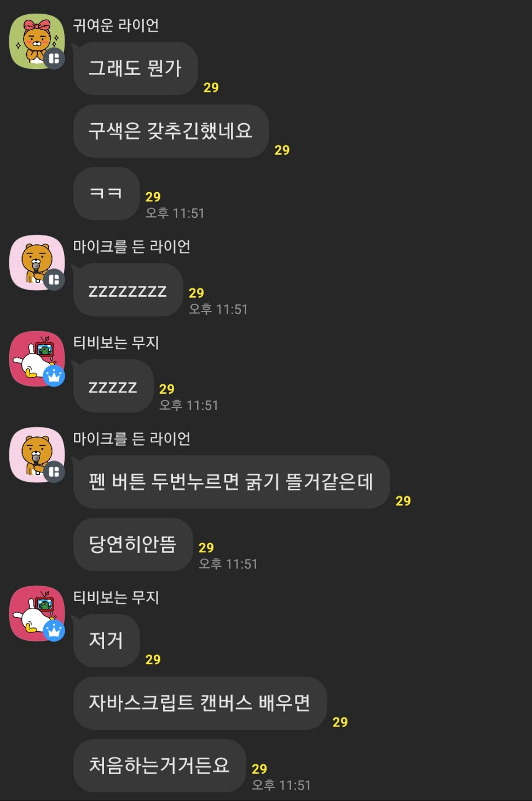

클라이언트 사이드 웹 API에 대해 다뤄본다.

# 1. 소개

클라이언트의 JS는 개발자들이 사용할 수 있는 많은 API를 제공한다. 이는 JS 언어에 규정된 건 아니지만 클라이언트사이드 JS 상에서 구현되어 있다. 브라우저 API와 서드파티 API로 나뉜다.

일반적인 브라우저 API에는 DOM을 조작하는 `getElementById`등의 API, 그리고 `fetch`와 같은 네트워크 통신 API, `requestAnimationFrame`과 같은 애니메이션 API 등이 있다. 세션 스토리지 등의 웹 스토리지도 브라우저 API가 제공하는 기능에 해당한다.

## 1.1. JS API들의 특징

JS API들은 각각 조금씩 다른 원리로 작동하지만 일반적으로 공유하는 특징들이 있다.

API들은 대부분 JS 객체로 이루어져 있다. API가 사용하는 데이터와 함수들을 담는 컨테이너로 객체를 쓰는 것이다. 

예를 들어 DOM API들은 `document` 객체에 담겨있다. `document.getElementById`와 같은 API를 호출하면 `document` 객체의 `getElementById` 함수를 호출하는 것이다.

그리고 API들은 일반적으로 진입점을 가지고 있다. 예를 들어서 DOM API는 document 객체 혹은 HTML 요소의 인스턴스들을 진입점으로 사용할 수 있다.

상태 변화를 위해서 일반적으로 이벤트를 이용한다는 것도 특징 중 하나이다. 또 다른 웹 기술들과 같이 보안 메커니즘을 가지고 있는 경우가 있다. 예를 들어서 HTTPS로 서빙하는 페이지에서만 작동하는 API도 있다.

# 2. DOM 조작

웹페이지를 만들 때 페이지의 문서 구조를 바꾸고 싶을 때가 많다. 이럴 때 DOM API를 사용하면 된다.

## 2.1. 기타 웹 API

[여기](https://developer.mozilla.org/en-US/docs/Learn/JavaScript/Client-side_web_APIs/Manipulating_documents#the_important_parts_of_a_web_browser)참고해서 새 글을 쓰자.

보안상의 이유로 개발자가 조작할 수 없는 브라우저의 부분들도 많다. 그러나 여전히 굉장히 많은 걸 할 수 있는데, 브라우저에서 웹페이지를 띄울 때 일반적으로 쓰이는 부분들은 다음과 같다.

window는 웹페이지가 뜨는 브라우저 탭을 뜻한다. 이는 JS에서 `Window` 객체로 표현되며 `innerWidth` 등의 프로퍼티를 사용할 수 있고 해당 윈도우에 로딩되는 document를 조작하는 등의 동작을 할 수 있다.

navigator는 브라우저의 상태와 정보를 담고 있다. `Navigator`객체로 표현된다. 

그리고 document는 윈도우에 띄워지는 실제 페이지이다. `Document`객체로 표현되며 `getElementById`와 같은 DOM API를 사용해서 페이지를 구성하는 HTML, CSS 정보를 조작하고 변경할 수 있다. 여기서는 document 객체에 대해 자세히 다룰 것이다.

## 2.2. DOM(Document Object Model) 조작

브라우저에 로딩되는 문서는 DOM으로 표현된다. DOM은 트리 구조이고 프로그래밍 언어에 의해 접근될 수 있도록 브라우저에 의해 만들어진다. 이렇게 만들어진 DOM은 브라우저가 스타일링을 적용할 때도 쓰이고 개발자들이 DOM을 조작할 때도 사용할 수 있다.

예를 들어서 다음과 같은 JS 코드를 쓸 수 있다. `querySelector`는 CSS 선택자를 통해 DOM에서 요소를 찾는다.

```js
const linkComponent = document.querySelector('a');
```

그러면 해당 변수는 HTML a 태그 요소에 대한 참조를 가지게 되고 그 요소에 정의된 프로퍼티와 메서드를 사용할 수 있게 된다. 이는 HTMLAnchorElement 혹은 더 일반적인 HTMLElement나 Node(아예 DOM의 모든 일반적인 노드를 뜻함)에 정의된 것들이다. `Node.textContent`등을 사용할 수 있다.

```js
linkComponent.textContent = 'Click me!';
```

`document.createElement`나 `Node.appendChild` 등의 메서드를 이용해 아예 새 요소를 만들고 문서에 추가할 수도 있다.

요소들을 DOM에서 이동하거나 삭제하는 것도 가능한데 주의할 점은 우리가 요소의 참조를 가지고 있다는 것이다. 다음과 같은 HTML을 실행해 보면, p태그가 section 태그의 자식으로 옮겨진 것을 볼 수 있다. 기존 p태그는 그대로 있고 새로운 p태그가 section의 자식으로 추가되는 것이 **아니다!** 만약 새 자식을 추가하고 싶다면 `Node.cloneNode`를 사용해야 한다.

```html
<body>
  <p>예제 문단</p>
  <section>
    이건 섹션입니다.
  </section>
  <script>
    const para=document.querySelector("p");
    const sect=document.querySelector("section");

    para.textContent="예시 문단의 변경된 텍스트";
    sect.appendChild(para);
  </script>
</body>
```

그리고 DOM의 인라인 스타일도 이를 통해 조작할 수 있다. `HTMLElement.style`의 프로퍼티들을 변경하면 된다.

혹은 미리 클래스를 정의해둔 뒤 `Element.setAttribute`를 이용해서 클래스를 추가할 수도 있다. 이렇게 하면 인라인 CSS 스타일이 아니라 클래스를 통한 CSS를 추가할 수 있다.

```js
elem.setAttribute("class", "newClass");
```

이렇게 클래스를 동적으로 설정하는 방법은 사전에 스타일 클래스를 정의해야 한다는 단점이 있지만 CSS와 JS 분리가 더 잘 이루어진다는 장점이 있다. 프로젝트가 커지면 이쪽 방법이 더 많이 쓰인다.

# 3. 서버에서 데이터 가져오기

전체 페이지를 다시 로드하는 대신에, 서버에서 가져온 데이터를 통해서 페이지 일부만 업데이트하는 일은 자주 일어난다. 그리고 이 작은 디테일이 큰 퍼포먼스 변화를 만든다. 따라서 이런 것을 가능하게 하는 fetch API를 알아보자.

## 3.1. 개요

웹페이지는 일반적으로 HTML, CSS, JS 파일로 구성된다. 그리고 이런 파일들은 서버에서 가져온다. 브라우저가 페이지 로딩을 위해 필요한 파일을 가져오기 위해 서버에 HTTP 요청을 보내면 서버는 요청받은 파일을 보내주는 것이다. 다른 페이지로 넘어가면 새 파일을 요청하고 서버는 그 파일들을 넘겨준다.

하지만 페이지의 일부만 변경된 데이터로 업데이트해주고 싶을 수 있다. 가령 페이지의 다른 부분은 다 공통이고 닉네임만 바뀐다거나. 이런 경우 JS API를 사용하여 페이지 로드 없이 페이지의 딱 필요한 부분만 업데이트한다. 여기 쓰이는 게 바로 fetch API이다.

## 3.2. fetch API

fetch API는 네트워크에서 자원을 얻어오고, 응답이 사용 가능해지면 resolve되는 Promise를 반환한다. 이때 resolve되는 것은 응답을 나타내는 Response 객체이다. 양식은 다음과 같다.

```js
fetch(resource);
fetch(resource, options);
```

첫 인수 resource는 가져올 자원의 경로를 넣거나 Request 객체를 넣는다. 2번째 인수는 요청에 적용할 설정들을 포함한 객체이다. 형식은 다음과 같다.

```js
options 객체
{
  method: GET, POST 등 요청 메서드,
  headers: {
    추가할 헤더들을 넣은 객체
  },
  body: 요청에 담을 데이터,
  mode: cors, no-cors, same-origin 등 요청에 사용할 모드,
  credentials: omit, same-origin, include 등 요청에 사용할 인증 정보,
  cache: HTTP 캐시와의 상호작용을 정의하는 부분,
  redirect: manual, follow, error 등 리다이렉트 처리 방식,
  referrer: 요청에 사용할 referrer,
  referrerPolicy: 리퍼러 정책,
  integrity: 서브 리소스의 무결성 체크를 위한 부분,
  keepalive: 페이지 수명이 다해도 요청이 백그라운드에서 계속 유지되는지 여부,
  signal: 요청과 통신하다가 필요한 경우 요청을 중단하는 데 쓰임,
  priority: 같은 종류의 요청들 중 중요한 정도(high, low, auto),
}
```

이때 반환하는 Promise는 네트워크 문제가 있을 때만 reject되며 HTTP 오류 시엔 거부되지 않는다. 따라서 `Response.ok` 혹은 `Response.status`를 확인해서 HTTP 오류를 처리해야 한다.

예시는 다음과 같다.

```js
fetch(URL).then((res)=>{
  if(res.ok){
    return res.json();
  }else{
    throw new Error("HTTP error");
  }
}).then((json)=>{
  // json 데이터를 사용한다.
}).catch((err)=>{
  console.log(err);
});
```

## 3.3. XHR

가끔 낡은 코드들을 보면 XMLHttpRequest 객체를 사용하는 것을 볼 수 있다. 이는 흔히 XHR이라 불리는데, fetch API가 나오기 전에 AJAX 통신을 위해 사용되던 방식이다.

간단한 예시 코드는 다음과 같다.

```js
const xhr = new XMLHttpRequest();

try{
  xhr.open("GET", URL);
  xhr.responseType = "json";

  xhr.onload = () => {
    if(xhr.status === 200){
      console.log(xhr.response);
    }else{
      throw new Error("HTTP error");
    }
  };
  xhr.onerror = () => {
    throw new Error("XHR error");
  };
  xhr.send();
}catch(err){
  console.log(`XHR error ${xhr.status}`);
}
```

# 4. 그래픽 다루기

브라우저는 그래픽 프로그래밍 도구도 제공한다. 여기서는 canvas에 대해 알아보도록 하자.

## 4.1. 웹 그래픽의 역사

웹은 원래 문서를 보여주는 것이 목적이라 텍스트뿐이었다. 그 이후 ``태그를 통해 이미지를 보여주는 게 가능해졌고 또 시간이 지나서 CSS의 `background-image`를 통해서도 이미지를 보여줄 수 있게 되었다.

하지만 이들은 여전히 마크업을 통해서 표현되었기 때문에 비트맵 이미지를 다룰 수 없었고 애니메이션이나 3D 표현 등을 할 수 있는 도구가 없었다. C++과 자바에서는 OpenGL등을 이용해서 가능했는데..

이후 2004년 canvas 요소와 Canvas API가 나오면서 2D 애니메이션, 데이터 시각화 등을 다룰 수 있게 되었다. 또한 2006~2007년에는 WebGL이 나와서 3D 그래픽을 다룰 수 있게 되었다. 여기서는 2D canvas에 대해서만 다루도록 하자.

## 4.2. canvas 다뤄보기

페이지에 2D나 3D 그래픽을 만들려면 canvas 요소를 문서에 넣어 주어야 한다. 이 요소는 페이지에 그래픽을 그릴 영역을 정의한다.

```html
<canvas width="1920" height="1080"></canvas>
```

만약 canvas 요소 내부에 어떤 요소를 넣게 되면, canvas를 지원하지 않는 브라우저에서 보여줄 fallback을 지정할 수 있다. 이미지에 alt text를 지원하는 것과 비슷하다.

다음과 같은 HTML을 작성하자.

```js
<canvas class="myCanvas">
  <p>fallback here</p>
</canvas>
```

JS를 이용해서 캔버스의 크기를 설정한다. 페이지를 꽉 채우도록. 그리고 캔버스를 조작하기 위해서는 `getContext` 메서드를 통해서 캔버스의 그리기 영역에 대한 참조를 가져와야 한다. 이때 인수로는 가져오고 싶은 컨텍스트를 넣을 수 있다. 일단 2d 캔버스를 가져와 보자.

```js
const canvas=document.querySelector('.myCanvas');
const width=(canvas.width=window.innerWidth);
const height=(canvas.height=window.innerHeight);
// webgl 등을 컨텍스트로 가져오기도 가능
const ctx=canvas.getContext('2d');
```

이제 ctx는 CanvasRenderingContext2D 객체이며 캔버스에 가해지는 모든 그리기는 이 객체를 조작함으로써 구현된다. 예를 들어 다음과 같은 코드로 황토색 직사각형을 그릴 수 있다. 

```js
// rgba()로 투명도 설정까지도 가능
ctx.fillStyle='rgb(176,150,0)';
ctx.fillRect(50,50,100,150);
```

나중에 그려진 것이 더 위에 그려진다는 것도 알아두자. 따라서 여러 가지 도형을 한번에 그릴 때 순서에 유의해야 한다.

## 4.3. 다른 함수들

위에서 쓴 `fillRect`는 색으로 채워진 직사각형을 그리는 함수이다. 일단 fill과 반대되는 개념으로 선만을 그리는 stroke로 시작하는 함수들이 있다.

```js
ctx.strokeStyle='rgb(176,150,0)';
ctx.strokeRect(50,50,100,150);
```

lineWidth로 선 굵기도 조정할 수 있다.

```js
ctx.lineWidth=10;
```

경로를 그릴 수도 있다.

```js
// 경로 시작. 기본적으로 (0,0)에서 시작한다.
ctx.beginPath();
// 현재 위치를 (100,100)으로 옮긴다.
ctx.moveTo(100,100);
// (200,100)까지 선을 그린다.
ctx.lineTo(200,100);
// (200,200)까지 선을 그린다.
ctx.lineTo(200,200);
// 선을 렌더링한다.
ctx.stroke();
```

물론 `fillStyle`, `strokeStyle`등도 사용할 수 있다.

원 혹은 호를 그리기 위해서는 `arc()`함수를 사용한다. 형식은 다음과 같다. x,y를 중심으로 하고 반지름이 radius인 원 혹은 호를 그리는 것이다.

```js
// startAngle, endAngle은 라디안 단위.
arc(x, y, radius, startAngle, endAngle)
arc(x, y, radius, startAngle, endAngle, counterclockwise)
```

글자는 `fillText`와 `strokeText`를 사용한다. 형식은 다음과 같다.

```js
fillText(text, x, y [, maxWidth])
strokeText(text, x, y [, maxWidth])
```

캔버스에 외부 이미지를 렌더링하는 것도 가능하다. `drawImage()`메서드를 이용한다. 이미지 객체를 만들고 캔버스 내에 그리면 된다. 단 이미지가 로드되기 전에 그리려고 하면 에러가 발생하므로 이벤트 리스너를 이용해서 로드가 완료된 후에 그려야 한다.

```js
const img=new Image();
img.src="example.png";
// drawImage에 파라미터를 더 주면 이미지의 일부만 그리기도 가능
img.onload=()=>{
  ctx.drawImage(img, 0, 0);
};
```

이때 캔버스 내용은 스크린 리더가 접근할 수 없기 때문에 `aria-label`을 설정하거나 fallback content를 canvas 태그 내부에 제공하는 게 좋다. 여기선 aria-label을 설정해보자.

```js
canvas.setAttribute("aria-label", "example image");
```

## 4.4. 애니메이션

캔버스에선 애니메이션을 만들 수 있는 강력한 기능을 제공한다. 먼저 반복해서 도형을 그리는 간단한 예시부터 살펴보자. 캔버스를 HTML 문서에 넣는 것부터 시작한다.

```html
<canvas class="myCanvas">
  <p>fallback here</p>
</canvas>
```

그리고 JS에서 캔버스를 가져오고 캔버스의 크기를 설정한 후 원점을 페이지 중앙으로 잡는다.

```js
const canvas=document.querySelector('.myCanvas');
const width=(canvas.width=window.innerWidth);
const height=(canvas.height=window.innerHeight);

const ctx=canvas.getContext('2d');

ctx.fillStyle='rgb(0,0,0)';
ctx.fillRect(0,0,width,height);

ctx.translate(width/2,height/2);
```

이제 다음 코드를 추가하자. 이렇게 하고 페이지를 실행하면 삼각형이 회전하는 모양이 그려진 것을 볼 수 있다.

```js
function degToRad(degrees){
  return degrees*Math.PI/180;
}

// 그려지는 삼각형은 점점 작아지고 서로 멀게 그려진다.
for(let i=0, length=250, moveOffset=20;i<length;i++, length--, moveOffset+=0.7){
  // length가 늘어남에 따라 색이 변화하도록
  ctx.fillStyle=`rgba(${255-length}, 0, ${255-length}, 0.9)`;
  ctx.beginPath();
  ctx.moveTo(moveOffset, moveOffset);
  // 삼각형 그리기
  ctx.lineTo(moveOffset+length, moveOffset);
  const triangleHeight=(length / 2) * Math.tan(degToRad(60));
  ctx.lineTo(moveOffset+length/2, moveOffset+triangleHeight);
  ctx.lineTo(moveOffset, moveOffset);
  ctx.fill();
  // 1번 그릴 때마다 캔버스를 약간씩 회전시킨다
  ctx.rotate(degToRad(5));
}
```

하지만 우리가 원하는 건 반복되어서 실행되는 애니메이션이다. 각 프레임마다 다르게 무언가가 그려지는 것이다. 이렇게 반복해서 함수를 실행하도록 도와주는 JS 함수가 `window.requestAnimationFrame()`이다. 

해당 함수는 브라우저가 스크린을 업데이트할 준비가 되면 바로바로 인수로 받은 함수를 실행한다. 언제까지? 우리가 `requestAnimationFrame`을 더 이상 호출하지 않거나 `cancelAnimationFrame`을 호출할 때까지(애니메이션을 사용하지 않게 되면 이걸 호출해 주는 게 좋다).

## 4.5. 간단한 그림판 만들기

그림판을 만드는 건 캔버스를 처음 배우는 사람들이 다들 거쳐가는 관문이다.



MDN에서도 이를 예제로 제시하고 있기에 한번 해보자. 

먼저 다음과 같은 HTML을 작성하자.

```html
<!DOCTYPE html>
<html lang="en-us">
  <head>
    <meta charset="utf-8">
    <meta http-equiv="X-UA-Compatible" content="IE=edge,chrome=1">
    <meta name="viewport" content="width=device-width">
    <title>canvas로 만든 그림판</title>
    <script src="main.js" defer></script>
    <link rel="stylesheet" href="index.css">
  </head>
  <body>
    <section class="toolbar">
      <input type="color" aria-label="select color" value="#ff000">
      <input type="range" aria-label="select line width" min="1" max="50" value="25">
      <span class="output">25</span>
      <button>캔버스 초기화</button>
    </section>
    <canvas class="myCanvas">
      <p>그림판 예제의 캔버스</p>
    </canvas>
  </body>
</html>
```

JS 파일에서는 먼저 기본적인 캔버스 세팅을 해준 후 요소들의 참조를 가져온다.

```js
const canvas=document.querySelector('.myCanvas');
const width=(canvas.width=window.innerWidth);
// 캔버스 높이는 창보다 약간 작게
const height=(canvas.height=window.innerHeight-85);

const ctx=canvas.getContext('2d');

ctx.fillStyle='rgb(0,0,0)';
ctx.fillRect(0,0,width,height);

const colorPicker = document.querySelector('input[type="color"]');
const sizePicker = document.querySelector('input[type="range"]');
const output = document.querySelector('.output');
const clearBtn = document.querySelector('button');
```

우리가 그림판에서 쓸 펜은 원을 그리는 형태이므로 거기 필요한 각도-라디안 변환 함수와, 펜 굵기를 조절함에 따라 span값을 바꾸는 이벤트 리스너를 만든다.

```js
function degToRad(degrees){
  return degrees*Math.PI/180;
}

sizePicker.addEventListener('input',()=>
  output.textContent=sizePicker.value
);
```

그리고 마우스의 좌표를 따라가며 눌린 상태와 눌리지 않은 상태를 트래킹하는 변수를 만들고 이벤트에 반응하게 만든다. 또한 캔버스 초기화 버튼을 누를 시 캔버스를 다시 검은색으로 채워 초기화하는 이벤트 리스너도 만든다.

```js
let curX, curY, pressed=false;

document.addEventListener('mousemove',e=>{
  curX=e.clientX;
  curY=e.clientY;
});

document.addEventListener('mousedown',()=>(pressed=true));
document.addEventListener('mouseup',()=>(pressed=false));

clearBtn.addEventListener('click',()=>{
  ctx.fillStyle='rgb(0,0,0)';
  ctx.fillRect(0,0,width,height);
});
```

이제 그리기 로직을 만들어야 한다. 만약 `pressed`가 true이면 우리는 마우스 위치를 기준으로 펜 굵기만큼의 원을 그리면 된다. 이때 마우스의 위치는 뷰포트의 맨 위에서부터 측정되는데 우리는 캔버스의 맨 위에서부터 측정해야 한다. 따라서 뷰포트의 위에 있는 툴바의 높이를 빼준다.

이후 `requestAnimationFrame`을 이용해서 계속해서 그리도록 만들면 된다.

```js
const toolBar=document.querySelector('.toolbar');

function draw() {
  if (pressed) {
    ctx.fillStyle = colorPicker.value;
    ctx.beginPath();
    ctx.arc(
      curX,
      curY-toolBar.offsetHeight,
      sizePicker.value,
      degToRad(0),
      degToRad(360),
      false
    );
    ctx.fill();
  }
  requestAnimationFrame(draw);
}

draw();
```

## 4.6. 3차원 캔버스

3차원 캔버스는 WebGL API를 이용한다. 이는 2차원 캔버스와 똑같이 `<canvas>`요소를 이용하지만 완전히 다른 API이다. WebGL은 OpenGL에 기반하며 컴퓨터의 GPU를 이용할 수 있게 만든다.

webGL을 그대로 쓰는 건 매우 어렵기 때문에 많은 사람들이 ThreeJS, BabylonJS와 같은 JS 서드파티 라이브러리를 쓴다. 이는 대부분 그래픽스 기반이므로, 원시 혹은 사용자 정의 모양을 만든 후 거기에 비추는 광원과 카메라를 이동하는 방식으로 작동한다.

이는 이후에 [이곳](https://developer.mozilla.org/en-US/docs/Learn/JavaScript/Client-side_web_APIs/Drawing_graphics#using_a_library)을 참고해서 해보자.

# 5. 비디오/오디오 API

HTML은 미디어를 임베딩할 수 있는 요소인 `<video>`와 `<audio>`도 제공한다. 또한 이들을 조작할 수 있는 API도 제공한다. 이들은 `HTMLMediaElement`객체에 있으며 `HTMLMediaElement.play()`등의 메서드를 사용할 수 있다.

우리는 이런 API들을 이용해서 비디오나 오디오 플레이어를 만들 수 있다. video 태그에 controls 속성을 주기만 해도 플레이어가 뜨긴 한다. 하지만 그렇게 만들어진 플레이어는 브라우저마다 사양이 다르며 대부분 브라우저에서 키보드를 통한 접근이 불가능하다.

따라서 HTMLMediaElement API를 활용해서 직접 만들 수 있다. 구체적인 과정은 [여기](https://developer.mozilla.org/en-US/docs/Learn/JavaScript/Client-side_web_APIs/Video_and_audio_APIs)에서 해볼 수 있다. 혹은 [HTMLMediaElement API](https://developer.mozilla.org/en-US/docs/Web/API/HTMLMediaElement)를 이용해서 설계해볼 수도 있겠다.


# 참고

fetch API https://developer.mozilla.org/ko/docs/Web/API/fetch