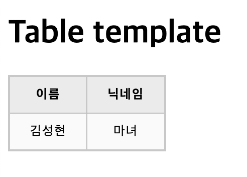
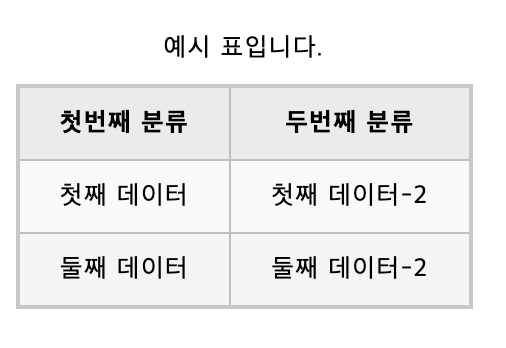
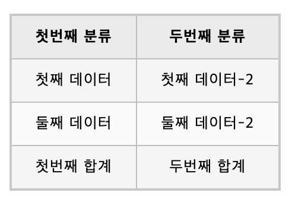
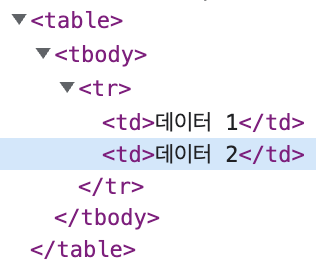
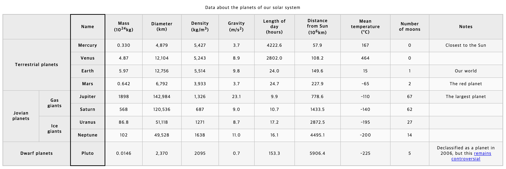

HTML의 테이블에 관해서 다룬다. HTML에는 표 형식 데이터를 다룰 수 있는 태그가 많다.

# 1. HTML 테이블 기본

표는 많은 데이터를 쉽게 보고 분석할 수 있게 한다. 이렇게 표를 효과적으로 만드는 데는 적절한 CSS 스타일링도 한몫 하지만 이는 후에 CSS를 배울 때 할 것이고 여기서는 HTML 테이블의 기본적인 구조에 대해서만 다룬다.

## 1.1. 주의할 점

HTML 테이블은 표 형태의 데이터를 보여주는 데 써야 한다. 페이지 레이아웃을 잡는 데에 써서는 안 된다. 예를 들어서 한 행은 헤더, 한 행은 페이지 컨텐츠, 한 행은 푸터를 넣는 식으로, 페이지 레이아웃 용도로 HTML 테이블 태그를 쓰면 안 되는 것이다.

이는 브라우저들의 CSS 지원이 안 좋을 때 많이 쓰던 방식이라 지금도 몇몇 낡은 사이트에서 보이곤 한다. 하지만 지금은 CSS 레이아웃(flex, grid 등)을 쓰는 게 훨씬 편하다.

게다가 테이블 태그를 이용해 페이지 레이아웃을 구성하면, 테이블 태그는 레이아웃을 위해서 만들어진 게 아니기 때문에 여러 단점들이 있다. 스크린 리더 사용자들에게 혼란을 줄 수 있고 코드의 유지보수도 힘들다. 

그리고 header, section 등의 레이아웃 태그들은 부모 요소에 의해서 너비가 잘 정의된다. 하지만 테이블 태그들은 기본적으로 그 내용에 의해서 너비가 결정된다. 

따라서 테이블 태그를 이용해 페이지 레이아웃을 구성하면, 브라우저의 크기에 따라서 레이아웃이 깨질 수 있고 다양한 장치에서 잘 작동하도록 하기 위해서는 따로 처리가 필요하다.

## 1.2. 표 만들어보기

먼저 MDN에서 제공하는 기본적인 템플릿을 가져오자. [HTML 템플릿](https://github.com/mdn/learning-area/blob/main/html/tables/basic/blank-template.html)과 [CSS 템플릿](https://github.com/mdn/learning-area/blob/main/html/tables/basic/minimal-table.css)이 제공된다. CSS를 아직 배우지는 않았지만 표의 가독성을 높이기 위한 기본적인 처리가 되어있다.

표의 모든 내용은 table 태그로 감싸여있다. 그리고 표의 가장 작은 컨테이너는 table cell인데 이는 table data를 뜻하는 td 태그로 감싸져있다.

```html
<table>
  <td>첫번째 셀</td>
  <td>두번째 셀</td>
  <td>세번째 셀</td>
  <td>네번째 셀</td>
</table>
```

이렇게 표를 만들고 페이지를 띄워 보면 td 셀들이 하나의 칸을 이루는데 이들이 모두 같은 행에 배치된 것을 볼 수 있다. td태그는 더해질 때마다 이전 td 태그와 같은 행에 배치된다.

이를 해결하기 위해서는 tr 태그를 사용해야 한다. tr 태그는 table row를 뜻하며, 이는 표의 한 행을 묶어주는 역할을 한다.

```html
<table>
  <tr>
    <td>첫번째 셀</td>
    <td>두번째 셀</td>
  </tr>
  <tr>
    <td>첫번째 셀</td>
    <td>두번째 셀</td>
  </tr>
</table>
```

이때 만약 행마다 포함된 td의 개수가 다르다면 가장 긴 행의 길이에 맞춰진다.

## 1.3. 헤더 추가하기

표에는 보통 헤더가 필요하다. 행이나 열의 첫 칸에서 데이터가 무엇에 대한 것인지 정의해 주는 것이다.

이 헤더를 위한 셀은 th 태그를 사용한다. th 태그는 당연히 table header를 뜻한다. 이는 td 태그와 똑같이 작동하지만 의미상으로 헤더를 뜻한다. 따라서 헤더까지 잘 달아서 다음과 같이 표를 만들 수 있다.

```html
<table>
  <tr>
    <th>이름</th>
    <th>닉네임</th>
  </tr>
  <tr>
    <td>김성현</td>
    <td>마녀</td>
  </tr>
</table>
```

이렇게 하면 아까 가져온 CSS 템플릿에 th태그 스타일링도 있으므로 헤더가 회색 배경으로 표시된다. 그리고 헤더는 기본적으로 구분을 위해서 가운데 정렬과 굵은 글씨 스타일링이 되어 있다.



이렇게 테이블 헤더를 쓰면 헤더가 있는 행이나 열을 하나의 묶음을 이루는 것처럼 인식되기 때문에 스크린 리더 사용자에게도 도움이 된다.

## 1.4. 표의 행과 열 합치기

하나의 칸이 여러 행 혹은 열을 차지하도록 하고 싶을 수 있다. 그러면 th, td 태그의 colspan, rowspan 속성을 사용하면 된다. 각각 몇 행을 차지할지, 몇 열을 차지할지를 정의해주면 된다. 당연히 기본은 1이다.

```html
<table>
  <tr>
    <th>첫번째 열</th>
    <th>두번째 열</th>
    <th colspan="2">두칸짜리 열</th>
    <th>네번째 열</th>
  </tr>
  <tr>
    <td>1</td>
    <td>2</td>
    <td>3</td>
    <td>4</td>
    <td>5</td>
  </tr>
</table>
```

## 1.5. 열 전체를 스타일링하기

표는 그 특성상 하나의 열을 강조하고 싶은 등, 열 전체를 스타일링해야 할 때가 많다. 이때 colgroup, col 태그를 사용할 수 있다.

colgroup 태그는 table의 여는 태그 바로 다음에 와서 열 전체를 묶어주는 역할을 한다. 이를 이용해서 열 전체를 스타일링할 수 있다.

```html
<table>
  <colgroup>
    <col style="background-color: aqua" />
    <col />
    <col />
    <col style="background-color: aqua" />
  </colgroup>
  <tr>
    <th>첫번째 열</th>
    <th>두번째 열</th>
    <th colspan="2">두칸짜리 열</th>
    <th>네번째 열</th>
  </tr>
  <tr>
    <td>1</td>
    <td>2</td>
    <td>3</td>
    <td>4</td>
    <td>5</td>
  </tr>
</table>
```

이때 어떤 열에는 스타일링을 하지 않고 다음 열에 스타일링하고 싶다면, 스타일링하고 싶지 않은 열에 대응되는 빈 col 태그도 넣어 주어야 한다. 위 예시에서는 1,4번째 열에만 스타일링이 적용된다.

그리고 span 속성을 사용하면 여러 열을 한 번에 스타일링할 수도 있다.

# 2. HTML 테이블 고급

[MDN의 HTML 테이블 고급](https://developer.mozilla.org/en-US/docs/Learn/HTML/Tables/Advanced)을 참고하였습니다.

캡션과 표 요약, 행 그룹핑하기, 표의 body/footer 만들기, 표의 접근성 등을 배운다.

## 2.1. 캡션 달기

table의 여는 태그 바로 다음에 caption 태그를 넣어서 표에 갭션을 달 수 있다. 꼭 `<table>` 바로 다음에 넣어야 한다.

이는 표에 대한 설명을 삽입하는 것이다. 독자에게 표의 용도를 빠르게 인식시킬 수 있으며 스크린 리더 사용자에게도 도움이 된다.

```html
<table>
  <caption>
    예시 표입니다.
  </caption>
  <tr>
    <th>첫번째 분류</th>
    <th>두번째 분류</th>
  </tr>
  <tr>
    <td>첫째 데이터</td>
    <td>첫째 데이터-2</td>
  </tr>
  <tr>
    <td>둘째 데이터</td>
    <td>둘째 데이터-2</td>
  </tr>
</table>
```

이러면 다음과 같이 표 위에 제목처럼 캡션이 표시된다.



스크린 리더 사용자를 돕기 위해 table에서는 summary 속성을 제공하기는 한다. 이 또한 스크린 리더에 읽힌다. 그러나 이 속성은 deprecated되었고 일반 사용자에게 보이지 않는다. 이런 이유로 caption 태그를 사용하는 것이 낫다.

## 2.2. 표 구조 고급

표가 더 복잡한 구조를 가지고 있다면 표의 헤더, 바디, 푸터를 구분하는 것도 좋다. 이를 위해서 thead, tbody, tfoot 태그를 사용할 수 있다.

이는 접근성을 높이거나 사용자의 가독성을 더 좋게 해주지는 않는다. 하지만 표의 레이아웃을 잡고 스타일링을 하는 데에 도움이 된다. 예를 들어서 스크롤할 때 헤더와 푸터는 그대로 두고 body만 스크롤되게 한다거나.

### 2.2.1. thead

thead는 표의 헤더 부분을 묶어준다. 이는 일반적으로 첫 행을 뜻하는데 무조건 그런 것은 아니다. 그리고 table의 여는 태그 바로 다음에 오는 것이 보통이지만 만약 colgroup/col 태그를 쓰고 있다면 colgroup 태그 바로 다음에 와야 한다.

```html
<table>
  <colgroup>
    <col />
    <col style="background-color: aqua" />
  </colgroup>
  <thead>
    <tr>
      <th>첫번째 분류</th>
      <th>두번째 분류</th>
    </tr>
  </thead>
  <tbody>
    <tr>
      <td>첫째 데이터</td>
      <td>첫째 데이터-2</td>
    </tr>
    <tr>
      <td>둘째 데이터</td>
      <td>둘째 데이터-2</td>
    </tr>
  </tbody>
</table>
```

### 2.2.2. tbody

tbody는 표의 바디 부분을 묶어준다. 표의 헤더와 푸터를 제외한 나머지 부분을 일컫는다. 헤더 다음에 오거나, 사용자가 구조화하는 방식에 따라서 푸터 다음에 body가 올 수도 있다.

### 2.2.3. tfoot

tfoot는 표의 푸터 부분을 묶어준다. 이는 이전 행들의 합계를 나타내는 등의 역할을 하는 마지막 행, 등이 될 수 있다.

일반적으로 table 태그의 마지막에 넣지만 table header 바로 아래에 넣을 수도 있다. 그렇게 해도 브라우저가 알아서 표의 최하단에 tfoot을 렌더링할 것이다.

```html
<table>
  <colgroup>
    <col />
    <col />
  </colgroup>
  <thead>
    <tr>
      <th>첫번째 분류</th>
      <th>두번째 분류</th>
    </tr>
  </thead>
  <tfoot>
    <tr>
      <td>첫번째 합계</td>
      <td>두번째 합계</td>
    </tr>
  </tfoot>

  <tbody>
    <tr>
      <td>첫째 데이터</td>
      <td>첫째 데이터-2</td>
    </tr>
    <tr>
      <td>둘째 데이터</td>
      <td>둘째 데이터-2</td>
    </tr>
  </tbody>
</table>
```

위와 같이 헤더와 푸터를 tbody보다 먼저 넣어도 header->body->footer 순으로 렌더링된다.



이때 tbody는 모든 표에 기본적으로 들어가 있다. 만약 명시적으로 입력하지 않더라도 모든 표에는 tbody가 들어간다.

tbody가 포함되지 않은 표를 만들고 브라우저에 띄운 후 개발자 도구를 열어서 보면 다음과 같이 tbody가 자동으로 생성된 것을 볼 수 있다.

```html
<table>
  <td>데이터 1</td>
  <td>데이터 2</td>
</table>
```

개발자 도구에서 위 표를 보면 다음과 같다.



## 2.3. 접근성

스크린 리더 사용자들은 우리가 하는 것처럼 표를 보고 한눈에 이해하기 힘들다. 스크린 리더가 표를 읽기 때문이다.

따라서 스크린 리터 사용자들을 위해 표를 잘 구조화해야 한다. 스크린 리더는 헤더들을 모두 인식하고 그 헤더와 연관된 셀들을 연관짓는다. 그래서 셀들이 어떤 헤더와 연관되어 있는지를 인식하고 데이터를 읽어주는 것이다.

여기에 th태그에 있는 scope 속성이 쓰일 수 있다. scope 속성은 헤더가 어떤 셀과 연관되어 있는지를 알려준다. 헤더가 행과 연관되어 있는가, 아니면 열과 연관되어 있는가 하는 것이다.

scope는 다음과 같은 값들을 가진다.

  * row: 헤더가 행과 연관되어 있다.
  * col: 헤더가 열과 연관되어 있다.
  * rowgroup: 헤더가 행 그룹과 연관되어 있다.
  * colgroup: 헤더가 열 그룹과 연관되어 있다.

rowgroup, colgroup 같은 경우는 표가 복잡해지면서 헤더가 여러 행이나 열에 걸쳐있는 경우에 사용된다.

```html
<table>
  <tr>
    <th colspan="2" scope="colgroup">헤더 1</th>
    <th colspan="2" scope="colgroup">헤더 2</th>
  </tr>
  <tr>
    <th scope="col">헤더 1-1</th>
    <th scope="col">헤더 1-2</th>
    <th scope="col">헤더 2-1</th>
    <th scope="col">헤더 2-2</th>
  </tr>
  <tr>
    <td>내용 1-1</td>
    <td>내용 1-2</td>
    <td>내용 2-1</td>
    <td>내용 2-2</td>
  </tr>
</table>
```

## 2.4. id와 헤더

scope 속성을 쓰는 것의 대체재로 id와 headers 속성을 쓸 수도 있다. th 태그에 id를 주고, td 태그에 headers 속성을 주면 된다. header 속성에는 그 셀의 헤더 역할을 할 모든 th 태그의 id를 공백으로 구분해 적어주면 된다.

```html
<table>
  <tr>
    <th colspan="2" id="first-header">헤더 1</th>
    <th colspan="2" id="second-header">헤더 2</th>
  </tr>
  <tr>
    <th id="subheader1">헤더 1-1</th>
    <th id="subheader2">헤더 1-2</th>
    <th id="subheader3">헤더 2-1</th>
    <th id="subheader4">헤더 2-2</th>
  </tr>
  <tr>
    <td headers="first-header subheader1">내용 1-1</td>
    <td headers="first-header subheader2">내용 1-2</td>
    <td headers="second-header subheader3">내용 2-1</td>
    <td headers="second-header subheader4">내용 2-2</td>
  </tr>
</table>
```

이렇게 하면 헤더와 데이터간의 더 엄밀한 연관을 지을 수 있지만 더 복잡하고 에러에 대한 여유가 없다. 대부분의 표에서는 scope 속성 사용으로 충분하다.

# 3. 표 만들기 실습

MDN에서는 태양계의 행성 정보들로 표를 만들어 보는 예제를 제공한다.

먼저 [HTML 템플릿](https://github.com/mdn/learning-area/blob/main/html/tables/assessment-start/blank-template.html), [CSS 템플릿](https://github.com/mdn/learning-area/blob/main/html/tables/assessment-start/minimal-table.css)을 복사해서 작업중인 디렉토리에 붙여넣는다. 그리고 [행성 데이터](https://github.com/mdn/learning-area/blob/main/html/tables/assessment-start/planets-data.txt)를 가져온다.

행성 데이터를 정리한 표를 만들어 보자.

## 3.1. 표 구조 만들기

표의 헤더와 body를 만들고 캡션을 달자.

```html
<table>
  <caption>
    Data about the planets of our solar system
  </caption>
  <thead></thead>
  <tbody></tbody>
</table>
```

그리고 적절한 column 헤더들을 달자. thead에 넣으면 좋겠다. 또한 행들의 header도 달아주자. 이때 예시 표와 같도록 span을 조절해 주는 것을 잘 해주자.

```html
<table>
  <caption>
    Data about the planets of our solar system
  </caption>
  <thead>
    <th colspan="2">&nbsp;</th>
    <th>Name</th>
    <th>Mass (10<sup>24</sup>kg)</th>
    <th>Diameter (km)</th>
    <th>Density (kg/m<sup>3</sup>)</th>
    <th>Gravity (m/s<sup>2</sup>)</th>
    <th>Length of day (hours)</th>
    <th>Distance from Sun (10<sup>6</sup>km)</th>
    <th>Mean temperature (°C)</th>
    <th>Number of moons</th>
    <th>Notes</th>
  </thead>
  <tbody>
    <tr>
      <th rowspan="4" colspan="2">Terrestrial planets</th>
      <th>Mercury</th>
    </tr>
    <tr>
      <th>Venus</th>
    </tr>
    <tr>
      <th>Earth</th>
    </tr>
    <tr>
      <th>Mars</th>
    </tr>
  </tbody>
  <tr>
    <th rowspan="4" colspan="1">Jovian planets</th>
    <th rowspan="2">Gas giants</th>
    <th>Jupiter</th>
  </tr>
  <tr>
    <th>Saturn</th>
  </tr>
  <tr>
    <th rowspan="2">Ice giants</th>
    <th>Uranus</th>
  </tr>
  <tr>
    <th>Neptune</th>
  </tr>
  <tr>
    <th colspan="2">Dwarf planets</th>
    <th>Pluto</th>
  </tr>
</table>
```

## 3.2. 행성 데이터 넣고 표 완성하기

raw data들을 이제 맞는 위치에 하나씩 넣어주자. raw data가 행성별로 잘 분류되어 있으므로 넣기만 하면 된다.

그리고 table header들에 scope를 달아주자.

```html
<table>
  <caption>
    Data about the planets of our solar system
  </caption>
  <thead>
    <th colspan="2">&nbsp;</th>
    <th scope="col">Name</th>
    <th scope="col">Mass (10<sup>24</sup>kg)</th>
    <th scope="col">Diameter (km)</th>
    <th scope="col">Density (kg/m<sup>3</sup>)</th>
    <th scope="col">Gravity (m/s<sup>2</sup>)</th>
    <th scope="col">Length of day (hours)</th>
    <th scope="col">Distance from Sun (10<sup>6</sup>km)</th>
    <th scope="col">Mean temperature (°C)</th>
    <th scope="col">Number of moons</th>
    <th scope="col">Notes</th>
  </thead>
  <tbody>
    <tr>
      <th rowspan="4" colspan="2" scope="rowgroup">Terrestrial planets</th>
      <th scope="row">Mercury</th>
      <td>0.330</td>
      <td>4,879</td>
      <td>5,427</td>
      <td>3.7</td>
      <td>4222.6</td>
      <td>57.9</td>
      <td>167</td>
      <td>0</td>
      <td>Closest to the Sun</td>
    </tr>
    <tr>
      <th scope="row">Venus</th>
      <td>4.87</td>
      <td>12,104</td>
      <td>5,243</td>
      <td>8.9</td>
      <td>2802.0</td>
      <td>108.2</td>
      <td>464</td>
      <td>0</td>
      <td></td>
    </tr>
    <tr>
      <th scope="row">Earth</th>
      <td>5.97</td>
      <td>12,756</td>
      <td>5,514</td>
      <td>9.8</td>
      <td>24.0</td>
      <td>149.6</td>
      <td>15</td>
      <td>1</td>
      <td>Our world</td>
    </tr>
    <tr>
      <th scope="row">Mars</th>
      <td>0.642</td>
      <td>6,792</td>
      <td>3,933</td>
      <td>3.7</td>
      <td>24.7</td>
      <td>227.9</td>
      <td>-65</td>
      <td>2</td>
      <td>The red planet</td>
    </tr>
    <tr>
      <th rowspan="4" colspan="1" scope="rowgroup">Jovian planets</th>
      <th rowspan="2" scope="rowgroup">Gas giants</th>
      <th scope="row">Jupiter</th>
      <td>1898</td>
      <td>142,984</td>
      <td>1,326</td>
      <td>23.1</td>
      <td>9.9</td>
      <td>778.6</td>
      <td>-110</td>
      <td>67</td>
      <td>The largest planet</td>
    </tr>
    <tr>
      <th scope="row">Saturn</th>
      <td>568</td>
      <td>120,536</td>
      <td>687</td>
      <td>9.0</td>
      <td>10.7</td>
      <td>1433.5</td>
      <td>-140</td>
      <td>62</td>
      <td></td>
    </tr>
    <tr>
      <th rowspan="2" scope="rowgroup">Ice giants</th>
      <th scope="row">Uranus</th>
      <td>86.8</td>
      <td>51,118</td>
      <td>1271</td>
      <td>8.7</td>
      <td>17.2</td>
      <td>2872.5</td>
      <td>-195</td>
      <td>27</td>
      <td></td>
    </tr>
    <tr>
      <th scope="row">Neptune</th>
      <td>102</td>
      <td>49,528</td>
      <td>1638</td>
      <td>11.0</td>
      <td>16.1</td>
      <td>4495.1</td>
      <td>-200</td>
      <td>14</td>
      <td></td>
    </tr>
    <tr>
      <th colspan="2" scope="row">Dwarf planets</th>
      <th scope="row">Pluto</th>
      <td>0.0146</td>
      <td>2,370</td>
      <td>2095</td>
      <td>0.7</td>
      <td>153.3</td>
      <td>5906.4</td>
      <td>-225</td>
      <td>5</td>
      <td>
        Declassified as a planet in 2006, but this
        <a
          href="http://www.usatoday.com/story/tech/2014/10/02/pluto-planet-solar-system/16578959/"
          >remains controversial</a
        >
      </td>
    </tr>
  </tbody>
</table>
```

그리고 행성의 이름들이 들어간 열에 두꺼운 테두리를 달자. 행성 이름이 들어간 열은 3열이므로 3번째 열에만 border를 달아주면 된다. colgroup을 사용하면 된다. table 태그의 바로 다음, caption 태그 바로 전에 다음과 같이 적는다.

```html
<colgroup>
  <col />
  <col />
  <col style="border: solid 2px" />
</colgroup>
```

이렇게 하면 평가에 있는 table과 같은 테이블이 만들어진다.



이제 MDN에서 제공하는 HTML 튜토리얼을 모두 끝냈다. 다음부터는 CSS 튜토리얼을 시작한다.