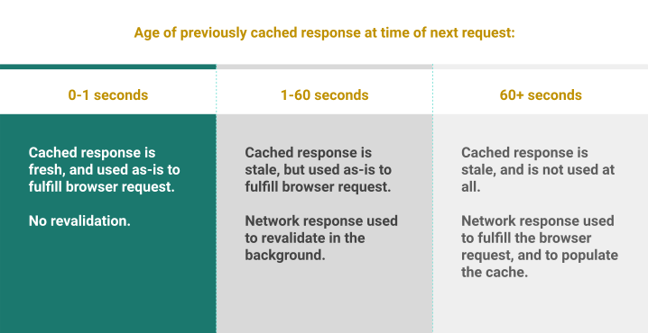
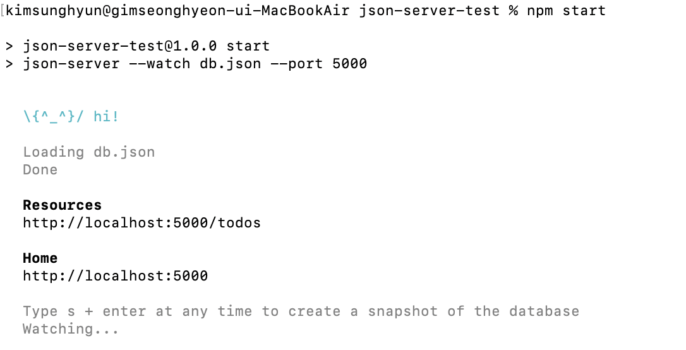
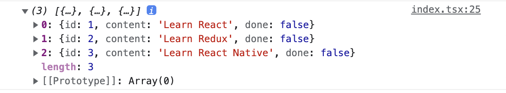

# 1. 배경설명

프론트에서는 서버에 저장되어 있는 데이터를 다룰 때가 많다. 예를 들어서 사용자 프로필 정보를 받아와서 관리하는 등이다.

이를 관리할 때 원래는 useEffect를 사용하여 페이지의 로드 시 서버에서 정보를 받아오고, 프론트단에 저장하는 게 보통이었다. 그리고 서버 정보 업데이트가 있을 시 프론트에서 계속 그 부분에 대한 처리를 해주어야 했다.

React 18부터는 Suspense가 나와서 페이지 로드 시 비동기 처리를 간편하게 해주기는 했지만 서버에서 받아온 데이터를 프론트에 저장해 둔다는 건 마찬가지였다.

이런 상황에 SWR, React query와 같은 라이브러리는 서버 데이터를 프론트에 저장하지 않고 관심사를 분리해야 한다는 철학을 가지고 등장했다.

그 중에 SWR이라는 라이브러리를 사용해 보았다. state-while-revalidate라는 전략의 약자를 따왔다고 한다. 먼저 캐시에서 데이터를 반환한 후 fetch로 재검증하고 최신화 데이터를 가져오는 전략이다. SWR이 요즘은 React-query에 밀리고 있는 것 같지만 원조를 한번 써보기로 했다.

## 1.1. stale-while-revalidate

(2023.07.04 추가)

`stale-while-revalidate`는 HTTP의 캐시 컨트롤 확장이며 swr은 해당 사항을 구현+확장한 라이브러리이다.

그럼 이 `stale-while-revalidate`라는 건 뭘까?

이는 캐시된 콘텐츠를 즉시 로드하는 즉시성과 업데이트된 캐시 콘텐츠가 향후에 쓰이도록 보장하는 최신성 간의 균형을 유지하는 데에 도움을 준다. 어떻게? 캐시된 데이터를 먼저 보여주고, 그 데이터를 백그라운드에서 업데이트하는 방식을 통해서.

`stale-while-revalidate`를 포함하는 HTTP Cache-Control 헤더는 max-age 또한 포함해야 한다. 이 max-age는 캐시된 응답이 오래된 것인지를 판단하도록 해준다. 우리는 이 2가지를 이용해서 로컬 캐시 응답에 대한 판단을 내리고 후속 행동을 취할 수 있다.

예시로 알아보자. 0초 시점에 캐시된 응답이 있다고 하자. 그리고 해당 응답의 Cache-Control 헤더는 다음과 같다.

```
Cache-Control: max-age=60, stale-while-revalidate=120
```

그러면 해당 요청이 60초 이내에 반복되는 경우 max-age에 아직 도달하지 않았으므로 캐시 값은 최신이다. 따라서 캐시된 응답을 재검증 없이 반환한다.

만약 요청이 60초에서 120초 사이에 반복되면 캐시된 값은 오래된 값이지만 `stale-while-revalidate`에 의해 캐시된 응답을 반환한다. 그리고 백그라운드에서 새로운 응답을 가져온다. 새로운 응답이 오면 캐시를 업데이트한다.

120초 이상 지난 후에 요청이 오면 오래된 캐시 컨텐츠는 사용할 수 없다. 따라서 새로운 응답을 서버에서 가져와서 요청에 응답하고 캐시를 업데이트한다.

SWR 라이브러리에서는 이 전략을 차용하여 낡은 캐시에서 빠르게 컨텐츠를 반환하고, 백그라운드에서는 캐싱 컨텐츠 재검증을 진행하여 최신화된 캐시 데이터를 보장하도록 한다.



# 2. vs React-query

차후에 기회가 되면 직접 React-query도 써보고 비교해 보려고 한다. 그런데 [매드업 기술블로그의 글](https://tech.madup.com/react-query-vs-swr/)에 잘 비교된 글이 있어 한번 읽어 보았다.

React-query에서는 Mutation을 통해 서버 데이터를 변형하는 것을 지원하고, devTool을 기본적으로 제공하며 무한 스크롤과 같은 UI를 사용할 때 기본 제공하는 프로퍼티를 이용하여 이전 페이지 데이터를 간편하게 불러올 수 있다고 한다. 

그리고 React-query는 다음 데이터를 불러오기 전까지 현재 캐싱된 데이터를 자동으로 반환한다. 이런 것들이 SWR에서도 가능은 하지만 부가적인 코드 작성이 필요하다.

그리고 React-query는 selector라는 것을 이용하여 쿼리 결과 부분을 추출할 수도 있다. 쿼리가 업데이트될 때만 컴포넌트를 업데이트하고, 여러 컴포넌트가 같은 쿼리를 사용할 시 묶어서 업데이트해주는 등 렌더링 퍼포먼스 최적화도 잘 되어 있다. 

지정된 시간 동안 쿼리가 사용되지 않을 경우 가비지 컬렉션하는 기능도 React-query에서만 지원한다.

더 자세한 기능은 [React-query 공식문서에서의 비교](https://tanstack.com/query/latest/docs/react/comparison?from=reactQueryV3&original=https%3A%2F%2Ftanstack.com%2Fquery%2Fv3%2Fdocs%2Fcomparison)에서 더 볼 수 있다. 이런 React-query의 우위가 있긴 하지만 [카카오 기술블로그](https://fe-developers.kakaoent.com/2022/220224-data-fetching-libs/)에 의하면 SWR도 function이름 정도만 대체하면 쉽게 React-query로 넘어갈 수 있다고 하고, SWR이 더 먼저 나왔다고 하여 한번 사용해 보려고 한다.

간단한 todoList 정도를 만들까 한다.

먼저 CRA로 생성한 어플리케이션에 SWR을 깔자. 여기서는 typescript를 사용했다.

```bash
npm i swr
```

# 3. 서버 모킹

그리고 간단하게 서버를 모킹하기 위해서 json-server를 사용하였다. msw를 이용할 수도 있겠지만 이는 json-server보다 러닝커브가 좀 더 높다고 생각되어 나중에 테스트를 공부하면서 해볼 예정이다.

먼저 폴더를 생성한 후 json-server를 설치하자.

```bash
mkdir json-server-test && cd json-server-test
npm init -y
npm install json-server
```

그리고 프로젝트 루트에 db.json 파일을 생성하자. 내용은 다음과 같이 간단한 todo리스트 파일을 작성하였다.

```json
{
  "todos": [
    {
      "id": 1,
      "content": "Learn React",
      "done": false
    },
    {
      "id": 2,
      "content": "Learn Redux",
      "done": false
    },
    {
      "id": 3,
      "content": "Learn React Native",
      "done": false
    }
  ]
}
```

그리고 json-server-test폴더의 package.json의 스크립트에 다음과 같은 내용을 추가하자. json-server를 포트 5000으로 실행하도록 하는 것이다.

```json
"scripts": {
  "start": "json-server --watch db.json --port 5000",
  "test": "echo \"Error: no test specified\" && exit 1"
},
```

`npm start`명령으로 실행하면 다음과 같이 서버가 열린다.



# 4. 기초적인 SWR 사용

서버에 요청을 보낼 때는 axios를 사용할 것이다. 따라서 todolist 폴더로 돌아와서 이를 설치하자.

```bash
npm i axios
```

URL에서 데이터를 가져오는 fetcher 함수를 만들어 보자.

```jsx
import axios from 'axios';
const fetcher = (url: string) => axios.get(url).then((res) => res.data);
```

그리고 TodoList의 todo 항목들을 나타낼 요소를 간단하게 만든다. 완료 표시와 같은 것들도 만들어야 하겠지만 일단 리스트 요소만 표시하였다.

```tsx
interface Todo {
  id: number;
  content: string;
  done: boolean;
}

function TodoListItem({ todo }: { todo: Todo }) {
  return (
    <li>
      <span>{todo.content}</span>
    </li>
  );
}
```

그리고 useSWR 함수를 사용한다. 이따가 더 자세히 알아보겠지만 가장 간단하게 fetch할 주소와 fetcher 함수를 가져오는 방식으로 사용하겠다.

```tsx
function TodoListPage() {
  const { data, error } = useSWR("http://localhost:5000/todos", fetcher);

  useEffect(() => {
    console.log(data);
  }, [data]);

  return (
    <ul>
      {data
        ? data.map((todo: Todo) => <TodoListItem key={todo.id} todo={todo} />)
        : null}
    </ul>
  );
}
```

이러면 데이터를 잘 가져오는 것을 확인할 수 있다.



아니면 isLoading을 사용하여 다음과 같이 짤 수도 있다.

```tsx
function TodoListPage() {
  const { data, error, isLoading } = useSWR(
    "http://localhost:5000/todos",
    fetcher
  );

  if (error) {
    return <div>failed to load!</div>;
  }
  if (isLoading) {
    return <div>loading TodoList...</div>;
  }

  return (
    <ul>
      {data
        ? data.map((todo: Todo) => <TodoListItem key={todo.id} todo={todo} />)
        : null}
    </ul>
  );
}
```

# 5. useSWR

useSWR은 다음과 같이 사용한다. 이때 key 외에는 모두 선택 인자라서 없어도 된다. 그런데 fetcher가 없어도 된다고? 

알고 보니 fetcher를 전역으로 제공할 수 있는 방법이 있고 이럴 경우에 생략이 가능하다는 것이었다. 이렇게 전역 설정을 하는 법은 조금 뒤에 정리할 것이다.

```tsx
const { data, error, isLoading, isValidating, mutate } = useSWR(key, fetcher, options)
```

위에서 보았듯이 key는 요청할 URL이다. 함수, 배열, null도 전달할 수 있다. fetcher는 데이터를 가져오기 위한 함수를 반환하는 Promise이고 options는 옵션들을 담은 객체이다.

## 5.1. 반환값

useSWR은 다음과 같은 값을 반환한다.

- data: 데이터, fetcher 함수가 주어진 key에 대해 fetch한 데이터. 아직 로드되지 않은 상태에는 undefined이다.
- error : fetcher 함수가 주어진 key에 대해 fetch하는 도중 에러가 발생하면 에러 객체를 반환한다. 에러가 없으면 undefined
- isLoading : 진행 중인 요청이 있고 로드된 데이터가 없으면 true, 아니면 false
- isValidating : 데이터 요청이나 갱신 중이면 true, 아니면 false
- mutate(data?, options) : 캐싱된 데이터를 변형한다.

이때 mutate를 사용하는 방법은 후에 더 자세히 다룰 것이다.

## 5.2. 옵션 객체

옵션 객체는 다음과 같은 속성들을 가질 수 있다. 

### 5.2.1. Suspense

React 18부터 제공되는 suspense를 사용할 수 있다. options 객체에 suspense를 true로 설정하면 된다. 단 리액트에서는 데이터 fetching 프레임워크에 suspense를 쓰는 걸 권장하지는 않는다.

Suspense를 사용하여 TodoListPage를 다음과 같이 바꿔볼 수 있다. 일반적으로 suspense를 활성화하면 렌더링 시점에는 data가 항상 준비된 상태이다.

```tsx
function TodoListPage() {
  const { data } = useSWR("http://localhost:5000/todos", fetcher, {
    suspense: true,
  });

  return (
    <Suspense fallback={<div>Loading...</div>}>
      <ul>
        {data
          ? data.map((todo: Todo) => <TodoListItem key={todo.id} todo={todo} />)
          : null}
      </ul>
    </Suspense>
  );
}
```

### 5.2.2. 자동 갱신 옵션

SWR은 몇몇 시점에 자동으로 데이터를 갱신한다. 이를 위해 refreshInterval, refreshWhenHidden, refreshWhenOffline, revalidateOnFocus, revalidateOnReconnect, revalidateOnMount 옵션을 제공한다.

revalidateOnFocus는 페이지에 다시 포커스하거나 탭을 전환할 때 자동으로 데이터를 갱신하는 옵션이다. 이 옵션은 기본적으로 true이다.

refreshInterval은 데이터를 갱신하는 주기를 설정한다. 이 옵션을 지정한 useSWR 훅과 관련된 컴포넌트가 화면상에 있을 때만 갱신된다. 기본적으로는 0이고 ms단위로 설정할 수 있으며 함수가 들어갈 경우 함수가 최신 데이터를 인수로 받고 갱신 주기를 반환하는 형식이 된다.

```tsx
// 숫자를 전달할 경우
const { data } = useSWR(key, fetcher, {
  refreshInterval: 1000
})

// 함수를 전달할 경우
const { data } = useSWR(key, fetcher, {
  refreshInterval: (data) => data.interval
})
```

revalidateOnReconnect는 네트워크 연결이 끊어졌다가 다시 연결되었을 때 자동으로 데이터를 갱신하는 옵션이다. 네트워크가 회복될 때 자동으로 갱신하는 게 일반적이므로 기본적으로 true이다.

revalidateOnMount는 컴포넌트가 마운트될 때 자동으로 데이터를 갱신하는 옵션이다.

revalidateIfStale는 컴포넌트 마운트 시 데이터가 오래되었을 때 자동으로 데이터를 갱신하는 옵션이다. 이 옵션은 기본적으로 true이다.

refreshWhenHidden, refreshWhenOffline은 각각 브라우저 탭이 숨겨졌을 때, 브라우저가 오프라인일 때 자동으로 데이터를 갱신하는 옵션이다. 이 옵션은 기본적으로 false라서 SWR은 페이지가 화면상에 없거나 네트워크 연결이 오프라인이면 데이터를 갱신하지 않는다.

만약 서버 리소스가 한번 받아오고 나서는 불변하는 경우가 있다고 하자. 이런 경우 모든 자동 갱신을 비활성화하여 불필요한 요청을 줄일 수 있다.

```tsx
const { data } = useSWR(key, fetcher, {
  revalidateIfStale: false,
  revalidateOnFocus: false,
  revalidateOnReconnect: false
});
```

SWR 1.0부터는 이렇게 불변하는 자원을 가져오는 기능을 위해서 useSWRImmutable이라는 훅을 제공한다. 이 훅은 자동 갱신을 비활성화하고 데이터를 불변하게 만든다.

```tsx
const { data } = useSWRImmutable(key, fetcher);
```

위의 두 훅은 완전히 똑같은 기능을 한다.

### 5.2.3. 에러 관련 옵션

shouldRetryOnError는 에러가 발생했을 때 재시도를 할지 여부를 설정하는 옵션이다. 이 옵션은 기본적으로 true이다.

errorRetryInterval은 에러가 발생했을 때 재시도 간격을 설정하는 옵션이다. 기본적으로 5초이다. ms 단위로 설정 가능하며, 느린 네트워크 환경에서는 재시도 간격이 기본적으로 10초로 설정된다.

errorRetryCount는 에러가 발생했을 때 재시도 횟수를 설정하는 옵션이다.

### 5.2.4. 갱신 간격 옵션

dedupingInterval은 같은 키를 가진 요청이 동시에 들어왔을 때 중복된 요청을 방지하는 간격을 설정하는 옵션이다. ms단위로 설정되며 기본적으로 2초이다.

focusThrottleInterval은 focus 이벤트가 발생했을 때 갱신을 방지하는 간격을 설정하는 옵션이다. ms단위로 설정되며 기본적으로 5초이다.

loadingTimeout은 데이터를 가져오는데 시간이 오래 걸릴 때 로딩 상태를 보여주는 시간을 설정하는 옵션이다. ms단위로 설정되며 기본적으로 3초이다. 데이터를 가져오는 데 이 이상 시간이 걸리면 onLoadingSlow 콜백이 호출된다.

### 5.2.5. 이외의 콜백 함수

onSuccess(data, key, config)는 데이터를 성공적으로 가져왔을 때 호출되는 콜백 함수이다.

onError(err, key, config)는 데이터를 가져오는 도중 에러가 발생했을 때 호출되는 콜백 함수이다.

onErrorRetry(err, key, config, revalidate, revalidateOps)는 onError 콜백 함수가 호출된 후 재시도를 할 때 호출되는 콜백 함수이다.

onDiscarded(key)는 race condition으로 인해 이 key에 대한 요청이 무시될 경우 실행되는 콜백 함수이다.

나머지 compare, isPaused, use 등도 있지만 정말로 쓸 일이 없을 것 같다. 그냥 눈에만 익혀 둬야겠다.

# 6. 전역 설정

SWR은 전역 설정을 지원한다. SWRConfig 컴포넌트를 사용하면 이 컴포넌트 내부의 모든 컴포넌트에서 쓰이는 SWR 훅의 options 설정을 한 번에 할 수 있다.

```tsx
import { SWRConfig } from 'swr'

function App() {
  return (
    <SWRConfig
      value={options}
    >
      <Component />
    </SWRConfig>
  )
}
```

위 코드의 options 객체에 들어갈 수 있는 값은 useSWR의 옵션과 동일하다. 위에서는 다루지 않았는데 이 options 인수에는 fetcher 함수도 들어갈 수 있다. 

이를 이용하면 특정 SWRConfig 내부에서 공통적으로 사용하는 fetcher 함수를 설정할 수 있다. 이 경우 useSWR 훅에 따로 fetcher 함수를 넣어주지 않아도 된다. 물론 따로 fetcher를 넣어 줄 경우 오버라이드는 가능하다.

SWRConfig를 중첩해서 쓰면 상위 컨텍스트의 설정이 오버라이드된다.

그리고 SWRConfig의 value 객체에는 함숫값들도 넣을 수 있는데 이렇게 함숫값을 넣게 되면 함수는 상위 config 설정을 인수로 받고 새로운 설정을 반환한다.

useSWRConfig 훅을 사용하면 현재 SWRConfig의 설정을 가져올 수 있다.

```tsx
import { useSWRConfig } from 'swr'

function Component() {
  // 만약 상위 컴포넌트에 SWRConfig가 없다면 기본값 반환
  const { cache, mutate, ...restConfig } = useSWRConfig()
  // ...
}
```

# 7. 에러 처리

useSWR 훅에 제공한 fetcher 함수의 동작에서 에러가 발생할 시 error로 반환된다. 즉 throw될 경우 error가 반환되는 것이다.

```tsx
const {data, error}=useSWR(key, fetcher);
```

fetcher가 실패할 시 error 객체를 반환할 때 더 많은 정보를 반환하도록 할 수 있다. 이는 [여기](https://swr.vercel.app/ko/docs/error-handling#%EC%83%81%ED%83%9C-%EC%BD%94%EB%93%9C%EC%99%80-%EC%97%90%EB%9F%AC-%EA%B0%9D%EC%B2%B4)를 참고.

그리고 SWR은 에러 발생시 요청을 재시도하는데, onErrorRetry 옵션 콜백을 이용하면 에러가 발생했을 때 재시도를 하는 함수를 오버라이드할 수도 있다. 이를 SWRConfig 전역 설정을 이용해 제공할 경우 많은 컴포넌트들 내부의 훅에 공통적으로 에러 재시도 로직을 제공할 수 있다.

또한 만약 에러 발생 시 어떤 로직을 실행하길 원할 경우 onError 콜백을 사용할 수도 있다. 에러를 토스트 등으로 보여주길 원할 때이다.

# 8. 조건부 fetch

useSWR에서 key 인수가 null이거나, key 인수에 전달한 함수가 falsy값을 반환할 경우 SWR은 fetch를 하지 않는다. 이를 이용하면 조건부 fetch를 할 수 있다.

```tsx
const { data, error } = useSWR(
  isLogin ? '/api/user' : null,
  fetcher
)
```

위와 같이 쓸 경우 isLogin이 false일 경우 fetch를 하지 않는다.

이를 이용하면 다른 데이터에 의존하는 데이터를 가져올 수도 있다.

```tsx
const {data:user}=useSWR('/api/user', fetcher);
const {data:posts}=useSWR(user ? `/api/posts?userId=${user.id}` : null, fetcher);
```

위와 같이 쓸 경우 user가 null일 경우 posts를 가져오는 훅은 작동하지 않는다. 이를 이용하면 user가 존재할 때만 posts를 가져오도록 할 수 있다.

# 9. fetcher 함수 인자

useSWR의 key 인수는 기본적으로 fetcher인자로 받은 함수의 인자로 전달된다. 일반적으로 이 key 인수는 fetch해올 URL이 된다.

그런데 이 fetcher 함수에 다른 인자, 예를 들어서 로그인한 유저의 jwt 토큰을 함께 붙여서 fetch를 하고 싶을 수도 있다.

이 경우 useSWR의 key 인자에 배열을 넣어 줄 수 있다.

```tsx
const { data, error } = useSWR(
  ['/api/user', token],
  (url, token) => fetcher(url, token)
)
```

이렇게 하면 fetcher 함수의 인자로 url과 token이 전달된다.

# 10. mutation

SWR은 데이터를 fetch하는 것 뿐만 아니라 데이터를 변경하는 기능도 mutate를 통해 제공한다.

이를 사용하는 방법은 모든 키에 대해 데이터를 변경할 수 있는 전역 mutate API와 특정 hook에 대한 mutate API가 있다.

## 10.1. 전역 mutate API

전역 mutate API는 useSWRConfig 훅을 이용해 가져올 수 있다.

```tsx
import { useSWRConfig } from 'swr'

function Component() {
  const { mutate } = useSWRConfig()
  // ...
}
```

전역으로 가져올 수도 있다.

```tsx
import { mutate } from 'swr'
```

그리고 이 mutate 함수는 다음과 같이 사용할 수 있다.

```tsx
mutate(key, data, options)
```

## 10.2. 특정 hook에 대한 mutate API

특정 hook에 대한 mutate API는 useSWR 훅을 이용해 가져올 수 있다. 이미 위에서 useSWR훅의 반환값으로 mutate 함수도 존재함을 배웠다.

이렇게 bound mutate를 사용하는 경우 해당 훅의 key에 대해서만 데이터를 변경할 수 있으며 mutate 함수에 대해 따로 key를 제공할 필요가 없다.

```tsx
const { data, mutate } = useSWR('/api/user', fetcher)
mutate(data, options)
```

## 10.3. mutate API 형식

mutate API는 다음과 같은 형식을 가진다.

```tsx
mutate(key, data, options)
```

### 10.3.1. key 인수

key는 mutate할 데이터의 key이다. 즉 해당 key에 대한 데이터를 mutate한다는 의미이다. useSWR의 key 인수와 비슷하다.

그런데 useSWR의 key 인수와 약간 다른 점이 있다. key 인수가 함수로 주어질 때이다. 이 경우 key 인수로 주어진 콜백 함수는 필터 함수처럼 작용하는데, 이 말은 key를 인자로 받아서 true를 반환할 경우 해당 key에 관한 데이터를 refetch한다는 의미이다.

이것은 data인수 없이 mutate를 호출하는 것과도 같은 동작인데, data 인수 없이 mutate를 호출하면 해당 key에 대한 데이터를 refetch한다. 정확히는 해당 key에 대한 데이터를 만료된 것으로 표시하여 refetch하도록 하는 것이다.

```tsx
mutate('/api/user');
```

위와 같은 함수는 `/api/user`라는 키를 가진 데이터를 모두 만료 표시하고 refetch한다.

앞서 말한 듯이 key를 filter 함수처럼 사용하는 예시는 다음과 같다.

```tsx
mutate((key) => key.startsWith('/api/user'))

// 혹은 data를 undefined로 전달하여 refetch

mutate((key) => key.startsWith('/api/user'), undefined, { revalidate: true })
```

이러면 `/api/user`로 시작하는 모든 키에 대한 데이터를 만료 표시하고 refetch한다.

필터 기능은 기존에 있는 모든 캐시된 key에 적용되므로 key 형태가 다양할 경우를 염두에 두고 작성해야 한다.

그리고 이 기능을 사용할 시 모든 캐시 데이터를 지우는 함수도 쉽게 작성할 수 있다.

```tsx
// 모든 key의 캐시 데이터를 지우고 캐시 유효성 검사도 다시 안 한다
mutate(() => true, undefined, { revalidate: false })
```

### 10.3.2. data

이 인수를 이용해서 클라이언트 캐시를 업데이트하거나 클라이언트에서 서버로 데이터를 보내서 서버의 데이터를 업데이트할 수 있다.

서버에 데이터를 변경하는 작업을 시키기 위한 비동기 함수를 전달하는 것이다.

### 10.3.3. options

options 인수는 다음과 같은 옵션을 가진다.

optimisticData, revalidate, populateCache, rollbackOnError, throwOnError

revalidate는 비동기 업데이트를 완료한 후 캐시 유효성을 다시 검사할지를 결정한다. 기본은 true

rollbackOnError는 mutate가 실패했을 때 캐시를 이전 상태로 되돌릴지를 결정한다. 기본은 true

throwOnError는 mutate가 실패했을 때 에러를 throw할지를 결정한다. 기본은 true

### 10.3.4. mutate의 반환값

mutate 함수는 data 매개변수의 해결 결과를 반환한다. 해당 캐시값을 업데이트하는 데에 사용되는 업데이트된 데이터를 반환하는 것이다.

에러도 try-catch로 적절히 처리 가능하다.

```tsx
try {
  // update는 비동기 함수
  const data = await mutate('/api/user', update(newData))
} catch (error) {
  // ...
}
```

## 10.4. useSWRMutation

remote mutation을 위한 훅으로 useSWRMutation이 있다. 이는 자동으로 트리거되는 useSWR과 달리 수동으로만 트리거된다. 또한 다른 useSWRMutation과 상태를 공유하지 않는다.

```tsx
const { data, error, trigger, reset, isMutating } = useSWRMutation(key, fetcher, options)
```

key와 fetcher, options를 제공하면 remote mutation을 제공하는 trigger 함수를 반환한다. 그리고 trigger가 호출되기 전까지 요청을 시작하지 않기 때문에, 필요할 때까지 데이터 로딩을 지연시킬 수 있다.

# 참고

https://web.dev/stale-while-revalidate/

공식 문서 https://swr.vercel.app/ko

https://fe-developers.kakaoent.com/2022/220224-data-fetching-libs/

https://tech.madup.com/react-query-vs-swr/

json-server https://poiemaweb.com/json-server

https://velog.io/@soryeongk/SWRBasic

https://youthfulhps.dev/web/stale-while-ravalidate/