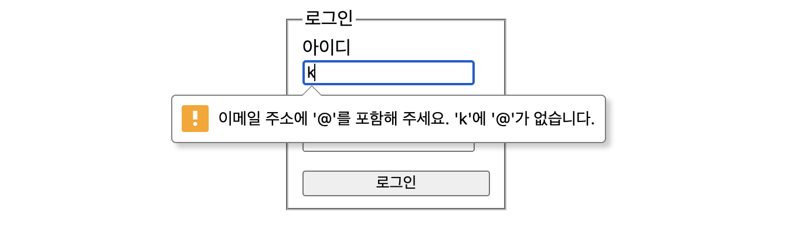
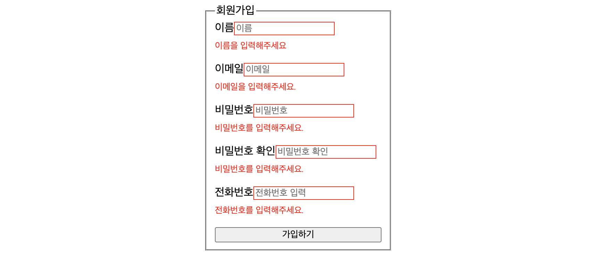
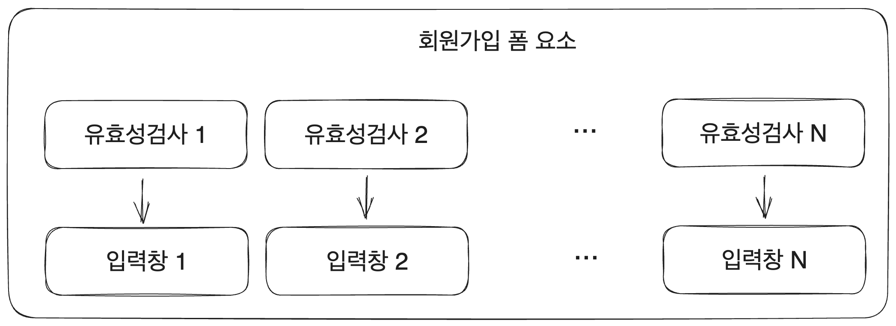
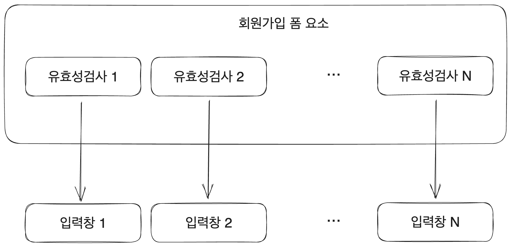

# 0. 시작

사용자가 작성한 값을 서버로 제출하는 페이지는 매우 흔하게 쓰인다. 그리고 이런 사용자의 입력값을 클라이언트에서 검증하는 일도 많다. `비밀번호는 8자 이상에 특수문자를 하나 이상 입력해 주세요`와 같이 입력한 내용의 형식을 지적하는 메시지를 누구나 한 번쯤 본 적이 있다.

이런 클라이언트 유효성 검사에 대해서 살펴볼 만한 건 두 가지가 있다. 첫번째는 유효성 검사 그 자체를 어떻게 만들 것인가에 대한 것이다. 그리고 두번째는 이런 유효성 검사를 거쳐야 하는 많은 입력창의 정보를 어떻게 관리할지에 대한 것이다.

당연히 이를 위한 여러 방법들이 있다. 간단한 로그인, 회원가입 폼을 이리저리 가공해 보면서 이 두 가지에 대해서 알아보자. [추가적으로 수집한 부분도 있지만 전체적으로 김정환 님의 블로그 글에서의 접근 방식을 많이 참고하였다.](https://jeonghwan-kim.github.io/dev/2022/03/29/react-form-and-formik.html)

# 1. 클라이언트 데이터 검증

## 1.1. 개요

회원가입과 같이, 어떤 값을 입력한 후 그것을 서버에 제출해야 하는 페이지를 생각해 보자. 인터넷을 사용하는 사람이라면 그런 폼을 직접 사용해 본 적이 몇 번은 있을 것이다.

그러다 보면 흔히 이런 메시지를 보게 된다. `비밀번호는 8자 이상에 특수문자를 하나 이상 입력해 주세요`라거나 `이메일 형식에 맞게 입력해 주세요`와 같이 입력한 내용의 형식을 지적하는 메시지 말이다. 그리고 이런 메시지가 뜨면 폼 제출도 되지 않는다. 내용을 형식에 맞게 수정한 후에야 제출할 수 있다.

이런 내용 검증은 어떻게 이루어지고 있는 걸까? `onChange` 핸들러 같은 걸 이용해서 내용이 바뀔 때마다 서버에 전송하고 해당 데이터를 서버에서 검증한 결과를 따로 표시해 줄 수 있겠다. 회원가입 폼의 비밀번호라고 온 데이터의 형식이 맞는지를 서버에서 검증한 후 아니라면 아니라는 응답을 보내는 식이다.

하지만 이렇게 하면 서버에 부담이 간다. 그리고 실시간으로 검증을 하기 어렵다. 물론 디바운싱과 같은 테크닉을 이용해서 구현하지 못할 건 없다. 하지만 부하가 많아지고 코드가 복잡해진다. 그래서 많은 경우 이런 실시간 내용 검증은 클라이언트 쪽에서 입력값에 대한 검증을 하는 경우가 많다.

글의 코드들은 react를 사용해서 작성하였다.

## 1.2. 보안 관련

물론 정말 마음먹은 해커에게는 이런 클라이언트 유효성 검사가 전혀 문제가 되지 않는다. postman 등을 통해서 직접 서버로 데이터를 보내면 되기 때문이다. 따라서 이런 클라이언트단의 입력값 유효성 검사만으로 보안을 해결할 수는 없다. 서버에서도 사용자가 제출한 값에 대한 유효성 검사를 따로 해야 한다. 

하지만 이런 클라이언트 단의 입력값 검사는 서버에 부담을 주지 않고 사용자에게 피드백을 주는 데에 꽤나 효과적이기에 애용되고 있다.

# 2. HTML을 이용

간단한 로그인 폼을 만든다고 해보자. 로그인을 위한 정보 입력 시에는 일반적으로 입력값에 대한 검증이 없거나 적게 이루어진다. 하지만 예시를 위해 최대한 간단한 양식을 생각하다가 로그인 폼으로 예시를 들기로 결정했다.

HTML의 양식 요소, 특히 `<input>`태그는 기본적으로 유효성 검사 기능을 제공한다. `required`정도는 꽤나 자주 보인다. 하지만 이외에도 길이나 형식 등을 검사할 수 있다. JS 없이도 양식 제출과 검증까지도 해낼 수 있다!


HTML의 유효성 검사 기능만을 이용해서 로그인 폼을 만든다고 해보자.

## 2.1. 로그인 폼 기본구조

사실 이건 react의 기능을 특별히 쓸 것도 없는 HTML 구조이다.

```tsx
// src/App.tsx
function App() {
  return (
    <main>
      <form>
        <fieldset className="login-form">
          <legend>로그인</legend>
          <div>
            <label htmlFor="id">아이디</label>
            <input type="text" id="id" name="id" />
          </div>
          <div>
            <label htmlFor="password">비밀번호</label>
            <input type="password" id="password" name="password" />
          </div>
          <button type="submit">로그인</button>
        </fieldset>
      </form>
    </main>
  );
}

export default App;
```

`login-form` 클래스는 그냥 입력창을 세로로 배열하고 너비에 약간 제한을 두기 위한 것이다. 디자인이 중요한 건 아니므로 넘어가자.

```css
// src/index.css
.login-form {
  display: flex;
  flex-direction: column;
  gap: 1rem;
  width:10rem;
}
```

## 2.2. 기본적인 유효성 검사

HTML `<input>`태그에서 제공하는 유효성 검사에 관한 속성들은 다음과 같다. `<input>`태그가 깊이 궁금하다면 [해당 태그를 자세히 다룬 글을 참고하자.](https://witch.work/posts/html-input-tag)

- `minlength`, `maxlength`: 입력할 수 있는 최소/최대 글자 수를 지정한다.
- `min`, `max`: 어떤 값을 갖는 input에서 입력할 수 있는 최소/최대 숫자를 지정한다.
- `spellcheck`: 브라우저가 맞춤법 검사를 지원할 경우 입력한 텍스트의 맞춤법을 검사하도록 할 수 있다. 단 브라우저가 이를 지원하지 않을 수 있다.
- `pattern`: 유효성 검사를 위한 정규식을 지정한다. 특정 규칙을 만족하는 텍스트만 입력 가능하도록 할 수 있다.
- `required`: 폼 제출시 이 input의 값을 필수로 만들어서 이 input이 비어있으면 폼 제출이 되지 않도록 할 수 있다.
- `type`: input의 타입을 지정한다. `number`, `email`, `tel` 등을 지정하면 input의 값에 대한 유효성 검사가 자동으로 진행된다.

이를 이용해서 아이디와 비밀번호를 필수 입력으로 지정하고 아이디를 이메일 형식으로 입력하도록 하고, 아이디에 대해서 이메일 형식 검증이 이루어지도록 할 수 있다. 다음과 같이 말이다.

`type="email"`을 이용해서 이메일 형식에 대한 검증을 하도록 했고 `required`를 이용해서 필수 입력으로 지정했다. 그리고 `minlength`과 `maxlength`를 이용해서 입력값의 길이 범위를 제한했다.

```tsx
function App() {
  return (
    <main>
      <form>
        <fieldset className="login-form">
          <legend>로그인</legend>
          <div>
            <label htmlFor="id">아이디</label>
            <input 
              type="email" 
              id="id" 
              name="id" 
              placeholder="이메일 형식으로 입력해주세요."
              minLength={5}
              maxLength={30}
              required
            />
          </div>
          <div>
            <label htmlFor="password">비밀번호</label>
            <input 
              type="password" 
              id="password" 
              name="password"
              minLength={5}
              maxLength={20}
              required
            />
          </div>
          <button type="submit">로그인</button>
        </fieldset>
      </form>
    </main>
  );
}
```

이렇게 하면 예를 들어서 아이디를 양식에 맞지 않게 입력하거나 충분한 길이로 입력하지 않으면 경고창이 뜨는 등 제출시에 검증이 이루어진다.



그리고 `<input>`태그는 정규식을 사용해서도 검증할 수 있다. `pattern` 속성에 사용하고 싶은 정규식을 넣으면 된다. 예를 들어서 미국의 전화번호 형식을 검증하고 싶다면 다음과 같이 할 수 있다. [여기 쓰인 정규식은 여러 정규식 예시를 제공하는 사이트](https://regexlib.com/)에서 가져왔다.

```html
<input 
  type="text" 
  id="id" 
  name="id" 
  placeholder="이메일 형식으로 입력해주세요."
  pattern="^[2-9]\d{2}-\d{3}-\d{4}$"
  required
/>
```

만약 해당 input의 값이 정규식을 만족하지 않는 상태로 폼을 제출하게 되면 `요청한 형식과 일치시키세요.`라는 경고창이 뜨면서 제출이 되지 않게 된다.

하지만 이렇게 하는 것은 약간 부족한 느낌이 든다. 왜냐 하면 이렇게 하면 일단 경고창의 스타일링이 불가능하다. 그리고 더 큰 문제는 사용자가 유효성 검사 결과에 대한 메시지를 양식을 제출하는 시점에 보게 된다는 것이다. 

이러면 사용자는 자신의 입력값을 실시간으로 검증할 수 없게 된다. 또한 클라이언트 유효성 검사의 장점은 실시간으로 입력값에 대한 검증 결과를 확인할 수 있어 사용자가 입력값을 바로바로 고치기 수월하다는 점인데 이렇게 제출 시점에만 메시지를 볼 수 있다면 클라이언트 검증의 UX적 의미가 떨어진다.

따라서 `Constraint Validation API`와 `:valid`, `:invalid`의사 클래스를 이용해서 유효성 검사를 좀더 커스텀해보자.

# 3. `Constraint Validation API`

## 3.1. API 소개

지금까지 한 것만 해도 형식에 대한 어느 정도의 검증이 가능하다. 하지만 경고 메시지의 내용이나 스타일도 바꾸고, 유효성 검사를 통과하거나 통과하지 못했을 때 어떤 동작을 취하게 하고 싶을 수도 있다.그리고 실제로 그런 식으로 디자인된 페이지도 많다. 하지만 지금까지 한 내용만으로는 그것이 불가능하다.

이를 위해서는 `Constraint Validation API`를 사용해야 한다. 

이는 form 요소들에서 사용가능한 메서드와 속성들로 구성되어 유효성 검사에 실패했을 때의 메시지를 변경하거나 특정 동작을 하게 하거나, 스타일을 변경하는 데에 도움을 준다.

`Constraint Validation API`를 지원하는 DOM 요소는 다음과 같다. 즉 다음 요소들에서 유효성 검사에 관련된 `validity`같은 프로퍼티들을 사용할 수 있다.

- `<input>`(HTMLInputElement)
- `<select>`(HTMLSelectElement)
- `<button>`(HTMLButtonElement)
- `<textarea>`(HTMLTextAreaElement)
- `<fieldset>`(HTMLFieldSetElement)
- `<output>`(HTMLOutputElement)

그리고 이 요소들에서는 입력값의 유효성 검사 여부에 따라서 `:valid`, `:invalid` CSS 의사 클래스를 사용할 수 있다. `Constraint Validation API`와도 자동으로 연동된다.

## 3.2. 유효성 검사 메시지 내용 바꾸기

`Constraint Validation API`를 이용하면 폼의 유효성 검사에 따라서 커스텀 메시지를 보여줄 수 있다. 이는 몇 가지 장점이 있는데 첫째는 `:valid`, `:invalid` 의사 클래스를 이용해 폼의 메시지를 CSS로 스타일링할 수 있다는 것이고 둘째는 폼의 메시지를 사용자에게 일관적으로 보여줄 수 있다는 것이다.

기본 유효성 검사 메시지는 브라우저마다, 국가마다 내용도 디자인도 다르다. 그런데 JS로 이런 유효성 검사 메시지를 커스텀하면 사용자에게 일관적인 내용의 유효성 관련 메시지를 보여줄 수 있다. 아무튼 이를 이용해서 커스텀 메시지를 보여줘보자.

가장 간단한 건 메시지의 내용을 바꾸는 것이다. `setCustomValidity(message)` API를 이용하면 된다. 다음과 같이 유효성 검사 객체의 결과에 따라 메시지를 설정하는 함수를 만들어서 `<input>`의 `onChange` 핸들러에 넘겨주면 된다.

```tsx
const checkValidation = (e: React.ChangeEvent<HTMLInputElement>) => {
  const {validity}=e.target;
  if(validity.typeMismatch){
    e.target.setCustomValidity("이메일 형식 커스텀 메시지")
  }
  else if(validity.tooShort){
    e.target.setCustomValidity("최소길이 미만일 때 커스텀 메시지")
  }
  else if(validity.tooLong){
    e.target.setCustomValidity("최대길이 초과일 때 커스텀 메시지")
  }
}
```

만약 `setCustomValidity`의 인수를 빈 문자열로 전달했다면 유효한 것으로 판단된다.

## 3.3. API 속성들

더 많은 커스텀을 해보기 전에 `Constraint Validation API`는 어떤 속성들을 제공하는지 간략히 정리한다.

`willValidate`는 해당 요소가 폼 제출 시 유효성 검사가 진행되는 요소일 경우 true, 아니면 false를 반환한다. 

`validity`는 요소의 유효성 검사 결과를 담은 `ValidityState` 객체이다. `validationMessage`는 요소가 유효하지 않을 경우 그 상태를 설명하는 메시지를 반환한다. 만약 유효하거나 요소의 `willValidate`가 false라면 빈 문자열을 반환한다.

이 객체의 키들은 각각의 유효성 검사 결과에 따라서 불린값을 가진다. 가령 `pattern`유효성 검사에서 실패하면 `patternMismatch`가 true가 된다. `tooLong`, `tooShort`, `typeMismatch`, `valueMissing` 등의 객체 프로퍼티들이 더 있다.

요소의 값의 전체 유효성 검사 결과를 반환하는 `checkValidity()` 메서드와 유효성 검사 결과를 조사하기만 하는 `reportValidity()`메서드가 간간이 쓰인다. 커스텀 에러 메시지를 설정하는 `setCustomValidity(message)`메서드도 존재한다.

## 3.4. 메시지 커스텀 고급

`<form>` 요소에 `novalidate` 어트리뷰트를 주어서 기본 유효성 검사를 끈 후 아예 새로 메시지를 만들 수도 있다. 굳이 메시지가 말풍선으로 나올 필요는 없지 않은가?

먼저 에러 메시지를 표시할 `<span>`태그를 각 input 아래에 배치한다. HTML 구조만 표현해 보면 다음과 같다.

```html
<main>
  <form noValidate>
    <fieldset className='login-form'>
      <legend>로그인</legend>
      <div>
        <label htmlFor='email'>이메일</label>
        <input 
          type='email'
          id='email' 
          name='email' 
          placeholder='이메일'
          required
          minLength={5}
          maxLength={30}
        />
        <span className='error' aria-live='polite'>
          여기 이메일 입력값 검증 메시지가 들어갈 것이다.
        </span>
      </div>

      <div>
        <label htmlFor='password'>비밀번호</label>
        <input 
          type='password' 
          id='password'
          name='password'
          placeholder='비밀번호'
          required
          minLength={5}
          maxLength={20}
        />
        <span className='error' aria-live='polite'>
          여기 비밀번호 값 검증 메시지가 들어갈 것이다.
        </span>
      </div>
      <button type='submit'>로그인</button>
    </fieldset>
  </form>
</main>
```

`<form>`태그의 `novalidate` 속성을 설정한다고 해서 `<input>`태그의 유효성 검사가 사라지는 것도 아니고 `:valid`같은 CSS 의사 클래스 기능을 못 쓰게 되는 것도 아니므로 `Constraint Validation API`를 이용해서 커스텀을 진행하면 된다.

다음과 같이 에러 메시지와 유효성 여부에 따른 테두리 색상 등을 스타일링해준다.

```css
.login-form {
  display: flex;
  flex-direction: column;
  margin: 0 auto;
  gap: 1rem;
  width:15rem;
}

input{
  appearance: none;
  border: 1px solid #ccc;
  margin: 0;
  margin-bottom:0.5rem;

  box-sizing: border-box;
}

input:invalid{
  border: 1px solid red;
}

/* 입력창 포커스시 빨간 테두리가 사라지도록 */
input:focus:invalid{
  border: 1px solid #ccc;
  outline: none;
}

.error{
  display:block;
  width: 100%;
  padding:0;

  font-size:0.8rem;
  color: red;
}
```

그리고 다음과 같이 유효성 검사 여부에 따라서 에러 메시지를 바꿔주는 함수를 만들고 적용하자. 가령 이메일에 대한 유효성 검사 메시지를 만드는 함수는 이렇다.

```tsx
const [emailError, setEmailError] = useState('이메일을 입력해주세요.');

const emailValidation= (e: React.ChangeEvent<HTMLInputElement>) => {
  const {validity}=e.target;

  if (validity.typeMismatch) {
    setEmailError('이메일 형식이 아닙니다.');
  }
  else if (validity.tooShort) {
    setEmailError('이메일은 5자 이상이어야 합니다.');
  }
  else if (validity.valueMissing) {
    setEmailError('이메일을 입력해주세요.');
  }
  else {
    setEmailError('');
  }
};
```

그리고 해당 함수를 `<input>`의 `onChange` 핸들러에 넘겨주고 에러 메시지를 표시할 `<span>`태그에는 `emailError`를 넣어주면 된다.

```tsx
<input 
  type='email'
  id='email' 
  name='email' 
  placeholder='이메일'
  required
  minLength={5}
  maxLength={30}
  onChange={emailValidation}
/>
<span className='error' aria-live='polite'>
  {emailError}
</span>
```

이러면 입력창의 값이 바뀜에 따라서 커스텀한 에러 메시지가 표시된다.


단 지금 `<form>`의 `novalidate`속성을 활성화시켰으므로 이런 유효성 검사가 실패해도 제출이 가능하다. 따라서 유효성 검사 결과에 따라 제출을 막는 기능을 위해 다음과 같은 `handleSubmit`함수를 만들어서 `<form>`의 `onSubmit`핸들러에 넘겨주는 방법을 쓸 수도 있다.

```tsx
const handleSubmit = (e: React.FormEvent<HTMLFormElement>) => {
  e.preventDefault();
  /* 
  e.target.email.checkValidity(), 
  e.target.password.checkValidity()
  와 같이 validation API를 이용해서 유효성 검사를 진행할 수도 있다. 
  */
  if (emailError || passwordError) {
    alert('이메일과 패스워드를 형식에 맞게 입력해 주세요.');
    return;
  }
  // 아무튼 뭔가 제출하는 동작
  alert('로그인 성공');
};
```

## 3.5. 이렇게 하는 이유

물론 이런 건 입력 요소에 `onChange`핸들러를 넣어서 직접 검사하는 방식으로도 구현할 수 있다. 예를 들어서 `isValid` 같은 상태를 하나 만든 후 `onChange` 핸들러에서 `e.target.value`값에 따라서 `isValid`값을 변경시켜 주는 방식을 생각할 수 있겠다.

하지만 이렇게 하면 `:valid`, `:invalid` 의사 클래스도 사용할 수 없고 유효성 검사 결과를 나타내는 상태도 하나 더 생기며 코드도 복잡해진다. 길이에 대한 간단한 검사와 같은 것은 경우에 따라 따져보기는 해야겠지만 대부분 HTML의 기본 유효성 검사 기능을 이용하는 것이 훨씬 쉬운데 굳이 `onChange`핸들러까지 쓸 이유는 없다.

# 4. 정보를 깔끔하게 관리하기

## 4.1. 정보 관리의 동기

이제 우리는 커스텀 유효성 검사 메시지를 만들 수 있고 유효성 검사 결과에 따라 뭔가를 할 수 있도록 하는 `Constraint Validation API`도 알았다. 

그럼 이제 폼 유효성 검사는 별거 아니게 되었을까? 물론 전혀 그렇지 않다. 유효성 검사 자체는 커스텀할 수 있게 되었지만 폼은 기본적으로 복잡한 형식의 데이터를 많이 담고 있는 편이고, 그런 형태의 데이터를 관리하는 건 언제나 프론트의 힘든 일 중 하나이기 때문이다.

예시를 위해서 로그인 폼보다는 복잡한 폼을 한번 만들어 보도록 하자. 회원가입 폼을 만드는 것이다. 다음과 같이 간단한 편인 회원가입 폼을 예시로 들겠다.(이보다 더 간결한 회원가입 폼도 있기는 하다. 하지만 회원가입을 위한 폼 중에는 훨씬 더 많은 정보를 입력해야 하는 폼도 많다는 것을 인터넷에 익숙한 사람이라면 알 것이다)



글의 길이 조절과 혹시 이 글을 읽을 사람을 위해서라도 많은 생략을 해야 할 정도로 길고 반복이 많은 코드가 되어 버렸다.

```tsx
function App() {
  const [nameError, setNameError] = useState('이름을 입력해주세요');
  const [emailError, setEmailError] = useState('이메일을 입력해주세요.');
  const [passwordError, setPasswordError] = useState('비밀번호를 입력해주세요.');
  const [passwordConfirmError, setPasswordConfirmError] = useState('비밀번호를 입력해주세요.');
  const [phoneNumberError, setPhoneNumberError] = useState('전화번호를 입력해주세요.');

  const nameValidation=(e: React.ChangeEvent<HTMLInputElement>) => {
    /* 이름 입력값 검증 로직 */
  };

  const emailValidation=(e: React.ChangeEvent<HTMLInputElement>) => {
    /* 이메일 입력값 검증 로직 */
  };

  const passwordValidation = (e: React.ChangeEvent<HTMLInputElement>) => {
    /* 비밀번호 입력값 검증 로직 */
  };

  const passwordConfirmValidation = (e: React.ChangeEvent<HTMLInputElement>) => {
    /* 비밀번호 확인 입력값 검증 로직 */
  };

  const phoneNumberValidation = (e: React.ChangeEvent<HTMLInputElement>) => {
    /* 전화번호 입력값 검증 로직 */
  };

  return (
    <main>
      <form noValidate>
        <fieldset className='signup-form'>
          <legend>회원가입</legend>
          <div>
            <label htmlFor='password'>이름</label>
            <input 
              type='text' 
              id='name'
              name='name'
              placeholder='이름'
              required
              minLength={5}
              maxLength={20}
              pattern={'[a-zA-Zㄱ-ㅎㅏ-ㅣ가-힣]+'}
              onChange={nameValidation}
            />
            <span className='error' aria-live='polite'>
              {nameError}
            </span>
          </div>

          {/* 이메일, 비밀번호, 비밀번호확인, 전화번호 입력창 코드 생략 */}

          <button type='submit'>가입하기</button>
        </fieldset>
      </form>
    </main>
  );
}
```

당연히 이렇게 수많은 로직을 모두 한 컴포넌트에 때려넣는 게 좋지 않다는 건 뻔하다. 심지어 지금은 유효성 검사 뿐 아니라 HTML 태그 구조 등등 모든 걸 하나의 컴포넌트에서 관리하고 있다.



어떻게든 분할하고 좀더 재사용 가능한 로직을 만들어 보도록 하자.

## 4.1. 컴포넌트 만들기

먼저 이런 입력창들을 컴포넌트로 만들어서 관리할 수 있겠다. HTML 구조를 잡는 부분을 다른 컴포넌트에 넘겨주는 것이다. 리액트 컴포넌트는 정말 축복이다... 다음과 같이 에러 메시지와 입력의 값이 바뀔 때마다 검증을 진행하는 함수 그리고 input이 가질 유효성 검사 속성들을 넘겨주는 방식을 생각해 볼 수 있다.

```tsx
type InputProps = {
  type: string;
  title: string
  id: string;
  name: string;
  placeholder: string;
  error: string;
  handleChange: (e: React.ChangeEvent<HTMLInputElement>) => void;
  validProps: Record<string, number | boolean | string>;
};

function Input(props: InputProps) {
  const {type, id, name, placeholder, handleChange, validProps, error}=props;
  return (
    <div>
      <label htmlFor={props.id}>{props.title}</label>
      <input 
        type={type}
        id={id} 
        name={name}
        placeholder={placeholder}
        onChange={handleChange}
        {...validProps}
      />
      <span className='error' aria-live='polite'>
        {error}
      </span>
    </div>
  );
}
```

다음과 같이 쓸 수 있다. 물론 `handleChange`에 들어가는 핸들러에서 검증 로직을 직접 넣어주는 방식으로 설계하여 `validProps` props를 없애는 것도 가능하다. 이후 코드에서는 그렇게 할 것이다.

```tsx
<Input
  type='text'
  title='이름'
  id='name'
  name='name'
  placeholder='이름'
  error={nameError}
  handleChange={nameValidation}
  validProps={{
    required: true,
    minLength: 5,
    maxLength: 20,
    pattern: '[a-zA-Zㄱ-ㅎㅏ-ㅣ가-힣]+',
  }}
/>
```

아무튼 입력창을 만드는 부분이 폼 컴포넌트 외부로 넘어갔다.



## 4.2. 훅으로 만들기

현재는 `App` 컴포넌트에서 모든 것을 관리하고 있다는 것이 상태 관리를 더욱 복잡하게 만든다. 폼 자체를 관리하는 기능과 회원가입이라는 도메인 기능이 섞여 있어서 그렇다고 말할 수도 있겠다.

따라서 이를 훅으로 분리해서 훅 내부에서 값과 유효성 검사를 관리하고 필요한 로직만 외부로 노출하여 `App`컴포넌트에서 사용하도록 하는 것을 생각해 볼 수 있겠다. 폼 데이터의 관리는 훅에 위임하고 `App`에서는 회원가입에 관련된 부분만 관리할 수 있게 하는 것이다. 따라서 다음과 같은 훅을 설계하였다. `useForm`라고 이름을 지어 봤지만 이름이 중요한 건 아니다.

이런 입력 상태의 흐름에 관해서는 [폼 데이터를 우아하게 관리하는 방법](https://tech.devsisters.com/posts/functional-react-state-management/)에서 아이디어를 얻어 설계하였다.

```
useForm 훅의 설계

훅에서 관리하는 정보
- 폼 내부의 입력 값

훅이 주입받는 정보
- 훅의 입력값을 검증할 함수
- 훅을 통해서 만들어질 입력창이 form을 통해 제출될 때 호출될 콜백 함수

훅에서 외부에 전달하는 정보
- 입력창의 현재 입력 값
- 입력창의 현재 입력 값에 대한 유효성 검사 결과
- 입력창이 받을 onChange 핸들러
- 입력창이 받을 onSubmit 핸들러
```

이를 구현한 `useForm`훅을 다음과 같이 만들어 볼 수 있다. `Object.values` 메서드를 사용하기 위해 제네릭 T를 객체의 확장 타입으로 정의하였지만 다른 방식으로 에러 객체를 검사할 수도 있으므로 필수적인 부분은 아니다. 하지만 훅으로 정보 관리를 분리한다는 것이 중점이므로 굳이 튜닝을 하지는 않겠다.

```tsx
// src/hooks/useForm.ts
import { useState } from 'react';

function useForm<T extends Record<string, string>>(submitCallback: () => void, validate: (values: T) => T) {
  const [values, setValues] = useState<T>({} as T);
  const [errors, setErrors] = useState<T>({} as T);

  const handleSubmit = (e: React.FormEvent<HTMLFormElement>) => {
    if (e) {
      e.preventDefault();
    }
    // 모든 값이 유효하면, 즉 error의 모든 값이 falsy일 때 콜백을 실행한다.
    if (Object.values(errors).every(x=>!x)) {
      submitCallback();
    }
  };

  const handleChange = (e: React.ChangeEvent<HTMLInputElement>) => {
    e.persist();
    const currentValues={...values, [e.target.name]: e.target.value};
    setValues(currentValues);
    /* 실시간으로 현재 값에 대해 에러 검증 */
    setErrors(validate(currentValues));
  };

  return {
    values,
    errors,
    handleChange,
    handleSubmit,
  };
}

export default useForm;
```

외부에서는 다음과 같이 제출 콜백과 유효성 검사 함수를 넘겨주면 된다.

```tsx
const { values, errors, handleChange, handleSubmit }=useForm<FormValues>(signUp, validate);
```

그리고 아마 이런 식으로 사용하여 폼을 좀 더 간결한 코드로 작성할 수 있겠다. 모든 `inputName`이 `<input>`태그의 타입으로 존재하지는 않으므로 `type={key}`와 같은 할당은 약간 문제가 될 수도 있겠지만 디폴트로 `type="text"`를 넣어주는 등의 방식으로 해결할 수 있다.

[사용자가 값을 다 채우기도 전에 오류 메시지부터 보여준다면 사용자를 재촉하는 느낌이 들 수 있으므로 UX를 생각했을 때는 `onChange`가 아니라 `onBlur`이벤트에 값 검증을 진행하는 것도 좋을 것이다. 개발자의 선택이다.](https://jeonghwan-kim.github.io/dev/2022/03/29/react-form-and-formik.html#%EC%98%A4%EB%A5%98-%EB%A9%94%EC%84%B8%EC%A7%80%EB%A5%BC-%EB%8D%94-%EC%9D%BC%EC%B0%8D-%EB%B3%B4%EC%97%AC%EC%A3%BC%EA%B8%B0)

```tsx
const inputNames: FormValues={
  name: '이름',
  email: '이메일',
  password: '비밀번호',
  tel: '전화번호',
};

// ...

// 입력창을 생성하는 부분
{Object.keys(inputNames).map((key) => (
  <Input
    key={key}
    type={key}
    id={key}
    name={key}
    title={inputNames[key]}
    placeholder={`${inputNames[key]}을 입력하세요`}
    error={errors[key] || ''}
    value={values[key] || ''}
    handleChange={handleChange}
  />
))}
```

그리고 validate 함수는 다음과 같은 형태가 될 것이다. 실제의 검증 로직은 훨씬 더 복잡하겠지만, 어쨌거나 각각의 입력 값들에 대해서 검증을 진행하여 각 데이터들에 대한 결과를 담은 객체를 리턴해 주는 함수이다.

```ts
// src/utils/validate.ts
function validate(values: FormValues) {
  const errors: FormValues= {
    email: '',
    name: '',
    password: '',
  };

  if (!values.name) {
    errors.name = 'Name is required';
  }
  else if (values.name.length<2) {
    errors.name='Name must be at least 2 characters';
  }
  else {
    errors.name='';
  }

  if (!values.email) {
    errors.email = 'Email is required';
  }
  // ...
  else {
    errors.email='';
  }

  // 다른 key에 대한 검증 코드...

  return errors;
}
```

[김정환님의 글에서도 비슷한 접근을 하고 있다. 여기서는 컨텍스트 API를 이용해서 더 재사용 가능한 로직으로 만드는 방법도 제공하고 있다.](https://jeonghwan-kim.github.io/dev/2022/03/29/react-form-and-formik.html)

## 4.3. 유효성 검사 함수 개선

복잡한 상태와 구조들을 중앙에서 모두 관리하는 데에 더불어 반복이 엄청나게 많던 코드에서 시작했다. 처음에는 HTML 구조를 만드는 부분을 컴포넌트로 분리했다. 그리고 폼 데이터와 유효성 검사 그리고 제출 시 검증하는 부분을 필요한 정보를 외부에서 주입받아서 관리해 주는 훅으로 분리했다.

무언가 더 개선할 수 있을까? 아까 훅을 설계할 때 보았던 부분으로 다시 돌아가 보자. 이런 부분이 있었다.

```
훅이 주입받는 정보
- 훅의 입력값을 검증할 함수
- 훅을 통해서 만들어질 입력창이 form을 통해 제출될 때 호출될 콜백 함수
```

여기서 제출 시 호출할 콜백은 서버에 post요청으로 데이터를 보낸다거나 보내기 위한 전처리를 좀더 하는 작업이 될 듯 하다. 사용자가 서버와의 통신을 위해 사용하는 라이브러리나 좋아하는 구현 방식 등에 따라 크게 갈릴 부분이므로 일반화해서 개선하기는 힘들다고 생각한다.

그럼 훅의 입력값을 검증할 함수는? 위의 `validate`함수와 같은 부분은 뭔가 개선할 수 없었을까? 

함수형을 하드하게 적용하지는 않을 것이지만 [폼 데이터를 우아하게 관리하는 방법(데브시스터즈 기술 블로그는 반응형 폰트 크기 좀 개선해 줬으면 한다)](https://tech.devsisters.com/posts/functional-react-state-management/)에서 유효성 검사 함수를 개선할 아이디어를 얻을 수 있었다. 

해당 글을 쓰신 분은 함수형을 매우 좋아하시기에 `fp-ts`를 사용하였지만 여기서는 아이디어만 따와 흉내만 내보겠다. [함수형은 특정 라이브러리에서가 아니라 함수를 아주 일반적인 값과 같이 다룰 수 있는 데에서 시작되는 거 아니겠는가.](https://parksb.github.io/article/40.html)

입력값 검증 함수를 만들다 보면 반복되는 부분들이 있다. '값이 필수적으로 입력되어 있어야 한다'나 '특정 길이 이상이어야 한다'와 같은 규칙들은 자연스럽게 여러 필드가 공통으로 사용하게 된다. 따라서 이런 반복되는 작은 규칙들을 조합해서 검증 로직을 만들 수 있도록 하자. 그러기 위해서는 일단 규칙들을 만드는 함수가 필요하다. 대략 이런 함수들을 만들어 보았다.

```ts
/* 
특정 조건이 충족되면 빈 문자열, 충족되지 않으면 조건 불일치 메시지를 반환하는 검증 규칙 함수를 생성하는 함수들
*/
const minLength=(limit: number)=>{
  return (name: string, value: string)=>{
    if (value.length<limit) {
      return `${name} must be at least ${limit} characters`;
    }
    return '';
  };
};

const maxLength=(limit: number)=>{
  return (name: string, value: string)=>{
    if (value.length>limit) {
      return `${name} must be at most ${limit} characters`;
    }
    return '';
  };
};

const mustContain=(char: string)=>{
  return (name: string, value: string)=>{
    if (!value.includes(char)) {
      return `${name} must contain ${char}`;
    }
    return '';
  };
};

const required=()=>{
  return (name: string, value: string)=>{
    if (!value) {
      return `${name} is required`;
    }
    return '';
  };
};

const testRegex=(regex: RegExp)=>{
  return (name: string, value: string)=>{
    if (!regex.test(value)) {
      return `${name} is invalid`;
    }
    return '';
  };
};
```

그리고 해당 규칙 검증 함수들을 연쇄적으로 거치면서 검증을 진행하다가 검증이 실패하면 에러 메시지를 리턴하는 함수를 만들어 보자. 여러 작은 규칙들을 조합해서 검증 로직을 만들 수 있도록 말이다.

```ts
const validatePipe=(name: string, value: string, validators: ((name: string, value: string) => string)[])=>{
  for (const validator of validators) {
    const error=validator(name, value);
    if (error) {
      return error;
    }
  }
  return '';
};
```

그러면 다음과 같이 검증 규칙들을 조합해서 특정 값에 대한 검증 함수를 만들 수 있다.

```ts
const validateEmail=(value: string)=>{
  return (
    validatePipe('Email', 
      value, 
      [
        required(), 
        minLength(2), 
        maxLength(30), 
        mustContain('@'), 
        testRegex(/^[a-zA-Z0-9+_.-]+@[a-zA-Z0-9.-]+$/)
      ]
    )
  );
};
```

이렇게 하면 최종 검증 함수도 이런 식으로 바뀔 것이다.

```ts
function validate(values: FormValues) {
  const errors: FormValues= {
    email: '',
    name: '',
    password: '',
    // 다른 입력값들 필드...
  };

  errors.name=validateName(values.name);
  errors.email=validateEmail(values.email);
  errors.password=validatePassword(values.password);

  // 다른 입력값들에 대한 검증...

  return errors;
}
```

이런 식으로 하면 실제 코드 양은 늘어났을지도 모른다. 하지만 모든 검증 함수 로직이 작은 조각들의 조합으로 나타날 수 있게 되었기 때문에 새로운 규칙을 추가하거나 기존 규칙을 수정할 때도 훨씬 편리해진다. 또한 검증 규칙을 재사용할 수도 있게 되었다. 검증에 대한 책임도 잘게 쪼개어지고 위계를 가지게 되었으므로 코드를 파악하기도 수월해졌다.

이런 식으로 작은 규칙들을 조합해서 검증기를 만들 수 있도록 지원하는 유명한 라이브러리로 [yup](https://github.com/jquense/yup)이라는 것도 존재한다. 

여러가지 검증 규칙과 검증 규칙에 따라 보여줄 에러 메시지를 설정하고 조합해서 적용할 수 있다. 이후에 소개할 여러 폼 관리 라이브러리와 조합해서 사용하는 것도 각각의 공식 문서에서 많이 권장되고 있다.

## 4.4. 추가적인 개선?

복잡한 폼을 수월하게 관리하기 위해 HTML의 구조, 값 관리와 유효성 검사 로직, 그리고 유효성 검사 함수 그 자체의 책임을 분리하였다. 하지만 추가적인 개선을 생각해 볼 만한 게 한 가지 더 있다.

어떤 방식으로 하든 나의 설계 능력으로는 책임을 적절하게 분배하지 못하고 하나의 훅이나 컴포넌트에 너무 많은 책임을 지우게 될 것 같아서 하지는 못했지만, 입력창을 렌더링하는 부분도 `App`컴포넌트에서 다른 곳으로 옮기는 것을 생각해볼 수 있다. 현재는 `App`에서 `Input`컴포넌트를 이용해서 입력창들을 렌더링하고 있는데 이를 다른 어딘가에 위임하는 것이다. 

먼저 아예 렌더링까지 `useForm`훅에 맡길 수도 있다. `renderForm()`과 같은 함수만 호출하면 알아서 폼 입력창들이 생기도록 말이다. 이렇게 커스텀 훅에서 렌더링까지 하려면 [React 컴포넌트를 커스텀 훅으로 제공하기](https://engineering.linecorp.com/ko/blog/line-securities-frontend-3)를 참고할 수 있다.

`Form`과 같은 컴포넌트를 만들고 [render props 패턴을](https://patterns-dev-kr.github.io/design-patterns/render-props-pattern/) 이용해서 사용할 input창 컴포넌트를 props로 주입해 주는 방식도 생각할 수 있겠다.

# 5. 폼 라이브러리

벌써 글이 800줄이 넘어가고 있다. 그러고도 생략했거나 나의 부족한 실력으로 인해 소개하지 못한 방법들이 꽤 있다. 폼 데이터를 관리하는 건 이렇게 쉬운 일이 아니다.

그럼 당연히 이런 상황을 해결하기 위한 라이브러리들도 아주아주 많다. [폼 유효성 검사를 위해 쓰일 수 있는 라이브러리를 소개하는 logrocket글에만 해도 10개의 라이브러리가 소개되어 있다.](https://blog.logrocket.com/react-form-validation-sollutions-ultimate-roundup/)

이중 서로 다른 방식을 취하고 있으며 또한 가장 유명하기도 한 2개의 react hook form, formik을 간단히 소개한다. 

[redux form도 있지만 redux와 폼 데이터의 너무 강력한 결합을 만들기 때문에 추천되지 않고, 대신 react final form이나 formik을 사용하는 것이 권장되고 있다.](https://www.npmjs.com/package/redux-form) 이 react final form도 빠르게 성장하고 있는 라이브러리지만 기본적인 접근 방식이 formik과 유사하고 formik이 현재로서는 더 많이 쓰이고 있으므로 이 글에서는 생략한다.

## 5.1. Formik

### 5.1.1. 모티베이션

위의 폼 데이터 검증 방식을 좀 더 추상화하고 재사용 가능하도록 만들 수는 없을까? 위에서는 커스텀 훅을 사용하였는데, 이를 사용하는 고차 컴포넌트를 만들고 거기에 맞는 구조를 형성해 볼 수 있다.

예를 들어서 다음과 같이 context API를 이용해서 useForm 훅으로 만든 값들(values, errors, handleSubmit 등)을 후손 컴포넌트들에서 쓸 수 있도록 하는 고차 컴포넌트를 만드는 것이다.

```tsx
const FormContext=createContext({});

function Form({children, ...restProps}) {
  const formValue=useForm(restProps);

  return (
    <FormContext.Provider value={formValue}>
      <form onSubmit={formValue.handleSubmit}>
        {children}
      </form>
    </FormContext.Provider>
  );
}
```

그리고 `Form`의 후손 컴포넌트들에서는 `useContext`를 이용해서 `Form`의 context에서 제공하는 폼 데이터 관리를 위한 값들을 사용할 수 있도록 할 수 있다. 이런 식으로 말이다.

```tsx
function Field({name, ...restProps}) {
  const {values, errors, handleChange}=useContext(FormContext);

  return (
    <div>
      <label htmlFor={name}>{name}</label>
      <input 
        id={name}
        name={name}
        value={values[name]}
        onChange={handleChange}
        {...restProps}
      />
      <span className='error' aria-live='polite'>
        {errors[name]}
      </span>
    </div>
  );
}
```

이렇게 하면 폼 컴포넌트와 입력 필드들을 이런 식으로 추상화해서 쓸 수 있을 것이다.

```tsx
<Form
  onSubmit={handleSubmit}
  validate={validate}
>
  <Field
    name='name'
    placeholder='이름'
  />
  {/* 다른 필드들... */}
  <button type='submit'>가입하기</button>
</Form>
```

위의 방식에서는 `Field` 컴포넌트 내에서 에러 메시지를 보여주기 위한 `<span>`태그를 관리하고 있는데 이를 `ErrorMessage`같은 컴포넌트로 따로 뺄 수도 있을 것이다.

이런 것을 구현한 라이브러리가 바로 `Formik`이다. 형식이 약간 다르고 제대로 만들어진 라이브러리니까 이 글에서 구현한 것보다는 기능도 많지만, 지금까지 만들었던 `useForm` 커스텀 훅을 `useFormik`으로, `<Form>`컴포넌트를 `<Formik>`컴포넌트로 바꾸면 `Formik` 라이브러리의 사용법과 거의 비슷하다.

폼의 상태를 확인하고, 유효성 검사와 거기에 따르는 에러 메시지를 관리하고 폼 제출을 위한 콜백을 관리하는 것-즉 우리가 지금까지 커스텀 훅을 통해서 해온 것-을 정형화시켜서 만든 것이 바로 `Formik`인 것이다.

### 5.1.2. Formik 사용법

Formik에서는 우리가 만들었던 `useForm`훅과 거의 비슷한 `useFormik`훅을 지원한다. `onSubmit`, `validate`, `initialValues`등을 key로 갖는 객체를 인자로 받아서 `handleSubmit`, `handleChange`, `values`, `errors`등을 리턴한다. 

그리고 이를 래핑한 컴포넌트인 `Formik`과 여기서 나온 값을 자동으로 받아서 사용하는 `Field`, `ErrorMessage`컴포넌트를 지원한다. `useFormik`을 쓰기보다는 이를 래핑한 `Formik`컴포넌트를 쓰는 것이 더 편리하며 공식 문서에서도 권장하는 방식이다.

대략 이런 식으로 사용할 수 있다. `Field`와 `ErrorMessage` 컴포넌트에서는 `Formik`컴포넌트에서 받은 props를 이용해 자동으로 생성해 주는 `onChange`, `onBlur`, `value`, `checked`를 자동으로 받아서 사용해 준다. 이 연결은 각 컴포넌트에 넘겨준 `name`를 통해서 이루어진다. (실제로는 `getFieldProps(name)`함수를 이용한다)

```tsx
function App() {
  return (
    <main>
      <Formik
        initialValues={{
          email: '',
          name: '',
          password: '',
        }}
        onSubmit= {(values) => {
          console.log(values);
        }}
        validate={validate}
      >
        <Form>
          <legend>회원가입</legend>
          <label htmlFor='email'>이메일</label>
          <Field name='email' type='email' />
          <ErrorMessage name='email' />

          <label htmlFor='name'>이름</label>
          <Field name='name' type='text' />
          <ErrorMessage name='name' />

          <label htmlFor='password'>비밀번호</label>
          <Field name='password' type='password' />
          <ErrorMessage name='password' />
          <button type='submit'>가입하기</button>
        </Form>
      </Formik>
    </main>
  );
}
```

대략 이런 방식으로 초기값, 유효성 검사 함수, 제출 콜백을 넘겨주고 외부로 노출된 함수들을 통해 폼 데이터를 관리하고 제어하도록 해주는 라이브러리가 바로 Formik이다. 제어 컴포넌트들을 이용해서 복잡한 폼 데이터를 관리하는 것을 극한까지 추상화해서 재사용 가능하도록 만들어 놓은 라이브러리라고 할 수 있겠다. [공식 문서의 튜토리얼을 참고해서 더 깊이 알아볼 수 있다.](https://formik.org/docs/tutorial)

참고로 앞에서 추상화된 작은 함수들을 조합해서 검증 함수를 만드는 것을 해보았는데, Formik에서도 비슷한 일이 가능하다. `validate`대신 `validationSchema` props를 사용하면 Yup과 같은 라이브러리를 통해 만들 수 있는 검증 스키마를 이용하여 입력값 검증을 할 수 있다.


# 참고

https://developer.mozilla.org/en-US/docs/Learn/Forms/Form_validation

constraint validation API https://web.dev/constraintvalidation/

https://tech.osci.kr/introduce-react-hook-form/

함수형으로 폼 데이터 우아하게 관리하기
https://tech.devsisters.com/posts/functional-react-state-management/

https://inpa.tistory.com/entry/JS-%F0%9F%93%9A-FormData-%EC%A0%95%EB%A6%AC-fetch-api

https://jeonghwan-kim.github.io/dev/2020/06/08/html5-form-validation.html

react에서 Constraint validation API 쓰기 https://omwri.medium.com/react-constraints-api-better-validations-d9adba6f6e63

커스텀 훅으로 폼 유효성 검사 관리하기 https://upmostly.com/tutorials/form-validation-using-custom-react-hooks

제네릭 useForm 훅 https://stackoverflow.com/questions/71358061/generic-useform-hook

react hook form vs formik https://www.reason-to-code.com/blog/why-do-we-have-to-use-formik/

react로 form 다루기. 많은 참고가 되었다. https://jeonghwan-kim.github.io/dev/2022/03/29/react-form-and-formik.html

react hook form guide https://blog.logrocket.com/react-hook-form-complete-guide/