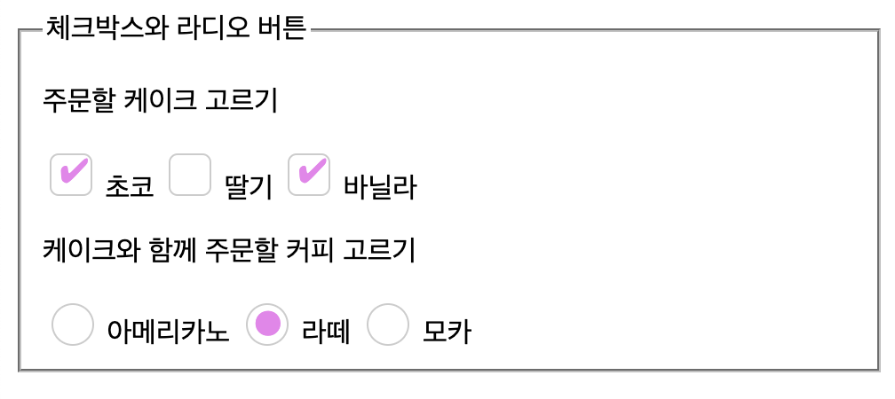

# 1. 역사

1995년 HTML2 표준이 form 요소를 도입하였다. 하지만 CSS는 1996년에 나왔고, 나온 이후에도 대부분의 브라우저가 이를 당장 지원하지는 않았다.

그리고 이미 브라우저들에서는 form 요소를 자체적으로 렌더링하고 있었기 때문에 초기에는 form 요소에 CSS를 적용 가능하게 하는 것에 의욕적이지 않았다. 

하지만 시간이 지나면서 form 요소들도 몇몇을 제외하고는 대부분 스타일링 가능하게 되었다.

물론 color picker와 같이 CSS만으로는 스타일링하기 힘든 것들도 아직 있다. CSS로 쉽게 스타일링할 수 있는 것부터 시작해서, form 요소들의 스타일링을 정복해보자.

# 2. 사전 작업

CSS 폰트 관련 CSS는 어떤 요소에서든 쉽게 사용할 수 있다. 하지만 몇몇 폼 요소에서 `font-family`와 `font-size`를 부모로부터 상속하지 않는 브라우저들이 있다. 많은 브라우저가 이 요소들에서 시스템의 기본 폰트를 사용하도록 한다.

따라서 다음처럼 폼 요소들의 스타일을 지정해 준다.

```css
button,
input,
select,
textarea {
  font-family: inherit;
  font-size: 100%;
}
```

`<input type="submit">`이 예외적으로 `font-family`를 상속하지 않는 브라우저가 있다. 이런 부분을 대비하기 위해서는 `<button>` 태그를 사용하자.

그리고 각 폼 요소들은 각자의 기본적인 테두리, 패딩, 마진 규칙이 있기 때문에 이를 초기화해주는 것도 좋다. 물론 시스템의 기본 스타일을 사용하는 게 좋은지 아니면 커스텀하는 게 좋은지는 많은 토의가 있기 때문에 어느 정도는 개발자의 결정이다.

```css
input,
textarea,
select,
button {
  padding: 0;
  margin: 0;
  box-sizing: border-box;
}
```

## 2.1. appearance

이 CSS는 운영체제에 기반한 UI의 기본 스타일을 적용할지를 결정한다.

```css
appearance: none;
appearance: auto;
```

보통은 `none` 값으로만 지정할 것이다. 이렇게 지정하면 시스템의 스타일링을 무력화하고 내가 원하는 스타일링을 적용할 수 있다. 아예 디자인을 백지로 만드는 거라고 생각하면 된다.

# 3. 스타일링 - 분류

다음과 같은 요소들은 쉽게 스타일링할 수 있다.

`<form>`, `<fieldset>`, `<legend>`, `<input>(type="search" 제외)`, `<textarea>`, `<button>`, `<label>`, `<output>`

체크박스와 라디오버튼, `<input type="search">`는 스타일링하려면 약간 복잡한 CSS를 써야 한다. `<select>`와 일부 input type들은 브라우저마다 매우 다른 기본 스타일을 가지고 있고 어느 정도 스타일링이 가능하지만 원천적으로 스타일링 불가능한 부분들도 있다.

상황에 따라서는 스타일링이 상대적으로 쉬운 다른 컴포넌트들을 이용해서 같은 기능을 구현하는 게 더 나은 선택일 수 있다. 하지만 브라우저별로 생길 약간의 차이를 감수할 수 있다면 크기, 배경 등의 몇 가지 스타일링은 할 수 있다.

쉽게 할 수 있는 요소들은 넘어가고, 어려운 것들만 알아보자. 그리고 우리가 무엇을 할 수 있고 무엇을 할 수 없는지 알아보자.

# 4. search box 스타일링

검색 박스를 보자.

```html
<input type="search" />
```

사파리에서는 이러한 검색 박스에 대해 몇 가지 스타일링 제한이 있다. 가령 높이나 글씨 크기를 마음대로 바꿀 수 없다.

이를 해결하기 위해서는 `appearance` 속성을 `none`으로 지정해야 한다. 이렇게 하고 나서 스타일링해주면 된다.

```css
input[type="search"] {
  appearance: none;
}
```

혹은 border나 background CSS를 지정해주는 것도 이런 스타일링 제한 문제를 해결하는 방법이다.

# 5. 체크박스, 라디오버튼 스타일링

체크박스, 라디오버튼의 사이즈는 기본적으로 조절이 안 되도록 되어 있다. 이를 조절하려고 할 시 브라우저에서 해당 요소를 어떻게 렌더링하는지는 브라우저마다 매우 다르다.

조절할 수 있는 건 활성화되었을 때의 색 정도인데, 이는 `accent-color` CSS 속성을 통해서 조절할 수 있다. 하지만 본격적으로 스타일을 바꾸려고 하면 `appearance` 속성을 `none`으로 지정하고 처음부터 스타일링을 해야 한다.

먼저 예시 HTML을 다음과 같이 작성하였다.

```html
<form>
  <fieldset>
    <legend>체크박스와 라디오 버튼</legend>
    <p>
      주문할 케이크 고르기
    </p>
    <input type="checkbox" name="cake" value="choco" id="choco" />
    <label for="choco">초코</label>
    <input type="checkbox" name="cake" value="strawberry" id="strawberry" />
    <label for="strawberry">딸기</label>
    <input type="checkbox" name="cake" value="vanilla" id="vanilla" />
    <label for="vanilla">바닐라</label>

    <p>
      케이크와 함께 주문할 커피 고르기
    </p>

    <input type="radio" name="coffee" value="americano" id="americano" />
    <label for="americano">아메리카노</label>
    <input type="radio" name="coffee" value="latte" id="latte" />
    <label for="latte">라떼</label>
    <input type="radio" name="coffee" value="mocha" id="mocha" />
    <label for="mocha">모카</label>
  </fieldset>
</form>
```

기본적으로 appearance 속성을 none으로 지정.

```css
input[type="checkbox"],
input[type="radio"] {
  appearance: none;
}
```

이러면 체크박스 혹은 라디오버튼이 있어야 할 자리에 아무것도 뜨지 않는다. 이제 한번 스타일링을 해보자.

체크박스의 경우 체크가 된 박스에 체크 표시를, 라디오버튼의 경우 선택된 항목에 원을 그린다. 이를 구현하면 된다.

여러가지 방법이 있겠지만, `::before`를 사용하여 요소를 하나 만들고, 여기의 content에 유니코드를 넣어서 체크 여부에 따라 표시되고 아니고를 결정하도록 하였다.

레이아웃이 다시 계산되는 것을 막기 위해서 `display:none` 대신 `visibility: hidden`을 사용하였다. 다음과 같이 CSS를 작성한다. CSS를 깔끔하게 작성한다는 면에서도, 디자인 면에서도 그렇게 잘 짜인 코드는 아니다. 하지만 요점은 이런 식으로 체크박스와 라디오버튼을 기초부터 스타일링이 가능하다는 것이다.

```css
input[type="checkbox"],
input[type="radio"] {
  appearance: none;
  position: relative;
  width: 1.5rem;
  height: 1.5rem;
  border: 1px solid #ccc;
  cursor: pointer;
  vertical-align: -2px;
  color:violet;
}

input[type="checkbox"]::before,
input[type="radio"]::before {
  position: absolute;
  font-size: 1.2rem;
  right: 1px;
  top: -10px;
  visibility: hidden;
}

input[type="checkbox"]:checked::before,
input[type="radio"]:checked::before {
  visibility: visible;
}

input[type="checkbox"]{
  border-radius: 5px;
}

input[type="radio"]{
  border-radius: 50%;
}

input[type="checkbox"]::before {
  content: "✔";
  top: -2px;
}

input[type="radio"]::before {
  content: "●";
  font-size: 2rem;
}
```

이렇게 스타일링한 결과는 다음과 같다.



# 6. select

select의 스타일링에 문제되는 부분은 2가지가 있다. 이를 알아보기 위해서 먼저 커피를 고르는 select 요소를 한번 만들어 보자.

```html
<form>
  <fieldset>
    <legend>Select</legend>
    <label for="coffeeSelection">커피 고르기</label>
    <select id="coffeeSelection">
      <option value="americano">아메리카노</option>
      <option value="latte">라떼</option>
      <option value="mocha">모카</option>
    </select>
</form>
```

첫째는 select가 드롭다운으로 작동함을 나타내는 화살표를 스타일링하는 부분이다. 이 화살표는 브라우저마다 다르며 select 박스의 크기가 변할 때마다 바뀌거나 이상하게 리사이징될 수 있다.

이 문제는 `appearance: none`으로 기본 화살표를 없앤 후 새로 만드는 것으로 어느 정도 해결할 수 있다. 하지만 따로 화살표 아이콘을 사용하고 싶다든가, 화살표 영역까지 클릭하도록 하는 등의 조작이 필요하다면 순수 CSS로는 무리이며 JS를 사용하거나 select에 해당하는 요소를 직접 제작해야 한다.

우리가 할 수 있는 것을 해보자. 일단 아이콘을 없애기 위해 `appearance: none`을 지정한다. 그러면 화살표 아이콘과 마진 등이 사라진다.

그다음 직접 아이콘을 만들자. 이를 위해서 `::before`과 `::after`를 사용할 것인데 그러려면 div 등의 태그로 select의 래퍼를 만들어 주어야 한다. 

이는 `::after`와 같은 요소들은 요소의 포매팅 박스에 상대적으로 배치되는데 select는 [replaced element](https://developer.mozilla.org/en-US/docs/Web/CSS/Replaced_element)처럼 작동하여 document style이 아니라 브라우저에 의해서 배치되고 따라서 이러한 포매팅 박스를 가지고 있지 않기 때문이다.

래퍼를 만들어 주고 여기에 `::after`를 적용해서 스타일링하자.

```html
<form>
  <fieldset>
    <legend>Select</legend>
    <label for="coffeeSelection">커피 고르기</label>
    <div class="select-wrapper">
      <select class="select" id="coffeeSelection">
        <option value="americano">아메리카노</option>
        <option value="latte">라떼</option>
        <option value="mocha">모카</option>
      </select>
    </div>
</form>
```

```css
select{
  appearance:none;
  width:100%;
  height:100%;
}

.select-wrapper{
  position:relative;
  width:100px;
  height:30px;
}

.select-wrapper::after{
  content: "▼";
  font-size: 1rem;
  top: 6px;
  right: 10px;
  position: absolute;
  color: violet;
}
```

이러면 아래 방향의 삼각형 화살표가 보라색으로 새로 생긴다.

두번째 문제는 select를 눌렀을 때 나오는, option들이 들어간 박스를 커스텀할 수 없다는 문제이다. 부모로부터 폰트는 상속하도록 할 수 있지만 간격이나 글씨 색상 등을 조절할 수는 없다. 참고로 이는 `<datalist>` 태그에 대해서도 마찬가지다.

이 부분은 `<select>` 요소에서 해결할 수 없다. 이 부분을 해결하고 싶다면 커스텀 select를 지원하는 라이브러리를 쓰거나, 선택 상자를 직접 만들어야 한다.

# 7. file input

```html
<form>
  <fieldset>
    <legend>File Input</legend>
    <label class="fileInputLabel" for="fileInput">파일 고르기</label>
    <input type="file" id="fileInput" />
  </fieldset>
</form>
```

file input의 문제는 파일 탐색기를 여는 버튼이 완전히 스타일링 불가능하다는 것이다. 사이즈 조절이나 색, 폰트조차 변경이 불가능하다.

따라서 이를 스타일링하기 위해서는 input의 label도 input과 연관되어 작동한다는 것을 이용하자. input에 대응되는 label을 스타일링하고, input을 숨겨버리자.

label에 class를 준 것에 주의하자.

```css
input[type="file"]{
  display: none;
}

.fileInputLabel{
  box-shadow: 1px 1px 3px #ccc;
  border: 1px solid #ccc;
  border-radius: 3px;
  text-align: center;
  line-height: 1.5;
  padding: 10px 20px;
}

.fileInputLabel:hover{
  cursor: pointer;
  background-color: #eee;
}
```

이러면 못생긴 파일 올리기 버튼이 아니라 `파일 고르기`라고 쓰인 흰색 버튼이 나오고 그걸 눌렀을 때 파일 탐색기가 뜨는 것을 볼 수 있다.

# 8. range input

range input의 bar를 스타일링하는 건 쉬운 일이지만 handle을 스타일링하는 건 매우 어렵다. 다음과 같은 HTML을 먼저 보자.

```html
<form>
  <fieldset>
    <legend>Range Input</legend>
    <label class="rangeLabel" for="range">범위 입력기</label>
    <input type="range" id="range" />
  </fieldset>
</form>
```

그리고 bar는 다음과 같이 스타일링할 수 있다.

```css
input[type="range"]{
  appearance: none;
  background: violet;
  height:3px;
  padding: 0;
  border:1px solid transparent;
}
```

이렇게 하면 범위 입력은 보라색 bar에서 이루어지게 된다. handle을 스타일링하려면 `::-webkit-slider-thumb `과 같은 브라우저에서 자체적으로 지원하는 의사 요소를 사용해야 한다. 

이다음 CSS는 [Styling Cross-Browser Compatible Range Inputs with CSS](https://css-tricks.com/styling-cross-browser-compatible-range-inputs-css/)를 참고하여 작성되었다.

```css
/* range input bar
크로스 브라우징을 위해서는
::webkit-slider-runnable-track
::-moz-range-track
::-ms-track 등에도 같은 속성 적용
*/
input[type="range"]{
  appearance: none;
  background: red;
  height: 2px;
  padding:0;
  border:1px solid transparent;
}

/* range input의 thumb(handle) - Webkit */
/*
firefox는 ::-moz-range-thumb
IE는 ::-ms-thumb
*/
input[type="range"]::-webkit-slider-thumb {
  appearance: none;
  border:none;
  height: 20px;
  width: 15px;
  border-radius: 3px;
  background: palevioletred;
  cursor: pointer;
  box-shadow: 1px 1px 1px #000000, 0px 0px 1px #0d0d0d;
}
```

# 9. 스타일링이 불가능한 요소들

## 9.1. date input

input 태그의 `type="datetime-local"`, `type="time"`, `type="week"`, `type="month"`와 같이 날짜와 시간을 입력하는 input들은 다른 input과 같이 기본 input box 스타일링은 쉽다. 박스의 크기, 색깔 등 말이다.

하지만 input을 클릭시 나오는 datepicker, timepicker는 아예 스타일링을 따로 할 수 없고, 브라우저마다 기본 스타일링이 조금씩 다르며 `appearance:none`으로 스타일링을 제거할 수도 없다.

따라서 picker 부분을 스타일링하고 싶다면 직접 이를 만들어야 한다.

## 9.2. number input

number input은 spinner를 기본적으로 제공하고, 이는 위의 date input과 같은 문제로 스타일링이 불가능하다. 

하지만 데이터가 숫자로 제한되는 비슷한 input인 `type="tel"`을 사용하면 된다. 이를 쓰면 같은 text input을 제공하면서 숫자로 데이터를 제한하고, 모바일 디바이스에서 숫자 키패드를 제공한다.

## 9.3. color input

border, padding 등은 없앨 수 있지만 color picker는 원천적으로 스타일링 불가능하다.

## 9.4. meter, progress

이 요소들은 잘 쓰이지도 않으면서 스타일링은 끔찍하게 어렵다. 이걸 스타일링하는 것보다는 직접 비슷한 요소를 만드는 게 좋은 선택이다.

이런 요소들을 위해 커스텀 요소를 직접 만드는 법을 이후에 다룰 것이다.

# 10. 의사 클래스 셀렉터를 이용한 스타일링

CSS를 다뤄보았다면 `:hover`, `:focus`와 같은 의사 클래스 셀렉터에 대해서는 이미 알고 있을 것이다. 그러나 폼 요소들에 쓰이는 다른 의사 클래스 셀렉터들도 있다. 이들을 사용례를 통해서 알아보자.

## 10.1. 필수 제출 요소 나타내기

회원가입 요소를 만든다고 가정하자. 이때 필수로 제출해야 하는 요소들이 있다. 이를 나타내기 위해서는 `required` 속성을 사용한다.

```html
<form>
  <fieldset>
    <legend>회원 가입</legend>
      <div>
        <label for="email">Email</label>
        <input type="email" id="email" required/>
      </div>
      <div>
        <label for="password">Password</label>
        <input type="password" id="password" required/>
      </div>
      <div>
        <label for="password-check">Password 확인</label>
        <input type="password" id="password-check" required />
      </div>
      <div>
        <label for="name">이름</label>
        <input type="text" id="name" />
      </div>

      <div>
        <label for="birth">생년월일</label>
        <input type="date" id="birth" />
      </div>
      
      <button type="submit">회원가입</button>
  </fieldset>
</form>
```

이러면 `:required`와 `:optional` 의사 클래스 셀렉터를 사용할 수 있다. 이를 통해서 필수 제출 요소와 선택 제출 요소를 구분할 수 있다.

```css
input:required{
    border: 1px solid green;
}

input:optional{
    border: 1px solid red;
}
```

이렇게 하면 필수 제출 요소는 초록색 테두리가 생기고, 선택 제출 요소는 빨간색 테두리가 생긴다. 하지만 이렇게 하면 접근성도 떨어지고, 필수 제출 요소를 나타내는 일반적인 컨벤션은 `*`을 사용하거나 `required`라는 텍스트를 붙이는 것임을 생각할 때 그렇게 좋은 방식도 아니다.

따라서 `::after` 의사 요소를 이용하여 필수 제출 요소를 나타내는 것이 좋다.

일단 `::after`의사 요소는 요소의 box에 상대적으로 배치되는데 input 요소도 replaced element에 가깝게 동작하기 때문에 box가 없고 따라서 `::after`를 제대로 사용하기 위한 span을 더해주자. 이를테면 다음과 같이.

```html
<div>
  <label for="email">Email</label>
  <input type="email" id="email" required/>
  <span></span>
</div>
```

그리고 다음과 같이 필수 제출 요소의 뒤에 오는 span 요소에 `::after`를 사용하여 `required`문구를 추가할 수 있다. 배치에는 `position: absolute`를 사용하였다.

```css
input:required{
    border: 1px solid green;
}

input:optional{
    border: 1px solid red;
}

input + span {
  position: relative;
}

input:required + span::after {
  font-size: 0.7rem;
  position: absolute;
  content: "required";
  color: white;
  background-color: black;
  padding: 2px 10px;
  left: 10px;
}
```

이러면 좀 못생긴 `required`라는 텍스트가 필수 제출 요소 뒤에 나타나게 된다.


## 10.2. 데이터 유효성 스타일링

https://developer.mozilla.org/en-US/docs/Web/HTML/Constraint_validation

폼 요소의 데이터가 유효한지에 따라 스타일링하는 것도 자주 쓰인다. HTML5에서 도입된 새로운 input type들로 인해 유효성 검증도 좀더 쉬워졌다.

예를 들어서 `<input type="email">`의 경우 이메일 형식이 아니면 데이터가 유효하지 않다고 판단할 수 있다. 이런 경우 `:valid`와 `:invalid` 의사 클래스 셀렉터를 사용할 수 있다.

이 역시 다른 셀렉터들과 같이 사용할 수 있는데, 예를 들어 `::after`를 이용해서 현재 유효 상태를 나타낼 수 있다. 이를 제대로 쓰기 위해서 위에서 했던 것처럼 빈 `<span>`태그를 사용했다.

```css
input + span {
  position: relative;
}

input + span::before{
  position: absolute;
  right: -20px;
}

input:invalid{
  border: 1px solid red;
}

input:invalid + span::before{
  content: "✖";
  color: red;
}

input:valid + span::before {
  content: "✓";
  color: green;
}
```

비슷한 의사 클래스로 `:in-range`, `:out-of-range`가 있다. `min`, `max` 속성을 갖는 numeric input에서 유효성 검사에 따른 스타일링에 쓸 수 있다. `:valid`와 비슷하게 쓰이지만 사용자에게 '유효하지 않은 숫자'라는 것보다 더 많은 정보를 제공해서 사용자 경험을 향상시키고 싶을 때 쓸 수 있다.

## 10.3. 폼 요소의 상태에 따른 스타일링

활성화 상태인 폼 요소에만, 혹은 비활성화 상태인 폼 요소에만 스타일링을 할 때 `:enabled`와 `:disabled` 의사 클래스 셀렉터를 사용할 수 있다.

예를 들어서 이미 제출된 정보에 대해서 요소를 disabled 처리한 후 `:disabled` 셀렉터로 비활성화된 요소를 스타일링할 수 있다.

비슷하지만 다른 용도로 `:read-only` 셀렉터가 있다. 사용자가 편집할 수는 없지만 폼이 제출될 때 함께 제출되기는 하는 요소를 스타일링한다. 반대되는 의사 클래스 셀렉터로 `:read-write`가 있다.

폼 요소 중에 `disabled` 나 `readonly`를 설정할 수 있는 것들이 있는데 이들에 쓴다. 기본값에 해당하는 `:enabled`와 `:read-write`는 잘 사용되지 않는 셀렉터이다.

## 10.4. 기타 의사 클래스 셀렉터

다음 의사 클래스 셀렉터들은 유용할 수도 있지만 브라우저 지원이 제대로 되지 않을 수 있다.

focus상태인 요소가 내부에 있는지를 판단하는 `:focus-within`, 키보드 조작을 통해서 focus된 요소를 판단하는 `:focus-visible` 등의 의사 클래스 셀렉터도 있다.

`:placeholder-shown`은 placeholder가 보이는지를 판단하는 의사 클래스 셀렉터이다. 이를 이용해서 placeholder가 보이는 동안은 다른 스타일을 적용할 수 있다.

자식이 없는 요소를 선택하는 `:empty`도 있다.

# 11. 커스텀 요소

기존의 폼 요소들이 부족하게 느껴질 때가 있을 수 있다. 혹은 나만의 어떤 양식 요소를 만들고 싶을 수도 있고. 이럴 때는 커스텀 요소를 만들어서 사용할 수 있다.

따라서 스타일링이 정말 힘든 요소 중 하나인 `<select>`를 커스텀해 보면서 어떻게 커스텀 요소를 만들고 사용하는지 알아보자.

이를 위해서는 기존의 폼 요소가 어떻게 동작하는지를 살펴보는 게 큰 도움과 참고가 된다는 걸 기억하자.

https://developer.mozilla.org/en-US/docs/Learn/Forms/How_to_build_custom_form_controls#design_structure_and_semantics

## 11.1. 분석

기존 `<select>` 요소는 마우스 혹은 키보드로 사용할 수 있어야 하고 스크린 리더와도 호환 가능해야 한다. 이를 조건으로 `<select>`의 동작에 대한 분석을 해보자.

`<select>`는 다음과 같은 경우 normal state이다.

- 처음 로딩될 때
- active였다가 사용자가 외부를 클릭했을 때
- active였다가 사용자가 키보드로 다른 곳을 focus했을 때

`<select>`는 다음과 같은 경우 active state이다.

- 사용자가 요소를 클릭했거나 터치스크린에서 터치했을 때
- 사용자가 키보드로 요소를 focus했을 때
- 요소가 open 상태였다가 사용자가 클릭했을 때

`<select>`는 다음과 같은 경우 open state이다.

- 다른 어떤 상태에 있다가 사용자가 클릭했을 때

그리고 언제 요소의 선택값이 바뀌는지도 분석해야 한다. 물론 UI적으로 들어가면 위/아래 방향키 반응 등 분석할 게 수도 없겠지만...일단은 분석이 중요하다는 것 정도만 보고 넘어가자.

만약 정말 새로운 요소를 만들어야 한다면 모든 경우에 대한 대응과 분석이 정말 중요해진다. 새로운 요소를 만드는 건 정말 쉽지 않다! 이왕이면 새로운 상호작용 요소를 만들지 말자.

## 11.2. 기초 구조

다음과 같이 기초 구조를 잡고 클래스명으로 각각의 역할을 나타냈다.

```html
<h1>메뉴를 골라보자</h1>
<div class="select" tabindex="0">
  <span class="value">아메리카노</span>
  <ul class="option-list">
    <li class="option">카페라떼</li>
    <li class="option">카페모카</li>
    <li class="option">카푸치노</li>
    <li class="option">바닐라라떼</li>
    <li class="option">헤이즐넛라떼</li>
    <li class="option">카라멜마끼아또</li>
  </ul>
</div>
```