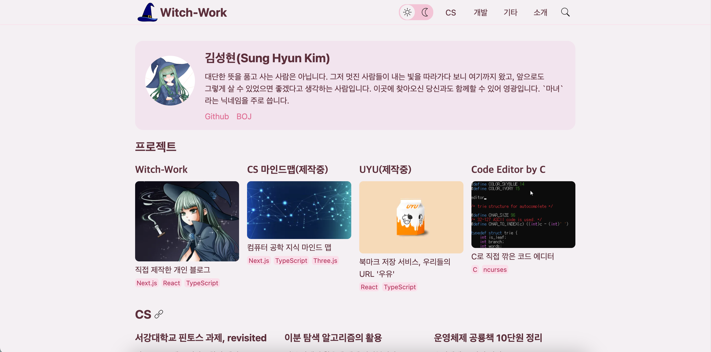

# 1. img 태그로 반응형 이미지

HTML에서 img 태그는 이미지를 넣는 데에 사용된다. 거의 필수적인 속성만 넣어서 사용하면 다음과 같이 사용하게 될 것이다.

```html

```

그런데 메모리 절약, 화면 크기에 따른 강조 부분 차이 등으로 인해서 화면 크기에 따라 다른 이미지를 보여주도록 브라우저에 지시하게 될 경우가 있다. 이른바 반응형 이미지라는 것이다.

물론 이럴 때 CSS를 이용할 수 있을 것이다. 가령 이미지를 표시하는 것을 div 컨테이너로 바꾼 후 화면 너비에 따라서 `background-image`를 바꿔 준다든지.

```css
@media screen and (max-width: 600px) {
  .profile {
    background-image: url("assets/profile-small.png");
  }
}

@media screen and (min-width: 600px) {
  .profile {
    background-image: url("assets/profile-large.png");
  }
}
```

하지만 HTML로도 이러한 동작을 할 수 있다. 이는 브라우저가 페이지를 불러오기 시작할 때 CSS,JS를 해석하기 전 미리 HTML을 로드하기 때문에 페이지 로딩 시간을 단축시켜준다는 장점도 있다. 

만약 CSS나 JS로 반응형 이미지를 구현했다면, 화면 크기에 따라 처음부터 다른 이미지를 로드할 수가 없다. 메인 파서에는 CSS, JS를 로드하고 해석하기 전에 이미지를 먼저 다운로드하는 최적화 기법이 적용되어 있다.

따라서 이미지를 로드하는 시점에 CSS, JS가 없기 때문이다. 고로 브라우저는 미리 로드한 이미지를 보여주고, CSS, JS가 로드되면 이미지를 교체하게 된다. 

이는 이미지를 로드하는 시간을 늘리게 된다. 즉 HTML을 이용해야 화면 크기에 따라 다른 이미지를 로드하도록 할 수 있다. 그럼 어떻게 해야 HTML을 이용해서 반응형 이미지를 넣을 수 있을까?

# 2. img 태그

img의 srcset, sizes라는 새로운 속성을 사용하는 게 하나의 방법이다. 이때 srcset 속성에 들어가는 파일명은 브라우저가 지원하는 이미지 포맷 파일로만 지정할 수 있다.

가장 대표적인 예시는 다음과 같다.

```html

```

하지만 매우 다양한 방법이 있으므로 하나하나 알아보자.

## 2.1. 해상도에 따라 이미지 선택

다양한 해상도의 화면을 지원해야 하는데 고정 사이즈의 이미지를 나타내야 한다면 sizes 속성을 쓰지 않고 `2x`와 같은 서술자를 사용해 브라우저가 적절한 해상도 이미지를 선택하게 할 수 있다.

이런 `2x`같은 값을 display density descriptor라고 한다. 이는 브라우저가 이미지를 로드할 때 기기의 픽셀 밀도를 확인하고, 그에 맞는 이미지를 선택하게 한다.

```html

```

브라우저는 보이는 해상도가 얼마인지 확인하고 srcset의 이미지들 중 가장 적합한 이미지를 제공할 것이다.

그런데 이런 해법은 꽤 유동적인 크기를 가진 이미지를 사용할 때 문제가 생긴다. 앞서 `고정 사이즈 이미지를 나타내야 한다면` 이라는 단서를 붙인 이유가 있다.

수많은 해상도를 지원해야 하는 경우 `1x`에서 `16x`까지쯤 되는 종류들의 이미지를 모두 srcset에 넣어줘야 하는가?

브라우저 창이 옆으로 늘어나면서 이미지를 보여줘야 하는 해상도가 엄청나게 많이 변하면 어쩔 것인가? 이미지를 몇 개씩이나 로드하게 되는 문제가 생길 수 있다.

혹은 [아이폰6플러스의 다운샘플링](https://www.paintcodeapp.com/news/iphone-6-screens-demystified)과 같은 이슈가 있을 경우 `2x`이상의 이미지를 제공하고도 브라우저가 `1x`급의 이미지를 제공할 수도 있다.

따라서 이렇게 display density descriptor를 통해서 브라우저가 이미지를 선택하게 하는 방식은 고정폭 이미지를 사용할 경우에 권장된다.

## 2.2. width descriptor

그럼 유동적인 크기의 이미지를 사용할 때는 어떻게 해야 할까? 이때는 width descriptor와 sizes를 사용한다. 이는 이미지의 고유 픽셀 너비를 지정하는 것이다. 이제야 위의 예시 코드를 이해할 수 있겠다.

```html

```

srcset은 사용할 이미지 목록과 그 크기를 정의한다. 이미지 파일명/경로와 이미지의 고유 픽셀 너비를 공백으로 구분해서 표기한다. 이때 고유 픽셀 너비란 이미지의 실제 규격 너비를 의미한다. 

이는 브라우저에게 이미지의 실제 규격이 어느 정도라고 알려주는 용도이다. 맥과 같은 경우 이미지 파일 정보에서 이미지 규격을 확인할 수 있는데 거기서 나오는 너비이다.

가령 위와 같이 이미지 고유 픽셀 너비를 320w로 표기했다면 이미지의 실제 규격의 너비가 320px라는 뜻이다.

sizes에서는 미디어 쿼리와 해당 미디어 쿼리에 따라 이미지가 어느 정도 너비를 채우게 될지를 정의한다. 위의 예시 코드에서의 경우 앞의 값은 최대 320px의 화면일 때 이미지가 280px를 채우도록 한다는 것이다.

### 2.2.1. sizes의 용도

그런데 왜 우리는 sizes 속성을 통해서 이미지가 어느 정도의 너비를 채우게 될지를 정의해 줘야 하는 걸까? 브라우저에게 srcset의 width descriptor를 통해서 이미지의 실제 너비까지 알려 줬는데 브라우저가 알아서 이미지를 선택해서 로드하면 될 것 아닌가?

위에서 HTML로 반응형 이미지를 제공하는 것의 장점을 이야기하면서 말한 내용에 단서가 있다.

```
메인 파서에는 CSS, JS를 로드하고 해석하기 전에 이미지를 먼저 다운로드하는 최적화 기법이 적용되어 있다.
```

브라우저는 페이지를 로드할 때 먼저 HTML을 다운로드한다. 그리고 나서 CSS, JS를 요청하는데 이 CSS, JS의 로딩이 끝나기 전에 브라우저는 이미지를 다운로드하기 시작한다.

따라서 이미지가 다운로드되는 시점에 브라우저는 페이지의 레이아웃이 어떻게 될지에 대한 정보를 알지 못한다. 심지어 CSR을 할 경우 아예 HTML 구조조차 알지 못하는 시점에 브라우저는 이미지 다운로드를 시작하게 될 것이다. 

이 시점에 브라우저가 알 수 있는 건 뷰포트 너비뿐이다. 하지만 이는 이미지가 어느 정도 너비로 보이게 될지랑은 큰 관련이 없을 수 있다. 예를 들어서 내 블로그만 해도 프로젝트 사진들이 있는데, 이는 뷰포트 너비에 비해 매우 작은 부분을 차지한다. 뷰포트 너비가 아무리 커져도 약 210px 정도 너비의 이미지가 된다.



따라서 우리는 sizes 속성을 통해서 뷰포트 너비별로 해당 이미지가 어느 정도 크기로 보이게 될지 브라우저에 알려주는 것이다. 

```html
  sizes="(max-width:320px) 280px,
        (max-width:480px) 440px,
        800px"
```

이때 sizes에 넣을 이미지 너비는 px, em으로 된 절댓값이나 뷰포트 상댓값 vw를 사용해야 한다. %는 사용할 수 없다.

위의 경우 뷰포트 너비가 320px 이하일 때 이미지는 280px 너비를 채우고, 320px 초과 480px 이하일 때 이미지가 440px 너비를 채우고, 480px 초과일 때 이미지가 800px 너비를 채운다는 것이다.

## 2.3. 브라우저의 처리

이 속성들이 있을 때 브라우저는, 이미지를 로드할 때 뷰포트 너비를 확인한 후 참이 되는 미디어 조건문을 확인하고, 그 조건문에 해당하는 이미지의 너비(size에 있는 것)를 확인한다. 그리고 그 너비에 가장 가까운 이미지를 srcset에서 찾아서 로드한다.

이러한 기능은 최신 브라우저에서만 지원된다. srcset, sizes 속성을 지원하지 않는 낡은 브라우저를 위해서 src를 넣어줄 수 있다.

# 3. 아트 디렉션 문제와 picture

그런데 화면 크기에 따라 이미지가 나타내는 핵심을 보여주기 위해 다른 형태의 사진을 보여줘야 하는 경우가 있다. 화면이 작아지면 사람이 확대된 사진을 보여 주는 게 좋다든지 하는 경우이다. 이런 문제를 아트 디렉션 문제라고 한다.

이를 위해서는 picture 태그를 쓸 수 있다. picture 요소가 여러 source를 감싸도록 하여 브라우저가 고를 수 있는 소스들을 제공하는 것이다. picture 태그는 source 태그들을 자식으로 가지며 마지막 자식으로 img 태그를 가진다.

다양한 화면 크기에 따라 다른 이미지를 제공하려면 picture 태그를 쓰자.

```html
<picture>
  <source media="(max-width:768px)" srcset="img-480w.jpg">
  <source media="(max-width:1080px)" srcset="img-720w.jpg">
  
</picture>
```

source 태그에는 미디어 조건문이 있어서 특정 조건에 따라 다른 이미지를 보여줄 수 있도록 설정 가능하다.

브라우저는 source 태그들을 위에서부터 아래로 순서대로 확인하며, 조건문을 만족하는 첫 번째 source 태그의 srcset 경로의 이미지를 보여준다.

## 3.1. media 속성은 제안이 아닌 강요

이 media 속성은 아트 디렉션이 필요한 경우가 아니면 사용하지 않는 게 좋다. 

media 속성을 쓰게 되면 브라우저에 현재 브라우저 상태와 부합하는 미디어 쿼리를 가진 source 태그의 이미지를 사용하라고 강제하게 되기 때문이다. 최적화를 위해 브라우저가 다른 이미지를 선택하는 건 허용되지 않는다.

아트 디렉션을 위한 경우 그렇게 강제하는 게 맞지만 그렇지 않은 경우에는 브라우저가 알아서 최적의 이미지를 선택하게 하는 게 좋다.

이곳의 srcset에도 여러 이미지와 상응하는 sizes 속성을 제공할 수 있다. 그러나 그렇게 하려면 다양한 해상도의 사진도 여러 개씩 제공해야 하는데 그렇게 하는 일은 잘 없다.

그리고 마지막에 img 태그가 있는데, 이는 브라우저가 picture 태그를 지원하지 않을 때 혹은 참을 리턴하는 미디어 조건문이 없을 때 보여줄 이미지를 설정하는 것이다.

## 3.2. type 속성

source는 type속성 내에 MIME 타입을 명시하여 브라우저가 이미지를 로드하기 전에, 브라우저가 지원하지 않는 이미지 유형의 경우 거부할 수 있도록 한다. 

이는 webp등을 사용할 때 유용하다. 해당 타입 이미지를 지원하지 않는 브라우저들에게 이 파일 유형을 즉시 거부하도록 만들어 준다. 

이를 이용하면 개발자는 webp, avif과 같은, 용량 등에서 이점이 큰 최신 이미지 포맷을 부담없이 사용할 수 있게 된다. 만약 해당 이미지 포맷을 지원하지 않는 브라우저일 경우 바로 다음 source의 이미지를 로드하게 되기 때문이다.

```html
<picture>
  <source type="image/webp" srcset="img-480w.webp">
  <source type="image/jpeg" srcset="img-480w.jpg">
  
</picture>
```

이는 페이지가 여러 이미지 포맷을 지원하도록 할 때 유용하다.

# 참고

https://developer.mozilla.org/ko/docs/Learn/HTML/Multimedia_and_embedding/Responsive_images

https://developer.mozilla.org/ko/docs/Web/HTML/Element/img

https://brucelawson.co.uk/2015/why-we-cant-do-real-responsive-images-with-css-or-javascript/

https://cloudfour.com/thinks/responsive-images-101-part-4-srcset-width-descriptors/