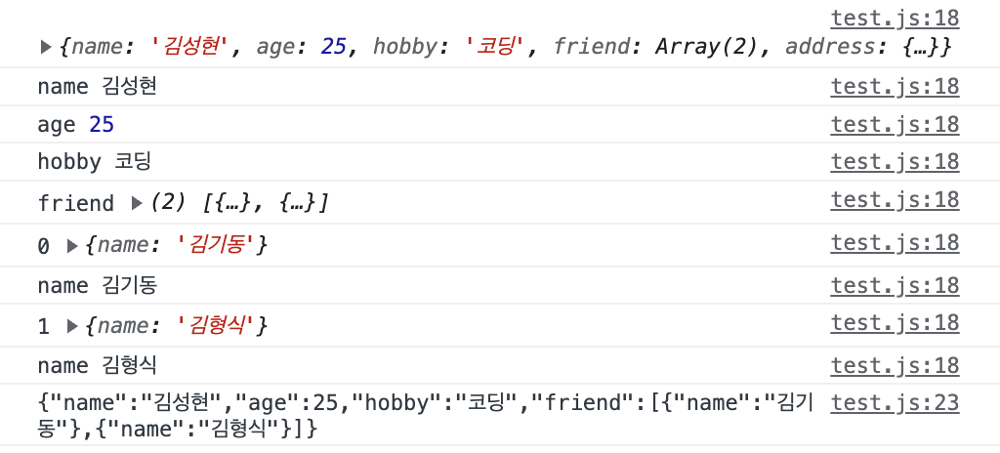

# 1. 맵과 셋

## 1.1. 맵

Map은 데이터를 키-값 형식으로 저장한다. 객체와 다른 점은 키에 다양한 자료형이 허용된다는 것이다. 객체도 키로 쓸 수 있다. 다음과 같은 메서드들이 있다.

- new Map()
- map.set(key, value) : 맵 스스로가 반환된다. 따라서 chaining도 가능
- map.get(key) : 키가 존재하지 않으면 undefined 반환
- map.has(key)
- map.delete(key)
- map.clear()
- map.keys()
- map.values()
- map.entries()

그리고 size 프로퍼티가 있어 맵의 크기를 알 수 있다.

이때 `map[key]`를 이용해서 값을 가져오거나 설정하는 것도 가능하다. 하지만 그렇게 하면 맵이 일반 객체처럼 취급되게 되므로 get, set을 쓰자.

그리고 맵은 삽입한 순서대로 순회를 실시한다. forEach도 지원한다.

### 1.1.1. 객체와 맵

`Object.entries(obj)`를 이용하면 객체를 맵으로 바꿀 수 있다. 이 메서드는 객체의 키-값 쌍을 배열로 반환하는데 이 배열을 맵의 생성자에 넣으면 맵이 만들어진다.

그리고 `Object.fromEntries(map)`를 이용하면 맵을 객체로 바꿀 수 있다. 이 메서드는 각 요소가 [키, 값]인 배열을 받아 객체를 만든다. 따라서 map.entries()를 Object.fromEntries에 넣으면 맵을 객체로 바꿀 수 있다.

## 1.2. 셋

셋은 중복을 허용하지 않는 값의 집합이다. 셋은 중복을 허용하지 않는다는 점에서 맵과 비슷하지만 키-값 쌍이 아니라 단순히 값만 저장한다는 점에서 다르다. 셋은 다음과 같은 메서드들을 지원한다.

이때 셋은 중복을 허용하지 않으므로 같은 값을 여러 번 삽입해도 한 개만 저장된다.

- new Set(iterable)
- set.add(value) : 셋 스스로가 반환된다. 따라서 chaining도 가능
- set.delete(value)
- set.has(value)
- set.clear()
- set.keys()
- set.values() : set.keys()와 같다. 맵과의 호환성을 위해 존재한다.
- set.entries() : 맵과의 호환성을 위해 존재한다. [value,value] 형태로 반환한다.

for..of, forEach도 지원한다.

또한 Array.from을 이용해 셋을 배열로 바꿀 수 있다.

* 이때 맵과 셋의 keys, values 메서드는 배열이 아니라 iterable 객체를 반환한다. 즉 배열 메서드를 사용할 수 없다. 따라서 배열로 바꾸려면 Array.from을 이용해야 한다.

## 1.3. 위크맵과 위크셋

위크맵과 위크셋은 맵과 셋과 비슷하지만 차이점이 있다. 위크맵과 위크셋은 객체만 저장할 수 있고, 객체가 아닌 원시값은 저장할 수 없다. 

또한 위크맵과 위크셋을 쓰면 키로 쓰인 객체가 가비지 컬렉션의 대상이 된다. 즉 위크맵, 위크셋의 키로 사용된 객체를 참조하는 것이 아무것도 없다면 해당 키 객체가 삭제된다.

위크맵과 위크셋은 다음과 같은 메서드를 지원한다. keys와 같은 메서드, size와 같은 프로퍼티를 지원하지 않는 것은 가비지 컬렉션 때문이다. 

가비지 컬렉션이 언제 수행될지 알 수 없기 때문에 현재 위크맵/위크셋이 어떤 키를 가지고 있는지 그리고 그 개수가 몇 개인지 등을 알 수 없는 것이다.

- new WeakMap()
- weakMap.set(key, value)
- weakMap.get(key)
- weakMap.delete(key)
- weakMap.has(key)

- new WeakSet()
- weakSet.add(value)
- weakSet.delete(value)
- weakSet.has(value)

이런 위크맵, 위크셋은 외부 코드에 속한 객체에 대해 어떤 속성을 부여해 줘야 할 때 쓰일 수 있다. 외부 객체가 사라질 때 자동으로 거기 연관된 속성도 사라지는 것이다.

# 2. keys, values, entries

keys(), values(), entries() 메서드는 맵, 셋, 배열 객체에 사용될 수 있다. 일반 객체를 위한 비슷한 기능은 다음과 같다.

- Object.keys(obj) : 객체의 키를 배열로 반환한다.
- Object.values(obj) : 객체의 값들을 배열로 반환한다.
- Object.entries(obj) : 객체의 [키, 값] 쌍을 배열로 반환한다.

이때 맵, 셋, 배열 객체의 keys와 같은 메서드는 배열과는 다른 이터러블 객체를 반환하지만 일반 객체의 Object.keys는 진짜 배열을 반환한다. 따라서 Object.xxx 메서드의 반환값에는 for..of를 쓸 수 있다. 여기서 위 메서드들은 객체의 프로퍼티 중 심볼형 키를 무시한다는 점에 주의하자.

js에선 복잡한 구조들이 모두 객체에 기반하다 보니 객체에 따로 keys, values, entries 메서드들이 만들어질 수 있다. 따라서 일반 객체를 위한 방법으로 Object.keys, Object.values, Object.entries를 만든 것이다.

## 2.1. 객체에 배열 메서드 쓰기

배열 전용인 map, filter와 같은 메서드는 객체에 사용할 수 없다. 사용하기 위해서는 다음과 같이 한다.

```js
let prices = {
  apple: 0.67,
  orange: 1.49,
  banana: 0.39,
  grape: 2.79,
  pear: 1.29,
};

// Object.entries를 써서 키-값을 요소로 갖는 배열을 만들고 filter 적용
let overOneBill = Object.entries(prices).filter(
  ([key, value]) => value > 1.0
);
// Object.fromEntries를 써서 키-값을 요소로 갖는 배열을 다시 객체로 만듦
overOneBill = Object.fromEntries(overOneBill);
console.log(overOneBill);
```

# 3. 구조 분해 할당

## 3.1. 배열 구조 분해 할당

구조 분해 할당은 객체 혹은 배열을 변수로 분해해서 할당하거나 함수에 전달하게 해 준다. `[]`를 쓰면 된다.

```js
let blog = ["witch", "work"];
let [first, second] = blog;
console.log(first, second); //witch work
```

이때 필요 없는 요소를 버리기 위해서 쉼표를 사용해 요소를 무시할 수 있다.

```js
let myName = ["김", "성", "현"];
let [first, , third] = myName; //2번째 원소는 생략되었다
console.log(first, third);
```

또한 할당 연산자 우측에는 for..of로 반복 가능한 모든 객체가 올 수 있다. 그리고 좌측에는 할당할 수 있는 거라면 뭐든지 올 수 있다. 객체 프로퍼티도 가능하다.

예를 들어서 문자열도 반복 가능한 객체이므로 구조 분해 할당 가능하다.

```js
let [first, second] = "hi";
console.log(first, second); //h i
```

구조 분해 할당은 반복에서도 사용할 수 있다.

```js
let me = {
  name: "김성현",
  age: 26,
  hobby: "코딩",
};

// me의 프로퍼티들이 [키, 값] 형태로 담긴 배열이 반환됨
console.log(Object.entries(me));
// Object.entries(me)의 결과를 순회하며 각각의 키와 값을 출력함
for (let [k, v] of Object.entries(me)) {
  console.log(k, v);
}
```

이때 만약 할당하려는 변수 개수가 배열의 길이보다 크더라도 에러는 발생하지 않는다. 단 넘치는 변수에는 undefined가 할당된다. 다만 이를 방지하기 위해 `=`를 이용해 기본값을 설정해 줄 수 있다. 

구조 분해 할당에서 변수에 할당해줄 값이 없는 경우 기본값이 할당된다. 할당해줄 값이 있으면 기본값은 할당되지 않는다.

```js
let arr = ["김성현"];

let [first = "1", second = "2"] = arr;
// 김성현 2
console.log(first, second);
```

## 3.2. 객체 구조 분해 할당

객체를 구조 분해 할당할 땐 `{}`를 쓴다. 우측엔 분해하려는 객체를, 좌측엔 해당하는 객체 프로퍼티의 패턴을 넣는다. 다음과 같이 쓰는 것이다.

```js
let me = {
  name: "김성현",
  age: 26,
  hobby: "코딩",
};
/* 해당하는 이름의 키를 갖는 프로퍼티가 할당되므로 순서는 상관없다.
let {age, name, hobby} 로 써도 결과는 같음 */
let { name, age, hobby } = me;
// 김성현 26 코딩
console.log(name, age, hobby);
```

그런데 객체의 프로퍼티 값을 저장하고자 하는 변수 이름이 프로퍼티 키와 다를 수도 있다. 그럴 경우 `:`를 쓰면 된다. `프로퍼티 키: 변수 이름` 형태로 쓰면 된다.

```js
let me = {
  name: "김성현",
  age: 26,
  hobby: "코딩",
};

let { age: myAge, name: myName, hobby: myHobby } = me;
// 김성현 26 코딩
console.log(myName, myAge, myHobby);
```

`=`를 쓰면 기본값을 설정할 수 있는 것은 배열 구조 분해 할당과 같다. 그리고 rest 연산자도 마찬가지로 사용할 수 있다.

```js
let me = {
  name: "김성현",
  age: 26,
  hobby: "코딩",
};

let { age: myAge, ...rest } = me;
// 26, {name: "김성현", hobby: "코딩"}
console.log(myAge, rest);
```

구조 분해 할당은 기존 변수에도 할 수 있다. 그러나 `{}`를 표현식 안에서 쓰지 않고 주요 코드 흐름상에 배치하면 코드 블록으로 인식된다. 따라서 기존 변수에 구조 분해 할당을 하려면 할당문을 괄호로 감싸 주어야 한다.

```js
let me = {
  name: "김성현",
  age: 26,
  hobby: "코딩",
};

let age, name, hobby;
// 괄호로 할당문을 감싸서 코드블록이 아닌 것을 표현
({ age: myAge, ...rest } = me);
// 26, {name: "김성현", hobby: "코딩"}
console.log(myAge, rest);
```

좀 더 복잡한 객체도 구조만 맞춰 준다면 구조 분해 할당을 할 수 있다.

# 4. Date 객체

Date 객체는 날짜와 시간을 다루는 데 사용하며 `new Date()`로 생성할 수 있다. 생성자에 인수를 넣지 않으면 현재 시간을 나타내는 Date 객체를 생성한다. 이것을 활용하는 방법들을 알아보자.

## 4.1. 특정 날짜 객체 생성

`new Date(ms)`는 1970/1/1 0시 0분 0초에서 ms만큼의 밀리초가 지난 시점이 저장된 Date객체를 생성해 반환한다.

만약 1970/1/1 이전의 시간을 생성하고 싶다면 ms에 음수를 넣으면 된다.

```js
let date = new Date(0);
// 1970-01-01T00:00:00.000Z
console.log(date);
```

`new Date(dateString)`의 dateString에 문자열 인수를 넣으면 자동으로 구문 분석되어 해당 시간이 저장된 Date 객체를 생성해 반환한다.

```js
let date = new Date("2020-01-01");
// 2020-01-01T00:00:00.000Z
console.log(date);
```

`new Date(year, month, date, hours, minutes, seconds, ms)`의 인수로 연, 월, 일, 시, 분, 초, 밀리초를 넣으면 해당 시간이 저장된 Date 객체를 생성해 반환한다. 이를 사용하는 주의사항은 다음과 같다.

  - year는 반드시 4자리 숫자여야 한다.
  - 월은 0부터 시작한다. 0은 1월, 1은 2월, 11은 12월을 나타낸다.
  - 일은 1부터 시작한다. 기본값은 1이다.
  - 시, 분, 초, 밀리초는 생략 가능하다. 생략하면 0으로 간주한다.

## 4.2. 날짜 객체 메서드

Date 객체에서 정보를 가져오는 다음과 같은 메서드가 있다.

  - `getFullYear()` : 연도를 반환한다. getYear()는 사용하지 않는다.
  - `getMonth()` : 월을 반환한다. 0부터 시작해서 11까지 있다.
  - `getDate()` : 일을 반환한다. 1~31이다.
  - `getDay()` : 요일을 반환한다. 0부터 시작한다. 0은 일요일, 1은 월요일, 6은 토요일을 나타낸다.
  - `getHours()` : 시를 반환한다.
  - `getMinutes()` : 분을 반환한다.
  - `getSeconds()` : 초를 반환한다.
  - `getMilliseconds()` : 밀리초를 반환한다.
  - `getTime()` : 1970/1/1 0시 0분 0초에서 현재까지의 밀리초를 반환한다.

또한 get 대신 set을 쓰면 Date 객체의 정보를 설정할 수 있는 메서드가 된다.

- setFullYear(year, month, date)
- setMonth(month, date)
- setDate(date)
- setHours(hour, [min, sec, ms])
- setMinutes(min, [sec, ms])
- setSeconds(sec, [ms])
- setMilliseconds(ms)
- setTime(milliseconds)

그리고 Date 객체는 자동 고침 기능을 지원한다. 예를 들어 1월 32일 같은 값은 없다. 그런 값으로 Date 객체를 생성하려고 하면 자동으로 2월 1일로 수정된다. 초과된 시간이 알아서 다른 구성요소에 배분되는 것이다.

```js
let now = new Date(2020, 01, 50);
// 01은 2월로 취급되므로 결과는 2020년 3월 21일이다
console.log(now);
```

이런 자동 고침 기능은 일정 시간이나 날짜를 더하거나 빼는 연산에도 적용된다.

```js
let now = new Date();
now.setHours(now.getHours() + 3); 
//3시간이 지난 후의 시간
console.log(now);
// 일은 1부터 시작하는데 0으로 설정하면 이전 달의 마지막 날이 된다
now.setDate(0);
console.log(now);
```

## 4.3. 형변환

Date객체는 숫자형으로 변환하면 1970/1/1 0시 0분 0초에서 현재까지 경과를 밀리초를 반환한다. getTime 메서드를 사용하는 것과 똑같다.

```js
let now = new Date();
console.log(+now);
```

이렇게 현재 시간을 밀리초로 변환한 결과는 Date 객체를 만들지 않고도 가능하다. Date.now()를 사용하면 된다. 이는 중간에 Date 객체를 만들지 않으므로 getTime보다 빠르고 가비지 컬렉션이 필요없다.

## 4.4. Date.parse

Date.parse는 문자열을 Date 객체로 변환한다. 이때 문자열은 `YYYY-MM-DDTHH:mm:ss.sssZ` 형식이어야 한다. ss.sss는 초와 밀리초를 나타낸다. 그리고 Z는 UTC+0 시간대임을 나타낸다. 만약 이를 `+HH:mm`이나 `-HH:mm` 형식으로 바꾸면 UTC+0 시간대가 아닌 다른 시간대를 나타낼 수 있다.

그리고 YYYY, YYYY-MM, YYYY-MM-DD 형식도 지원한다. 이때는 시간은 0시 0분 0초로 설정된다.

이런 형식에 맞는 문자열을 대상으로 Date.parse를 호출하면 그 시간까지의 타임스탬프를 반환한다. 형식에 맞지 않는 문자열일 경우 NaN을 반환한다.

그걸 기반으로 Date 객체를 만들려면 `new Date(Date.parse(str))` 형태로 사용하면 된다.

# 5. JSON

JSON은 JavaScript Object Notation의 약자로 자바스크립트의 값이나 객체를 나타내는 표기법이다. 그러나 JSON을 다른 언어에서도 사용할 수 있다. 그런 기능을 지원하는 라이브러리를 사용하면 된다.

하지만 JS에선 기본적으로 JSON을 다루는 메서드를 지원한다. `JSON.stringify`와 `JSON.parse`이다. 각각 객체를 JSON으로, JSON을 객체로 변환한다.

```js
let me = {
  name: "김성현",
  age: 25,
  hobby: "코딩",
};

let meJSON = JSON.stringify(me);
// 객체가 문자열로 변환된 결과
console.log(meJSON);
```

`JSON.stringify`로 변환된 문자열은 JSON으로 인코딩되고, 직렬화 처리되고, 문자열로 변환된, 그리고 결집된 객체이다. 이렇게 문자열로 변환된 객체는 네트워크를 통해 전송하거나 저장소에 저장 가능하다.

## 5.1. 객체 인코딩

`JSON.stringify`로 인코딩된 객체는 다음과 같은 특징을 갖는다.

1. 문자열은 큰따옴표로 감싸진다. 작은따옴표나 백틱은 안된다.
2. 객체 프로퍼티 이름은 큰따옴표로 감싸진다. "age":30과 같이 표현된다.

또한 객체, 배열도 인코딩할 수 있으며 문자형, 숫자형, 불린형, null도 인코딩 가능하다. 이때 문자열을 인코딩할 시 무조건 큰따옴표로 감싸진다.

이때 JSON은 언어에 종속되지 않는 포맷이므로 `JSON.stringify`의 인코딩에서 JS 특유의 프로퍼티는 무시된다.

즉 함수 프로퍼티, 키가 심볼인 프로퍼티, 값이 undefined인 프로퍼티는 인코딩에서 제외된다.

```js
let me = {
  name: "김성현",
  age: 25,
  hobby: "코딩",
  // 이 아래는 무시됨
  sayHi: function () {
    console.log(`안녕하세요 ${this.name}입니다.`);
  },
  [Symbol("id")]: 12345,
  temp: undefined,
};

let meJSON = JSON.stringify(me);
// 객체가 문자열로 변환된 결과
console.log(meJSON);
```

또한 객체의 프로퍼티 값으로 객체가 있을 경우, 그 객체도 인코딩된다. 즉 중첩 객체도 잘 인코딩된다. 단 주의할 점은 순환 참조가 있을 때는 인코딩이 제대로 안된다는 것이다.

```js
let room = {
  number: 105,
};

let me = {
  name: "김성현",
  age: 25,
  hobby: "코딩",
};

me.address = room;
room.owner = me;
// Uncaught TypeError: Converting circular structure to JSON 즉 순환참조 오류
let meJSON = JSON.stringify(me);
console.log(meJSON);
```

## 5.2. replacer

`JSON.stringify`의 전체 형태는 다음과 같다.

```js
let json = JSON.stringify(value[, replacer, space]);
```

value는 앞에서 보았듯 인코딩하고자 하는 값이다. 그리고 replacer는 인코딩할 때 어떤 프로퍼티를 인코딩할지가 담긴 배열이나 매핑 함수이다. space는 서식 변경 목적으로 사용할 공백의 개수이다.

보통 `JSON.stringify`에는 인수를 하나만 넘기지만 순환 참조를 다룰 경우 2번째 인수를 사용한다. 

예를 들어 위의 코드에서는 me 객체의 address프로퍼티가 room 객체를 참조하고 room 객체의 owner 프로퍼티가 me 객체를 참조하므로 순환 참조가 발생하였다. 이를 해결하기 위해선 replacer 인수에 "address"를 뺀 키값들이 담겨 있는 배열을 넘겨주면 그 프로퍼티들만 인코딩된다.

```js
let room = {
  number: 105,
};

let me = {
  name: "김성현",
  age: 25,
  hobby: "코딩",
  friend: [{ name: "김기동" }, { name: "김형식" }],
};

me.address = room;
room.owner = me;
let meJSON = JSON.stringify(me, ["name", "age", "hobby", "friend"]);
/* {"name":"김성현","age":25,"hobby":"코딩","friend":[{"name":"김기동"},{"name":"김형식"}]}
address를 인코딩에서 제외 */
console.log(meJSON);
```

또한 replacer 인수에는 매핑 함수를 넘겨줄 수도 있다. 매핑 함수는 인코딩할 프로퍼티의 키와 값을 매개변수로 받는다. 이 함수는 반환값을 가지는데, 반환값이 undefined이면 해당 프로퍼티는 인코딩에서 제외된다.

따라서 위와 같은 코드의 경우 key가 "address"일 때 undefined를 반환하는 함수를 replacer로 전달하면 address 프로퍼티는 인코딩에서 제외된다.

```js
let room = {
  number: 105,
};

let me = {
  name: "김성현",
  age: 25,
  hobby: "코딩",
  friend: [{ name: "김기동" }, { name: "김형식" }],
};

me.address = room;
room.owner = me;
let meJSON = JSON.stringify(me, function replacer(key, value) {
  if (key === "address") {
    return undefined;
  }
  console.log(key, value);
  return value;
});
console.log(meJSON);
```
이때 replacer 함수에 key, value를 로그로 찍는 기능을 추가해 보면, replacer 함수가 중첩 객체와 배열 요소까지 포함해서 모든 키-값 쌍을 처리한다는 걸 알 수 있다. 재귀적으로 처리하는 것이다.

또한 맨 처음에 이 함수가 호출될 땐 `{"":me}` 형태의 래퍼 객체가 만들어지기 때문에 맨 처음에는 인코딩되는 객체 자신이 replacer 함수의 value로 들어가게 된다.

위 코드의 로그 결과는 다음과 같다.



이런 식으로 replacer 인수를 이용해 원하는 프로퍼티만 인코딩할 수 있다.

## 5.3. space

`JSON.stringify`의 3번째 인수 space는 가독성을 높이기 위해 중간에 삽입할 공백문자 수를 나타낸다. space 수에 따라 들여쓰기가 되고 중첩 객체는 별도의 줄에 출력된다.

```js
let me = {
  name: "김성현",
  age: 25,
  hobby: "코딩",
};

let meJSON = JSON.stringify(me, null, 4);
/*
{
    "name": "김성현",
    "age": 25,
    "hobby": "코딩"
}
*/
console.log(meJSON);
```

## 5.4. toJSON

객체에 toJSON 메서드가 있으면 `JSON.stringify`는 toJSON 메서드를 호출해서 반환값을 인코딩한다. 따라서 toJSON 메서드를 구현하면 `JSON.stringify`가 반환하는 문자열을 조작할 수 있다.

```js
let me = {
  name: "김성현",
  age: 25,
  hobby: "코딩",
  toJSON: function () {
    return this.age;
  },
};

// writer는 me 객체를 참조하고 있으므로 me.toJSON()이 호출된다.
// 그러면 me.age가 반환되고 이 값이 인코딩된다.
let profile = {
  title: "안녕하세요",
  content: "저는 김성현입니다.",
  writer: me,
};

let meJSON = JSON.stringify(profile);
console.log(meJSON);
```

## 5.5. JSON.parse

`JSON.parse`는 JSON 문자열을 파싱해서 자바스크립트 객체로 반환한다. `JSON.parse`는 2개의 인수를 받는데, 첫 번째 인수는 파싱할 JSON 문자열이고 두 번째 인수는 reviver 함수다.

```js
let value=JSON.parse(str, [reviver])
```

이 함수는 디버깅을 위해 JSON을 직접 만들고 디코딩할 때도 많이 쓰인다. 그런데 이렇게 JSON을 직접 만들 때는 JSON 문자열이 유효한지 검사하지 않는다. 따라서 유효하지 않은 JSON 문자열을 파싱하면 에러가 발생한다.

그러니 다음과 같은 점을 주의해서 JSON 문자열을 만들어야 한다.

1. 프로퍼티 키와 문자열 값은 큰따옴표로 감싸야 한다. 작은따옴표나 백틱은 안된다.
2. new같은 걸 사용하면 안된다. 순수한 값만 사용해야 한다.

그리고 두번째 인수인 reviver 함수는 모든 (key, value) 쌍 대상으로 호출된다. 이 함수는 반환값을 반환하면 그 값을 사용하고 반환값이 없으면 value를 그대로 사용한다.

예를 들어서 key가 date인 경우 value를 Date 객체로 변환하고 싶다면 다음과 같이 reviver 함수를 구현하면 된다.

```js
let json = `{
    "name": "김성현",
    "age": 25,
    "hobby": "코딩",
    "date": "2021-01-01"
}`;

let obj = JSON.parse(json, (key, value) => {
  if (key === "date") {
    return new Date(value);
  }
  return value;
});

console.log(obj.date.getFullYear());
```