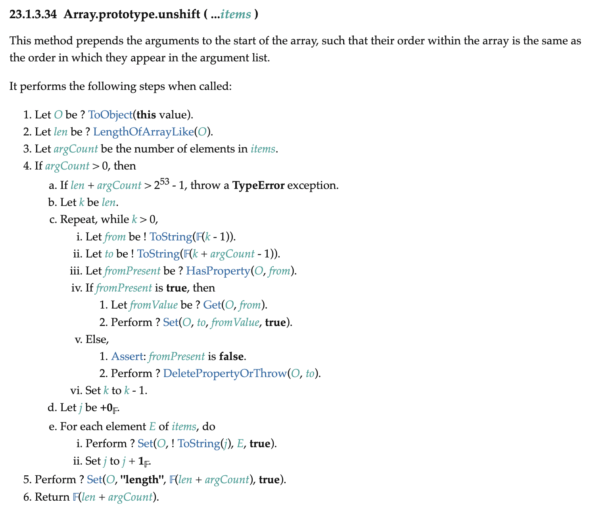
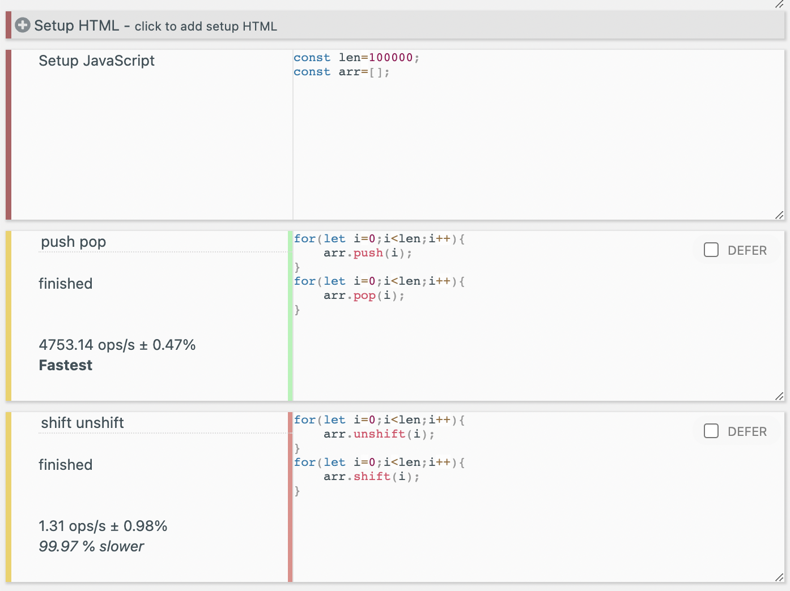

# 1. 들어가며

일반적인 언어에서 배열은 연속된 메모리 공간에 원소들을 저장하는 자료구조이다. 따라서 C 등의 언어에서 배열은 얼만큼의 연속된 메모리 공간을 사용할 것인지 고정된 크기로 선언하며 일반적으로 배열의 크기를 변경하는 것은 불가능하다.

예를 들어 다음과 같이 C언어에서 크기 10의 배열을 선언하면 이제 배열 크기를 11 혹은 다른 크기로 변경할 수는 없다. 동적 배열이라고 해도 새로운 배열을 할당 후 기존 배열을 복사해야 한다.

```c
int arr[10];
```

하지만 Javascript의 배열에는 '배열'이라는 이름답지 않게 배열의 크기를 늘리고 줄이는 `push`, `pop`, `shift`, `unshift`같은 메서드들이 있다. 자료구조 시간에 배운 배열보다는 Python의 리스트나 C++의 Vector와 같은 동적 배열에 가깝다고 보는 게 맞겠다.

그럼 이러한 배열의 삽입/삭제 메서드들의 시간 복잡도는 얼만큼 걸릴까? 구현에 따라 다를 것이다. 앞서 언급한 Python의 리스트나 C++의 Vector는 동적 배열로 구현되어 있어서 배열 크기가 상한에 도달할 때마다 배열 크기를 두 배로 늘리는 등의 방식을 사용한다.

그래서 C++, Python의 이러한 동적 배열의 끝에 원소를 추가하는 것은 (amortized) O(1), 배열의 시작 부분에 원소를 추가하거나 삭제하는 것은 O(n)이다. 대신 랜덤 액세스가 O(1)에 가능하다는 이점이 있다. 반면 C++의 list 같은 자료구조는 노드를 추가하거나 삭제하는 것이 양쪽 모두에서 O(1)이지만 랜덤 액세스가 O(n)이다.

그럼 Javascript의 배열은 어떨까? 이후 Javascript에서 배열의 구현을 구체적으로 다루는 글에서 보겠지만 JS의 배열은 대부분의 엔진에서 우리가 아는, 연속된 메모리 공간을 차지하는 그런 배열로 구현되어 있다. 하지만 다른 구현을 사용하기도 하며 특정한 경우에 다른 자료구조로 변환되기도 한다. 그리고 내가 모르는 어떤 신통한 자료구조가 있어서 배열의 맨 앞에 원소를 삽입하면서도 나머지 인덱스를 바꾸지 않는 방법이 있어서 O(1)에 삽입 가능하다던가 할 수도 있다.

따라서 이 글에서는 모든 Javascript 엔진이 따라야 하는 명세와 벤치마크를 기반으로 Javascript 배열의 삽입 메서드들의 시간복잡도를 분석해 보았다.

# 2. 명세 탐구

## 2.1. push

push는 배열의 맨 뒤에 원소를 추가한다. Array.prototype.push(...items)와 같은 형태로 나타나서 인수로 받은 것들을 모두 배열 끝에 추가한다. 그리고 배열의 새 길이를 반환한다.

이 함수의 명세는 다음과 같이 나타난다.


복잡하게 에러 체킹이나 정의 같은 게 되어 있다. 하지만 결국 배열의 끝에 원소를 추가하고 길이를 1 늘리는 것을 인수로 받은 모든 원소에 대해 반복하는 것이다. 시간복잡도는 잘 구현하면 O(인자 개수)이 될 것이다. 인자가 상수 개수라면 O(1)이다.

## 2.2. pop

pop은 배열의 맨 뒤에 원소를 제거한다. 그리고 제거한 그 원소를 반환한다. 명세는 다음과 같다.


배열이 비어 있을 때 undefined를 반환하는 처리가 있긴 하다. 그래도 기본적으로는 끝 원소만 쏙 빼는 것이다. 배열의 다른 원소들에 대해 어떤 동작을 반복한다든가 하는 건 없다. 따라서 시간복잡도는 O(1)이다.

## 2.3. unshift

unshift는 인자로 받은 원소들을 배열의 맨 앞에 추가한다. 그리고 배열의 새 길이를 반환한다. 명세는 다음과 같다.



여기서 4.c를 보면 배열에 있던 기존 원소들을 argCount만큼 뒤로 이동시킨다. argCount는 unshift가 받은 인자 개수이다. 그리고 인자로 받은 원소들을 배열의 앞(기존 원소들이 이동했으니 이제 비어 있다)에 추가한다.

이 함수의 시간복잡도는 O(기존의 배열 길이 + unshift 인자 개수)이므로 O(n)이라고 할 수 있을 것이다.

## 2.4. shift

shift는 배열의 맨 앞에 있는 원소를 제거한다. 그리고 제거한 그 원소를 반환한다. 명세는 다음과 같다. 복잡하지만 시간복잡도를 따지는 건 어떤 반복적인 부분이 있는지만 보면 된다.


여기서는 6.을 보면 기존 원소들을 한 칸씩 앞으로 당겨주고 있다. `[1, len-1]`범위 인덱스의 원소들을 `[0, len-2]` 인덱스로 한 칸씩 옮겨주는 것이다. 이외에 반복이 적용되는 부분은 없다.

이를 보면 이 함수의 시간복잡도는 O(기존의 배열 길이)이므로 O(n)이라고 할 수 있을 것이다. 반환해야 할 배열 첫 원소는 배열 원소들을 당겨주기 전에 4. 에서 보관해 놓고 9. 에서 리턴한다.


# 3. 벤치마크

[JS 벤치마크 사이트](https://jsbench.me/)에서 간단히 벤치마크해 보았다. 일단 가볍게 1000번 정도씩 돌려 보았다. push/pop이 훨씬 빠르다는 것을 알 수 있었다.


그리고 1만번, 10만번의 벤치마크도 돌려 보았는데 push/pop은 반복 횟수에 따라 걸리는 시간이 선형적으로 증가하는 반면 shift/unshift는 반복 횟수 증가에 따른 경과 시간이 훨씬 더 크게 증가하는 것을 볼 수 있었다. shift/unshift는 역시 O(n)이다.

1만번 벤치마크


10만번 벤치마크



# 참고

[Time Complexity Analysis of Javascript Array unshift ](https://medium.com/@brayce1996/time-complexity-analysis-of-javascript-array-unshift-74930aaa2f6)

[ECMA-262 push](https://tc39.es/ecma262/#sec-array.prototype.push)

[ECMA-262 pop](https://tc39.es/ecma262/#sec-array.prototype.pop)

[ECMA-262 unshift](https://tc39.es/ecma262/#sec-array.prototype.unshift)

[ECMA-262 shift](https://tc39.es/ecma262/#sec-array.prototype.shift)
