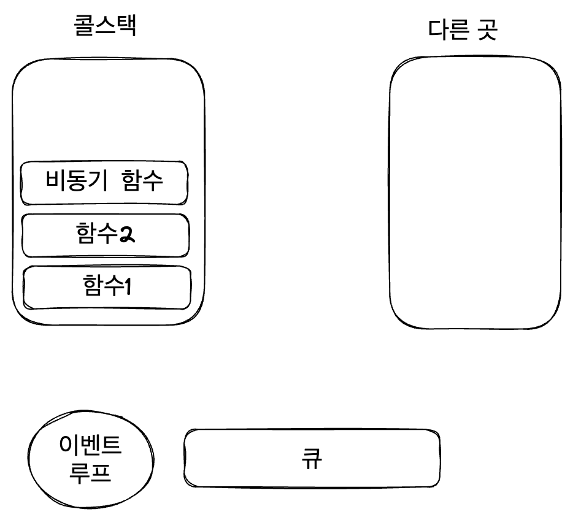
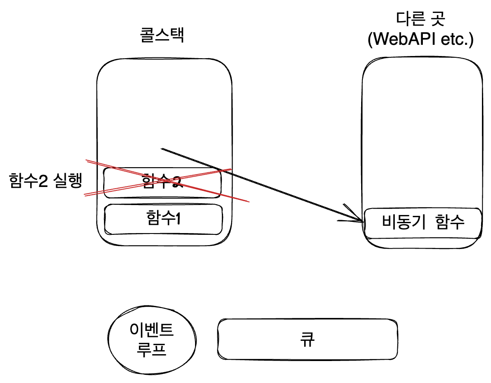
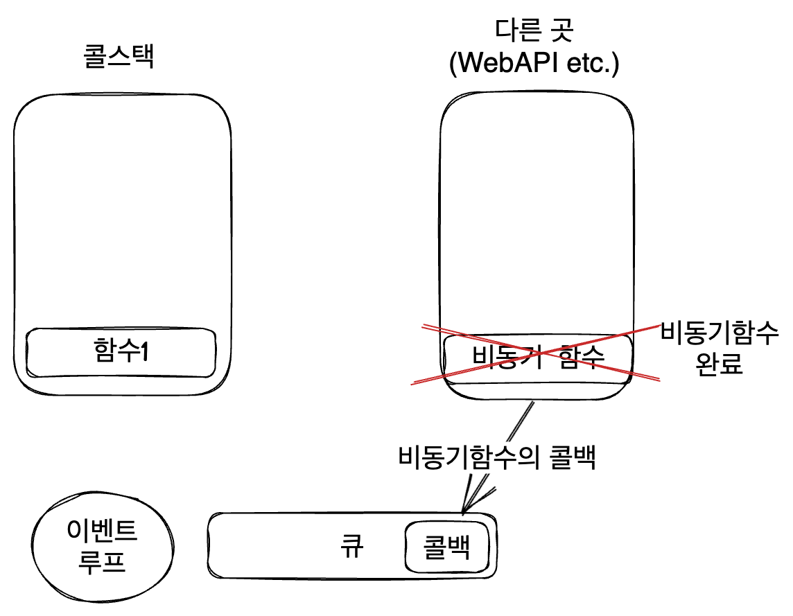
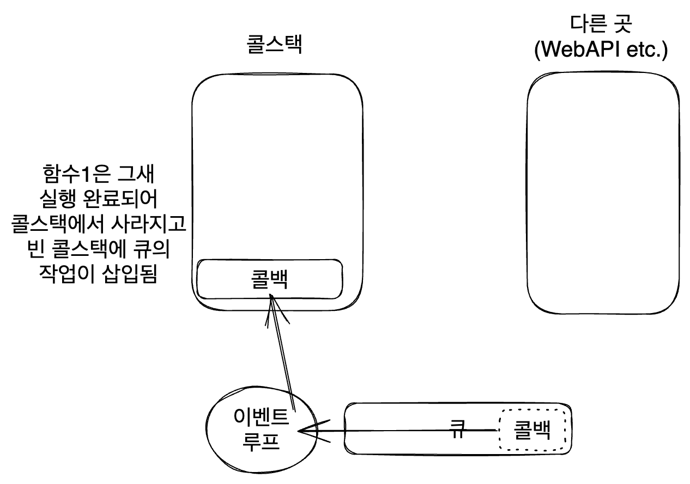

# 1. 시작

Javascript는 싱글스레드 언어이다. 그 말은 작업을 처리할 수 있는 콜스택이 하나뿐이라는 말과 같다.

이는 언어 설계에서부터 의도된 것이다. 먼저 초기에 JS는 웹브라우저에서 동적인 부분을 처리하기 위한 목적으로만 만들어진 작은 언어였기에 싱글스레드로도 충분할 때가 많았다.

또한 JS는 싱글스레드 언어가 됨으로써 언어 설계자에게도 사용자에게도 간단한 구현을 할 수 있게 해주었다. 멀티스레드 환경에서 고려해야 하는 데드락이나 경합 상태와 같은 수많은 동시성 관련 이슈들을 고려하지 않아도 되었기 때문이다.

하지만 `fetch`로 HTTP 요청을 만들어 서버와 통신하거나 일정 시간 이후에 특정 작업이 실행되도록 예약하는 등 꽤 많은 작업이 비동기를 요구한다. 성능 관련 이슈도 있고 말이다. 

그래서 JS는 비동기를 지원하기 위해 여러가지 방법을 제공하고 내부적으로는 이벤트 루프를 통해 비동기 작업을 처리하도록 했다. gc와 같은 부분들도 싱글스레드 작업에 방해되지 않도록 여러 처리를 했다. 이런 부분들을 차근차근 알아보자.

# 1. 비동기 작업의 필요성

다음과 같은 HTML을 짜보자.

```html
<!DOCTYPE html>
<html lang="en-us">
  <head>
    <meta charset="utf-8">
    <meta http-equiv="X-UA-Compatible" content="IE=edge,chrome=1">
    <meta name="viewport" content="width=device-width">
    <title>오~~래 걸리는 작업</title>
  </head>
  <body>
    <label>
      <span>소수의 개수</span>
      <input type="text" value="1000000">
    </label>
    <button id="generate">소수 생성 시작</button>
    <button id="reload">재시작</button>
    <div id="result"></div>
    <textarea>소수 생성 동안 이곳은 사용 불가능해진다.</textarea>

    <script>
      function generatePrimes(q){
        function isPrime(n){
          for(let c=2;c*c<=n;c++){
            if(n%c===0){
              return false
            }
          }
          return true;
        }

        const primes=[];
        const mx=1000000;

        while(primes.length<q){
          const n=Math.floor(Math.random()*(mx+1));
          if(isPrime(n)){
            primes.push(n);
          }
        }
        return primes;
      }

      document.getElementById('generate').addEventListener('click',function(){
        const q=document.querySelector('input').value;
        const primes=generatePrimes(q);
        const result=document.getElementById('result');
        document.getElementById('result').textContent=`소수 ${q}개 생성 완료`;
      })

      document.getElementById('reload').addEventListener('click',function(){
        location.reload();
      })
    </script>
  </body>
</html>
```

이를 브라우저에서 켜보면 다음과 같은 창이 생성된다.


소수 생성 시작 버튼을 누르면 input에 입력된 갯수만큼의 소수를 생성하는 작업이 시작되는데, 이 작업이 끝나기 전까지는 밑의 텍스트 입력 창을 사용하지 못하는 것을 볼 수 있다. 괜히 저런 문구를 `<textarea>`에 써 놓은 게 아니다.

하지만 논리적으로는 소수 생성과 밑의 텍스트 입력창은 별 상관이 없다. 굳이 소수 생성이 끝나야 사용할 수 있게 될 필요가 없다. 이런 것을 해결하기 위해서는 해당 함수가 작업하는 동안 다른 이벤트에 응답이 가능하도록 하는 비동기가 필요하다.

# 2. 

# 2. JS의 비동기 함수의 구현 원리

그럼 이런 비동기 함수는 어떻게 구현될 수 있을까? 심지어 JS는 싱글스레드 언어인데? [JS 이벤트 루프에 다이빙하기](https://witch.work/javascript-event-loop-dive/)에 좀 정리해 놓긴 했지만, 기본적으로 이벤트 루프를 이용한다.

비동기 함수는 먼저 콜스택이 아닌 다른 곳(WebAPI, PromiseJobs등)으로 넘어간다. 콜스택에서는 기존에 진행하던 작업이 진행된다. 그리고 그곳에서 비동기 작업이 끝나고 나면 비동기 함수의 콜백(혹은 Promise의 then같은 것)이 큐에 삽입되고 이벤트 루프에 의해 다시 콜스택으로 넘어가게 된다. 여기서 매크로태스크, 마이크로태스크 등이 구분되는데 자세한 건 위의 이벤트 루프 관련 글을 참고.

여러가지를 뭉뚱그려서지만 그림으로 설명하도록 하겠다.

먼저 비동기 함수가 콜스택에 들어온다.



그리고 비동기 함수는 다른 곳으로 넘어가서 실행된다. 그리고 콜스택에서는 다른 함수가 실행된다.



비동기 함수가 끝나고, 비동기 함수의 콜백 혹은 then에 오는 작업이 큐에 삽입된다.



콜스택이 비어 있으면 이벤트 루프가 큐 상단의 작업을 콜스택으로 옮긴다.



이런 식으로 비동기 작업이 실행된다. 작업 완료를 이벤트처럼 생각할 수도 있다. 특정 작업을 다른 스레드에서 실행하고, 이 작업이 끝날 시 해당 스레드에서 JS의 메인 스레드로 '작업 완료'라는 이벤트를 보내는 것이다.

# 3. 비동기 함수의 구현 - 콜백 함수

이런 비동기 작업을 실현할 수 있는 대표적인 방법 하나는 setTimeout을 이용하는 것이다. 비동기 작업 결과에 의존적인 작업들은 setTimeout 콜백으로 넘겨주고, 아닌 작업들은 setTimeout과 상관없이 실행된다. 사실은 setTimeout보다도 먼저 실행된다.

다음 코드를 실행하면 C,C,A,B 순으로 출력된다. 첫번째 C는 당연하고, setTimeout은 비동기 함수이므로 다른 곳(여기선 webAPI)으로 옮겨져서 실행된다. 그 콜백은 나중에 이벤트 루프를 통해서 콜스택에 들어오게 되는데 그전에 콜스택에 들어간 C 출력 함수가 실행된다. 그 다음 A 출력 함수 실행, setTimeout이 또 비슷한 과정을 거쳐서 B가 출력된다.

```js
function A(){
  console.log('A');
}

function B(){
  console.log('B');
}

function C(){
  console.log('C');
}

C();
setTimeout(()=>{
  A();
  setTimeout(()=>{
    B();
  }, 1000);
}, 1000);
C();
```

하지만 이런 식으로 구현하면 콜백 깊이가 점점 깊어져서 콜백 지옥이 생기게 된다. 따라서 요즘은 Promise를 이용한다.

# 4. 비동기 함수의 구현 - Promise

Promise는 새로운 비동기 프로그래밍 방법이다. 작업이 완료되어 결과가 나왔을 때 다음 코드를 진행시키거나 에러 발생시 에러를 깔끔하게 처리할 수 있게 한다.

어떤 작업을 비동기로 실행한다면, 그 비동기 작업을 하는 코드가 있고 그 작업이 끝나면 실행되어야 할 코드가 있다. 서버에서 데이터를 받아오는 작업을 하는 코드와 그 데이터로 무언가를 하는 코드를 예시로 들 수 있을 것이다.

Promise는 이 둘을 연결시켜 주는 작업을 한다. 비동기 작업을 실행하고, 실행 완료시 어떤 코드가 실행되도록 신호를 전달하는 것이다.

Promise는 다음과 같이 만들어진다.

```js
const promise=new Promise((resolve,reject)=>{
  // 비동기 작업
  // 작업이 완료되면 resolve(결과)를 호출
  // 에러 발생시 reject(에러)를 호출
})
```

이때 Promise 생성자에 전달되는 함수는 executor이다. 이는 Promise가 만들어질 때 자동으로 실행되며 비동기 작업을 맡는다. 이렇게 executor 함수가 실행되고 아직 완료되지 않은 상태는 `pending`상태라 한다.

executor는 resolve, reject 2개의 인수를 받는데 이는 JS에서 제공하는 콜백이다. 그리고 executor에서는 인수로 넘겨준 이 콜백 둘 중 하나는 반드시 호출해야 한다. resolve는 작업이 성공적으로 끝났을 때 결과값을 인수로 담아 호출하고, reject는 작업이 실패했을 때 에러를 담아 호출한다.

resolve/reject 둘 중 하나가 호출되어 Promise executor가 끝난 상태는 resolved라 부르며, 성공적으로 처리되어 resolve가 호출되었을 시 `fulfilled` 상태가 된다. 만약 에러가 발생하여 `reject`가 호출되었을 시 rejected 상태가 된다.

그리고 Promise는 위의 상태를 문자열 형태로 담는 state와 결과값 혹은 에러를 담는 result를 가진다. 이 result는 then 혹은 catch가 받는 콜백 함수의 인수로 자동 전달된다.


이렇게 resolve, reject를 활용해서 사용자 정의 Promise를 만들 수도 있다. 예를 들어 위에 있었던 소수 생성 작업을 Promise로 만들어보자.

또한 then 내에서 반환된 값은 다음에 오는 then 콜백 함수의 인수로 전달된다. 이를 이용하면 then 체인을 이어서 작성할 수도 있다. 다음 코드가 이해를 도울 수 있다.

```js
new Promise((resolve, reject) => {
  resolve(1);
}).then((value) => {
  // resolve의 인수가 value로 들어옴(1)
  console.log(value);
  return value + 1;
}).then((value) => {
  // 앞에서 리턴한 값이 value로 들어옴(2)
  console.log(value);
  return value + 1;
}).then((value) => {
  // 앞에서 리턴한 값이 value로 들어옴(3)
  console.log(value);
  return value + 1;
}).then((value) => {
  // catch로 넘어가기 위해 에러 발생시키기
  throw new Error("일부러 에러 발생");
}).catch((error) => {
  // 에러 메시지 출력(Error: 일부러 에러 발생)
  console.log(error);
});
```

앞의 then에서 리턴한 값이 인수로 들어오기 때문에 이를 이용해 어떤 연쇄 작업을 진행할 수도 있다.

비동기 코드에서는 기존에 사용하던 try...catch가 작동하지 않으며 Promise의 then, catch를 이용해 에러를 처리해야 한다.

finally도 있는데, 이는 Promise가 성공하든 실패하든 실행되는 콜백 함수를 받는다. 이 콜백 함수는 then, catch에 들어가는 함수와 달리 인수를 받지 않는다.

## 4.1. Promise.all

Promise로 이루어진 배열을 받아 비동기로 실행하고, 모든 Promise가 fulfilled일 경우 실행할 코드를 지정할 수 있다. 매개변수로 받은 배열의 Promise 작업들을 모두 하나의 Promise로 묶인 것처럼 실행하는 것이다.

그리고 각 Promise의 결과값을 담은 배열이 then 콜백 함수의 인수로 전달된다.

```js
Promise.all([PromiseA, PromiseB, PromiseC]).then((values) => {
  // PromiseA, PromiseB, PromiseC가 모두 fulfilled일 경우 실행
  // values는 각 Promise의 결과값을 담은 배열
  console.log(values);
}).catch((error) => {
  // PromiseA, PromiseB, PromiseC 중 하나라도 rejected일 경우 실행
  console.log(error);
});
```

Promise는 우리가 어떤 함수의 리턴값을 모르거나 얼마나 걸릴지 모를 때 그것에 의존하는 코드를 실행하게 해준다. 또한 콜백 없이도 비동기 작업을 처리하도록 해준다. 대부분의 모던 WebAPI는 Promise 기반이며 비동기 작업은 점점 중요해지고 있으므로 이를 잘 이해해 놓아야 한다.

# 5. Promise API 만들기

많은 API가 프로미스 기반이다. 하지만 우리가 직접 프로미스를 반환하는 API를 만들 수도 있다. 보통 이벤트나 메시지를 전달하는 비동기 작업을 래핑하는 데 쓴다.

예를 들어 사람 이름과 지연 시간을 받아서, 지연 시간 이후에 사람 이름을 넣어서 깨우는 메시지를 출력하는 함수를 만들 수 있다.

```js
function alarm(person, delay){
  return new Promise((resolve, reject) => {
    if(delay<0){
      throw new Error("Negative delay");
    }
    setTimeout(() => {
      resolve(`${person}! Wake up!`)
    }, delay);
  });
}
```

이렇게 만든 Promise를 사용하면 다음과 같다.

```js
alarm("SungHyun", 2000).then((message) => {
  console.log(message);
}).catch((error) => {
  console.log(error);
});
```

이러면 alarm이 반환한 Promise의 executor가 즉시 실행된다. 그리고 2초 뒤에 alarm에서 resolve에 전달한 메시지가 출력된다. 만약 전달했던 delay가 음수일 경우 에러가 발생하고 catch에서 잡아낸다.

# 6. Worker

앞서 소수를 생성하는 작업을 예시로 들었다. 그러나 그 작업은 JS 엔진에서만 실행되는 코드이기 때문에 Promise 등 어떤 짓을 해도 싱글스레드 언어인 JS에선 비동기로 실행할 수 없다. 결국 해당 작업은 콜스택에 쌓여서 실행되어야 하기 때문이다.

이런 문제를 해결할 수 있는 방법으로 Worker가 있다. 별도의 작업 흐름(스레드)를 만들 수 있게 해주는 기능이다.

단 운영체제에서 나오듯 이런 멀티스레딩을 하면 스레드 간의 동기화 문제가 발생할 수 있고 버그도 찾기 어려워진다. 웹에선 이런 문제를 해결하기 위해 메인 코드와 워커 코드가 서로의 변수에 직접 접근할 수 없고 서로 메시지를 통해서만 소통할 수 있다.

이를 이용해서 앞선 소수 생성 예제를 개선해 보자. 먼저 기존 기능의 예제이다.

```html
<!-- index.html -->
<!DOCTYPE html>
<html lang="en-us">
  <head>
    <meta charset="utf-8">
    <meta http-equiv="X-UA-Compatible" content="IE=edge,chrome=1">
    <meta name="viewport" content="width=device-width">
    <title>오~~래 걸리는 작업</title>
  </head>
  <body>
    <label>
      <span>소수의 개수</span>
      <input type="text" value="1000000">
    </label>
    <button id="generate">소수 생성 시작</button>
    <button id="reload">재시작</button>
    <div id="result"></div>
    <textarea>소수 생성 동안 이곳은 사용 불가능해진다.</textarea>

    <script src="./main.js"></script>
  </body>
</html>
```

```js
// main.js
function generatePrimes(q){
  function isPrime(n){
    for(let c=2;c*c<=n;c++){
      if(n%c===0){
        return false
      }
    }
    return true;
  }

  const primes=[];
  const mx=1000000;

  while(primes.length<q){
    const n=Math.floor(Math.random()*(mx+1));
    if(isPrime(n)){
      primes.push(n);
    }
  }
  return primes;
}

document.getElementById('generate').addEventListener('click',function(){
  const q=document.querySelector('input').value;
  const primes=generatePrimes(q);
  const result=document.getElementById('result');
  document.getElementById('result').textContent=`소수 ${q}개 생성 완료`;
})

document.getElementById('reload').addEventListener('click',function(){
  location.reload();
})
```

이제 `generate.js`를 만들고 `main.js`를 다음과 같이 수정한다.

```js
const worker=new Worker('./generate.js');

document.getElementById('generate').addEventListener('click',function(){
  const q=document.querySelector('input').value;
  // 워커에 메시지를 보내자.
  /* command는 워커가 수행할 작업을 식별할 문자열, q는 생성할 소수 개수 */
  worker.postMessage({
    command:'generate', q:q,
  });
})

// 워커 작업 완료시 알려주고 데이터를 전달하게 해줌
worker.addEventListener('message',(msg)=>{
  document.getElementById('result').textContent=`소수 ${msg.data}개 생성 완료`;
});

document.getElementById('reload').addEventListener('click',function(){
  location.reload();
})
```

`generate.js`는 다음과 같다.

```js
// 워커가 만들어지자마자 이 코드가 실행된다.
addEventListener('message',(msg)=>{
  // msg.data는 메시지로 전달된 인수의 복사본
  if(msg.data.command==='generate'){
    generatePrimes(msg.data.q);
  }
});

function generatePrimes(q){
  function isPrime(n){
    for(let c=2;c*c<=n;c++){
      if(n%c===0){
        return false
      }
    }
    return true;
  }

  const primes=[];
  const mx=1000000;

  while(primes.length<q){
    const n=Math.floor(Math.random()*(mx+1));
    if(isPrime(n)){
      primes.push(n);
    }
  }
  // 작업이 끝나면 메인 스크립트로 메시지를 보낸다.
  postMessage(primes.length);
}
```

이를 실행하기 위해서 [로컬 테스트 서버 설정](https://developer.mozilla.org/ko/docs/Learn/Common_questions/Tools_and_setup/set_up_a_local_testing_server)을 했다.

파이썬 설치

```
brew install python3
-> 설치 버전 확인
python3 --version
```

그리고 위의 index.html이 있는 폴더에서 서버 구동

```
python3 -m http.server
```

이러면 기본적으로 8000번 포트에서 서버가 구동된다. 이제 브라우저에서 `localhost:8000`으로 접속하면 된다. 그러면 위에서 만든 `index.html`을 시험해 볼 수 있다.

이제 소수를 생성하는 동안 textarea를 사용할 수 있다! 이렇게 워커를 사용하면 작업을 별도의 스레드로 넘길 수 있다. 이때 워커는 메인스레드와 변수를 공유하지 않고 메시지로만 소통한다. 워커가 DOM에 접근할 수는 없지만 메인 스레드의 응답성에는 도움을 줄 수 있다.

다른 유형의 워커도 있는데 언젠가 알아보자.
[우리가 사용한 건 웹 워커](https://developer.mozilla.org/ko/docs/Web/API/Web_Workers_API/Using_web_workers)
[서비스 워커](https://developer.mozilla.org/ko/docs/Web/API/Service_Worker_API/Using_Service_Workers)
[공유 워커](https://developer.mozilla.org/ko/docs/Web/API/SharedWorker)
[같이보기](https://developer.mozilla.org/ko/docs/Learn/JavaScript/Asynchronous/Introducing_workers#%EA%B0%99%EC%9D%B4_%EB%B3%B4%EA%B8%B0)

# 참고

JS는 왜 싱글스레드면서 논블로킹일 수 있는가 https://www.geeksforgeeks.org/why-javascript-is-a-single-thread-language-that-can-be-non-blocking/

https://miracleground.tistory.com/entry/%EC%9E%90%EB%B0%94%EC%8A%A4%ED%81%AC%EB%A6%BD%ED%8A%B8%EB%8A%94-%EC%99%9C-%EC%8B%B1%EA%B8%80-%EC%8A%A4%EB%A0%88%EB%93%9C%EB%A5%BC-%EC%84%A0%ED%83%9D%ED%96%88%EC%9D%84%EA%B9%8C-%ED%94%84%EB%A1%9C%EC%84%B8%EC%8A%A4-%EC%8A%A4%EB%A0%88%EB%93%9C-%EB%B9%84%EB%8F%99%EA%B8%B0-%EB%8F%99%EA%B8%B0-%EC%9E%90%EB%B0%94%EC%8A%A4%ED%81%AC%EB%A6%BD%ED%8A%B8-%EC%97%94%EC%A7%84-%EC%9D%B4%EB%B2%A4%ED%8A%B8%EB%A3%A8%ED%94%84