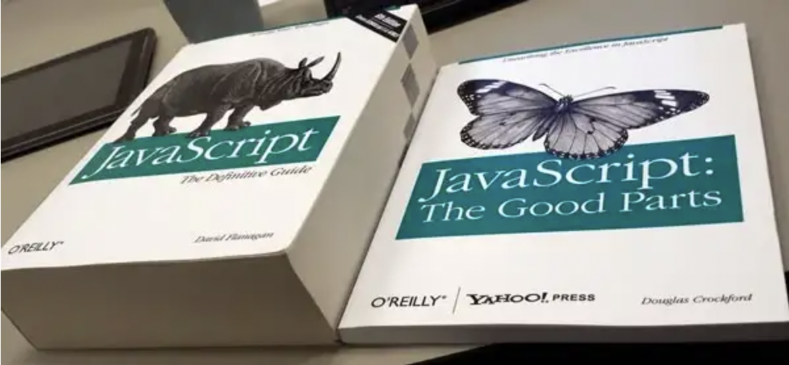

# 이 글은 작성 중입니다.

# 서론

> 최고의 시절이자 최악의 시절, 지혜의 시대이자 어리석음의 시대였다. 믿음의 세기이자 의심의 세기였으며, 빛의 계절이자 어둠의 계절이었다. 희망의 봄이면서 곧 절망의 겨울이었다.
> 우리 앞에는 모든 것이 있었지만 한편으로 아무것도 없었다. 우리는 모두 천국으로 향해 가고자 했지만 우리는 엉뚱한 방향으로 걸었다.
> 말하자면, 지금과 너무 흡사하게, 그 시절 목청 큰 권위자들 역시 좋든 나쁘든 간에 오직 극단적인 비교로만 그 시대를 규정하려고 했다.
>
> 찰스 디킨스, 두 도시 이야기

학교 도서관을 돌아다니다가 우연히 JSON의 창시자, 자바스크립트 구루 더글라스 크록포드가 2008년에 쓴 책 '자바스크립트 핵심 가이드'를 찾았다.

이 책에 있는 `Javascript: The Good Parts`가 바로 이 자바스크립트 핵심 가이드이다.



과제로 열심히 C를 했던 사람이 할 말은 아닐지도 모르지만 JS에서 2008년이라는 건 정말 까마득히 먼, JS가 장난감 언어로 취급받고 실제로도 그럴 만한 이유가 있었던 암흑 시대였다. 나는 그때 개발의 ㄱ자도 모르던 학생이었지만 주워들은 이야기로는 그렇다.

2008년은 ES3의 시대였다. 지금은 모두가 당연하다는 듯 쓰고 있는 `let`, `const`와 `Promise`와 `import`, `for..of`등을 도입한 ES6도 없었고, React의 생명과도 같은 `map`, `filter`등 여러 함수와 JSON에 대한 지원 등이 도입된 ES5도 없었다.

모든 변수는 전역으로 관리되어야 했고 지금 있는 유틸 함수들의 절반도 없었다. '라떼 개발자들의 등불이었다'정도의 취급을 받고 있는 JS 암흑시대의 등불 lodash도, 그 조상이었던 underscoreJS도 없었다.

이벤트 구현도 브라우저마다 달랐고 이외에도 브라우저 호환성은 정말 좋지 않아 jQuery의 시대였다. JS는 모르지만 제이쿼리는 할 수 있다는 말이 들리던 때였다고 한다.

그런 시대에 크록포드는 이 책을 썼다. JS에 좋은 면이 꽤 있고 잘 쓸 수 있다는 걸 알리기 위해서. 그래서 마치 역사서를 읽는 느낌으로 이 책을 읽어보았다. JSON을 만든 그는 대체 무엇을 생각하며 2008년에 이 책을 썼던 걸까? 하면서 말이다.

그러면서 이 책을 읽으면서 생각했던 점이나 알게 된 점을 두서 없이 여기 정리한다.

# 1. JS의 좋은 면과 나쁜 면

크록포드는 JS의 좋은 아이디어로 함수, 느슨한 타입 체크, 동적 객체, 표현적인 객체 리터럴 등을 꼽는다. 그리고 나쁜 아이디어로는 프로그래밍 모델이 전역 변수에 기초하고 있다는 것을 꼽는다.

함수가 JS의 좋은 아이디어인 이유는 함수가 일급 객체이고 언어 자체가 람다 언어이기 때문이다.

느슨한 타입 체크가 좋은 이유에 대해서도 설명하는데 강력한 타입 체크가 중요한 오류들을 효율적으로 제거하지 못한다는 것이 판명되었다고 한다. 그리고 강력한 타입 체크는 오류를 알려주기는 하지만 실제로 우리가 제일 많이 고려하는 오류들에 대해서는 알려주지 못한다고 한다. 반면 느슨한 타입 체크는 복잡한 클래스 계층(서브타입 다형성을 위한 작업을 말하는 듯 하다)을 구성하거나 타입 캐스팅과 씨름할 필요가 없도록 하여 자유로움을 준다는 게 크록포드의 주장이다.

# 2. JS의 주석의 유래

JS에서는 `/* */`형태의 여러 줄 주석과 `//`형태의 한 줄 주석을 사용할 수 있다. 이 `/* */` 주석 형식은 C보다도 먼저 나왔던, 당시에 용도별로 분리되어 있던 많은 언어들을 하나로 통합하고자 하는 시도였던 PL/1이라는 언어에서 비롯되었다.

PL/1에서는 문자열 리터럴을 제외하고는 `/* */`이 문자 조합이 거의 나타나지 않았기 때문에 이를 주석으로 사용하였다. 하지만 JS에서는 정규 표현식에서도 이런 조합이 나타날 수 있기에 이 주석 방식은 안전하지 않다.

책에서는 다음과 같은 코드를 예시로 제시한다. 이 코드는 구문 오류를 발생시킨다.

```js
/*
  var rm_a = /a*/.match(s);
*/
```

그래서 가능하면 `//`를 사용하는 것을 이 책에서는 권장한다. 책 내용에서도 이런 예시를 보여줄 때를 제외하면 `//`만을 사용하고 있다.

## 2.1. JSDoc은?

그럼 `/** */` 형태의 주석, 즉 JSDoc은 어디서 나왔는지에 대해서 어떤 분이 물어봐 주셔서 궁금해져서 찾아보았다.

[JSDoc 위키 문서](https://en.wikipedia.org/wiki/JSDoc)를 보면 JSDoc은 자바로 JS 런타임 시스템을 만드는 프로젝트였던 Rhino에서 처음 나왔다고 한다. 물론 Javadoc과 JSDoc은 약간 다르지만, 애초에 유래가 된 프로젝트부터 보아도 Javadoc의 영향을 받아서 만들어졌다고 보인다.

# 3. 객체 키와 속성

JS에서 어떤 문자열이든 객체의 키가 될 수 있다.

```js
const obj={
  "name": "city",
  "description": "a student"
  "last-name": "kim"
}
```

속성 키에 따옴표를 사용하지 않아도 될 때가 있는데 이는 키가 예약어가 아니며 JS에서 사용할 수 있는 이름(name)일 때이다.

그럼 이 이름이란 건 뭘까? 하나의 문자나 그 뒤를 이어서 하나 이상의 문자, 숫자, `_`가 붙는 문자열 중 예약어를 제외한 것을 말한다. 예약어는 JS에서 예약된 키워드들이며 `boolean`, `case`와 같은 것들이다. `undefined`나 `NaN`같은 건 변수명으로 지정되지 않지만 예약어는 아님에 주의한다.

또한 객체 키를 `obj.key`와 같이 `.`으로 읽어 오는 것도 키 문자열이 JS의 이름일 때만 가능하다. 그렇지 않은 경우 `obj["last name"]`과 같이 대괄호로 읽어와야 한다.

그런데 객체 속성의 값이 객체일 때, 연쇄적으로 접근을 시도하다가 중간에 `undefined`가 나오면 TypeError가 발생한다. 지금은 `?.`가 있지만 이때는 없었기 때문에 `&&`를 사용했다. `obj && obj.key && obj.key.name`과 같이 `&&`를 사용하여 에러를 방지한 것이다. 중간에 undefined가 나오면 그냥 undefined를 반환하고 뒤에 있는 것은 실행하지 않는 것이다.

## 3.1. 예약어

https://blog.outsider.ne.kr/189

다음에 나오는 예약어들은 JS에서 이름이 될 수 없다고 한다.

```
abstract
boolean break byte
case catch char class const continue
debugger default delete do double
else enum export extends
false final finally float for function
goto
if implements import in instanceof int interface
long
native new null
package private protected public
return
short static super switch synchronized
this throw throws transient true try typeof
var volatile void
while with
```

그런데 이중 `implements`와 같은 단어들은 실제로는 변수명으로 사용될 수 있다. 이는 [실제 JS의 예약어와, 확장을 위해 예약되어 있는 단어들이 다르기 때문이다.](https://blog.outsider.ne.kr/189)

## 3.2. 객체 속성 접근

`.`이나 대괄호를 통해서 객체 속성에 접근할 수 있다. 그런데 이렇게 접근하면 객체에 있는 속성뿐 아니라 객체의 프로토타입에 있는 속성까지 접근할 수 있게 된다.

예를 들어 모든 객체의 프로토타입 체인을 타고 올라가면 `Object.prototype`이 나오는데, 따라서 `.toString`은 어떤 객체에서든 접근할 수 있다. 하지만 아마 이는 객체 자체에 속한 속성은 아닐 것이다.

이런 속성들을 제외하고 객체 자체에 속한 속성들만 접근하고 싶다면 `Object.prototype.hasOwnProperty` 함수를 사용하면 된다. 이 메서드는 인수로 받은 속성이 객체 자체에 속한 속성인지를 판별해준다.

이는 `for..in`으로 객체를 순회할 때 프로토타입 체인에 있는 속성들을 제외하기 위해 사용할 수 있다.

```js
for(var name in storage){
  if(storage.hasOwnProperty(name)){
    // storage 객체에 있는 속성들만 순회한다.
    ...
  }
}
```

# 4. `Object.create` 폴리필

[`Object.create`](https://developer.mozilla.org/ko/docs/Web/JavaScript/Reference/Global_Objects/Object/create)함수를 여기서는 직접 구현하고 있다. 인수로 받은 객체를 프로토타입으로 하는 새로운 객체를 생성해준다. 이때는 `[[Prototype]]`을 조작할 수 있는 방법이 없었기 때문에 생성자 함수의 `prototype`을 이용한다.

```js
if (typeof Object.create !== 'function') {
  Object.create = function (o) {
    function F() {};
    F.prototype = o;
    return new F();
  };
}
var another_stooge = Object.create(stooge);
```

이러한 프로토타입 체인은 객체 속성을 읽을 때만 사용된다. 객체에 없는 속성을 읽으려 할 때 프로토타입을 타고 올라가서 `Object.prototype`까지 가는 것이다. 만약 거기까지 갔는데 해당 속성이 없다면 `undefined`를 반환한다. 이는 사실 상속보다는 위임에 가깝다. 따라서 객체에 새 속성이 추가되면 해당 객체를 프로토타입으로 삼는 객체들에도 새 속성이 추가된다.