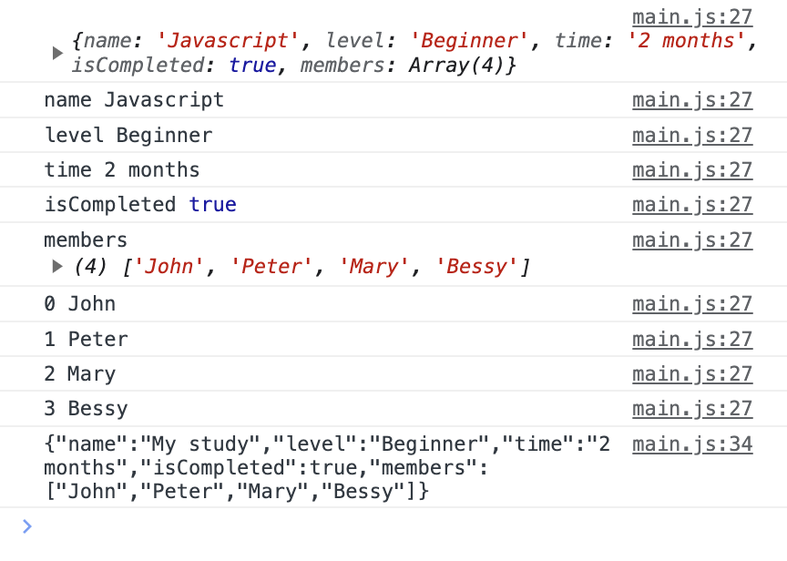

# 1. JSON이란?

인터넷이 발전하면서 네트워크를 통해서 점점 양도 많고 다양한 종류의 데이터를 주고받게 되었다. 그런데 이런 복잡한 데이터를 단순한 문자열만으로 보낼 수는 없었다. 그래서 특정한 형식으로 보내게 되었다. XML, JSON, CSV 등이 그것이다.

하지만 XML은 데이터를 만들기 너무 복잡했다. [JSON 공식 홈페이지에서는 JSON의 예시를 보여주면서 같은 데이터를 XML로 작성한 예시도 보여주는데 HTML 형식이라 익숙하기야 하지만 JSON에 비해 매우 복잡한 걸 볼 수 있다.](https://json.org/example.html)

그리고 CSV는 엑셀과 비슷한 표 형식이라 고차원 데이터를 표현하기 힘들었다. 그래서 [더글라스 크록포드](https://en.wikipedia.org/wiki/Douglas_Crockford)가 JS의 객체 리터럴과 비슷한 문법을 따르는(JSON의 원래 이름도 `JavaScript Object Notation`이다) JSON을 만들고 이를 홍보하는 사이트 [json.org(한국어 버전)](https://www.json.org/json-ko.html)도 만들었다.

이는 XML보다 가볍고 CSV보다 표현력이 좋아서 널리 쓰이게 되었다. 또한 JSON 관련된 문법도 Javascript 문법에 편입되고 `JSON.stringify`와 `JSON.parse`와 같은 메서드도 생겼다.

그래서 지금은 JSON이 네트워크를 통해 데이터를 주고받는 가장 표준적인 형식 중 하나가 되었다. firebase의 실시간 데이터베이스나 로컬 스토리지와 같은 데에 데이터를 저장할 때도 JSON을 쓴다. 

YAML같은 대체 형식도 많지만 이미 JSON이 JS 문법에도 어느 정도 끼어 있을 정도로 너무 널리 쓰이고 있어서 덜 쓰이는 편이다.

# 2. JSON의 구조

JSON은 JavaScript Object Notation이라는 이름 그대로 JS의 객체 리터럴 문법을 따르는 문자열이다. JS의 기본 타입인 문자열, 숫자, 배열, 불린, null, 다른 객체를 포함할 수 있다.

json.org에서도 다음과 같이 JSON의 값으로 쓰일 수 있는 것들을 나열하고 있다.


다음과 같이 쓸 수 있다. 이 예시는 [json.org의 공식 예시에서 가져왔다.](https://json.org/example.html)

```json
{
  "menu": {
  "header": "SVG Viewer",
  "items": [
      {"id": "Open"},
      {"id": "OpenNew", "label": "Open New"},
      null,
      {"id": "ZoomIn", "label": "Zoom In"},
      {"id": "ZoomOut", "label": "Zoom Out"},
      {"id": "OriginalView", "label": "Original View"},
      null,
      {"id": "Quality"},
      {"id": "Pause"},
      {"id": "Mute"},
      null,
      {"id": "Find", "label": "Find..."},
      {"id": "FindAgain", "label": "Find Again"},
      {"id": "Copy"},
      {"id": "CopyAgain", "label": "Copy Again"},
      {"id": "CopySVG", "label": "Copy SVG"},
      {"id": "ViewSVG", "label": "View SVG"},
      {"id": "ViewSource", "label": "View Source"},
      {"id": "SaveAs", "label": "Save As"},
      null,
      {"id": "Help"},
      {"id": "About", "label": "About Adobe CVG Viewer..."}
    ]
  }
}
```

이런 JSON 객체를 `.json`확장자를 가진 텍스트 파일에 저장할 수 있다. 그 경우 MIME 타입은 `application/json`이 된다.

JS 객체와의 차이는 undefined와 심볼 자료형이 없고 문자열이나 프로퍼티 키 작성시 큰따옴표만을 써야 한다는 것이다. 프로퍼티 키 또한 큰따옴표로 반드시 묶여 있어야 한다. 또한 JSON은 함수를 포함할 수 없다. [더 자세한 규칙은 MDN의 JSON 문서를 참고하자.](https://developer.mozilla.org/ko/docs/Web/JavaScript/Reference/Global_Objects/JSON)

# 3. JSON 사용하기

## 3.1. stringify, parse

객체와 JSON간의 변환을 지원하기 위한 함수로 `JSON.stringify`와 `JSON.parse`가 있다. `JSON.stringify`는 객체를 JSON으로 변환하고 `JSON.parse`는 JSON을 객체로 변환한다. 이 함수들은 중첩 객체나 중첩 객체가 변환된 JSON 문자열도 잘 처리한다.

```js
let myStudy={
  name:"Javascript",
  level:"Beginner",
  time:"2 months",
  isCompleted:true,
  members:[
    "John",
    "Peter",
    "Mary",
    "Bessy",
  ]
}

let myStudyJSON=JSON.stringify(myStudy);
/* {"name":"Javascript","level":"Beginner","time":"2 months","isCompleted":true,"members":["John","Peter","Mary","Bessy"]} */
console.log(myStudyJSON);
```

이렇게 변경된 문자열은 JSON으로 인코딩된, 직렬화 처리된, 문자열로 변환된, 결집된 객체(JSON-encoded, serialized, stringified, marshalled object)라 한다. 이 문자열은 네트워크를 통해 전송하거나 저장소에 저장할 수 있다.

또한 `JSON.stringify`는 객체뿐 아니라 배열, 문자열, 숫자, 불린, null도 JSON으로 변환할 수 있다. 함수나 undefined, 심볼 자료형은 변환할 수 없으며 이러한 프로퍼티를 가진 객체에 대해서는 해당 프로퍼티를 무시한다.

```js
let myStudy={
  name:"Javascript",
  level:"Beginner",
  time:"2 months",
  isCompleted:true,
  sayHello:function(){
    console.log("Hello");
  }
}

let myStudyJSON=JSON.stringify(myStudy);
/* 결과에서 sayHello 함수는 무시된다 */
console.log(myStudyJSON);
```

단 주의할 점은 순환 참조가 있을 때 객체를 JSON 문자열로 바꾸는 것이 실패한다는 점이다. 순환 참조를 JSON으로 바꾸려고 한다는 `Error: Converting circular structure to JSON` 오류가 발생한다.

그리고 `JSON.parse`를 사용하면 JSON으로 인코딩된 객체를 다시 객체로 변환할 수 있다.

## 3.2. stringify 심화

JSON의 전체 형식은 다음과 같다.

```js
JSON.stringify(value[, replacer[, space]])
```

value는 당연히 인코딩하려는 값이다. `replacer`는 JSON으로 인코딩하려는 프로퍼티들이 담긴 배열 혹은 매핑 함수이다. `space`는 직렬화 시 중간에 삽입해 줄 공백 문자 수를 나타낸다.

### 3.2.1. replacer

JSON으로 객체를 직렬화할 때 특정 프로퍼티만 포함하거나 특정 프로퍼티만 제외하고 싶을 수 있다. 그럴 때 이 인자를 사용할 수 있다. 예를 들어 다음과 같이 하면 `members` 프로퍼티를 제외한 나머지 프로퍼티만 JSON으로 변환된다. 그렇게 replacer 배열을 전달해 줬기 때문이다.

```js
let myStudy={
  name:"Javascript",
  level:"Beginner",
  time:"2 months",
  isCompleted:true,
  members:["John","Peter","Mary","Bessy"]
}

let myStudyJSON=JSON.stringify(myStudy, ["name","level","time","isCompleted"]);
console.log(myStudyJSON);
```

하지만 이보다 훨씬 더 객체의 프로퍼티 갯수가 많은 경우가 있을 수 있으므로, 특정 프로퍼티를 직렬화에서 제외할 때는 함수를 쓰는 게 더 간편하다.

`replacer`에 넘기는 함수는 key, value를 인자로 받으며 객체의 각 프로퍼티를 재귀적으로 순회한다. value값이 객체라면 해당 객체로 진입해서 프로퍼티들을 순회한다는 뜻이다. 그리고 해당 함수는 기존 프로퍼티 값을 대신해 사용할 값을 반환하게 된다.

즉 만약 프로퍼티 값 그대로 직렬화하려면 value를 반환하도록 하면 되고 누락시키려는 프로퍼티에 대해서는 undefined를 반환하면 된다. 물론 value 대신 사용할 다른 값을 반환해도 된다. 다음과 같이 하면 members 프로퍼티는 누락된다.

```js
let myStudy={
  name:"Javascript",
  level:"Beginner",
  time:"2 months",
  isCompleted:true,
  members:["John","Peter","Mary","Bessy"]
}

let myStudyJSON=JSON.stringify(myStudy, (key, value)=>{
  if(key==="members"){
    return undefined;
  }
  return value;
});
```

참고로 replacer 내에서 `this`는 현재 처리하고 있는 프로퍼티가 위치한 객체를 가리키게 된다. 중첩 객체일 수도 있으므로 이게 꼭 전체 객체를 가리키는 것은 아니다.

그리고 `replacer`함수에서 처리하는 key, value 쌍을 모두 훑어보면 신기한 것을 발견할 수 있다. 다음과 같은 코드를 실행해보자.

```js
let myStudy={
  name:"Javascript",
  level:"Beginner",
  time:"2 months",
  isCompleted:true,
  members:["John","Peter","Mary","Bessy"],
}

let myStudyJSON=JSON.stringify(myStudy, (key, value)=>{
  console.log(key, value);
  if(key=="name"){
    return "My study";
  }else{
    return value;
  }
});
console.log(myStudyJSON);
```

그러면 다음과 같은 출력 결과가 나온다. `name`이 key인 프로퍼티에 대해서는 값이 `My study`로 바뀐 것을 볼 수 있다.



배열이야 사실 객체니까 인덱스와 그 값을 순회하는 건 이상할 게 없다. 아마 결과값을 만들 때 걸러낼 것이다. 그런데 맨 윗줄 출력에 전체 객체가 출력되는 것은 뭘까?

이는 `replacer`함수가 처음으로 호출될 때 전체 객체를 감싸는 래퍼 객체가 만들어지기 때문이다. 즉 `replacer`함수는 `key`가 `""`이고 `value`가 전체 객체인 래퍼 객체부터 순회하게 된다. 그래서 처음에 전체 객체가 1번 출력된 것이다.

### 3.2.2. space

`JSON.stringify`의 세 번째 인수 space는 가독성을 위해서 들여쓰기에 삽입해줄 공백 문자 수를 나타낸다. space는 가독성을 위한 목적일 뿐이므로 데이터 전달만을 위한다면 space 인수를 전달하지 않는 편이다.

하지만 만약 space 인수를 전달하면 space 수만큼의 들여쓰기와 함께 stringify 결과가 포매팅된다.

```
- space를 2로 전달했을 때의 stringify 결과
{
  "name": "My study",
  "level": "Beginner",
  "time": "2 months",
  "isCompleted": true,
  "members": [
    "John",
    "Peter",
    "Mary",
    "Bessy"
  ]
}
```

### 3.2.3. toJSON

객체에 `toJSON`메서드가 구현되어 있으면 `JSON.stringify`에서는 이를 감지하고 객체의 `toJSON`을 자동으로 호출해 반영해준다. 따라서 특정 객체에 대해서 `stringify`결과를 적당히 변경하고 싶다면 해당 객체에 `toJSON`메서드를 구현하면 된다.

```js
let obj={
  test:{
    name:"Javascript test",
    time:"1 hour",
    toJSON(){
      return this.time;
    }
  }
}

// {"test":"1 hour"}
let myJSON=JSON.stringify(obj);
console.log(myJSON);
```

## 3.3. parse 심화

`JSON.parse`의 전체 형태는 다음과 같다.

```js
JSON.parse(text[, reviver])
```

여기서 당연히 text는 JSON 형식 문자열이다. 그럼 `reviver`는 무슨 역할일까? 특정 값을 변경해야 한다는 것을 `JSON.parse`에게 알리는 역할을 한다.

다음과 같이 하면 `JSON.parse`는 객체를 반환할 때 `age`프로퍼티의 값을 5 늘려서 변환한다.

```js
let obj={
  name:"John",
  age:30,
  city:"New York"
}

let myJSON=JSON.stringify(obj);
console.log(myJSON);

let myObj=JSON.parse(myJSON, (key, value)=>{
  if(key=='age') return value+5;
  else return value;
});
// {name: 'John', age: 35, city: 'New York'}
console.log(myObj);
```

## 3.4. fetch API

JSON을 그대로 import해서 사용하는 방법도 몇 가지 있지만([JS에서의 JSON 모듈](https://ui.toast.com/posts/ko_20211209), [ES6로 JSON 가져오기](https://stackoverflow.com/questions/34944099/how-to-import-a-json-file-in-ecmascript-6)) 복잡하기도 하고 어차피 JSON은 데이터 전달이 목적이므로 잘 쓰이지는 않는다. 

대신 서버를 통한 데이터 전달이나 클라이언트 스토리지 등에 자주 쓰이는 편이다. 데이터를 서버에서 전달받을 때도 JSON을 쓸 때가 많은데, 그래서 서버 통신을 위한 API나 라이브러리에는 JSON을 쉽게 다룰 수 있도록 도와주는 기능이 많다.

예를 들어 `fetch`를 사용하면 `json()`메서드를 활용하여 Response를 JSON으로 파싱한 결과를 감싼 Promise를 얻을 수 있다.

```js
const requestURL =
  "https://mdn.github.io/learning-area/javascript/oojs/json/superheroes.json";

async function getJSON(url) {
  try {
    const response = await fetch(url);
    const data = await response.json();
    console.log(data);
  } catch (error) {
    throw error;
  }
}

// 가져온 JSON 객체가 콘솔에 출력된다
getJSON(requestURL);
```

`getJSON`에서 `data`를 반환하도록 하면 JSON으로부터 추출된 객체를 반환받을 수도 있다.

# 4. JSON 검증하기

JSON은 데이터를 전달할 때 많이 사용된다. 서버에서 데이터를 받는다든지 할 때 JSON으로 받는 게 굉장히 흔하다. 하지만 서버에서 도착한 JSON이 우리가 원하는 형식을 갖추었는지 검증하는 건 어떻게 할까?

일단 typescript만으로는 안된다. ts의 타입은 컴파일되면서 전부 사라지는데 JSON은 런타임에 도착하기 때문에 ts로는 검증할 수 없다.

API의 코드 구현 등으로 유효성 검사를 할 수도 있다. [Yup](https://github.com/jquense/yup)과 같은 라이브러리를 쓸 수도 있고 말이다. 하지만 좀더 JSON에 특화된 것은 없을까? JSON schema, JSON typedef가 있다.

## 4.1. JSON 스키마

이런 JSON의 검증을 위해서 [JSON 스키마](https://json-schema.org/)라는 게 있다. JSON 스키마는 JSON의 형식을 표현하고 검증하기 위한 규칙을 만드는 선언적인 포맷이다. 

이 스키마 또한 JSON 형식으로 표현된다. `example.schema.json`과 같은 형식으로 파일을 만들고 그 내부에 작성하는 것이다.(중간에 `.schema`는 꼭 붙이지는 않아도 된다.)

예를 들어서 다음과 같이 작성할 수 있다. 해당 예제는 [JSON schema 공식 홈페이지의 getting started](https://json-schema.org/learn/getting-started-step-by-step)에서 가져왔다.

`type`으로 해당 프로퍼티의 타입을 나타내고 `properties`로 객체에 있어야 할 프로퍼티들을 나열하는 식이라는 것을 쉽게 눈치챌 수 있다.

```json
{
  "$schema": "https://json-schema.org/draft/2020-12/schema",
  "$id": "https://example.com/product.schema.json",
  "title": "Product",
  "description": "A product from Acme's catalog",
  "type": "object",
  "properties": {
    "productId": {
      "description": "The unique identifier for a product",
      "type": "integer"
    },
    "productName": {
      "description": "Name of the product",
      "type": "string"
    },
    "price": {
      "description": "The price of the product",
      "type": "number",
      "exclusiveMinimum": 0
    },
    "tags": {
      "description": "Tags for the product",
      "type": "array",
      "items": {
        "type": "string"
      },
      "minItems": 1,
      "uniqueItems": true
    }
  },
  "required": [ "productId", "productName", "price" ]
}
```

`type`은 `string`, `number`, `boolean`, `object`, `array`, `null`이 가능하다. 

특정 타입의 프로퍼티에 대해서는 추가적인 검증 조건을 지정할 수 있다. 예를 들어서 `array`타입의 경우 `items`를 통해서 배열의 아이템들의 타입을 지정할 수 있다. 그리고 `object`타입의 경우 `properties`를 통해서 객체의 프로퍼티들의 타입을 지정할 수 있다.

```json
{
  "title": "Person",
  "description": "Schema for a person",
  "type": "object",
  "properties": {
    "name": {
      "type": "string"
    },
    "age": {
      "type": "number"
    }
  }
}
```

또한 `type`대신 `enum`으로 배열의 요소 중 하나를 갖도록 하는 검증 조건을 만들 수도 있고 `required`, `minItems`, `uniqueItems` 등으로 필수 프로퍼티, 최소 아이템 갯수, 중복 아이템 허용 여부 등의 검증 조건을 지정하는 등 다른 여러 옵션이 가능하다.

이러한 검증 조건들은 [JSON Schema spec](https://json-schema.org/specification.html)을 참고하거나 [MadPlay님의 블로그 글](https://madplay.github.io/post/understanding-json-schema)을 참고하여 더 알아볼 수 있다. 

## 4.2. JSON type definition

JSON type definition(이제 그냥 jtd라고 하겠다)은 JSON 스키마와 비슷하게 JSON 문서의 형식을 표현하는 JSON 포맷이다.

앞서 살펴본 JSON 스키마와 달리 [RFC 표준](https://datatracker.ietf.org/doc/html/rfc8927)에도 등록되어 있다.

다음 8가지 종류의 스키마를 사용할 수 있다.

먼저 typescript의 `any`와 같은 empty form이다. 이는 어떤 값이든 허용한다는 뜻이고 `{}`으로 나타낼 수 있다.

typescript의 원시값 타입과 같은 type form을 쓸 수 있다. `string`, `int32`, `int64`, `float32`, `float64`, `bool`, `timestamp`등을 쓸 수 있다.

enum은 `enum`프로퍼티를 통해서 지정할 수 있고 `enum`프로퍼티의 값은 `string`의 배열이다. enum form에 지정된 배열에 들어 있는 값 외에는 쓸 수 없다는 것을 뜻한다. typescript의 enum과 비슷하다.

```json
{
  "enum": ["red", "green", "blue"]
}
```

elements form은 배열의 요소들의 타입을 나타낼 때 쓰인다. 

```json
{
  "elements": { "type": "string" }
}
```

properties form을 이용해서 객체의 프로퍼티들의 타입을 지정할 수 있다. 또한 `optionalProperties`를 이용해서 선택적으로 사용할 수 있는 프로퍼티를 지정할 수도 있고 `"additionalProperties": true`를 지정함으로써 추가 프로퍼티를 허용할 것인지를 선택할 수 있다. 물론 기본값은 추가 프로퍼티를 허용하지 않는 쪽이다.

```json
{
  "properties": {
    "name": { "type": "string" },
    "age": { "type": "int32" }
  },
  "optionalProperties": {
    "address": { "type": "string" }
  }
}
```

values form은 객체의 key에 대해서는 알 수 없지만 객체 프로퍼티가 갖는 값들의 타입을 제한하고 싶을 때 쓸 수 있다. typescript의 `Record<string, T>`와 비슷하다.

```json
{
  "values": { "type": "string" }
}
```

discriminator form은 객체의 프로퍼티 중 하나를 통해서 객체의 타입을 구분하고 싶을 때 쓸 수 있다. typescript의 tagged union과 비슷하다. `discriminator`값을 통해서 어떤 값을 discriminator로 검증할 것인지를 명시하고 `mapping`으로 가능한 스키마 값들을 나열한다.

예를 들어서 다음과 같이 스키마를 지정했을 경우 Person의 키 값은 `STUDENT`나 `TEACHER`에서 지정한 형태만 될 수 있다.

```json
{
  "discriminator": "Person",
  "mapping":{
    "STUDENT":{
      "properties":{
        "name":{"type":"string"},
        "age":{"type":"int32"},
        "school":{"type":"string"}
      }
    },
    "TEACHER":{
      "properties":{
        "name":{"type":"string"},
        "age":{"type":"int32"},
        "subject":{"type":"string"}
      }
    }
  }
}
```

마지막으로 `ref`폼은 다른 스키마를 재사용하고 싶을 때 사용한다.

```json
{
  // "definitions" 프로퍼티에 coordinates가 정의되어 있다고 하자.
  "properties": {
    "userLoc": { "ref": "coordinates" },
    "serverLoc": { "ref": "coordinates" }
  }
}
```

더 자세한 정보는 [Learn JSON Typedef in 5 Minutes](https://jsontypedef.com/docs/jtd-in-5-minutes/)이나 [RFC 8927](https://datatracker.ietf.org/doc/html/rfc8927)문서를 보고 배울 수 있다. 혹은 [ajv 라이브러리에서 제공하는 비공식 레퍼런스](https://ajv.js.org/json-type-definition.html)도 참고할 만 하다.

## 4.3. JSON Schema vs type def

자세한 비교는 [ajv의 두 JSON 검증 스키마 비교 문서](https://ajv.js.org/guide/schema-language.html)를 참고할 수 있다. 

하지만 둘의 공식 문서를 보고 개인적으로 느낀 바는 전반적으로 jtd가 약간은 더 사용하기 편하고 간결한 느낌이었다. 물론 JSON 스키마가 좀더 복잡한 형태의 검증을 지원한다는 장점이 있다.

하지만 JSON에서 그런 복잡한 형태의 검증이 필요할 일이 생길 일이 많지는 않다고 생각하고, ajv 등의 라이브러리에서 약간의 비표준 검증을 지원하기 때문에 이런 단점을 어느 정도 극복할 수 있다.

그러나 ajv나 typia 같은 주류 JSON 검증 라이브러리에서 JSON schema를 주력으로 사용하고 있기 때문에, 커뮤니티까지 고려했을 때는 JSON schema를 사용하는 편이 좋을 것 같다. jtd가 더 간결하다고 했지만 어차피 JSON에 쓰이는 타입이 엄청나게 많은 것도 아니고 사실 거기서 거기이기 때문이다.

# 5. JSON 검증 라이브러리

JSON의 형식을 검증하는 포맷 2가지를 알아보았다. 그럼 이를 실제로 어떻게 적용할 수 있을까? JSON 검증을 위해 쓰이는 라이브러리 중 꽤나 메이저한 2가지인 ajv와 typia에 대해 간략히 알아보자.

## 5.1. ajv


# 참고

코딩애플 - JSON (존슨) 은 자바스크립트 문법이 아닙니다 https://www.youtube.com/watch?v=1ID6pfTViXo

JSON으로 작업하기 https://developer.mozilla.org/ko/docs/Learn/JavaScript/Objects/JSON

JSON과 메서드 https://ko.javascript.info/json

JSON 스키마란 무엇인가? https://madplay.github.io/post/understanding-json-schema

ajv 공식 문서의 스키마 비교
https://ajv.js.org/guide/schema-language.html

JSON typedef 시작하기
https://jsontypedef.com/docs/jtd-in-5-minutes/