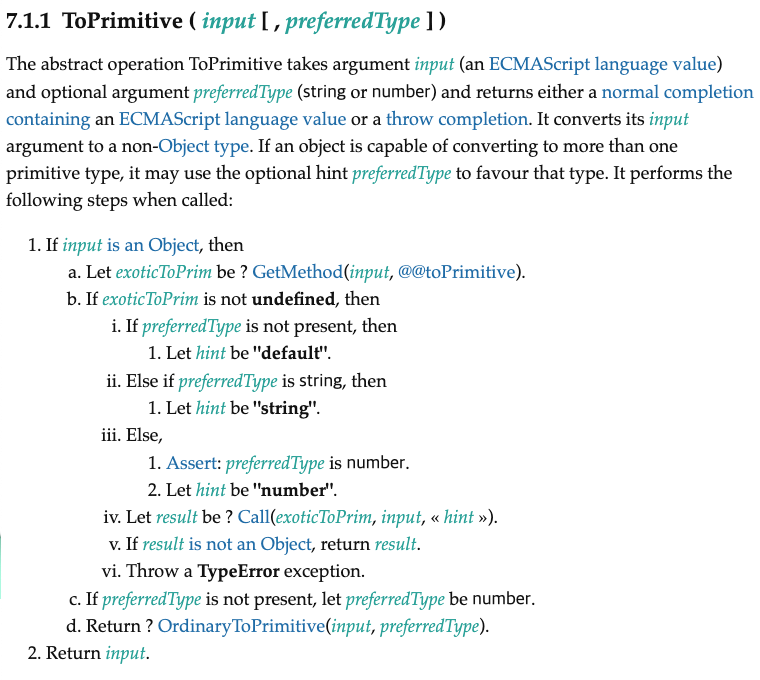

# 시작

JS를 처음 배울 때는 보통 JS에서 다루는 기본적인 값인 원시값이라는 것들이 무엇인지를 배운다. 어디선가 다음과 비슷한 설명을 보면서 말이다.

> JavaScript에서 원시 값(primitive, 또는 원시 자료형)이란 객체가 아니면서 메서드도 가지지 않는 데이터입니다. 원시 값에는 7종류, string, number, bigint, boolean, undefined, symbol, 그리고 null이 존재합니다.
>
> [MDN Web Docs - 원시 값](https://developer.mozilla.org/ko/docs/Glossary/Primitive)

그리고 이 7종류의 원시 값들 중 대부분은 개발하다 보면 꽤나 보게 되고 목적도 명확하다. 가령 JS를 써서 개발하는 사람이라면 string 값이 어디에 쓰이는지 의심할 사람은 없다고 생각한다. bigint같은 경우 자주 보이지는 않지만 이름만 보아도 그 목적과 쓰임새를 알 수 있다.

이중 상대적으로 매우 낯설게 느껴지는 값이 있다. 바로 심볼이다. 다른 원시값들이 JS에서 얼마나 중요하게 그리고 많이 쓰이고 있는지를 생각하면 왜 이 심볼이 원시값의 한 자리를 차지하고 있는지조차 의심스럽기도 하다.

그래서 심볼이 무엇이고 어디에 쓰이는지 알아보았다. 심볼은 어플리케이션 레벨에서는 잘 쓰이지 않아도 그 특유의 고유값을 만드는 로직으로 JS의 내부 구현에서 매우 중요하게 쓰이고 있었다.

# 1. 심볼 소개

먼저 심볼이 무엇이고 어떤 방식으로 사용할 수 있는지 간략하게 알아보자.

## 1.1. 심볼이란?

심볼은 원시형 중에 하나로 ES2015에 도입되었다. `Symbol()` 생성자 함수를 사용해서 심볼을 생성할 수 있고 이는 고유하고 프로그램 전체에서 유일한 값임이 보장된다. 혼동을 막기 위해 `Symbol` 생성자 함수에 new를 쓰는 것은 지원하지 않는다.

```js
// 심볼 생성하기
let id1 = Symbol();
let id2 = Symbol();
// 심볼 각각은 유일하기에 다음 수식은 false로 평가된다
console.log(id1 == id2);

// 이렇게 new를 쓰면 TypeError 발생
let newSymbol = new Symbol();
```


## 1.2. 심볼의 설명 인자

앞에서 보았듯이 `Symbol()` 생성자 함수를 이용해서 심볼을 생성할 수 있다.

심볼을 만들 때 생성자 `Symbol()`의 인수에 문자열을 전달함으로써 설명을 붙일 수 있다. 이는 디버깅 시 유용하게 쓰일 수 있다.

```js
let id1 = Symbol("id");
console.log(id1);
```

또한 이 설명은 심볼을 `toString()`메서드로 문자열 변환했을 때 표시된다. 참고로 심볼은 문자열으로 자동 형변환될 수 없다. 가령 alert의 인수로 심볼을 넘기면 다음과 같은 에러가 발생한다.

```
Uncaught TypeError: Cannot convert a Symbol value to a string
```

그래서 앞서 말한 `toString()`메서드를 사용해서 심볼을 문자열 형태로 출력해 줄 수 있다.

```js
let id1 = Symbol("id");
alert(id1.toString()); //Symbol(id)
```

아니 사실 앞서 `Symbol()`에 전달한 인수는 디버깅 외에는 딱히 쓸 수 있는 곳이 없다. 물론 `description` 프로퍼티를 사용하면 심볼을 생성할 때 전달했던 설명을 가져올 수 있다. 하지만 이런 설명을 활용해서 심볼의 비교를 한다거나 하는 경우 굳이 고유값인 심볼을 사용할 이유가 없으므로 이 설명은 정말 쓸 필요가 없다.

```js
let id1 = Symbol("id");
alert(id1.toString()); //Symbol(id)
alert(id1.description); //id
```

설명이 동일한 심볼을 여러 개 만들어도 심볼 각각은 유일하기에 생성자 함수에 인수로 전달한 설명은 그저 우리가 식별할 수 있는 이름표 역할을 할 뿐이다.

## 1.3. 전역 심볼 레지스트리

앞서 말했듯이 심볼은 생성자 인수로 전달한 문자열 같은 것에 관계없이 `Symbol()` 생성자로 생성되었다면 모두가 고유하고 유일한 값임이 보장된다.

하지만 이는 여러 스크립트에서 공통으로 쓸 수 없고 또한 처음 심볼을 생성한 곳 외에 다른 곳에서 접근하기 쉽지 않다는 단점이 있다. 어떤 객체 내부에서 심볼 키를 생성했다면 그 키를 어떻게 가져올 것인가?

```js
// 다음과 같은 객체의 키에 어떻게 접근할 것인가?
{
  [Symbol()]: {
    msg:"안녕하세요"
  }
}
```

하지만 전역 심볼 레지스트리를 사용하면 이름이 같은 심볼이 같은 개체를 가리키도록 할 수 있다.

### 1.3.1 Symbol.for(key)

`Symbol.for(key)`는 인수로 주어진 `key`를 사용해서 런타임 범위의 심볼 레지스트리에서 해당 키를 가진 심볼을 찾고 존재할 경우 이를 반환한다. 만약 그런 심볼이 없을 경우에는 해당 키를 사용해 전역 심볼 레지스트리에 새로운 심볼을 만든 후 리턴한다.

즉 이름이 같은 `key`를 사용해서 이 함수를 호출할 경우 같은 런타임 범위에서는 항상 같은 심볼을 반환해 준다.

```js
// 전역 심볼 레지스트리에 id 심볼 등록됨
let id = Symbol.for("id");
// 이미 등록된 심볼을 반환함
let id2 = Symbol.for("id");
// true
alert(id === id2);
```

### 1.3.2 Symbol.keyFor(sym)

`Symbol.for(key)`를 사용해 만든 심볼은 `Symbol.keyFor(sym)`를 사용해 해당 심볼을 생성할 때 사용했던 `key`를 얻을 수 있다.

```js
let id = Symbol.for("id");
let witch = Symbol.for("witch");
// id
console.log(Symbol.keyFor(id));
// witch
console.log(Symbol.keyFor(witch));
```

이 함수는 전역 심볼 레지스트리를 뒤져 인수로 받은 심볼의 이름을 얻어낸다. 전역 심볼 레지스트리에 등록되지 않은 심볼이라면 `undefined`를 반환한다. 이후에 살펴보겠지만 well-known symbol들은 전역 심볼 레지스트리에 등록되어 있는 심볼이 아니다.

```js
console.log(Symbol.keyFor(Symbol.iterator)); // undefined
```

만약 전역 심볼이 아닌 심볼의 생성시 이름으로 전달한 문자열 인수를 얻고 싶다면 앞서 언급한 `description` 프로퍼티를 사용하면 된다.

```js
let id = Symbol("test");
console.log(id.description); // test
```

# 2. 심볼형이 만들어진 목적

그럼 이런 심볼은 왜 만들어진 걸까? [원래 목적은 private property를 만드는 것이었다.](https://exploringjs.com/es6/ch_symbols.html#_can-i-use-symbols-to-define-private-properties) 클래스 대신 객체를 프로토타입으로 사용하는 JS의 특성상 아마 객체 내부에서만 접근할 수 있는 어떤 프로퍼티를 만드는 게 목적이었을 것이다.

[즉시 실행 함수(IIFE)를 이용하면 클로저를 활용한 private 속성을 만들기도 가능하지만](https://starkying.tistory.com/entry/Javascript-Closure-%EA%B7%B8%EB%A6%AC%EA%B3%A0-IIFE%EC%9D%98-%ED%99%9C%EC%9A%A9) 아마 이를 객체 속성에도 적용하고 싶었던 모양이다.

그러나 `Reflect.ownKeys`등 객체 내부의 심볼 키를 알 수 있는 방법들이 생김에 따라서 심볼은 원래 목적과는 멀어졌다.

그래도 키값의 중복이 원천적으로 일어날 수 없는 고유값이라는 이 심볼형의 특성은 여전히 유용해서, 이름 충돌을 걱정하지 않고 어떤 객체 특성을 만들 때 쓰인다. 

Python의 `__`을 붙이는 private 속성명 컨벤션과 비슷하다고 할 수도 있겠다. 하지만 Python의 그러한 컨벤션으로 선언한 속성은 `_클래스명__변수명`으로 접근할 수 있다. 그런 점에서 이름이 아니라 완전한 고유값을 만들어 주는 심볼이 좀더 세련된 방식이다.

그럼 이 심볼을 어디에 쓸 수 있을지, 얼마 없는 어플리케이션 레벨의 사용처를 알아보도록 하자.

# 3. 상수 정의에 사용

enum과 같이 값에는 의미가 없고 상수 이름에 의미가 있는 경우가 있다. JS에서 enum과 같은 사용을 하려는 경우 `Object.freeze`로 동결한 객체를 사용한다.

예를 들어 다음과 같이 상수를 정의해서 쓰는 것을 생각해볼 수 있다.

```js
const Direction=Object.freeze({
  UP:'up',
  DOWN:'down',
  LEFT:'left',
  RIGHT:'right',
})
```

이러면 `Direction.UP`은 사실 문자열 `'up'`과 같기 때문에 상수의 실제 값이 중복될 가능성이 있다. 예를 들어 `Direction.DOWN===COMMAND.DOWN`이 같아지는 상황이 생길 수 있는 것이다.

그러면 방향을 지시했는데 어떤 중요한 명령을 내려버리는 경우가 생길 수 있다. 이럴 때 값의 중복을 막기 위해 심볼을 사용하면 더 견고한 코드를 작성할 수 있다.

이러면 각 상수의 실제 값이 고유한 값을 갖게 되고 심볼의 생성 시 인수로 넣어준 문자열을 이용해 각 심볼에 대한 디버깅을 수행할 수도 있다.

```js
const Direction = Object.freeze({
	UP: Symbol('up'),
	DOWN: Symbol('down'),
	LEFT: Symbol('left'),
	RIGHT: Symbol('right'),
})
```

이런 경우가 흔치는 않지만 이 방식을 [React 프로젝트 코드](https://github.com/facebook/react/blob/ba9582da27481677cdac2dd000a438147a5df88e/packages/react-devtools-shared/src/hydration.js#L21)에서도 사용하고 있다.

```js
export const meta = {
  inspectable: Symbol('inspectable'),
  inspected: Symbol('inspected'),
  name: Symbol('name'),
  preview_long: Symbol('preview_long'),
  preview_short: Symbol('preview_short'),
  readonly: Symbol('readonly'),
  size: Symbol('size'),
  type: Symbol('type'),
  unserializable: Symbol('unserializable'),
};
```

# 4. 심볼형으로 숨김 프로퍼티 만들기

심볼은 문자열과 함께 객체의 프로퍼티 키로 사용할 수 있다. 심볼 키는 `for..in`이나 `Object.getOwnProperties()`, `Object.keys()`와 같은 일반적인 객체 속성 조회 방법에서는 무시된다.

```js
const mySymbol = Symbol('mySymbol');

const obj={
  nickname: 'witch',
  age: 18,
  [mySymbol]: 'hello'
}

/* nickname witch
age 18 */
for(let key in obj){
  console.log(key, obj[key]);
}

console.log(Object.keys(obj)); // [ 'nickname', 'age' ]
```

심볼의 이런 특성을 사용하면 객체 내부에 일반적으로는 조회할 수 없는 프로퍼티를 만들 수 있다. 이를 이용해서 객체에 숨김 프로퍼티를 만들 수 있다.

## 4.1. 객체의 숨겨진 속성 만들기

이런 숨김 프로퍼티는 먼저 객체의 메타 데이터를 기록하는 데에 쓰일 수 있다. 외부 코드에서 쉽게 접근할 수도, 값을 덮어쓸수도 없는 프로퍼티를 만드는 것이다.

```js
const userInternalKey = Symbol('userInternalKey');
let user={
  nickname:'witch',
  [userInternalKey]:32951235,
}
```

이를 클래스나 생성자 함수 단위에서 이용할 수도 있다. 이러면 이 생성자나 클래스의 모든 인스턴스에 숨김 프로퍼티가 추가된다.

```js
const mySymbol = Symbol('mySymbol');

class MyClass{
  constructor(){
    this[mySymbol] = 'foo';
    this.prop = 'bar';
  }
  getMyValue(){
    return this[mySymbol];
  }
}

const myClass = new MyClass();
console.log(myClass.getMyValue()); // foo
console.log(Object.getOwnPropertyNames(myClass)); // [ 'prop' ]
```

## 4.2. 외부 객체에 속성 추가하기

이를 실질적으로 활용할 수 있는 방법이 있을까? 객체에서 쉽게 조회할 수 없고 이름 충돌도 걱정할 필요 없는 어떤 프로퍼티를 만들어야 하는 상황이 무엇일까?

여러가지 있을 수 있겠지만 외부 라이브러리 코드에서 가져온 객체에 나만의 속성을 추가해야 할 때를 들 수 있다.

외부 라이브러리에서 가져온 `user`객체가 있다고 해보자. 이 객체는 다음과 같이 구성되어 있다.

```js
const user={
  name:"witch",
  nickname:"witch",
  position:"developer",
  age:25
}
```

여기에 내가 추가적으로 `isWorking`속성을 붙여 주고 싶다고 하자. 물론 이렇게 바로 추가해 줄 수도 있다.

```js
user.isWorking = true;
```

하지만 이렇게 할 경우 몇 가지 문제가 발생할 수 있다.

가장 대표적인 문제로는 외부 라이브러리의 코드에서 해당 객체를 `for..in`이나 `Object.keys()`와 같이 객체 속성들을 전부 조회하는 함수에 사용하고 있을 시 내가 추가한 속성 때문에 어떤 문제가 발생할 수 있다. 이 부분에 관해서는 이후 섹션에서 더 이야기할 것이다.

그리고 라이브러리 제작자가 추후에 `user`객체에 `isWorking`속성을 추가하는 바람에 내 속성이 라이브러리에서 추가한 속성과 충돌을 일으킬 수 있다. 심지어는 표준 위원회가 모든 객체에 `isWorking`속성을 추가하도록 결정할 수도 있다.

이런 문제들은 심볼을 외부 객체의 key로 쓰면 해결할 수 있다. 앞서 말했듯이 심볼은 프로그램 전체에서 유일한 값으로 보장된 값이며 `for..in`과 같은 객체 속성 조회 코드에서도 무시되기 때문이다. 또한 당연히 `Symbol("isWorking")`과 `"isWorking"`은 다르기 때문에 이름 충돌도 걱정할 것 없다.

```js
const user={
  name:"witch",
  nickname:"witch",
  position:"developer",
  age:25
}

const isWorking = Symbol("isWorking");
user[isWorking] = true;
```

외부 스크립트는 심볼 키를 가진 프로퍼티에 쉽게 접근하지 못한다는 점을 이용한 것이다.(이게 private를 의미하는 건 아니다. `sym in obj`처럼 내부 검사 로직에서는 심볼 키에 접근할 수 있기도 하고 위에서 본 것처럼 `Object.getOwnPropertySymbols()`나 `Reflect.ownKeys()`같은 메서드도 있다. 또한 `Object.assign`은 심볼 키를 무시하지 않고 객체 내 모든 프로퍼티를 복사한다)

이를 좀더 발전시켜서 아예 어떤 객체에 심볼 속성을 붙여 주는 함수를 짤 수도 있다. 다음 코드의 `addPropertyBySymbol`함수는 객체에 고유한 심볼 키를 가진 프로퍼티를 추가해 준다.

```js
const user={
  name:"witch",
  nickname:"witch",
  position:"developer",
  age:25
}

const isWorking = Symbol("isWorking");

function addPropertyBySymbol(obj) {
  obj[isWorking] = true;
}

addPropertyBySymbol(user);
// user 객체가 id 심볼을 가지고 있는지에 따라 판단
if (user[isWorking]) {
  console.log("id exists");
}
```

데코레이터 같은 것을 사용하면 클래스 인스턴스 생성 시 자동으로 숨김 프로퍼티를 추가해 주도록 할 수도 있고, 이렇게 숨김 프로퍼티를 추가해 놓으면 특정 객체나 인스턴스에 대한 어떤 판단을 내리거나 객체를 식별하는 데에 해당 프로퍼티를 사용할 수 있다.

## 4.3. 다른 방법과의 비교

이런 숨김 프로퍼티는 앞서 보았듯 다른 코드에서 관여할 수 없는 프로퍼티를 만들거나 마치 팝업창이나 알림창과 같이 각각을 식별할 수 있는 값을 만들어 줘야 할 때 사용할 수 있다. 앞에서 `user`객체에 새로운 프로퍼티를 만들어 준 것과 같다. (이번에는 대괄호를 이용해서 객체 리터럴에 바로 심볼 키를 넣어 주었다.)

```js
let id1 = Symbol("id");
let id2 = Symbol("id");

let cafe1 = {
  name: "스타벅스",
  [id1]: 1,
};

let cafe2 = {
  name: "이디야",
  [id2]: 2,
};
```

하지만 꼭 이렇게 해야 할까? 이미 uuid와 같은 라이브러리들이 이미 잘 나와 있다. 따라서 이는 uuid 라이브러리를 이용하면 다음과 같이도 쓸 수 있을 것이다. 

```js
const { v4: uuidv4 } = require("uuid");

const id = uuidv4();

function addPropertyByRandom(obj) {
  obj[id] = 1;
}

let user = {
  name: "김성현",
};

addPropertyByRandom(user);

if (user[id]) {
  console.log("id exists");
}
```

물론 이는 거의 똑같이 동작한다. uuid 라이브러리는 그렇게 무거운 라이브러리도 아니라서 번들 사이즈를 그렇게 많이 늘리지도 않을 것이다. 혹은 최신 브라우저에서는 `crypto.randomUUID()`를 사용해서 아예 라이브러리를 사용하지 않는 방법도 있다.

물론 여기서는 라이브러리를 쓰는지 여부가 중요한 문제는 아니므로 그냥 유명한 라이브러리인 uuid을 사용하여서 코드를 작성할 것이다.

아무튼 이런 랜덤 문자열 생성 방식의 문제는 이렇게 랜덤 문자열 키를 사용할 경우 외부에서 접근하기가 너무 쉽다는 것이다. 심볼도 완전한 private는 아니지만 그래도 `for..in`을 통한 접근이나 `JSON.stringify`, `Object.keys()`같은 웬만한 객체 속성 접근방식으로부터는 안전하다.

예를 들어 다음 코드를 보자. 심볼을 통해 정의한 속성은 일반적인 방식의 접근 대상에서 빠지지만 랜덤 문자열을 이용하면 속성이 노출되는 것을 볼 수 있다.

```js
const { v4: uuidv4 } = require("uuid");

const id = uuidv4();
const symbolId = Symbol("id");

function addPropertyByRandom(obj) {
  obj[id] = 1;
}

function addPropertyBySymbol(obj) {
  obj[symbolId] = 1;
}

let user1 = {
  name: "김성현",
};

let user2 = {
  name: "마녀",
};

addPropertyByRandom(user1);
addPropertyBySymbol(user2);

// {"name":"김성현","8f2aeb41-eb10-43f0-944d-fd994926b63e":1}
console.log(JSON.stringify(user1));
// {"name":"마녀"}
console.log(JSON.stringify(user2));

// name과 랜덤 문자열이 출력됨
for (let i in user1) {
  console.log(i);
}
// name만 출력됨
for (let i in user2) {
  console.log(i);
}
```

물론 랜덤 문자열 속성을 사용자 접근으로부터 숨길 수 있다. `Object.defineProperty`를 사용하면 된다. 가령 위 코드의 `addPropertyByRandom`함수를 다음과 같이 변경하면 랜덤 문자열을 이용한 방법도 심볼을 통한 접근과 비슷하게 쓸 수 있을 것이다.

```js
function addPropertyByRandom(obj) {
  Object.defineProperty(obj, id, {
    enumerable: false,
    value: uuidv4(),
  });
}
```

하지만 심볼을 쓸 수 있는 환경이라면 만에 하나 충돌이 일어날 수도 있는 랜덤 문자열 생성과 복잡한 `Object.defineProperty`를 통한 속성 설정보다는 심볼을 쓰는 게 더 간단하고 안전하다.

# 5. 잘 알려진 심볼

## 5.1. 배경

심볼이 등장하기 이전에 JS는 몇몇 내장 작업에 그냥 객체의 내장 함수 속성을 사용했다. [JSON.stringify 함수는 지금도 객체의 `toJSON()` 메서드를 사용한다.](https://witch.work/posts/javascript-json-object#3.2.3.-toJSON) `toString()` 메서드도 객체의 일반 속성으로 정의되어 있다.

하지만 이런 객체 내장 함수 속성이 늘어날수록 이름 충돌로 인해 하위 호환성이 깨질 가능성이 높아지고 사용자가 객체 속성을 만들 때 고려해야 할 점이 늘어난다. 

이런 내장 함수를 심볼 키에 대응시킴으로써 이런 문제를 해결할 수 있어졌다. 그리고 이때 쓰이는 심볼 키를 well-known symbol이라고 한다.

## 5.2. 잘 알려진 심볼 소개

`Symbol`생성자 함수의 정적 속성은 모두 그 자체로 심볼이다. 이 심볼들은 잘 알려진 심볼(well-known symbol)이라 불리며 JS 내장 작업에서 일종의 프로토콜로 동작한다.

이런 잘 알려진 심볼은 보통 이름 앞에 `@@`를 붙여 구분한다. `@@toPrimitive`같은 식으로 말이다. 심볼에는 리터럴이 존재하지 않기도 하고 `Symbol.toPrimitive`처럼 쓰면 다른 별칭으로 같은 심볼을 가리킬 수 있다는 게 드러나지 않기 때문이다.

예를 들어서 ECMA의 JS 명세를 읽다 보면 `ToPrimitive`라는 내장 작업을 숱하게 보게 된다. 이 작업은 객체를 원시형으로 변환할 때 사용되는데 이때 가장 우선적으로 사용되는 메서드가 `Symbol.toPrimitive`이다. 이 메서드가 객체에 없으면 `toString`과 `valueOf`를 사용한다.



다른 잘 알려진 심볼로는 `@@iterator`, `@@toStringTag`등이 있다. 이런 식으로 JS는 내장 작업을 위해 잘 알려진 심볼을 우선적으로 사용하는데 다음 섹션에서는 이런 잘 알려진 심볼 중 대표적인 몇 개만 알아볼 것이다. 이 글에서 중요한 것은 잘 알려진 심볼 각각이 아니라 심볼이라는 값이 JS의 내부 구현에 많이 녹아 있다는 것을 알아두는 것이기 때문이다.

참고로 이런 잘 알려진 심볼들은 프로그램의 수명 내내 고유하게 유지되기 때문에 가비지 컬렉션 여부와 같은 문제를 고려하지 않아도 된다. 그냥 늘 존재하는 것이다.


# 6. 잘 알려진 심볼 예시

JS에는 다음과 같은 잘 알려진 심볼들이 있다.

## 6.1. Symbol.unscopables

이 심볼은 특정 객체의 속성을 with 바인딩에서 제외하는데, with에서 발생하는 충돌을 해결하기 위해 만들어졌다. 

다음과 같이 Symbol.unscopables를 이용하여 객체의 일반 속성을 with 바인딩에서 가릴 수 있다.

```js
const human = {
  name: 'John',
  age: 30,
  [Symbol.unscopables]: {
    age: true
  }
};

with(human) {
  console.log(age); // Uncaught ReferenceError: age is not defined
}
```

이것은 객체에 기존에 정의되어 있는 프로퍼티 혹은 메서드와 with 바인딩의 이름이 충돌할 때 기존 프로퍼티를 가리기 위해 사용된다.

## 6.2. Symbol.toPrimitive

객체를 원시형으로 형 변환시 사용되는 메서드로 hint에 따라 다른 원시형으로 변환하도록 설계할 수 있다. 하지만 딱히 제한이 있는 건 아니고 원시형을 반환하기만 하면 된다.

```js
const user = {
  name: "김성현",
  age: 30,
  // 원시형으로 변환해 주는 메서드. 
  // hint에 따라 다른 원시형으로 변환하도록 할 수 있다.
  // 하지만 반환형이 원시형이기만 하면 형에 대한 제약은 없다.
  [Symbol.toPrimitive](hint) {
    return this.age;
  },
};

console.log(String(user)); //30
// 숫자로 형변환
console.log(+user); // 30
```

[빌트인 Date 객체 등이 이런 커스텀 toPrimitive를 가지고 있다.](https://262.ecma-international.org/13.0/#sec-date.prototype-@@toprimitive)

## 6.3. Symbol.toStringTag

ECMA5에는 모든 객체에 객체의 분류를 나타내는 `[[Class]]` 내부 프로퍼티가 존재했었다. 그리고 이를 `toString()`메서드에 사용했다.

하지만 ES6부터는 이 `[[Class]]`프로퍼티가 사라졌고 호환성을 위해 `@@toStringTag`가 정의었다. 따라서 class에서 다음과 같이 `@@toStringTag`를 오버로딩하면 `toString()`메서드를 호출할 때 사용된다.

```js
class MyClass{
  get [Symbol.toStringTag](){
    return '내 클래스';
  }
}

const myClass = new MyClass();

console.log(myClass.toString()); // [object 내 클래스]
```

[이 `toString()`의 동작이 더 자세하게 설명된 글이 있으니 필요하면 참고할 수 있다.](https://witch.work/posts/javascript-object-object#3.-Object.prototype.toString%EC%9D%98-%EC%9E%91%EB%8F%99%EB%B0%A9%EC%8B%9D)

## 6.4. Symbol.iterator

`for..of`루프는 `obj[Symbol.iterator]()`를 호출하면서 시작된다. 따라서 만약 객체가 특별한 `Symbol.iterator`메서드를 가지고 있다면 반복을 오버로딩할 수 있다.

이때 반복을 담당하는 함수는 iterator 프로토콜로 정의되는데 객체가 next 메서드를 가지고 있고 다음 규칙에 따라 구현되었다면 그 객체는 iterator 프로토콜을 따른다고 할 수 있다.

- next의 규칙
next는 다음 2개의 속성을 가진 object를 반환하고 인수가 없는 함수이다.
done(boolean) : Iterator(반복자)가 마지막 반복 작업을 마쳤을 경우 true. 만약 iterator(반복자)에 return 값이 있다면 value의 값으로 지정된다. 반복자의 작업이 남아있을 경우 false이다.
value : iterator로부터 반환되는 모든 자바스크립트 값. done이 true면 생략될 수 있다.

String의 기본 반복자를 통해 볼 수 있다.

```js
let word = "witch";
let it = word[Symbol.iterator]();
// {value: 'w', done: false}
console.log(it.next());
// {value: 'i', done: false}
console.log(it.next());
```

그리고 Symbol.iterator 오버로딩을 하면 반복을 다르게 작동시킬 수 있다. 다음 코드를 보면 user 객체의 Symbol.iterator를 오버로딩하여, user 객체를 for..of로 순회할 때 name이 아닌 전혀 다른 문자열이 나오게 하였다.

```js
let user = {
  name: "witch",

  [Symbol.iterator]: function () {
    return {
      next: function () {
        if (this._first) {
          this._first = false;
          return { value: "work", done: false };
        } else {
          return { done: true };
        }
      },
      _first: true,
    };
  },
};

let it = user[Symbol.iterator]();
// {value: 'work', done: false}
console.log(it.next());
// {done: true}
console.log(it.next());

// Symbol.iterator에 의해 work가 출력된다.
for (let i of user) {
  console.log(i);
}
```

### 6.4.1. 제너레이터 만들기

제너레이터는 복잡한 데이터 구조를 순차 접근할 수 있는 배열처럼 쉽게 다룰 수 있게 해준다. 제너레이터가 데이터를 한 번에 하나씩 반환하도록 해주기 때문이다.

또한 제너레이터는 함수가 호출되었을 때 끝까지 실행하지 않고 빠져나갔다가 다시 돌아올 수 있는 함수이기도 하다. 여러 개의 값을 필요한 만큼만 반환할 수 있는 것이다.

제너레이터는 function 키워드 뒤에 `*`을 붙여 만들 수 있으며 yield 키워드를 통해 정보를 반환한다. next()메서드도 쓸 수 있는데 이 메서드의 구체적 사양은 위에서 본 것과 같다. 실제로는 데이터를 하나씩 가져오는 역할이다.

다음 코드를 실행시켜 보면, member의 next를 호출할 때마다 getStudyMember에서 yield하는 값이 하나씩 반환되는 것을 볼 수 있다. 이는 정보가 매우 많고 일부씩만 접근해야 할 때 유용하다.

```js
function* getStudyMember() {
  yield "멤버 AAA";
  yield "멤버 BBB";
  yield "멤버 CCC";
  yield "멤버 DDD";
  yield "멤버 EEE";
  yield "멤버 FFF";
}

const member = getStudyMember();
console.log(member.next());
console.log(member.next());
console.log(member.next());
console.log(member.next());
```

이렇게 제너레이터를 만들면 이 제너레이터를 반복 가능한 객체처럼 쓸 수 있다. spread, for..of 등등 다 가능하다.

```js
const member = getStudyMember();
// 이름이 하나씩 출력됨
for (const m of member) {
  console.log(m);
}
```

이 제너레이터를 이용하면 앞서 말했다시피 복잡한 데이터 구조를 다룰 때 순차 접근하는 순서를 정해 줄 수 있다. 복잡하게 연관된 데이터를 배열처럼 순차 반복할 수 있게 되면 훨씬 간단하게 다룰 수 있다.

그리고 이 제너레이터 함수를 Symbol.iterator에 할당해 주면, 제너레이터를 통해 복잡한 객체를 마치 배열과 같은 반복 가능한 객체로서 다룰 수 있게 된다.

다음과 같은 코드를 볼 수 있다. 스터디 멤버들이 친구 관계로 중첩되어 묶여 있는 객체에 제너레이터를 만들어 주면 쉽게 순회할 수 있게 되고, 제너레이터를 더 잘 쓰면 한번에 n개씩만 순회하는 것도 가능하다. 이렇게 내가 만든 객체의 기능을 확장하는 데에도 잘 알려진 심볼이 쓰일 수 있다.

```js
function Study() {
  this.members = {
    name: "멤버 AAA",
    friend: {
      name: "멤버 BBB",
      friend: {
        name: "멤버 CCC",
        friend: {
          name: "멤버 DDD",
        },
      },
    },
  };

  this[Symbol.iterator] = function* () {
    let node = this.members;
    while (node) {
      yield node.name;
      node = node.friend;
    }
  };
}

const myStudy = new Study();
for (let m of myStudy) {
  console.log(m);
}
```

또한 이렇게 제너레이터를 만들면 내가 만든 객체의 복잡도를 숨길 수 있다. 그럼으로써 다른 개발자가 내가 만든 데이터 구조를 간편하게 사용할 수 있다.

## 6.5. Symbol.hasInstance

instanceof 연산자는 객체가 특정 클래스의 인스턴스인지 확인할 때 쓰인다. 이때 호출되는 것이 바로 Class의 constructor 혹은 생성자 함수의 `prototype`속성에 있는 `@@hasInstance`메서드이고 instanceof는 그 결과를 불리언으로 강제 변환된 결과를 반환한다.

따라서 이를 내가 원하는 대로 커스텀할 수도 있다. 예를 들어서 다음과 같이 클래스 생성자의 `@@hasInstance`를 오버로딩하면 `instanceof`연산자를 통해 내가 원하는 대로 동작하도록 할 수 있다.

다음과 같이 하면 `MyClass`는 모든 객체의 instanceof에 대해 true를 반환하게 된다.

```js
class MyClass{
  static [Symbol.hasInstance](obj){
    return true;
  }
}

console.log({} instanceof MyClass); // true
console.log(1 instanceof MyClass); // true
console.log('foo' instanceof MyClass); // true
```


잘 알려진 심볼들이 무엇이 있는지 [더 많이 설명된 블로그](https://infoscis.github.io/2018/01/27/ecmascript-6-symbols-and-symbol-properties/)나 [MDN 문서](https://developer.mozilla.org/ko/docs/Web/JavaScript/Reference/Global_Objects/Symbol#%EC%A0%95%EC%A0%81_%EC%86%8D%EC%84%B1)를 참고할 수 있다.

## 6.6. 잘 알려진 심볼들의 특성

이런 잘 알려진 심볼들은 엔진에 의해 모든 영역에서 공유된다. 앞서 살펴본 전역 심볼 레지스트리의 심볼과 같이 작동하는 것이다. 하지만 모든 영역에서 공유된다는 특성만 같을 뿐 잘 알려진 심볼들을 전역 심볼 레지스트리에서 찾을 수는 없다.

# 7. 결론

심볼은 ES6에서 새로 도입된 원시형으로, 다른 값과 중복되지 않는 유일무이한 값이다. 따라서 심볼을 키로 사용하면 다른 프로퍼티와 충돌할 위험이 없고 이를 이용해서 많은 객체의 내부 구현이 작동한다.

하지만 어디에도 겹치지 않는 고유한 값이며 객체에서 어느 정도 은닉된 속성을 제공할 수 있다는 것이 그렇게까지 큰 매력은 되지 못하여, 어플리케이션 제작 시 심볼을 쓰는 경우는 많지 않다. 심지어 요즘 대세인 TS에서는 `enum`을 지원하기 때문에 심볼의 사용 가능성은 더 줄어들었다고 할 수 있겠다.

그냥 이름 충돌 이슈를 고려하면서 숨김 속성이나 enum 비슷한 것을 만들 때 고려해 볼 만한 옵션 정도로 머리에 넣어 둘 수 있겠다. 하지만 JS 내부 구현에서는 아주 소중한 속성이다.

# 참고

MDN의 symbol 문서 https://developer.mozilla.org/ko/docs/Web/JavaScript/Reference/Global_Objects/Symbol

모던 자바스크립트 튜토리얼의 심볼형 https://ko.javascript.info/symbol

nhn cloud, JavaScript Symbol의 근황 https://meetup.nhncloud.com/posts/312

symbol의 쓰임에 관한 글 https://medium.com/intrinsic-blog/javascript-symbols-but-why-6b02768f4a5c

symbol의 쓰임에 관한 다른 글 https://roseline.oopy.io/dev/javascript-back-to-the-basic/symbol-usage

http://hacks.mozilla.or.kr/2015/09/es6-in-depth-symbols/

Symbol.iterator 참고 https://valuefactory.tistory.com/279

자바스크립트 코딩의 기술 41장, '제너레이터로 이터러블 속성을 생성하라'

Symbol.species https://www.bsidesoft.com/5370

심볼의 본래 목적 https://exploringjs.com/es6/ch_symbols.html#_can-i-use-symbols-to-define-private-properties

Symbol.species 심볼과 용례
https://jake-seo-dev.tistory.com/333

crypto.randomUUID
https://developer.mozilla.org/en-US/docs/Web/API/Crypto/randomUUID

JavaScript Symbols: the Most Misunderstood Feature of the Language? https://blog.bitsrc.io/javascript-symbols-the-most-misunderstood-feature-of-the-language-282b6e2a220e

ECMAScript 6 Symbol과 Symbol 프로퍼티
https://infoscis.github.io/2018/01/27/ecmascript-6-symbols-and-symbol-properties/

