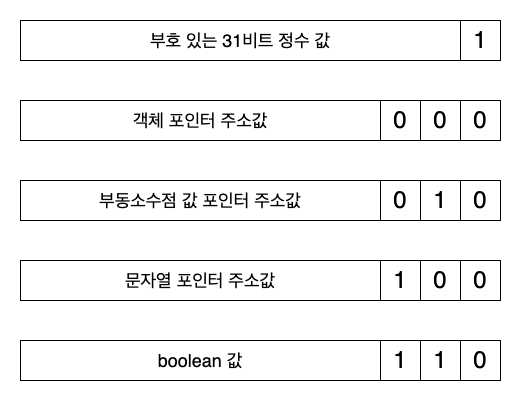

# 시리즈

| 제목 | 링크 |
|------|------|
| JS의 값은 스택과 힙 중 어디에 저장되는가? | [https://witch.work/posts/javascript-trip-of-js-value-where-value-stored](https://witch.work/posts/javascript-trip-of-js-value-where-value-stored) |

이 글은 Javascript 엔진에서 힙에 포인터와 값들을 저장할 때 사용하는 테크닉에 대해 알아보고 실제 엔진 구현체에서 이를 어떻게 구현했는지를 조사한 글 중 첫번째 글이다.

# 1. 시작

앞선 글인 [JS 탐구생활 - JS의 값은 스택과 힙 중 어디에 저장되는가?](https://witch.work/posts/javascript-trip-of-js-value-where-value-stored)에서 Javascript의 값은 기본적으로 힙에 저장되며 그 값을 가리키는 포인터도 대부분 힙에 저장된다는 것을 보았다.

그런데 이런 값들은 어떤 형식으로 저장될까? V8을 비롯한 대부분의 Javascript 엔진은 C++로 구현되어 있다. 여기서 우리는 어떤 방식으로 몇몇 값 그리고 주소들을 저장할 것인가?

당연하지만 메모리는 최대한 적게, 그리고 값을 읽어오는 것은 빠르게 할 수 있는 방식으로 저장해야 한다. Javascript 엔진에서 이러한 목적으로 사용하는 테크닉들에는 대표적으로는 tagged pointer와 NaN boxing이 있다. 이 글에서는 그러한 테크닉의 개념에 대해 다룬다. 실제 엔진에서 이를 어떻게 구현하는지에 대해서는 다음 글에 다룰 예정이다.

또한 그렇게 저장한 포인터를 통해 참조하고 있는 값들, 이를테면 객체나 문자열 같은 것들은 어떻게 저장하는지(히든 클래스를 비롯한)에 대해서는 이후 글에 다룰 예정이다.

# 2. tagged union

이제 엔진 제작자의 관점이 되어서 이러한 Javascript 값들을 어떻게 효율적으로 저장할지 고민해 보자. 여기부터는 기본적인 C/C++ 지식이 필요하다.

Javascript는 다음과 같은 종류의 값들을 지원한다. 이들을 지원할 수 있는 여러 가지 방법이 있다. 편의상 심볼과 BigInt는 제외하였다.

- 정수
- 부동소수점 실수
- 문자열
- 객체
- 불리언
- null
- undefined

Javascript에서는 정수 타입과 실수 타입이 나누어져 있지 않지만 대부분의 엔진에서 이 둘을 나누어 저장하고 있기 때문에 둘을 구분하였다.

꽤나 메모리를 적게 쓰면서도 간단한 방법은 tagged union이다. `union`을 이용해서 여러 타입의 값을 하나의 메모리 공간에 저장하고 `enum`으로 정의된 타입 태그를 통해 해당 값을 어떤 타입으로 읽어야 하는지 결정하는 방식이다. `union`은 여러 타입 값들 간에 메모리를 공유하므로 메모리도 적게 쓸 수 있다.

```c
typedef struct {
  enum { 
    TYPE_DOUBLE,
    TYPE_INT,
    TYPE_STRING,
    TYPE_OBJECT,
    TYPE_BOOLEAN
    TYPE_NULL,
    TYPE_UNDEFINED
   } type;
  union {
    double as_double;
    int32_t as_int;
    char* as_string;
    void* as_object;
    bool as_boolean;
  } value;
} Value;
```

`enum`으로 표현된 타입 태그를 통해 `union`으로 저장된 값을 어떻게 읽어 올지 정할 수 있다. 예를 들어 다음과 같이 하면 값을 문자열 형태로 읽어 올 것이다.

```c
Value v;
v.type = TYPE_STRING;
v.value.string = "hello";

if(v.type == TYPE_STRING){
  printf("%s\n", v.value.string);
}
```

실제로 Javascript가 맨 처음 만들어질 당시의 엔진이었던 Mocha가 이 방식을 사용했다. Mocha는 이후 SpiderMonkey 엔진이 되었는데 그러면서 이 방식은 사용되지 않게 되었다.

하지만 이 방식에서 메모리를 더 줄일 수는 없을까? 이렇게 할 경우 `enum`을 위해 4바이트가 쓰이고 `union`은 가장 큰 멤버의 메모리 사이즈를 따르므로 8바이트가 쓰인다. 만약 8바이트 워드를 사용하는 CPU라면 이 값을 저장하기 위해 16바이트가 할당될 것이다. 실제 저장해야 하는 값은 8바이트인데 2배나 되는 메모리를 사용하게 된다!

그럼 어떻게 메모리를 줄일 수 있을까? `double`값의 존재로 인해 값을 저장하기 위해 최소 8바이트가 필요하다. 그리고 타입 태그도 필요하다. 여기서 어떻게 값을 줄일 수 있을까?

# 3. 타입 태그 없애기 - tagged pointer

일단 값의 저장에서 가장 문제가 되는 건 `double` 타입이다. 이 부동 소수점을 저장하기 위해서는 IEEE-754 규격에 따라 8바이트를 온전히 사용해야 하기 때문이다.

하지만 `double`을 꼭 그대로 저장해야 할까? 실제 값을 다른 곳에 저장해 놓고 `double`에는 그 값을 가리키는 포인터를 저장하면 어떨까? 그러면 모든 값이 다음과 같이 표현될 수 있다.

```c
typedef union {
  uint64_t as_uint64;
  void* as_object_ptr;
} Value;
```

타입 태그가 없어졌다! 어떻게 할 수 있을지 아직은 모르지만, 여기에 모든 값과 타입을 담을 수 있다면 우리는 타입 태그를 없애버리고 값을 저장하는 데에 8바이트만 쓸 수 있게 된다. 그렇게 할 수 있을까?

## 3.1. 메모리 패딩

일반적으로 메모리가 할당될 때는 cpu 워드 하나 그러니까 64비트 아키텍처 기준으로 8바이트씩이 할당된다. 따라서 `malloc` 등으로 메모리 할당을 수행할 시 할당 연산은 8의 배수인 포인터를 반환하게 된다.

이는 32비트 플랫폼에서 사용되는 것을 포함한 거의 모든 메모리 할당 함수에서 그렇다. 물론 플랫폼이 그걸 보장하지 않더라도 직접 할당 함수를 작성하여 그렇게 보장시킬 수 있으므로 이는 큰 문제가 되지 않는다.

우리는 할당된 메모리의 시작점이 되는 모든 포인터의 주소가 8의 배수라는 것(혹은 그렇게 만들 수 있다는 것)을 알았다. 그러니 앞으로는 할당된 모든 포인터 주소는 모두 8의 배수라고 가정하자. 그 말은 그 포인터들의 마지막 3비트는 늘 0이라는 것이다!

우리는 이 빈 비트에 총 8($2^3$)가지의 정보를 저장할 수 있다. 우리가 사용할 타입 종류는 8가지가 안되기 때문에 이 빈 비트들에 타입 정보를 저장할 수 있다. 특히 null, undefined, boolean 같은 값들은 정해진 값이 적어서 따로 표현해 줄 수 있기 때문에 표현해야 할 타입 종류는 더 적어진다. 이렇게 하는 특정 비트에 정보를 저장하여 포인터를 저장하는 기법을 tagged pointer라고 한다.

## 3.2. tagged pointer

tagged pointer 기법을 이용하여 하위 비트에 다음과 같은 형식으로 태그를 붙여서 저장할 수 있다. 다음 이미지의 태그 값들은 실제로 초기 SpiderMonkey 엔진에서 사용했던 태그들을 가져온 것이다.



null, undefined가 빠져 있는데 undefined는 -2^30이었고 null은 NULL 포인터로 나타내어졌다. 그럼 다음과 같은 매크로 코드로 타입 태그를 판별하고 포인터 값을 읽어올 수 있었다. 실제 엔진에서는 true, false도 tagged pointer를 사용하여 저장하는 것이 아니라 따로 값을 만들어 저장함으로써(V8의 `ODDBALL`과 같이) 필요한 타입의 갯수를 하나 줄이곤 한다.

타입을 결정하는 매크로, 유니온을 이용해서 값을 읽어오는 매크로, 기존 포인터 값을 타입 태그를 붙여서 저장하는 매크로를 정의하였다.

```c
// JSVAL_IS_VOID는 undefined를 판별한다
#define JSVAL_IS_VOID(v) ((v)==JSVAL_VOID)
#define JSVAL_IS_NULL(v) ((v)==JSVAL_NULL)
#define JSVAL_IS_OBJECT(v) ((v.as_uint64 & 0x7) == 0x0)
#define JSVAL_IS_STRING(v) ((v.as_uint64 & 0x7) == 0x4)
#define JSVAL_IS_DOUBLE(v) ((v.as_uint64 & 0x7) == 0x2)
#define JSVAL_IS_INT(v) ((v.as_uint64 & 0x1))
#define JSVAL_IS_BOOLEAN(v) ((v.as_uint64 & 0x7) == 0x6)

// 하위 비트를 마스킹하는 매크로들
#define JSVAL_TO_INT(v) ((int32_t)(v.as_uint64 >> 1))
#define JSVAL_TO_OBJECT(v) (v.as_object_ptr)
#define JSVAL_TO_STRING(v) ((char*)(v.as_uint64 ^ 0x4))
#define JSVAL_TO_DOUBLE(v) ((double*)(v.as_uint64 ^ 0x2))
#define JSVAL_TO_BOOLEAN(v) ((char)(v.as_uint64 >> 3))

// 포인터에 타입 태그를 붙이는 매크로들
#define MAKE_OBJECT_PTR(p) ((uint64_t)(p))
#define MAKE_STRING_PTR(p) ((uint64_t)(p) | 0x4)
#define MAKE_DOUBLE_PTR(p) ((uint64_t)(p) | 0x2)
#define MAKE_INT(i) (((uint64_t)(i) << 1) | 0x1)

Value foo;
char* some_string;

foo.as_uint64 = MAKE_STRING_PTR(some_string);
foo.as_uint64 = MAKE_INT(234);
```

이렇게 포인터 주소에 타입 정보를 저장하는 tagged pointer 기법은 매우 고전적인 방식이기도 하다. [2000년 이전에 쓰인 Guile 언어 매뉴얼](https://www.gnu.org/software/guile/manual/html_node/Faster-Integers.html)에서도 이 테크닉을 소개할 정도이다.

2010년 이전까지의 SpiderMonkey 등 모든 Javascript 엔진 구현체가 처음에는 이 방식을 사용했다. Javascript V8 엔진에서는 현재도 이 방식을 사용하고 있고 SpiderMonkey 등의 다른 엔진도 tagged pointer 방식을 어느 정도 취하고 있다.

V8에서는 31비트 부호 있는 정수값인 smi와 기타 값들인 HeapObject를 구분하기 위해 Least Significant Bit를 사용한다. 이를테면 smi는 LSB가 0으로 끝나고 HeapObject는 1로 끝난다. 또한 히든 클래스에서도 내부적으로 tagged pointer 기법을 이용해 타입을 판정한다. 또한 Weak Reference를 나타내기 위해 2번째 하위 비트를 사용하기도 한다. 이는 엔진의 값 저장 구현을 구체적으로 다룰 다음 글에서 더 자세히 쓸 것이다.

# 4. NaN boxing 개요

## 4.1. tagged pointer의 문제점

tagged pointer 방식으로 모든 값을 저장하려고 하면 작은 문제가 있다. `double`은 8바이트이므로 tagged pointer를 사용할 경우 값을 직접 저장할 수 없고 포인터를 이용해야 한다.

이렇게 참조를 한 번 더 거치는 문제를 해결할 수 있는 방법은 없을까? NaN boxing이라는 방법을 사용하면 이 문제를 해결할 수 있다.

## 4.2. IEEE 754와 NaN

IEEE 754는 부동소수점을 표현하기 위한 표준이다. 그 중 배정밀도 `double` 형식은 64비트를 이용해서 실수를 표현한다. 1비트로 부호를, 11비트로 지수(exponent)를, 나머지 52비트로 가수(fraction / mantissa)를 표현한다.

이 형식을 통해 구체적으로 어떻게 부동 소수점을 표현하는지는 이 글에서 다루지 않는다. [위키백과의 IEEE 754 항목](https://ko.wikipedia.org/wiki/IEEE_754)등을 참고할 수 있다.

중요한 건 이 형식에서 `NaN`이라는 특별한 값을 정의하고 있다는 사실이다. 이 값은 `0/0`과 같이 계산에 대한 입력이 잘못되었을 때 생기는 값이다.

IEEE 754 규격에서는 지수부가 모두 1로 채워지고 가수부가 모두 0은 아닐 때(즉 가수부가 `000...000`이 아닐 때) `NaN`이라고 한다. 참고로 만약 지수부가 모두 1이고 가수부가 모두 0이면 그건 무한대를 의미한다. 

이때 NaN에는 quiet NaN(`qNaN`)과 signaling NaN(`sNaN`)이 있다.

- quiet NaN(qNaN)

quiet NaN은 연산 결과가 정의되지 않은 경우 발생하는데 연산의 흐름을 계속 유지할 수 있도록 한다. 에러를 발생시키지 않고 연산의 흐름을 유지하면서 에러를 나중에 처리할 수 있도록 한다. 대부분의 시스템에서 연산의 결과로서 NaN을 나타내기 위해 qNaN을 사용한다.

NaN 조건을 만족하면서 가수부의 첫 비트가 1일 경우 qNaN이 된다.

- signaling NaN(sNaN)

signaling NaN은 연산이 수행될 때 FPU(float point unit)에서 예외를 발생시키도록 한다. 이는 연산이 잘못되었음을 빠르게 알 수 있도록 한다. 일반적으로 부동 소수점 객체는 sNaN으로 초기화되며 값이 들어가지 않은 부동 소수점 객체에 연산이 가해졌을 때 에러를 발생시키기 위해 사용된다.

NaN 조건을 만족하면서 가수부의 첫 비트가 0일 경우 sNaN이 된다.

이때 일반적인 시스템에서는 `NaN`의 표현을 위해 `qNaN`을 사용한다(근거에 대해서는 [이 글](https://anniecherkaev.com/the-secret-life-of-nan)을 참고할 수 있다).

그런데 `qNaN`을 표현하기 위해서는 지수부 11비트가 모두 1이고 가수부의 첫 비트가 1이기만 하면 된다. 그럼 우리는 `64 - 11 - 1 = 52`비트를 다른 용도로 사용할 수 있다! 부호 비트를 빼더라도 51비트나 사용할 수 있다.

이는 표준에서도 간접적으로 허용하는 방식인데 NaN에 포함된 정보의 전파를 위해서는 연산의 결과로 나온 NaN에 정보를 보존해야 한다고 표준에서 규정하고 있기 때문이다.

> To facilitate propagation of diagnostic information contained in NaNs, as much of that information as possible should be preserved in NaN results of operations.

그럼 이 51비트의 여유 공간(보통 payload라고 부르므로 이후에도 payload라고 부르겠다)을 이용해서 다른 값을 저장할 수 있다! 이렇게 하는 기법을 NaN boxing이라고 한다.

# 5. NaN boxing으로 값 표현하기

## 5.1. 값의 종류

IEEE 754 규격에서 원래 `NaN`이어야 할 값을 이용하여 다른 값을 표현하는 방식이 바로 NaN boxing이다. 앞서 보았던 NaN의 payload를 이용하여 값을 저장한 후 이를 다시 읽어오는 방식이다.

만약 제대로 된 IEEE-754 double 값이면 그 값을 double로 해석하고 아니면 NaN boxing으로 저장된 값이라고 판단하면 된다.

먼저 우리가 저장해야 할 값이 어떤 것이고 어떤 형식인지 생각해 보자. 

- 부동 소수점 실수 : 이 값은 IEEE 754 부동 소수점 표준에 따라 저장하면 된다.
- 포인터 주소 : 일반적인 64비트 아키텍처에서 포인터는 하위 48비트만 사용해서 표현된다. 심지어 일반적으로 사용자가 접근하게 되는 메모리는 모두 "positive address"이기 때문에 하위 47비트만 사용해서 표현된다. 나머지 상위 비트는 일반적으로 bit 48의 sign extension을 통해 채워진다.
- 정수 : 32비트 부호 있는 정수를 저장해야 한다.
- boolean(true, false), null, undefined : 이들은 총 4개의 값만 어떻게든 저장하면 된다.

이를 64비트에 저장해야 한다.

## 5.2. 설계

64비트에 NaN boxing을 이용해서 앞서 본 종류의 값들을 저장하려면 어떻게 해야 할까? 먼저 double은 그냥 IEEE 754 표준에 따라 저장하면 된다. 나머지 값들은 NaN의 payload에 저장한다.

그리고 payload에 저장될 값의 타입이 매우 다양하기 때문에 이를 구분하기 위한 태그가 필요하다. 이 태그는 payload의 상위 비트에 저장된다. payload에 저장할 값들은 최대 47비트인 것 그리고 quiet NaN임을 표현하기 위해 가수부(mantissa)의 최상위 1비트가 1이어야 한다는 점을 감안하면(이는 값이 double인지 체크할 때도 의) 다음과 같이 값의 비트 구조를 설계해 볼 수 있다.


그러니 다음과 같은 태그들을 먼저 정의하자. payload에 저장된 값의 타입을 나타내는 것이다.

```c
// 실제 SpiderMonkey 엔진에서의 정의를 빌려왔다
// https://searchfox.org/mozilla-central/source/js/public/Value.h#162
// magic은 에러 처리 등 내부적으로 특별한 값을 위해 사용되는 타입이라고 생각하면 된다
enum JSValueType {
  JSVAL_TYPE_DOUBLE = 0,
  JSVAL_TYPE_INT32 = 1,
  JSVAL_TYPE_BOOLEAN = 2,
  JSVAL_TYPE_UNDEFINED = 3,
  JSVAL_TYPE_NULL = 4,
  JSVAL_TYPE_MAGIC = 5,
  JSVAL_TYPE_STRING = 6,
  JSVAL_TYPE_OBJECT = 7,
};
```

그리고 다음과 같이 NaN의 상위 비트에 붙을 태그 비트열을 정의한다.

```c
enum JSValueTag {
  JSVAL_TAG_CLEAR = 0x1FFF0,
  JSVAL_TAG_INT32 = JSVAL_TAG_CLEAR | JSVAL_TYPE_INT32,
  JSVAL_TAG_BOOLEAN = JSVAL_TAG_CLEAR | JSVAL_TYPE_BOOLEAN,
  JSVAL_TAG_UNDEFINED = JSVAL_TAG_CLEAR | JSVAL_TYPE_UNDEFINED,
  JSVAL_TAG_NULL = JSVAL_TAG_CLEAR | JSVAL_TYPE_NULL,
  JSVAL_TAG_MAGIC = JSVAL_TAG_CLEAR | JSVAL_TYPE_MAGIC,
  JSVAL_TAG_STRING = JSVAL_TAG_CLEAR | JSVAL_TYPE_STRING,
  JSVAL_TAG_OBJECT = JSVAL_TAG_CLEAR | JSVAL_TYPE_OBJECT,
}
```

`JSVAL_TAG_CLEAR`의 값인 `0x1FFF0`은 갑자기 튀어나온 것 같다. 하지만 이는 NaN boxing으로 값을 집어넣기 위해 비워 놓은 것이다. tag와 payload를 이용해서 값을 만드는 이 함수를 보면 이해할 수 있다.

```c
#define JSVAL_TAG_SHIFT 47

uint64_t bitsFromTagAndPayload(JSValueType tag, uint64_t payload){
  return (uint64_t(tag) << JSVAL_TAG_SHIFT) | payload;
}
```

tag를 47비트 왼쪽으로 shift해서 payload와 합치는 로직이다. 그런데 이때 `JSVAL_TAG_CLEAR`의 값인 `0x1FFF0`를 47비트만큼 왼쪽으로 shift하면 부호비트와 지수부의 11비트가 모두 1로 채워지고 가수부의 첫 비트까지 1이 된다. 이는 하드웨어의 sign bit 기본값에 따라 다르지만 일반적으로 quiet NaN의 값이다. 그러니 여기에 `JSVAL_TAG_*`와 payload를 합치면 NaN boxing으로 값을 저장할 수 있다.

그럼 우리는 이를 기반으로 값을 저장하는 클래스를 만들 수 있다. 이제부터는 union도 필요 없고 그냥 uint64_t로 값을 저장하면 된다. 어차피 형변환을 통해서 값을 읽어올 것이므로 비트만이 중요하기 때문이다.

생성자에서는 기본적으로 undefined로 값을 초기화하고, 생성자에 비트열을 제공할 시 다른 값을 저장할 수 있게 한다.

```cpp
class Value {
  private:
  uint64_t valueAsBits;

  public:
  Value(): valueAsBits(bitsFromTagAndPayload(JSVAL_TAG_UNDEFINED, 0)) {}
  Value(uint64_t bits): valueAsBits(bits) {}
}
```

## 5.3. double의 저장과 판단

double형 부동 소수점은 IEEE 754 표준에 따라 저장하면 된다. 그런데 `uint64_t`에 어떻게 저장할 수 있을까? 포인터 형변환을 이용해서 다음과 같이 할 수 있다.

```cpp
class Value {
  static uint64_t bitsFromDouble(double d){
    return *(uint64_t*)(&d);
  }
}
```

포인터 형변환에 대해서는 [예전에 다른 사이트에서 내가 썼던 '포인터의 형변환' 글을 참고할 수 있다.](https://panty.run/pointertype/) 참고로 실제 Javascript 엔진들은 C++이기 때문에 `reinterpret_cast`등 C++에서 지원하는 형변환 문법을 사용하지만 포인터 형변환 쪽이 더 원리를 드러낸다 생각해서 이렇게 썼다.

그럼 다음과 같은 static 메서드들을 통해 double을 값으로 갖는 Value를 만들 수 있다.

```cpp
class Value {
  static Value fromRawBits(uint64_t bits){
    return Value(bits);
  }

  static Value fromDouble(double d){
    return Value(bitsFromDouble(d));
  }
}
```

그럼 저장된 값이 double인지는 어떻게 판단할까? 물론 `JSVAL_TAG_DOUBLE`를 이용해서 판단할 수 있지만 더 쉬운 방식도 있다. IEEE 754에서는 exponent bit 들이 모두 1인 경우를 무한대 혹은 NaN 즉 정상적인 double이 아닌 값으로 판단한다.

이 값은 uint64_t로 생각했을 때 당연히 상한이 있고 그건 부호 비트까지 감안하면 `0xfff8000000000000`이다. 이 값보다 작거나 같으면 exponent가 전부 1이 아닌 것이므로 정상적인 double값이라고 판단할 수 있다.

즉 다음과 같은 코드로 double인지 판단할 수 있다(실제 엔진에서는 여러 가지 이유로 좀 더 큰 값을 사용하지만 원리는 똑같다).

```cpp
bool ValusIsDouble(Value v){
  return (v <= 0xfff8000000000000);
}

class Value {
  bool isDouble(){
    return ValusIsDouble(valueAsBits);
  }
}

// SpiderMonkey 엔진에서는 다음과 같이 구현되어 있다.
// https://searchfox.org/mozilla-central/source/js/public/Value.h#302
constexpr bool ValueIsDouble(uint64_t bits) {
  return bits <= JSVAL_SHIFTED_TAG_MAX_DOUBLE;
}
```

## 5.4. 다른 값들의 저장과 타입 판단

double을 제외하면 이 값들을 앞서 보았던 NaN에서 남는 51비트의 payload에 저장하면 된다. 여기에서 payload에 저장된 값의 태그를 나타내는 비트는 앞서 정의하였다. 태그와 payload를 이용해서 값을 만드는 `bitsFromTagAndPayload`도 보았다.

```c
uint64_t bitsFromTagAndPayload(JSValueType tag, uint64_t payload){
  return (uint64_t(tag) << JSVAL_TAG_SHIFT) | payload;
}
```

그럼 `Value` 클래스에서 내부에 저장된 비트 표현을 이용해서 double을 제외한 다른 값들을 저장하고 판단하는 메서드를 만들 수 있다.

```cpp
class Value {
  // ...생략

  void setInt32(int32_t i){
    valueAsBits = bitsFromTagAndPayload(JSVAL_TYPE_INT32, uint32_t(i));
  }

  void setBoolean(bool b){
    valueAsBits = bitsFromTagAndPayload(JSVAL_TYPE_BOOLEAN, uint32_t(b));
  }

  void setUndefined(){
    valueAsBits = bitsFromTagAndPayload(JSVAL_TYPE_UNDEFINED, 0);
  }

  void setNull(){
    valueAsBits = bitsFromTagAndPayload(JSVAL_TYPE_NULL, 0);
  }

  void setString(char* str){
    valueAsBits = bitsFromTagAndPayload(JSVAL_TYPE_STRING, uint64_t(str));
  }

  void setObject(void* obj){
    valueAsBits = bitsFromTagAndPayload(JSVAL_TYPE_OBJECT, uint64_t(obj));
  }
}
```

타입 판정도 쉽다. 값을 오른쪽 shift해서 payload를 없앤 후 `JSValueTag`와 비교하여 tag를 판정하면 된다.

```cpp
class Value {
  private:
  JSValueTag toTag(){
    return JSValueTag(valueAsBits >> JSVAL_TAG_SHIFT);
  }
  public:
  bool isInt32(){ return toTag() == JSVAL_TAG_INT32; }
  bool isBoolean(){ return toTag() == JSVAL_TAG_BOOLEAN; }
  bool isUndefined(){ return toTag() == JSVAL_TAG_UNDEFINED; }
  bool isNull(){ return toTag() == JSVAL_TAG_NULL; }
  bool isString(){ return toTag() == JSVAL_TAG_STRING; }
  bool isObject(){ return toTag() == JSVAL_TAG_OBJECT; }
}
```

## 5.5. 값 불러오기

이제 저장된 값에서 실제 값을 불러오는 메서드를 만들어 보자. 태그를 없앤 후 payload를 적당히 반환하면 된다.

```cpp
class Value {
  public:
  // 32비트로 캐스팅하면 태그 비트들이 자동으로 없어진다
  int32_t toInt32(){
    return int32_t(valueAsBits);
  }

  // true인지 false인지는 끝 비트만 보면 알 수 있다
  bool toBoolean(){
    return bool(valueAsBits & 0x1);
  }

  double toDouble(){
    return *(double*)(&valueAsBits);
  }

  char* toString(){
    uint64_t shiftedTag = uint64_t(JSVAL_TAG_STRING) << JSVAL_TAG_SHIFT;
    return (char*)(valueAsBits ^ shiftedTag);
  }

  void* toObject(){
    uint64_t shiftedTag = uint64_t(JSVAL_TAG_OBJECT) << JSVAL_TAG_SHIFT;
    return (void*)(valueAsBits ^ shiftedTag);
  }
}
```

# 6. 남은 이야기

우리는 NaN boxing을 이용해서 모든 값들을 저장하고 판단할 수 있는 `Value` 클래스를 만들었다.

이후 글의 예고가 되는 부분도 있는 자잘한 이야기들을 몇 가지 간략히 소개한다.

## 6.1. unsigned 타입을 쓰는 이유

지금까지 작성한 코드를 보면 `toInt32()`와 같이 정말로 부호 있는 정수가 필요한 경우가 아니면 unsigned 타입인 `uint32_t`, `uint64_t`를 사용한 것을 볼 수 있다. 이는 실제 엔진 코드에서도 마찬가지다. 가령 SpiderMonkey의 `Value` 클래스에서도 다음과 같은 코드를 볼 수 있다.

```cpp
// https://searchfox.org/mozilla-central/source/js/public/Value.h#604
// Value 클래스에 int32_t 값을 저장하는 메서드
void setInt32(int32_t i) {
  asBits_ = bitsFromTagAndPayload(JSVAL_TAG_INT32, uint32_t(i));
  MOZ_ASSERT(toInt32() == i);
}
```

생각해 보면 `uint32_t`와 같이 부호 없는 정수보다는 `int32_t`와 같이 부호 있는 정수 타입이 훨씬 일반적으로 쓰인다. 그런데 왜 이렇게 했을까? 이는 부호 있는 정수 타입을 사용했을 때 sign extension 때문에 상위 비트의 오염 문제가 생길 수 있기 때문이다. 이를테면 앞선 `setInt32` 코드를 다시 보자.

```cpp
void setInt32(int32_t i){
  valueAsBits = bitsFromTagAndPayload(JSVAL_TYPE_INT32, uint32_t(i));
}

#define JSVAL_TAG_SHIFT 47

uint64_t bitsFromTagAndPayload(JSValueType tag, uint64_t payload){
  return (uint64_t(tag) << JSVAL_TAG_SHIFT) | payload;
}
```

여기서 만약 `bitsFromTagAndPayload`에 `int32_t` 타입의 `i`를 그대로 넘겼다고 하자. 다음과 같이 말이다. 그리고 -1을 넘겼다고 하자.

```cpp
void setInt32(int32_t i){
  valueAsBits = bitsFromTagAndPayload(JSVAL_TYPE_INT32, i);
}

Value v;
v.setInt32(-1);
```

그러면 `v.valueAsBits`는 이런 값이 될 것이다.

```cpp
bitsFromTagAndPayload(JSVAL_TYPE_INT32, -1);
```

이때 `int32_t` 타입의 `-1`은 payload 인수 타입인 `uint64_t`로 암묵적으로 형변환된다. 부호 있는 정수 타입이 더 큰 타입으로 형변환될 때는 sign extension이 일어난다. 즉 부호 비트가 1이면 상위 비트가 1로 채워지고 0이면 0으로 채워진다. `-1`은 음수이므로 부호 비트가 1이고 따라서 `uint64_t`로 변환시 `0xffffffffffffffff`가 된다.

`bitsFromTagAndPayload`의 로직을 생각해 볼 때 이렇게 되면 해당 함수는 무조건 `JSVAL_TAG_INT32`와 `0xffffffffffffffff`를 반환하게 된다. 이는 우리가 원하는 값이 아니다.

이를 방지하기 위해서는 위에서 우리가 한 것처럼 `uint32_t`로 형변환을 해야 한다. 부호 없는 정수형의 경우 sign extension이 아니라 zero extension, 그러니까 상위 비트가 모두 0으로 채워지는 방식으로 형변환이 일어나기 때문에 이런 문제가 생기지 않는다.

## 6.2. 다른 표현 방식

앞선 부분에서 NaN boxing을 사용하는 방식이 마음에 들지 않을 수 있다. 내가 그랬다. 실제로 이 방식은 구현 중 하나일 뿐이며 이의를 제기할 수 있다. 대표적으로 이러한 문제가 있다.

- Javascript에서 double보다는 포인터 값이 쓰일 때가 훨씬 많다. 그런데 위의 구현에서 포인터 값에 접근하기 위해서는 비트 연산을 통한 마스킹이 필요하다. 포인터 값이 더 많이 쓰인다면 이는 성능상 불리할 수 있다.
- null, undefined, boolean 값들은 매우 적은 비트를 사용해서 표현할 수 있는데 모두 64비트를 통해서 표현되며 4비트의 tag로만 구분되기 때문에 여러 종류의 null, undefined, true, false 값이 존재할 수 있다.

JavascriptCore 엔진에서는 앞서 본 것과 다른 NaN-boxing 방식을 사용한다. 다음 글에서 더 자세히 다루겠지만 간략히 설명하면 기본값을 double 대신 포인터로 하는 것이다.

앞서 본 방식에서는 double을 기본으로 하고 다른 값들에 접근하기 위해서는 비트마스킹이 필요했다. 하지만 이번에는 double을 저장할 때 $2^49$ 의 offset을 사용해 저장하고 그 offset을 통해 생긴 공간에 포인터 값을 저장한다. 예시 코드는 다음과 같다.

```cpp
const size_t DoubleEncodeOffsetBit = 49;
const int64_t DoubleEncodeOffset = 1ll << DoubleEncodeOffsetBit;

class JSValue {
  union {
    int64_t asInt64;
    double asDouble;
    // JSCell은 값에 대한 포인터들을 통칭해서 나타내는 타입이라 생각하면 된다
    JSCell* asCellPtr;

    // 32비트 int 타입의 값들을 저장하기 위한 비트 필드
    // tag에는 int를 뜻하는 tag가 들어가고 
    // payload에는 실제 32비트 정수 값이 들어간다
    struct {
      int32_t tag;
      int32_t payload;
    } asBits;
  } u;

  // 2^49의 offset을 더해서 저장한다
  JSValue(double d) {
    u.asInt64 = bitwise_cast<int64_t>(d) + DoubleEncodeOffset;
  }

  // 포인터 주소는 그대로 저장한다. 대부분의 64비트 아키텍처에서 포인터 주소의 저장은
  // 하위 48비트만 사용하기 때문에 offset을 통해 만들어진 범위에 그대로 저장될 수 있다
  // Solaris 같은 몇몇 운영체제에서는 mmap등을 이용한 추가적인 처리가 필요할 수 있다
  JSValue(JSCell* ptr) {
    u.asCellPtr = ptr;
  }

  JSValue(int32_t i) {
    u.asBits.tag = Int32Tag;
    u.asBits.payload = i;
  }
}
```

또한 tagged pointer 섹션에서 본 것과 같이 동적 할당된 포인터 주소는 거의 모든 아키텍처에서 8의 배수로 align되어 있다. 그럼 8의 배수가 아닌 포인터 주소들, 이를테면 `0x02`와 같은 값들은 유효하지 않은 포인터 주소이다. 이들은 null, undefined와 같이 특별한 값들을 저장하는 데에 사용될 수 있다.

```cpp
/*
 *     False:     0x06
 *     True:      0x07
 *     Undefined: 0x0a   
 *     Null:      0x02
 */

const int32_t ValueFalse = 0x06;
const int32_t ValueTrue = 0x07;
const int32_t ValueUndefined = 0x0a;
const int32_t ValueNull = 0x02;
```

JavascriptCore에서는 이 값들을 각각 `enum`을 이용해 타입으로 정의한 뒤 `JSValue` 내부 값으로 저장한다. 방식에 대해서는 이후 글에서 더 자세히 살펴볼 것이고, 일단 포인터 주소로 유효하지 않은 매우 작은 수들을 이용하여 null, undefined, true, false 값을 저장하는 방식을 사용한다는 것만 알아두자.

또한 double 값을 저장할 때 offset을 더해서 저장함으로써 포인터 주소를 마스킹 없이 `JSValue`로부터 가져와 사용할 수 있게 되었다.

그럼 `JSValue`에 저장한 포인터가 어떤 타입인지는 어떻게 알까? 그것은 임의의 객체를 나타내는 `JSCell`이라는 클래스 내부에 타입을 나타내는 필드가 있기 때문에 그걸 이용한다. 이는 짧은 이야기가 아니라서 이후 글에서 다룰 것이다.

# 7. tagged pointer vs NaN boxing

지금까지 tagged union이라는 가장 원시적인 기법에서 시작해서 tagged pointer, NaN boxing 테크닉까지 알아보았다. tagged union은 SpiderMonkey의 전신인 Mocha가 잠시 사용했을 뿐인 기법이지만 tagged pointer와 NaN boxing은 현재도 사용되고 있는 기법이다.

tagged pointer는 V8에서 주력으로 사용된다. 그리고 SpiderMonkey와 JavascriptCore를 비롯한 다른 엔진들에서도 그 아이디어를 일부 사용하고 있다. NaN boxing은 SpiderMonkey와 JavascriptCore에서 값을 저장하는 데에 사용되고 있다.

그럼 어떤 게 더 나은 방식일까? 당연하지만 각각의 장단점이 있다. 단 두 기법 자체의 기본적인 동작 속도는 비슷하다. 경우에 따라 장단점이 갈리는 것이다.

## 7.1. tagged pointer

먼저 tagged pointer는 앞서 말했듯이 double을 그대로 저장할 수 없다. 포인터를 이용해서 HeapObject에 저장해야 하고 이는 double로 저장된 값에 접근하기 위해서 포인터를 한 번 거쳐야 한다는 것을 의미한다. 이는 성능상 불리할 수 있다.

그리고 31비트로 나타낼 수 있는 크기의 정수에 대해서 조금 더 빠른 연산이 가능하다. tagged pointer 기법을 사용하면 시프트 연산 1번으로 태그를 제거하고 값에 접근할 수 있기 때문이다.

물론 V8의 Turbofan은 경우에 따라서 부동 소수점을 포인터 할당 없이 저장하도록 최적화해줄 수 있다. 다른 엔진들의 최적화 컴파일러들 역시 정수 연산에 대한 최적화가 가능하다. 하지만 기본적인 동작만 보았을 때 그렇다는 것이다.

tagged pointer의 두드러지는 장점은 메모리 소비량에 있다.

NaN boxing은 대부분의 경우 8바이트를 사용해서 값을 저장해야 하고 이는 32비트 아키텍처에서도 마찬가지다. 64비트 아키텍처에서는 포인터 주소에 일반적으로 47비트만 쓰이지만 32비트 아키텍처에서는 32비트 전부를 주소로 저장해야 하기 때문에 늘 8바이트를 사용해야 한다.

그러나 tagged pointer는 32비트 아키텍처에서는 4바이트만 사용해서 값을 저장할 수 있다. 또한 다음 글에서 다룰 [Pointer Compression](https://v8.dev/blog/pointer-compression)기법을 쓰면 64비트 아키텍처에서도 대략 4바이트만 사용해서 값을 저장할 수 있다.

## 7.2. NaN boxing

NaN boxing은 double을 그대로 저장할 수 있다. 따라서 tagged pointer와 달리 포인터를 한 번 거치지 않고 바로 double 값을 가져올 수 있다. 따라서 실수 연산을 조금 더 빠르게 할 수 있다.

tagged pointer에 비해서 더 많은 타입을 저장할 수 있다는 것도 장점이다. tagged pointer는 대부분의 아키텍처에서 동적 할당된 포인터 주소가 8의 배수로 align된다는 것을 이용하기 때문에 $2^3 = 8$개의 타입만 저장할 수 있다. 다른 타입은 map이라고 객체의 모양을 나타내는 내부 객체를 이용하여 저장한다. 따라서 특정 타입의 태그를 알아내기 위해서 별도의 참조를 거쳐야 할 수 있다.

반면 NaN boxing은 5비트의 payload가 있기 때문에 여러 가지를 감안하여 30개 이상의 타입을 저장할 수 있다. 또한 구현에 따라 다르지만 null, undefined, true, false와 같은 특별한 값들은 유효하지 않은 포인터 주소를 이용하여 따로 담아둘 수도 있다. 이는 값의 비트열을 이용해서 타입을 바로 알아낼 수 있다는 의미이기 때문에 성능상 이점이 될 수 있다.

NaN boxing의 단점은 이해하기 꽤 복잡하다는 것(내부 구현이기 때문에 실제 사용자에게는 큰 영향이 없을 수도 있지만) 그리고 늘 8바이트를 이용하여 값을 저장하기 때문에 메모리 낭비가 클 수 있다는 것이다.

또한 메모리 주소는 늘 하위 47비트를 이용하여 저장된다는 것, qNaN의 형식 등 여러 가지 가정 하에 작동한다는 것도 단점이 될 수 있다. 실제로 Solaris 같은 몇몇 운영체제에서는 추가적인 처리가 필요했다.

하지만 두 방식 모두 IT 업계의 공룡들이 유지보수(V8은 구글과 마이크로소프트, JavascriptCore는 주로 애플, SpiderMonkey는 모질라 재단에서 유지보수하고 있다)하고 있는 엔진들에서 잘 사용하고 있는 방식이고 어떤 것에 명확한 우세가 있는 건 아니다. 이런 장단점을 감안하여 각 엔진들은 나름의 선택을 한 것 뿐이다.

# 참고

- How is data stored in V8 JS engine memory?

V8에서 값이 어떻게 저장되는지에 대한 글이다. 주로 객체를 어떻게 저장하는지에 대한 내용이라 글의 내용과 직접적인 연관성은 적지만 전반적인 V8의 메모리 구조 이해에 도움을 준다.

https://www.dashlane.com/blog/how-is-data-stored-in-v8-js-engine-memory

- NaN boxing or how to make the world dynamic

tagged pointer와 NaN boxing에 대한 글이다. tagged pointer와 NaN boxing을 직접 구현하고 각각의 장단점을 비교하고 있다.

https://piotrduperas.com/posts/nan-boxing

- The history of “typeof null”

댓글에 보면 Brandon Eich가 Mocha 엔진을 만들 때 discriminated union(tagged union)을 사용했다고 언급한다. 또한 초기 SpiderMonkey 엔진에서 사용한 tagged pointer 값들도 볼 수 있다.

https://2ality.com/2013/10/typeof-null.html

- IEEE 754 floating-point(부동소수점)에 대하여

IEEE 754 표준에 대한 글이다. NaN에 대한 내용도 다루고 있다.

https://nybounce.wordpress.com/2016/06/24/ieee-754-floating-point%EB%B6%80%EB%8F%99%EC%86%8C%EC%88%98%EC%A0%90-%EC%82%B0%EC%88%A0%EC%97%90-%EB%8C%80%ED%95%98%EC%97%AC/

- V8 개발자 중 하나인 Leszek Swirski이 Y Combinator에 남긴 글

V8이 NaN boxing을 사용하지 않는 이유에 대해 간략히 설명한다. 최적화 컴파일러에서는 double을 그대로 저장하는 최적화를 한다는 언급도 있다.

https://news.ycombinator.com/item?id=16985390

- the secret life of NaN

NaN이 어떻게 값 표현에 쓰일 수 있고 표준에서는 어떻게 다루어지며 JavascriptCore에서 이를 어떻게 구현하는지 다룬 글이다.

https://anniecherkaev.com/the-secret-life-of-nan

- Pointer Compression in V8

글에서 직접적으로 다룬 내용은 아니지만 tagged pointer에 대한 간략한 설명과 V8의 포인터 메모리 압축 기법에 대한 글이다.

https://v8.dev/blog/pointer-compression

- value representation in javascript implementations

NaN boxing의 개념과 각 엔진의 구현을 간략히 설명한다. 참고한 많은 글에서도 레퍼런스로 사용되었다.

https://wingolog.org/archives/2011/05/18/value-representation-in-javascript-implementations

- Rob Sayre, Mozilla’s New JavaScript Value Representation

SpiderMonkey가 NaN boxing을 처음 사용하게 되었을 때의 글이다.

https://tomschuster.name/sayrer-fatval-backup/cache.aspx.htm

- JavascriptCore

https://trac.webkit.org/wiki/JavaScriptCore

JavascriptCore 소스코드 1

https://trac.webkit.org/browser/trunk/Source/JavaScriptCore

JavascriptCore 소스코드 2

https://github.com/WebKit/WebKit/tree/main/Source/JavaScriptCore

https://github.com/WebKit/WebKit/blob/main/Source/JavaScriptCore/runtime/JSCJSValue.h

- What is the difference between quiet NaN and signaling NaN?

quiet NaN과 signaling NaN의 차이에 대한 질문과 답변이다.

https://stackoverflow.com/questions/18118408/what-is-the-difference-between-quiet-nan-and-signaling-nan

- Dynamic Typing and NaN Boxing

NaN boxing에 대한 글이다. NaN boxing의 구현을 다루고 있다.

https://leonardschuetz.ch/blog/nan-boxing/

- Why does V8 uses pointer tagging and not NaN boxing?

V8가 NaN boxing을 사용하지 않는 이유에 대한 질문과 V8 개발자 중 한 명의 답변이다.

https://stackoverflow.com/questions/63550957/why-does-v8-uses-pointer-tagging-and-not-nan-boxing