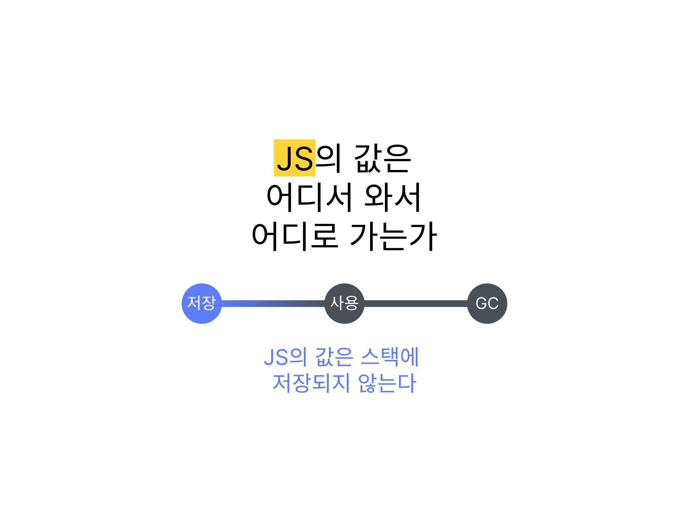

# 시리즈

| 제목 | 링크 |
|------|------|
| JS의 값은 스택과 힙 중 어디에 저장되는가? | [https://witch.work/posts/javascript-trip-of-js-value-where-value-stored](https://witch.work/posts/javascript-trip-of-js-value-where-value-stored) |

이 글은 [파차님의 트윗](https://twitter.com/finalchildmc/status/1751818395669106722)을 보고 영감을 얻어 작성하게 되었다.

이 글은 "Javascript에서 원시값은 스택에, 객체는 힙에 저장된다"는 흔한 설명이 틀렸다는 것을 보여주고, Javascript의 모든 값이 왜 힙에 저장되어야 하는지 설명한다. 또한 Javascript의 명세와 엔진 구현체에서 어떻게 값을 저장하도록 하는지 간략히 설명한다.

# 1. 흔한 설명

Javascript의 값은 원시값과 객체로 나뉜다. 원시값은 숫자, 문자열, 불리언, null, undefined, 심볼이 있고 객체는 함수, 배열, Map 등 원시값을 제외한 모든 것이다. 그럼 이러한 값들은 어디에 저장될까?

일반적으로 널리 퍼진 설명은 원시값들은 스택에 값 그대로 저장되며 객체는 힙에 저장된다고 이야기한다. 이런 설명은 쉽게 찾을 수 있고 [60K가 넘는 스타를 받은 33-js-concepts에도 이렇게 값으로 저장되는 타입과 참조로 저장되는 타입이 있다는 가정을 기반으로 한 항목이 있다.](https://github.com/leonardomso/33-js-concepts?tab=readme-ov-file#3-value-types-and-reference-types)

**그러나 이런 설명은 틀렸다.** Javascript에서는 원시값을 포함한 모든 것이 원칙적으로 힙에 저장되고 그걸 가리키는 포인터를 통해 사용된다.

물론 엔진마다 약간씩 다른 최적화 기법들이 있고 여기에 따라 몇몇 값들이 스택에 직접 저장되기도 한다. 언젠가 이에 대해서도 다룰 예정이다. 하지만 그것들은 어디까지나 동작에 영향을 주지 않는 선에서 진행되는 최적화이며 Javascript의 모든 값은 원래 힙에 저장된다.

# 2. 흔한 설명의 문제

객체는 유명한 설명대로 힙에 저장된다고 치고, 원시값이 스택에 그대로 저장된다고 하자. 그렇게 하면 대표적으로 2가지의 문제가 생긴다.

## 2.1. 메모리 할당 문제

스택에 어떤 값을 저장하기 위해서는 해당 값이 얼만큼의 크기를 가지고 있는지를 미리 알아야 한다. 그런데 Javascript는 동적 타입 언어이기 때문에 변수에 할당되는 값의 타입이 언제든지 바뀔 수 있으며 변수 생성 시점에 이 타입을 알 수도 없다.

또한 Javascript는 실행 컨텍스트 생성 시점에 모든 변수 선언을 최상단으로 끌어올리고 메모리 할당 작업을 하기 때문에 얼만큼의 메모리를 할당해야 하는지 아는 것은 더 힘들어진다. `let`, `const`도 변수 초기화 작업을 하지 않을 뿐 선언은 끌어올려진다.

만약 특정 변수에 늘 같은 타입의 원시값만 저장된다고 해도 원시값에 문자열도 포함된다는 게 문제다. 문자열은 길이에 따라 차지하는 메모리 크기가 달라지기 때문에 문자열을 값 그대로 저장하기 위해서는 얼만큼의 메모리를 할당해야 하는지 미리 알 수는 없다.

## 2.2. 클로저의 문제

물론 이는 문자열 등 필요한 메모리를 미리 알 수 없는 원시값의 경우 참조를 통해 다루고 이 참조를 스택에 저장하면 된다고 할 수도 있다. 하지만 그렇게 한다 해도 클로저 때문에 발생하는 문제가 있다.

스택에 저장된 값들은 원칙적으로 함수가 종료되어서 콜스택에서 사라짐과 동시에 없어져야 한다. 하지만 Javascript에는 클로저가 있기 때문에 함수가 종료되어도 함수 내부의 변수가 메모리에서 사라지지 않아야 하는 경우가 있다.

가령 다음과 같은 흔한 클로저 예시 코드에서 `count`는 원시값이므로 스택에 저장된다고 하자. `count`는 숫자이므로 메모리 할당에 대한 문제도 없다. 하지만 `count`는 내부 함수의 클로저를 통해 접근 가능하다. 따라서 함수가 종료되어도 `count`는 메모리에서 사라지지 않아야 한다.

그런데 `count`를 포함하는 함수인 `makeCounter`가 이미 콜스택에서 사라졌는데, 그 내부 변수인 `count`는 스택의 어디에 남아있어야 하는가?

```js
function makeCounter() {
  let count = 0;
  return function() {
    return count++;
  }
}

let counter = makeCounter();
```

하지만 Javascript에서는 이런 문제가 발생하지 않는다. 이는 값이 스택에 저장되지 않고 힙에 저장되기 때문이다.

# 3. 명세에서

그럼 ECMA-262 명세에서는 값의 저장에 대해서 어떻게 정의하고 있을까? 모든 Javascript 구현체는 ECMA-262 명세를 따르기 때문에 이를 통해서 값이 어떻게 저장되어 있는지 엿볼 수 있을 것이다.

ECMA-262 명세에서는 "Reference Record"라는 명세상의 타입을 정의한다. 변수나 프로퍼티에 접근하거나 값을 할당할 때, 해당 값을 어디에 읽고 쓸지 그 위치를 가리키는 역할을 한다. 이 타입은 실제로 Javascript 문법에 존재하는 건 아니고 명세를 위해 도입된 타입이다.

그런데 여기에는 `[[Value]]`같이 무언가 값을 직접적으로 가리키는 필드가 없다. 여기에 값을 저장하는 것에 관해서는 [Reference Record의 `[[Base]]` 필드의 설명에서 찾을 수 있다.](https://tc39.es/ecma262/#sec-reference-record-specification-type)


| Field Name | Value | Meaning |
|------------|-------|---------|
| [[Base]]   | an ECMAScript language value, an Environment Record, or UNRESOLVABLE | The value or Environment Record which holds the binding. A [[Base]] of UNRESOLVABLE indicates that the binding could not be resolved.|

보면 `[[Base]]` 필드는 ECMAScript language value, Environment Record, UNRESOLVABLE 중 하나를 가리킨다. 이 중 "ECMAScript language value"가 바로 값인데 이에 대한 명세를 보면 우리가 흔히 Javascript의 값 종류라고 부르는 다음과 같은 것들이 여기 해당한다.

- Undefined
- Null
- Boolean
- String
- Symbol
- Number
- Object

즉 Javascript에서 값은 Reference Record의 `[[Base]]` 필드가 가리키는 "ECMAScript language value"이다. 이는 값이 힙에 저장된다는 것을 정확히 명시하지는 않지만, 적어도 직접적으로 저장되지 않는다는 점을 암시한다.

많은 언어 명세에서 무엇이 스택에 저장되고 힙에 저장되는지는 커녕 스택, 힙이라는 단어의 언급조차 하지 않는 것을 생각해 볼 때 이렇게 값이 간접적으로 참조된다고 명시하는 것은 값을 힙에 저장한다는 것을 꽤나 명확하게 암시하는 것이라고 볼 수 있다.

그럼 이제 Javascript 엔진에서 이를 어떻게 구현하는지 간단히 살펴보자.

# 4. 실제 구현에서

이 섹션에서는 거의 모든 엔진에서 값을 저장할 때 공통적으로 사용하는 방식을 설명한다. 엔진에서 구체적으로 어떻게 구현되어 있는지는 다음 섹션들에서 다룬다.

## 4.1. 변수와 값

먼저 '변수'와 '변수가 가리키는 것' 즉 실제 값을 구별해야 한다. 변수는 최적화를 고려하지 않으면 일종의 포인터로 볼 수 있고 다른 어딘가에 저장된 객체를 가리키는 참조를 가지고 있다.

이는 모든 변수가 포인터 하나만큼의 크기만을 차지하며 변수가 시간에 따라 다른 객체를 참조하게 되는 경우에도 변수가 필요로 하는 메모리 크기가 변하지 않는다는 것을 의미한다.

가령 배열을 순회하는 경우에도 순회하는 값을 가리키는 변수는 항상 포인터 하나만큼의 메모리만 차지한다.

```js
let arr = [1, "Hi my name is...", true, null, Symbol("symbol")];
let elem;
for (let i = 0; i < arr.length; i++) {
  // arr[i]가 가리키는 객체는 계속 달라지지만 elem은 항상 포인터 하나만큼의 메모리만 차지한다.
  elem = arr[i];
}
```

반면 변수가 가리키는 값이란 변수에 저장된 포인터가 가리키는 값 그 자체를 가리킨다. 예를 들어 `var a = "hello"` 같은 문장에서 `a`는 변수, `"hello"`는 값이다. 값은 당연히 크기가 고정되어 있지 않다.

그리고 변수와 값, 이 모든 것은 원래는 힙에 저장되어야 한다.

## 4.2. 저장

앞서 언급했듯이 Javascript에서 모든 것은 원칙적으로 힙에 저장된다. 따라서 모든 변수(에 담긴 포인터)와 변수가 가리키는 값들 모두가 힙에 저장되어도 문제없다.

하지만 실제로는 몇 가지 최적화가 들어간다. 이 섹션에서 다룰 내용은 "원래 모든 것이 힙에 저장되는 것"이지만 거의 모든 Javascript 엔진에서 공통으로 적용하는 예외 사항에 대해 다룬다. 언제까지나 기본은 모든 것이 힙에 저장된다는 거라는 걸 잊지 말아야 한다.

### 4.2.1. 최적화 - 지역 변수

먼저 최신 Javascript 엔진들은 보통 함수의 지역 변수들을 스택에 저장한다. **변수가 가리키는 값을 저장하는 게 아니고 변수를 저장하는 것이다.** 변수가 무엇을 가리키건 포인터 하나만큼의 메모리씩만 차지하고 있기에 메모리 할당에 대한 문제도 없고 속도도 빠르기 때문이다.

그런데 만약 클로저, `eval`의 사용 등의 문제로 함수가 종료된 이후에도 변수가 메모리에 남아 있어야 한다면 이러한 값은 스택에 저장할 수 없다.

따라서 엔진은 어떤 변수가 함수 종료 이후에도 메모리에 존재해야 하는지 추적하고 이 변수들은 힙에 저장한다. 보통 클로저에 사용되는 변수들이 이에 해당한다.

### 4.2.2. 최적화 - 정수

변수가 가리키는 값도 원시값이든 객체든 원래는 모두 힙에 저장되지만 예외들이 좀 있다. 가장 흔한 예외는 정수에 관한 것인데 정수는 프로그램에서 너무 많이 쓰이기 때문에 보통 최신 엔진들은 일정 범위의 부호 있는 정수는 스택에 값 그대로 저장한다.

V8의 tagged pointer, SpiderMonkey의 NaN-boxing 등의 기법이 여기에 해당한다. 이는 최적화로서 엔진마다 구현은 다르지만 정수를 스택에 그대로 저장할 수 있게 한다는 건 동일하다.

이외에도 함수의 호출이 많아져서 특정 부분의 코드가 최적화가 요구될 만큼 'hot'해지면 객체의 특정 프로퍼티를 스택에 저장하는 등 엔진에서 다른 최적화를 하기도 한다. 이후 글에서 다룰지도 모른다.

# 5. 실제 엔진에서 - SpiderMonkey

그럼 이제 실제 Javascript 엔진에서는 값이 어떻게 저장되는지 알아보자. 먼저 주요 엔진 중 하나인 SpiderMonkey에서는 어떻게 값이 저장되는지 알아보자.

[SpiderMonkey 공식 사이트](https://spidermonkey.dev/)에서는 [SpiderMonkey의 코드를 찾아볼 수 있는 페이지](https://searchfox.org/mozilla-central/source/js/src)가 있다. 이곳의 검색 기능을 활용하면 이 글과 같은 코드를 찾아볼 수 있다.

## 5.1. 문자열의 저장

이 글의 시작을 돌아보면 "원시값은 값 그대로 스택에 저장된다"는 흔한 설명이 틀렸으며 Javascript의 거의 모든 값은 힙에 저장된다는 사실을 설명하기 위해서였다. 그러면 SpiderMonkey는 대표적인 원시값인 문자열을 어떻게 저장할까?

SpiderMonkey 중간중간에 있는 `[SMDOC]` 주석은 SpiderMonkey의 동작 방식을 대략적으로 설명하는데 [`src/vm/StringType.h` 파일의 주석](https://searchfox.org/mozilla-central/source/js/src/vm/StringType.h#80)을 참고하면 문자열이 어떻게 저장되는지 알 수 있다. 사실상 설명의 초반 부분이 우리가 원하는 핵심이다.

선형 문자열의 가장 일반적인 형태는 GC "heap"과 malloc된 char 배열로 구성된다고 한다. 어쨌든 힙에 저장된다는 건 확실하다! 물론 이후 찾아보면 스택에 저장되는 경우도 있다는 주석이 있지만 일반적으로는 힙에 저장된다.

```cpp
/*
 * [SMDOC] JavaScript Strings
 *
 * Conceptually, a JS string is just an array of chars and a length. This array
 * of chars may or may not be null-terminated and, if it is, the null character
 * is not included in the length.
 *
 * To improve performance of common operations, the following optimizations are
 * made which affect the engine's representation of strings:
 *
 *  - The plain vanilla representation is a "linear" string which consists of a
 *    string header in the GC heap and a malloc'd char array.
 *
 *  - To avoid copying a substring of an existing "base" string , a "dependent"
 *    string (JSDependentString) can be created which points into the base
 *    string's char array.
 *
 (이후 최적화에 관한 부분들 생략)
 */
```

이는 코드를 통해서도 어느 정도 확인할 수 있다.

SpiderMonkey의 `JSString` 클래스에는 경우에 따라 다르긴 하지만 많은 경우에 실제 문자열 데이터를 담고 있는 `Data`라는 내부 클래스가 있다. 해당 클래스는 `JSLinearString` 등의 클래스를 이용하여 내부 데이터를 표현한다.

그런데 이들은 어떻게 관리될까? 이후 가비지 컬렉터 관련 글에서 다시 보겠지만 대부분의 Javascript 엔진은 힙을 여러 영역으로 나누어 관리한다.

가장 대표적인 구분은 생긴지 얼마 안 된 객체와 오래된 객체를 나누는 것인데 SpiderMonkey에서는 이를 `nursery`와 `tenured`로 나누어 관리한다. 당연히 이름대로 `nursery`에는 생긴지 얼마 안 된 객체들이 있고 `tenured`에는 오래된 객체들이 있다.

만약 문자열이 `nursery`에서 생긴다면 결과적으로 `cx->newCell`이라는 함수를 호출하게 된다. 그 함수의 원형은 `src/gc/Allocator-inl.h`에서 찾을 수 있다.

함수 본문에서 `NewString`이라는 함수를 호출한다는 것만 보면 된다.

```cpp
// js/src/gc/Allocator-inl.h
template <typename T, AllowGC allowGC, typename... Args>
T* CellAllocator::NewCell(JSContext* cx, Args&&... args) {
  // ...생략...

  // "Normal" strings (all of which can be nursery allocated). Atoms and
  // external strings will fall through to the generic code below. All other
  // strings go through NewString, which will forward the arguments to the
  // appropriate string class's constructor.
  else if constexpr (std::is_base_of_v<JSString, T> &&
                     !std::is_base_of_v<JSAtom, T> &&
                     !std::is_base_of_v<JSExternalString, T>) {
    return NewString<T, allowGC>(cx, std::forward<Args>(args)...);
  }
    // ...생략...
}
```

그리고 `NewString` 함수는 같은 파일에 다음과 같이 정의되어 있다. `new` 를 이용해서 새 인스턴스를 생성하므로 힙에 저장될 거라는 사실을 알 수 있다.

```cpp
template <typename T, AllowGC allowGC, typename... Args>
/* static */
T* CellAllocator::NewString(JSContext* cx, gc::Heap heap, Args&&... args) {
  // ...생략...
  return new (mozilla::KnownNotNull, ptr) T(std::forward<Args>(args)...);
}
```

그러다가 문자열이 생성된 지 오래되어서 `tenured`로 옮겨지게 되면 `ensureNonNursery`라는 함수를 호출하게 된다. 이것의 원형은 `src/vm/StringType-inl.h`에서 찾을 수 있다.

```cpp
template <typename CharT>
void JSString::OwnedChars<CharT>::ensureNonNursery() {
  // 생략

  CharT* ptr = js_pod_arena_malloc<CharT>(js::StringBufferArena, length);
  if (!ptr) {
    oomUnsafe.crash(chars_.size(), "moving nursery buffer to heap");
  }
  mozilla::PodCopy(ptr, oldPtr, length);
  chars_ = mozilla::Span<CharT>(ptr, length);
  isMalloced_ = needsFree_ = true;
}
```

여기서 중요한 건 `js_pod_arena_malloc` 함수를 호출한다는 것이다. 이 함수는 `src/gc/Allocator.cpp`에 정의되어 있다. 이 함수를 따라가다 보면 `moz_arena_malloc`이 나오고 더 따라가면 직접 힙 주소를 관리하는 `MaybePageAlloc` 을 호출하거나 결국은 `malloc`을 호출하도록 이어지는 `MozJemalloc::malloc`을 호출하게 된다.

결국 문자열은 `new`를 사용해서 생성된 인스턴스로 관리되든, 엔진이 직접 주소를 관리하는 힙에 들어가든, `malloc`으로 할당된 메모리에 들어가든 결국은 힙에 저장된다는 것이다.

원시값 중 하나인 문자열은, SpiderMonkey에서도 역시 힙에 저장된다!

## 5.2. 객체의 저장

우리는 객체가 힙에 저장된다는 걸 이미 알고 있긴 하지만, SpiderMonkey에서 객체가 어떻게 힙에 저장되는지도 간단히 살펴보자.

key-value 쌍으로 이루어진 대부분의 Javascript 객체는 SpiderMonkey에서 `JSObject`를 상속하는 `NativeObject`라는 클래스를 이용하여 저장된다. 이 클래스는 `src/vm/NativeObject.h`에 정의되어 있다.

먼저 SpiderMonkey에서는 Javascript 객체를 생성할 때 `JS_NewObject` 함수를 호출한다. 만약 특정 클래스의 객체가 아니라면 `js::NewPlainObject`를 호출한다.

그러면 내부적으로 객체의 모양을 나타내는 히든 클래스(spidermonkey에서는 shape라 한다)와 함께 `js::PlainObject::createWithShape`를 호출한다. 이는 따라가 보면 위에서 보았던 `js/src/gc/Allocator-inl.h`의 `NewCell` 함수를 호출하게 된다.

그럼 여기서는 또 같은 파일의 `NewObject`를 호출하는데 `NewObject` 함수에서도 `new`로 새 인스턴스를 생성하므로 결국은 객체가 힙에 저장된다는 것을 알 수 있다.

```cpp
// js/src/jsapi.cpp
JS_PUBLIC_API JSObject* JS_NewObject(JSContext* cx, const JSClass* clasp)
// js/src/vm/PlainObject.cpp
PlainObject* js::NewPlainObject(JSContext* cx, NewObjectKind newKind)
// js/src/vm/PlainObject-inl.h
js::PlainObject* js::PlainObject::createWithShape(
    JSContext* cx, JS::Handle<SharedShape*> shape, gc::AllocKind kind,
    NewObjectKind newKind)
// js/src/vm/NativeObject.h 와 NativeObject-inl.h
static inline NativeObject* create(JSContext* cx, gc::AllocKind kind,
                                     gc::Heap heap, Handle<SharedShape*> shape,
                                     gc::AllocSite* site = nullptr);                               
// js/src/gc/Allocator-inl.h
T* CellAllocator::NewCell(JSContext* cx, Args&&... args)
// js/src/gc/Allocator-inl.h
template <typename T, AllowGC allowGC>
/* static */
T* CellAllocator::NewObject(JSContext* cx, gc::AllocKind kind, gc::Heap heap,
                            const JSClass* clasp, gc::AllocSite* site) {

  // ...생략...
  return new (mozilla::KnownNotNull, cell) T();
}
```

# 6. 실제 엔진에서 - V8

이제 V8에서는 값이 어떻게 저장하는지 살펴보고 값이 힙에 저장된다는 것을 마지막으로 다시 한 번 확인해보자.

V8의 소스 코드는 [google git의 V8 페이지](https://chromium.googlesource.com/v8/v8/)에서 볼 수 있다. 이 글은 레포를 클론받아서 보면서 작성하였다. 또한 [RedHat의 Daniel Bevenius가 작성한 learing V8](https://github.com/danbev/learning-v8/blob/master/notes/heap.md)이 많은 도움이 되었다.

## 6.1. V8의 메모리 할당

V8에서 값을 저장하기 위한 메모리를 관리하는 건 일단 `src/heap` 폴더의 코드들을 통해 이루어진다. 여기서 일단 값들이 힙에 저장된다는 걸 1차적으로 알 수 있다. 그리고 대부분 종류의 값, 특히 원시값들을 처음 생성하는 함수는 `heap/factory-base.cc`에 정의되어 있다. 그리고 그 대부분은 `AllocateRawWithImmortalMap`이라는 함수를 호출한다.

```cpp
// src/heap/factory-base.cc
template <typename Impl>
Tagged<HeapObject> FactoryBase<Impl>::AllocateRawWithImmortalMap(
    int size, AllocationType allocation, Tagged<Map> map,
    AllocationAlignment alignment) {
  // TODO(delphick): Potentially you could also pass a immortal immovable Map
  // from OLD_SPACE here, like external_map or message_object_map, but currently
  // no one does so this check is sufficient.
  DCHECK(ReadOnlyHeap::Contains(map));
  Tagged<HeapObject> result = AllocateRaw(size, allocation, alignment);
  DisallowGarbageCollection no_gc;
  result->set_map_after_allocation(map, SKIP_WRITE_BARRIER);
  return result;
}
```

그리고 이건 같은 파일의 `AllocateRaw`를 호출하고 이걸 따라가 보면 결국 힙의 주소를 직접 관리하는 `LinearAllocationArea`클래스 메서드를 호출하게 된다.

```cpp
// src/heap/factory-base.cc
template <typename Impl>
Tagged<HeapObject> FactoryBase<Impl>::AllocateRaw(
    int size, AllocationType allocation, AllocationAlignment alignment) {
  return impl()->AllocateRaw(size, allocation, alignment);
}

// 중간 과정 생략
// 생략된 중간 과정은 https://github.com/danbev/learning-v8/blob/master/notes/heap.md#pagealloctor 에서 더 볼 수 있다.

// src/heap/main-allocator-inl.h
AllocationResult MainAllocator::AllocateFastUnaligned(int size_in_bytes,
                                                      AllocationOrigin origin) {
  size_in_bytes = ALIGN_TO_ALLOCATION_ALIGNMENT(size_in_bytes);
  if (!allocation_info().CanIncrementTop(size_in_bytes)) {
    return AllocationResult::Failure();
  }
  Tagged<HeapObject> obj =
      HeapObject::FromAddress(allocation_info().IncrementTop(size_in_bytes));

  MSAN_ALLOCATED_UNINITIALIZED_MEMORY(obj.address(), size_in_bytes);

  return AllocationResult::FromObject(obj);
}

// src/heap/linear-allocation-area.h
// 직접 메모리를 관리한다
// A linear allocation area to allocate objects from.
//
// Invariant that must hold at all times:
//   start <= top <= limit
class LinearAllocationArea final {
 public:
  LinearAllocationArea() = default;
  LinearAllocationArea(Address top, Address limit)
      : start_(top), top_(top), limit_(limit) {
    Verify();
  }
  // ...생략...
  V8_INLINE Address IncrementTop(size_t bytes) {
    Address old_top = top_;
    top_ += bytes;
    Verify();
    return old_top;
  }
  // ...생략...
}
```

그럼 이렇게 직접 관리되는 주소가 힙의 것일까? 어떤 트릭으로 인해 스택의 주소를 관리하도록 한 건 아닐까? 이는 V8의 메모리 공간이 어떻게 생성되는지를 살펴보면 확인할 수 있다.

## 6.2. V8 메모리 공간 생성 과정

V8, 정확히는 Blink 엔진에서 스레드는 `Isolate`라는 것에 대응된다. 이 `Isolate`는 초기화될 때 `execution/isolate.cc`의 `Isolate::Init`을 호출하고 여기서는 또 `heap/heap.cc`의 `Heap::SetUpSpaces`를 호출한다.

이 함수에서는 V8에서 gc를 위해 관리하는 메모리 공간들을 생성하는데 실제 구현은 `std::make_unique`등을 사용해 좀 더 복잡하지만 핵심적인 로직을 간단히 나타내면 다음과 같이 `new`를 이용해 공간들을 위한 메모리를 할당하는 것이다.

```cpp
void Heap::SetUpSpaces() {
  space_[NEW_SPACE] = new_space_ =
      new NewSpace(this, memory_allocator_->data_page_allocator(),
                   initial_semispace_size_, max_semi_space_size_);
  space_[OLD_SPACE] = old_space_ = new OldSpace(this);
  space_[CODE_SPACE] = code_space_ = new CodeSpace(this);
  space_[MAP_SPACE] = map_space_ = new MapSpace(this);
  space_[LO_SPACE] = lo_space_ = new OldLargeObjectSpace(this);
  space_[NEW_LO_SPACE] = new_lo_space_ =
      new NewLargeObjectSpace(this, new_space_->Capacity());
  space_[CODE_LO_SPACE] = code_lo_space_ = new CodeLargeObjectSpace(this);
  ...
}
```

그런데 이 `new`는 어디서 왔을까? 이 `new` 또한 C++의 원래 `new`가 아니라 오버로딩된 것이다. V8에서 읽기 전용이 아닌 모든 공간은 기본적으로 `BaseSpace` 클래스를 상속하는데 `heap/base-space.h`에 정의된 `BaseSpace`를 보면 `Malloced`를 상속함을 볼 수 있다. 그리고 이 `Malloced`의 `new` 연산자는 `malloc`을 이용하여 정의되어 있다.

```cpp
// heap/base-space.h
class V8_EXPORT_PRIVATE BaseSpace : public Malloced {
  // ...생략...
}

// utils/allocation.cc
void* Malloced::operator new(size_t size) {
  void* result = AllocWithRetry(size);
  if (V8_UNLIKELY(result == nullptr)) {
    V8::FatalProcessOutOfMemory(nullptr, "Malloced operator new");
  }
  return result;
}

// 여기서 malloc_fn은 malloc을 래핑한 base::Malloc이라는 기본값을 가지기 때문에 늘 malloc을 사용한다.
void* AllocWithRetry(size_t size, MallocFn malloc_fn) {
  void* result = nullptr;
  for (int i = 0; i < kAllocationTries; ++i) {
    result = malloc_fn(size);
    if (V8_LIKELY(result != nullptr)) break;
    OnCriticalMemoryPressure();
  }
  return result;
}
```

즉 Javascript에서 스레드가 처음 생성될 때 V8에서 관리하는 메모리 공간들이 `malloc`을 통해 힙에 할당되고, 그 이후 힙의 메모리 주소는 V8에 의해 관리된다. 또한 이 힙 주소를 관리하는 함수들은 Javascript에 원시값이든 객체든 새로운 값이 저장될 때마다 스택이 아니라 "힙에" 메모리를 할당해 준다.

# 7. 결론

Javascript의 값들은 원래 모두 힙에 저장되어야 하고 참조를 통해 다루어져야 한다. 원시값은 스택에 그대로 저장된다는 흔한 설명은 물론 엔진의 최적화를 고려할 경우 맞는 경우가 있을 수 있지만 대부분의 경우에는 틀린 설명이다.

이는 명세에서도 암시되고, 대부분의 Javascript 엔진에 대한 설명에서 그렇게 이야기하며 실제로 엔진에서 구현된 코드를 보면 이를 확인할 수 있다. 이 글에서는 SpiderMonkey과 V8를 중심으로 설명했지만 다른 엔진들도 대부분 비슷한 방식으로 동작한다.

다음 글에서는 이 힙에 포인터들을 저장할 때 사용되는 테크닉에 대해 알아보고 또한 그 포인터를 통해서 저장되는 값은 어떻게 관리되는지 알아보겠다.

# 참고

- `1. 흔한 설명`, `2. 흔한 설명의 문제`의 참고 링크

이 글의 시작이 된 파차님의 트윗 https://twitter.com/finalchildmc/status/1751818395669106722

관련해서 파차님이 푸신 타래 https://twitter.com/finalchildmc/status/1664895964115607556

33 js Concepts에 파차님이 올리신 이슈 https://github.com/leonardomso/33-js-concepts/issues/481

Y combinator 해커뉴스에 V8 개발자가 쓴 댓글 https://news.ycombinator.com/item?id=33006653

How v8 handle stack allocated variable in closure? 라는 질문에 V8 개발자가 단 답변 https://stackoverflow.com/a/74008746

How is data stored in V8 Javascript engine memory? https://www.dashlane.com/blog/how-is-data-stored-in-v8-js-engine-memory

- `3. 명세에서`의 참고 링크

What Are JavaScript Variables Made Of https://www.zhenghao.io/posts/javascript-variables

ECMA-262,  6.2.5 The Reference Record Specification Type https://tc39.es/ecma262/#sec-reference-record-specification-type

- `4.` 이후 엔진 관련 내용의 참고 링크

`1.`의 참고 문헌과 같음

JavaScript engine fundamentals: Shapes and Inline Caches(번역)
[원래 글](https://mathiasbynens.be/notes/shapes-ics)은 구글의 V8엔진 개발에 관여한 Mathias Bynens가 작성한 글이기 때문에 신뢰할 만 하다.

https://shlrur.github.io/javascripts/javascript-engine-fundamentals-shapes-and-Inline-caches/

V8에서 관리되는 자바스크립트 변수 https://yceffort.kr/2022/04/how-javascript-variable-works-in-memory

stack and heap in V8 (JavaScript)의 답변 https://stackoverflow.com/questions/6602864/stack-and-heap-in-v8-javascript

garbage collection with node.js https://stackoverflow.com/questions/5326300/garbage-collection-with-node-js/5328761#5328761

JavaScript Memory Model Demystified https://www.zhenghao.io/posts/javascript-memory

SpiderMonkey 를 이용한 개발 일기

http://weongyo.org/docs/SpiderMonkey/AboutSpiderMonkey.pdf

Firefox source Docs JS::Value and JSObject

https://firefox-source-docs.mozilla.org/js/index.html#js-value-and-jsobject

spidermonkey source code

https://searchfox.org/mozilla-central/source/js/src

V8 source code

https://chromium.googlesource.com/v8/v8/

RedHat의 Daniel Bevenius가 작성한 learing V8 - heap

https://github.com/danbev/learning-v8/blob/master/notes/heap.md

V8 and Blink https://opentutorials.org/course/3527/22807

C++ std::make_unique https://en.cppreference.com/w/cpp/memory/unique_ptr/make_unique