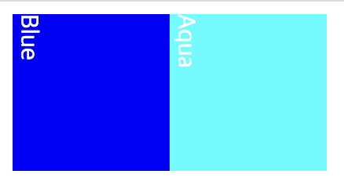
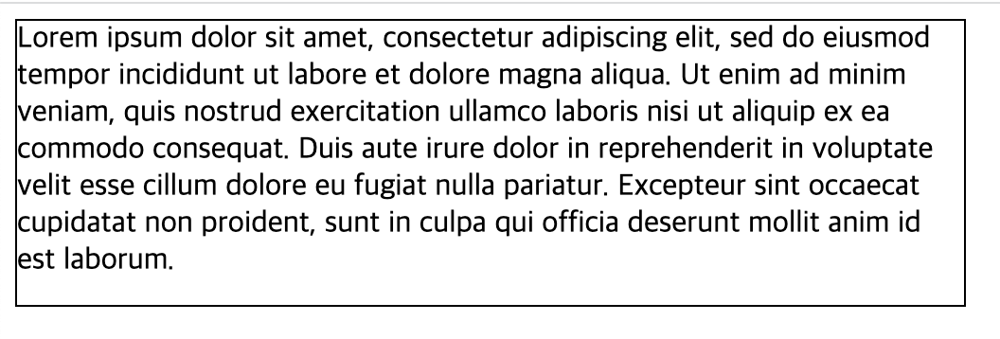
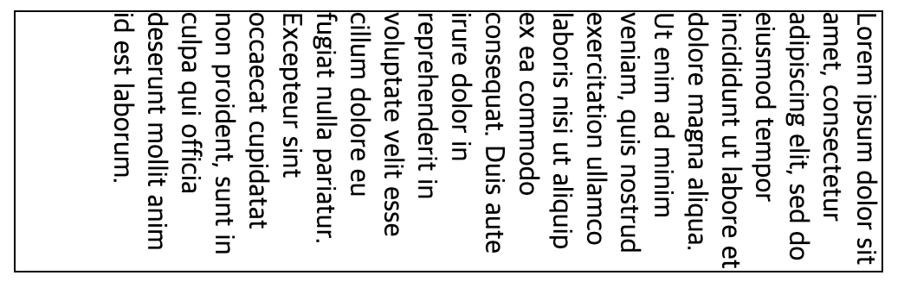
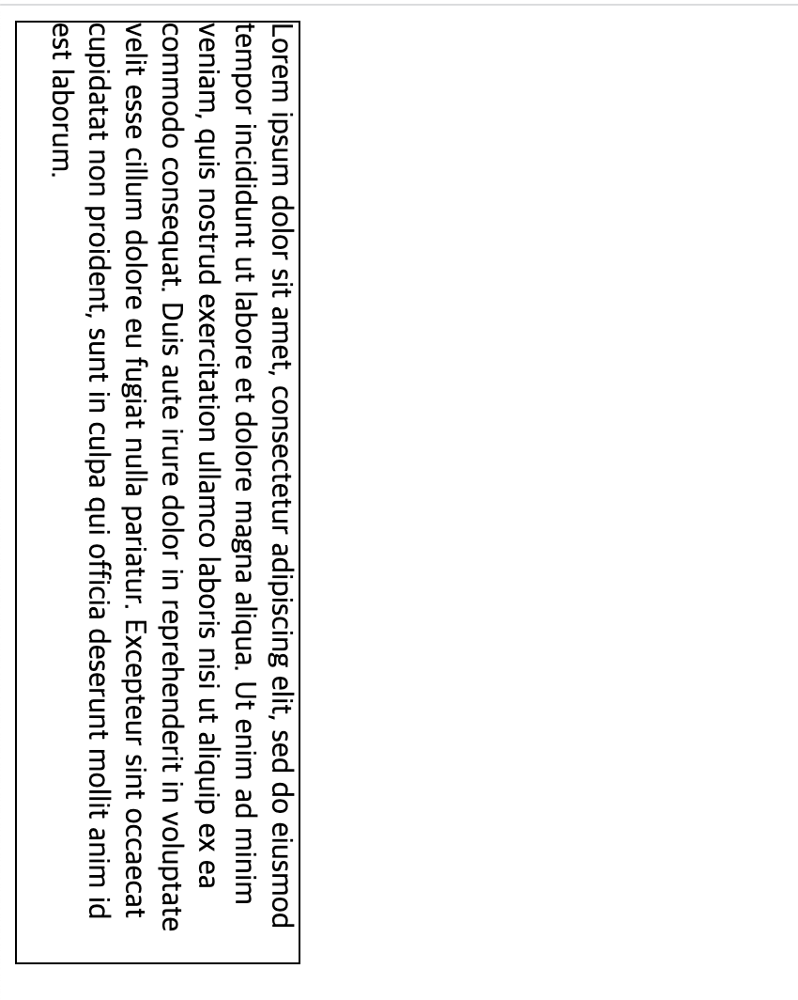

# 1. 배경 및 테두리

CSS의 배경(background)와 테두리(border)로 무엇을 할 수 있는가?

## 1.1. 배경

CSS background 속성은 여러 배경 속성의 shorthand이다. 여기 포함된 속성은 다음과 같다.

- background-attachment
- background-clip
- background-color
- background-image
- background-origin
- background-position
- background-repeat
- background-size

이를 하나하나 알아보자.

### 1.1.1. background-color

요소의 배경색을 설정한다. red, blue 등의 키워드, hex표기, rgb()/rgba() 의 함수 표기 등 유효한 색 표현을 사용할 수 있다.

### 1.1.2. background-image

요소의 배경 이미지를 설정한다. url() 함수를 사용하여 이미지의 경로를 지정할 수 있다. 박스보다 작은 이미지를 설정할 경우 이미지가 반복되어 배경으로 설정된다.(background-repeat가 기본값일 경우)

그리고 이미지 외에 배경색을 지정할 시 이미지가 색상 위로 표시된다.

이 속성에 그라디언트를 사용하면 요소의 배경을 그라데이션으로 설정할 수 있다. 예를 들어 linear-gradient() 함수를 사용하면 선형 그라데이션을 설정할 수 있다.

```css
{
  background-image: linear-gradient(to right, red, blue);
}
```

radial-gradient, repeating-linear-gradient, repeating-radial-gradient, conic-gradient 등 다른 종류의 그라데이션 함수들도 있다.

그리고 여러 배경 이미지를 설정할 수도 있다. 쉼표로 구분하면 된다.

```css
background-image: url("image1.png"), url("image2.png");
```

이러면 이미지는 앞에 온 게 우선적으로 고려되어, image1이 image2보다 위에 표시된다.

### 1.1.3. background-repeat

앞서서 background-image를 통해 설정한 이미지가 박스보다 작으면 반복해서 표시된다고 했다. 하지만 이 repeat 속성을 이용하면 그 반복을 막거나 특정 축으로만 반복할 수 있다.

### 1.1.4 background-size

배경 이미지를 지정할 경우 이미지가 요소보다 커서 이미지가 잘릴 수 있다. 이 경우 background-size 속성을 이용하여 이미지 크기를 맞출 수 있다. 이때 배경 이미지로 덮이지 않은 공간은 background-color로 지정한 색상으로 채워진다.

contain, cover 키워드를 사용하면 이미지가 잘리거나 찌그러지지 않는 한도 내에서 크기가 제일 크게 설정된다. cover의 경우 요소에 빈 공간이 생기지 않도록 이미지를 확대 후 잘라내기도 한다.

또한 명시적으로 size를 줄 수도 있는데 하나만 줄 경우 그 사이즈가 이미지 너비가 되고 높이는 자동으로 설정된다. 두 개를 줄 경우 각각 이미지 너비와 높이가 설정된다.

```css
{
  background-size: contain;
  // 너비 설정
  background-size: 100px;
  // 높이 설정
  background-size: 100px 50%;
}
```

### 1.1.5. background-position

배경이 들어갈 박스에서 이미지가 나타나는 위치를 선택할 수 있다. 왼쪽 상단 꼭짓점이 `(0,0)`이다. 각각 x축, y축의 시작 위치를 설정할 수 있다.

top, right등의 키워드를 사용하거나 20px, 50%등의 수치를 사용할 수 있다.

4개의 값을 사용할 수도 있는데 이때 길이 단위는 앞의 키워드 방향과의 간격이다.

```css
{
  // 오른쪽 위에 배치
  background-position: top right;
  // 왼쪽 위 꼭짓점 기준으로 x축은 20px, y축은 50% offset
  background-position: 20px 50%;
  // 아래에서 30% 오른쪽에서 30% offset
  background-position: bottom 30% right 30%;
}
```

### 1.1.6. background-atatchment

내용이 스크롤될 때 스크롤하는 방법을 지정한다.

scroll로 지정하면 페이지 스크롤시 배경도 같이 스크롤되게 한다. 요소 스크롤과는 상관없다. fixed로 설정 시 배경이 고정되어 스크롤되지 않는다. local은 배경을 설정된 요소로 고정하므로 요소가 스크롤되면 배경도 같이 스크롤된다. 페이지 스크롤에도 반응한다.

[각 요소의 스크롤 예시](https://mdn.github.io/learning-area/css/styling-boxes/backgrounds/background-attachment.html)

## 1.2. 테두리

border CSS는 border-width, border-style, border-color의 shorthand이다.

```css
border: 1px solid red;
```

만약 상하좌우 border를 다르게 설정하고 싶다면 border-top 등을 사용할 수 있다.

### 1.2.1. 둥근 테두리

border-radius 속성을 통해 모서리 둥글기를 설정할 수 있다. 각각의 모서리를 설정할 수도 있고, 모든 모서리를 한 번에 설정할 수도 있다.

```css
{
  border-radius: 10px;
  // 모서리 가로반경 10px, 세로반경 20px
  border-radius: 10px 20px;
  border-top-left-radius: 1px;
  border-top-right-radius: 2px;
}
```

# 2. 텍스트 표시 방향

아랍어는 오른쪽에서 왼쪽으로 쓰고, 일본어는 위에서 아래로 쓴다. 이런 쓰기 모드를 변경하기 위해서는 `writing-mode` 속성을 사용한다.

## 2.1. 표시 방향의 영향

이 표시 방향은 어디에 영향을 미칠까? 요소의 배치와 텍스트의 흐름 방향이 바뀐다.

예를 들어서 다음과 같이 요소들을 배치했다고 하자.

```html
<div class="blue-box">Blue</div>
<div class="aqua-box">Aqua</div>
```

그러면 Blue Box가 Aqua Box 위에 위치하게 된다. 즉 위->아래 방향으로 블록이 쌓인다.

그럼 표시 방향을 바꾸면?

```css
body {
  writing-mode: vertical-lr;
}
```

body 내의 블록 요소가 왼쪽에서 오른쪽으로 쌓인다.



`vertical-rl`로 설정하면 블록이 오른쪽에서 왼쪽 방향으로 쌓인다.

즉 읽기 모드를 바꾸면 사람들이 페이지를 읽어야 하는 방향을 바꿀 수 있다.

블록 요소는 `-`뒤에 있는 방향을 따른다. 예를 들어서 `vertical-rl`이면 블록 요소는 오른쪽에서 왼쪽으로 쌓인다. 그리고 인라인 요소는 `-`앞에 있는 방향을 따른다. `vertical-rl`이면 인라인 요소는 위에서 아래로 쌓인다.

## 2.2. 텍스트 흐름 방향

앞서 아랍어처럼 오른쪽에서 왼쪽으로 쓰이는 언어에 대해서 말했다. 이런 언어는 텍스트 흐름 방향이 오른쪽에서 왼쪽이다.

웹은 왼쪽에서 오른쪽으로 읽히는 언어만 쓰이는 게 아니므로 최신 CSS는 방향을 참조하지 않는다. 대신 인라인과 블록이라는 아이디어와 함께 시작, 끝을 다룬다. 이는 나중에 다시 이야기할 날이 있을 것이다.

## 2.3. 텍스트 방향과 너비, 높이

`writing-mode: vertical-rl`로 설정하면 블록 요소의 방향이 바뀐다. 그럴 때 너비와 높이를 설정하면 어떻게 될까?

먼저 writing-mode가 없을 때 기본적인 너비와 높이를 설정해보자.

```css
.box {
  width: 500px;
  height: 150px;
  border: 1px solid black;
}
```

그리고 여기에 맞게 로렘 입숨 텍스트를 넣어보자.

```html
<div class="box">
  Lorem ipsum dolor sit amet, consectetur adipiscing elit, sed do eiusmod
  tempor incididunt ut labore et dolore magna aliqua. Ut enim ad minim
  veniam, quis nostrud exercitation ullamco laboris nisi ut aliquip ex ea
  commodo consequat. Duis aute irure dolor in reprehenderit in voluptate
  velit esse cillum dolore eu fugiat nulla pariatur. Excepteur sint occaecat
  cupidatat non proident, sunt in culpa qui officia deserunt mollit anim id
  est laborum.
</div>
```

그럼 다음과 같이 박스가 표시될 것이다.



그런데 writing-mode를 vertical-rl로 설정하면 어떻게 될까? 그러면 다음과 같이 표시된다.



우리는 페이지의 흐름을 세로로 바꾸었는데 높이와 너비가 본질적으로 바뀌지 않았다.

이를 위해서 CSS는 `block-size`와 `inline-size`라는 속성을 제공한다. 이 속성은 writing-mode에 따라 너비와 높이를 바꿔준다.

width는 inline-size에, height는 block-size에 대응한다. 위의 CSS를 다음과 같이 바꿔보자.

```css
.box {
  inline-size: 500px;
  block-size: 150px;
  border: 1px solid black;
}
```

그러면 이제 writing-mode가 vertical-rl이어도 본질적인 너비와 높이가 바뀌지 않는다.



## 2.4. 텍스트 방향과 margin, padding

방향에 따라 다르게 줄 수 있는 속성은 또 있다. 지난번에 본 마진과 패딩이다. 가령 `margin-top`같은 속성이 있다.

이 또한 위에서 너비와 높이에 그랬던 것과 같이 writing-mode에 따라 다른 방향을 가리키게 만들 수 있다. 즉 논리적 방향을 가리키게 만들 수 있다. `margin-block-start`와 같은 속성을 쓰면 된다.

블럭의 방향 상에서 위와 아래에 마진을 주고 싶다면 `margin-block`를 쓰면 되고 좌우에 마진을 주고 싶다면 `margin-inline`를 쓰면 된다. 그리고 start, end를 붙이면 해당 방향의 시작과 끝에 마진을 줄 수 있다.

가령 margin-left는 margin-inline-start와 같다. padding도 같은 어미를 쓴다.

- top -> block-start
- bottom -> block-end
- left -> inline-start
- right -> inline-end

다만 이런 논리적 속성값은 top, bottom과 같은 물리적 속성보다 최신이기 때문에 브라우저에 따라 지원이 안 될 수도 있다.

따라서 여러 쓰기 방향을 사용하지 않는 경우 물리적 속성을 사용하는 것이 아직은 좋다. 다만 flex, grid 같은 레이아웃 방법을 다루기 시작하면 많은 의미가 생기기 때문에 논리적 속성이 더 많이 쓰이게 될 것이다.

# 3. 콘텐츠 오버플로우

박스에 담기에 너무 많은 내용이 박스 내에 포함되어 있을 때 박스 오버플로우가 발생한다. 예를 들어서 높이 100px 짜리 박스에 텍스트 100줄이 들어 있다거나 하는 상황이다.

CSS는 이런 오버플로우를 다룰 수 있는 방법을 여러 가지 제공한다. overflow 속성을 쓰면 된다.

overflow 속성의 기본값은 visible인데 이는 오버플로우된 컨텐츠를 보여준다. overflow 속성을 hidden으로 설정하면 오버플로우된 컨텐츠를 잘라낸다.

`overflow:scroll`이면 오버플로우된 내용에 대해 스크롤이 생긴다. 이때 오버플로우가 없는 방향에도 스크롤이 생길 수 있으므로 `overflow-x`와 `overflow-y`를 따로 설정할 수도 있다. 오버플로우가 발생할 때 스크롤을 만드는 걸 브라우저에게 맡기려면 `overflow:auto`로 설정하면 된다.

## 3.1. 단어 오버플로우 

작은 박스에서 긴 단어를 처리해야 하는 경우가 있을 수 있다. 즉 x축의 오버플로우가 나는 것이다. 이때 word-break와 overflow-wrap을 사용할 수 있다.

word-break는 단어가 박스를 넘어가면 어떻게 처리할지를 결정한다. 기본값은 normal인데 이는 단어가 박스를 넘어가면 박스 밖으로 넘어간다. 

이를 `word-break:break-all`로 설정하면 단어가 박스를 넘어가면 단어의 끊김에 상관없이 박스 내에서 줄바꿈이 일어난다.

`overflow-wrap` 요소는 어떤 문자가 박스를 넘어가면 줄바꿈을 할지를 결정한다. 기본값인 normal은 두 단어 사이의 공백 등 보통의 줄바꿈 지점에서만 줄을 바꾼다. break-word는 줄바꿈을 할 지점이 없을 시 임의 지점에서 줄을 바꾼다.

