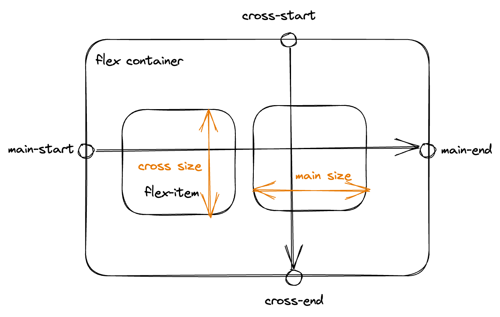

이제 레이아웃에 대해서 이해해 보자.

# 1. 레이아웃 입문서

## 1.1. normal flow

이는 페이지 레이아웃을 전혀 제어하지 않을 경우의 기본값이다. 요소를 블록 방향으로 순서대로 배치한다. 이러한 블록 방향은 영어같은 가로쓰기 언어에서 수직 방향의 배치를 의미한다.

CSS를 사용해서 레이아웃을 만드는 경우 우리는 요소들을 이런 normal flow에서 벗어나게 한다. display, float, position, table(이는 권장되지는 않지만) 등을 통해 레이아웃을 만들 수 있다.

## 1.2. display 속성 개요

display 속성을 통해 블록 요소와 인라인 요소가 정해지며 이를 임의로 바꿀 수 있다는 것을 이전에 배웠다. 하지만 다른 속성도 있다.

`display:flex`로 설정할 시 모든 직계 자식이 플렉스 항목이 된다. 행이나 열 등 1차원 상의 개념으로 사물을 배치할 때 편리하게 사용할 수 있다. 이러면 `flex-direction`등의 속성을 통해 내부 자식들을 어떻게 배치할지 결정할 수 있다. 

`display:grid`로 설정할 시 모든 직계 자식이 그리드 항목이 된다. 2차원 상의 개념으로 사물을 배치할 때 편리하게 사용할 수 있다. 이러면 `grid-template-rows`등의 속성을 통해 내부 자식들을 어떻게 배치할지 결정할 수 있다. 

그리드 디스플레이의 부모 요소에서 행과 열의 속성, 그리고 각 칸 사이의 gap 등을 설정해 주면 자식 요소들이 알아서 내부에 자리잡는다. 물론 `grid-row`등의 속성으로 직접 자식 요소들을 배치할 수도 있다.

## 1.3. float 속성 개요

float 속성을 사용하면 요소가 normal flow에서 벗어나 왼쪽이나 오른쪽으로 배치될 수 있게 해준다. 나머지 페이지 내용들은 float된 요소 주위로 떠다니게 된다. 이는 레이아웃을 만들 때 유용하게 사용할 수 있다.

```css
.box{
  // 요소를 왼쪽에 띄운다. box 클래스 요소에 이어지는 요소들은 box 주변을 떠다니게 된다.
  float:left;
}
```

## 1.4. position 속성 개요

position 속성을 사용하면 요소를 기존의 배치 위치에서 벗어나 다른 위치로 이동시킬 수 있다. 이는 5가지 유형이 있다.

`position:static`은 기본값으로 요소를 normal flow에 따라 배치한다.

`position:relative`는 요소를 normal flow에 따라 배치하되, top, right, bottom, left 속성을 통해 요소의 위치를 조정할 수 있다. 다른 요소와 겹치게 하는 것도 가능하다.

`position:absolute`는 요소를 normal flow에서 제거하고, 가장 가까운 조상 요소나 html 요소를 기준으로 배치한다. 당연히 같은 부모 내의 다른 요소와 겹칠 수 있다.

`position:fixed`는 absolute와 비슷한데 요소를 normal flow에서 제거하고, 브라우저 뷰포트를 기준으로 요소를 배치한다. 스크롤해도 고정된 위치에 머물러 있다. 즉 언제나 뷰포트의 같은 위치에 있다.

`position:sticky`는 static과 같이 작동하다가 기존에 정의된 뷰포트의 지점에 도달하면 fixed와 같이 작동한다. 즉 어느 지점부터는 스크롤에 영향을 받지 않고 같은 위치에서 보이게 된다.

## 1.5. 다단 레이아웃

다단 레이아웃은 신문 기사처럼, 여러 개의 컬럼으로 페이지를 구성하는 것이다. 한 블록을 다단 컨테이너로 만들려면 `column-count`로 몇 단으로 나눌지 지정하거나 `column-width`로 단의 너비를 지정하면 된다.

# 2. normal flow

normal flow는 요소의 레이아웃을 전혀 건드리지 않았을 때 요소의 배치 방식이다. 이때의 배치 방식은 부모 요소의 쓰기 모드(`writing-mode` 속성)에 따라 달라지지만 일단은 수평 배치라고 생각하자.

블록 요소는 수직 방향으로 쌓이며 줄바꿈을 해서 나타난다. 그리고 각 요소의 margin에 의해 구분된다. 이때 인접한 요소 둘 다 margin이 있다면 둘 중 더 큰 값만 남는다.

인라인 요소는 수평 방향으로 쌓이며 줄바꿈을 하지 않고 나타난다. 단 충분한 공간이 없을 경우 넘치는 텍스트나 요소는 새로운 줄에 나타난다. `span`요소의 배치를 생각해 보면 된다.

# 3. flexbox

flexbox는 1차원으로 요소들을 배치하는 방법이다. 이 이전에는 floats나 position 속성을 이용해서 페이지 레이아웃을 배치하였다.

## 3.1. flexbox 구성



플렉스 모델은 위와 같은 구조를 하고 있다. 

`display:flex`가 설정된 부모 요소가 flex container이고 그 내부의 자식 요소로 레이아웃되는 항목들을 flex item이라 한다.

main axis는 컨테이너에서 main start에서 시작해서 main end 방향으로 진행하는 축이다. 이 축을 따라서 컨테이너 내부에 flex item들이 배치된다. cross axis는 main axis와 수직인 축이다.

## 3.2. flexbox 속성

`flex-direction`은 row, column, row-reverse, column-reverse 중 하나를 지정할 수 있다. 이 속성을 통해 main axis의 방향을 결정할 수 있다. reverse는 당연히 메인 축을 반대 방향으로 한다.

`flex-wrap`은 nowrap, wrap, wrap-reverse 중 하나를 지정할 수 있다. nowrap은 기본값으로 한 줄에 모든 flex item을 배치한다. 공간이 부족하면 넘어간다. wrap은 한 줄에 모든 flex item을 배치할 수 없을 때 다음 줄로 넘어간다. wrap-reverse는 wrap과 비슷하지만 반대 방향으로 배치한다.

`flex-flow`를 지정하면 flex-direction과 flex-wrap을 한 번에 지정할 수 있다. `flex-flow:row wrap;`와 같이 사용한다.

## 3.3. flex 속성 탐구

flex는 `flex-grow`, `flex-shrink`, `flex-basis`의 shorthand이다. 이 속성은 각 아이템에 지정되어서 해당 아이템이 컨테이너 공간에 맞추기 위해 어떻게 크기를 조절할지를 설정한다. 이 각각의 속성은 다음과 같은 것을 지정한다.

### 3.3.1. flex-grow

flex-grow는 아이템의 너비 합이 컨테이너 너비보다 작을 때 컨테이너 내부에서 남게 되는 여유 공간을 분배하는 방법을 설정한다.

영역을 채우는 방식은 다음과 같다. 이후에 다룰 flex-basis에서 지정한 기본 너비를 모든 아이템에 배정한다. 그리고 여유 공간이 남을 경우 flex-grow 값에 따라서 남은 여유 공간을 분배한다.

예를 들어서 HTML이 다음과 같이 작성되어 있다.

```html
<div class="container">
  <div class="item">1번</div>
  <div class="item">2번</div>
  <div class="item">3번</div>
  <div class="item">4번</div>
</div>
```

그리고 CSS를 다음처럼 작성한다.

```css
.container{
  display:flex;
  flex-wrap:nowrap;
  gap:0;
  padding:10px;
  background:aqua;
  width:600px;
}

.item{
  flex-basis:100px;
}

.item:nth-child(1){
  flex-grow:1;
}
.item:nth-child(2){
  flex-grow:2;
}
.item:nth-child(3){
  flex-grow:3;
}
.item:nth-child(4){
  flex-grow:4;
}
```

그러면 컨테이너에서 내용에 할애되는 너비는 600px이다. 그리고 각 아이템에는 flex-basis에 따라 100px씩 할당된다. 그리고 남은 여유 공간은 200px이다. 

이 200px의 여유 공간이 flex-grow의 비율에 따라 분배된다. 즉 1번 아이템은 1/10, 2번 아이템은 2/10, 3번 아이템은 3/10, 4번 아이템은 4/10의 여유 공간을 할당받아 각각 120px, 140px, 160px, 180px의 너비를 가진다.

### 3.3.2. flex-shrink

flex-shrink는 컨테이너에 `flex-wrap:wrap`이 지정되어 있을 경우 적용되지 않는다. 컨테이너보다 아이템의 너비가 더 클 때 축소시키는 방법을 지정하는 속성인데, wrap일 경우 아이템 너비가 더 크면 새 줄로 넘어가기 때문이다.

아무튼 flex-shrink에 설정된 값에 따라서 초과된 요소들이 축소된다. 만약 flex-shrink가 0이면 전혀 축소되지 않는다. 반면 flex-shrink가 형제 요소들에서 모두 같으면 모두 같은 비율로 축소되어 형제 요소들의 크기가 다 같아진다.

그럼 각 아이템의 flex-shrink 값을 다르게 지정하면 어떻게 되는가? grow에서와 같다. 컨테이너를 넘어간 아이템들의 너비의 합을 flex-shrink 값의 합으로 나눈 비율에 따라서 각 아이템의 너비가 축소된다.

예를 들어 200px가 초과되었고 각 아이템이 1,2,3,4의 flex-shrink 값을 가지고 있다면 1번 아이템은 20px, 2번 아이템은 40px, 3번 아이템은 60px, 4번 아이템은 80px의 너비를 감소시킨다.

### 3.3.3. flex-basis

flex-basis는 flex-grow와 flex-shrink가 적용되기 전에 아이템의 기본 크기를 지정한다. 이 크기는 메인 축의 방향에 따라 다른데 메인 축이 row 방향이면 너비, column 방향이면 높이가 된다.

만약 flex-basis가 auto이면 아이템에 지정된 width나 height에 따라 크기가 결정된다(내용에도 영향을 받는다). content이면 내용에 따라 크기가 결정된다. 단 content는 오래된 브라우저에서 지원되지 않을 수 있다.

flex-basis가 0이면 아이템의 기본 크기가 0이 된다. 이 경우 flex-grow와 flex-shrink 값에 따라서 아이템 너비를 배분하게 된다. 컨테이너의 모든 부분이 여백으로 간주되기 때문이다.

따라서 아이템의 내용에 상관없이 모든 아이템의 너비를 동일하게 하고 싶다면 flex-basis를 0으로 지정하고 flex-grow를 1로 지정하면 된다.

### 3.3.4. flex

그럼 shorthand인 flex는 어떨까? flex는 1~3개의 값을 사용해 지정 가능하다.

- 값이 1개일 때
숫자를 지정하면 `flex-grow`이다. 길이(100px등)나 비율을 지정하면 `flex-basis`이다.

- 값이 2개일 때
첫째 값은 숫자여야 하며 `flex-grow`가 된다. 두번째 값의 경우 숫자라면 `flex-shrink`가 되고, 길이나 비율이라면 `flex-basis`가 된다.

- 값이 3개일 때
첫째 값은 `flex-grow`가 된다. 두번째 값은 `flex-shrink`가 된다. 세번째 값은 `flex-basis`가 된다. 당연히 첫번째, 두번째 값은 숫자여야 하고 세번째 값은 길이나 비율이어야 한다.

- 특수한 키워드
initial은 아이템 크기가 컨테이너 크기를 넘을 경우 컨테이너 크기에 맞춰 줄어들지만 기본적으로는 각각의 width, height를 따른다. `flex:0 1 auto`와 같다. 이게 flex의 초기값이다.

auto는 아이템의 기본 크기는 자동으로 정하고 컨테이너 크기에 맞춰 늘어나거나 줄어들도록 한다. `flex:1 1 auto`와 같다.

none은 아이템의 크기를 자동으로 지정하고 고정시킨다. `flex:0 0 auto`와 같다.

## 3.4. 아이템 배치

`justify-content`는 아이템을 메인 축 방향으로 어떻게 배치할지 지정한다. `align-items`는 아이템을 교차 축 방향으로 어떻게 배치할지 지정한다.

만약 `flex-direction`이 row라면 `justify-content`는 아이템들이 행의 어느 부분에 배치되는지를 지정한다. 그리고 `align-items`는 아이템들이 세로로 어느 부분에 놓이는지를 지정한다.

`align-self`로 개별 아이템의 cross axis상의 배치를 지정할 수도 있다.

### 3.4.1. justify-content 속성

다른 건 일반적으로 생각할 수 있는 속성들이다. `space-around`는 모든 항목을 기본 축을 따라 고르게 분배한다. 또한 양쪽에 약간의 공간을 남긴다.

반면 `space-between`은 양쪽에 공간을 남기지 않고 모든 항목을 기본 축을 따라 고르게 분배한다.

## 3.5. order

각 flex item에 order를 지정할 수 있다. 순위값이 낮은 항목들이 먼저 배치되며 기본값은 0이다. 즉 만약 어떤 아이템의 order를 1로 설정하면 뒤쪽에 배치될 것이다.

음수 order를 지정하여 기본 order를 가진 아이템보다 앞쪽에 배치되게 할 수도 있다.

# 4. grid

그리드 레이아웃은 페이지의 요소들을 2차원으로 배치할 수 있도록 한다. 페이지를 행과 열로 나눈 후 몇 행 몇 열에 어떤 요소를 배치할지를 지정하는 것이다. 다음과 같이 그리드 디스플레이 모드를 지정한다.

```css
display: grid;
```

## 4.1. 그리드 만들기 기본

`grid-template-columns`와 `grid-template-rows`를 사용해 행과 열을 만들 수 있다. `fr`단위를 사용하면 그리드 컨테이너 내부의 사용 가능한 공간을 분할하여 각 행과 열의 크기를 지정할 수 있다.

```css
// 사용 가능한 너비를 1:2:1로 분할하여 열 3개 생성
grid-template-columns: 1fr 2fr 1fr;
// 사용 가능한 높이를 1:1:2로 분할하여 행 3개 생성
grid-template-rows: 1fr 1fr 2fr;
```

행/열 사이 간격은 `grid-column-gap`과 `grid-row-gap`을 사용해 지정한다. `grid-gap`을 사용하면 한 번에 지정할 수도 있다.(row-gap, column-gap의 단축 속성) `grid-`접두사 없이도 갭을 지정 가능하다.

`repeat()`함수를 사용하면 반복되는 행/열을 간단하게 지정할 수 있다. `repeat(5, 1fr)`을 지정하면 5개의 1fr 크기의 행 혹은 열을 생성한다. `minmax()`도 있는데, 이는 각 행 혹은 열의 최소 크기와 최대 크기를 지정할 수 있다.

```css
grid-template-columns: repeat(5, minmax(50px, auto));
```

## 4.2. 행과 열을 자동으로 설정

지금까지 `grid-template-rows`를 쓸 땐 행의 수를 직접 지정해 주어야 했다. 그런데 설정된 크기가 허용하는 한 최대한 많이 행을 만들고 싶을 수 있다. 이럴 땐 auto-fill이나 auto-fit을 사용한다.

```css
.container{
  // 100px 크기의 행을 최대한 많이 생성
  // 만약 높이에서 나머지가 남으면 그냥 다음 줄로 넘어간다
  grid-template-rows: repeat(auto-fill, 100px);
}
```

이를 auto-fit으로 바꾸면, 컨테이너에 남은 공간이 있을 시 그 공간을 채우기 위해 존재하는 행의 크기를 늘리게 된다.

`grid-auto-rows`, `grid-auto-columns`를 사용하면 `grid-template-`으로 통제되고 있는 행/열 외에 있는 행/열의 크기를 지정한다. 만약 `grid-template-`속성 없이 이 속성만 지정할 경우 모든 행/열을 이 속성이 지정한 크기로 만든다.

```css
// 100px 크기의 행과 열을 자동 생성
grid-auto-rows: 100px;
grid-auto-columns: 100px;
```

## 4.3. 그리드 아이템 배치

grid-row와 grid-column 속성으로 각 그리드 아이템이 몇 행 몇 열에 배치될지 지정할 수 있다. `1/3`과 같이 시작 라인과 끝 라인을 지정할 수도 있다.

혹은 grid-row-start, grid-row-end, grid-column-start, grid-column-end 속성을 사용해서 각각 아이템의 시작 라인과 끝 라인을 지정할 수도 있다.

## 4.4. grid-template-areas

처음 안 사실인데, `grid-template-areas`속성을 이용하면 각 그리드 요소에 이름을 지정하고 그 이름을 통해 아이템을 배치할 수 있다.

```css
.container{
  display:grid;
  grid-template-areas:
    "header header header"
    "main main aside"
    "footer footer footer";
  grid-template-columns: 1fr 1fr 1fr;
  grid-template-rows: 1fr 1fr 1fr;
}

// header 태그는 header라고 이름붙은 그리드 area들을 차지한다
header{
  grid-area: header;
}

main{
  grid-area: main;
}
...
```

위와 같이 나눠진 그리드에 각각 이름을 붙여서 아이템을 배치하는 데 활용할 수 있다. 이때 area에 지정하는 이름들은 그리드의 모든 셀을 채우도록 해야 한다. 만약 셀을 비우려면 `.`을 넣어야 한다.

또한 이름을 통해 지정한 영역은 행/열 번호를 통해 지정한 것과 마찬가지로 반드시 직사각형이어야 하며 영역은 유일해야 한다.

# 참고

flex 속성 https://developer.mozilla.org/ko/docs/Web/CSS/flex

flex 2 https://blogpack.tistory.com/863

https://velog.io/@garcon/Flexbox-flex-basis-auto%EC%99%80-0%EC%9D%98-%EC%B0%A8%EC%9D%B4%EC%A0%90

auto-fill과 auto-fit https://velog.io/@iandr0805/CSS-Grid-auto-fit%EA%B3%BC-auto-fill%EC%9D%98-%EC%B0%A8%EC%9D%B4%EC%A0%90

grid의 좋은 정리자료 https://studiomeal.com/archives/533