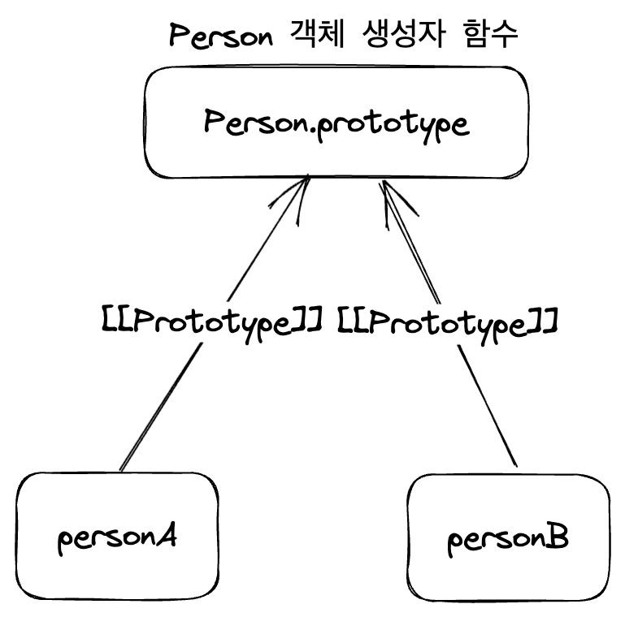

땔감짓이 대부분이었긴 해도 이미 많은 JS와의 사투를 겪어 왔기에, 튜토리얼을 훑어보며 익숙치 않았던 것만 간단히 정리한다.

# 1. JS 첫걸음

HTML이 웹 콘텐츠의 구조를 짜고 의미를 부여하며, CSS가 콘텐츠에 스타일을 적용할 수 있게 한다면 JS는 콘텐츠를 동적으로 만들어준다. 

예를 들어서 페이지의 모든 요소에는 style 속성이 존재하며 해당 요소의 인라인 CSS 스타일을 모두 담고 있는데, JS를 이용하면 이를 변경하여 스타일을 동적으로 제어할 수 있다.

## 1.1. 스크립트 로딩

HTML 문서의 `<head>` 태그 안에 `<script>` 태그를 넣어 스크립트를 실행할 수 있다. 이 때, `src` 속성을 이용해 외부 스크립트 파일을 로딩할 수도 있다.

그런데 문제는 모든 HTML이 순서 그대로 불려온다는 것이다. 다음과 같은 경우를 생각해 보자.

```js
const buttons = document.querySelectorAll('button');

for (const button of buttons) {
  button.addEventListener('click', createParagraph);
}
```

```html
<!DOCTYPE html>
<html lang="en-US">
  <head>
    <meta charset="utf-8">
    <meta name="viewport" content="width=device-width">
    <title>My test page</title>
    <script src="test.js"></script>
  </head>
  <body>
    <button>문단 추가 버튼</button>
  </body>
</html>
```

위 코드가 정상적으로 작동한다면, 버튼을 누를 때마다 문단이 추가되어야 한다. 그러나 코드를 실행해 보면 그렇지 못하다는 것을 알 수 있다.

body의 button 태그가 로딩되기 전에 head태그의 script 태그가 먼저 불려와서 JS의 `addEventListener`를 실행해 버리기 때문이다. HTML이 순서대로 로딩되는 건 이런 문제를 낳는다. 이를 해결하는 방식은 3가지 있다.

가장 고전적인 방법은 `<script>`태그를 본문의 맨 마지막 줄, body의 닫는 태그 바로 앞에 쓰는 것이다. 그러면 모든 HTML이 로딩된 후에 스크립트가 로딩된다. 이렇게 하면 HTML을 모두 불러오기 전에는 스크립트를 전혀 실행할 수 없다는 문제가 있다.

다른 하나는 `DOMContentLoaded`를 쓰는 방법이다. 이는 브라우저가 HTML 문서를 다 읽었다는 것을 나타내는 이벤트를 수신한 시점에 스크립트를 실행한다.

```html
<script>
  document.addEventListener("DOMContentLoaded", (event)=>{
    // 실행할 JS 코드
  });
</script>
```

다른 하나는 `defer` 속성을 이용하는 방법이다. 이는 HTML 문서가 다 읽힌 후에 스크립트를 실행하도록 한다. 즉 HTML 분석이 끝난 이후, `DOMContentLoaded` 이벤트가 발생하기 전에 실행된다. 그리고 HTML 분석 동안에도 별도 스레드에서 스크립트를 로딩하게 하여 로딩 시간을 줄여 준다.

그러나 외부 스크립트를 불러올 때만 사용할 수 있다.

```html
<script src="script.js" defer></script>
```

script에 `async`속성을 지정할 수도 있다. 이 경우 스크립트가 로딩되는 동안 HTML 문서의 로딩을 멈추지 않고 계속 진행한다. 또한 스크립트 로딩이 끝나면 페이지 렌더링을 잠시 중단하고 즉시 실행한다. HTML 구문 분석 중에도 스크립트를 실행할 수 있게 된다. 

기존 script 태그같은 경우 HTML 분석 중 script를 만나게 되면 HTML 분석을 멈추고 로딩+실행을 하고 나서 다시 HTML 분석을 시작한다. 

하지만 async를 쓰면 HTML 분석 동안에도 스크립트 로딩을 할 수 있다. JS 실행 시간만큼만 HTML 분석을 멈추게 된다. 단 단점은 HTML 분석 동안 스크립트들을 병렬로 로딩하기 때문에 스크립트들의 실행 순서가 보장되지 않는다는 것이다. 따라서 독립적인 스크립트에만 사용하자.

<figure>
  
  <figcaption>async와 defer의 차이. 출처 [MDN 문서](https://developer.mozilla.org/ko/docs/Learn/JavaScript/First_steps/What_is_JavaScript#%EC%8A%A4%ED%81%AC%EB%A6%BD%ED%8A%B8_%EB%A1%9C%EB%94%A9_%EC%A0%84%EB%9E%B5)</figcaption>
</figure>

# 2. JS 구성 요소

예전에 봤다시피 함수 표현식을 통해 함수를 선언할 수도 있다. 이는 주로 이벤트 핸들러에 대입된다.

```js
let myButton=document.querySelector('button');

myButton.onclick=function(){
  alert('button clicked');
}
```

## 2.1. 이벤트

이벤트는 프로그램에서 일어나는 사건들을 일반적으로 칭하는 말이다. 이 이벤트들은 발생 시 몇몇 신호들을 만드는데 여기에는 이벤트 핸들러가 있어서 이벤트 발생 시 실행할 코드를 지정할 수 있다.

이벤트 발생 -> 이벤트 리스너가 이벤트 발생 신호 수신 -> 이벤트 핸들러 실행의 순서다. 단 주의할 점은 웹 이벤트는 JS 표준에서 정의된 부분은 아니라는 것이다. 이는 WebAPI의 일부다.

`onclick`, `onfocus`, `onblur`, `onkeydown`등의 다양한 것이 있다. 이는 `button.onclick=~`과 같이 요소의 프로퍼티로 지정될 수 있다.

`<button onclick="handleClick()">`과 같이 인라인 이벤트 핸들러를 쓸 수도 있지만 이는 권장되지 않는다. HTML과 JS를 분리하는 것이 권장되기 때문이다.

`addEventListener` 메서드를 쓰는 것이 가장 좋다. [문서 링크](https://developer.mozilla.org/ko/docs/Web/API/EventTarget/addEventListener)

```js
btn.addEventListener('click', handleClick);
```

이에 반대되는 메서드는 `removeEventListener`다. 제거할 핸들러와 같은 단계에 있어야 함을 기억하자.

이런 메서드를 쓰면 하나의 요소에 2개 이상의 이벤트도 등록 가능하다.

이벤트 함수를 `func(e){}`처럼 이벤트 객체 매개변수 e(이름이 그다지 중요하진 않다)를 전달하는 식으로 선언 가능한데 이는 이벤트 핸들러에 자동으로 전달된다. 이때 e.target은 항상 이벤트가 발생된 요소에 대한 참조다. 같은 이벤트 핸들러를 여러 다른 요소에 적용하고 싶을 때 유용하다.

React에서 많이 본 `preventDefault`는 사용자 에이전트가 이벤트에 대해 정의한 기본 동작을 실행하지 않도록 한다.

## 2.2. 이벤트 버블링과 캡처링

이는 같은 이벤트 타입의 두 이벤트 핸들러가 한 요소에서 작동되었을 때 발생하는 일을 기술한다.

예를 들어 다음과 같은 코드를 보자.

```html
<!DOCTYPE html>
<html lang="en-us">
  <head>
    <meta charset="utf-8">
    <meta http-equiv="X-UA-Compatible" content="IE=edge,chrome=1">
    <meta name="viewport" content="width=device-width">
    <title>나의 테스트</title>
    <style>
      .parent{
        width:300px;
        height:300px;
        background-color: red;
      }
      .child{
        width:100px;
        height:100px;
        background-color: blue;
      }
    </style>
  </head>

  <body>
    <div class="parent">
      <div class="child"></div>
    </div>
    <script>
      const parent = document.querySelector('.parent');
      const child = document.querySelector('.child');
      parent.addEventListener('click', function(){
        parent.style.backgroundColor = 'green';
        console.log('parent');
      });
      child.addEventListener('click', function(){
        child.style.backgroundColor = 'yellow';
        console.log('child');
      });
    </script>
  </body>
</html>
```

이 HTML을 브라우저에서 연 뒤 child의 파란색 네모를 클릭하면 parent 박스의 색까지 모두 바뀐다. child가 parent에 포함되어 있기 때문이다.

부모 요소를 가지고 있는 요소에서 이벤트 발생시 브라우저는 캡처링과 버블링을 실행한다.

캡처링은 요소의 가장 최상위 조상에서 시작해서 캡처링 이벤트를 검사하고 그것을 실행하는 것을 말한다. 그리고 내부 요소로 이동하면서 선택된 요소에 닿을 때까지 해당 동작을 반복하는 것이다.

캡처링 단계를 이용하는 경우는 흔치 않다. 캡처링 단계에서 이벤트를 처리하려면 `addEventListener`의 세 번째 인자 객체에 capture 옵션 `true`를 전달하면 된다. 혹은 3번째 인자로 true를 전달해도 된다.

```js
// 이 이벤트가 캡처링 단계에서 처리되도록 한다
elem.addEventListener(..., ..., true);
elem.addEventListener(..., ..., {capture: true});
```

버블링은 캡처링과 반대의 경우다. 이벤트가 발생한 요소에서 시작해서 가장 최상위 조상까지 올라가면서 버블링 이벤트를 검사하고 실행하는 것을 말한다. 제일 깊은 곳에서 최상위 조상까지 올라가는 게 거품이 떠오르는 것 같다고 해서 버블링이라 한다. 이때 버블링이 진행되면서 `event.target`은 변치 않는다.

현대 브라우저에서 모든 이벤트 핸들러는 버블링 단계에 등록되어 있다. 따라서 자식 요소에서 시작해서 최상위 조상 요소까지 올라가며 이벤트를 실행하게 된다.

위 코드에서도 순서를 따진다면 child의 이벤트 핸들러가 먼저 실행되고 그 후 parent의 이벤트 핸들러가 실행된다.

이런 동작을 막기 위해선 이벤트 객체 e에 `e.stopPropagation()`을 사용하면 된다. 이는 이벤트가 조상 요소로 전파되는 것을 막는다. 즉 이벤트가 발생한 요소에서 이벤트가 끝나게 된다. 위 코드 같은 경우 child의 이벤트리스너를 변경하면 된다.

```js
child.addEventListener('click', function(e){
  e.stopPropagation();
  child.style.backgroundColor = 'yellow';
  console.log('child');
});
```

`e.stopImmediatePropagation`은 요소의 같은 이벤트에 할당된 다른 모든 핸들러의 동작도 막는다. 단 이렇게 버블링을 막아야 할 일들은 거의 없다.

버블링은 이점도 있다. 이벤트 위임을 가능하게 하는 것이다. 많은 자식 요소가 있고 그 중 하나를 선택했을 때의 코드를 실행하길 원한다면 모든 자식에 이벤트 리스너를 설정하는 대신 부모 요소에 이벤트 리스너를 설정하면 된다. 그러면 자식 요소의 이벤트가 부모로 버블링되어 올라갈 것이다.

# 3. JS 객체

객체는 키-밸류로 구성된 프로퍼티와 메서드로 이뤄지며 JS의 대부분을 이룬다.

## 3.1. JS와 객체지향

JS는 프로토타입을 통해 객체지향을 실현한다. 모든 객체들이 속성들을 상속받을 템플릿으로 객체를 쓴다는 것이다. 이런 상속의 연쇄를 프로토타입 체인이라 하며 prototype 속성으로 구현된다.

생성자 함수는 new를 붙여 실행하며 일반적으로 첫 글자 대문자로 시작한다.

```js
function Person(first, last, age){
    this.first=first;
    this.last=last;
    this.age=age;
}

let person=new Person("John", "Smith", 25);
```

person의 프로토타입 객체는 Person 생성자 함수이다. 그것의 프로토타입 객체는 Object이다. 따라서 Object 객체에 정의된 다른 멤버 함수들도 person에서 사용할 수 있다. 브라우저가 먼저 person에 그 메서드가 있는지 체크한 후 Person 생성자에 해당 메서드를 체크하고, Object 에서 찾고..해서 프로토타입 체인을 올라가면서 메서드를 탐색하기 때문이다.

이때 프로토타입을 이용한 상속에서 메서드와 속성들은 복사되는 것이 아니라 접근 시 프로토타입 체인을 통해서 접근된다.(오버로딩을 안 했을 시)

프로토타입 객체는 내부 속성으로 정의되어 있지만 대부분 브라우저에서 `__proto__`를 통해 접근할 수 있게 되어 있다. 하지만 권장되는 방식은 아니고 지금은 `Object.getPrototypeOf(obj)`를 쓰는 게 좋다.

## 3.2. prototype 속성

어떤 객체를 상속했을 때 상속받게 되는 멤버들은 prototype 속성에 정의되어 있다. 예를 들어서 JS의 모든 객체는 Object를 상속받지만 그 모든 메서드를 가지고 있는 건 아니다. Object의 prototype에 정의된 메서드들만 상속받는다.

prototype 속성도 하나의 객체이며, 프로토타입 체인으로 상속하려는 속성들을 담는 버킷으로 주로 사용한다. `Object.keys()`와 같이 prototype에 정의되지 않은 속성들은 상속되지 않고 Object 생성자에서만 사용 가능하다.

모든 생성자 함수는 constructor 속성을 지닌 객체를 프로토타입으로 가진다. 그리고 그 constructor 속성은 생성자 함수 자신을 가리킨다. 따라서 `객체인스턴스.constructor()`와 같은 방식으로 생성자 함수를 호출하여 새 객체를 만들 수 있다.

따라서 Person.prototype 속성에 정의된 속성들은 Person 생성자 함수의 모든 인스턴스에서 사용 가능하다. 또한 Person.prototype에 새로운 속성이나 메서드를 추가하면 프로토타입 체인을 통해, Person 생성자 함수로 만든 모든 인스턴스에서 즉시 사용 가능해진다. 

물론 메서드가 아닌 속성을 굳이 프로토타입에 새로 정의하지는 일은 잘 없다. 프로토타입에 정의한 속성은 모든 인스턴스에서 공유되기 때문에 속성은 보통 생성자에서 정의한다.

## 3.3. Object.create과 상속

`Object.create`는 객체를 생성하는 메서드다. 이 메서드는 인자로 프로토타입이 될 객체를 받는다. 그리고 그 객체를 프로토타입으로 하는 새로운 객체를 반환한다.

```js
// parent를 프로토타입으로 하는 child 객체를 생성
let child=Object.create(parent);
```

또한 두번째 인자로는 새로 생성해서 리턴할 객체에 추가할 프로퍼티를 객체 타입으로 받는다. 이때 `Object.defineProperties`를 쓸 때처럼 서술자를 지정해 줘야 한다.
  
```js
let child=Object.create(parent, {
  age: {value: 2, writable: true},
  name: {value: 'John'}
});
```

이를 이용하면 객체의 프로토타입 객체를 지정할 수 있다. 상속을 한번 구현해보자.

```js
function Parent(name){
  this.name = name;
}

// parent를 상속받는다
function Child(name){
  // Child를 this로 해서 Parent 생성자를 호출
  Parent.call(this, name);
  // 만약 Child에서 새로 정의할 속성이 있다면 이 밑에서 정의
}

// Parent.prototype을 프로토타입으로 갖는 객체를 만들어서 Child의 prototype으로 한다. 이렇게 해야 Child 인스턴스가 Parent의 메서드를 상속 가능하다.
Child.prototype = Object.create(Parent.prototype);
// Child.prototype이 Parent.prototype을 그대로 참조하기 때문에 constructor는 Parent를 가리키게 된다. 이를 바로 잡아준다.
Child.prototype.constructor = Child;
// Child.prototype에 sayHello 메서드를 추가한다.
Child.prototype.sayHello = function(){
  console.log("Hello, I'm "+this.name);
}

let child=new Child('child');
child.sayHello();
```

## 3.4. 프로토타입 관련 추가

생성자 호출을 통해 생성된 객체는 생성자의 prototype 속성을 프로토타입으로 참조한다.



이런 식이기 때문에 Person 생성자 함수를 통해 만들어진 객체들은 프로토타입 체인을 통해 생성자 함수에 정의된 메서드들을 그대로 사용할 수 있다. 이런 체인은 모든 객체의 조상인 `Object.prototype`까지 이어진다.

# 4. 클래스 문법

ECMA 2015에선 클래스 문법이 추가되었다. constructor 메서드를 통해 클래스 생성자를 정의하고 내부에 메서드나 속성을 정의 가능하다.

```js
class Person{
  constructor(name, age){
    this.name=name;
    this.age=age;
  }
  sayHello(){
    console.log("Hello, I'm "+this.name);
  }
}

let person=new Person('John', 25);
```

extends 키워드로 상속할 수 있다.

```js
class Child extends Person{
  constructor(name, age){
    //super는 상위 클래스 생성자 호출
    super(name, age);
  }
}
```

...프로토타입 상속 관해서는 더 글을 써야 함


# 참고

https://ko.javascript.info/bubbling-and-capturing

https://evan-moon.github.io/2019/10/27/inheritance-with-prototype/