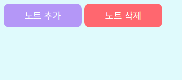
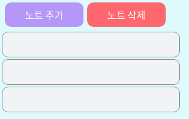

# 1. 시작

우리가 만들어야 할 페이지는 현재 설계로는

1. 메모장 페이지
2. 로그인 페이지
3. 회원가입 페이지

정도가 있다. 아무래도 이 프로젝트의 목적은 회원별로 관리되는 "메모장"을 만드는 것이므로 메모장 페이지를 가장 처음으로 만들고자 한다.

먼저 나는 부드러운 느낌을 주는 색을 좋아하므로 그쪽 계열의 색을 이용해 작업할 것이다. 색을 고를 때는 주로 [open color](https://yeun.github.io/open-color/) 를 참고한다. 그러나 나는 디자인 전문가도 아니고, 아주 미려한 디자인을 목표로 하는 프로젝트도 아니므로 내 눈에 아주 거슬리지 않을 정도로만 작업하려고 한다. 

만약 누군가 이 프로젝트를 본다면, 내가 쓴 색이 전혀 부드러워 보이지 않을 수도 있고 내 디자인이 마음에 들지 않을지도 모른다. 따라서 만약 디자인에 대한 대안이 있다면 언제나 지적해 주면 좋을 것 같다. 또한 이런 색 선정에 어떤 업계 표준이 있다면 댓글이나 메일 등으로 내게 알려준다면 정말 감사할 것이다.


먼저 아주 기본적인 배경만 넣어 보자. `src/note.js` 를 새로 생성한다.

```jsx
//note.js
import React from 'react';

const Note = () => (
  <>
    <h1>메모장 페이지입니다</h1>
  </>
);

export default Note;

```

이 컴포넌트는 아직 간단한 텍스트 한 줄을 띄우는 것 뿐이다. 참고로 `<>` 이 빈 태그는 React.Fragment의 축약형으로 여러 태그들을 하나로 묶는 기능만 하고 싶을 때 자주 쓰인다. `<div>`로 묶을 수도 있지만 `<div>`를 쓰면 태그의 깊이가 하나 더 늘어나 버린다는 단점이 있어서 `<>` 를 사용하였다.

이제 이 텍스트를 홈 페이지에 띄우고, 배경을 넣어주도록 하자. `src/App.js` 로 향한다.

```jsx
//App.js
import React from 'react';
import { Route } from 'react-router-dom';
import { createGlobalStyle } from 'styled-components';
import Note from './note';

const NoteGlobalStyle = createGlobalStyle`
  body{
    background:#e3fafc
  }
`;

function App() {
  return (
    <div>
      <NoteGlobalStyle />
      <Route path="/" component={Note} />
    </div>
  );
}

export default App;

```

`createGlobalStyle` 은 styled-components 에서 body와 같은, 모든 곳에 적용되는 스타일을 지정하고 싶을 때 쓰는 키워드이다. 이걸로 아주 연한 cyan 색의 배경을 페이지 전체에 설정해 줄 수 있다.

그리고 홈 페이지(`/` 경로)에는 Note 컴포넌트를 띄워 주도록 설정하였다. 이대로 `yarn start`를  실행하면 연한 cyan 색 배경에 `메모장 페이지입니다` 라는 굵은 글씨가 뜬 페이지가 뜰 것이다. 

이때 주의해 줄 점은 `yarn start`를 통해 실행되는 index.js에서도 React Router를 쓸 수 있도록 설정해 줘야 한다는 것이다.

```jsx
import React from 'react';
import ReactDOM from 'react-dom';
import './index.css';
import { BrowserRouter } from 'react-router-dom';
import App from './App';
import reportWebVitals from './reportWebVitals';

// BrowserRouter 사용을 설정한 index.js

ReactDOM.render(
  <React.StrictMode>
    <BrowserRouter>
      <App />
    </BrowserRouter>
  </React.StrictMode>,
  document.getElementById('root'),
);

// If you want to start measuring performance in your app, pass a function
// to log results (for example: reportWebVitals(console.log))
// or send to an analytics endpoint. Learn more: https://bit.ly/CRA-vitals
reportWebVitals();

```

# 2. 메모장의 기본 레이아웃 만들기 

## 2.1 버튼 만들기

먼저 노트에 쓰일 기본적인 블럭을 만들어 준다. 내부를 가운데 정렬해 주고 폰트를 흰색으로 칠해 주는 등 기본적인 디자인을 넣어주고 모서리를 적당히 둥글게 만들어서 모양을 다듬는다. 그리고 색을 props로 넣어줄 수 있는 기능 정도를 추가한다.

노트에 쓰일 버튼들은 이 `NoteBasicBlock` 의 디자인을 상속해서 만들어질 것이다.

```css
const NoteBasicBlock = styled.div`
  background: ${(props) => props.color || 'white'};
  color:white;
  display: flex;
  justify-content: center;
  align-items: center;
  border-radius: 10px;
  font-size:1rem;
`;
```

이제 노트 추가, 삭제를 위한 버튼을 만들 것인데 이건 그저 위의 블럭을 상속해서 크기만 지정해 주면 된다. 추가적으로 margin을 좀 주는 정도.

```css
const NoteListButton = styled(NoteBasicBlock)`
  width:8rem;
  height:2.5rem;
  margin:5px;
`;
```

그럼 이제 이를 이용해서 노트 추가, 삭제를 위한 버튼을 쉽게 만들어줄 수 있다.

간단히 이를 이용해서 버튼을 만들어 준 후 임시로 flex 컨테이너를 만들어서 배치해 주었다.

```jsx
//App.js
import React from 'react';
import styled from 'styled-components';

const FlexContainer = styled.div`
  display:flex;
`;

const NoteContainer = styled(FlexContainer)`
  height:100%;
  width:100%;
`;

const NoteBasicBlock = styled.div`
  background: ${(props) => props.color || 'white'};
  color:white;
  display: flex;
  justify-content: center;
  align-items: center;
  border-radius: 10px;
  font-size:1rem;
`;

const NoteListButton = styled(NoteBasicBlock)`
  width:8rem;
  height:2.5rem;
  margin:5px;
`;

const Note = () => (
  <>
    <NoteContainer>
      <NoteListButton color="#b197fc">노트 추가</NoteListButton>
      <NoteListButton color="#ff6b6b">노트 삭제</NoteListButton>
    </NoteContainer>
  </>
);

export default Note;

```

이대로 App.js를 바꿔준 후 `yarn start` 로 프로젝트를 실행하면 연한 청색 화면에 두 개의 버튼이 떠오를 것이다. 

앞으로 눈에 거슬리지 않을 정도로만 조화를 맞추면서 개별적인 색이나 작은 사이즈 변경 정도는 있을 수 있다. 다만 커다란 어떤 설계상의 변경이 있다면 이전 글로 돌아와서 그 부분도 수정할 것이다. 가령 상속 관계가 바뀐다거나 하는 것들 말이다. 아주 탄탄한 설계를 하고 시작하는 프로젝트가 아니기 때문에 설계도 조금씩 바뀔 수 있다.



텍스트에 써 있는 대로, 이 버튼을 통해 노트 추가/삭제가 가능하도록 할 것이다. 하지만 레이아웃을 위한 디자인을 모두 구성할 때까지 이런 기능 구현은 잠시 미뤄 두도록 하자.

### 2.1.1 버튼 hover 옵션 넣기

우리가 일반적인 프로그램들에서 볼 수 있는 버튼들은 보통 마우스를 올리면 색이 조금 진해지거나 연해지는 방식으로 현재 버튼이 활성 직전의 상태라는 걸 나타낸다. 비슷한 원리로 버튼이 어떤 기능을 켜고 끄는 역할을 담당할 경우 활성 상태일 경우와 비활성 상태일 경우를 색깔로 나타내 주기도 한다.

이는 css의 hover, active 의사 클래스를 통해서 나타내 줄 수 있다. 그런데 노트를 추가하고 삭제하는 기능은 어떤 활성/비활성 상태가 있는 게 아니라 한번 클릭하면 바로 실행되는 어떤 동작을 하는 것이다. 따라서 굳이 active 옵션을 넣지 않고, 마우스를 올렸을 경우(hover)만 색을 진하게 해 주기로 했다.

그런데 우리는 아까 `props`로 색을 받아서 그걸 버튼의 색으로 삼았다. 따라서 버튼의 색은 사용자가 지정하는 어떤 색이든 될 수 있다. 그러면 버튼의 색이 진해지고 밝아지는 것도 직접 색을 하나하나 지정하기보다는 좀더 일반적인 처리가 가능하면 좋을 것이다. 이를 위해 `polished` 라이브러리를 사용해 주자.

```
yarn add polished
```

그리고 우리가 쓸 기능들을 import해 주자.

```jsx
import styled, { css } from 'styled-components';
import { darken } from 'polished';
```

그리고 hover 조건이 만족될 경우에, props의 color를 받아서 일정 비율만큼 darken 해 주는 간단한 css를 리턴하는 익명 함수의 코드를 추가해 준다.

```jsx
const NoteListButton = styled(NoteBasicBlock)`
  width:8rem;
  height:2.5rem;
  margin:5px;
  ${(props) => {
    const selected = props.color;
    return css`
      &:hover {
        background: ${darken(0.1, selected)};
      }
    `;
  }
}
`;
```

이렇게 하면 마우스를 올렸을 경우 버튼이 기존보다 좀 진해진 색깔로 변하게 된다.

## 2.2 개별 메모장 블럭 만들기

설계상으로는, 저 노트 추가/삭제 버튼 밑으로 개별 메모들의 미리보기들이 쭉 늘어져 있고 몇몇 메모를 묶어서 폴더로 관리할 수도 있도록 하고 싶다.일단은 개별 메모들의 미리보기를 관리하기 위한 블럭을 디자인하고자 한다. 아까 만들었던 `NoteBasicBlock` 을 활용하자.

```css
const NoteListBlock = styled(NoteBasicBlock)`
  width:18rem;
  height:2.5rem;
  border:solid 1px #868e96;
  background:#f1f3f5;
  margin:3px;
`;
```

이제 이를 시험삼아 몇 개 배치해 보면 잘 되는 것을 확인할 수 있다.

```jsx
const Note = () => (
  <>
    <Noteontainer>
      <NoteListButton color="#b197fc">노트 추가</NoteListButton>
      <NoteListButton color="#ff6b6b">노트 삭제</NoteListButton>
    </NoteContainer>
    <NoteListBlock />
    <NoteListBlock />
    <NoteListBlock />
  </>
);
```



## 2.3 노트 편집 창 만들기

노트의 텍스트를 편집하는 칸을 만들어 준다. 노트의 편집창은 워낙 크므로, 화면에 대비해 적당히 비율을 맞춰 주자.

메모장에는 줄이 있는 게 보기 편하므로 적절한 간격의 줄도 넣어 준다.

```css
const NoteEditBlock = styled.textarea`
  width:95%;
  height:95%;
  border: 1px solid black;
  border-radius: 10px;
  overflow:auto;
  white-space: pre;
  font-size:12pt;
  display:flex;
  background-attachment: local;
  background-image:
    linear-gradient(to right, white 10px, transparent 10px),
    linear-gradient(to left, white 10px, transparent 10px),
    repeating-linear-gradient(white, white 30px, #ccc 30px, #ccc 31px, white 31px);
  line-height: 31px;
  padding: 8px 10px;
  resize:none;
`;
```

그런데 문제가 있다. 우리가 만든 이 텍스트 편집 영역은 우리가 width와 height를 모두 최대로 해 놓았지만 이 최대는 부모가 되는 요소의 width와 height에 영향을 받는다. 만약 이 영역의 부모 요소가 가로세로 10픽셀에 불과하다면, 우리는 width, height를 모두 상대적으로 정의했기 때문에 우리가 너비와 높이를 아무리 100% 로 지정해도 우리가 원하는 대로 여유 공간을 모두 차지해 주는 일은 일어나지 않는다.


따라서 개발자 도구를 이용해서 이 영역의 확장을 막는 부분들을 모두 넓혀 줘야 한다.

먼저 `GlobalStyle` 에서, 일반적인 html의 최상단 컴포넌트인 html과 body의 width, height를 모두 최대로 지정해 준다. 

```jsx
const NoteGlobalStyle = createGlobalStyle`
  *{
    box-sizing: border-box;
  }
  html{
    width:100%;
    height:100%;
  }
  body{
    width:100%;
    height:100%;
    background:#e3fafc;
  }
`;
```

box-sizing은 영역의 넓이 확장에 관련된 부분은 아니고, 요소의 크기를 따질 때 border까지 넣어서 따지도록 해주는 옵션이다. 요소들의 배치를 계산할 때 좀더 직관적으로 계산할 수 있도록 해 준다. 우리가 요소의 크기를 계산할 때는 보통 테두리까지 넣어서 생각하기 때문이다.

그 다음에는, 원래 react는 `root` 라는 아이디를 가진 html 요소에 모든 내용물을 넣어서 렌더링하는데 이 부분을 바꿔 줘야 한다. 이 부분이 우리가 만들고 있는 영역의 넓이를 제한하고 있기 때문이다.

```jsx
// public/index.html의 body 부분
<body>
    <noscript>You need to enable JavaScript to run this app.</noscript>
    <div style="width:100%; height:100%;" id="root"></div>
    <!--
      This HTML file is a template.
      If you open it directly in the browser, you will see an empty page.

      You can add webfonts, meta tags, or analytics to this file.
      The build step will place the bundled scripts into the <body> tag.

      To begin the development, run `npm start` or `yarn start`.
      To create a production bundle, use `npm run build` or `yarn build`.
    -->
  </body>
```

그리고 요소들을 더 잘 배치하기 위해 컨테이너도 바꿔 준다. 내부 아이템들이 column 기준으로 쌓이는 `ColumnContainer` (즉 열은 하나이고 그 열 내부에 요소들이 세로 방향으로 쌓이는 것) 와 row기준으로 쌓이는 `RowContainer` (행은 하나이고 그 행 내부에 요소들이 가로 방향으로 쌓이는 것)를 만들어 주었다. 이때 width와 height는 컨테이너에 따라 달라질 수 있으므로 props로 줄 수 있도록 했다.

```jsx
const FlexContainer = styled.div`
  display:flex;
`;

const ColumnContainer = styled(FlexContainer)`
  height: ${(props) => props.height || 'auto'};
  width: ${(props) => props.width || 'auto'};
  flex-direction: column;
`;

const RowContainer = styled(FlexContainer)`
  height: ${(props) => props.height || 'auto'};
  width: ${(props) => props.width || 'auto'};
  flex-direction: row;
`;
```

이제 컨테이너들을 이용해서 `Note` 컴포넌트 안에 지금까지 만든 요소들을 적절히 배치해 주면 된다.

```jsx
const Note = () => (
  <ColumnContainer width="100%" height="100%">
    <RowContainer>
      <NoteListButton color="#b197fc">노트 추가</NoteListButton>
      <NoteListButton color="#ff6b6b">노트 삭제</NoteListButton>
    </RowContainer>
    <RowContainer width="100%" height="100%">
      <ColumnContainer>
        <NoteListBlock />
        <NoteListBlock />
        <NoteListBlock />
      </ColumnContainer>
      <ColumnContainer width="100%" height="100%">
        <NoteEditBlock />
      </ColumnContainer>
    </RowContainer>
  </ColumnContainer>
);
```

이 상태로 실행하면, 아직 고쳐야 할 게 많긴 하지만 적당히 메모장 같아 보이는 화면 구성은 완성된다. 마지막으로 `note.js`의 전체 코드를 첨부한다.

```jsx
import React from 'react';
import styled, { css } from 'styled-components';
import { darken } from 'polished';

const FlexContainer = styled.div`
  display:flex;
`;

const ColumnContainer = styled(FlexContainer)`
  height: ${(props) => props.height || 'auto'};
  width: ${(props) => props.width || 'auto'};
  flex-direction: column;
`;

const RowContainer = styled(FlexContainer)`
  height: ${(props) => props.height || 'auto'};
  width: ${(props) => props.width || 'auto'};
  flex-direction: row;
`;

const NoteBasicBlock = styled.div`
  background: ${(props) => props.color || 'white'};
  color:white;
  display: flex;
  justify-content: center;
  align-items: center;
  border-radius: 10px;
  font-size:1rem;
`;

const NoteListButton = styled(NoteBasicBlock)`
  width:8rem;
  height:2.5rem;
  margin:5px;
  ${(props) => {
    const selected = props.color;
    return css`
      &:hover {
        background: ${darken(0.1, selected)};
      }
    `;
  }
}
`;

const NoteListBlock = styled(NoteBasicBlock)`
  width:18rem;
  height:2.5rem;
  border:solid 1px #868e96;
  background:#f1f3f5;
  margin:3px;
`;

const NoteEditBlock = styled.textarea`
  width:95%;
  height:95%;
  border: 1px solid black;
  border-radius: 10px;
  overflow:auto;
  white-space: pre;
  font-size:12pt;
  display:flex;
  background-attachment: local;
  background-image:
    linear-gradient(to right, white 10px, transparent 10px),
    linear-gradient(to left, white 10px, transparent 10px),
    repeating-linear-gradient(white, white 30px, #ccc 30px, #ccc 31px, white 31px);
  line-height: 31px;
  padding: 8px 10px;
  resize:none;
`;

const Note = () => (
  <ColumnContainer width="100%" height="100%">
    <RowContainer>
      <NoteListButton color="#b197fc">노트 추가</NoteListButton>
      <NoteListButton color="#ff6b6b">노트 삭제</NoteListButton>
    </RowContainer>
    <RowContainer width="100%" height="100%">
      <ColumnContainer>
        <NoteListBlock />
        <NoteListBlock />
        <NoteListBlock />
      </ColumnContainer>
      <ColumnContainer width="100%" height="100%">
        <NoteEditBlock />
      </ColumnContainer>
    </RowContainer>
  </ColumnContainer>
);

export default Note;

```

일단 먼저 각 페이지의 뼈대를 잡고 나서 구체적인 부분들을 고치려고 하므로 다음으로는 로그인 페이지를 만들어 볼 것이다.

