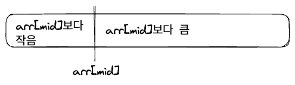
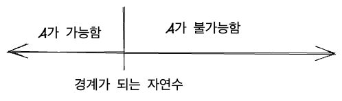
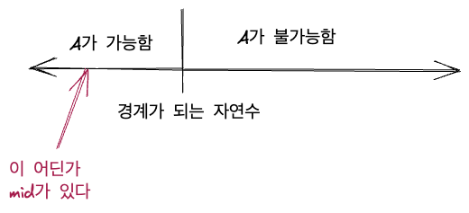
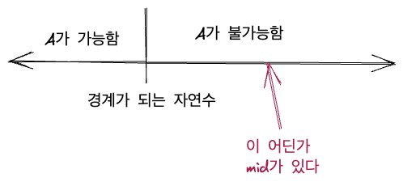
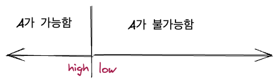
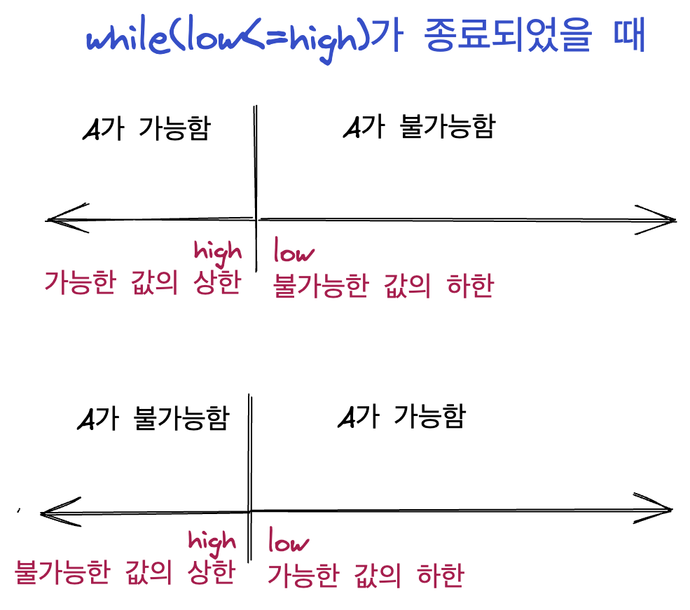

[city](https://solved.ac/profile/city)입니다. 알고리즘을 그럭저럭 오래 해왔는데, 이분 탐색의 원리를 어떻게 이해하는지에 그리고 활용 문제를 접근하는 방식에 대해서 간단히 써봅니다. 글에 사용한 그림은 [excalidraw](https://excalidraw.com/)를 사용하여 직접 그렸습니다.

# 1. 이분 탐색

기본적인 이분 탐색은 정렬된 원소들 사이에서 특정 원소를 찾는 알고리즘입니다. 대략 다음과 같은 코드로 짜입니다. C++ 기준입니다.(사실 C라도 다를 바는 없습니다.)

```cpp
while(low<=high){
  int mid = (low+high)/2;
  if(arr[mid]==target){
    return mid;
  }else if(arr[mid]>target){
    high = mid-1;
  }else{
    low = mid+1;
  }
}
```

여기서 while문 내부를 보면 3개의 분기가 있습니다. 우리가 찾는 값을 찾았을 경우, 찾는 값이 mid 인덱스 값보다 작을 경우, 찾는 값이 mid 인덱스 값보다 클 경우입니다.

찾는 값을 찾았을 때는 그냥 target 값을 찾은 인덱스를 리턴해 주는 거니까 뭔가 더 설명할 게 없습니다. 나머지 2개의 분기에 대해서 다뤄봅시다.

우리가 원소를 찾는 리스트는 정렬되어 있으므로, `arr[mid]`를 택했을 때 target이 만약 `arr[mid]`와 다르다면 2가지 경우뿐입니다. target이 `arr[mid]`보다 작아서 왼쪽에 있거나, target이 `arr[mid]`보다 크기 때문에 오른쪽에 있거나.



위의 이분탐색 코드는 설명한 두 가지 경우에 따라 low를 조절하거나 high를 조절해서 탐색 구간을 좁혀 나갑니다. 

만약 target이 arr[mid]보다 작다면 target을 찾기 위해 arr[mid]의 왼쪽 구간을 탐색해야 하므로 탐색 구간의 상한인 high를 줄이고, target이 arr[mid]보다 크다면 arr[mid]의 오른쪽 구간을 탐색해야 하므로 탐색 구간의 하한인 low를 늘려줍니다.

이를 반복하다 보면 언젠가는 탐색 구간에 포함되는 수가 단 하나밖에 없어서 target을 찾게 되거나 탐색 구간이 더 이상 없어서 target을 찾지 못하게 됩니다.

# 2. 원리의 확장

여기서 주목해야 할 것은 어떻게 우리는 탐색 구간을 반씩 좁혀 나가면서, 'arr[mid]를 기준으로 한쪽에는 target이 있고, 한쪽에는 target이 없다'라는 것을 알 수 있었는지입니다. 당연히, 원소들이 정렬되어 있었기 때문입니다.

그러면 이 원리를 좀더 확장해 보면 어떨까요? 자연수는 당연히 정렬되어 있습니다. 그럼 어떤 특정 자연수를 경계로, 그보다 작은 자연수들에서는 무엇인가가 가능하고, 그보다 큰 자연수들에서는 무엇인가가 불가능한 것이 있다고 해봅시다. 이 무언가를 A라고 한다면 자연수는 다음과 같이 나눠질 것입니다.



이때 우리가 따져야 하는 자연수의 상한과 하한을 알고 있다고 할 때, 이 A의 가능과 불가능을 가르는 경계를 찾는 문제를 생각해 봅시다. 이 문제는 이분 탐색을 이용해서 풀 수 있습니다.

왜냐 하면 어떤 자연수를 mid로 잡았을 때, A가 가능한지 불가능한지를 알 수 있기 때문입니다. 그리고 mid에서 A가 가능한지 아닌지에 따라서 우리가 mid의 오른쪽 구간을 탐색할지 왼쪽 구간을 탐색할지 결정할 수 있어서 구간을 반씩 줄여 나갈 수 있고 따라서 이분 탐색을 적용할 수 있습니다.

```
이렇게 문제를 푸는 방식을 파라메트릭 서치, 즉 매개 변수 탐색이라고도 합니다. 최적화 문제를 결정 문제로 바꿔 푸는 거라고 멋지게 말할 수도 있지만 그 말이 중요하다고 생각지는 않습니다.
```

아무튼 나올 수 있는 자연수의 하한을 low, 상한을 high라고 하면, 경계선을 찾는 코드는 대강 이럴 것입니다.

```cpp
while(low<=high){
  int mid = (low+high)/2;
  // A가 mid에서 가능하다
  if(check_A(mid)){
    low = mid+1;
  }else{
    high = mid-1;
  }
}
```

A가 mid에서 가능하면 경계선은 A의 오른쪽에 있을 수밖에 없습니다.



따라서 오른쪽 구간의 탐색을 위해 low를 mid+1로 업데이트해주는 것입니다.

반대로 A가 mid에서 불가능하다면 경계선은 A의 왼쪽에 있을 수밖에 없습니다.



따라서 왼쪽 구간의 탐색을 위해 high를 mid-1로 업데이트해주는 것입니다. 이를 반복하다 보면 경계선이 있는 구간을 확실히 찾을 수 있습니다!

# 3. 헷갈리는 부분 잡기

이분탐색에 대한 자료는 워낙 많기 때문에 이 정도 이해는 꽤 많은 분들이 하고 계십니다. 하지만 가장 헷갈리는 부분은 이런 것이죠.

```
while(low<=high) vs while(low<high)
low 출력 vs high 출력(lower와 upper, l과 r 등의 다른 변수명을 쓰는 분들도 있지만 가리키는 건 같죠)
```

어떤 방식이 맞고 틀린 건 없지만 제가 이해한 방식을 적어보겠습니다. 사실 이 둘은 연관이 있기 때문에 한번에 설명하겠습니다.

문제 조건에 따라 조금씩 달라지지만 제가 이분 탐색에 흔히 쓰는 코드는 다음과 같습니다. 위에 쓴 것과 같습니다.

```cpp
while(low<=high){
  int mid=(low+high)/2;
  if(check(mid)){
    low=mid+1;
  }
  else{
    high=mid-1;
  }
}
```

이렇게 하면 while이 종료되는 순간 low와 high는 결국 탐색 구간의 경계를 가리키게 됩니다. 그런데 while은 `low<=high`일 때는 계속 돌아가므로, while이 종료되었다는 것은 `low>high`가 되었다는 것입니다. 따라서 이 상황을 그림으로 나타내 보면 다음과 같습니다.



문제의 조건상, 경계선을 나타내는 자연수보다 작으면 가능, 크면 불가능인 문제였다면 high는 가능한 구간의 상한을, low는 불가능한 구간의 하한을 나타내게 되는 것입니다.

만약 반대로 문제 조건이 경계선을 나타내는 자연수보다 크면 가능, 작으면 불가능인 문제였다면 low가 가능한 구간의 하한을, high는 불가능한 구간의 상한을 나타내게 됩니다.

예를 들어서 유명한 파라메트릭 서치 문제인 [랜선 자르기](https://www.acmicpc.net/problem/1654)의 경우, 특정 경계 수보다 작으면 문제의 조건을 만족시킬 수 있고 크면 문제 조건을 만족시킬 수 없습니다.

이는 문제를 잘 읽어 보면 알 수 있습니다. 만약 어떤 길이 L이 있어서 우리가 길이 L의 랜선을 N개 만들어서 문제 조건을 만족시킬 수 있다고 합시다. 그러면 L보다 작은 길이의 랜선을 N개 만드는 건 굳이 수학적 증명이 없어도 무조건 가능합니다. 

그러므로 이 문제는 경계선을 나타내는 자연수보다 작으면 가능, 크면 불가능인 문제입니다.

즉 이 문제와 같은 경우 가능한 구간의 상한인 high를 출력하면 되는 문제입니다(심지어 문제 설명에도 '최댓값을 구하라'고 친절하게 말해주네요). 즉 입력을 제외한 랜선 자르기 문제에서 이분 탐색 부분만 따로 떼어서 적어보면 다음과 같습니다. high를 출력하면 됩니다.

```cpp
while(low<=high){
    ll mid=(low+high)/2;
    if(check(mid)){
        low=mid+1;
    }
    else{
        high=mid-1;
    }
}
cout<<high<<"\n";
```

이렇게 구간을 줄여나가는 아이디어를 통해서 할 수 있는 게 정말 많습니다. 구간합의 홀짝성이 달라지는 것을 이용해서 이분탐색을 한다든지, 아예 구간을 3개로 나눠서 극점을 찾는 삼분 탐색을 한다든지 아니면 자연수 대신 실수도 어쨌든 연속되어 있으므로 이를 이분탐색한다든지 등등...

또한 가능 여부를 따지는 부분도 중요하지만 위에서는 그냥 check함수로 퉁쳤죠. 이것도 사실 문제를 풀 때 엄청 어려운 포인트가 될 수도 있습니다. 문제를 보고 이분탐색을 떠올리기 어렵게 하는 요소가 되기도 하고요. 하지만 원리와는 관련 없으므로 일단 넘어갔습니다.

이런 부분들도 나중에 기회가 되면 쓰도록 하겠습니다.

# 4. 정리

이분 탐색의 핵심은 '한쪽 구간은 뭔가가 되고, 한쪽 구간은 안 된다. 따라서 어떤 한 값의 가능 여부를 알면 그 값을 기준으로 어떤 구간을 탐색할지 결정할 수 있다.'라는 것입니다.

그렇게 탐색 구간을 줄여가다 보면 결국 경계선을 찾을 수 있는데요. 이때 경계선을 찾는 while문이 언제 종료되는지를 따져 보면 우리는 high와 low중 어떤 값이 필요한지를 알 수 있습니다.

우리가 어떤 가능성을 따지고 있는지, 그리고 while문이 어떤 조건일 때 종료될지를 생각합시다.



# 5. 다른 방법

혹은 아래와 같이 할 수도 있습니다.

```cpp
while(low<=high){
    ll mid=(low+high)/2;
    if(check(mid)){
        low=mid+1;
        ans=max(ans, mid);
    }
    else{
        high=mid-1;
    }
}
cout<<ans<<"\n";
```

이렇게 하면 무조건 가능 구간의 상한이 ans에 들어갑니다. 이분탐색 하는 동안 가능 구간의 상한 값이 ans에 한 번은 들어갈 수밖에 없기 때문입니다.

구간의 가능성이 반대라면 적당히 `ans=min(ans, mid)`으로 바꾸고 위치도 변경하면 됩니다. 원리를 생각하면 쉽게 할 수 있습니다. 이렇게 이분탐색을 다루는 분들도 몇 분 봐서 소개해 보았습니다.

`while(low<high)`를 쓰시는 분들도 보았지만 이를 익혀 본 적은 없어서 넘어가겠습니다. low가 high보다 더 커질 때 while을 탈출한다는 게 좀더 직관적으로 와닿는다고 느낍니다.