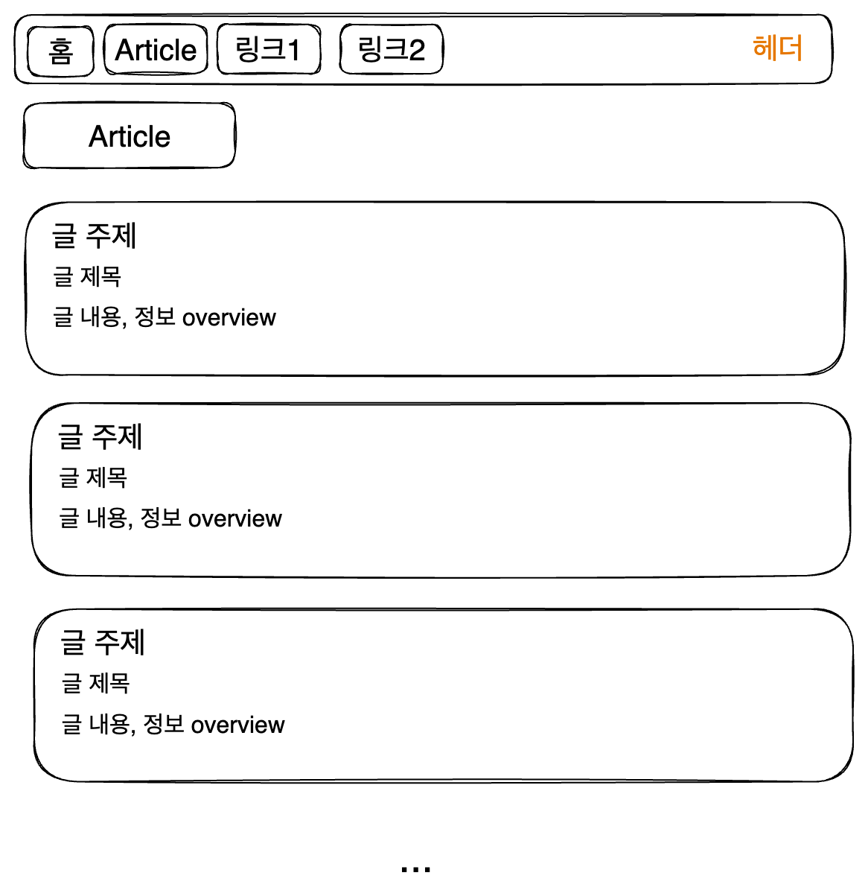

여기 있는 그림은 짤이 아니라면 [excalidraw](https://excalidraw.com/)로 그려졌다.

# 1. 시작


2023년 5월 19일 시점, 내가 쓰고 있는 블로그는 [이창희](https://xo.dev/)님이 만든 gatsby-starter-lavender 블로그 테마에 기초해 있다.

하지만 이 블로그는 내가 원하는 기능을 모두 갖추고 있지는 않다. 또한 나는 Gatsby를 잘 모르기 때문에 이를 손수 추가하는 데에도 한계가 있었다. 따라서 마침 배우려고 하고 있던 NextJS의 튜토리얼이 블로그 만들기임에 착안해서 이참에 내 블로그를 만들어 보기로 했다.

NextJS 튜토리얼에서는 [이런 블로그](https://next-learn-starter.vercel.app/)를 만드는 튜토리얼을 제공한다. 이미 내가 따라해 보기도 했다.

하지만 나는 원하는 기능이 있기 때문에 몇 가지를 추가한 것을 만들어 보도록 하겠다. 레이아웃은 [ambienxo](https://github.com/blurfx/ambienxo)와 내 기존 블로그 테마 등을 참고하였다. 그리고 NextJS 튜토리얼에 보면 NextJS의 장점 같은 것들도 길게길게 써놓았는데, 그런 건 여기에 옮기지 않는다. 블로그 만드는 데 코드 스플리팅을 굳이 자세히 쓸 건 없으니..

# 2. 레이아웃

홈 페이지는 이렇게 되면 좋겠다.


그리고 글을 보는 영역은 다음과 같아졌으면 한다.



물론 이는 해보면서 조금씩 바뀔 가능성이 높다.

# 3. 시작

Node는 깔려 있다고 가정하고, 먼저 NextJS 앱을 생성하자.

```
npx create-next-app@latest
```

이렇게 하면 몇 가지 질문이 나오는데 난 Typescript를 사용할 것이다. 그리고 Tailwind는 사용하지 않을 것이다. 소마에서 프로젝트 하면서 너무 데여서...일단은 그냥 제공하는 CSS Modules를 사용할 것 같다.

또한 App router가 새로 나왔다고 하는데 아직은 버그가 많다고 해서 App router를 사용할 거냐는 질문에는 No를 택했다. 기존의 Page router를 사용하도록 하겠다.

이렇게 앱을 만든 후 해당 폴더로 이동하여 `npm run dev`를 실행하면 앱이 실행된다.

# 4. eslint, prettier

eslint는 아까 앱을 세팅할 때 깔리도록 설정했으므로, prettier와 eslint 연동 플러그인을 깐다. prettier와 충돌이 생기는 규칙을 끄고, eslint에 prettier 포매터 규칙을 추가해 주는 플러그인이다.

```
npm i -D prettier
npm i -D eslint-config-prettier eslint-plugin-prettier
```

그다음 eslint를 vscode의 기본 포매터로 설정한 후 저장할 때마다 포맷팅이 되도록 설정한다. setting의 format on save를 true로 설정하고 default formatter를 eslint로 설정하면 된다.

`.prettierrc`는 간단한 정보만 설정하자. 어차피 eslint에서 같은 내용을 설정할 것이기 때문이다.

```
{
  "trailingComma": "all",
  "tabWidth": 2,
  "semi": true,
  "singleQuote": true,
  "jsxSingleQuote": true
}
```

나는 TS를 쓸 거니까 해당 eslint 플러그인 설치

```
npm i -D @typescript-eslint/parser @typescript-eslint/eslint-plugin
```

그리고 쓰이지 않는 import를 지우는 eslint 플러그인도 설치

```
npm i -D eslint-plugin-unused-imports
```

이제 eslintrc 설정을 해보자. 기본으로 되어있는 `.eslintrc.json`은 다음과 같이 되어있다.

```js
{
  "extends": ["next/core-web-vitals"]
}
```

먼저 여기 우리가 설치한 플러그인과 추천 설정을 좀 추가해 주자.

```json
{
  "plugins": ["@typescript-eslint", "unused-imports"],
  "extends": ["next", "next/core-web-vitals", "prettier"],
}
```

그 다음에는 rules를 설정해서 린터 규칙만 만들면 된다. 여기서 인덴트 규칙 등을 설정해야 자동 수정이 된다. ruls를 다음과 같이 추가하자.

줄의 최대 길이 제한은 끄고, 들여쓰기는 2칸으로, import는 적절히 정렬되도록 한다. 또한 예약 키워드들 간에는 띄어쓰기를 넣게 하고 따옴표는 작은따옴표를 쓴다. 파일 이름은 `.tsx`만 허용한다. 또한 콘솔 출력을 사용하지 못하게 하고 쉐도잉 변수를 쓸 수 없게 하며 세미콜론을 강제하는 등 여러 규칙들을 지정했다. 편해 보이는 걸 끌어왔지만 만약 코드를 짜다 더 필요한 게 생기면 추가 혹은 삭제할 것이다.

```json
"rules": {
  "no-unused-vars": "off",
  "max-len":"off",
  "indent":[
    "error",
    2
  ],
  "import/order": [
    "error",
    {
      "alphabetize": {
        "order": "asc",
        "caseInsensitive": true
      },
      "groups": [
        "builtin",
        "external",
        [
          "parent",
          "internal"
        ],
        "sibling",
        [
          "unknown",
          "index",
          "object"
        ]
      ],
      "pathGroups": [
        {
          "pattern": "~/**",
          "group": "internal"
        }
      ],
      "newlines-between": "always"
    }
  ],
  "jsx-quotes": [
    "error",
    "prefer-single"
  ],
  "keyword-spacing": "error",
  "quotes": [
    "error",
    "single",
    {
      "avoidEscape": true
    }
  ],
  "react/jsx-filename-extension": [
    "warn",
    {
      "extensions": [
        ".tsx"
      ]
    }
  ],
  "no-console": [
    "error",
    {
      "allow": [
        "warn",
        "error"
      ]
    }
  ],
  "react/no-unescaped-entities": "warn",
  "react/jsx-props-no-spreading": "off",
  "react/require-default-props": "off",
  "semi": "off",
  "space-before-blocks": "error",
  "no-shadow": "off",
  "@typescript-eslint/no-shadow": [
    "error"
  ],
  "@typescript-eslint/explicit-function-return-type": "off",
  "@typescript-eslint/no-explicit-any": "error",
  "@typescript-eslint/no-unused-vars": "error",
  "@typescript-eslint/semi": [
    "error"
  ],
  "@typescript-eslint/type-annotation-spacing": [
    "error",
    {
      "before": false,
      "after": true,
      "overrides": {
        "colon": {
          "before": false,
          "after": true
        },
        "arrow": {
          "before": true,
          "after": true
        }
      }
    }
  ]
}
```

코드 짜는 데 핵심적인 내용은 아니니 이정도만 하고 넘어가자.

# 5. 페이지 라우터 만들기

내가 생각하기에 지금 블로그에 필요한 페이지는 다음과 같다.

1. 메인 페이지
2. 글 목록 페이지
3. 내 소개 페이지
4. 글 페이지

여기서 글 페이지는 개별 글마다 동적 라우터를 생성해 줘야 하기 때문에 일단 넘어가자. 나머지 페이지의 라우터를 만들어 주자.

NextJS는 pages 폴더 내에서 export된 컴포넌트들이다. 예를 들어서 `pages/posts/index.tsx`에서 export된 컴포넌트는 `/posts` 경로로 접근할 수 있다.

따라서 pages 폴더 내에 `posts`, `about` 폴더를 만들고 각각 `index.tsx`를 만들어 주자. 그리고 각각의 컴포넌트에는 간단한 내용을 넣어주자.

예를 들어 이런 것이다.

```tsx
// src/pages/about/index.tsx
function AboutPage() {
  return <h1>내 소개 페이지</h1>;
}

export default AboutPage;
```

이제 대강 기초 세팅이 끝난 것 같다. 다음 글에서 HTML로 기본적인 사이트 구조를 잡도록 하자.

# 참고

https://velog.io/@rmaomina/prettier-eslint-settings

https://www.daleseo.com/eslint-config/