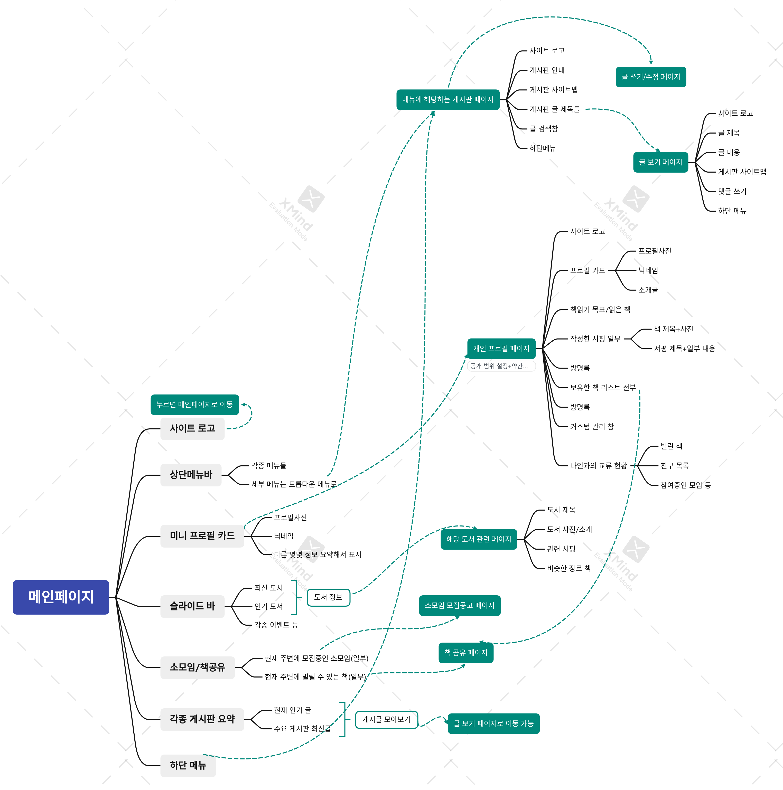

# 1. 책 커뮤니티 만들기 시작

스터디에서 3명 팀을 꾸려 React, Express, MySQL을 이용한 프로젝트를 하기로 했다. 스터디원 한 분(https://github.com/hamuneulbo) 의 제안으로, 책을 기반으로 하는 커뮤니티 사이트를 제작하기로 하였다. 그래서 블로그에 개발기록을 간단히 기록해 놓기로 했다. 블로그에 내가 하는 작업(이라고 하기에는 공부에 더 가깝지만)들을 정리해 놓는 것이 도움이 될 거라는 조언도 많이 들었기에...

# 2. 사이트 구조 짜기

이전에 한 번, 클론코딩을 잠깐 시도한 적이 있었다. 그런데 그때, 클론코딩이니까 그대로 따라 만들기만 하면 되겠지-하고 생각했다가 큰코다쳤었다. 물론 완성된 형태의 사이트가 이미 있기 때문에 내가 만드는 사이트의 완성본이 어떻게 되어야 할지는 너무 확실했다. 그런데 문제는 순서와 구조였다. 사이트 구조가 그려지지 않은 상태에서 시작하려고 하니 무엇부터 해야 할지도 막막했고 뭐 하나 기능을 붙일 때마다 너무 많은 생각을 해야 했다. 이 기능은 어떤 페이지랑 연결되어야 하지? 이 페이지에서 이 컴포넌트를 동작시켰을 때 어떤 점이 변해야 하지? 페이지끼리는 어떻게 연결되어야 하고 DB와는 어떻게 상호작용해야 하지? 이런 부분들을 계속 생각해야 했기에 겨우 하나를 개발하는 데에도 너무 많은 정신력이 들었다.

그래서 이번에는, 어차피 팀원들도 사이트 구조를 머리에 넣어야 하니까-라고 생각하며 사이트 구조부터 짜 보았다. 찾아보니 xmind라는, 사이트 구조를 그릴 수 있는 툴이 있기에 그것을 이용했다. 그리고 팀원들의 피드백을 받아서 완성한 사이트 구조는 다음과 같았다. 하루만에 짠 거라 엉성하긴 하다. 실제로 개발하다 보면 훨씬 더 많은 연결과, 이때는 생각하지 못했던 기능들이 생길 가능성이 높다는 것은 알고 있었다. 하지만 우리는 방학 중에 프로젝트를 어느 정도 궤도에 올려 놓아야 했고(배포까진 아니더라도), 모든 것이 급했다. 그래서 적당히 생각나는 것만 협의한 다음 바로 코딩에 뛰어들기로 했다.



# 3. 프로젝트 폴더 구조 만들기

클라이언트 폴더와 서버 폴더를 따로 두기로 했다. 클라이언트는 create-react-app으로 만들고 서버는 그냥 Express만 써서 만들기로 했다. nestjs 등 여러가지 툴이 있는 건 알고 있었지만 일단은 그런 툴은 아직 쓰지 않기로 협의했다. 나중에 협의 후에 쓸 수도 있긴 하다. 일단 book-community 폴더를 두고 그 안에 client, server 폴더를 만들었다. 

`npx create-react-app client`로 client 폴더를 생성했다. 서버 폴더는 server 폴더를 생성 후 `npm init` 으로 환경을 만들고 `package.json` 을 생성해 준다.

서버 폴더에서는 추가적으로 express를 설치해 준다.

`npm install express --save` 를 터미널에 입력해서 Express를 설치하고 기본적인 코드만 작성해 두자. 공식 문서를 따라했다.

그전에 나는 nodejs에서 import/export 사용을 위해 `package.json` 에서 `type : "module"` 을 추가해 주었다. 그 다음 server/index.js를 다음과 같이 작성해준다.

```js
import express from 'express';

const app=express();
const port=8000;

app.get('/', (req, res)=>{
  res.send('hello world');
})

app.listen(port, ()=>{
  console.log(`Example app listening on port ${port}`);
})
```

# 4. eslint 설정

eslint를 설정해서 팀원들 간에 코드 스타일을 어느 정도 맞추기로 했다. 이때 5. 참고 부분에 써 있는 eslint/prettier 설정, 그리고 webstorm에 적용하는 방법을 설명한 블로그 글들을 많이 참고했다. 그런데 서버에 eslint를 적용할 때 문제가 있었다. 그래서 이를 해결하기 위해 eslint를 .cjs파일로 해 주어서 eslintrc 파일만은 commonJS 문법이 적용되도록 했다. 이는 아까 type : "module"을 설정해 주었기 때문인데 이에 대해서는 참고자료에 링크를 걸어 두었다.

그리고 webstorm에서 lint를 사용할 수 있게 설정하는 방법도 참고자료에 걸어 두었다. 그런데 클라이언트와 서버에 다른 eslint를 적용하는 건 webstorm에서는 아직 안되는 듯 하다..

# 5. 참고

express 공식 문서 https://expressjs.com/ko/starter/hello-world.html

nodejs에서 import 사용하기 https://velog.io/@ohzzi/Node.js-%EC%97%90%EC%84%9C-importexport-%EC%82%AC%EC%9A%A9%ED%95%98%EA%B8%B0

eslint + prettier 에어비앤비 스타일로 설정하기 https://velog.io/@_jouz_ryul/ESLint-Prettier-Airbnb-Style-Guide%EB%A1%9C-%EC%84%A4%EC%A0%95%ED%95%98%EA%B8%B0

webstorm에 eslint 적용하기 https://modipi.tistory.com/10, https://valuefactory.tistory.com/828

cjs와 esm https://yceffort.kr/2020/08/commonjs-esmodules