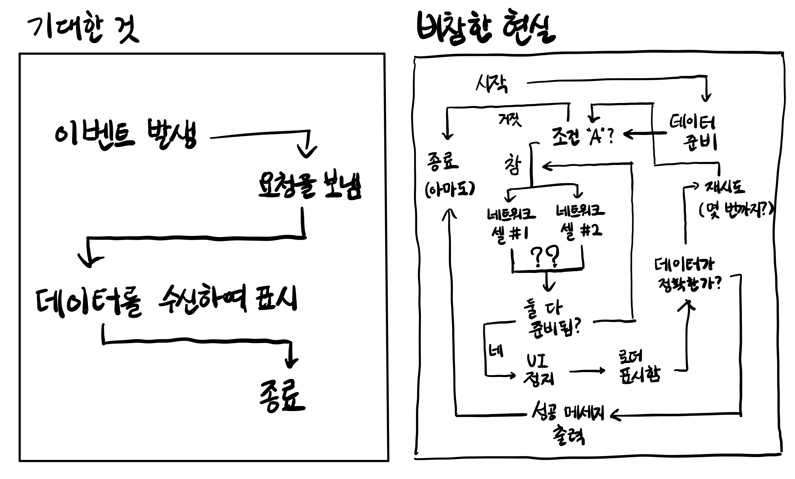

# 0. 개요

유명한 글인 [What Color is Your Function?](http://journal.stuffwithstuff.com/2015/02/01/what-color-is-your-function/)과 [해당 글에 대한 토론](https://news.ycombinator.com/item?id=8984648), 그리고 같은 블로그에서 반복과 동시성의 연관관계를 다룬  [Iteration Inside and Out](http://journal.stuffwithstuff.com/2013/01/13/iteration-inside-and-out/), [그리고 해당 글의 2번째 시리즈](http://journal.stuffwithstuff.com/2013/02/24/iteration-inside-and-out-part-2/)를 읽고 작성한 글이다.

개인적으로 이 글들의 시사점은 비동기 프로그래밍의 어려움이 콜스택에서 오며 이 문제는 우리가 생각도 못한 곳까지 닿아 있다는 점이라고 생각한다.

원 글의 저자는 Ruby, Dart 등의 언어에 매우 익숙하기 때문에 원 글에서는 이런 언어들을 예시로 들고 있다. 하지만 JS, Python 등 내가 알고 있고 좀더 유명하기도 한 언어로 예시를 바꾸어 작성하도록 노력하였다.

그리고 나는 개인적으로 이 글의 논지 전부에 동의하지는 않는다. [Red & blue functions are actually a good thing](https://blainehansen.me/post/red-blue-functions-are-actually-good/)과 같이 동기와 비동기를 명확히 구분할 수 있는 것이 더 좋다는 것에 동의하는 편이다. 하지만 이 글에서 주장하는 바도 충분히 시사점이 있다고 생각하여 블로그에 남긴다.

# 1. 비동기의 전염성

이런 JS 코드를 작성한다고 해보자. A, B, C는 잘 출력되고 아무 문제도 없다.

```js
function A(){
  return "A";
}

function B(){
  console.log(A());
  return "B";
}

function C(){
  console.log(B());
  return "C";
}

console.log(C());
/* 
A
B
C
콘솔 출력
*/
```

그런데 만약 이렇게 연쇄적으로 호출되는 함수의 콜체인 중 `B`함수에서 비동기로 동작하는 `fetchData`함수의 데이터를 사용하게 되었다고 하자. 그럼 B는 데이터 페칭을 위해 비동기로 바뀌고, C에서 B를 사용하기 위해서 C도 비동기 함수가 되어야 한다. 그럼 전체적으로 다음과 같은 코드가 된다.

```js
async function B(){
  console.log(A());
  const data=await fetchData();
  return data;
}

async function C(){
  console.log(await B());
  return "C";
}
```

만약 `C()`의 결과를 `D()`에서도 사용해야 한다면 `D()`는 또 `C()`를 사용하기 위해서 비동기 함수가 되고...이런 비동기 함수의 전염성은 계속되어 간다. 비동기 함수는 비동기 함수 내부에서만 호출될 수 있기 때문이다. 서버 데이터 페칭 하나를 위해서 대체 몇 개의 함수가 비동기가 되어야 하는 것인지 알 수조차 없다.

이런 문제는 Promise를 사용해도 마찬가지고, JS에서는 무엇을 써도 마찬가지다(Web Worker가 있긴 하지만, 싱글스레드 환경에서는 그렇다는 이야기다). 

`B()`의 비동기성은 결국 전염된다. 비동기 함수의 결과를 사용한다면, 해당 코드가 완결될 때까지 비동기 함수의 결과를 기다려야 하기 때문이다.

```js
async function B(){
  console.log(A());
  const data=await fetchData();
  return data;
}

async function C(){
  console.log(await B());
  return "C";
}

async function D(){
  console.log(await C());
  return "D";
}
// ...
```

이 문제는 어떤 패러다임이나 개발자의 실력 문제가 아니고, 특정 라이브러리나 방법론을 통해서 깔끔하게 해결할 수 있는 것도 아니다.

이는 재사용될 수 있는 함수들로 프로그램을 구성하고, 그 결과들을 또 다른 함수에서 사용하는 기본적인 프로그래밍 방법에서 발생하는 문제이기 때문이다. [비동기 코드를 적절하게 배치하는 일은 지금도, 앞으로도 결코 간단하지 않을 것이다.](https://www.rinae.dev/posts/why-every-beginner-front-end-developer-should-know-publish-subscribe-pattern-kr)



# 2. 원인

그러나 우리는 그럼에도 무언가 해야 한다. 그렇다면 가장 먼저 해야 할 일은 근본적인 원인의 탐구이다. 왜 JS에서 비동기 함수는 전염될 수밖에 없는가? 해결 방안을 알기 위해서는 원인을 알아야 한다.

먼저 비동기 함수를 다음과 같이 정의하자. Promise를 쓰거나 하는 것이 비동기 함수의 조건은 아니다. (async/await은 비동기를 동기처럼 쓸 수 있게 해줌으로써 다음 조건들 중 몇몇을 완화하고 동기처럼 쓸 수 있도록 해주지만 지금은 생각하지 말자.)

- 비동기 함수는 그 결과를 비동기적으로 반환하는 함수이다.
- 동기 함수는 값을 반환하지만 비동기 함수는 값을 반환하지 않고 콜백을 실행한다.
- 즉 동기 함수는 값을 통해서 결과를 전달하지만 비동기 함수는 콜백을 실행하는 것을 통해서 결과를 전달한다.

이러한 점 때문에 비동기 함수는 에러 핸들링이나 다른 여러 제어 흐름에 사용될 수 없다.

## 2.1. 비동기 작업의 맥락 유지

함수의 비동기가 전염되는 근본적인 이유는 비동기 함수가 완료된 후 실행될 작업이 진행될 때 '비동기 함수가 완료된 상태의 실행 맥락'을 보장해 줘야 하기 때문이다.

그런데 JS는 싱글스레드 언어이기 때문에 실행되고 있는 함수가 가진 정보를 저장할 콜스택이 하나밖에 없다. 따라서 비동기 작업이 끝난 이후 돌아와보면 콜스택에서는 이미 다른 작업을 진행하고 있을 수 있다.

예를 들어서 다음과 같은 코드를 생각해보자.

```js
A()
const data=asyncJob();
useAsyncJobResult(data);
B();
```

그러면 비동기 작업과, 그 뒤에 진행될 동기 작업의 순서가 꼬일 가능성이 높다. 운좋게 경쟁 상태에서 어떻게 잘 처리되어서 원하는 대로 될 수도 있겠지만...


따라서 '비동기 작업이 완료된 후 진행되어야 할 작업에 필요한 맥락'들이 모두 하나의 함수에 탑재되어서 실행되어야 한다. 이것으로 인해서 엄청난 콜백의 연쇄가 만들어지게 된다. 실행 맥락을 저장할 수 있는 콜스택이 하나밖에 없어서 '비동기 작업 이후에 진행할 코드의 실행 맥락'을 콜백 함수를 통해 개발자가 직접 설정해 줘야 하는 것이다.

어떻게, 문제를 조금이라도 해결할 수 있을까? 이를 살펴보기 위해서 예전에 콜백을 쓰던 방식을 살펴보자.

JS의 Promise가 왜 나왔는지에 대해서 검색해 본다면 반드시 나오는 말이 있다. '콜백 지옥'이라는 말이다. 예전에는 비동기 처리에 콜백만을 썼는데 이러다가 콜백 지옥이 생겼고 Promise를 쓰면 콜백 지옥을 해결할 수 있고 신뢰성도 늘어나고...등등.

그럼 이런 콜백 지옥은 대체 왜 생겼던 것일까? 단적으로 이야기하면 비동기 함수의 결과물을 사용하는 함수들에 비동기가 전염되었기 때문이다. 그리고 이는 앞서 말했듯 비동기 함수가 완료된 후 실행되어야 할 작업의 맥락을 콜백을 통해 전달해 주어야 했기 때문이다.

나도 콜백 지옥에서 불타던 시절의 개발자는 아니지만, 이해를 위해 간단한 예시를 보자.

이 예시는 역시 [What Color is Your Function?](https://journal.stuffwithstuff.com/2015/02/01/what-color-is-your-function/)에서 가져왔다. 진짜 콜백 지옥 코드라면 아마 저기에 errorback 함수도 들어가 있겠지만 콜백 지옥 해설이 목적이 아니므로 넘어가자.

```js
function makeSundae(callback) {
  /* 아이스크림 푸는 작업(비동기일 수도 있다) */
  scoopIceCream(function (iceCream) {
    /* 카라멜 데우는 작업(비동기) */
    warmUpCaramel(function (caramel) {
      callback(pourOnIceCream(iceCream, caramel));
    });
  });
}
```

`scoopIceCream` 함수는 `iceCream`에 해당하는 값을 필요로 하고, `warmUpCaramel` 함수는 `caramel`에 해당하는 값을 필요로 할 것이다. 아마 다음과 같이 비동기 처리가 되어 있겠다.

Eventemitter나 커스텀 이벤트를 사용해서 더 똑똑하게 비동기 완료를 감지할 수도 있겠으나 이게 주제가 아니므로 적당히 했다.

```js
function scoopIceCream(callback) {
  const iceCream = /* 비동기 작업을 사용하는 데 필요한 어떤 값. 비동기적으로 나오는 값일 수도 아닐 수도 있다 */
  setTimeout(() => callback(iceCream), 100);
}

function warmUpCaramel(callback) {
  const caramel = /* 어떤 비동기 작업. */
  /* xhr 같은 몇 내장 함수를 사용하는 경우 완료시 실행될 콜백을 직접 지정해 줄 수도 있다 */
  setTimeout(() => callback(caramel), 100);
}
```

그럼 왜 이렇게 콜백을 넘겨주는 방식으로 코드를 짜야 했는가? 그것은 `pourOnIceCream`함수에 iceCream과 caramel(아마 비동기의 결과물)이 필요했기 때문이고 더 일반적으로는 위에서 말했듯이 동기 함수의 실행에 비동기 함수 결과물이 필요한 경우였기 때문이다. 

만약 콜백을 사용하지 않고 짜면 `scoopIceCream`, `warmUpCaramel`함수는 비동기 함수이므로 이 함수들이 완료되기도 전에 `pourOnIceCream`이 실행되어 버리고 함수가 종료될 수 있다.

```js
/* 제대로 처리되지 않는 비동기 코드 예시 */
function makeSundae(callback) {
  const iceCream = scoopIceCream();
  const caramel = warmUpCaramel();
  /* 이 시점에 아직 위 함수들이 완료되지 않았을 수 있다 */
  return pourOnIceCream(iceCream, caramel);
}
```

따라서 우리는 콜백의 연쇄를 통해 `iceCream`과 `caramel`을 힙에 남겨 둠으로써 설령 외부 함수 `makeSundae`가 종료되더라도 `callback(pourOnIceCream(...));`이 실행될 때는 `iceCream`과 `caramel`이 존재할 것이라는 것을 보장해 준 것이다.

이런 맥락의 보장을 위해서는 비동기 함수가 전염되어야 한다. 만약 caramel을 필요로 하는 다른 함수 `makeCaramelSyrup`이 있다면 `makeCaramelSyrup`의 맥락 또한 콜백을 통해 넘겨져야 하므로 비동기 함수가 되어야 하는 것이다.

```js
function makeCaramelSyrup(callback) {
  /* 카라멜 데우는 작업(비동기) */
  warmUpCaramel(function (caramel) {
    callback(caramel);
  });
}
```

이는 [continuation-passing style](http://dogfeet.github.io/articles/2012/by-example-continuation-passing-style-in-javascript.html)이라고 불리는 기존 패턴과 비슷한데 실제로 컴파일러에서 코드를 최적화할 때 사용하는 방식이다. (C#의 `.NET`의 경우 컴파일러에서 await을 이런 continuation-passing style로 변환하기 때문에 따로 await에 대한 런타임 지원이 없다고 한다)

하지만 이는 너무 복잡하다. Node에서도 이런 continuation-passing style방식을 쓰긴 하지만 개발에서 많이 쓰이지 않는 방식인 이유이다.

더 큰 문제는 복잡성도 복잡성이지만, 이런 맥락 전달이 싱글스레드에서는 쉽게 해결할 수 없는 문제라는 것이다. 

콜스택이 하나뿐이라 비동기 함수가 완료된 후 실행되어야 할 콜백과 해당 콜백이 가져야 할 맥락을 개발자가 직접 콜백의 연쇄 호출을 통해 하나하나 설정해 줘야 한다는 게 근본적인 원인이기에, 개발자는 어떤 변수가 힙에 남아 있어야 하고 어떤 맥락이 비동기 함수 완료시 남아 있어야 하는가를 직접 설정해 줘야 한다. 이를 따져주며 콜백을 만드는 개발자의 머리가 터져나가는 소리가 과거에서 들려오는 것 같다. 

이를 개선하기 위해 나온 것이 Promise이다. Promise가 이런 복잡성의 해결을 위해서만 나온 건 아니지만 Promise 역시 이 글의 주제가 아니므로 깊이 다루지는 않겠다. 그냥 문제를 좀 완화시켰다는 것 정도만 쓰고 넘어가자. Promise를 사용해 함수들을 변경했다는 가정 하에 다음과 비슷하게 변할 것이다.

```js
function makeSundae() {
  return warmUpCaramel().then((caramel)=>{
    return scoopIceCream().then((iceCream)=>{
      return pourOnIceCream(iceCream, caramel);
    });
  });
}
```

혹은 좀더 현대 문법인 async/await을 사용할 수도 있겠다. 

```js
function makeSundae() {
  const caramel=await warmUpCaramel();
  const iceCream=await scoopIceCream();
  return pourOnIceCream(iceCream, caramel);
}
```

하지만 await이 실제로 작동하는 방식을 생각하면 이는 위의 Promise의 then을 사용하는 코드와 큰 차이는 없다. 

그런데 이건 결국 상황을 약간 낫게 할 뿐 근본적으로 해결할 수 없는 미봉책이다. [What color is your function?](https://journal.stuffwithstuff.com/2015/02/01/what-color-is-your-function/)
에서는 심지어 이들을 약장수의 약 같은 걸로 비유되는 snake oil로 표현하고 콜백 대신 이걸 사용해서 비동기를 처리하는 것은 배를 맞거나 성기를 맞거나 둘 중 하나를 선택하는 급의 일일 뿐이라고 한다.

왜 그런가? Promise를 사용하더라도 비동기 함수의 완료 이후 실행되어야 할 작업의 맥락은 그 수단이 콜백 지옥이 아니다 뿐이지 직접 `then`을 통해 전해줘야 하기 때문이다. 그리고 async/await은 Promise를 내부적으로 숨겨서 비동기 함수를 마치 동기의 맥락에 있는 것처럼 사용하게 해줄 뿐이지 근본적인 문제 해결이 아니기 때문이다.

실제로 하나의 await만 함수의 콜체인에 있어도 비동기 함수의 상위 함수들은 모두 비동기가 되지 않는가? 이런 것들을 생각해보면 위의 비유는 극단적이기는 하지만 근본적인 문제 해결을 하지 못한다는 것은 분명하다.

## 2.2. 만약 비동기 전염성이 없다면?

비동기 함수가 전염되지 않는 상황을 가정하고, 비동기가 필요한 작업을 한다고 생각해보자. `asyncJob`이라는, 비동기 함수(`fetch`)를 사용하는 함수를 생각한다. 다음과 같은 코드가 될 것이다.

```js
function asyncJob(){
  const data=fetch("https://example.com");
  /* fetch의 결과물을 사용하는 작업 */
}
```

JS에서 비동기 함수를 사용할 때는 일반적으로 해당 함수의 결과를 사용해서 실행해야 하는 코드가 있기 마련이므로 fetch 이후에는 해당 결과를 사용하는 작업이 있다고 가정했다. 예를 들어서 서버에서 데이터를 가져온 후 그걸 화면에 보여주는 작업이라든지.

그러면 [비동기는 호출 스레드를 블로킹하지 않으므로](https://stackoverflow.com/questions/44894691/why-await-requires-async-in-function-definition) fetch 다음에 오는 `asyncJob` 내부 코드는 바로 실행된다.

하지만 이렇게 하면 fetch의 결과물을 사용하는 작업은 제대로 진행될 수 없다. 해당 작업이 실행되는 시점에 fetch의 결과물이 존재한다는 보장이 안 되기 때문이다. 비동기 처리는 잘 되었지만 우리는 그걸로 아무것도 제대로 할 수가 없다!


그럼 이제 다음처럼 바꿀 수 있다고 해보자. await을 이용해서 fetch를 기다리고 따라서 return 이전에 fetch가 완료된다는 것을 보장하였다. 비동기의 전염성은 여전히 없다고 가정하므로 `asyncJob`함수는 async를 붙이지 않는다.

```js
function asyncJob(){
  const data=await fetch("https://example.com");
  /* fetch의 결과물을 사용하는 작업 */
  return resultFromJob;
}
```

그런데 위 코드에 있는 `fetch의 결과물을 사용하는 작업`부분은 어디서 실행되어야 하는가? 그 작업 또한 JS코드일 것이므로 JS 런타임의 하나뿐인 메인 스레드에서 실행되어야 한다. 따라서 `asyncJob`함수에서는 `fetch`가 끝날 때까지 메인 스레드를 블로킹해야 한다.

그리고 이 함수를 다음과 같은 코드에서 쓴다고 가정하자. `asyncJob`의 결과물을 `B()`함수에서 사용하고 있다.

```js
A();
const data=asyncJob();
B(data);
```

하지만 `B()`에서 `asyncJob`의 결과물을 사용하기 위해서는 비동기 연산을 포함하는 `asyncJob`이 끝나기를 기다려야 한다. 엔진 쪽에서 이를 알 수 있을까? 없다. 따라서 우리는 `asyncJob` 호출에도 await을 붙여서 해당 함수에는 비동기 작업이 있으며 우리는 그것이 끝날 때까지 기다려야 한다는 것을 알려줘야 한다.

```js
A();
const data=await asyncJob();
B(data);
```

`asyncJob`내부의 비동기성이 전염되고 있는 것을 볼 수 있다. 싱글스레드에서는 이런 전염성이 있을 수밖에 없는 것이다.

## 2.3. 여담 - 그럼 왜 async를 쓰는가?

그런데 JS를 아는 사람이라면 의문이 들 수 있다. 우리는 지금까지 JS를 하면서 비동기 함수를 사용할 때 async를 붙여서 사용했다. 

하지만 위의 예시에서 async는 코빼기도 보이지 않는다. 그렇게 썼다고 해서 크게 이상한 것도 없지 않은가? await을 사용해서 비동기 함수를 기다렸고 해당 작업이 완료된 후에는 비동기 함수 결과물을 사용하는 작업을 진행할 수 있었다.

그러면 우리는 왜 JS에서 async 함수 내부에서만 await을 쓰는 것일까? 몇 가지 이유가 있다.

첫번째는 성능상의 이유다. 만약 우리가 위의 예시처럼 await을 사용한다고 하자. 

```js
function asyncJob(){
  const data=await fetch("https://example.com");
  /* fetch의 결과물을 사용하는 작업 */
  return resultFromJob;
}

A();
const data=await asyncJob();
B(data);
```

그럼 우리는 await이 기다리는 작업이 끝날 때까지 메인 스레드를 블로킹해야 한다(JS는 싱글스레드 언어니까). fetch가 끝날 때까지 기다리고, 또 fetch의 결과물을 사용하는 작업이 끝나고 `asyncJob`에서 결과를 리턴할 때까지 메인스레드는 기다려야 한다.

async를 사용하면 어떻게 되는데? 또 async가 시작되지...가 아니라 Promise가 리턴되게 된다.

```js
async function asyncJob(){
  const data=await fetch("https://example.com");
  /* fetch의 결과물을 사용하는 작업 */
  return resultFromJob;
}

/* 위 함수는 다음과 같이 동작하게 된다. */
function asyncJob(){
  return fetch("https://example.com").then((data)=>{
    /* fetch의 결과물을 사용하는 작업 */
  });
}
```

따라서 fetch가 끝나면 진행할 작업을 마이크로태스크 큐로 넘김으로써 fetch가 진행되는 동안 메인 스레드가 블로킹되지 않도록 할 수 있다. 이는 성능상의 이점이 있다.

물론 이런 처리를 직접 해줌으로써 async를 쓰지 않고도 비동기 작업 동안 메인스레드의 블로킹을 막을 수 있다. 하지만 async 키워드를 쓰면 이런 작업을 쉽게 할 수 있고 실수 가능성도 줄어든다. 비동기 처리가 연쇄되다 보면 위처럼 직접 Promise를 사용하다가는 실수할 가능성이 높아질 수밖에 없다.

[왜 async를 함수에 붙여야 하는가에 대한 스택오버플로 답변에서는 더 복잡해지는 예시를 제공하고 있다.](https://stackoverflow.com/a/39384160)

```js
async function test() {
  const user = await getUser();
  const report = await user.getReport();
  report.read = true
  return report;
}

/* 위 함수는 다음과 같이 동작하게 된다. */
function test() {
  return getUser().then(function (user) {
    return user.getReport().then(function (report) {
      report.read = true;
      return report;
    });
  });
}
```

이런 코드를 작성하면서 실수하지 않기는 쉽지 않을 것이다.

await을 async 함수 내부에서만 써야 하는 두번째 이유는 후방 호환성을 위해서이다. ES2017 이전에는 `await`이 JS의 키워드가 아니었다. 

따라서 `await`을 그냥 도입할 시 이전에 `await`을 변수명 등으로 썼던 코드들은 모두 에러를 일으키게 될 것이었다. [실제로 await키워드를 핵심적으로 사용했던 라이브러리도 있었다.](https://www.npmjs.com/package/asyncawait)

이런 문제를 해결하기 위해 JS에서는 `async`라는 키워드를 도입하고 `await`은 `async`함수 내부에서는 식별자가 아니라 예약어로 취급하도록 하여 이전 코드와의 호환성을 유지한 것이다.

JS에서 async/await을 도입하기 이전에 C#에서 해당 키워드를 도입했기 때문에 영향을 받았다는 주장도 있는데, 물론 키워드를 따라했을 수는 있다. 하지만 [C#에서 async 키워드를 도입한 이유도 근본적으로는 await을 식별자가 아니라 예약어로 취급하라는 정보를 프로그램 실행시 제공하는 것이었다.](https://www.sysnet.pe.kr/2/0/11129) 

[또한 원래 async는 await을 식별자로 처리하도록 하기 위한 키워드였을 뿐이므로 처음에는 이름도 async가 아니라 `function^ foo(){}`와 같이 `^`를 사용해서 함수에 표시하는 것이었다.](https://stackoverflow.com/questions/44184006/js-async-await-why-does-await-need-async)

그리고 세번째의 작은 이유가 하나 더 있다. async는 JS 파서에 비동기 함수에 대한 단서(marker)를 제공한다. 이 함수는 비동기로 작동하며 함수의 종료까지 좀 시간이 걸릴 수 있다는 걸 알려주는 것이다.

async가 있으면 파서에서는 어떤 함수가 비동기인지 결정하기 위해서 해당 함수를 전부 검토하는 것이 아니라 async 키워드가 붙은 함수를 비동기로 분류하면 되고 이는 파싱 성능을 향상시킨다.

# 3. 비동기 전염성 문제 해결?

그럼 이렇게 비동기 함수의 결과 사용 하나를 위해서 그걸 감싸는 모든 함수가 비동기가 되어야 하는 이런 비동기의 전염성 문제를 어떻게 해결할 수 있을까?

Promise나 async/await은 앞서 보았듯이 근본적인 문제를 해결할 수 없다. 근본적인 문제는 함수의 실행 맥락 유지이기 때문이다.

## 3.1. 해결 가능한가?

이런 문제가 없는 언어가 있는가? 부터 살펴봐야 하겠다. 있다. java의 non-blocking IO나 C#의 `Task<T>`와 같은 것들을 보면 이런 비동기의 전염성 문제가 없다. Go에서는 고루틴을, Ruby에서는 fiber, Lua는 coroutine을 사용하여 이런 비동기 전염성 문제를 해결한다.

그럼 위 언어들의 공통점은 뭘까? 스레드가 있다, 더 정확하게는 여러 독립적인 콜스택이 있고 그들 간에 스위칭이 가능하다는 것이다.

이렇게 하면 모든 함수의 실행이 병렬로 진행되고 결과값을 가지고 스레드끼리 통신하여 결과를 합칠 수 있다. 이렇게 하면 비동기 함수의 전염성 문제는 해결된다.

핵심은 스레드가 여러 개라는 게 아니라 멀티스레딩으로 인해 콜스택이 여러 개라서 이들간의 스위칭이 가능하다는 것이다. 비동기 함수와 그 이후 작업에 대한 맥락이 저장된 콜스택을 따로 둘 수 있기 때문에 이런 비동기 함수 전염성 문제가 해결된 것이다.

예를 들어서 Go는 모든 작업이 비동기로 흘러가고 많은 그린 스레드를 통해서 이 비동기 작업들을 관리한다. 고루틴을 통해서 모든 함수에서 이를 제어하는 것도 가능하다. 따라서 모든 함수에서 동기함수와 비동기 함수 실행이 가능하고 비동기 함수의 전염성은 없다. 모든 작업이 비동기고 채널을 통해 각 스레드간의 통신을 하며 내부적으로는 async/await을 사용중이기 때문이다.

## 3.2. 멀티스레드가 맞나? 정말?


# 1. 시작

대부분의 개발자들은 어떤 것을 반복하는 문법이 프로그래밍 언어에서 아주 간단한 문제라고 생각할 것이다. 50년 전의 컴퓨터에서 작동하던 FORTRAN에서조차도 이러한 반복문이 이미 존재했을 정도니까, 당연한 생각이다. FORTRAN의 반복문은 다음과 같이 작동하였다.

```c
do i=1,10
  print i
end do
```

그럼 우리가 프로그래밍 언어, 예를 들어서 [새 프로그래밍 언어 Magpie(Iteration Inside and Out의 저자가 만들고 있는 언어라고 한다)](http://magpie-lang.org/)를 만든다면 이렇게 하면 되지 않을까?

1. 다른 언어들의 반복문을 조사한다.
2. 그중 가장 awesome하게 보이는 것을 고른다.
3. 그것을 내 프로그래밍 언어에 추가한다.

문제는 이렇게 반복문을 만드는 것이 단순히 몇 번 같은 작업을 반복하거나 특정 숫자 범위만 왔다갔다하는 문제가 아니었다는 것이다.

원초적인 질문으로 돌아가서, 반복(iteration)이란 대체 무엇인가? 물론 우리는 다음과 같은 간단한 반복문을 생각할 수 있다.

```c
int i;
for(i=0;i<n;i++) {
  printf("%d\n", i);
}
```

하지만 이런 반복도 있지 않은가? JS에서는 `for..of`와 같이 객체의 원소 전체를 반복하는 반복문도 있다. JS가 특별한 것도 아니고 Python이나 C++도 이런 기능을 지원한다.

```js
let fruits=["사과", "바나나", "포도"];

for(const fruit of fruits){
  console.log(fruit);
}
```

그럼 꼭 for문의 형태를 해야 하는가? JS의 `forEach`같은 건 어떤가? 객체의 원소 전체를 반복하며, 그 원소들에 대해 콜백 함수를 실행한다.

```js
let fruits=["사과", "바나나", "포도"];

fruits.forEach((fruit)=>console.log(fruit));
```

반복을 어떤 추상적인 시퀀스에 대하여 그것을 순회하는 것으로 생각한다면 트리의 순회는 어떤가? 아니면 소수 전체를 순회하면서 어떤 조건을 만족하는 소수가 나올 때까지 연산하는 것은? 반복은 그렇게 간단한 문제가 아니다.

먼저 반복문에 있는 2가지의 다른 스타일, internal iteration과 external iteration를 알아보았다. 각각은 서로의 명확한 장단점이 있다.

# 2. External iteration : 함수가 객체를 호출한다

External iteration는 말 그대로 외부에서 반복자(iterator)를 제어하는 것이다. 객체에는 반복자가 있고, 다음 원소에 접근할 수 있는 방법이 있다. 그리고 외부에서는 그 반복자를 제어하면서 해당 반복자의 값에 어떤 조작을 가하는 것이다.

C++, Java, C#, Python, PHP등의 많은 OOP 언어에서 사용한다. for, foreach(`forEach`와 같은 메서드가 아니라 객체의 전체 원소를 순회하는 것을 일반적으로 칭한 단어이다) 문을 제공한다. JS라면 다음과 같을 것이다.

```js
for(let i=0;i<10;i++){
  console.log(i);
}

let fruits=["사과","바나나","포도"];
for (let i of fruits) {
  console.log(i);
}
```

위 코드는 실제로는 잘 알려진 심볼 `[Symbol.iterator]()`메서드를 이용해 동작한다. 간단히 흉내내 보면 다음과 같다. 내부적으로는 제너레이터를 사용하고 이후에 간단히 다루겠지만 지금의 핵심은 아니다.

```js
let fruits=["사과","바나나","포도"];
let iter=fruits[Symbol.iterator]();
let i;
while(i=iter.next()){
  if(i.done){break;}
  console.log(i.value)
}
```

핵심은 반복할 객체의 각 원소에 접근하기 위한 어떤 방법이 있고 그것이 외부로 노출되어 있다는 것이다. 

이를 실제로 구현하는 반복자 프로토콜을 사용자가 접근하여 사용하는 것은 아니지만 일반적인 for문의 사용을 생각해 보아도 객체 외부에서 원소에 접근하고, 해당 원소에 어떤 연산을 가하는 방식임을 깨달을 수 있다.

따라서 external iteration을 구현하기 위해서는 이러한 반복자(iterator)를 외부에서 접근할 수 있는 방법을 정의해야 하고 이를 반복자 프로토콜이라고 한다.

dart에서는 `.iterator()`, `moveNext()`, `.current`이고 Python에서는 `__iter__`와 `__next__`이며 JS에서는 `[Symbol.iterator]()`메서드의 generator 함수이다.

# 3. internal iteration : 객체가 함수를 호출한다

internal interation은 반대다. 반복할 객체에 함수 객체를 전달하고 객체에서 알아서 반복을 진행하면서 반복되는 각 원소를 인자로 하여 함수를 호출하는 것이다. 

Ruby, Smalltalk, 그리고 Lisp의 대부분이 이 방식을 사용한다. 물론 Python이나 JS와 같이 함수가 일급 객체로 취급되고 고차 함수가 많이 쓰이는 언어에서도 이 방식을 사용할 수 있다.

# 4. external vs internal

프로그램에서의 반복문을 2가지 부분으로 나눈다면 첫번째로 순회할 값들을 생성하는 부분, 그리고 그렇게 순회되는 값들에 어떤 조작을 가하는 부분 이렇게 두 부분이 있다고 할 수 있다.

external/internal iteration을 가르는 기준은 이 두 단계 중 어느 쪽이 반복의 핵심 제어권을 갖는지이다.

External iteration에서는 값들에 조작을 가하는 부분이 제어권을 갖는다. 반복자 프로토콜에서 순회할 값들을 생성하고, 언제 해당 값을 불러올지도 for문 본문에서 결정하여 for문의 본문에서 해당 값들에 조작을 가한다.

```js
for(let i of arr){
  foo(i);
}
```

반면 Internal iteration에서는 순회할 값들을 만드는 쪽에서 해당 값을 사용할 콜백 함수를 제어한다.

# 참고

https://stackoverflow.com/questions/224648/external-iterator-vs-internal-iterator

https://willowryu.github.io/2021-05-21/

https://www.rinae.dev/posts/why-every-beginner-front-end-developer-should-know-publish-subscribe-pattern-kr

https://medium.com/technofunnel/javascript-async-await-c83b15950a71

https://inpa.tistory.com/entry/%F0%9F%94%84-%EC%9E%90%EB%B0%94%EC%8A%A4%ED%81%AC%EB%A6%BD%ED%8A%B8-%EC%9D%B4%EB%B2%A4%ED%8A%B8-%EB%A3%A8%ED%94%84-%EA%B5%AC%EC%A1%B0-%EB%8F%99%EC%9E%91-%EC%9B%90%EB%A6%AC

https://stackoverflow.com/questions/66113393/why-is-async-required-to-call-await-inside-a-javascript-function-body

https://stackoverflow.com/questions/44184006/js-async-await-why-does-await-need-async

https://stackoverflow.com/questions/31483342/es2017-async-vs-yield/41744179#41744179

https://www.sysnet.pe.kr/2/0/11129

https://stackoverflow.com/questions/35380162/is-it-ok-to-use-async-await-almost-everywhere

https://medium.com/technofunnel/javascript-async-await-c83b15950a71

https://stackoverflow.com/questions/62196932/what-are-asynchronous-functions-in-javascript-what-is-async-and-await-in-ja