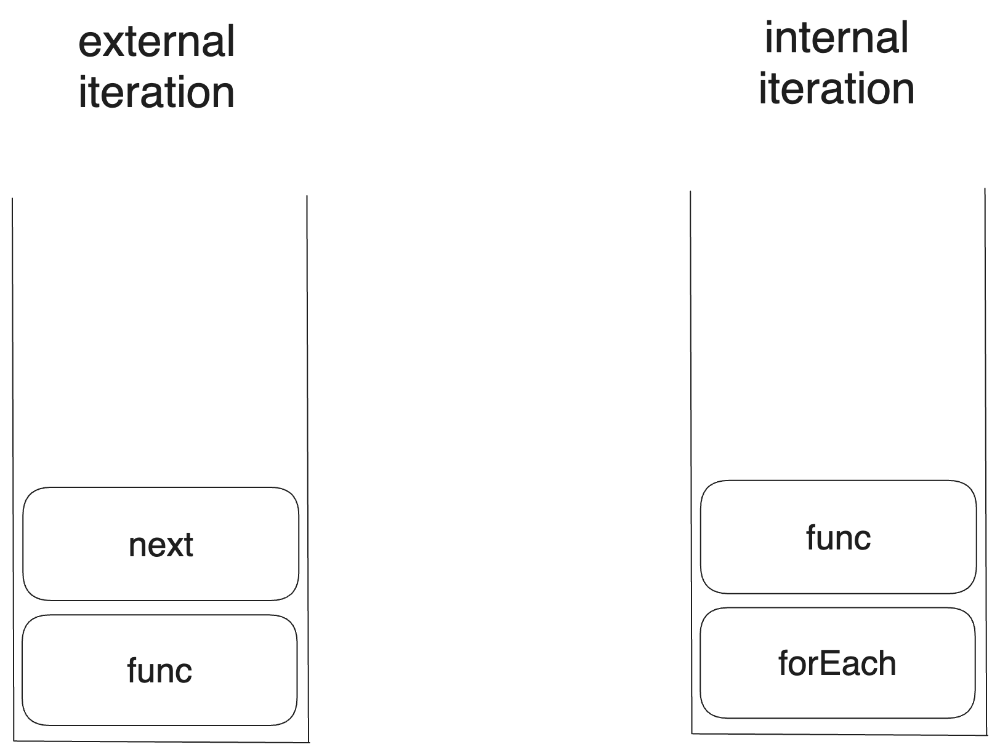

# 0. 개요

최근에 [What color is your function?을 읽고 글을 작성하였다. 비동기 프로그래밍과 콜스택 관리에 관한 글이었다.](https://witch.work/posts/misc/callstack-and-async)

그런데 같은 블로그에 반복과 동시성의 연관관계를 다룬 [Iteration Inside and Out](http://journal.stuffwithstuff.com/2013/01/13/iteration-inside-and-out/), [그리고 해당 글의 2번째 시리즈](http://journal.stuffwithstuff.com/2013/02/24/iteration-inside-and-out-part-2/)도 상당히 흥미로워 이를 읽고 하나의 글을 더 쓴다.

개인적으로 이 글들의 시사점은 비동기 프로그래밍이라는 이슈가 생각도 못한 부분까지 닿아 있다는 걸 알려주는 점이라 생각한다.

# 1. 시작

대부분의 개발자들은 어떤 것을 반복하는 문법이 프로그래밍 언어에서 아주 간단한 문제라고 생각할 것이다. 50년 전의 컴퓨터에서 작동하던 FORTRAN에서조차도 이러한 반복문이 이미 존재했을 정도니까 당연한 생각이다. 참고로 FORTRAN의 반복문은 다음과 같이 작동하였다.

```c
do i=1,10
  print i
end do
```

그럼 우리가 프로그래밍 언어, 예를 들어서 [새 프로그래밍 언어 Magpie(Iteration Inside and Out의 저자 Bob Nystrom이 만들고 있는 언어라고 한다)](http://magpie-lang.org/)를 만든다면 이렇게 하면 되지 않을까?

1. 다른 언어들의 반복문을 조사한다.
2. 그중 가장 좋아 보이는 것을 고른다.
3. 그것을 내 프로그래밍 언어에 추가한다.

문제는 이렇게 반복문을 만드는 것이 단순히 몇 번 같은 작업을 반복하거나 특정 숫자 범위만 왔다갔다하는 문제가 아니라는 것이다.

원초적인 질문으로 돌아가서, 반복(iteration)이란 대체 무엇인가? 우리는 다음과 같은 간단한 반복문을 생각할 수 있다.

```js
for (let i = 0; i < 10; i++) {
  console.log(i);
}
```

하지만 이런 반복도 있지 않은가? JS에서는 `for..of`와 같이 객체의 원소 전체를 반복하는 반복문도 있다. JS가 특별한 것도 아니고 Python이나 C++도 이런 기능을 지원한다.

```js
let fruits=["사과", "바나나", "포도"];

for(const fruit of fruits){
  console.log(fruit);
}
```

그럼 꼭 for문의 형태를 해야 하는가? JS의 `forEach`같은 건 어떤가? 객체의 원소 전체를 반복하며, 그 원소들에 대해 콜백 함수를 실행한다.

```js
let fruits=["사과", "바나나", "포도"];

fruits.forEach((fruit)=>console.log(fruit));
```

반복을 어떤 추상적인 시퀀스에 대하여 그것을 순회하는 것으로 생각한다면 트리 형태로 되어 있는 객체를 순회하는 것은 어떤가? 아니면 소수 전체를 순회하면서 어떤 조건을 만족하는 소수가 나올 때까지 연산하는 것은? 반복은 그렇게 간단한 문제가 아니다.

먼저 반복문에는 2가지의 다른 스타일인 internal iteration과 external iteration이 있는데 이것들부터 알아보자. 각각은 서로의 명확한 장단점이 있다.

# 2. External iteration : 함수가 객체를 호출한다

External iteration는 말 그대로 외부에서 반복자(iterator)를 제어하는 것이다. 객체에는 반복자가 있고, 다음 원소에 접근할 수 있는 방법이 있다. 그리고 외부에서는 그 반복자를 제어하면서 해당 반복자의 값에 어떤 조작을 가하는 것이다.

C++, Java, C#, Python, PHP등의 많은 OOP 언어에서 사용한다. for, foreach(`forEach`와 같은 메서드가 아니라 객체의 전체 원소를 순회하는 것을 일반적으로 칭한 단어이다) 문을 제공한다. JS라면 다음과 같을 것이다.

```js
for(let i=0;i<10;i++){
  console.log(i);
}

let fruits=["사과","바나나","포도"];
for (let i of fruits) {
  console.log(i);
}
```

위에서 `fruits` 배열을 순회하는 코드는 실제로는 잘 알려진 심볼 `[Symbol.iterator]()`메서드를 이용해 동작한다. 간단히 흉내내 보면 다음과 같다. 제너레이터를 사용할 수도 있고 이 또한 이후에 다루겠지만 지금의 핵심은 아니다.

```js
let fruits=["사과","바나나","포도"];
let iter=fruits[Symbol.iterator]();
let i;
while(i=iter.next()){
  if(i.done){break;}
  console.log(i.value)
}
```

핵심은 반복할 객체의 각 원소에 접근하기 위한 어떤 방법이 있고 그것이 외부로 노출되어 있다는 것이다.

이를 실제로 구현하는 반복자 프로토콜에 사용자가 접근할 일은 별로 없다. 위같이 `next()`를 사용해서 반복자를 직접 제어할 일이 많지는 않으니까. 하지만 일반적인 for문의 사용을 생각해 보아도 알 수 있다.

JS의 for문으로 예를 든다면 `for..of`문(어쨌거나 객체의 외부)에서 객체의 각 원소에 접근하고 for문의 루프 본문에서 해당 원소에 어떤 연산을 가하는 방식이다.

external iteration을 구현하기 위해서는 이러한 반복자(iterator)를 외부에서 접근할 수 있는 방법을 정의해야 하고 이를 반복자 프로토콜이라고 한다.

dart에서는 `.iterator()`, `moveNext()`, `.current`이고 Python에서는 `__iter__`와 `__next__`이며 JS에서는 `[Symbol.iterator]()`메서드의 generator 함수이다.

# 3. internal iteration : 객체가 함수를 호출한다

internal iteration은 반대다. 반복할 객체에 함수 객체를 전달하고 객체에서 알아서 반복을 진행하면서 반복되는 각 원소를 인자로 하여 함수를 호출하는 것이다.

external iteration에서는 값을 사용하는 쪽에서 반복되는 값에 가할 연산을 언제 실행할지 제어하는 반면 internal iteration에서는 값을 생성하는 쪽에서 콜백을 이용해서 값에 언제 연산을 가할지 제어한다.

```js
let fruits=["사과","바나나","포도"];
fruits.forEach((fruit)=>console.log(fruit));
```

Ruby, Smalltalk, 그리고 Lisp의 대부분이 이 방식을 사용한다. 물론 Python이나 JS와 같이 함수가 일급 객체로 취급되고 고차 함수가 많이 쓰이는 언어에서도 이 방식을 사용할 수 있다.

# 4. external vs internal

프로그램에서의 반복문을 2가지 부분으로 나눈다면 첫번째로 순회할 값들을 생성하는 부분, 그리고 그렇게 순회되는 값들에 어떤 조작을 가하는 부분 이렇게 두 부분이 있다고 할 수 있다.

external/internal iteration을 가르는 기준은 이 두 단계 중 어느 쪽이 반복의 핵심 제어권을 갖는지이다.

External iteration에서는 값들에 조작을 가하는 부분이 제어권을 갖는다. 반복자 프로토콜에서 순회할 값들을 생성하고, 언제 해당 값을 불러올지도 for문 본문에서 결정하여 for문의 본문에서 해당 값들에 조작을 가한다.

```js
for(let i of arr){
  foo(i);
}
```

반면 Internal iteration에서는 순회할 값들을 만드는 쪽에서 해당 값을 사용할 콜백 함수를 제어한다. 콜백을 언제 호출할지는 값을 순회하는 `forEach`에서 정한다.

```js
arr.forEach((i)=>foo(i));
```

## 4.1. 각각의 강점

각각의 반복 방식은 강점이 있다. 그리고 그 강점이란 반복문의 제어권을 가진 쪽의 기능이 클 때 처리하기 쉽다는 것이다.

external iteration의 경우 반복자를 세심하게 조작해야 하는 부분에서 강점이 있다. 예를 들어서 두 리스트를 번갈아가면서 반복해야 하는 경우는 어떤가? external iteration에서 그렇게 어렵지 않다.

참고로 여기 쓰인 이름은 이 글을 쓰는 시점에 디스코드에 접속해 있는 친구들의 이름에서 따왔다.

```js
let fruits = ["사과", "바나나", "포도", "딸기"];
let people = ["김성현", "김유진", "전지수", "안재현", "이진호"];

let fruit_iter = fruits[Symbol.iterator]();
let people_iter = people[Symbol.iterator]();

let fruit = fruit_iter.next();
let person = people_iter.next();

while (!fruit.done || !person.done) {
  if (!fruit.done) {
    console.log(fruit.value);
    fruit = fruit_iter.next();
  }

  if (!person.done) {
    console.log(person.value);
    person = people_iter.next();
  }
}
```

internal iteration에선 이런 반복자의 세심한 조작이 거의 불가능하다. 따라서 위와 같이 두 시퀀스의 반복자를 번갈아 반복하도록 한다든지 하는 건 쉽지 않다.

반면 internal iteration은 반복자에 접근하는 것(특히 `next()`메서드) 자체가 복잡한 연산일 때 강점을 지닌다. 예를 들어서 객체가 이진 트리일 때를 가정해 보자. 어떻게 트리를 순회할 것인가? 트리를 중위 순회하며 어떤 작업을 해줘야 한다면?

internal iteration에서는 쉽다. forEach에서 이를 구현하면 되기 때문이다. 에러 처리 등은 생략하였다.

```js
class Tree{
  // 이진 트리의 insert 메서드 등은 생략한다
  inorder(node, callback){
    if(node.left){
      this.inorder(node.left, callback);
    }
    callback(node);
    if(node.right){
      this.inorder(node.right, callback);
    }
  }

  forEach(callback){
    this.inorder(this.root, callback);
  }
}
```

하지만 external iteration에서 트리를 중위 순회하는 반복자의 순서를 명시적으로 정의해 주는 건 복잡한 일이 될 것이다. 스택을 사용해서 직접 순서를 하나하나 지시해 줘야 하니까.(제너레이터의 `yield*`를 쓰면 재귀적으로 구현할 수 있다는 걸 안다. 하지만 전통적인 이터레이터 프로토콜을 구현한다고 할 때의 이야기다)

기초적인 알고리즘이므로 아주 어려운 작업은 아니지만 그냥 재귀를 이용한 중위 순회를 하기만 하면 되는 internal iteration에 비해 복잡한 구조가 된다는 건 분명하다.

그리고 internal iteration의 약점은 또 있다. short circuit이 어렵다는 것이다. 

예를 들어서 리스트에서 어떤 아이템을 찾는 작업은 어떤가? external iteration에서는 아주 간단하다. 찾는 원소를 찾는 순간 return하거나 break하면 된다.

```js
for(let i of arr){
  if(i===target){
    return i;
  }
}

// 아니면

for(let i of arr){
  if(i===target){
    console.log("찾았다!");
    break;
  }
}
```

하지만 internal iteration에서는 어떤가? break 같은 게 없기 때문에 모든 원소에 대해서 다 콜백을 실행해야 한다. flag 같은 걸 만들어야 할 수도 있다.

```js
let found=false;
arr.forEach((i)=>{
  if(i===target){
    found=true;
  }
});
```

바깥에 있는 다른 블록에서 반환하게 하는 non-local return(Kotlin, Ruby 등의 언어에 있다)을 쓸 수 있다면 모르겠지만 많은 대중적인 언어들에서 그런 건 없기 때문에 이런 short circuit이 필요한 경우에는 일반적으로 external iteration이 더 강점을 지닌다.

```ruby
=begin
non-local return을 사용하여 리스트에서 어떤 원소를 찾을 때 short-circuit을 할 수 있도록 한 코드. Ruby로 작성되었다.
=end
def contains(arr, target)
  arr.each { |item| return true if item == target }
  false
end
```

## 4.2. 분석

그럼 왜 이런 차이가 발생하는가? 어째서 external iteration은 반복자를 얻은 후 조작하는 데에 강점이 있고 internal iteration은 반복자를 얻는 데에 강점이 있는가?

콜스택에 작업이 쌓이는 순서가 다르기 때문이다. 

external iteration에서는 반복자에 가할 연산이 먼저 콜스택에 쌓이고 그 다음에 반복자를 얻는다. 반면 internal iteration에서는 반복자를 얻는 것이 먼저 콜스택에 쌓이고 그 다음에 반복자에 가할 연산이 쌓인다.

무슨 의미인지 좀더 구체적으로 보기 위해 다음과 같이 두 스타일의 반복을 실행하는 코드를 보자.

```js
// external iteration
for(let i of arr){
  func(i);
}

// internal iteration
arr.forEach((i)=>func(i));
```

그럼 두 코드를 실행할 때 콜스택에 쌓이는 순서는 각각 다음과 같다.`next`는 for문에서 다음 반복자를 얻어 오는 동작을 의미한다. JS의 경우 실제 `Symbol.iterator`에 정의되어 있는 제너레이터 함수가 리턴하는 객체의 next메서드를 호출한다. 

하지만 다른 언어에서 external iteration을 구현하는 데 쓰이는 메서드를 생각해도 상관없다. C#의 `MoveNext`라거나.



문제는 콜스택에서 아래쪽에 있는 함수가 어떤 동작을 하기 위해서는 콜스택의 위쪽에 들어 있는 함수들이 모두 빠진 상태여야 한다는 것이다.

그리고 콜스택의 위쪽에 있는 함수에서는 아래쪽에 있는 함수의 동작을 제어하기가 일반적으로 힘들다. 따라서 콜스택에서 아래쪽에 있는 함수가 반복문에서 주도권을 갖는다.

왜 external iteration은 다음 원소를 얻는 것이 복잡할 때(더 엄밀하게 제한하면 단순히 복잡한 연산이 필요할 때라기보다는 다음 원소를 얻어내기 위해서 콜스택에서 어떤 재귀적으로 유지되고 있던 맥락이 필요할 때) 문제가 있는가? 위와 같은 콜스택 구조를 가지기 때문이다. 

반복문의 본문을 의미하는 `func`가 실행되기 위해서는 반복자를 얻는 `next`가 실행이 완료되어 콜스택에서 빠져야 한다. 이 말은 `next`가 콜스택에서 유지하고 있던 맥락이 모두 사라져야 한다는 뜻이다. 재귀적으로 구현한 inorder traversal이 제너레이터 없이 external iteration의 반복자에 쓰일 수 없는 이유다.

```js
/* 콜스택 구조를 구체적으로 작성함으로써 구현한 inorder traversal iterator 코드. 
실제로는 yield*를 써서 더 쉽게 구현할 수 있지만 구조를 보이기 위한 예시이다 */
function* inorder(root) {
  const stack = [];
  let currentNode = root;

  while (currentNode !== null || stack.length !== 0) {
    while (currentNode !== null) {
      stack.push(currentNode);
      currentNode = currentNode.left;
    }

    currentNode = stack.pop();
    yield currentNode.value;

    currentNode = currentNode.right;
  }
}
```

반면 internal iteration은 반대로 원소를 얻어오는 역할을 하는 `forEach`가 콜스택에서 상대적으로 아래쪽에 있다. 따라서 `func`가 각 원소에 대해서 실행되는 동안 콜스택 내부의 필요한 맥락을 유지할 수 있다. 재귀적인 연산으로 다음 원소를 얻어와도 되는 이유이다.

하지만 두 이터러블의 반복자를 섞는다거나 하는 것은 internal iteration에서는 불가능하다. 해당 동작은 `func`에서 이루어져야 하는데 이는 forEach보다 콜스택에서 위쪽에 있고 따라서 `forEach`에 해당하는 동작인 다음 원소를 얻어오는 작업을 제어할 수 없기 때문이다.

즉 콜스택에서 더 아래쪽에 놓이는 함수가 작업의 맥락을 가져갈 수 있게 된다. 위쪽에 있는 함수는 아래쪽에 있는 함수가 실행되기 전에 전부 종료되어서 콜스택에서 빠져야 하기 때문이다.

그럼 이게 최선일까?


# 참고

https://stackoverflow.com/questions/224648/external-iterator-vs-internal-iterator

https://witch.work/posts/dev/javascript-symbol-usage