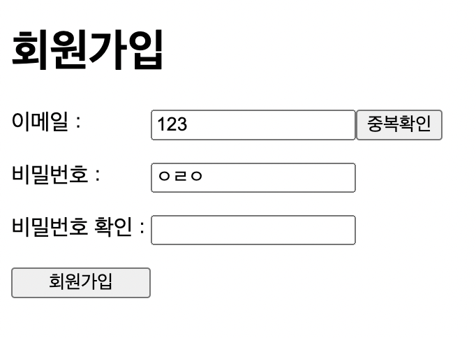

# 1. 문제의 발생

react로 회원가입 폼을 제작하는 중에 발생한 문제이다. 많은 회원가입 폼 내부에는 2개 이상의 버튼이 있다. 하나는 회원가입 폼을 모두 작성한 후 누르는 회원가입 완료 버튼이다. 이 버튼을 누를 시 사용자가 입력한 회원가입 정보들에 대한 유효성 검사를 한 후 회원가입 정보를 서버로 전송해 줘야 한다.

그리고 회원가입 폼에는 일반적으로 사용자가 사용하겠다고 입력한 아이디나 이메일이 기존 회원들의 것과 중복되지 않는지 확인해 주는 중복확인 버튼이 있다. 이외에도 약관 동의 버튼, 닉네임 중복확인 버튼 등 더 많은 버튼이 존재할 수 있다. 그러나 지금 하고 있는 작은 프로젝트에서는 이메일의 중복 확인, 그리고 회원가입 완료까지 2개의 버튼이 회원가입 폼에 존재했다.

그런데 아이디 중복 확인 버튼을 누르자 회원가입 폼이 제출되어 버리는 일이 발생했다. 또한 다른 칸에서 엔터를 눌러도 아이디 중복 확인 동작이 실행되고 폼이 제출되어 버렸다.

# 2. 구조 설명

실제 프로젝트 코드에서는 더 많은 정보를 입력받긴 했지만 프로젝트에서 사용한 회원가입 폼을 단순화시켜 보면 다음과 같은 구조였다.

```jsx
function SignUpForm() {
  return (
    <form
      className="signup-form"
      onSubmit={(e) => {
        e.preventDefault();
        alert("폼 제출됨");
      }}
    >
      <h1>회원가입</h1>
      <label className="signup-field" htmlFor="email-form">
        <div style={{ width: "100px" }}>이메일 :</div>
        <input name="email" />
        <button
          onClick={() => {
            alert("이메일 중복 확인 버튼 클릭");
          }}
        >
          중복확인
        </button>
      </label>
      <label className="signup-field" htmlFor="password-form">
        <div style={{ width: "100px" }}>비밀번호 :</div>
        <input name="password" />
      </label>
      <label className="signup-field" htmlFor="password-confirm-form">
        <div style={{ width: "100px" }}>비밀번호 확인 :</div>
        <input name="password-confirm" />
      </label>
      <button
        style={{ width: "100px" }}
        type="submit"
        onClick={() => {
          alert("회원가입 버튼 클릭");
        }}
      >
        회원가입
      </button>
    </form>
  );
}
```

이 결과물은 react에서 다음과 같은 회원가입 폼을 만들어낸다. 실제로 위의 컴포넌트를 작성해 보면 따로 Css 때문에 간격 등이 약간 다르게 보일 수는 있지만 내용물은 모두 같을 것이다.



# 3. 문제의 원인

로그를 찍어 보니 문제는 아이디 중복 확인 버튼이 회원가입 폼의 제출 버튼처럼 취급된다는 것이었다. 하지만 위의 코드에서 아이디 중복 확인 버튼의 type은 딱히 지정되어 있지 않았다...

찾아보니 HTML5부터는 form 태그의 기본 제출 버튼이 form의 DOM tree를 preorder로 순회했을 때 나오는 첫 submittable element(버튼 등등)으로 지정된다고 한다. 따라서 DOM 트리에서 가장 먼저 나오는 버튼인 아이디 중복 확인 버튼이 회원가입 폼 제출 버튼처럼 취급된 것이다.

# 4. 문제의 해결

아이디 중복 확인의 type이 명시적으로 지정되어 있으면 이 문제는 발생하지 않는다. 위의 코드에서는 아이디 중복 확인 버튼의 type이 딱히 없었기 때문에 중복확인 버튼이 자동으로 폼의 제출 버튼으로 취급되었다. 따라서 중복확인 버튼에 `type="button"` 속성을 추가해 주면 된다. 물론 인위적으로 특정 버튼이 DOM 트리의 최상위로 오도록 조정할 수도 있다.

```jsx
<button
  type="button"
  onClick={() => {
    alert("이메일 중복 확인 버튼 클릭");
  }}
>
  중복확인
</button>
```

# 참고

스택오버플로우 질문답변 https://stackoverflow.com/questions/925334/how-is-the-default-submit-button-on-an-html-form-determined

HTML 공식 문서의 해당 부분 https://html.spec.whatwg.org/multipage/forms.html#category-submit
