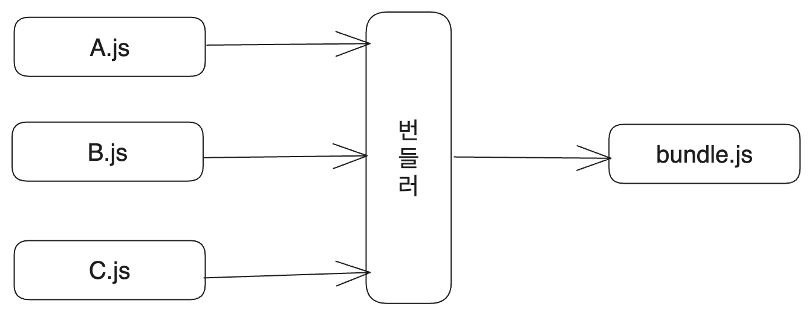

# 0. 시작

JS의 모듈에 관한 키워드인 import와 require의 차이는 유명한 프론트 면접 질문 중 하나다. 하지만 나는 이에 대해서 잘 알지 못했다. require가 commonJS에서 쓰이는 문법이고 import가 ES6부터 도입되었다는 정도?

그래서 이참에 예전에 들어 보기만 하고 묻어 두었던 관련 글들을 꺼내서 읽어보고 정리했다. 차근차근 깊이 들어가는 글이 되려고 노력하였다.

# 1. 기초적인 차이

먼저 각자의 문법과 기본적인 차이부터 조사하였다. require와 import는 모두 외부 모듈의 코드를 불러오는 작업을 수행하는 데에 쓰인다.

## 1.1. require

모듈을 불러올 때는 `require` 키워드만 사용하면 된다.

```javascript
const express = require('express');
```

모듈을 내보낼 때는 `exports`와 `module.exports` 2가지의 방법이 있다. 사용하는 방식은 다음과 같다.

1. 여러 객체를 내보낼 때는 exports의 속성으로 할당한다.
2. 하나의 객체를 내보낼 때는 module.exports에 할당한다.

```javascript
// 여러 객체를 내보낼 때

exports.a = 1;
exports.b = 2;
exports.c = 3;

// 하나의 객체를 내보낼 때
const obj = {
    a: 1,
    b: 2,
    c: 3
};

module.exports = obj;
```

모듈에서 내보내지는 데이터를 담고 있는 객체가 exports이기 때문에 이렇게 해주는 것이다.

불러올 때는 어떤 방식으로 모듈을 내보냈건 상관없이 `require`를 사용한다. 이렇게 해서 다른 파일의 exports 객체를 불러와 사용할 수 있다.

```javascript
const obj = require('./obj');

console.log(obj.a); // 1

// 각각 불러오기
const { a, b, c } = require('./obj');
```

### 1.1.1. exports와 module.exports

약간 의문이 생길 수 있는 지점이 있다. 왜 exports와 module.exports를 따로 쓰는 것일까? [exports는 module.exports의 shortcut이기 때문이다.](https://nodejs.org/api/modules.html#exports-shortcut)

`module.exports` 변수는 모듈에서 내보내기를 할 객체를 가리킨다. 그리고 편의성을 위해서 모듈 내부에서는 `exports`를 통해서도 `module.exports`에 접근할 수 있다.

따라서 `exports.attr=1`과 같이 내보낼 객체의 속성을 추가하는 것은 `module.exports.attr=1`과 같은 표현이다. 편의성을 위해 `exports`만 쓰는 것 뿐이다.

그런데 하나의 객체만 내보내고 싶을 때는 `module.exports`에 할당해야 한다. `exports`는 shortcut일 뿐이기 때문에 `exports=obj`와 같이 할당하게 되면 `module.exports`에도 똑같이 할당되는 것이 아니라 새로운 지역 변수 `exports`를 만들고 거기에 할당하게 되기 때문이다.

반면 `module.exports`에 할당하면 `exports`에도 같은 값이 들어간다. 모듈이 평가되기 전, `exports` 변수에는 모듈의 `module.exports` 변수의 값이 할당되기 때문이다.

nodejs에서는 `require`의 작동 방식을 간략화한 코드를 통해서 이를 설명하고 있다.

```javascript
function require(/* ... */) {
  /* 기본 모듈 객체 */
  const module = { exports: {} };
  /* 즉시 실행 함수 */
  ((module, exports) => {
    // someFunc은 모듈에서 내보내는 함수
    function someFunc() {}
    /* exports에 모듈 할당 */
    exports = someFunc;
    /* 이제 exports는 module.exports의 shortcut이 아니며 module에서 내보내는 객체는 여전히 모듈 시스템이 만든 기본 객체 */
    module.exports = someFunc;
    /* 이제 모듈은 someFunc을 내보낸다 */
  })(module, module.exports);
  return module.exports;
} 
```

참고로 `modules.exports`에 대한 할당은 콜백 함수 등으로 이루어지면 안 된다. 이벤트 기반이 아니라 즉각적으로 할당되어야 한다.

```javascript
/* 이렇게 하면 안 된다! */
setTimeout(() => {
  module.exports = { a: 1 };
}, 1000);
```

## 1.2. import

require 대신 ES6에서 새로 도입된 키워드인 import를 사용해서 모듈을 불러올 수 있다. 이때 다른 모듈에서 객체를 불러오는 방식은 내보내기를 한 방식에 따라 달라진다. 따라서 객체를 내보내는 방식부터 알아보자.

내보내는 방식은 named export와 default export가 있다. named export는 여러 객체를 내보낼 때 사용하고 default export는 하나의 객체만 내보낼 때 사용한다.

```javascript
// named export
export const a = 1;
export const b = 2;
export const c = 3;

// default export
const obj = {
    a: 1,
    b: 2,
    c: 3
};

export default obj;
```

그리고 가져올 때, named export는 `{}`를 사용하며 불러오며 내보낼 때 사용한 이름과 동일한 이름을 사용해야 한다. 식별자 충돌을 피하기 위해서 named export를 별칭으로 할 수도 있다.

```js
export { myFunction as function1, myVariable as variable };
```

반면 default export는 `{}`를 사용하지 않고 내보낼 때 사용한 이름과 다른 이름을 사용할 수 있다. 어떤 이름을 사용하든 언제나 default export된 객체만을 가져온다.

따라서 당연히 default export는 모듈당 딱 하나만 있어야 한다.

```javascript
/* named export 가져오기 */
import { a, b, c } from './obj';

/* named export를 별칭으로 가져오기 */
import { a as a1, b as b1, c as c1 } from './obj';

/* 모듈 전체 가져오기. named export된 것들을 *로 한번에 묶고 가져와서 as로 별칭을 줘서, default export된 객체처럼 사용 가능 */
import * as obj from './obj';

/* default export 가져오기 */
import obj from './obj';
```

변수 바인딩 없이 특정 모듈을 불러와서 실행만 하려 한다면 import만 사용하는 것이 낫다.

```javascript
import './obj.js';
```

이때 이렇게 가져와진 모듈은 여러 곳에서 사용되더라도 최초 호출 시 단 한 번만 실행된다. 그리고 실행된 모듈은 필요한 곳에 공유되기 때문에 어느 한 모듈에서 객체를 수정하면 다른 모듈에서도 변경사항을 확인할 수 있다.

## 1.3. dynamic import

이후에 자세히 설명하겠지만 commonJS의 require는 런타임에 모듈을 읽어 온다. 반면 import는 정적으로 모듈을 불러오기 때문에 import문이 파일의 최상단에 있어야 했고 따라서 동적으로 모듈을 사용할 수 없다는 문제가 있었다.

예를 들어서 함수 호출의 결과값을 경로로 사용하거나 조건부로 모듈을 불러올 수 없었다.

```javascript
// 불가능한 구문들
import { something } from getModuleName();

if (condition) {
    import { something } from './something';
}
```

이런 문제를 해결하기 위해 dynamic import가 도입되었다. 이를 사용하면 런타임에 모듈을 불러올 수 있다. `import(module)` 표현식은 모듈을 읽고, 모듈이 export하는 모든 것을 포함하는 promise를 반환한다.

```javascript
import(module).then((module) => {
    // 모듈 객체 사용
});

// async/await 사용(당연히 async 함수 안에서만 사용 가능)
const module = await import(module);
/* default export된 객체를 사용하려면 module.default를 사용 */
console.log(module.default);
```

단 이는 함수 호출과는 다른 특수한 문법이기 때문에 import를 변수에 복사하거나 call/apply를 쓰는 것이 불가능하다. 그리고 이는 일반 스크립트에서도 동작한다. script 태그에 type="module"을 추가하지 않아도 된다.

## 1.4. 브라우저에서 모듈 사용하기

브라우저에서는 import를 사용하기 위해서는 script 태그에 `type="module"`을 추가해야 한다. 그렇지 않으면 import를 사용할 수 없다. 모듈은 특수한 키워드 등을 통해서 사용되기 때문이다.

```html
<script type="module" src="main.js"></script>
```

이렇게 선언한 모듈은 각 파일의 독립적인 스코프를 가지기 때문에 모듈 내부에서 정의한 변수나 함수는 `import`없이 다른 스크립트에서 접근할 수 없다. 예를 들어 다음과 같이 쓴다고 하자.

```html
<script type="module" src="A.js"></script>
<script type="module" src="B.js"></script>
```

`A.js`와 `B.js`는 같은 HTML 파일에 있는 모듈이지만 서로의 스코프에 접근할 수 없다.

그리고 이렇게 선언된 스크립트는 언제나 지연 실행된다. 모듈이 언제 로딩이 완료되건 간에 HTML 문서가 완전히 준비되고 나서야 실행되는 것이다.

만약 HTML 문서가 처리되길 기다리지 않고 모듈이 바로 실행되길 원한다면 `async` 속성을 태그에 추가하면 된다.

```html
<script type="module" src="main.js" async></script>
```

# 2. 역사

이제 좀 깊이 들어가 보자.

내가 개발을 제대로 시작한 것은 2021년이었고 그때는 이미 ES6가 메이저였다. 그래서 `import`를 쓰려고 하는 것이 당연했고 nodeJS를 쓸 때도 package.json에 `"type":"module"`을 추가해서 import를 사용하는 것이 당연한 줄 알았다. 모두가 그게 새로운 흐름이라며 이제 시작하는 사람이라면 import를 써 야마땅하다고 했으니까.

하지만 2023년 현재도 commonJS의 모듈 문법은 아직도 많이 쓰이고 있다. 2023년 7월 30일 지금도 nodeJS의 공식 문서에서는 require를 사용하고 있고 package.json의 기본값도 `"type":"commonjs"`이다. 그리고 많은 npm 패키지들도 commonJS를 사용하거나 최소한 지원하고 있다. pure ESM 패키지는 여전히 지분이 그렇게 크지 않다.

```js
/* nodeJS 공식 문서의 코드. commonJS를 사용하는 것을 볼 수 있다 */
const http = require('http');

const hostname = '127.0.0.1';
const port = 3000;

const server = http.createServer((req, res) => {
  res.statusCode = 200;
  res.setHeader('Content-Type', 'text/plain');
  res.end('Hello World');
});

server.listen(port, hostname, () => {
  console.log(`Server running at http://${hostname}:${port}/`);
});
```

그럼 이 commonJS라는 건 왜 생겨났으며 지금도 존재하는가? import를 사용하는 ES 모듈이 새로운 흐름이며 더 좋은 방식이라면 왜 commonJS는 역사 속으로 사라지지 않았으며 오히려 아직도 생태계를 지배하고 있는가? 수많은 기법과 패턴과 라이브러리들이 역사 속으로 사라졌는데 왜 이 commonJS는 아직도 살아남아 있는가?

## 2.1. JS 모듈이 없었을 때의 이야기

코드를 작성할 때 여러 파일에 나누어서 모듈화를 하는 일은 흔하다. 이렇게 모듈화를 하면 코드의 재사용이 가능해지고, 코드들이 분리되어서 관리와 협업을 하기 쉬워진다. 그리고 코드의 구조화가 용이해진다.

하지만 오래전 브라우저에서만 쓰였던 JS에서는 이런 모듈 시스템을 지원하지 않았다. npm 같은 건 물론 없었다. 개발자는 외부 라이브러리를 직접 다운로드해서 프로젝트의 정적 파일들을 위한 폴더에 옮겨둔 후 HTML의 `<script>`태그를 통해 불러와야 했다.

사실 JS가 만들어진지 얼마 안 되었을 때는 모듈 시스템뿐 아니라 지금 있는 기능들의 절반도 없었다. 

그런 언어였기에 장난감 같은 언어로 취급받았고 그랬기 때문에 많은 기능이 필요할 만큼의 스크립트를 JS로 작성하지 않았다. JS로 작성되는 스크립트의 크기가 대부분 그렇게 크지 않았기 때문에 모듈 시스템이 없이도 그럭저럭 성장할 수 있었다. 

그럼 당시에 다른 파일에 있는 객체에 접근하기 위해서는 어떻게 했을까? 전역 window 객체를 사용했다. 당시에는 ES6가 나오기 전이라 var 키워드만 존재했고 JS는 브라우저에서만 실행되는 언어였기 때문에 전역에 선언한 모든 객체가 window 객체를 통해 접근할 수 있었기에 이런 방식이 가능했다.

```js
// A.js
var myName="김성현";
var myAge=26;
var fruits=["사과","바나나","포도"];

var functionA=function(){
  console.log("제 이름은 " + myName + "입니다.");
  console.log("나이는 " + myAge + "살입니다.");
  console.log("좋아하는 과일은 " + fruits[0] + "입니다.");
}
```

```js
// B.js
console.log(window.myName);
console.log(window.myAge);
console.log(window.fruits);

window.functionA();
```

그리고 다음과 같이 `index.html`의 `<script>` 태그에 모든 파일을 포함하고 브라우저에서 실행시켜야 했다. 

```html
<script src="./A.js"></script>
<script src="./B.js"></script>
```

이런 방식은 대부분의 코드가 결국 같은 스코프에 있기 때문에 충돌의 위험이 너무 컸다. 또한 재사용성도 떨어졌으며 변수의 순서를 고려해서 script 태그 순서를 잘 설계해야 했다. 위 HTML 파일에서도 `B.js`를 먼저 불러오면 에러가 발생한다.

IIFE(즉시 실행 함수)를 이용해서 이런 문제를 좀 개선할 수 있었다. 클로저를 이용해서 private 멤버를 만들던 패턴을 사용하는 것이다. 예를 들어서 `A.js`를 다음과 같이 바꾸면 외부에서 `myName`이나 `myAge`에 접근할 수 없다.

```js
var A=(function(){
  var myName="김성현";
  var myAge=26;
  var fruits=["사과","바나나","포도"];

  return {
    functionA:function(){
      console.log("제 이름은 " + myName + "입니다.");
      console.log("나이는 " + myAge + "살입니다.");
      console.log("좋아하는 과일은 " + fruits[0] + "입니다.");
    }
  }
})();
```

이제 개발자가 노출시키고 싶은 `functionA`만 전역 객체 window를 통해서 접근할 수 있게 되었다.

이런 방식을 사용하여 전역 객체 window에 들어 있는 전역 변수들을 많이 줄일 수 있었고 충돌 위험도 줄일 수 있었다. 하지만 여전히 `index.html`의 script 태그에 모든 파일을 포함시켜야 했다. 또한 불편함을 좀 줄였을 뿐 모듈 시스템이 없다는 근본적인 문제가 해결된 것은 아니었다.

## 2.2. commonJS의 등장

시간이 지나면서 JS로 작성되는 스크립트의 크기는 점점 커졌고 모듈화의 필요성도 덩달아 커졌다.

그리고 브라우저 외의 다른 환경에서 JS를 사용하려는 시도도 많아졌던 것도 모듈화의 필요성을 키웠다. [당시 브라우저에서 요구되는 것보다 서버단에서 JS를 사용하려고 할 때 모듈화의 필요성이 더 컸기 때문이다. commonJS의 이름까지도 원래는 serverJS였다!](https://www.blueskyonmars.com/2009/01/29/what-server-side-javascript-needs/)

이런 상황을 해결하기 위해 다양한 라이브러리가 등장했고 commonJS도 그 중 하나였다. 비슷한 목적의 다른 라이브러리로 AMD(Asynchronous Module Definition) 등이 있었다.

아무튼 commonJS는 각 파일에 module객체를 만들고 module.exports에 내보낼 객체를 할당하면 다른 파일에서 require를 통해서 불러오는 방식으로 모듈 시스템을 구현했다.

```js
// 객체 하나 내보내기
module.exports={
  name:"김성현",
  age:26
}

// 객체 가져오기
const obj=require("./obj");
```

NodeJS도 이런 commonJS 기반의 모듈화 시스템을 통해서 만들어졌다.

## 2.3. 문제점

물론 문제점들이 있었다. 먼저 require의 모듈 로딩은 동기적으로 작동하여 성능 문제가 있었다.

서버사이드에서는 모든 파일이 로컬 디스크에 있어서 필요할 때 바로 불러올 수 있어서 그나마 괜찮았지만 브라우저에서는 필요한 모듈을 모듈 파일이 있는 어딘가에서 모두 내려받을 때까지 아무것도 할 수 없었던 것이다!

여담이지만 commonJS는 서버 모듈을 비동기적으로 클라이언트에 전송할 수 있는 모듈 전송 포맷을 추가적으로 정의하여 서버사이드 모듈을 비동기적으로 불러올 수 있게 하기는 했다. [이 포맷은 commonJS 위키에서 더 자세히 볼 수 있다.](https://wiki.commonjs.org/wiki/Modules/Transport)

또한 require의 작동 방식 상, 사용되지 않는 모듈을 제거하여 번들 사이즈를 줄이는 트리쉐이킹을 할 수 없었다. 그리고 브라우저에서 사용하는 것도 어려웠다. NodeJS는 commonJS를 받아들였기 때문에 이를 기본적으로 사용할 수 있었으나 브라우저에서는 아니었다.

따라서 웹팩과 같은 모듈 번들러를 사용해서 모듈 파일들을 하나로 만든 후 하나의 큰 IIFE를 이용해서 모듈을 묶어주는 방식으로 commonJS를 사용할 수 있었다. 번들링 시스템의 등장이 commonJS를 더욱 많이 사용되게 만들기도 했다.



이런 문제를 개선하기 위해, 그리고 JS 진영에서도 이러한 모듈 시스템을 위한 움직임들을 무시할 수 없었기 때문에 ES6에서 ES Module이 도입되게 된다. 다시 돌아가서, commonJS와 ES Module의 차이를 더 깊게 알아보자.

# 3. commonJS vs ESM

골자는 [CommonJS와 ES 모듈이 함께 갈 수 없는 이유](https://redfin.engineering/node-modules-at-war-why-commonjs-and-es-modules-cant-get-along-9617135eeca1)글을 보고 작성하였다.

## 3.1. 차이 - 기본

위에 작성한 내용을 토대로 문법적인 차이만 알아보면 다음과 같다.

1. require는 commonJS에서 사용하는 문법이고 import는 ES6에서 사용하는 문법이다.
2. require는 파일의 어느 부분에나 사용할 수 있지만 import는 파일의 최상단에만 사용할 수 있다.(dynamic import는 제외)
3. 하나의 파일에서 import와 require를 동시에 사용할 수 없다.

그리고 일반 스크립트에서의 this가 전역 객체인 것과 달리 모듈에서의 최상위 레벨 this는 `undefined`이다.

```html
<script>
  alert(this); // 브라우저 환경이라면 window
</script>

<script type="module">
  alert(this); // undefined
</script>
```

내부 구현으로 들어가면 더 많은 차이가 발생한다.

## 3.2. 차이 - 모듈 로드 방식

### 3.2.1. commonJS

commonJS의 `require()`는 동기적으로 작동한다. 이는 Promise를 리턴하거나 콜백을 호출하지 않고 파일을 읽고 즉시 스크립트를 실행한다. 따라서 스크립트의 입출력이나 다른 사이드 이펙트를 실행하고 `module.exports`에 설정되어 있는 값을 리턴한다.

### 3.2.2. ESM

반면 ESM은 비동기 환경에서 모듈을 로드한다. import된 스크립트를 바로 실행하지 않고 import나 export 호출을 찾기 위해서 스크립트를 파싱한다. 이런 이유로 ESM에서는 종속성이 있는 코드를 실행하지 않고도 named import의 오타를 감지해서 에러를 발생시킬 수 있다.

그리고 나서 ESM 모듈 로더는 import된 스크립트를 비동기로 다운로드해 파싱하고 또한 해당 스크립트가 import한 스크립트들도 파싱한다. 이런 과정을 더 이상 import할 스크립트가 없을 때까지 반복한다. 그러면서 모듈의 의존성 그래프를 만들어 나간다.

이 과정이 끝나고 나서야 스크립트는 모듈의 의존성 그래프에 따라 실행된다. 또한 모듈 그래프에서의 형제 스크립트는 병렬적으로 다운로드되고 loader 스펙에 따라서 순서대로 실행된다.

## 3.3. 호환성

ESM과 CJS는 그 작동 방식 때문에 서로 호출하는 게 쉽지 않다. 다음과 같은 문제들이 있다.

- CJS에서 ESM 파일을 require로 불러오는 건 불가능하다.

CJS는 ESM 파일을 `require`로 불러올 수 없다. 이유는 ESM은 top level await을 지원하지만 cjs에서는 불가능하기 때문이다. [또한 V8 블로그 글에 의하면 commonJS에서 top level await을 지원할 계획도 없다고 한다.](https://v8.dev/features/top-level-await)

물론 top level await 때문에만 `require(ESM file)`이 불가능한 것은 아니다. 동기적으로 동작하는 require로 불러온 ESM 파일에서는 비동기로 파일을 불러올 수 있는데 이렇게 불러온 CJS 파일은 또 동기적으로 파일을 불러올 수 있는 등의 상황에서 순서가 꼬일 수 있는 문제 등이 더 있다.

[이 깃헙 이슈에 require(ESM)에 대한 더 많은 논의가 있다. 그러나 당분간 ESM 파일을 require로 불러오는 건 힘들어 보인다.](https://github.com/nodejs/modules/issues/454)

물론 top-level await을 사용하는 ESM 모듈이 얼마나 있다고, 이렇게 완전히 불가능하게 만드는 것은 이상해 보일 수도 있다. 하지만 어떤 문법이 쓰이지 않을 것을 가정하고 무언가를 사용해야 한다는 것은 좋지 않다는 면에서 이런 결정을 나쁘다고만 하기는 힘들 것 같다.

- CJS에서 dynamic import로 ESM 파일을 불러오는 건 가능하긴 하지만 좋지 않다.

CJS 파일에서 ESM 파일을 동적 import하는 건 가능하다. 즉시 실행 함수를 사용하면 된다.

```js
(async () => {
  const { default: module } = await import('./module.mjs');
})();
```

이는 별로 권장되는 방식은 아니다. 특히 위와 같은 IIFE의 결과를 export해야 할 때 문제다. 이렇게 하면 모듈을 Promise로 내보내게 되는 것인데 이는 동기함수 내부에서 비동기 동작을 하기 힘들다는 점에서 모듈을 사용하기가 불편해지기 때문이다.

- ESM은 CJS 스크립트의 named exports를 제대로 import할 수 없다.

CJS 스크립트는 실행되면서 named exports를 연산하지만 ESM의 named exports의 경우 스크립트를 파싱하는 단계에서 named exports를 연산하기 때문이다.

이는 가능하다. CJS 스크립트 전체를 불러오기 때문이다.

```js
import _ from './lodash.cjs';
```

하지만 다음과 같이 하면 import가 파싱하는 시점에 CJS 스크립트의 named exports를 알 수 없기 때문에 에러가 발생한다.

```js
import { debounce } from './lodash.cjs';
```

다음과 같이 구조 분해 할당을 통해 우회할 수 있지만 트리쉐이킹이 되지 않으므로 번들 사이즈가 커지는 걸 피할 수 없다.

```js
import _ from './lodash.cjs';
const { debounce } = _;
```

이런 방식으로 ESM 래퍼를 지원하는 라이브러리들도 있다. 하지만 이런 방식은 import 순서를 보장하지는 않기 때문에 문제가 될 수 있다.

만약 A 라이브러리와 B 라이브러리가 둘 다 CJS 라이브러리이며 위와 같은 우회 방식으로 ESM 래퍼를 지원한다고 하자. 그래서 다음과 같이 import하였다.

```js
import {A1} from 'A';
import {B1} from 'B';
```

하지만 이렇게 하면 비동기로 작동하는 import의 특성상 A1과 B1이 평가되는 순서는 보장되지 않는다. 따라서 B1이 A1에 뭔가 의존하는 경우에는 문제가 발생할 수 있다.

- ESM에서 require를 사용할 수는 있다. 하지만 큰 의미는 없다.

require는 원래 ESM 스크립트의 문법이 아니지만 [사용하는 게 어렵지는 않다.](https://nodejs.org/api/modules.html#modules_module_createrequire_filename) 다음과 같이 작성하면 된다.

```js
import { createRequire } from 'module';
const require = createRequire(import.meta.url);

const {foo} = require('./foo.cjs'); 
```

하지만 이렇게 하는 건 딱히 의미가 없다. 어차피 이렇게 require를 사용해도 트리쉐이킹이 안 되는 건 마찬가지이기 때문에 그냥 위에서 사용한 우회방식을 사용하는 게 낫다.

```js
import cjsModule from './foo.cjs';
const {foo} = cjsModule;
```

그리고 `createRequire`를 쓸데없이 불러오는 것도 번들 사이즈를 키우는 원인이 된다. 네이티브하게 `require`를 사용할 수 있는 것도 아닌데, 그냥 위의 우회 방식을 쓰자.

## 3.4. 호환성으로 인한 문제예시

[카카오스타일 기술 블로그에도 이런 호환성으로 인해 발생한 문제에 관한 글이 있었다.](https://devblog.kakaostyle.com/ko/2022-04-09-1-esm-problem/)

해당 글에서 다루는 이슈를 간단히 요약하면 다음과 같다.

commonJS로 프로젝트를 진행하고 있었는데, commonJS 프로젝트의 ts에서 import를 사용하면 사실 require로 내부적으로 변환된다. 그런데 프로젝트에서 사용하던 `chalk`라는 라이브러리가 pure ESM으로 변했다.

따라서 기존의 commonJS 프로젝트에서는 require로 ESM 라이브러리를 불러오는 꼴이 되었고 위에서 다루었던 `CJS에서 ESM 파일을 require로 불러오는 건 불가능하다.`는 문제가 발생했다.

따라서 전체 프로젝트를 ESM으로 전환하거나, 위에서 본 것처럼 권장되지는 않지만 dynamic import를 사용하거나 `.mjs` 확장자를 사용한다는 선택지가 있었다.

하지만 ts에서는 import를 require로 변환하거나 ESM 프로젝트로 전환해야 했다고 한다. 만약 import를 require로 변환하면 ESM 모듈을 쓸 수가 없고 ESM 프로젝트로 전환하려고 하니 프로젝트 내에 require에 의존하는 곳이 있어 프로젝트 전환은 어려웠다고 한다.

따라서 ts가 변환하지 않도록 `new Function`이나 `eval`로 회피하거나, tsimportlib이라는 라이브러리를 사용할 수 있었다고 한다.

# 4. 패키지 지원

그러면 패키지 제작자 측에서는 어떤 선택지가 있을까? 위의 [ESM 삽질기](https://devblog.kakaostyle.com/ko/2022-04-09-1-esm-problem/)의 경우 `chalk` 패키지가 pure ESM으로 변했기 때문에 문제가 발생했다. 

## 4.1. ESM만 지원

ESM이 미래의 흐름이고 더 좋은 방식이라고 생각하는 패키지 제작자는 ESM만 지원하는 패키지를 만들 수 있다. 

이렇게 했을 때의 문제는 ESM만 지원하는 패키지는 CJS 사용자들에게 매우 큰 불편을 초래할 수 있다는 것이다. CJS 유저들은 `require`를 사용하는 대신 `await import`로 동적 임포트를 사용해서 pure ESM 패키지를 불러와야 한다.

또한 만약 CJS 패키지를 이미 출시한 상태라면 이를 pure ESM 패키지로 바꾸는 건 하위 호환성을 깨뜨리는 것이기 때문에 더욱 문제가 될 수 있다. [이로 인한 삽질기가 위에도 있었다.](https://devblog.kakaostyle.com/ko/2022-04-09-1-esm-problem/)

CJS 패키지의 ESM 래퍼를 만드는 건 쉽지만 반대는 어렵다.

## 4.2. CJS만 지원하기

TS로 라이브러리를 작성하고 트랜스파일한다면, CJS와 ESM 둘 중 어느 쪽으로든 변환할 수 있다. 따라서 이 둘을 모두 제공할 거라고 생각할 수 있다. 하지만 이는 좋은 방법이 아니다.

사용자는 실수로 패키지를 import로 불러오고, 또 다른 곳에서는 require로 불러올 수 있다. 이 경우 Node의 모듈 중복 제거가 제대로 작동하지 않을 것이다. Node는 패키지의 CJS파일과 ESM 파일이 같은 내용이라는 것을 알 수 없기 때문이다. 따라서 패키지 모듈 코드는 2번 작동할 것이고 2개의 인스턴스가 생성될 것이다. 이는 여러 버그를 생성할 수 있다.

따라서 만약 CJS를 지원할 거라면 CJS만 지원하자. 위에서 보았듯 CJS 패키지를 ESM으로 사용하는 건 쉽지만 반대는 정말 어렵기 때문이다. 

```js
/* CJS 라이브러리를 ESM으로 사용하기
트리쉐이킹은 안되지만 어쨌든 복잡한 방식은 아니다 */
import _ from './lodash.cjs';
const { debounce } = _;
```

pure ESM 때문에 피를 본 글들만 웹에 셀 수도 없이 많다는 걸 기억하자. 그냥 CJS로 패키지를 만들고, ESM 방식으로 쓸 수 있는지만 테스트하자. import로 불러와 보는 것이다.

또한 CJS로 작성된 패키지라도 필요하다면 간단한 ESM 래퍼를 제공하는 것도 가능하다.

```js
import someModule from './index.cjs';
export const foo = someModule.foo;
```

## 4.3. 둘 다 지원 시도

[CJS와 ESM은 호환되기 힘든 시스템이긴 하지만 어쨌든 패키지에서 둘 다 지원하려는 시도는 많다. 토스 기술블로그의 글을 보고 적는다.](https://toss.tech/article/commonjs-esm-exports-field) 

### 4.3.1. 이유

사실 CJS만 지원해도 간단한 래핑을 통한 ESM 지원은 쉽지만 이렇게 굳이 둘을 모두 지원하려고 하는 건각각의 장점이 있기 때문이다. 

JS는 이제 서버와 클라이언트 양쪽에서 모두 사용되는 언어인데, NodeJS에서는 CJS를 사용하는 일이 많다. 하지만 브라우저 환경에서는 ESM을 쓰는 게 일반적이고 또한 JS 번들의 사이즈를 줄여서 브라우저에서의 성능을 향상시키는 데 도움을 주는 트리쉐이킹을 하는 것도 거의 ESM에서만 가능하다.

CJS는 require를 동적으로 하는 것에 아무 제약이 없기 때문에 빌드 타임에 정적 분석을 적용하여 트리쉐이킹을 하는 게 어렵기 때문이다. 

반면 ESM은 위에서 살펴보았듯이 dynamic import를 사용하지 않는 한 정적인 구조로 모듈을 불러오기 때문에 정적 분석을 통한 트리쉐이킹이 가능하다.

이런 각각의 꽤 명확한 장단점이 있기 때문에 둘 다 지원하는 라이브러리를 만드는 것은 꽤 이점이 있는 일이다.

### 4.3.2. 구분

그런데 모듈 파일은 그냥 `.js` 혹은 `.ts`파일인데 어떻게 CJS 라이브러리인지 ESM 라이브러리인지를 구분할 수 있을까?

`package.json`의 `type` 필드를 통해서 구분할 수 있다. `type`필드의 기본값은 `commonjs`인데 이때 `.js`나 `.ts`파일은 CJS로 해석되고 `module`이면 ESM으로 해석된다.

이런 구분을 강제하기 위한 파일 형식도 있다. `.cjs`나 `.cts`는 항상 CJS로, `.mjs`, `.mts`는 항상 ESM으로 해석된다.

### 4.3.3. 지원방법

핵심은 `package.json`의 `exports`필드이다. 이를 사용하면 명시된 path 외에서는 모듈을 불러올 수 없게 되고, 실제 파일 시스템 상의 위치와 import 경로를 다르게 지정할 수 있다.

```json
{
  "exports": {
    ".": "./index.js",
    /* 이렇게 하면 require("/foo")를 불러왔을 때
    ./foo.js가 아니라 ./module/foo.js를 불러오게 된다 */
    "./foo": "./module/foo.js",
    "./bar": "./module/bar.js"
  }
}
```

**그리고 같은 import path에 대하여 특정 조건에 따라 다른 모듈을 제공할 수 있다!**

```json
{
  "exports": {
    ".": {
      "require": "./cjs/index.cjs",
      "import": "./esm/index.mjs"
    }
  }
}
```

주의할 점은 `exports`필드의 모든 경로가 상대경로로 작성되어야 한다는 것이다. 그리고 패키지가 어떤 모듈 시스템을 따르는지에 따라 맞는 확장자를 사용해야 한다.

`package.json`의 type 필드가 commonjs라면 `.js`파일은 알아서 CJS로 읽을 것이므로 ESM 패키지 경로에만 `.mjs`를 사용해 준다. 반면 `"type":"module"`이라면 CJS 패키지 경로에 `.cjs`를 사용해 줘야 한다.

```js
/* for CJS package */
{
  "exports": {
    ".": {
      "require": "./cjs/index.js",
      "import": "./esm/index.mjs"
    }
  }
}

/* for ESM package */
{
  "exports": {
    ".": {
      "require": "./cjs/index.cjs",
      "import": "./esm/index.js"
    }
  }
}
```

만약 모두 `.js`로만 작성한다면 ESM 모듈을 cjs 로더로 읽는 등의 오류가 발생할 수 있다.

### 4.3.4. for typescript

기존의 typescript 환경에서 모듈을 불러올 시에는 파일 시스템에서 패키지 타입 정의를 찾았다.

```ts
// module.d.ts를 탐색
import module from 'module';
```

하지만 이제는 `package.json`의 exports 필드에서 타입 정의를 탐색한다. 아무튼 이렇게 하면 `package.json`의 exports 필드에 타입 정의를 추가해 줄 수 있다. 이 또한 CJS와 ESM을 구분해 줘야 할 수 있다.

```json
{
  "exports": {
    ".": {
      "require": {
        "default": "./cjs/index.cjs",
        "types": "./cjs/index.d.ts"
      },
      "import": {
        "default": "./esm/index.mjs",
        "types": "./esm/index.d.ts"
      }
    }
  }
}
```

단 실제 토스의 라이브러리들을 보면 보통 다음과 같이 exports가 쓰여 있다.([토스의 @toss/hangul 라이브러리의 package.json](https://github.com/toss/slash/blob/main/packages/common/hangul/package.json)의 `publishConfig`필드 참고)

```json
/* https://github.com/toss/slash/blob/main/packages/common/hangul/package.json */
"exports": {
  ".": {
    "require": "./dist/index.js",
    "import": "./esm/index.mjs",
    "types": "./dist/index.d.ts"
  },
  "./package.json": "./package.json"
},
```

이는 토스의 라이브러리가 CJS로 제공되기 때문이다. `index.d.ts`가 CJS로 제공되면 ESM에서도 불러올 수 있기 때문에 위와 같이 CJS와 ESM에 대한 타입 파일을 따로 제공해 주지 않아도 된다.


# 5. 남은 이야기들

## 5.1. commonJS를 위한 변론


commonJS는 아직까지도 끈질기게 남아서 쓰이고 있다. 커다란 이유 중 하나는 [bun의 블로그 글에서 잘 요약하고 있다.](https://bun.sh/blog/commonjs-is-not-going-away)

> npm의 수많은 모듈이 commonJS로 쓰여 있다. 그리고 그들 중 다수가 다음 2가지 조건을 만족한다. 첫째로 더 이상 활발하게 유지보수되지 않는다는 것, 둘째로 기존 프로젝트들에서 대단히 중요하게 쓰이고 있다는 점이다. 모든 패키지가 ESM을 사용하는 날은 절대로 오지 않을 것이다. 따라서 commonJS를 지원하지 않는 런타임이나 프레임워크는 뭔가 크게 놓치고 있는 것이다.

위의 이유는 차세대 JS 런타임이라고 홍보하는 bun에서 commonJS 지원에 많은 노력을 기울이는 이유이기도 하다.

그런데 commonJS가 더 좋은 점은 정녕 없는 걸까? 있다.

첫째로 패키지를 함수 내부에서 레이지 로딩하고 싶을 때 ESM의 경우 dynamic import를 사용해야 하고, 따라서 await을 쓰게 되고 해당 함수가 Promise를 리턴하게 된다. 이는 편의성에 단점을 가져온다.

```js
// dynamic import

// for ESM
async function func(){
  const {someModule} = await import('some-module');
}

// for CJS
function func(){
  const {someModule} = require('some-module');
}
```

require를 쓰게 되면 require된 파일은 실행되고 해당 파일의 `exports`객체 프로퍼티들은 require를 실행한 파일에서 사용 가능하게 된다. 이는 require가 blocking이라고 할 수도 있는 이유가 되며 이런 동기적 작동은 앞에서 보았듯이 [문제점이 되기도 한다.](https://witch.work/posts/misc/import-and-require#2.3.-%EB%AC%B8%EC%A0%9C%EC%A0%90)

반면 ESM은 시작할 때 모든 모듈 의존성 그래프를 생성하고 나서야 코드를 평가하기 때문에 commonJS에 비해 느리게 시작된다.


## 5.2. `__filename`

NodeJS 환경에서 `type:"module"`을 지정하여 ESM으로 사용하다 보면 `__filename`과 `__dirname` 변수를 바로 사용할 수 없다. 그렇게 하려고 하면 `ReferenceError: __filename is not defined` 에러가 발생한다.

다음과 같이 직접 정의해 주어야 한다.

```js
import path from 'path';
import { fileURLToPath } from 'url';
const __filename = fileURLToPath(import.meta.url);
const __dirname = path.dirname(__filename);

console.log(__dirname);
```

그럼 왜 그럴까? commonJS로 모듈을 불러올 때 [Nodejs에서는 다음과 같은 모듈 래퍼로 모듈 코드를 감싸기 때문이다.](https://nodejs.org/api/modules.html#the-module-wrapper)

```js
(function(exports, require, module, __filename, __dirname) {
// Module code actually lives in here
}); 
```

따라서 commonJS 모듈은 위와 같은 모듈 래퍼로 감싸져 있기 때문에 `__filename`과 `__dirname`을 바로 사용할 수 있다. 하지만 ESM에서는 위와 같은 동작을 하지 않기 때문에 해당 변수들을 바로 사용할 수 없다.


# 참고

require와 import의 차이
https://inpa.tistory.com/entry/NODE-%F0%9F%93%9A-require-%E2%9A%94%EF%B8%8F-import-CommonJs%EC%99%80-ES6-%EC%B0%A8%EC%9D%B4-1

import, export 다루기
https://inpa.tistory.com/entry/JS-%F0%9F%93%9A-%EB%AA%A8%EB%93%88-%EC%82%AC%EC%9A%A9%ED%95%98%EA%B8%B0-import-export-%EC%A0%95%EB%A6%AC?category=889099#%EB%B8%8C%EB%9D%BC%EC%9A%B0%EC%A0%80(HTML)%EC%97%90%EC%84%9C_%EB%AA%A8%EB%93%88_%EC%82%AC%EC%9A%A9_%ED%95%98%EA%B8%B0

export의 MDN 문서
https://developer.mozilla.org/ko/docs/Web/JavaScript/Reference/Statements/export

nodeJS 공식 문서
https://nodejs.org/ko/docs/guides/getting-started-guide

모듈에 대한 소개 https://ko.javascript.info/modules-intro

CommonJS와 JS 모듈의 역사 https://medium.com/@lisa.berteau.smith/commonjs-and-the-history-of-javascript-modularity-63d8518f103e

자바스크립트 프레임워크의 네 시대(JS의 초기 시절을 묘사를 위해 참고) https://blog.rhostem.com/posts/2022-05-27-Four-Eras-of-JavaScript-Frameworks

IIFE 모듈화 패턴
https://medium.com/@kadir.yavuz/encapsulation-in-javascript-iife-and-revealing-module-pattern-bebf49ddfa14

What Server Side JavaScript Needs https://www.blueskyonmars.com/2009/01/29/what-server-side-javascript-needs/

commonJS란 무엇인가? https://yceffort.kr/2023/05/what-is-commonjs

JS의 모듈화를 위한 움직임, commonJS와 AMD
https://d2.naver.com/helloworld/12864

ESM 삽질기 https://devblog.kakaostyle.com/ko/2022-04-09-1-esm-problem/

bun에서 commonJS를 지원하는 이유 https://bun.sh/blog/commonjs-is-not-going-away

왜 commonJS와 ESM은 함께할 수 없는가? https://redfin.engineering/node-modules-at-war-why-commonjs-and-es-modules-cant-get-along-9617135eeca1

왜 commonJS와 ESM은 함께할 수 없는가?(바로 위 링크) 의 번역 https://roseline.oopy.io/dev/translation-why-cjs-and-esm-cannot-get-along

ESM과 CJS의 차이 https://yceffort.kr/2023/05/what-is-commonjs

라이브러리의 pure ESM 변경으로 인한 삽질기
https://devblog.kakaostyle.com/ko/2022-04-09-1-esm-problem/

두 가지 모듈 시스템을 지원하는 라이브러리 개발하기 https://toss.tech/article/commonjs-esm-exports-field