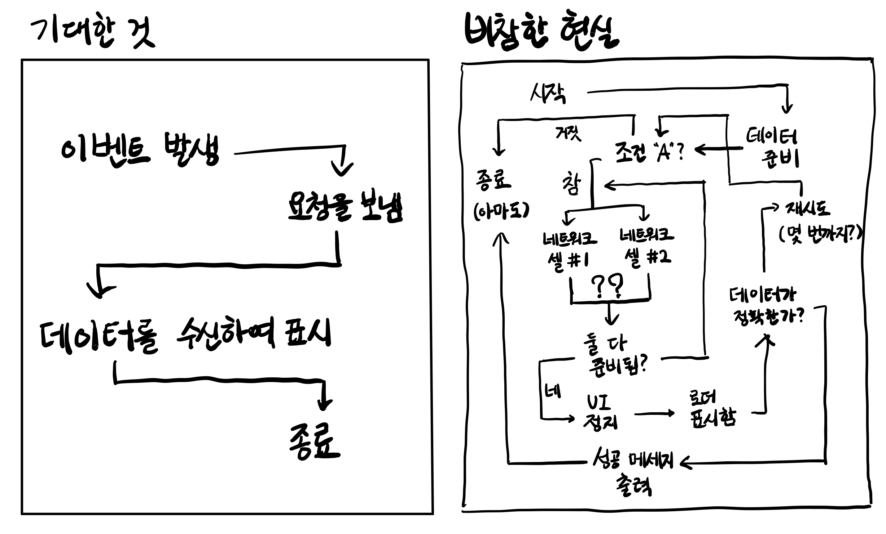

유명한 글인 [What Color is Your Function?](http://journal.stuffwithstuff.com/2015/02/01/what-color-is-your-function/)과 [해당 글에 대한 토론](https://news.ycombinator.com/item?id=8984648), 그리고 같은 블로그에서 반복과 동시성의 연관관계를 다룬  [Iteration Inside and Out](http://journal.stuffwithstuff.com/2013/01/13/iteration-inside-and-out/), [그리고 해당 글의 2번째 시리즈](http://journal.stuffwithstuff.com/2013/02/24/iteration-inside-and-out-part-2/)를 읽고 작성한 글이다.

개인적으로 이 글들의 시사점은 멀티스레딩과 동시성이라는 이슈가 우리가 생각도 못한 곳까지 닿아 있으며 이를 쉽게 다룰 수는 없다는 것, 그리고 이 어려움의 핵심은 콜스택이라는 것이라고 생각한다.

원 글의 저자는 Ruby, Dart 등의 언어에 매우 익숙하기 때문에 원 글에서는 이런 언어들을 예시로 들고 있다. 하지만 JS, Python 등 내가 알고 있고 좀더 유명하기도 한 언어로 예시를 바꾸어 작성하도록 노력하였다.

그리고 나는 개인적으로 이 글의 논지 전부에 동의하지는 않는다. [Red & blue functions are actually a good thing](https://blainehansen.me/post/red-blue-functions-are-actually-good/)과 같이 동기와 비동기를 명확히 구분할 수 있는 것이 더 좋다는 것에 동의하는 편이다. 하지만 이 글에서 주장하는 바도 충분히 시사점이 있다고 생각하여 블로그에 남긴다.

# 1. 비동기 함수의 전염성

이런 JS 코드를 작성한다고 해보자. A, B, C는 잘 출력되고 아무 문제도 없다.

```js
function A(){
  return "A";
}

function B(){
  console.log(A());
  return "B";
}

function C(){
  console.log(B());
  return "C";
}

console.log(C());
```

그런데 만약 `B()`에서 비동기 코드가 필요해졌다고 하자. 그럼 B는 다음과 같이 바뀐다. 왜 Promise나 async/await을 쓰지 않는 거지? 라는 생각이 들겠지만 잠시만 기다려 주세요. 비동기 함수를 사용하고, 그 함수가 완료되면 콜백 함수를 호출하는 형태로 바꾼다.

```js
function B(fn){
  console.log(A());
  setTimeout(()=>{
    fn(fetchData());
  }, 0);
}
```

그럼 `B()`는 비동기로 동작하게 되었기 때문에 C에서 제대로 사용하기 위해서 C도 비동기 함수가 되어야 한다. 그럼 C는 다음과 같이 바뀐다.

```js
function C(){
  /* fn의 정의 */
  setTimeout(()=>{
    B((data)=>{
      console.log(data);
    });
    console.log("C");
  }, 0);
}
```

만약 `C()`를 `D()`에서도 사용해야 한다면 `D()`는 또 `C()`를 사용하기 위해서 비동기 함수가 되고...이런 비동기 함수의 전염성은 계속되어 간다. 비동기 함수는 비동기 함수 내부에서만 호출될 수 있기 때문이다.

이는 Promise를 사용해도 마찬가지고, async/await을 써도 마찬가지다. `B()`의 비동기성은 전염된다. 비동기 함수의 결과를 다음 코드에서 사용한다면, 해당 코드가 완결될 때까지 비동기 함수의 결과를 기다려야 하기 때문이다.

```js
async function B(){
  console.log(A());
  const data=await fetchData();
  return data;
}

async function C(){
  console.log(await B());
  return "C";
}
```

이 문제는 어떤 패러다임이나 개발자의 실력 문제가 아니고, 특정 라이브러리나 방법론을 통해서 깔끔하게 해결할 수 있는 것도 아니다. 우리는 기본적으로 재사용될 수 있는 함수들로 프로그램을 분할하여 구성하며 비동기로 동작하는 코드는 그러한 프로그램의 여러 부분에서 필요하다는 점에서 이런 비동기 함수의 전염성 문제는 발생할 수밖에 없다. 비동기 함수를 처리하는 건 언제나 어렵다!



# 2. 원인

그러나 우리는 그럼에도 무언가 해야 한다. 그렇다면 가장 먼저 해야 할 일은 근본적인 원인의 탐구이다. 왜 비동기 함수는 전염될 수밖에 없는가?

JS와 같은 싱글스레드 언어에서는 콜스택이 하나뿐이다. 이런 싱글스레드 환경에서 비동기 함수를 사용하기 위해 이벤트 루프와 같은 장치들이 있지만 결국 순수 JS 코드를 처리하는 콜스택은 하나밖에 없다. 여기서 비동기 함수의 전염성이 발생한다.

비동기 함수가 전염되지 않는 상황에서 비동기로 어떤 작업을 한다고 생각해 보자. `asyncJob`함수 구조를 간단히 생각해 보자. await을 사용하였지만 fetch의 비동기성이 전염되지 않는다고 했으므로 `asyncJob`함수는 동기 함수처럼 쓰일 수 있다.

```js
function asyncJob(){
  const data=fetch("https://example.com");
  /* fetch의 결과물을 사용하는 작업 */
}
```

그러면 [비동기는 호출 스레드를 블로킹하지 않으므로](https://stackoverflow.com/questions/44894691/why-await-requires-async-in-function-definition) fetch 다음에 오는 `asyncJob` 내부 코드는 바로 실행된다. 

하지만 이렇게 하면 fetch의 결과물이 나온 후 다시 돌아온 시점에 해당 결과물을 사용하는 코드는 실행된 다음이다. 비동기 처리는 잘 되었지만 우리는 그걸로 아무것도 할 수가 없다!


그럼 이제 다음처럼 바꿔보자. await을 이용해서 fetch를 기다리는 것이다. 비동기의 전염성은 여전히 없다고 가정하므로 `asyncJob`함수는 async를 붙이지 않는다.

```js
function asyncJob(){
  const data=await fetch("https://example.com");
  /* fetch의 결과물을 사용하는 작업 */
}
```

그리고 이 함수를 다음과 같은 코드에서 쓴다고 가정하자.

```js
A();
asyncJob();
B();
C();
```

`asyncJob`을 실행하면 fetch는 WebAPI에서 비동기로 동작하는 함수이므로 WebAPI로 넘어간다. [비동기는 호출 스레드를 블로킹하지 않으므로](https://stackoverflow.com/questions/44894691/why-await-requires-async-in-function-definition) 다음으로 `B()`가 

그리고 `C()`가 실행되던 중 `asyncJob()`의 비동기 작업이 완료되었다. 그러면 다시 원래 지점으로 

그런데 비동기 함수도 결국 함수이기 때문에 함수 실행이 완료되면 다시 원래의 지점으로 돌아와야 한다. 꼭 돌아와야 하나? 싶겠지만 이러한 함수 실행을 관리하는 역할을 하는 구조인 콜스택이 하나뿐이기 때문에 `asyncJob()`의 결과물을 사용하기 위해서는 비동기 작업이 실행된 후에 원래 지점으로 돌아오는 것이 필수적이다.

하지만 그러기 위해서는 기존에 콜스택에 담겨 실행되던 다른 작업들을 다 버려야 한다. `asyncJob()`작업을 비동기로 실행하여 빨리 끝냈지만 그 시점이 `C()`실행 중이라면 


# 1. 시작

대부분의 개발자들은 어떤 것을 반복하는 문법이 프로그래밍 언어에서 아주 간단한 문제라고 생각할 것이다. 50년 전의 컴퓨터에서 작동하던 FORTRAN에서조차도 이러한 반복문이 이미 존재했을 정도니까, 당연한 생각이다. FORTRAN의 반복문은 다음과 같이 작동하였다.

```c
do i=1,10
  print i
end do
```

그럼 우리가 프로그래밍 언어, 예를 들어서 [새 프로그래밍 언어 Magpie(Iteration Inside and Out의 저자가 만들고 있는 언어라고 한다)](http://magpie-lang.org/)를 만든다면 이렇게 하면 되지 않을까?

1. 다른 언어들의 반복문을 조사한다.
2. 그중 가장 awesome하게 보이는 것을 고른다.
3. 그것을 내 프로그래밍 언어에 추가한다.

문제는 이렇게 반복문을 만드는 것이 단순히 몇 번 같은 작업을 반복하거나 특정 숫자 범위만 왔다갔다하는 문제가 아니었다는 것이다.

원초적인 질문으로 돌아가서, 반복(iteration)이란 대체 무엇인가? 물론 우리는 다음과 같은 간단한 반복문을 생각할 수 있다.

```c
int i;
for(i=0;i<n;i++) {
  printf("%d\n", i);
}
```

하지만 이런 반복도 있지 않은가? JS에서는 `for..of`와 같이 객체의 원소 전체를 반복하는 반복문도 있다. JS가 특별한 것도 아니고 Python이나 C++도 이런 기능을 지원한다.

```js
let fruits=["사과", "바나나", "포도"];

for(const fruit of fruits){
  console.log(fruit);
}
```

그럼 꼭 for문의 형태를 해야 하는가? JS의 `forEach`같은 건 어떤가? 객체의 원소 전체를 반복하며, 그 원소들에 대해 콜백 함수를 실행한다.

```js
let fruits=["사과", "바나나", "포도"];

fruits.forEach((fruit)=>console.log(fruit));
```

반복을 어떤 추상적인 시퀀스에 대하여 그것을 순회하는 것으로 생각한다면 트리의 순회는 어떤가? 아니면 소수 전체를 순회하면서 어떤 조건을 만족하는 소수가 나올 때까지 연산하는 것은? 반복은 그렇게 간단한 문제가 아니다.

먼저 반복문에 있는 2가지의 다른 스타일, internal iteration과 external iteration를 알아보았다. 각각은 서로의 명확한 장단점이 있다.

# 2. External iteration : 함수가 객체를 호출한다

External iteration는 말 그대로 외부에서 반복자(iterator)를 제어하는 것이다. 객체에는 반복자가 있고, 다음 원소에 접근할 수 있는 방법이 있다. 그리고 외부에서는 그 반복자를 제어하면서 해당 반복자의 값에 어떤 조작을 가하는 것이다.

C++, Java, C#, Python, PHP등의 많은 OOP 언어에서 사용한다. for, foreach(`forEach`와 같은 메서드가 아니라 객체의 전체 원소를 순회하는 것을 일반적으로 칭한 단어이다) 문을 제공한다. JS라면 다음과 같을 것이다.

```js
for(let i=0;i<10;i++){
  console.log(i);
}

let fruits=["사과","바나나","포도"];
for (let i of fruits) {
  console.log(i);
}
```

위 코드는 실제로는 잘 알려진 심볼 `[Symbol.iterator]()`메서드를 이용해 동작한다. 간단히 흉내내 보면 다음과 같다. 내부적으로는 제너레이터를 사용하고 이후에 간단히 다루겠지만 지금의 핵심은 아니다.

```js
let fruits=["사과","바나나","포도"];
let iter=fruits[Symbol.iterator]();
let i;
while(i=iter.next()){
  if(i.done){break;}
  console.log(i.value)
}
```

핵심은 반복할 객체의 각 원소에 접근하기 위한 어떤 방법이 있고 그것이 외부로 노출되어 있다는 것이다. 

이를 실제로 구현하는 반복자 프로토콜을 사용자가 접근하여 사용하는 것은 아니지만 일반적인 for문의 사용을 생각해 보아도 객체 외부에서 원소에 접근하고, 해당 원소에 어떤 연산을 가하는 방식임을 깨달을 수 있다.

따라서 external iteration을 구현하기 위해서는 이러한 반복자(iterator)를 외부에서 접근할 수 있는 방법을 정의해야 하고 이를 반복자 프로토콜이라고 한다.

dart에서는 `.iterator()`, `moveNext()`, `.current`이고 Python에서는 `__iter__`와 `__next__`이며 JS에서는 `[Symbol.iterator]()`메서드의 generator 함수이다.

# 3. internal iteration : 객체가 함수를 호출한다

internal interation은 반대다. 반복할 객체에 함수 객체를 전달하고 객체에서 알아서 반복을 진행하면서 반복되는 각 원소를 인자로 하여 함수를 호출하는 것이다. 

Ruby, Smalltalk, 그리고 Lisp의 대부분이 이 방식을 사용한다. 물론 Python이나 JS와 같이 함수가 일급 객체로 취급되고 고차 함수가 많이 쓰이는 언어에서도 이 방식을 사용할 수 있다.

# 4. external vs internal

프로그램에서의 반복문을 2가지 부분으로 나눈다면 첫번째로 순회할 값들을 생성하는 부분, 그리고 그렇게 순회되는 값들에 어떤 조작을 가하는 부분 이렇게 두 부분이 있다고 할 수 있다.

external/internal iteration을 가르는 기준은 이 두 단계 중 어느 쪽이 반복의 핵심 제어권을 갖는지이다.

External iteration에서는 값들에 조작을 가하는 부분이 제어권을 갖는다. 반복자 프로토콜에서 순회할 값들을 생성하고, 언제 해당 값을 불러올지도 for문 본문에서 결정하여 for문의 본문에서 해당 값들에 조작을 가한다.

```js
for(let i of arr){
  foo(i);
}
```

반면 Internal iteration에서는 순회할 값들을 만드는 쪽에서 해당 값을 사용할 콜백 함수를 제어한다.

# 참고

https://stackoverflow.com/questions/224648/external-iterator-vs-internal-iterator

https://willowryu.github.io/2021-05-21/

https://www.rinae.dev/posts/why-every-beginner-front-end-developer-should-know-publish-subscribe-pattern-kr