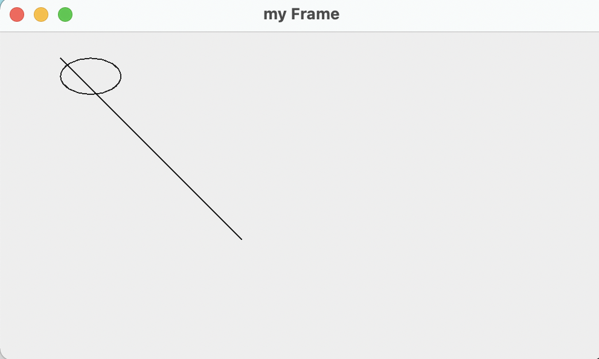
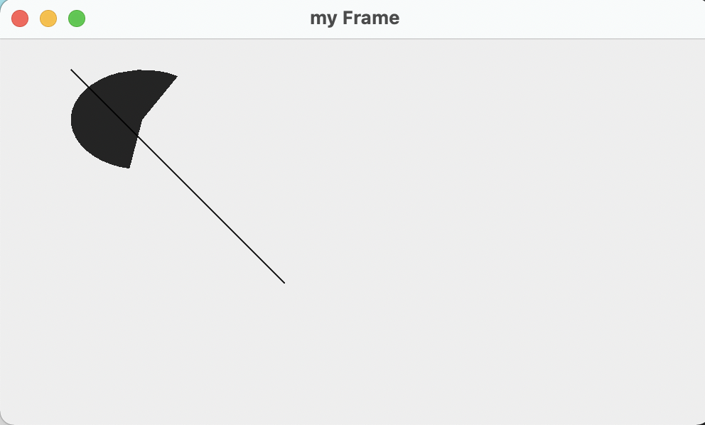
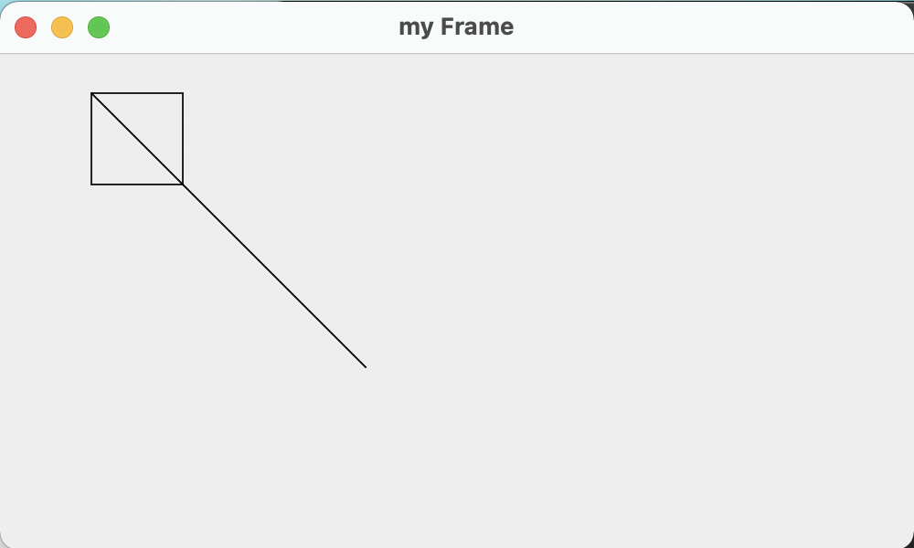
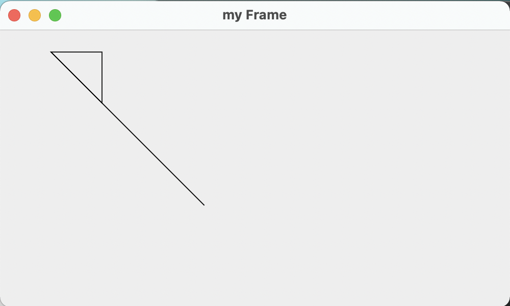
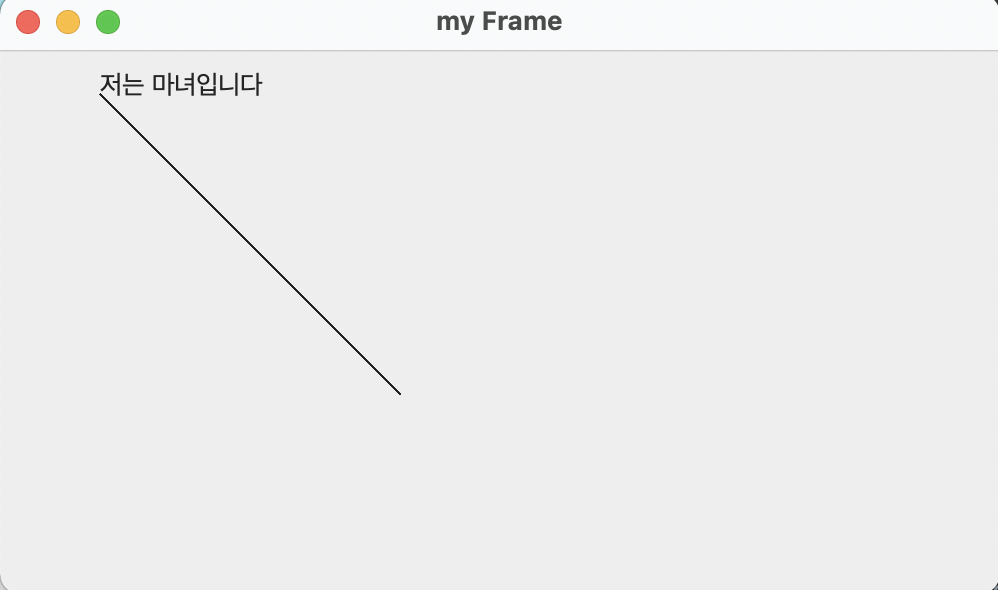
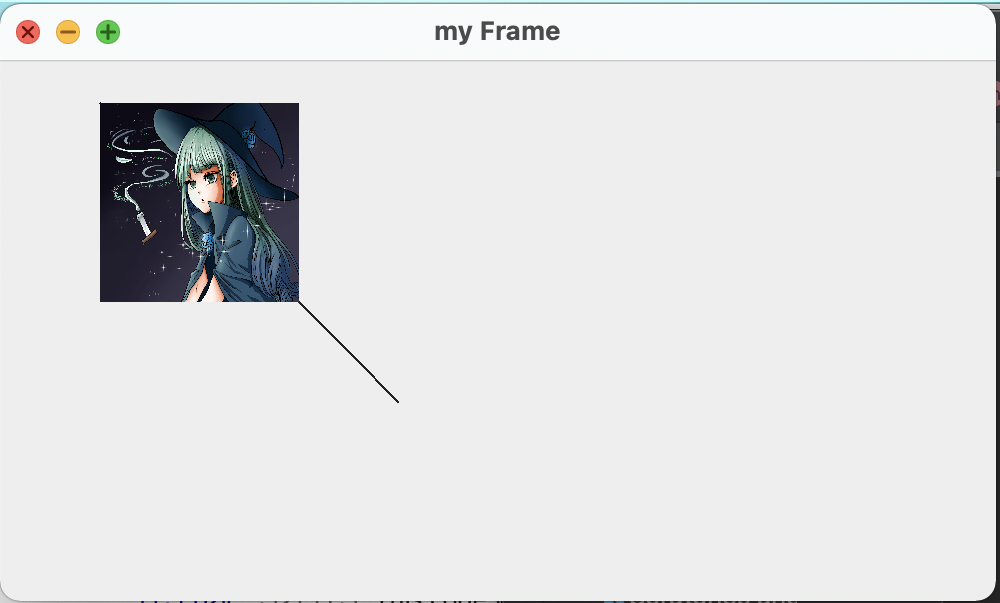
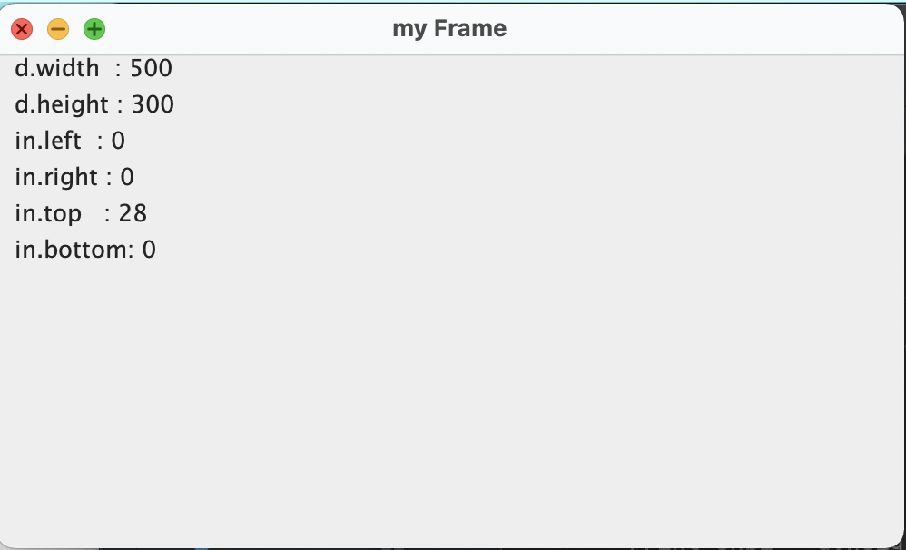

java 언어 수업의 기말 범위에선 awt를 배운다. 시험공부한 내용을 간략히 정리한다.

# 1. 시작

java에서는 gui 프로그래밍을 위해 awt(abstract window toolkit)라는 패키지를 제공한다.

```java
import java.awt.*;
```

기본이 되는 요소들을 알아보자.

## 1.1 Frame

Frame은 각종 응용 프로그램을 위한 윈도우를 제공한다. 모든 컴포넌트는 Frame 위에 배치되어야 한다. 당연히 최소 한 개는 필요하다. 그리고 각 gui 프로그램은 다음과 같은 과정을 거쳐야 한다.

1. new Frame()으로 프레임을 생성한다.
2. setSize 메서드로 프레임 크기를 설정한다.
3. setVisible 메서드로 프레임을 화면에 보이게 한다.

아주 간단한 다음과 같은 프로그램을 작성할 수 있다.

```java
import java.awt.*;

public class Main {
    public static void main(String[] args) {
        Frame f=new Frame("my Frame");
        f.setSize(300, 200);
        f.setVisible(true);
    }
}
```

## 1.2 paint

paint 메서드는 Frame이 화면에 보여질 때 호출되는 메서드이다. paint 메서드는 다음과 같이 작성한다. 또한 다음과 같은 경우에 실행된다.

1. Frame이 처음 화면에 보여질 때, 혹은 setSize로 크기가 변경될 때
2. repaint 메서드가 호출될 때
3. show 메서드가 호출될 때

또한 일반적으로 다음과 같이 선언된다.

```java
public void paint(Graphics g){
  ...
}
```

이는 `Graphics`클래스가 모든 그래픽스 객체의 추상 베이스 클래스이기 때문이다. 그림을 그리는 데에 필요한 모든 설정값과 메서드를 가지고 있다. 그래서 paint 메서드에서는 Graphics 객체를 인자로 받아서 그림을 그린다.

## 1.3 Destroyer

앞선 예제에서는 프레임을 닫을 수 있는 방법이 없다. 그래서 프레임을 닫을 수 있는 방법을 알아보자.

먼저 다음과 같은 클래스를 선언한다.

```java
class WindowDestroyer extends WindowAdapter{
  public void windowClosing(WindowEvent e){
    System.exit(0);
  }
}
```

그리고 프레임 f에 대해 저 클래스에 대한 리스너를 추가한다.

```java
public class Main {
    public static void main(String[] args) {
        Frame f=new Frame("my Frame");
        f.setSize(300, 200);
        WindowDestroyer listener=new WindowDestroyer();
        f.addWindowListener(listener);
        f.setVisible(true);
    }
}
```

# 2. 도형 그리기 메서드들

기본적인 도형을 그리는 메서드를 알아본다.

## 2.1 Frame 생성자

```java
Frame f=new Frame(창의 제목);
```

Frame 클래스의 생성자를 보면 생성자 인수로 들어온 문자열과 GraphicsConfiguration 객체를 넣어서 프레임을 초기화하도록 한다. GraphicsConfiguration 객체는 그래픽스 환경에 대한 정보를 가지고 있다. 단 이는 보통 사용자가 직접 설정할 수 없으므로 창의 제목만 생성자 인수로 넣으면 된다.

## 2.2 setSize

컴포넌트의 크기를 설정하는 메서드이다. 다음과 같이 사용한다.

```java
f.setSize(width, height);
```

## 2.3 setVisible

인수가 true이면 그 컴포넌트를 화면에 보이게 하고, false이면 그 컴포넌트를 화면에서 숨긴다.

```java
f.setVisible(true);
f.setVisible(false);
```

## 2.4 drawRect

drawRect 메서드는 사각형을 그리는 메서드이다. 다음과 같은 형태를 가진다.

```java
public void drawRect(int x, int y, int width, int height)
```

이때 x,y는 직사각형의 `왼쪽 위` 꼭짓점의 좌표이고 width, height는 직사각형의 너비와 높이이다.

## 2.5 fillRect

fillRect 메서드는 사각형을 채우는 메서드이다. 다음과 같은 형태를 가진다.

```java
public void fillRect(int x, int y, int width, int height)
```

직사각형을 채울 색은 setColor 메서드로 설정한 색이다. 기본값은 검은색이다.

## 2.6 drawRoundRect

drawRoundRect 메서드는 꼭짓점이 둥근 사각형을 그리는 메서드이다. 다음과 같은 형태를 가진다.

```java
public void drawRoundRect(int x, int y, int width, int height, int arcWidth, int arcHeight)
```

이때 x,y는 drawRect에서처럼 직사각형의 왼쪽 위 꼭짓점의 좌표이고 width, height는 직사각형의 너비와 높이이다. arcWidth, arcHeight는 꼭짓점의 둥근 정도를 나타낸다. arcWidth는 모서리의 둥근 너비의 정도, arcHeight는 모서리의 둥근 높이의 정도를 나타낸다.

## 2.7 fillRoundRect

fillRoundRect 메서드는 setColor로 설정한 색으로 채워진 꼭짓점이 둥근 사각형을 그리는 메서드이다. 다음과 같은 형태를 가진다.

```java
public void fillRoundRect(int x, int y, int width, int height, int arcWidth, int arcHeight)
```

구조는 drawRoundRect와 같다.

## 2.8. DrawLine

말 그대로 (x1, y1)에서 (x2, y2)로 향하는 선을 그리는 함수이다.

```java
public void drawLine(int x1, int y1, int x2, int y2)
```

## 2.9. DrawOval

drawOval 메서드는 타원을 그리는 메서드이다. 다음과 같은 형태를 가진다.

```java
public void drawOval(int x, int y, int width, int height)
```

이때 x,y는 `타원의 중심이 아니다.` x,y는 타원을 딱 맞게 감싸는 직사각형의 왼쪽 위 꼭짓점의 좌표이고 width, height는 그 직사각형의 너비와 높이이다.

다음과 같은 코드를 보자.

```java
import java.awt.*;
import java.awt.event.*;

class WindowDestroyer extends WindowAdapter{
    public void windowClosing(WindowEvent e){
        System.exit(0);
    }
}

public class Main extends Frame {
    public Main(String str){
        super(str);
    }

    public void paint(Graphics g){
        g.drawLine(50,50,200,200);
        g.drawOval(50,50,50,30);
    }

    public static void main(String[] args) {
        Frame f=new Main("my Frame");
        f.setSize(500, 300);
        WindowDestroyer listener=new WindowDestroyer();
        f.addWindowListener(listener);
        f.setVisible(true);
    }
}
```

이 결과는 다음과 같다.



직선의 시작점(50,50)이 타원의 중심이 아니라 타원을 딱 맞게 감싸는 직사각형의 왼쪽 위 꼭짓점이라는 것을 알 수 있다.

## 2.10. FillOval

fillOval 메서드는 setColor로 설정한 색(기본은 검정)으로 채워진 타원을 그리는 메서드이다. 다음과 같은 형태를 가진다. 구조는 drawOval과 같다.

```java
public void fillOval(int x, int y, int width, int height)
```

## 2.11. DrawArc

drawArc 메서드는 호를 그리는 메서드이다. 다음과 같은 형태를 가진다.

```java
public void drawArc(int x, int y, int width, int height, int startAngle, int arcAngle)
```

이때 x,y는 호를 딱 맞게 감싸는 직사각형의 왼쪽 위 꼭짓점의 좌표이고 width, height는 그 직사각형의 너비와 높이이다.

startAngle은 호의 시작 각도이고 arcAngle은 호의 중심각이다. 각도는 0도가 x축의 양의 방향이고 시계 방향으로 증가한다. 예시는 더 직관적인 fillArc에서 보도록 하겠다.

## 2.12. FillArc

fillArc 메서드는 setColor로 설정한 색(기본은 검정)으로 채워진 호를 그리는 메서드이다. 다음과 같은 형태를 가진다. 구조는 drawArc와 같다.

```java
public void fillArc(int x, int y, int width, int height, int startAngle, int arcAngle)
```

다음과 같이 paint 함수를 만든다고 하자.

```java
public void paint(Graphics g){
  g.drawLine(50,50,200,200);
  g.fillArc(50,50,100,70, 60, 200);
}
```

그러면 호를 딱 맞게 감싸는 직사각형의 왼쪽 위 꼭짓점이 (50,50)이며 60도에서 시작해서 중심각이 200도인 호가 그려지는 것을 볼 수 있다.



## 2.13. DrawPolygon

다각형을 그리는 메서드이다. x와 y는 각 꼭짓점의 좌표를 저장한 배열이고 n은 꼭짓점의 개수이다.

```java
public void drawPolygon(int[] x, int[] y, int n)
```

(x[i-1], y[i-1]) 과 (x[i], y[i])를 직선으로 연결한다. 이는 n개의 점에 대해 이루어진다.

예를 들어 다음과 같이 paint 함수를 만들자.

```java
public void paint(Graphics g){
    g.drawLine(50,50,200,200);
    int x[]={50, 100, 100, 50};
    int y[]={50, 50, 100, 100};
    g.drawPolygon(x, y, 4);
}
```

그러면 다음과 같은 모양이 그려진다.



만약 꼭짓점 개수를 다르게 하면? 그럼 x,y 배열의 초기 n개의 원소만 사용한다.

```java
public void paint(Graphics g){
  g.drawLine(50,50,200,200);
  int x[]={50, 100, 100, 50};
  int y[]={50, 50, 100, 100};
  g.drawPolygon(x, y, 3);
}
```

이렇게 꼭짓점을 3개 설정하면 다음과 같은 결과가 나온다.



꼭짓점을 설정한 개수가 x,y배열 크기보다 크면 에러가 발생한다. x,y 배열 크기는 4인데 꼭짓점 개수를 5로 설정한다든지 하는 경우에 에러다.

## 2.14. FillPolygon

색으로 채워진 다각형을 그리는 메서드이다. drawPolygon과 같은 형태를 가진다.

```java
public void fillPolygon(int[] x, int[] y, int n)
```

# 3. 문자열 그리기 메서드

## 3.1. drawString

문자열을 그리는 메서드이다. 문자열을 그리는 위치는 문자열의 왼쪽 아래 꼭짓점이다.

```java
public void drawString(String str, int x, int y)
```

예를 들어 다음과 같은 paint 함수를 사용하면..

```java
public void paint(Graphics g){
  g.drawLine(50,50,200,200);
  g.drawString("저는 마녀입니다",50,50);
}
```

다음과 같은 결과가 나온다.



## 3.2. setFont

문자열을 그릴 때 사용할 폰트를 설정한다.

```java
public void setFont(Font f)
```

setFont는 Graphics 클래스의 메서드이므로 `g.setFont(new Font("Serif", Font.BOLD, 20))`와 같이 사용한다.

Font 클래스는 폰트를 나타내는 클래스이다. Font 클래스의 생성자는 다음과 같다.

```java
public Font(String name, int style, int size)
```

name은 폰트 이름이다. style은 폰트 스타일이다. size는 폰트 크기이다. style은 다음과 같은 상수를 사용한다.

```java
Font.PLAIN
Font.BOLD
Font.ITALIC
Font.BOLD+Font.ITALIC
```

name은 위의 예시에서와 같이 "Serif", "Sans"등을 사용할 수 있다.

# 4. 이미지 그리기 메서드

## 4.1. getImage

이미지를 가져오는 메서드이다. 파일 위치를 받아서 이미지를 가져온다. getDefaultToolkit() 을 통해 사용한다.

```java
Image img=Toolkit.getDefaultToolkit().getImage("이미지 경로");
```

## 4.2. drawImage

이미지를 그리는 메서드이다.

```java
public boolean drawImage(Image img, int x, int y, ImageObserver observer)
```

흔히 observer의 자리엔 this를 사용한다. x, y는 이미지의 왼쪽 위 꼭짓점이다.

혹은 다음과 같은 형식으로도 사용한다.

```java
public boolean drawImage(Image img, int x, int y, int width, int height, ImageObserver observer)
```

여기서도 observer는 this를 사용한다. width, height는 이미지의 크기이다.

다음과 같이 사용할 수 있다.

```java
public void paint(Graphics g){
  g.drawLine(50,50,200,200);
  Image img=Toolkit.getDefaultToolkit().getImage("/Users/kimsunghyun/IdeaProjects/study/src/witch.jpeg");
  g.drawImage(img, 50, 50, 100,100,this);
}
```

그러면 내가 프로필로 사용하는 사진이 다음과 같이 그려진다. 선의 위치와 비교해 보면 x,y가 이미지의 왼쪽 위 꼭짓점이라는 것을 알 수 있다.



# 5. 크기 관련 메서드

## 5.1. getSize

프레임의 크기를 반환한다.

```java
public Dimension getSize()
```

## 5.2. getInsets

프레임의 테두리 크기를 반환한다. bottom, left, right, top의 값을 가진다.

```java
public Insets getInsets()
```

## 5.3. 사용

```java
public void paint(Graphics g){
  Dimension d=getSize();
  Insets in=getInsets();
  g.drawString("d.width  : " + d.width, 10,40);
  g.drawString("d.height : " + d.height,10,60);
  g.drawString("in.left  : " + in.left, 10,80);
  g.drawString("in.right : " + in.right,10,100);
  g.drawString("in.top   : " + in.top,  10,120);
  g.drawString("in.bottom: " + in.bottom, 10,140);
}
```

이렇게 하면 프레임의 크기와 테두리의 크기를 알 수 있다. 내 컴퓨터의 결과는 다음과 같다.



# 6. 색상 관련 메서드

## 6.1. setColor, setBackGround

도형이 그려지는 색과 배경을 결정한다.

```java
public void setColor(Color c)
public void setBackground(Color c)
```

setColor는 Graphics 클래스의 메서드이므로 `g.setColor(Color.pink)`와 같이 사용한다. setBackground는 Frame 클래스의 메서드이므로 `f.setBackground(Color.red)`와 같이 사용한다. 혹은 프레임 클래스 내부에서 `setBackground(Color.red)`와 같이 사용할 수도 있다.

Color 클래스는 색을 나타내는 클래스이다. Color 클래스의 생성자는 다음과 같다.

```java
public Color(int r, int g, int b)
```

0~255 사이의 값을 갖는 r, g, b를 인자로 받아서 색을 만든다.

## 6.2. getXORMode

그래픽 컨텍스트의 현재 색과 새롭게 지정된 색을 바꾸도록 한다. XOR 모드에서 픽셀은 현재 색과 새롭게 지정된 XOR 교대색의 사이를 번갈아가며 바뀐다.

```java
public void paint(Graphics g){
  g.setColor(Color.pink);
  g.fillRect(10,10,200,100);
  g.setXORMode(Color.blue);
  g.fillRect(100,50,200,100);
}
```

## 6.3 사용 - 그림 이동시키기

XORmode를 이용해서 그림을 지우고 다시 그리는 방식으로 그림을 이동시키는 예제를 만들 수 있다.

그림을 특정 위치에 그리기 -> 잠시 기다리기 -> 그림을 그린 위치에 덧그리는 방식으로 그림 지우기 -> 조금 이동한 새로운 위치에 그림 그리기의 과정을 반복함으로써 그림이 오른쪽으로 이동하는 것같이 보이게 한다.

```java
public void paint(Graphics g){
  Image img=Toolkit.getDefaultToolkit().getImage("/Users/kimsunghyun/IdeaProjects/study/src/HAEMA.GIF");
  Dimension d=getSize();
  int x;
  g.setXORMode(Color.white);
  for (x=10 ; x<d.width-100 ; x+=10) 			// move haema to right direction
  {
      g.drawImage(img, x,30, 100, 200, this); 	// draw haema
      for (int j=0 ; j<30000 ; j++);
      g.drawImage(img, x,30, 100, 200, this); 	// delete haeme drawed
  }
  g.drawImage(img, x,30, 100, 200, this);
}
```

# 7. 패널

프레임 안에 있는 일종의 컨테이너이다. 실제로 java.awt.Container를 상속받는다. add 메서드를 통해 컴포넌트를 추가할 수 있다. 또한 setSize, setLocation, setBackground 등의 메서드를 사용할 수 있다.

그렇게 프레임을 만들고 나면 프레임의 add메서드를 통해 프레임 내에 추가될 수 있다. 다음과 같이 사용하면 핑크색 프레임 내에 노란색 패널이 추가된다.

```java
public static void main(String[] args) {
    Frame f=new Main("my Frame");
    Panel p=new Panel();
    f.setSize(500, 300);
    f.setBackground(Color.pink);
    f.setLayout(null);
    p.setSize(100,100);
    p.setBackground(Color.yellow);
    f.add(p);
    f.addWindowListener(new WindowDestroyer());
    f.setVisible(true);
}
```

# 8. 레이아웃

위에서 `setLayout(null);`을 사용하였는데 이 경우 레이아웃 매니저를 사용하지 않겠다는 뜻이다. 그 외에는 다음과 같은 레이아웃 매니저가 있다.

## 8.1. FlowLayout

컴포넌트를 왼쪽에서 오른쪽으로 배치하며 기본적으로 가운데 정렬이다. 컴포넌트의 크기가 프레임의 크기보다 크면 다음 줄로 넘어간다. 컴포넌트의 기본 선호 사이즈를 사용하며 뭔가 바꾸고 싶다면 생성자를 사용한다.

```java
f.setLayout(new FlowLayout());
```

위와 같이 사용한다. 생성자의 매개변수로는 정렬 방식을 지정할 수 있는데 FlowLayout.LEFT, FlowLayout.RIGHT, FlowLayout.CENTER가 있다.

그리고 frame 메서드 중 pack이 있는데 이는 프레임이 포함하는 컴포넌트들의 크기에 맞게 프레임의 크기를 조절해준다.

## 8.2. BorderLayout

프레임과 다이얼로그의 기본 레이아웃이다. 프레임을 5개의 영역으로 나누어 컴포넌트를 배치한다. NORTH, SOUTH, EAST, WEST, CENTER 영역이 있다. 컴포넌트를 배치할 때는 add 메서드의 두 번째 매개변수로 배치할 영역을 지정한다.

```java
f.setLayout(new BorderLayout());
```

위와 같이 레이아웃 매니저를 지정한다. 그리고 컴포넌트 간의 간격을 조절하고 싶다면 생성자의 매개변수로 간격을 지정할 수도 있다.

```java
f.setLayout(new BorderLayout(hgap, vgap));
```

다음과 같이 프레임의 add메서드와 함께 사용한다.

```java
f.add(btn1, BorderLayout.NORTH);
f.add(btn2, BorderLayout.SOUTH);
f.add(btn3, BorderLayout.EAST);
f.add(btn4, BorderLayout.WEST);
f.add(btn5, BorderLayout.CENTER);
```

## 8.3. GridLayout

프레임을 행과 열로 나누어 컴포넌트를 배치한다. 프레임을 격자로 나누어서 위에서 아래로, 왼쪽에서 오른쪽으로 차례로 배치한다고 생각하면 된다. 생성자의 매개변수로 다양한 것을 지정할 수 있다.

```java
setLayout(new GridLayout());
setLayout(new GridLayout(rows, cols));
setLayout(new GridLayout(rows, cols, hgap, vgap));
```

add메서드를 사용하면 알아서 컴포넌트를 배치해준다.

## 8.4. CardLayout

여러 화면을 슬라이드처럼 바꿔가며 보여줄 수 있다. 즉 여러 화면을 레이아웃에 추가한 후 원하는 컨테이너를 보여줄 수 있는 것이다. 순차적으로 다음 화면으로 이동한다든지.

어떤 화면을 show의 매개변수로 지정하면 그 화면이 보여진다.

```java
public static void main(String[] args) {
  Frame f=new Main("my Frame");
  CardLayout card=new CardLayout();
  f.setLayout(card);
  Panel p1=new Panel();
  p1.setBackground(Color.pink);
  Panel p2=new Panel();
  p2.setBackground(Color.yellow);
  Panel p3=new Panel();
  p3.setBackground(Color.CYAN);
  f.add(p1, "1");
  f.add(p2, "2");
  f.add(p3, "3");

  class Handler extends MouseAdapter{
      public void mouseClicked(MouseEvent e){
          card.next(f);
      }
  }
  p1.addMouseListener(new Handler());
  p2.addMouseListener(new Handler());
  p3.addMouseListener(new Handler());
  f.addWindowListener(new WindowDestroyer());
  f.setSize(500,300);
  f.setVisible(true);
  card.show(f, "1");
}
```
