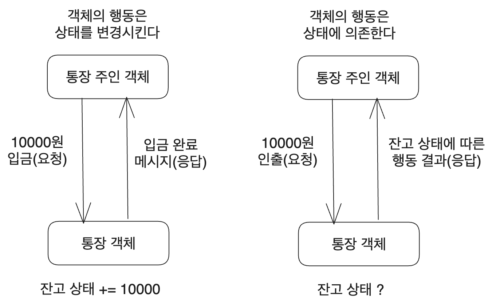
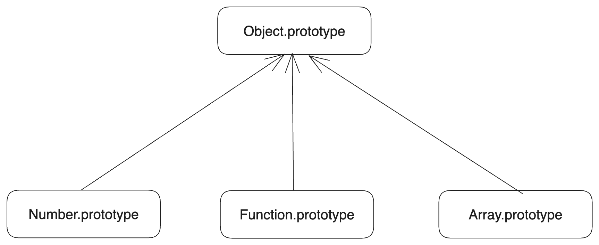

조영호 님의 [객체지향의 사실과 오해](https://product.kyobobook.co.kr/detail/S000001628109)를 읽고, 나의 언어로 핵심을 적당히 적은 글이다.

# 1. 시작

객체 지향 프로그램을 만든다는 것은 목표를 만족하기 위해서 협력하는 관계를 가지고 그 관계 속에서 각자의 역할과 책임을 다하는 객체들로 구성된 하나의 완전연결된 세계를 구성하는 것이다.

이러한 세계 속의 객체란 협력하는 관계 하에서 역할, 그리고 역할에 따른 책임을 가지고 있는 무언가이다. 그리고 그 역할을 자율적으로 수행한다. 객체는 그 역할과 책임을 수행하기 위해서 행동을 가지고 그 행동을 서술하기 위한 상태를 가진다.

객체를 설계하는 개발자는 이런 것을 고려하여 먼저 목표를 정하고, 목표를 달성하기 위한 협력 관계를 정의한다. 그리고 협력 관계 하에서 객체들이 수행해야 하는 책임을 분배하고 그에 맞는 행동을 설계한다. 상태는 행동에 필요한 데이터들로 구성한다.

# 2. 협력하는 객체들의 공동체

> 난 우리만 무대 위에 있고, 남들은 다 구경꾼이라고 생각했지. 그래서 외로웠던 거야. 그건 잘못이야. 그게 아니야. 우리도 구경꾼이지. 난 이제 알 것 같아. 사람들이란 저마다 있는 힘을 다해 살아가는 거야. 잘난 놈은 잘난 맛에 살고, 못난 놈도 제 딴엔 애쓰고, 자기가 가진 걸 남김없이 다 털어버리고 살고 있는 걸 이제야 알았어. 세상이나 무대나 뭐가 달라. 구경꾼이나 배우나. 분 바르고 재주 피우고 살긴 똑같지.
>
> 한수산, "부초"

## 2.1. 역할과 책임

역할이란 협력 관계 속에서 객체에게 주어진 특정한 목표이다. 객체는 그 역할에 따르는 책임을 갖는다. 프로그램 속에서 특정 객체가 제목을 보여준다면, 그 객체는 `제목 역할`을 가지고 `제목을 보여주는 책임`을 수행하고 있다고 말할 수 있다. 

단 하나의 역할이 꼭 하나의 책임을 의미하는 것은 아니고, 역할은 관련성 높은 책임의 집합이다. 제목 역할을 하는 객체가 제목을 보여주는 것뿐만 아니라 적절한 위치에 배치하는 책임까지 가지고 있다고 해서 이상할 것은 없다. 물론 Presentational and Container 패턴 같은 걸 고려한다면 두 역할을 분리하는 것이 좋겠지만 이론적으로 그렇다는 이야기다.

이때 객체는 내부적인 자율성을 가지고 해당 역할을 수행한다. 즉, 객체는 자신의 역할을 수행하기 위해 필요한 방법을 자율적으로 선택할 수 있다. 제목을 보여주는 `Title` 컴포넌트가 있다면, 해당 객체가 제목을 보여주기만 한다면 그것이 `div` 태그를 쓰든, `h1`태그를 쓰든 아니면 어떤 라이브러리를 가져와 사용하여 제목을 보여주든 다른 객체에서는 관여할 수 없다는 것이다. 

실질적으로는 다른 객체에서 메서드 등을 통해 관여할 수도 있겠지만 이론적으로는 제목을 보여주는 역할이 중요하지 그 수행 방법은 객체에서 자율적으로 선택하도록 하는 게 맞다.

그리고 역할이란 특정 객체에 묶인 개념이 아니므로 여러 객체가 동일한 역할을 할 수 있고, 어떤 역할을 수행하는 객체를 같은 역할을 하는 동일한 객체로 치환할 수도 있다. 또한 한 객체가 여러 역할을 같이 수행할 수도 있다. 

물론 이 역할들의 수행 방식은 객체가 자율적으로 선택하므로 A객체를 역할이 같은 B객체로 치환했다고 해도 A, B객체가 그 역할을 내부적으로 수행하는 방식은 다를 수 있다. 여기서 객체지향의 중요한 특징 중 하나인 다형성이 나온다.

## 2.2. 협력

객체들은 협력 관계를 이루어 목표를 달성하며, 그러기 위해 각 객체는 충분히 협력적으로 다른 객체와 소통해야 한다.

그러면 소통은 어떻게 이루어지는가? `요청`과 `응답` 메시지를 통해 이루어진다. 한 객체가 다른 객체에게 메시지를 보내면 메시지를 받은 객체는 대응하는 메서드를 실행하고 그 결과를 응답으로 보낸다.

원칙적으로 외부에서는 메시지를 통해서만 객체와 소통할 수 있다. 무언가를 해달라는 요청을 메시지로 보내고, 응답을 메시지로 받을 뿐이다. 메시지를 받은 객체가 실제로 그 메시지를 어떻게 처리하는지(메서드의 내부 구현)는 알 수 없다. 이것이 객체의 자율성이며 중요한 특성 중 하나인 캡슐화이다.

## 2.3. 객체

객체는 충분히 협력적이어야 한다. 즉 다른 객체의 요청에 응답하고 또 필요에 의해 다른 객체에게 요청하는 협력이 가능해야 한다는 것이다.

또한 자율적이어야 한다. 요청에 응답하고 자신의 역할을 다하는 방법을 스스로 결정할 수 있어야 한다. 

이러한 목표를 달성하기 위해서 객체는 상태와 행위(behavior)를 가진다. 과거에는 데이터와 프로세스를 엄격히 구분하였지만 객체 지향에서는 이 2가지를 객체 속에 묶어 넣어 놓는다.

이러한 객체는 꼭 클래스로 구현될 필요는 없다. 최근 여러 글을 썼던 프로토타입으로도 충분히 객체를 구현할 수 있다. 또한 mixin과 같은 다른 방식들도 있다. 클래스라는 구현 방식에 얽매이지 말고 협력 관계 속에서 역할과 책임으로 정의되는 객체 그 자체에 집중하자.

# 3. 이상한 나라의 객체

> 만약 어떤 외부 사람이 차를 타고 미겔 스트리트를 지나간다면 그는 "빈민굴이구먼! 이라고 말할지 모른다. 그도 그럴 만한 것이 그의 눈에는 빈민굴밖에 보이지 않을 것이기 때문이다. 그러나 거기서 살고 있던 우리는 그 거리를 하나의 세계로 여기고 있었다. 이 세계에서는 모든 사람이 각기 특유의 개성을 지니고 있었다. 맨맨은 미치광이였고, 조지는 바보였으며, 빅 풋은 폭한이었다. 해트는 모험가요, 포포가 철학자라면, 모건은 우리 동네 희극배우였다.
>
> V.S.나이폴, "미겔 스트리트"

## 3.1. 객체와 인지

사람은 기본적으로 세상을 수많은 객체들의 집합으로 분해하여 인지한다. 이때 객체란 것은 인지할 수 있으며 임의대로 정한 경계를 지닌 어떤 것이다. 우리는 컴퓨터를 하나의 객체로 인지할 수도 있지만 컴퓨터를 조립하고 있다면 그것을 모니터, 그래픽카드, 메인보드 등의 객체들로 이루어진 집합으로 인지할 수도 있다. 

이렇게 경계는 정하기 나름이지만 중요한 것은 사람들이 세상을 경계를 지닌 객체들의 집합으로 인지한다는 것이다. 객체지향은 소프트웨어 또한 이렇게 사람이 세상을 여러 객체로 분류해서 보는 것과 같이 짜일 수 있다는 믿음에서 출발한다.

물론 앞서 본 것처럼 소프트웨어 객체는 각자 자율성을 가지고 있다. 현실의 통장과 달리 통장 객체는 스스로 잔고를 줄일 수 있다. 따라서 객체 지향 패러다임을 통해 현실을 완전히 모방할 수는 없다. 하지만 세상을 각자의 역할을 하는 객체들의 집합으로 보는 패턴을 빌려오는 것이다.

## 3.2. 객체의 구성

객체는 상태와 행동, 식별자로 구성되어 있다.

### 3.2.1. 상태

상태는 특정 시점에 객체가 가지고 있는 정보의 집합이다. 값 혹은 다른 객체에 대한 링크이며 지금까지 취한 행동들의 결과를 기술한다. 가령 통장 객체의 잔고 상태는 지금까지 통장 주인이 취한 모든 입출금이력의 결과일 것이다. 즉 상태를 이용하면 과거 모든 행동 이력을 설명하지 않고도 현재 상태를 통해 행동 결과를 만들어낼 수 있다. 이런 객체를 구성하는 모든 특징을 객체 프로퍼티라 한다.

그런데 객체는 자율적이기 때문에 상태를 외부에 노출하지 않는다. 상태는 객체 내부에 존재하며 객체가 스스로 관리한다. 따라서 외부에서는 객체의 상태를 직접 제어할 수 없다. 외부에서 객체 상태에 관여하기 위한 방법으로 행동이 등장한다. 객체는 스스로의 행동에 의해서만 상태를 변경해야 한다.

### 3.2.2. 행동

행동은 외부의 요청에 따라 객체의 책임을 다하기 위해 객체가 취하는 어떤 동작이다. 현재 상태를 무엇인가로 변경하고 협력하는 다른 객체에 메시지를 보낸다. 

외부 객체가 협력 관계 속에서 어떤 객체와 협력하고 싶다면 요청을 통해 해당 객체의 행동을 이용한다. 그러면서 해당 객체의 내부 상태는 변경된다.

반대로 행동의 결과 또한 상태의 영향을 받기도 하는데 통장 객체의 잔고 상태가 10000원 이하라면 10000원을 인출하려는 행동은 실패할 것이다. 따라서 현재 상태에 어떻게 의존하는지도 행동의 기술에 포함된다.



행동을 설계할 때는 객체의 자율성을 보장해야 한다는 것에 주의하자. 객체에 접근할 수 있는 유일한 방법은 객체가 제공하는 행동뿐이며 외부에서는 메시지를 통해서 이 행동을 사용하는 수밖에 없다. 

### 3.2.3. 식별자

식별자는 객체를 구분할 수 있는 프로퍼티이며 이를 이용해 객체를 식별한다. 정수와 같은 값들은 식별자를 가지지 않고 단순히 값을 통해서 비교한다. 식별자의 유무는 값과 객체의 가장 큰 차이다. 값은 상태가 같으면 같다고 판단되지만 객체는 그렇지 않다.

예를 들어 통장 객체가 있다면, 이름이 `김성현`이고 A은행 통장이며 잔고가 10000원 있다고 해서 무조건 같은 객체로 취급할 수 없다. 내 통장 잔고와 같은 잔고를 가진 동명이인의 통장이 있다고 해서 두 통장이 합쳐진다면 난 매우 난감할 것이다. 따라서 통장 객체는 각 통장을 구별할 수 있는 식별자를 가지고 있어야 한다.

## 3.3. 객체 설계

`"행동이 상태를 결정한다"`

앞서 언급했듯 객체 지향은 목표를 위해 여러 객체가 메시지를 통해 협력하는 관계를 구축하는 것이다. 따라서 객체를 설계할 때도 각 객체가 어떤 상태를 가질지를 보는 것이 아니라 각 객체가 협력 관계 속에서 어떤 역할을 수행하는지, 따라서 어떤 행동을 할 수 있어야 하는지를 중심으로 설계해야 한다. 

그리고 나서야 그 행동들을 서술하기 위해 객체가 가져야 할 상태를 결정한다. 이러한 방법론이 바로 책임 주도 설계이다.

또한 알아야 할 것은 객체들의 협력 관계를 기반으로 행동을 잘 설계했다면 그것이 꼭 현실 객체의 모방일 필요는 없다는 사실이다. 그저 현실 객체를 이용해서 소프트웨어 객체를 묘사함으로써(컴포넌트 이름을 `Container`로 지음으로써 무언가를 담는 역할이라고 나타낸다든지)이해를 돕고 더 쉽게 예측할 수 있는 세계를 구성할 수도 있다는 선택지가 있을 뿐이다.

# 4. 타입과 추상화

> 만약 오리처럼 생겼고, 오리처럼 헤엄치고 오리처럼 꽥꽥대는 무언가가 있다면 그건 아마 오리일 것이라고 추론할 수 있다.
>
> 오리 실험

## 4.1. 추상화

우리는 우리 눈에 보이는 것들을 목적에 따라 추상화하여 바라본다. 여기서 추상화란 내게 필요한 사실만 추려서 보고 나머지는 무시하는 것이다. 여기에는 2가지 차원이 있다.

1. 사물들 간 공통점만 취해 단순하게 만드는 것
2. 중요한 부분의 강조를 위해 불필요한 세부 사항을 제거하여 목적에 맞는 본질을 드러내는 것

내가 지나가다가 군복을 입은 사람들 무리를 본다면, '군인들이네'하고 인식할 것이다. 그들 각자의 이름이나 인간관계는 무시한 채 말이다. 철수 대신 민수가 그 자리에 군복을 입고 서 있어도 내게는 아무런 차이도 없다. 그들 각자는 내가 헤아릴 수도 없을 만큼 많은 정보를 지니고 있겠지만 나는 군인이라는 공통점만 보고 있다.

나는 군복을 입었다는 공통점을 통해서 그들을 단순화하여 인식했고, 각자의 이름이나 계급과 같은 세부 사항들은 무시하였다. 만약 내가 지나가는 사람들을 볼 때 그들 모두의 세부 사항들을 머릿속에 같이 인식하게 된다면 세상을 본다는 건 굉장히 머리아픈 일이 될 것이다. 다행히 추상화를 통해서 우리는 세상을 좀더 단순하게 인식할 수 있다.

추상화는 결국 사물에서 내게 필요한 본질만 뽑아내어 편리하게 볼 수 있도록 하는 과정이다. 

## 4.2. 개념

이렇게 객체를 분류할 수 있는 주제와 같은 것을 개념(concept)이라 한다. 군복을 입은 군인들이라든지 엔진으로 바퀴를 굴려서 도로 위를 달리는 자동차들이라든지 하는, 여러 객체에 공통으로 적용할 수 있는 관념이 바로 개념이다.

우리가 도로 위에 있는 수많은 자동차들을 '자동차'라는 하나의 개념으로 바라보듯이, 개념을 이용하면 객체들을 여러 그룹으로 분류할 수 있다. 반면 개념에 속한 객체는 해당 개념의 인스턴스라고 한다.

개념을 좀더 구체적으로 정의하면 개념은 심볼, 내연, 외연으로 구성된다. 심볼은 개념의 식별자와 같은 것으로 개념을 가리키는 간략한 명칭이다. 

내연은 객체가 개념에 속하는지 여부를 확인할 수 있도록 하는 개념의 완전한 정의이다. 가령 자동차의 내연을 다음과 같이 말할 수 있다.

```
원동기를 장치하여 그 동력으로 바퀴를 굴려서 철길이나 가설된 선에 의하지 아니하고 땅 위를 움직이도록 만든 차.(출처 : 네이버 어학사전)
```

외연은 개념에 속하는 모든 객체 즉 개념 인스턴스 전체의 집합이다.

다만 이 3가지 구성 요소가 중요한 건 아니다. 개념의 조건을 객체가 만족시키는지에 따라서 객체들을 개념 그룹으로 분류할 수 있다는 것이 중요하다. 그런 그룹화를 통해서 객체들이 이루는 세계를 단순화하여 바라볼 수 있기 때문이다.

## 4.3. 타입

프로그래밍에서는 객체들을 분류하는 데 쓰이는 개념을 타입이라는 단어로 표현한다. 만약 어떤 객체가 A 타입에 속한다면, 해당 객체는 A타입의 인스턴스라고 생각하는 식이다.

또한 객체가 특정 타입인지 판단하는 것도 개념에서와 똑같다. 해당 타입이 요구하는 조건을 객체가 만족시키면 객체는 해당 타입의 인스턴스라고 할 수 있다.

그런데 타입에 속하는지 판단하게 해준다는 이 조건은 뭘까? 바로 객체에 적용할 수 있는 작업으로 정해진다. 즉, 타입은 객체가 수행할 수 있는 행동의 집합으로 정의된다. 어떤 객체가 오리처럼 생겼고, 오리처럼 헤엄치고 오리처럼 꽥꽥대는 무언가가 있다면 해당 객체를 오리 타입이라고 할 수 있는 것이다.

이런 객체의 분류는 객체가 저장하고 있는 데이터의 표현이나 행동의 구체적인 수행 방식과는 상관없다. 오히려 객체가 데이터를 저장하는 방식은 캡슐화되고 행동만이 노출된다. 

만약 수행할 수 있는 행동이 완전히 똑같다면 두 객체는 같은 타입이라 할 수 있으며 개발자는 객체 내부 데이터의 표현을 몰라도 객체를 사용할 수 있다. 소수점을 표현하는 IEEE754 규격을 몰라도 우리는 부동 소수점 타입이 뭔지 알고, 잘 사용하지 않는가?

또한 타입이 행동으로만 정의됨으로 인해서, 같은 타입의 객체가 동일한 행동/요청을 다른 방법으로 수행할 수도 있게 되고 이는 객체 지향의 개념 중 하나인 다형성을 가능하게 한다.

## 4.4. 타입의 계층

타입에 관해서 잘 생각해 보면, 계층 구조를 가진 타입이 있다는 것을 생각해볼 수 있다. 특정 타입의 행동을 모두 수행할 수 있으면서도 추가적인 행동을 더 수행할 수 있는 타입이 있다. 이런 일반화, 특수화 구조가 성립하는 타입은 꽤 있다.

JS만 해도 `Object.prototype`의 특수화인 `Array.prototype`등이 있다. `Array.prototype`은 `Object.prototype`의 모든 행동을 수행할 수 있으면서도 추가적인 행동을 수행할 수 있다.



이런 계층 구조를 결정하는 것도 행동이다. A타입이 가진 모든 행동을 B타입이 수행할 수 있으면서 B타입만의 행동을 추가적으로 가지고 있다면 A타입은 B타입의 일반화이고, B타입은 A타입의 특수화이다. 슈퍼타입과 서브타입이라는 용어로도 표현할 수 있다.

타입 계층이 행동에 의해 결정되며 행동은 협력 관계 속에서 객체가 취할 수 있는 동작이라는 것을 생각할 때, 어떤 타입이 다른 타입의 서브타입이라면 협력 관계 속에서 서브타입 인스턴스가 슈퍼타입 인스턴스를 대체할 수 있어야 한다. 이를 나타낸 것이 SOLID중의 리스코프 치환 원칙이다.


# 5. 역할, 책임, 협력

> "나는 나 자신보단 다른 사람을 대할 때 훨씬 참을성이 강하고, 무슨 일에서나 좋은 면을 잘 이끌어낼 수가 있나봐. 난 그런 타입의 사람인 것 같아. 성냥갑 옆에 붙어 있는 까칠까칠한 부분 같은 존재인 거야, 말하자면. 하지만 괜찮아. 그래도 딱히 싫은 건 아니거든. 난 이류 성냥개비보다는 일류 성냥갑 쪽이 더 좋아."
>
> 무라카미 하루키, "노르웨이의 숲"


# 6. 책임과 메시지

전문가를 위한 파이썬 파이썬으로 sum 구하는 구절

# 7. 객체 지도

> 이런 식으로 그들은 내 방에 와서 말해. 그들 가슴에 있는 말들이 그들을 편안하게 놔두지 않는 거야. 그래서 그들은 늘 바빠.
>
> 카슨 매컬러스, "마음은 외로운 사냥꾼"

# 8. 함께 모으기

> 눈앞에 목표가 있고 그 요구에 맞춰 두뇌를 훈련하는 것, 그것은 체조선수나 경험할 것 같은 상쾌함을 맛보게 했다. 내용이 무엇이건 나는 내 젊은 두뇌가 기계처럼 정확하게 움직이는 그 자체를 즐겼다. 
> 
> 그리고 무엇보다 나를 만족스럽게 한 것은 모든 것이 결정 가능하다는 것이었다. 모든 관계를 내게 맞춘 채 결정할 수 있는 목표가 눈앞에 있었다. 모든 사물의 의미, 비중, 좌표는 그 목표를 원점으로 삼음으로써 결정할 수 있었다. 그것은 확실한 세계였다.
> 
> 시바타 쇼, "그래도 우리의 나날"


> 우리가 의도를 상위 수준 언어로 표현하고 상위 수준 언어가 우리의 의도를 구현하기 위해 필요한 하위 수준의 연산을 찾아내지 않는다면, 상위 수준 언어가 있을 필요가 있을까?
>
> [파이썬 메일링 리스트, 데이비드 엡스타인](https://mail.python.org/pipermail/python-list/2003-April/181482.html)