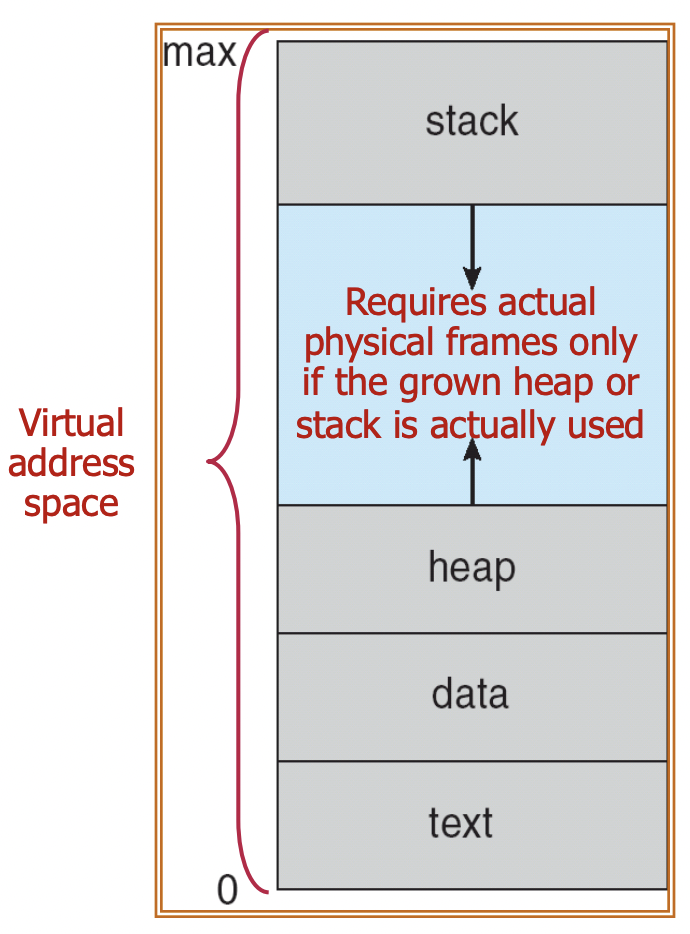

운영체제 공룡책, 10단원을 정리한다.

# 1. 가상 메모리

가상 메모리를 사용하면 프로그램이 메모리에 전부 올라와 있지 않아도 프로그램을 실행할 수 있도록 해준다. 그리고 프로그래머에게 실제 메모리보다 훨씬 큰 메모리를 사용할 수 있도록 해준다. 그로 인해 프로그래머가 물리 메모리의 크기를 걱정할 필요 없도록 해준다.

## 1.1 가상 주소 공간

가상 주소 공간(virtual address space)는 프로세스가 메모리에 논리적으로 어떻게 저장되는지를 의미한다. 흔히 우리가 보는 스택, 힙, 데이터, 코드 영역으로 구성된 공간이 바로 가상 주소 공간이다.

물론 이 공간들은 페이징으로 관리되므로 실제 물리 메모리에 연속적으로 저장되어 있지는 않다. 또한 스택과 힙 사이의 빈 공간도 실제로는 메모리를 차지하고 있지 않다. 스택이나 힙이 확장될 때 실제 물리적인 메모리를 요구하게 될 것이다. 이는 가상 주소 공간의 새 범위를 할당받는 방식으로 이루어진다.

가상 메모리를 사용하면 2개 이상의 프로세스들이 파일이나 메모리를 공유하는 것도 가능하다.

# 2. 요구 페이징

해당 페이지가 필요해질 때만 메모리에 적재하는 것이다. 즉 프로세스가 실행되는 동안 어떤 페이지는 메모리에, 어떤 페이지는 보조 저장 장치(디스크)에 있게 된다. 당연히 메모리를 더 효율적으로 사용할 수 있다.

## 2.1. valid/invalid bit

페이지 테이블의 각 엔트리에 valid/invalid bit를 추가한다. 단 앞에서 쓰인 것과 달리 이 비트는 페이지가 메모리에 있는지를 나타낸다. 이 비트가 0이면 해당 페이지가 유효하지 않거나 유효하지만 디스크에 있다는 것을 의미한다. 초기에 어떤 페이지도 적재되어 있지 않다면 모든 엔트리의 비트가 0으로 설정되어 있다.

## 2.2. 페이지 폴트

페이지 폴트(page fault)는 프로세스가 메모리에 없는 페이지를 참조할 때 발생한다. 접근하려는 페이지의 유효 비트가 0으로 설정되어 있으면 하드웨어가 페이지 폴트 트랩을 발생시키는 것이다.

이 트랩은 이렇게 처리한다.

1. 내부 테이블(일반적으로 Process Control Block에 있다)을 검사해서 그 참조가 유효한지 조사한다. 만약 무효한 참조라면 프로세스를 중단시킨다. 유효한 참조라면 그 페이지를 디스크에서 가져오는 동작을 취한다.
2. 디스크에서 페이지를 가져오기 위해 먼저 빈 프레임을 찾는다. 그리고 디스크에서 해당 프레임으로 페이지를 읽어 들인 후 페이지 테이블의 엔트리를 갱신한다. 
3. 아까 중단되었던 명령어를 재시작한다. **당연히 페이지 폴트 처리 후 명령어의 처리를 다시 시작할 수 있어야 한다.**

메모리에 페이지가 단 하나도 안 올라와 있는 상태라도 프로세스를 실행시킬 수 있는데 이렇게 되면 프로세스가 사용되는 모든 페이지가 메모리에 올라올 때까지 계속 페이지 폴트가 발생하게 된다. 이렇게 어떤 페이지가 필요해지기 전엔 절대 메모리로 적재하지 않는 걸 pure demand paging이라고 한다.

또한 위의 페이지 폴트 처리 과정에서 빈 프레임을 찾는 부분이 있다. 대부분의 운영체제는 이런 요청의 해결을 위해 가용 프레임들의 풀인 가용 프레임 리스트를 유지하고 있다. 시스템이 시작되면 모든 가용 메모리가 이 가용 프레임 리스트에 들어가게 된다.

## 2.3. 어려움

페이지 폴트를 처리하고 나면 명령어를 다시 시작해야 한다. 그런데 명령어가 특정 메모리 조각을 다른 장소로 이동하는 명령이라고 하자. 이때 src, dest가 겹칠 수도 있다. 이 경우 명령어를 단순히 재시작하면 오류가 발생할 것이다.

해결책은 두 가지다. 두 블록이 겹치는지 미리 확인 후 겹치면 페이지 폴트가 발생하도록 하는 방법이 있다. 또 하나는 이동에 의해 이전 내용이 지워질 부분을 임시 레지스터에 저장해 둔 후 나중에 복구시키는 방식이다.

## 2.4. 성능

페이지 폴트의 발생률은 당연히 0과 1 사이일 것이다. 그러면 페이지 폴트 발생률이 $p$라 할 때 Effective Access Time은 다음과 같다.

$$EAT = (1-p) \times Memory \ Access \ Time + p \times Page \ Fault \ Time$$

이때 페이지 폴트 시간은 다음과 같은 요소들로 이루어진다.

- 페이지 폴트 인터럽트를 처리하는 오버헤드
- 페이지의 swap in 시간
- 기존 페이지가 수정되었을 시 저장하는 데 걸리는 시간
- 명령어의 재시작(페이지 폴트 이후의 메모리 액세스 시간 포함)

이런 부분 때문에 페이지 폴트가 발생할 경우 성능이 크게 저하된다. 교과서의 예시에서는 그냥 메모리 접근 시간이 200ns($200 \times 10^{-9}s$), 페이지 폴트 발생시 평균 소요시간이 8ms($8 \times 10^{-3}s$)라고 가정한다. 엄청난 차이다. 하지만 요구 페이징을 할 경우 페이지 폴트가 아예 발생하지 않을 순 없다. 요구 페이징의 성능 저하를 줄이기 위해서는 페이지 폴트를 줄여야 한다.

## 2.5. Copy-on-Write

fork 명령은 부모 프로세스의 복사본인 자식 프로세스를 생성한다. 하지만 만약 fork 다음에 바로 exec 명령이 실행된다면 부모 프로세스를 복사한 페이지들은 다 쓸모없어진다. Copy on Write는 자식 프로세스가 fork로 시작될 때 부모의 페이지를 당분간 함께 사용하도록 하는 방식이다.

그리고 부모나 자식 프로세스가 이렇게 공유되고 있는 페이지들 중 하나를 수정하면 딱 그 수정된 페이지만 복사되는 것이다. 수정되지 않은 페이지들은 여전히 부모와 자식 프로세스 간에 공유되는 것이다.

수정된 페이지만이 복사되므로 프로세스 생성 시 더 효율적인 동작이 가능해진다.

# 3. 페이지 교체

프로세스가 실행되는 중에 페이지 폴트가 발생했다. 그런데 가용 프레임이 없다. 이럴 때 어떻게 해야 할까? 이런 상황을 해결하기 위해 페이지 교체라는 개념이 등장한다.

물론 어떤 페이지를 교체할지 고르는 것도 중요하지만 일단 페이지 교체 알고리즘은 좀 이따 보고 기본적인 페이지 교체가 어떻게 돌아가는지 살펴보자.

## 3.1. 페이지 교체의 구조

